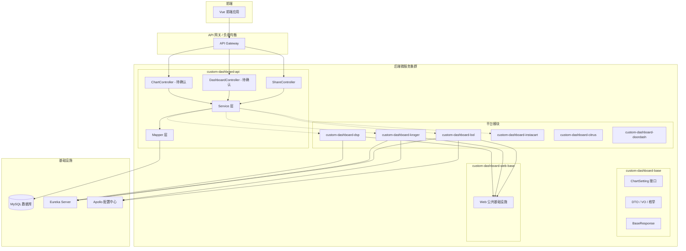
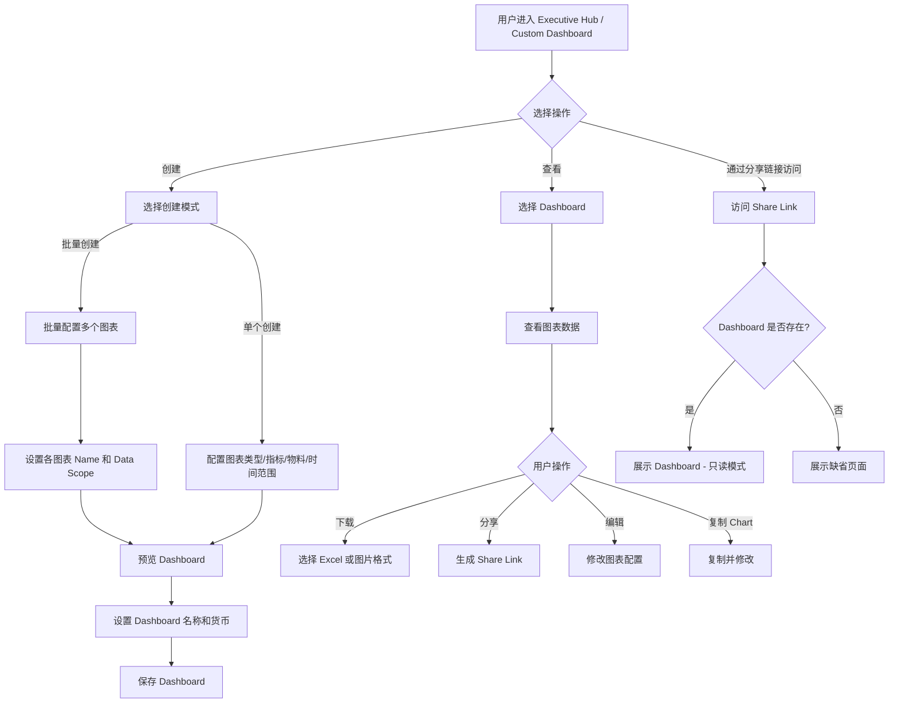
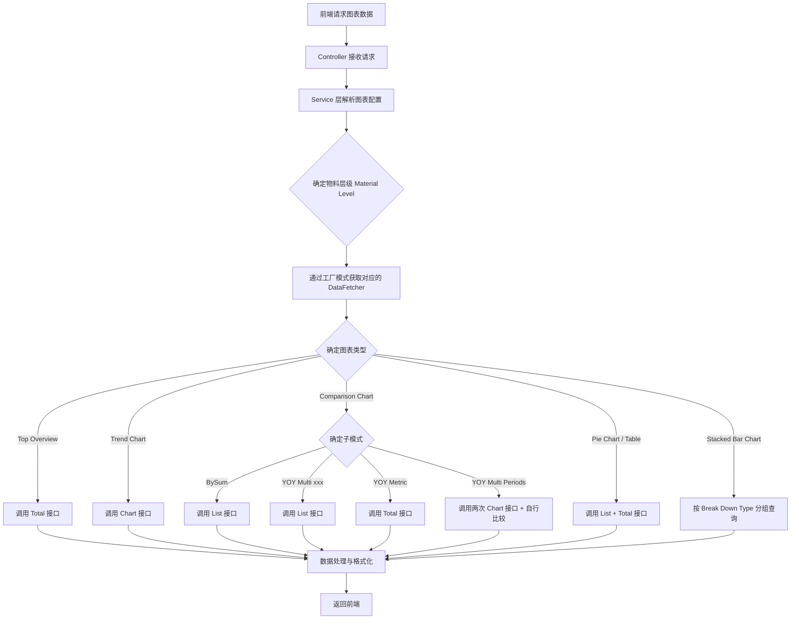
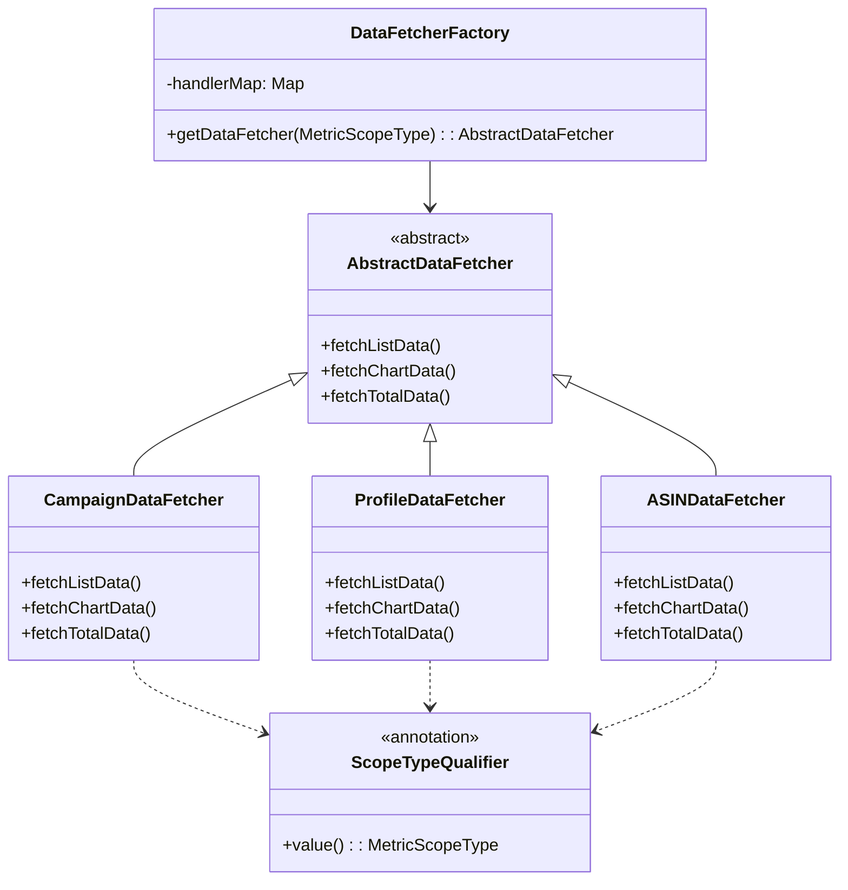
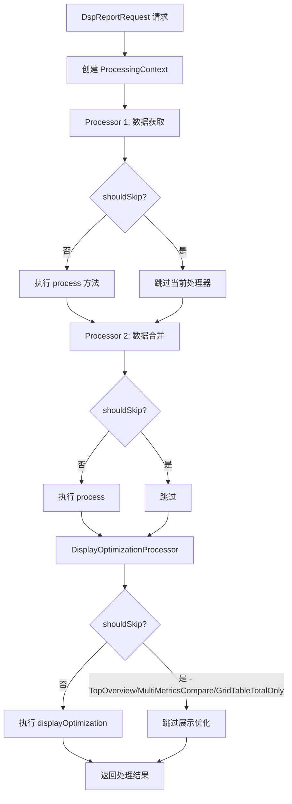
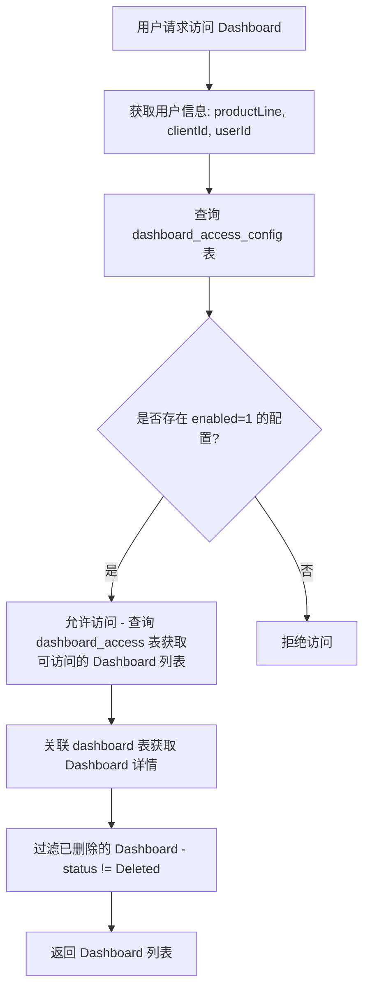
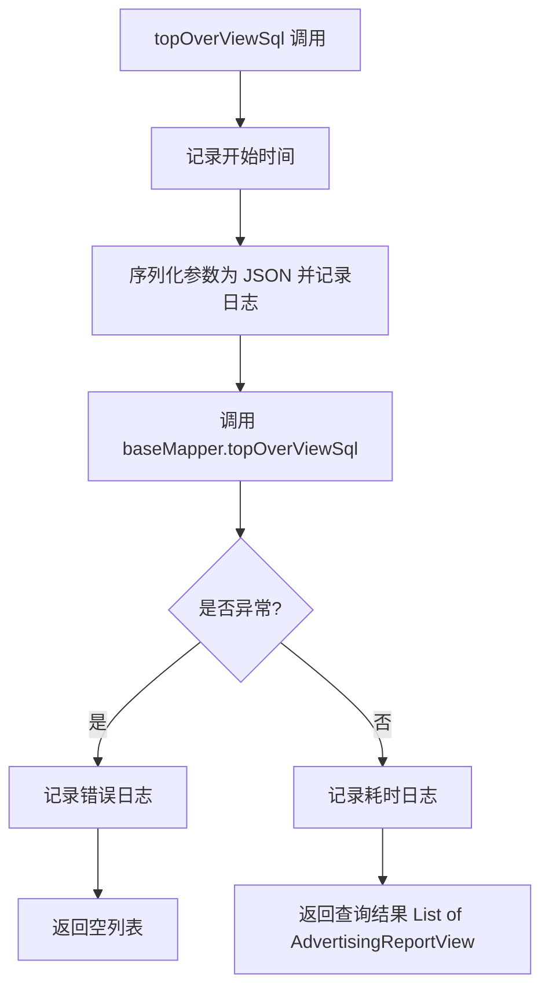

# Custom Dashboard 全局架构总览 功能逻辑文档

> 本文档由 document-automation 工具自动生成，基于源代码、PRD 文档和技术评审文档。
> 生成时间: 2026-04-07 15:52:24
> 准确性评分: 未验证/100

---


# Custom Dashboard 全局架构总览 功能逻辑文档

## 1. 模块概述

### 1.1 职责与定位

Custom Dashboard 是 Pacvue 平台中的一个核心功能模块，允许用户根据自身需求自定义仪表盘布局和内容。用户可以选择需要展示的指标卡片、调整卡片大小和排列顺序，从而构建出最符合自己需求的个性化数据视图，以更高效地关注和分析营销数据。

系统的本质是将 Advertising 页面上的各种数据接口进行"排列组合"，通过不同的图表类型（Trend Chart、Top Overview、Comparison Chart、Pie Chart、Table 等）将多零售商/DSP 广告数据以可视化方式呈现给用户。

### 1.2 系统架构位置

Custom Dashboard 作为 Pacvue 平台的子系统，位于 Executive Hub（原独立入口保留）中，是一个多模块 Java 后端 + Vue 前端的自定义仪表盘系统。系统通过微服务架构与 Pacvue 平台其他服务交互，使用 Eureka 进行服务注册与发现。

### 1.3 后端模块结构

根据代码和 POM 文件分析，后端采用 Maven 多模块结构，父工程为 `com.pacvue:custom-dashboard:1.0`，已确认的子模块包括：

| 模块名 | artifactId | 职责描述 |
|--------|-----------|---------|
| API 层 | `custom-dashboard-api`（推测） | 包含 Controller、Service、Mapper，承载核心业务逻辑 |
| Web 基础层 | `custom-dashboard-web-base` | 公共 Web 基础设施，被各平台模块依赖 |
| 基础公共层 | `custom-dashboard-base`（推测） | 包含 DTO、图表设置接口（ChartSetting）、通用模型等 |
| DSP 模块 | `custom-dashboard-dsp`（推测） | DSP 广告平台数据处理层，包含 Processor 处理器链 |
| BOL 模块 | `custom-dashboard-bol` | BOL（Bol.com）平台数据处理，依赖 `custom-dashboard-web-base` |
| Kroger 模块 | `custom-dashboard-kroger` | Kroger 平台数据处理 |
| Instacart 模块 | `custom-dashboard-instacart`（推测） | Instacart 平台数据处理 |
| Citrus 模块 | `custom-dashboard-citrus`（推测） | Citrus 平台数据处理 |
| Doordash 模块 | `custom-dashboard-doordash`（推测） | Doordash 平台数据处理 |

> **说明**：标注"推测"的模块名基于代码片段和 PRD 文档推断，具体 artifactId 待确认。

### 1.4 技术栈

| 层面 | 技术选型 |
|------|---------|
| 语言 | Java 17 |
| 框架 | Spring Boot 3.x + Spring Cloud |
| 服务注册 | Netflix Eureka Client |
| ORM | MyBatis-Plus（ActiveRecord 模式） |
| 配置中心 | Apollo（携程 Apollo Client 2.0.1） |
| 前端 | Vue（具体版本待确认） |
| 构建工具 | Maven |
| 单元测试 | Spock 2.4-M1（Groovy 4.0）+ Mockito 5.3.1 |
| 工具库 | Lombok、Hutool（CollUtil）、Guava（Lists） |
| ID 生成 | Snowflake（雪花算法） |

### 1.5 部署方式

每个平台模块（如 `custom-dashboard-bol`、`custom-dashboard-kroger`）均配置了 `spring-boot-maven-plugin` 的 `repackage` 目标，说明每个平台模块可独立打包为可执行 JAR 进行部署。各模块通过 Eureka 进行服务注册与发现，形成微服务集群。

`custom-dashboard-kroger` 的 POM 中配置了 `<maven.deploy.skip>true</maven.deploy.skip>`，表明该模块不发布到 Maven 仓库，仅作为独立部署单元。

### 1.6 整体架构图



## 2. 用户视角

### 2.1 功能场景总览

基于 PRD V1.1 ~ V2.10 的迭代，Custom Dashboard 支持以下核心功能场景：

#### 2.1.1 Dashboard 管理
- **创建 Dashboard**：支持单个创建和批量模式创建。批量模式下可一次性配置多个图表的名称和数据范围（Data Scope）
- **编辑 Dashboard**：修改 Dashboard 名称、货币设置、图表排序、图表配置等
- **删除 Dashboard**：软删除，状态标记为 `Deleted`
- **复制 Chart**（V2.9）：在创建/编辑 Dashboard 时，可复制已有图表，新图表名称自动追加 "- Copy"

#### 2.1.2 图表类型
系统支持以下图表类型（ChartType 枚举）：

| 图表类型 | 说明 | 数据接口来源 |
|---------|------|------------|
| **Top Overview** | 顶部概览卡片，展示关键指标汇总 | Total 接口 |
| **Trend Chart**（原 Line Chart） | 趋势图，支持折线/柱状/曲线带阴影/曲线不带阴影 | Chart 接口 |
| **Comparison Chart**（原 Bar Chart） | 对比图，支持 BySum / YOY Multi xxx / YOY Metric / YOY Multi Periods / POP 等模式 | List 接口 / Total 接口 / 双次 Chart 接口 |
| **Stacked Bar Chart** | 堆叠柱状图（目前 Amazon 专属） | 按 Break Down Type 分组查询 |
| **Pie Chart** | 饼图，只能选一个指标 | List + Total 接口 |
| **Table** | 表格，可选多个指标，支持半屏/全屏 | List + Total 接口 |
| **White Board** | 白板（自由文本区域） | 无数据接口 |

#### 2.1.3 数据源
- **Advertising 数据源**：各零售商的广告数据（Amazon、Instacart、Kroger、BOL、Citrus、Doordash 等）
- **DSP 数据源**（V1.2 新增）：DSP 广告平台数据
- **Commerce 数据源**：支持 3P 数据（V2.6 新增）

#### 2.1.4 物料层级（Material Level）
| 物料层级 | 说明 |
|---------|------|
| Profile | V1.2 新增 |
| Campaign | 基础物料 |
| Campaign Tag | 基础物料 |
| Campaign Parent Tag | V1.2 新增，只展示父 Tag 级别 |
| ASIN | 基础物料 |
| ASIN Tag | 基础物料 |
| ASIN Parent Tag | V1.2 新增 |
| Campaign Type | V2.4 新增，可直接作为 Material Level |
| Placement | V2.4 新增 |
| Cross Retailer | V2.4 新增，一行/一根线代表一个 Retailer |

#### 2.1.5 分享功能（V1.1）
- 在 Dashboard 列表页悬浮到表格方块可展示"分享"按钮
- 点击后弹窗展示 Share Link，提供一键复制
- 访问 Share Link 时去掉面包屑和 Edit Dashboard 按钮
- 如果 Dashboard 被删除，访问链接时进入缺省页面

#### 2.1.6 下载功能（V2.4）
- 支持下载为 Excel
- 支持下载为图片（无底色，V2.9 优化为默认无底色）

#### 2.1.7 时间对比
- POP（Period over Period）
- YOY（Year over Year）
- 自定义对比时间范围（V2.4 新增，如今年 PD vs 去年 PD）

### 2.2 用户操作流程



### 2.3 UI 交互要点

1. **Dashboard 列表页**：展示用户创建的所有 Dashboard，支持缩略图预览
2. **图表配置弹窗**：选择图表类型 → 选择指标 → 选择物料层级和数据范围 → 选择时间范围 → 选择图表样式
3. **批量设置规则**：
   - Material Level 一致且都是 custom 模式时，可批量设置 Data Scope
   - Material Level 不一致时不可批量设置，需提示原因
   - Pie Chart 和 Table 如果都是 top x / bottom x / top x mover，可放在一起设置
4. **Tips 自动生成**（V2.6）：根据图表配置自动生成描述性文字，如 "The {Impression} for each {campaign tag} individually"
5. **Label 自动生成**（V2.4）：根据 Chart 配置自动生成 Label
6. **Table 字段自定义排序**（V2.6）
7. **Chart 阴影选项**（V2.9）：曲线带阴影、曲线不带阴影、柱状三种样式

## 3. 核心 API

### 3.1 已确认的 REST 端点

#### 3.1.1 ShareController

| 方法 | 路径 | 描述 | 请求参数 | 返回值 |
|------|------|------|---------|--------|
| POST | `/getCustomMetricOverview` | 获取自定义指标概览数据（通过分享链接访问） | `ShareRequest`（包含 `dashboardId: Long`） | `BaseResponse<List<CustomMetricOverviewResponse>>` |

**接口逻辑**：
1. 从 `ShareRequest` 中获取 `dashboardId`
2. 如果 `dashboardId` 为 null，直接返回空列表
3. 否则调用 `chartService.getCustomMetricOverview(dashboardId)` 获取数据
4. 使用 `BaseResponse.ok()` 统一封装返回

**响应结构**：
```json
{
  "code": 200,
  "data": [
    {
      "id": "图表ID",
      "customMetrics": ["指标ID列表"],
      "ifCustomMetricDeleted": false
    }
  ]
}
```

#### 3.1.2 推测存在但未在代码片段中直接出现的端点

基于系统功能推测，以下端点应当存在（**待确认**）：

| 方法 | 路径（推测） | 描述 |
|------|------------|------|
| POST | `/dashboard/create` | 创建 Dashboard |
| POST | `/dashboard/update` | 更新 Dashboard |
| POST | `/dashboard/delete` | 删除 Dashboard |
| GET | `/dashboard/list` | 获取 Dashboard 列表 |
| POST | `/chart/create` | 创建图表 |
| POST | `/chart/update` | 更新图表 |
| POST | `/chart/data` | 获取图表数据 |
| POST | `/share/create` | 创建分享链接 |
| POST | `/access/config` | 配置访问权限 |
| POST | `/chart/download/excel` | 下载图表为 Excel |
| POST | `/chart/download/image` | 下载图表为图片 |

### 3.2 统一响应封装

系统使用 `BaseResponse<T>` 作为统一响应封装：

```java
BaseResponse.ok(data)  // 成功响应
BaseResponse.ok(Lists.newArrayList())  // 空列表响应
```

## 4. 核心业务流程

### 4.1 图表数据查询流程

根据交接文档描述，图表数据查询的核心逻辑是根据物料层级（Material Level）和图表类型，调用不同的底层数据接口：



### 4.2 数据获取策略模式

系统采用**工厂模式 + 策略模式**来处理不同物料层级的数据获取：



**设计要点**：
- 通过 `ScopeTypeQualifier` 注解实现 `MetricScopeType` 到 `AbstractDataFetcher` 的动态映射
- 工厂自动扫描 `AbstractDataFetcher` 的实现类并注册到 `handlerMap` 中
- 新增物料类型只需新增实现类，无需修改工厂逻辑（符合开闭原则）

### 4.3 DSP 报表处理器链

DSP 模块采用**处理器模式（Processor Chain）**处理报表数据：



**DisplayOptimizationProcessor 跳过条件**：
```java
// 当请求是 TopOverview 或 MultiMetricsCompare 类型时跳过
// 当请求是 GridTable 且仅查询 Total 时跳过
DspReportHelper.isTopOverviewOrMultiMetricsCompare(ctx.getSource())
    || DspReportHelper.isGridTableQueryTotalOnly(ctx.getSource())
```

**处理器接口定义**：
```java
public interface Processor<Source, Result> {
    boolean shouldSkip(ProcessingContext<Source, Result> ctx);
    void process(ProcessingContext<Source, Result> ctx) throws Throwable;
}
```

**ProcessingContext** 是泛型设计的上下文对象，支持：
- `getSource()` - 获取原始请求
- `getAttribute(ContextAttributeKey)` - 获取处理过程中的中间结果（如 `MERGED_REPORT`）

### 4.4 访问权限控制流程



### 4.5 Top Overview 数据查询流程



### 4.6 指标映射解析流程

`MainMetricMapping` 类负责根据平台（Platform）和指标范围类型（MetricScopeType）查找匹配的映射关系：

```java
// 通过 source platform + scopeX + scopeY 构建 mappingKey
// 从 LOOKUP_MAP 中查找对应的 MainMetricMapping
MainMetricMapping mapping = MainMetricMapping.resolveMapping(platform, scopeX, scopeY);
```

`getWriteBackScope` 方法根据是否为 Total 查询决定返回 scopeY（列查询）还是 scopeX。

### 4.7 Cross Retailer 判断逻辑

`ChartSetting` 接口定义了 `isCrossRetailer()` 方法，`TopOverviewSetting` 的实现逻辑为：

```java
// 只要 metrics 列表中任意一个 Metric 的 isCrossRetailer 为 true，
// 则整个图表设置被视为 Cross Retailer
this.metrics.stream().anyMatch(Metric::isCrossRetailer);
```

## 5. 数据模型

### 5.1 数据库表结构

#### 5.1.1 dashboard 表

| 字段 | 类型 | 说明 |
|------|------|------|
| id | long | Snowflake ID |
| product_line | varchar | 产线平台 |
| client_id | int | Client ID |
| user_id | int | User ID |
| name | varchar | Dashboard 名称 |
| group_id | long/int（待确认） | 分组 ID |
| status | varchar | Enable / Deleted |
| update_time | timestamp | 更新时间 |
| create_time | timestamp | 创建时间 |

#### 5.1.2 chart 表

| 字段 | 类型 | 说明 |
|------|------|------|
| id | long | Snowflake ID |
| dashboard_id | long | 所属 Dashboard ID |
| type | varchar | 图表类型：TopOverview / TrendChart / ComparisonChart / StackedBarChart / PieChart / Table / WhiteBoard |
| setting | longtext | 图表配置 JSON（详见 5.3 节） |
| status | varchar | Enable / Deleted |
| update_time | timestamp | 更新时间 |
| create_time | timestamp | 创建时间 |

#### 5.1.3 dashboard_access_config 表

| 字段 | 类型 | 说明 |
|------|------|------|
| id | long | 主键 |
| product_line | varchar | 产线平台 |
| client_id | int | Client ID |
| user_id | int | User ID |
| enabled | int/tinyint | 是否启用（1=启用） |
| create_time | timestamp | 创建时间 |
| update_time | timestamp | 更新时间 |
| create_by | varchar/int | 创建人 |
| update_by | varchar/int | 更新人 |

**查询条件**：支持按 `productLine`、`clientId`、`userId`、`ids` 组合条件查询，结果按 `update_time DESC` 排序。

#### 5.1.4 dashboard_access 表

| 字段 | 类型 | 说明 |
|------|------|------|
| id | long | 主键 |
| product_line | varchar | 产线平台 |
| client_id | int | Client ID |
| user_id | int | User ID |
| dashboard_id | long | 关联的 Dashboard ID |
| status | varchar | Enabled / 其他状态 |
| create_time | timestamp | 创建时间 |
| update_time | timestamp | 更新时间 |
| create_by | varchar/int | 创建人 |
| update_by | varchar/int | 更新人 |

**查询逻辑**：`dashboard_access` 表通过 `RIGHT JOIN dashboard` 关联查询，过滤条件为 `da.status = 'Enabled' AND d.status != 'Deleted'`，返回 `DashBoardAccessInfo` DTO（包含 dashboardId、dashboardName、groupId 等）。

> **注意**：`dashboard_access_config` 使用 `enabled = 1` 作为启用判断，而 `dashboard_access` 使用 `status = 'Enabled'` 字符串，两张表的启用状态字段设计不一致。

### 5.2 核心类/DTO/VO

#### 5.2.1 实体类

**DashboardAccessConfig**
```java
@TableName
@Data
public class DashboardAccessConfig extends Model<DashboardAccessConfig> {
    @TableId(type = IdType.xxx)  // 具体 ID 类型待确认
    private Long id;
    private String productLine;
    private Integer clientId;
    private Integer userId;
    private Integer enabled;
    private LocalDateTime createTime;
    private LocalDateTime updateTime;
    private String createBy;
    private String updateBy;
}
```
继承 MyBatis-Plus 的 `Model<DashboardAccessConfig>`，使用 ActiveRecord 模式，可直接通过实体对象进行 CRUD 操作。

#### 5.2.2 请求/响应 DTO

| 类名 | 用途 | 关键字段 |
|------|------|---------|
| `ShareRequest` | 分享链接请求 | `dashboardId: Long` |
| `CustomMetricOverviewResponse` | 自定义指标概览响应 | `id`, `customMetrics: List`, `ifCustomMetricDeleted: Boolean` |
| `BaseResponse<T>` | 统一响应封装 | `code`, `data: T`, `message`（推测） |
| `DashBoardAccessInfo` | Dashboard 访问信息 | `id`, `productLine`, `clientId`, `userId`, `dashboardId`, `dashboardName`, `groupId`, `status`, `createTime`, `updateTime`, `createBy`, `updateBy` |
| `DspReportRequest` | DSP 报表请求 | `dateFormat` 及其他字段（待确认） |
| `DSPReportModel` | DSP 报表模型 | 待确认 |
| `AdvertisingReportRequest` | 广告报表请求 | 待确认 |
| `Advertising

---

*本文档由 AI 自动生成，如有不准确之处请以源代码为准。标注"待确认"的内容需要人工核实。*