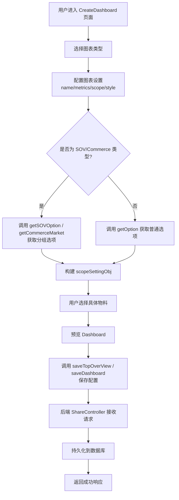
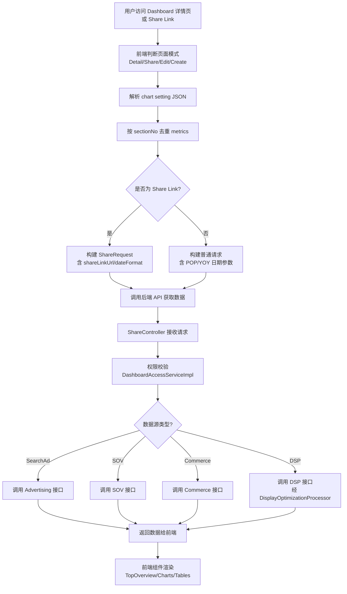
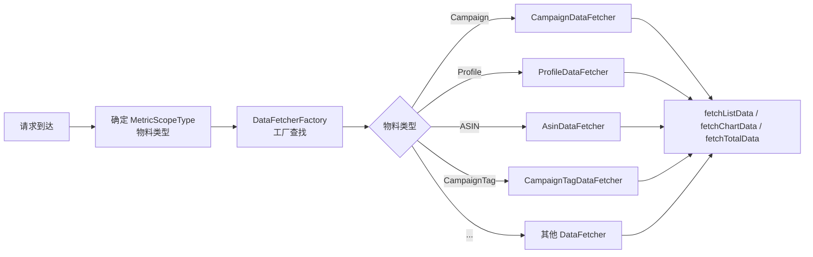
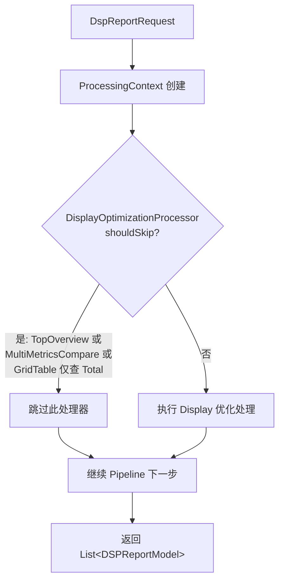
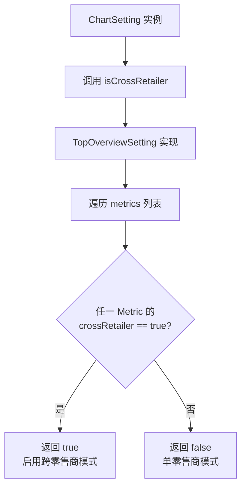
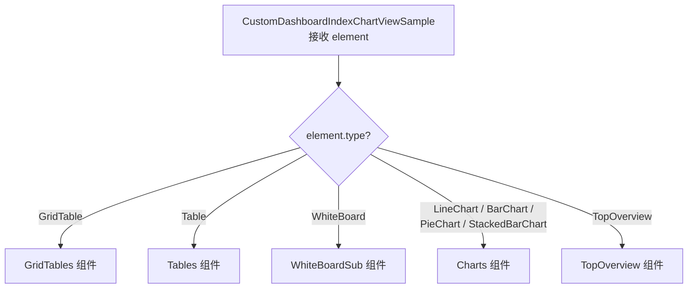

# Custom Dashboard 全局架构总览 功能逻辑文档

> 本文档由 document-automation 工具自动生成，基于源代码、PRD 文档和技术评审文档。
> 生成时间: 2026-04-09 09:39:52
> 准确性评分: 未验证/100

---


# Custom Dashboard 全局架构总览 功能逻辑文档

## 1. 模块概述

### 1.1 模块职责与定位

Custom Dashboard 是 Pacvue 平台中的可定制化数据看板系统，允许用户根据自身需求创建个性化的数据仪表盘。用户可以自由选择展示的指标卡片、调整卡片大小和排列顺序，从而构建出最符合自己需求的数据视图。系统支持多零售商平台（Amazon、Walmart、DSP、Instacart、Citrus、BOL、Doordash 等），提供跨平台指标对比能力。

核心能力包括：
- **多类型组件**：TopOverview（指标概览）、Trend Chart（折线图/柱状图）、Comparison Chart（对比图）、StackedBarChart（堆叠柱状图）、PieChart（饼图）、Table（表格）、GridTable（网格表格）、WhiteBoard（白板）
- **模板管理**：支持 Dashboard 模板的创建、批量应用
- **分享链接**：支持生成 Share Link，外部用户可通过链接访问 Dashboard
- **跨平台对比**：Cross Retailer 模式，在同一图表中对比不同零售商的数据
- **时间对比**：支持 POP（Period over Period）和 YOY（Year over Year）对比，且对比时间范围支持自定义
- **下载导出**：支持将图表下载为 Excel 或无底色图片

### 1.2 系统架构位置

Custom Dashboard 在 Pacvue 整体架构中属于**数据展示层**，位于 Advertising 数据服务之上。其本质是对 Advertising 页面上各种数据接口的"排列组合"（Commerce 专属接口除外），通过统一的配置化方式将不同数据源的查询结果组装到用户自定义的看板中。

上游依赖：
- **Advertising 数据服务**：提供 SearchAd（搜索广告）相关的 Chart/Total/List 接口
- **SOV 数据服务**：提供 Share of Voice 相关数据
- **Commerce 数据服务**：提供电商市场数据（含 3P 数据）
- **DSP 数据服务**：提供 DSP 程序化广告数据

下游消费者：
- **前端 Vue 应用**：渲染可视化图表
- **Share Link 访问者**：通过分享链接查看 Dashboard

### 1.3 后端模块结构

从代码片段中的包名和类分布推断，后端采用**多模块 Maven 架构**：

| 模块名 | 职责 | 关键类 |
|--------|------|--------|
| `custom-dashboard-api` | 接口层，包含 Controller 和 API 定义 | `ShareController`、`DashboardAccessConfigMapper` |
| `custom-dashboard-base` | 基础层，包含 DTO、接口定义、通用模型 | `ChartSetting`（接口）、`TopOverviewSetting`、`Metric`、`ChartType`（枚举）、`BasicInfo` |
| `custom-dashboard-dsp` | DSP 平台数据处理层 | `DisplayOptimizationProcessor`、`DspReportHelper`、`DspReportRequest`、`DSPReportModel` |

包名结构（从代码推断）：
- `com.pacvue.api.controller` — Controller 层
- `com.pacvue.api.model` — 数据库实体（如 `DashboardAccessConfig`）
- `com.pacvue.api.mapper` — MyBatis Mapper 接口和 XML
- `com.pacvue.api.dto.response` — 响应 DTO（如 `DashBoardAccessInfo`）

**Maven 坐标和部署方式**：**待确认**，代码片段中未直接展示 `pom.xml` 信息。从多模块结构推测为 Spring Boot 微服务部署。

### 1.4 前端组件结构

前端基于 Vue 3 + Pinia（Store）架构：

| 组件/文件 | 职责 |
|-----------|------|
| `Dashboard/CreateDashboard.vue` | 仪表盘创建/编辑主页面，核心逻辑入口 |
| `dashboardSub/TopOverview.vue` | TopOverview 指标概览组件 |
| `dashboardSub/ChartsAll.vue` | 图表通用组件（Trend Chart/Comparison Chart） |
| `components/CustomDashboardIndexChartViewSample.vue` | 图表预览容器，按 type 分发渲染 |
| `GridTables` | 网格表格组件 |
| `Tables` | 普通表格组件 |
| `WhiteBoardSub` | 白板组件（支持插入图片） |
| `Charts` | 折线图/柱状图/饼图/堆叠柱状图组件 |
| `api/index.js` | API 调用封装层 |
| `customDashboardStore` | Pinia Store，集中管理状态与异步数据获取 |

### 1.5 设计模式总览

| 设计模式 | 应用位置 | 说明 |
|----------|----------|------|
| **Strategy（策略）模式** | `ChartSetting` 接口 + 各实现类 | 不同图表类型（TopOverview、LineChart 等）实现统一接口，提供 `isCrossRetailer()`、`getChartType()` 等方法 |
| **Factory（工厂）模式** | 后端数据获取层 | 根据物料类型（MetricScopeType）创建对应的 `AbstractDataFetcher` 实现类，替代大量 switch-case |
| **Processor/Pipeline 模式** | DSP 数据处理 | `DisplayOptimizationProcessor` 实现 `Processor` 接口，配合 `ProcessingContext` 上下文，含 `shouldSkip` 跳过逻辑 |
| **ActiveRecord 模式** | `DashboardAccessConfig` | 继承 MyBatis-Plus `Model<T>`，实体自身具备 CRUD 能力 |
| **组件化模式（前端）** | `CustomDashboardIndexChartViewSample.vue` | 通过 `v-if` 条件渲染不同子组件 |
| **Store 模式（前端）** | `customDashboardStore` | Pinia Store 集中管理状态 |

---

## 2. 用户视角

### 2.1 功能场景总览

基于 PRD 文档（V1.1 → V2.0 → V2.4 → V2.6 → V2.9 → V2.10 → 25Q4-S4），Custom Dashboard 的功能场景可归纳为以下几大类：

#### 场景一：创建 Dashboard

**用户操作流程：**

1. 用户进入 Custom Dashboard 模块（位于 Advertising 或 Executive Hub / Pacvue HQ 入口）
2. 点击"Create Dashboard"按钮
3. **选择创建模式**：
   - **单个创建模式**：逐个添加图表组件
   - **批量创建模式**（V2.0 新增）：一次性配置多个图表
4. **配置图表组件**：
   - 选择图表类型（TopOverview / Trend Chart / Comparison Chart / StackedBarChart / PieChart / Table / GridTable / WhiteBoard）
   - 设置图表名称（V2.4 支持自动生成 Label）
   - 选择 Material Level（物料层级）：Profile / Campaign / Campaign Tag / Campaign Parent Tag / ASIN / ASIN Tag / ASIN Parent Tag / Cross Retailer 等
   - 选择 Data Scope（数据范围）：具体的 Profile、Campaign、ASIN 等
   - 选择指标（Metrics）
   - 设置图表样式（曲线带阴影 / 曲线不带阴影 / 柱状，V2.9 新增）
5. **批量设置 Data Scope**（V2.0）：
   - 若多个图表的 Material Level 一致且都是 custom 模式，可批量勾选后统一设置
   - 若 Material Level 不一致，系统提示不可批量设置
   - Pie Chart 和 Table 若都是 top x / bottom x / top x mover 模式，可放在一起设置
6. **预览 Dashboard**：
   - 查看整体布局，可自由拖拽调整图表位置和大小
   - 每个图表下方展示所选的 Data Scope 信息
   - 设置 Dashboard 名称和 Currency（货币）
7. **保存 Dashboard**

#### 场景二：编辑 Dashboard

1. 在 Dashboard 列表页选择已有 Dashboard
2. 点击"Edit Dashboard"进入编辑模式
3. 可修改图表配置、添加/删除图表、调整布局
4. **复制图表**（V2.9 新增）：点击图表右上角复制按钮，弹出创建弹窗，名称自动加" - Copy"后缀，其余配置与原图表一致，保存后新图表出现在原图表下一顺位
5. 保存修改

#### 场景三：查看 Dashboard

1. 在列表页点击 Dashboard 进入详情页
2. 系统根据配置加载各组件数据
3. 支持日期范围选择和 POP/YOY 对比联动
4. 支持自定义对比时间范围（V2.4 新增，如今年 PD 对比去年 PD）
5. Trend 图表展示时支持 D/W/M（日/周/月）快捷切换按钮（25Q4-S4 新增）

#### 场景四：分享 Dashboard（V1.1）

1. 在 Dashboard 列表页，悬浮到表格方块展示"分享"按钮
2. 点击后弹窗展示 Share Link，提供一键复制按钮
3. 访问 Share Link 时：
   - 去掉面包屑和 Edit Dashboard 按钮
   - 如果 Dashboard 已被删除，显示缺省页面
4. 分享场景下通过 `ShareRequest` 携带 `shareLinkUrl` 获取数据

#### 场景五：下载导出（V2.4）

1. 点击图表上的下载按钮
2. 选择下载格式：
   - **Excel**：按图表类型生成对应格式的 Excel 文件
   - **图片**：下载无底色图片（V2.9 优化，默认无底色，方便粘贴到 PPT）

#### 场景六：模板管理（V2.0）

1. 支持将 Dashboard 保存为模板
2. 支持从模板列表选择模板批量应用到新 Dashboard

#### 场景七：Cross Retailer 对比（V2.4）

1. 在图表配置中选择 Cross Retailer 作为 Material Level
2. **Table**：每一行代表一个 Retailer
3. **Trend Chart**：每一根线代表一个 Retailer，或多个 Retailer 数据总和

#### 场景八：WhiteBoard 白板

1. 支持在 Dashboard 中添加白板组件
2. 可插入图片（25Q4-S4 新增）
3. 自由编辑文本内容

#### 场景九：Overview 进度条样式（25Q4-S4）

1. TopOverview 新增 Target Progress（进度条）展示样式
2. 新增 Target Compare 样式
3. 原有样式改名为 Regular

### 2.2 UI 交互要点

基于 Figma 设计稿和前端代码：

- **顶部导航栏**：包含 Custom Dashboard 入口，位于 Advertising 菜单下
- **Dashboard 列表页**：展示所有 Dashboard 的卡片/列表视图，支持多选操作
- **日期筛选器**：显示日期范围（如 "02/13/2020 ~ 02/18/2020"），支持 POP/YOY 对比日期设置
- **图表预览容器**（`CustomDashboardIndexChartViewSample.vue`）：根据 `element.type` 分发渲染不同组件，支持宽度类（`getWidthClass`）和高度类（`getHeightClass`）的动态设置
- **Table 样式设置**（V1.1）：支持半屏和全屏两种模式

### 2.3 PRD 与代码交叉验证

| PRD 功能 | 代码实现证据 |
|----------|-------------|
| Share Link | `ShareController` + `ShareRequest` + 前端 `isShareLink` 路由判断 |
| TopOverview YOY/POP | `initTopOverview` 中 `popOrYoy` 参数构建 |
| Cross Retailer | `ChartSetting.isCrossRetailer()` + `Metric.crossRetailer` 属性 |
| 多图表类型 | `CustomDashboardIndexChartViewSample.vue` 中 v-if 分发 |
| 自定义对比时间 | `customDashboardStore.customCompareDate` |
| 下载为图片/Excel | **待确认**，代码片段中未直接展示下载实现 |
| 批量创建模式 | **待确认**，代码片段中未直接展示批量创建逻辑 |
| 复制图表 | **待确认**，代码片段中未直接展示复制逻辑 |

---

## 3. 核心 API

### 3.1 已确认的 REST 端点

#### 3.1.1 获取自定义指标概览数据

- **路径**: `POST /customDashboard/getCustomMetricOverview`
- **Controller**: `ShareController`
- **参数**:
  - Request Body: `ShareRequest`
    - `dashboardId` (Long): 仪表盘 ID，必填。若为 null 返回空列表
  - **注意**：前端调用时实际使用 GET 方式传递 `dashboardId` 作为 query 参数（见 `index.js.getCustomMetricOverview`），但后端注解为 `@PostMapping` 并接收 `@RequestBody`。这可能存在前后端不一致的情况，**待确认**是否有额外的 GET 映射或前端实际发送的是 POST 请求
- **返回值**: `BaseResponse<List<CustomMetricOverviewResponse>>`
- **说明**: 获取 Dashboard 中所有自定义指标的概览数据，由 `chartService.getCustomMetricOverview(dashboardId)` 处理

**前端调用方式**（`api/index.js`）：
```javascript
getCustomMetricOverview(id) {
  return request({
    url: `${VITE_APP_CustomDashbord}customDashboard/getCustomMetricOverview?dashboardId=${id}`,
    method: "get"
  })
}
```

#### 3.1.2 保存 TopOverview 组件配置

- **路径**: `POST /customDashboard/saveTopOverview`
- **Controller**: `ShareController`
- **参数**: Request Body，具体 DTO 结构**待确认**（前端传递 `data` 对象）
- **返回值**: **待确认**
- **说明**: 保存 TopOverview 组件的配置信息

**前端调用方式**（`api/index.js`）：
```javascript
saveTopOverView(data) {
  return request({
    url: `${VITE_APP_CustomDashbord}customDashboard/saveTopOverview`,
    method: "post",
    data: data,
    isIgnoreRequestRegister: true  // 忽略请求注册（防重复提交机制）
  })
}
```

#### 3.1.3 其他推断的 API 端点

基于技术交接文档中描述的数据获取模式，以下端点应当存在但代码片段中未直接展示：

| 推断路径 | 说明 | 依据 |
|----------|------|------|
| `POST /customDashboard/saveDashboard` | 保存/创建 Dashboard | 前端 CreateDashboard 页面需要 |
| `GET /customDashboard/getDashboard` | 获取 Dashboard 详情 | 详情页加载需要 |
| `GET /customDashboard/listDashboard` | 获取 Dashboard 列表 | 列表页需要 |
| `POST /customDashboard/deleteDashboard` | 删除 Dashboard | 列表页操作需要 |
| `POST /customDashboard/shareLink` | 生成分享链接 | V1.1 分享功能 |
| `POST /customDashboard/getChartData` | 获取图表数据 | 各图表组件数据加载 |

**以上均为推断，待确认。**

### 3.2 前端 API 基础配置

前端 API 调用使用 `VITE_APP_CustomDashbord` 环境变量作为基础路径前缀，通过统一的 `request` 函数发送请求。`isIgnoreRequestRegister: true` 标志用于跳过请求防重复注册机制。

---

## 4. 核心业务流程

### 4.1 Dashboard 创建/编辑流程



#### 4.1.1 getTopOverviewData 详细逻辑

`CreateDashboard.vue` 中的 `getTopOverviewData` 函数是 TopOverview 组件数据初始化的核心逻辑：

1. **遍历 metrics 配置**：对 `element.settingObj.metrics` 数组中的每个 metric 并行处理（`Promise.all`）
2. **创建 Section**：根据 `metric.sectionNo` 创建或获取对应的 Section 对象（通过 `ensureSection` 函数）
3. **设置 Section 基础属性**：
   - `name`：metric 名称
   - `scopeData`：`[groupLevel, scopeList[num].type]` 数组，其中 `num` 根据 scopeList 长度决定（长度 > 1 时取索引 1，否则取索引 0）
   - `scopeValue` / `searchValue`：根据 scope 类型处理值列表
   - `hasSetValues`：标记是否已设置值
   - `crossRetailer`：是否为跨零售商模式
4. **处理特殊 scope 类型**：
   - `SovGroup` / `CommerceMarketASIN`：设置 `groupValue`
   - `CommerceMarketASIN` / `CommerceASIN`：设置 `enableMarketFilter`（默认为 true）
5. **确定 fatherValue**：
   - 若 metric 无 `fatherValue`，根据 scope 类型判断：包含 "sov" 则为 "SOV"，否则为 "SearchAd"
   - 特殊情况：Amazon 平台 + Profile scope + Retail fatherValue → 强制改为 "SearchAd"
6. **调用 getOption**：获取下拉选项数据
7. **组装返回对象**：包含 `SetcionList`（Section 列表）、`name`（所有 Section 名称用 " / " 连接）、`isQuickCreate: true`

#### 4.1.2 getOption / getSOVOption 详细逻辑

`getOption` 函数根据 scope 类型分支处理：

1. **判断是否为 SOV/Commerce 类型**：检查 `val[1]` 是否在 `SOVObjcommerceMaterial` 列表中
2. **获取分组选项**：
   - `CommerceASIN` → 调用 `getCommerceMarket(section.scopeData)`
   - 其他 SOV 类型 → 调用 `getSOVOption(section.scopeData)`，实际调用 `customDashboardStore.getSovGroupData(val[0])`
3. **构建查询参数**：
   - 基础参数：`productLine`、`groupLevel`、`ary`（搜索值）
   - 分组参数：`categoryIds`、`sovCategoryFilter`、`countryCodes`、`markets`
   - Commerce 特殊处理：当 `enableMarketFilter` 为 false 时，`countryCodes` 和 `markets` 传空数组
4. **处理 groupValue 规范化**：
   - 空 groupValue → 调用 `otherSovGoupData` 获取默认值
   - 非 CommerceASIN 且有 specialGroupOption → 调用 `normalizeTagOtherIdByTagOptions` 规范化
5. **构建 scopeSettingBaiscObj**：通过 `buildScopeSettingObj` 函数，包含 `loading`、`otherLoading`、`fatherValue`、`isIn`、`from: "Customize"` 等属性
6. **根据具体类型拉取数据**：
   - `defaultSOVObjMaterial` → 调用 `getPulicSovBrandASINData` 获取 SOV ASIN 数据
   - `CommerceASIN` → 调用 `customDashboardStore.getCommerceVendorCommerceAsinData`
   - 其他类型 → **代码被截断，待确认**

### 4.2 Dashboard 查看/数据加载流程



#### 4.2.1 TopOverview 初始化详细逻辑（initTopOverview）

`TopOverview.vue` 中的 `initTopOverview` 函数是 TopOverview 组件的核心初始化逻辑：

1. **判断页面模式**：
   - `isShareLink`：通过 `route.query.isShareLink` 判断
   - `isDetailV`：路径包含 "Detail" 或 "Share"，或 `props.ifDetail` 为 true
   - `isEdit`：路径包含 "Edit"、"Create" 或 "ViewSample"

2. **处理仅改名场景**：若 `props.isOnChangeName` 为 true，仅更新 `widgetTitle`，直接返回

3. **解析 setting JSON**：
   - 将 `props.data.setting` 字符串解析为 JSON
   - 按 `sectionNo` 去重 metrics（使用 `reduce` 构建唯一映射）
   - 特殊处理：若 `scopeList[0].type` 为 `FilterLinkedCampaign`，强制设置 `hasSetValues = true`

4. **构建 POP/YOY 参数**：
   - 非 Commerce Compare 模式下，从 `customDashboardStore.customCompareDate` 获取：
     - `popStartDate` / `popEndDate`：POP 对比日期
     - `yoyStartDate` / `yoyEndDate`：YOY 对比日期
     - `compareType`：对比类型，默认 "Pop"
   - 空日期字段会被删除（不传给后端）

5. **构建请求数据**：
   - **Share Link 模式**：
     - 附加 `shareLinkUrl`（通过 `common.decrypt(route.query.shareId)` 解密）
     - 附加 `dateFormat`（"MM/dd/yyyy" 或 "dd/MM/yyyy"，由 `route.query.dateFormat` 决定）
     - 附加 `productLineProfiles`、`productLineCampaignTags`、`productLineAdTypes`、`productLineAdvertisers` 等签名数据
     - 若为 `isShareCustomDashboardPage`，使用 `shareLockDateRange` 覆盖日期范围
   - **普通模式**：直接使用 `props.data` 加上 POP/YOY 参数
   - 统一附加 `useCache: true`

6. **发送请求获取数据**（代码被截断，后续逻辑**待确认**）

### 4.3 数据获取策略模式

基于技术交接文档的描述，后端采用**工厂模式 + 策略模式**处理不同物料类型的数据获取：



**核心设计**：
- `AbstractDataFetcher` 抽象类定义了 `fetchListData`、`fetchChartData`、`fetchTotalData` 三个核心方法
- 每种物料类型对应一个实现类，通过 `@ScopeTypeQualifier` 注解标识
- 工厂自动扫描所有 `AbstractDataFetcher` 实现类并注册到 `handlerMap`
- 不同图表类型调用不同的 fetch 方法组合：

| 图表类型 | 调用的接口 |
|----------|-----------|
| Trend Chart | Chart 接口（`fetchChartData`） |
| TopOverview | Total 接口（`fetchTotalData`） |
| Comparison Chart - BySum | List 接口（`fetchListData`） |
| Comparison Chart - YOY Multi xxx | List 接口 |
| Comparison Chart - YOY Metric | Total 接口 |
| Comparison Chart - YOY Multi Periods | 两次 Chart 接口，自行比较 |
| Pie Chart | List + Total 接口 |
| Table | List + Total 接口 |
| StackedBarChart | 按 Break Down Type 分组查询（Amazon 专属） |

### 4.4 DSP 数据处理流程

DSP 平台数据通过 Processor/Pipeline 模式处理：



**shouldSkip 逻辑详解**：
`DisplayOptimizationProcessor.shouldSkip()` 在以下情况跳过处理：
1. `DspReportHelper.isTopOverviewOrMultiMetricsCompare(ctx.getSource())` 返回 true — 即请求为 TopOverview 或多指标对比场景
2. `DspReportHelper.isGridTableQueryTotalOnly(ctx.getSource())` 返回 true — 即 GridTable 仅查询 Total 数据

### 4.5 Cross Retailer 判断流程



`TopOverviewSetting.isCrossRetailer()` 实现：
```java
@Override
public boolean isCrossRetailer() {
    return this.metrics.stream().anyMatch(Metric::isCrossRetailer);
}
```

同时提供了单指标级别的判断：
```java
@Override
public boolean isCrossRetailer(Object metric) {
    return metric != null && ((Metric) metric).isCrossRetailer();
}
```

### 4.6 前端组件分发渲染流程



每个组件接收 `element` 对象作为 `data` prop，其中包含 `type`、`setting`（JSON 字符串）、`id` 等属性。容器组件还通过 `getWidthClass(element)` 和 `getHeightClass(element)` 动态设置 CSS 类名控制布局尺寸。

---

## 5. 数据模型

### 5.1 数据库表结构

#### 5.1.1 dashboard 表

| 字段 | 类型 | 说明 |
|------|------|------|
| `id` | BIGINT | 主键，Snowflake ID |
| `product_line` | VARCHAR | 产线平台（Amazon/Walmart/DSP 等） |
| `client_id` | INT | 客户 ID |
| `user_id` | INT | 用户 ID |
| `name` | VARCHAR | Dashboard 名称 |
| `group_id` | **待确认** | 分组 ID（从 DashboardAccessMapper.xml JOIN 查询中推断） |
| `status` | VARCHAR | 状态：Enable / Deleted |
| `update_time` | TIMESTAMP | 更新时间 |
| `create_time` | TIMESTAMP | 创建时间 |

来源：技术评审文档 `Custom Dashboard v0.0.1` 表结构定义。

#### 5.1.2 chart 表

| 字段 | 类型 | 说明 |
|------|------|------|
| `id` | BIGINT | 主键，Snowflake ID |
| `dashboard_id` | BIGINT | 关联的 Dashboard ID |
| `type` | VARCHAR | 图表类型：LineChart / TopOverview / BarChart / StackedBarChart / PieChart / Table / WhiteBoard |
| `setting` | LONGTEXT | 图表配置 JSON（详见 5.3 节） |
| `status` | VARCHAR | 状态：Enable / Deleted |
| `update_time` | TIMESTAMP | 更新时间 |
| `create_time` | TIMESTAMP | 创建时间 |

来源：技术评审文档 `Custom Dashboard v0.0.1` 表结构定义。

#### 5.1.3 dashboard_access_config 表

| 字段 | 类型 | 说明 |
|------|------|------|
| `id` | BIGINT | 主键 |
| `product_line` | VARCHAR | 产线平台 |
| `client_id` | INT | 客户 ID |
| `user_id` | INT | 用户 ID |
| `enabled` | TINYINT/BIT | 是否启用（1=启用） |
| `create_time` | TIMESTAMP | 创建时间 |
| `update_time` | TIMESTAMP | 更新时间 |
| `create_by` | VARCHAR/INT | 创建人 |
| `update_by` | VARCHAR/INT | 更新人 |

来源：`DashboardAccessConfigMapper.xml` 中的 SQL 查询。

**查询方法**：
- `countDashboardAccessConfig`：按 `productLine`、`clientId`、`userId`、`ids` 条件统计启用的配置数量
- `listDashboardAccessConfig`：按条件查询配置列表，按 `update_time DESC` 排序

#### 5.1.4 dashboard_access 表

| 字段 | 类型 | 说明 |
|------|------|------|
| `id` | BIGINT | 主键 |
| `product_line` | VARCHAR | 产线平台 |
| `client_id` | INT | 客户 ID |
| `user_id` | INT | 用户 ID |
| `dashboard_id` | BIGINT | 关联的 Dashboard ID |
| `status` | VARCHAR | 状态：Enabled / 其他 |
| `create_time` | TIMESTAMP | 创建时间 |
| `update_time` | TIMESTAMP | 更新时间 |
| `create_by` | VARCHAR/INT | 创建人 |
| `update_by` | VARCHAR/INT | 更新人 |

来源：`DashboardAccessMapper.xml` 中的 SQL 查询。

**查询方法**：
- `countDashboardAccess`：统计启用的访问记录数量
- `listDashboardAccess`：查询访问记录列表，JOIN `dashboard` 表获取 `dashboardName` 和 `groupId`，过滤条件为 `da.status = 'Enabled' AND d.status != 'Deleted'`

**注意**：`dashboard_access` 和 `dashboard_access_config` 是两张不同的表。前者管理用户对具体 Dashboard 的访问权限，后者管理用户的 Dashboard 功能访问配置。

### 5.2 核心 DTO/VO/枚举

#### 5.2.1 DashboardAccessConfig（实体类）

```java
@TableName
@Data
public class DashboardAccessConfig extends Model<DashboardAccessConfig> {
    @TableId(type = IdType.xxx)  // 具体 ID 策略待确认
    private Long id;
    private String productLine;
    private Integer clientId;
    private Integer userId;
    private Boolean enabled;
    private LocalDateTime createTime;
    private LocalDateTime updateTime;
    private String createBy;
    private String updateBy;
}
```

继承 MyBatis-Plus `Model<DashboardAccessConfig>`，支持 ActiveRecord 模式（实体自身可执行 `selectById()`、`insert()`、`updateById()` 等操作）。

#### 5.2.2 DashBoardAccessInfo（响应 DTO）

```java
public class DashBoardAccessInfo {
    private Long id;
    private String productLine;
    private Integer clientId;
    private Integer userId;
    private Long dashboardId;
    private String dashboardName;
    private Long groupId;
    private String status;
    private LocalDateTime createTime;
    private LocalDateTime updateTime;
    private String createBy;
    private String updateBy;
}
```

来源：`DashboardAccessMapper.xml` 中 `listDashboardAccess` 的 `resultType`。

#### 5.2.3 TopOverviewSetting（图表设置 DTO）

```java
@Data
public class TopOverviewSetting implements ChartSetting {
    private BasicInfo basic;
    private List<Metric> metrics;
    private static final String NAME_SEPERATE_SYMBOL = "|";
    
    @Override
    public boolean isCrossRetailer() { ... }
    
    @Override
    public boolean isCrossRetailer(Object metric) { ... }
    
    @Override
    public ChartType getChartType() {
        return ChartType.TopOverview;
    }
}
```

#### 5.2.4 ChartSetting（接口）

```java
public interface ChartSetting {
    boolean isCrossRetailer();
    boolean isCrossRetailer(Object metric);
    ChartType getChartType();
}
```

由不同图表类型的 Setting 类实现，已确认的实现类：`TopOverviewSetting`。其他实现类（如 LineChartSetting、BarChartSetting 等）**待确认**。

#### 5.2.5 Metric（指标模型）

```java
public class Metric {
    private boolean crossRetailer;  // 是否跨零售商
    private String sectionNo;       // 分区编号
    private String name;            // 指标名称
    private List<Scope> scopeList;  // 范围列表
    private String fatherValue;     // 父级值（SOV/SearchAd/Retail）
    private String groupLevel;      // 分组层级（Amazon/Walmart等）
    private boolean hasSetValues;   // 是否已设置值
    private Boolean enableMarketFilter; // 是否启用市场筛选
    // ... 其他字段待确认
}
```

来源：前端 `getTopOverviewData` 中对 metric 属性的访问推断。

#### 5.2.6 ChartType（枚举）

```java
public enum ChartType {
    TopOverview,
    LineChart,
    BarChart,
    StackedBarChart,
    PieChart,
    Table,
    GridTable,
    WhiteBoard
    // ... 可能还有其他值
}
```

来源：技术评审文档表结构定义 + 前端 `v-if` 条件判断。

#### 5.2.7 ShareRequest（请求 DTO）

```java
public class ShareRequest {
    private Long dashboardId;
    private String shareLinkUrl;    // 分享链接 URL（Share Link 场景）
    private String dateFormat;      // 日期格式
    private String startDate;
    private String endDate;
    private String popStartDate;
    private String popEndDate;
    private String yoyStartDate;
    private String yoyEndDate;
    private String compareType;     // Pop / Yoy
    private Boolean useCache;
    // ... 其他字段待确认
}
```

来源：前端 `initTopOverview` 中构建请求数据的属性推断。

#### 5.2.8 MainMetricMapping（指标映射）

```java
public class MainMetricMapping {
    private Platform source;
    private MetricScopeType scopeX;
    private MetricScopeType scopeY;
    private QueryType queryType;    // COLUMN 等
    
    public MetricScopeType getWriteBackScope(boolean isTotal) { ... }
    
    public static MainMetricMapping resolveMapping(
        Platform source, MetricScopeType scopeX, MetricScopeType scopeY) {
        String mappingKey = getMappingKey(source, scopeX, scopeY);
        return LOOKUP_MAP.get(mappingKey);
    }
}
```

`resolveMapping` 方法通过 `Platform` + `scopeX` + `scopeY` 三元组查找匹配的指标映射配置，使用静态 `LOOKUP_MAP` 缓存。若未找到映射，记录 error 日志 "Loss main metric mapping！！！"。

### 5.3 ChartSetting JSON 结构

基于技术评审文档 `Custom Dashboard v0.0.1` 中的数据协议定义（具体 JSON 内容在文档中以 `actionscript3true` 标记，实际内容**待确认**），以及前端代码中的解析逻辑，TopOverview 的 setting JSON 结构推断如下：

```json
{
  "basic": {
    // BasicInfo 对象，待确认具体字段
  },
  "metrics": [
    {
      "sectionNo": "0",
      "name": "Impressions",
      "crossRetailer": false,
      "groupLevel": "Amazon",
      "fatherValue": "SearchAd",
      "hasSetValues": true,
      "enableMarketFilter": true,
      "scopeList": [
        {
          "type": "Profile",
          "values": ["profile-1", "profile-2"]
        },
        {
          "type": "Campaign",
          "values": ["campaign-1"]
        }
      ]
    }
  ]
}
```

`scopeList[0].type` 的可能值（从代码推断）：
- `Profile`
- `Campaign`
- `CampaignTag`
- `SovGroup`
- `CommerceMarketASIN`
- `CommerceASIN`
- `FilterLinkedCampaign`
- 其他**待确认**

---

## 6. 平台差异

### 6.1 支持的平台列表

基于 PRD 文档和代码推断，Custom Dashboard 支持以下平台：

| 平台 | 版本引入 | 特殊处理 |
|------|----------|----------|
| Amazon | V1.0（初始版本） | StackedBarChart 为 Amazon 专属功能；Profile scope 下 Retail fatherValue 强制改为 SearchAd |
| Walmart | V1.0 | — |
| DSP | V1.0 | 独立的 `custom-dashboard-dsp` 模块；`DisplayOptimizationProcessor` 处理报表数据；25Q4-S4 新增 ASIN 物料支持 Advertiser 筛选 |
| Instacart | **待确认** | 技术交接文档以 Instacart 为例说明数据获取逻辑 |
| Citrus | V2.9 | Rollout 扩展 |
| BOL | V2.10 | Rollout 扩展 |
| Doordash | V2.10 | Rollout 扩展 |

### 6.2 平台特殊处理逻辑

#### 6.2.1 Amazon 特殊处理

- **StackedBarChart**：目前为 Amazon 专属功能，按 Break Down Type 分组查询
- **Profile + Retail 场景**：当 `groupLevel == "Amazon"` 且 `scopeList[0].type == "Profile"` 且 `fatherValue == "Retail"` 时，强制将 `fatherValue` 改为 `"SearchAd"`

#### 6.2.2 DSP 特殊处理

- 独立的数据处理模块 `custom-dashboard-dsp`
- `DisplayOptimizationProcessor` 在 Pipeline 中对 DSP 报表数据进行优化处理
- TopOverview 和 MultiMetricsCompare 场景跳过 Display 优化处理
- GridTable 仅查 Total 场景也跳过 Display 优化处理
- `DspReportHelper` 提供辅助判断方法

#### 6.2.3 SOV 数据源处理

- SOV 类型的 scope（`defaultSOVObjMaterial`）通过 `getPulicSovBrandASINData` 获取数据
- SOV Group 需要额外的分组选项获取（`getSOVOption` → `customDashboardStore.getSovGroupData`）
- SOV 相关的 `fatherValue` 默认为 `"SOV"`
- SOV Group 在 Table 中需要特殊提示："SOV group not set"（V2.0 PRD）

#### 6.2.4 Commerce 数据源处理

- Commerce 类型（`CommerceASIN`、`CommerceMarketASIN`）有独立的数据获取逻辑
- `enableMarketFilter` 控制是否按市场筛选：
  - 为 true 时传递 `countryCodes` / `markets`
  - 为 false 时传递空数组
- Commerce 数据源支持 3P（V2.6 新增）
- Commerce Compare 模式下不构建 POP/YOY 参数

### 6.3 指标映射

`MainMetricMapping.resolveMapping()` 方法通过 `Platform` + `MetricScopeType`（X 轴和 Y 轴）三元组查找指标映射关系。具体的映射配置存储在静态 `LOOKUP_MAP` 中，**具体映射内容待确认**。

---

## 7. 配置与依赖

### 7.1 关键配置项

#### 7.1.1 前端环境变量

| 变量名 | 说明 |
|--------|------|
| `VITE_APP_CustomDashbord` | Custom Dashboard 后端 API 基础路径 |

#### 7.1.2 后端配置

**待确认** — 代码片段中未直接展示 `application.yml` 或 Apollo 配置。

### 7.2 Feign 下游服务依赖

**待确认** — 代码片段中未直接展示 `@FeignClient` 定义。从多模块结构和技术交接文档推测存在以下跨模块/跨服务调用：

| 推断的下游服务 | 调用场景 | 依据 |
|---------------|----------|------|
| Advertising 数据服务 | 获取 SearchAd 的 Chart/Total/List 数据 | 技术交接文档描述 |
| SOV 数据服务 | 获取 SOV 分组和指标数据 | 前端 `getSovGroupData` 调用 |
| Commerce 数据服务 | 获取 Commerce ASIN/Market 数据 | 前端 `getCommerceVendorCommerceAsinData` 调用 |
| DSP 数据服务 | 获取 DSP 报表数据 | `custom-dashboard-dsp` 模块 |

### 7.3 缓存策略

从前端代码中可以看到请求参数包含 `useCache: true`，表明后端存在缓存机制。具体的缓存实现（Redis key 格式、过期时间等）**待确认**。

### 7.4 消息队列

**待确认** — 代码片段中未展示 Kafka 或其他消息队列的使用。

### 7.5 数据库技术栈

- **ORM 框架**：MyBatis-Plus
- **ActiveRecord 模式**：`DashboardAccessConfig` 继承 `Model<DashboardAccessConfig>`
- **ID 生成策略**：Snowflake ID（从技术评审文档中 dashboard 和 chart 表的 id 字段说明推断）

---

## 8. 版本演进

### 8.1 版本时间线

| 版本 | 主要变更 | 参考文档 |
|------|----------|----------|
| **V0.0.1**（初始版本） | 系统架构设计、表结构定义（dashboard/chart 表）、数据协议定义（各图表类型的 Setting/Request/Frame JSON 格式）、缩略图方案 | `Custom Dashboard v0.0.1` 技术评审 |
| **V1.1** | 1. Share Link 功能（创建/访问/缺省页面）<br/>2. Table 全屏支持<br/>3. Table Campaign Tag 父 Tag Total 行（二级 Table）<br/>4. Table POP 数据<br/>5. Bar Chart YOY/POP<br/>6. TopOverview YOY<br/>7. Parent Tag 作为 Material Level<br/>8. Profile 作为 Material Level<br/>9. Line Chart 改造（重命名为 Trend Chart、支持折线/柱状切换） | `Custom Dashboard V1.1 PRD` |
| **V2.0** | 1. 批量创建模式<br/>2. 模板管理<br/>3. 后端架构重构：工厂模式 + 策略模式替代 switch-case | `Custom Dashboard V2.0 PRD`、`V2.0 技术评审` |
| **V2.4** | 1. Cross Retailer Chart<br/>2. 图表下载（Excel/图片）<br/>3. Campaign Type/Placement 作为 Material Level<br/>4. 快速筛选物料<br/>5. 自定义对比时间范围<br/>6. 自动生成 Label<br/>7. 模块迁移到 Pacvue HQ | `Custom Dashboard V2.4 PRD`、`V2.4 技术评审` |
| **V2.6** | 1. Table 字段自定义排序<br/>2. 坐标轴整理<br/>3. Tips 整理（各图表类型的提示文案规范化）<br/>4. Commerce 数据源支持 3P | `Custom Dashboard V2.6 PRD` |
| **V2.9** | 1. Rollout to Citrus<br/>2. 下载图片无底色<br/>3. Chart 阴影选项（曲线带阴影/不带阴影/柱状）<br/>4. 创建时复制 Chart | `Custom Dashboard V2.9 PRD` |
| **V2.10** | 1. Rollout to BOL 和 Doordash | `Custom Dashboard V2.10 PRD` |
| **25Q4-S3** | **待确认**具体内容 | `2025Q4S3 技术评审` |
| **25Q4-S4** | 1. Trend 图表 D/W/M 快捷按钮<br/>2. Overview 新增 Target Progress / Target Compare 样式<br/>3. WhiteBoard 可插入图片<br/>4. 优化小数位符号展示格式<br/>5. DSP ASIN 物料支持 Advertiser 筛选 | `Custom Dashboard-25Q4-S4 PRD` |
| **25Q4-S6** | **待确认**具体内容 | `2025Q4S6 技术评审` |

### 8.2 架构演进关键节点

#### V2.0 架构重构

这是最重要的架构变更。重构前后对比：

**重构前**：
- `fetchData` 方法中大量 switch-case 语句
- 代码臃肿，添加新 MetricScopeType 需修改核心逻辑
- 违反开闭原则（OCP）

**重构后**：
- 工厂模式（`DataFetcherFactory`）+ 抽象类（`AbstractDataFetcher`）
- 每种物料对应一个实现类，职责单一
- `@ScopeTypeQualifier` 注解实现动态映射
- 工厂自动扫描并注册实现类到 `handlerMap`
- 新增物料只需新增实现类，无需改动已有逻辑

### 8.3 待优化项与技术债务

1. **前后端 API 方法不一致**：`getCustomMetricOverview` 前端使用 GET 方法，后端注解为 `@PostMapping`，需要确认实际行为
2. **StackedBarChart 设计**：技术交接文档提到"未来产品可能会重新设计"，目前为 Amazon 专属
3. **MainMetricMapping 缺失处理**：`resolveMapping` 方法在找不到映射时仅记录 error 日志，返回 null，可能导致 NPE
4. **技术评审文档中的数据协议**：V0.0.1 文档中各图表的 Setting/Request/Frame JSON 格式标记为 `actionscript3true`，实际内容可能未正确渲染，需要补充完整的 JSON Schema 文档

---

## 9. 已知问题与边界情况

### 9.1 代码中的潜在问题

#### 9.1.1 MainMetricMapping 空指针风险

```java
MainMetricMapping mappingOptional = LOOKUP_MAP.get(mappingKey);
if (mappingOptional == null) {
    log.error("Loss main metric mapping！！！");
}
return mappingOptional;  // 可能返回 null
```

当 `LOOKUP_MAP` 中不存在对应的映射时，方法返回 null。调用方如果未做 null 检查，将导致 NullPointerException。

#### 9.1.2 前端日期参数处理

`initTopOverview` 中对空日期的处理：
```javascript
if (popOrYoy.popStartDate == "") {
    delete popOrYoy.popStartDate
}
```

使用 `==` 而非 `===` 进行比较，虽然在此场景下功能正确（比较字符串），但不符合严格模式最佳实践。

#### 9.1.3 FilterLinkedCampaign 强制设置

```javascript
if (acc[curr.sectionNo].scopeList[0].type === "FilterLinkedCampaign") {
    acc[curr.sectionNo].hasSetValues = true
}
```

当 scope 类型为 `FilterLinkedCampaign` 时，强制将 `hasSetValues` 设为 true，这是一个硬编码的特殊处理，可能需要文档说明其业务原因。

### 9.2 异常处理与降级策略

#### 9.2.1 Dashboard 不存在

- **后端**：`getCustomMetricOverview` 中，若 `dashboardId` 为 null，返回空列表 `Lists.newArrayList()`
- **前端（Share Link）**：若 Dashboard 被删除，访问链接时进入缺省页面（V1.1 PRD 要求）

#### 9.2.2 请求防重复

前端 `saveTopOverView` 调用设置了 `isIgnoreRequestRegister: true`，表明系统有请求注册/防重复机制，但 saveTopOverView 选择跳过此机制。这可能是因为保存操作需要允许快速连续调用。

### 9.3 并发与性能考虑

#### 9.3.1 并行数据获取

`getTopOverviewData` 使用 `Promise.all` 并行处理所有 metrics，提高了多指标场景下的数据加载速度。但如果 metrics 数量过多，可能导致大量并发请求。

#### 9.3.2 缓存使用

请求参数中 `useCache: true` 表明后端支持缓存。在 Dashboard 详情页和 Share Link 场景下默认启用缓存，减少重复查询压力。

#### 9.3.3 DSP Pipeline 跳过优化

`DisplayOptimizationProcessor.shouldSkip()` 在 TopOverview、MultiMetricsCompare、GridTable Total-only 场景下跳过处理，避免不必要的计算开销。

### 9.4 边界情况

| 场景 | 处理方式 

---

*本文档由 AI 自动生成，如有不准确之处请以源代码为准。标注"待确认"的内容需要人工核实。*