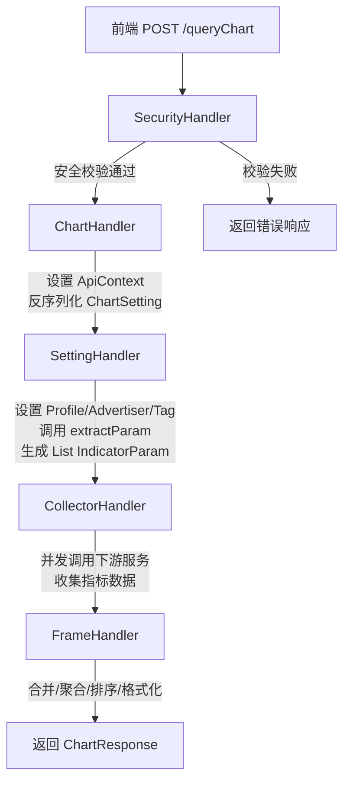
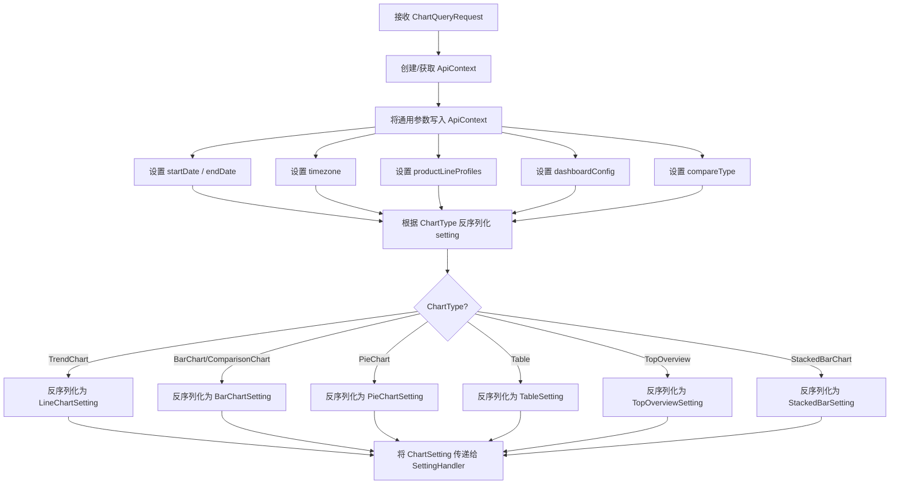
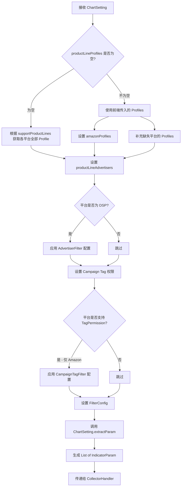
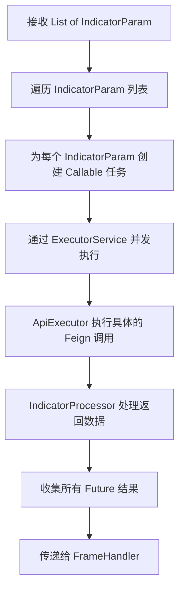
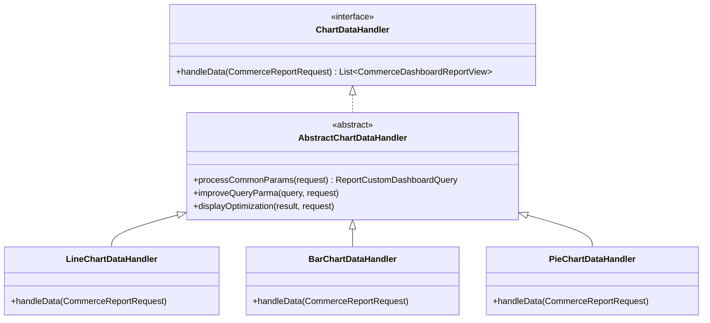
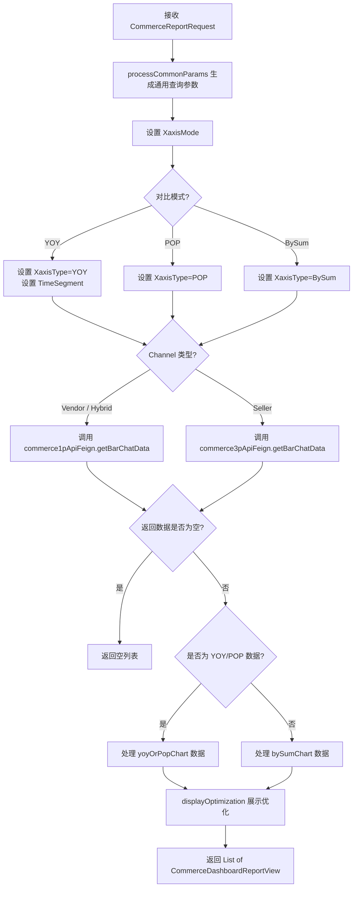
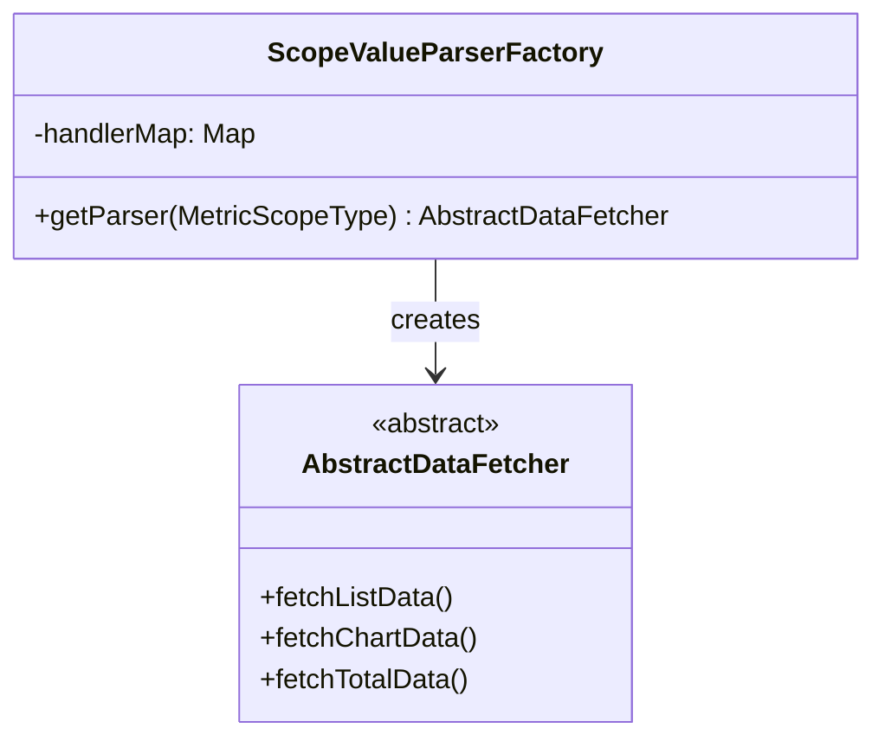

# 核心 API - Dashboard 与 Chart 管理 功能逻辑文档

> 本文档由 document-automation 工具自动生成，基于源代码、PRD 文档和技术评审文档。
> 生成时间: 2026-04-07 15:56:08
> 准确性评分: 未验证/100

---


# 核心 API - Dashboard 与 Chart 管理 功能逻辑文档

## 1. 模块概述

### 1.1 职责与定位

本模块是 Pacvue Custom Dashboard 系统的核心查询引擎，负责两大核心职责：

1. **Dashboard CRUD 管理**：提供 Dashboard 的创建、读取、更新、删除操作，以及 Share Link 的创建与访问。
2. **QueryChart 核心查询链路**：通过责任链模式，将一次图表数据查询请求拆解为安全校验、参数解析、设置填充、数据收集、格式化输出五个阶段，最终返回可渲染的图表数据。

Custom Dashboard 的本质是对 Advertising / Commerce 等业务页面上已有接口的"排列组合"——根据用户选择的图表类型（Trend Chart、Comparison Chart、Pie Chart、Table 等）、物料层级（Profile、Campaign、ASIN、Campaign Tag 等）和数据源（Amazon、DSP、Commerce 等），动态组装查询参数，调用对应的下游服务接口，再将返回数据聚合、格式化为前端可直接渲染的结构。

### 1.2 系统架构位置

```
┌─────────────────────────────────────────────────────────┐
│                     前端 (Vue)                           │
│  Dashboard / dashboardSub / components                   │
└──────────────────────┬──────────────────────────────────┘
                       │ POST /customDashboard/queryChart
                       │ POST /autotest/queryChart
                       ▼
┌─────────────────────────────────────────────────────────┐
│              custom-dashboard-api                         │
│  ┌─────────────────────────────────────────────────────┐ │
│  │  Controller 层                                       │ │
│  │  DashboardController / AutoTestDashboardController   │ │
│  └──────────────────────┬──────────────────────────────┘ │
│                         ▼                                 │
│  ┌─────────────────────────────────────────────────────┐ │
│  │  Handler 责任链                                      │ │
│  │  Security → Chart → Setting → Collector → Frame      │ │
│  └──────────────────────┬──────────────────────────────┘ │
│                         ▼                                 │
│  ┌─────────────────────────────────────────────────────┐ │
│  │  Service / Strategy / Core 层                        │ │
│  │  DashboardService / DashboardDatasourceManager       │ │
│  │  ScopeValueParserFactory / ApiExecutor               │ │
│  │  IndicatorProcessor                                   │ │
│  └──────────────────────┬──────────────────────────────┘ │
└─────────────────────────┼───────────────────────────────┘
                          ▼
┌─────────────────────────────────────────────────────────┐
│              下游 Feign 服务                              │
│  AmazonAdvertisingFeign / Commerce1pApiFeign             │
│  Commerce3pApiFeign / DSP 相关 Feign 等                  │
└─────────────────────────────────────────────────────────┘
```

### 1.3 涉及的后端模块与包

| 后端模块 | 说明 |
|---------|------|
| `custom-dashboard-api` | 主服务模块，包含 Controller、Handler、Service、Strategy 等 |

| 包路径 | 说明 |
|--------|------|
| `com.pacvue.api.controller.DashboardController` | Dashboard 主控制器 |
| `com.pacvue.api.controller.DashboardDatasourceController` | 数据源管理控制器 |
| `com.pacvue.api.service` | 业务服务层 |
| `com.pacvue.api.handler` | 责任链 Handler 层 |
| `com.pacvue.api.core` | 核心组件（ApiContext、ApiContextHolder 等） |
| `com.pacvue.api.strategy` | 策略模式相关实现 |
| `com.pacvue.commerce.handler` | Commerce 数据源的图表数据处理器 |

### 1.4 涉及的前端目录

| 目录 | 说明 |
|------|------|
| `Dashboard` | Dashboard 主页面 |
| `dashboardSub` | Dashboard 子页面（编辑、预览等） |
| `components` | 通用组件（图表渲染、筛选器等） |

### 1.5 Maven 坐标与部署方式

> **待确认**：具体 Maven groupId/artifactId 及部署方式未在代码片段中出现。根据项目命名推测为 `com.pacvue:custom-dashboard-api`，以 Spring Boot 微服务方式部署。

---

## 2. 用户视角

### 2.1 功能场景总览

Custom Dashboard 允许用户自定义数据看板，通过拖拽、配置的方式创建多种图表，实现跨平台、跨 Retailer 的广告与商业数据可视化分析。

**核心功能场景包括：**

1. **Dashboard 管理**：创建、编辑、删除、复制 Dashboard
2. **Chart 创建与配置**：在 Dashboard 中添加各类图表（Trend Chart、Comparison Chart、Pie Chart、Stacked Bar Chart、Table、Top Overview、White Board）
3. **Chart 数据查询**：根据图表配置实时查询并渲染数据
4. **Share Link**：生成分享链接，允许外部用户查看 Dashboard
5. **Chart 下载**：支持下载为 Excel 或无底色图片
6. **Cross Retailer**：在一个图表中展示多个 Retailer 的数据
7. **Filter-linked Campaign**：图表物料绑定到 Dashboard 级别的 Filter

### 2.2 用户操作流程

#### 2.2.1 创建 Dashboard 并添加 Chart

1. 用户进入 Dashboard 列表页，点击"Create Dashboard"
2. 输入 Dashboard 名称，进入编辑模式
3. 点击"Add Chart"，选择图表类型（如 Trend Chart）
4. 配置图表：
   - 选择数据源/Retailer（Amazon、DSP、Commerce Vendor/Seller/Hybrid、Citrus 等）
   - 选择 Material Level（Profile、Campaign、Campaign Tag、ASIN、ASIN Tag、Parent Tag、Placement、Campaign Type、Cross Retailer、Filter-linked Campaign 等）
   - 选择 Data Scope（具体的 Profile、Campaign 等物料）
   - 选择 Metric（Impression、Spend、ROAS、Sales 等）
   - 配置图表样式（折线/柱状/面积、是否带阴影、半屏/全屏等）
   - 配置对比模式（YOY、POP、自定义时间范围对比）
5. 点击 Save，图表保存到 Dashboard
6. 可复制已有 Chart（V2.9+），复制后名称自动加 "- Copy" 后缀

#### 2.2.2 查看 Dashboard

1. 用户选择时间范围（startDate、endDate）、时区（timezone）
2. 可设置 Dashboard 级别的 Filter（Advertiser Filter、Campaign Tag Filter 等）
3. 系统对每个 Chart 发起 `queryChart` 请求
4. 图表渲染数据

#### 2.2.3 分享 Dashboard

1. 在 Dashboard 列表页悬浮到某个 Dashboard，点击"分享"按钮
2. 系统生成 Share Link 并展示
3. 外部用户通过 Share Link 访问时，隐藏面包屑和 Edit 按钮
4. 如果 Dashboard 已被删除，访问 Share Link 时展示缺省页面

#### 2.2.4 Widget Library 引用模板（V2.0+）

1. 在创建 Dashboard 页面，从 Widget Library 中选择 Template
2. 支持筛选和预览 Template
3. 选择后为 Chart 起名
4. 根据 Template 的 Material Level 选择对应的 Data Scope

### 2.3 UI 交互要点

- **图表提示文案（Tips）**：根据图表配置自动生成描述性文案（V2.5+），如 "The Impression for each campaign tag individually"
- **自动生成 Label**：根据 Chart 配置自动生成 Label（V2.4+）
- **Table 字段自定义排序**：用户可拖拽调整 Table 列顺序（V2.6+）
- **坐标轴整理**：不同图表类型有不同的坐标轴展示规则（V2.6+）
- **Chart 样式选项**：曲线带阴影、曲线不带阴影、柱状三种样式（V2.9+）
- **物料快速筛选**：通过 Campaign Type、ASIN Tag 等字段快速筛选物料（V2.4+）
- **Filter-linked Campaign**：选中后右侧不展示 Data Scope 选择，而是展示说明文案（V2.8+）

---

## 3. 核心 API

### 3.1 REST 端点列表

| 方法 | 路径 | 描述 | 请求体 | 返回值 |
|------|------|------|--------|--------|
| POST | `/customDashboard/queryChart` | 查询 Chart 数据（正式接口） | `ChartQueryRequest` | `BaseResponse<ChartResponse>` |
| POST | `/autotest/queryChart` | 查询 Chart 数据（自动化测试入口，支持 debug 模式记录 Feign 调用信息） | `ChartQueryRequest` | `BaseResponse<ChartResponse>` |
| POST | `/share/create` | 创建 Share Link | 待确认 | 待确认 |
| POST | `/share/getDashboard` | 通过 Share Link 查询 Dashboard（内部调用普通 getDashboard） | 待确认 | 待确认 |
| POST | `/share/queryChart` | 通过 Share Link 查询 Chart 数据（内部调用普通 queryChart） | `ChartQueryRequest` | `BaseResponse<ChartResponse>` |
| POST | `/share/briefTips` | 查询 Brief Tips（内部调用普通 briefTips） | 待确认 | 待确认 |
| POST | `/share/walmartUserGuidance` | 查询是否为 Walmart 有 Store 用户 | 待确认 | 待确认 |
| POST | `/share/getProfileList` | 通过 Share Link 获取 Profile 列表 | 待确认 | 待确认 |

> **注**：Dashboard CRUD 相关接口（创建、更新、删除、列表查询等）位于 `DashboardController`，具体端点路径待确认。

### 3.2 ChartQueryRequest 参数说明

```java
public class ChartQueryRequest {
    private Long id;                    // Chart ID
    private ChartType type;             // 图表类型枚举
    private Object setting;             // 图表设置（JSON，根据 type 反序列化为对应 ChartSetting 实现类）
    private String startDate;           // 开始日期
    private String endDate;             // 结束日期
    private String timezone;            // 时区
    private Map<Platform, List<String>> productLineProfiles;  // 各平台的 Profile 列表
    private DashboardConfig dashboardConfig;  // Dashboard 级别配置（含 FilterConfig）
    private String compareType;         // 对比类型（YOY/POP/自定义等）
    // ... 其他字段待确认
}
```

### 3.3 ChartResponse 结构

> **待确认**：`ChartResponse` 的具体字段未在代码片段中完整出现。根据责任链设计，它是由 `FrameHandler` 最终组装的响应对象，包含图表渲染所需的数据系列、标签、汇总值等。

### 3.4 前端调用方式

前端通过 POST 请求发送 `ChartQueryRequest` JSON 到 `/customDashboard/queryChart`（或 Share Link 场景下的 `/share/queryChart`），接收 `BaseResponse<ChartResponse>` 后进行图表渲染。

---

## 4. 核心业务流程

### 4.1 QueryChart 责任链总览

QueryChart 是本模块最核心的链路，采用**责任链模式（Chain of Responsibility）**实现，依次经过五个 Handler：

```
SecurityHandler → ChartHandler → SettingHandler → CollectorHandler → FrameHandler
```

每个 Handler 实现 `Handler<T, R>` 接口，通过构造函数注入下一个 Handler，形成链式调用。



### 4.2 各 Handler 详细逻辑

#### 4.2.1 SecurityHandler（责任链入口）

**职责**：处理安全校验，验证请求合法性。

**处理逻辑**：
1. 校验用户身份与权限（具体校验逻辑待确认）
2. 校验通过后，将 `ChartQueryRequest` 传递给 `ChartHandler`
3. 校验失败则直接返回错误响应

#### 4.2.2 ChartHandler

**职责**：设置 ThreadLocal 上下文通用参数，反序列化图表设置。

**处理逻辑**：



**关键依赖**：
- `ObjectMapper`：用于 JSON 反序列化
- `HttpServletRequest`：获取 HTTP 请求上下文
- `AmazonAdvertisingFeign`：待确认具体用途（可能用于获取 Amazon 相关配置）
- `DashboardService`：可能用于查询 Chart 的持久化配置

**ApiContext 写入 ThreadLocal**：通过 `ApiContextHolder`（基于 ThreadLocal）管理请求级上下文，确保同一请求链路中所有组件可共享参数。

#### 4.2.3 SettingHandler

**职责**：为查询设置具体的 ProfileId、物料 Id、Filter 配置等平台级参数，并调用 `ChartSetting.extractParam` 生成指标查询参数列表。

**处理逻辑**：



**详细步骤**：

1. **Profile 设置**：
   - 如果前端未传 `productLineProfiles`（为空），则根据 `ChartSetting.supportProductLines()` 返回的平台列表，调用 `getPlatformProfiles()` 获取各平台的全部 Profile
   - 如果前端已传，则使用传入值，同时设置 `amazonProfiles`，并补充缺失平台的 Profile

2. **Advertiser 设置**：
   - 仅对 DSP 平台生效
   - 从 `DashboardConfig.FilterConfig.AdvertiserFilter` 中获取 Advertiser 过滤配置
   - 调用 `applyPlatformAdvertisers()` 应用过滤

3. **Campaign Tag 权限设置**：
   - 仅对 `supportTagPermissionPlatforms`（当前仅 Amazon）生效
   - 从 `DashboardConfig.FilterConfig.CampaignTagFilter` 中获取 Tag 过滤配置
   - 调用 `addCampaignTagsForPermission()` 应用 Tag 权限

4. **FilterConfig 设置**：
   - 将 Dashboard 级别的 FilterConfig 应用到查询上下文（代码截断，具体逻辑待确认）

5. **extractParam 调用**：
   - 调用 `ChartSetting.extractParam(ApiContext context)` 方法
   - 不同图表类型的 ChartSetting 实现类有不同的 extractParam 逻辑（**策略模式**）
   - 根据客户选择的 `MetricScopeType`（物料级别）设置对应的 IdList
   - 设置其他参数：YOY/POP 标志、是否需要 Total、additionalRequirementSql 等
   - 根据物料层级及数据源的指标分组（不同 Chart 可能有不同分组规则），生成 `List<IndicatorParam>`

**关键依赖**：
- `DashboardDatasourceManager`：管理数据源配置
- `ScopeValueParserFactory`：**工厂模式**，根据条件创建物料值解析器

#### 4.2.4 CollectorHandler

**职责**：根据 `List<IndicatorParam>` 并发调用下游服务，收集各指标数据。

**处理逻辑**：



**关键组件**：
- `ApiExecutor`：执行具体的 API 调用（Feign 调用），根据 IndicatorParam 中的数据源和物料类型路由到对应的下游服务
- `IndicatorProcessor`：对下游返回的原始数据进行初步处理/转换
- `ExecutorService`：线程池，支持并发调用多个下游服务以提升性能

**注入方式**：`ApiExecutor` 和 `IndicatorProcessor` 通过 `@Autowired` setter 注入（而非构造函数注入），`FrameHandler` 通过构造函数注入（作为责任链的下一个 Handler）。

#### 4.2.5 FrameHandler

**职责**：对收集到的数据进行合并、聚合、排序及格式化，生成最终的 `ChartResponse`。

**处理逻辑**（基于交接文档和代码推断）：
1. 接收 CollectorHandler 传递的多组指标数据
2. 按图表类型要求进行数据合并（如多个 Profile 的数据合并为一条线）
3. 执行聚合计算（Sum、Average 等）
4. 按配置进行排序（如 Top N 排序）
5. 格式化为 `ChartResponse` 结构返回

### 4.3 Commerce 数据源的图表数据处理

对于 Commerce 数据源（Vendor/Seller/Hybrid），存在独立的图表数据处理器体系：



**注解驱动的策略选择**：通过 `@ChartTypeQualifier(ChartType.xxx)` 注解标识每个 Handler 对应的图表类型，实现自动路由。

#### 4.3.1 BarChartDataHandler 详细逻辑



#### 4.3.2 PieChartDataHandler 详细逻辑

- 调用 `processCommonParams` 生成通用查询参数
- 调用 `improveQueryParma` 增强查询参数
- 设置 `needTotal = true`（Pie Chart 需要 Total 数据计算占比）
- 调用对应的 Commerce Feign 接口获取数据

### 4.4 物料工厂模式

根据交接文档描述，系统采用**工厂模式**管理不同物料类型的数据获取逻辑：



- 通过 `@ScopeTypeQualifier` 注解实现 `MetricScopeType` 到 `AbstractDataFetcher` 的动态映射
- 工厂自动扫描 `AbstractDataFetcher` 的实现类并注册到 `handlerMap`
- 每种物料（Profile、Campaign、ASIN、Campaign Tag 等）对应一个实现类

**不同图表类型对应的接口调用模式**（以某一物料为例）：

| 图表类型 | 调用的接口类型 | 说明 |
|---------|--------------|------|
| Trend Chart | Chart 接口 | 获取时间序列数据 |
| Top Overview | Total 接口 | 获取汇总数据 |
| Comparison Chart - BySum | List 接口 | 获取列表数据 |
| Comparison Chart - YOY Multi xxx | List 接口 | 获取列表数据 + YOY 对比 |
| Comparison Chart - YOY Metric | Total 接口 | 获取汇总数据 + YOY 对比 |
| Comparison Chart - YOY Multi Periods | Chart 接口 × 2 | 调用两次 Chart 接口，自行比较 |
| Pie Chart | List + Total 接口 | 需要列表和汇总数据计算占比 |
| Table | List + Total 接口 | 需要列表和汇总数据 |
| Stacked Bar Chart | Chart 接口（按 Break Down Type 分组） | Amazon 专属，按维度分组查询 |

### 4.5 完整数据流转路径

```mermaid
sequenceDiagram
    participant FE as 前端
    participant SC as SecurityHandler
    participant CH as ChartHandler
    participant SH as SettingHandler
    participant CO as CollectorHandler
    participant AE as ApiExecutor
    participant IP as IndicatorProcessor
    participant FR as FrameHandler
    participant DS as 下游服务(Feign)
    
    FE->>SC: POST /queryChart (ChartQueryRequest)
    SC->>SC: 安全校验
    SC->>CH: handle(ChartQueryRequest, ChartResponse)
    
    CH->>CH: 创建 ApiContext 写入 ThreadLocal
    CH->>CH: 根据 ChartType 反序列化 setting
    CH->>SH: handle(ChartSetting, ChartResponse)
    
    SH->>SH: 设置 Profiles / Advertisers / Tags
    SH->>SH: 应用 DashboardConfig FilterConfig
    SH->>SH: 调用 Chart

---

*本文档由 AI 自动生成，如有不准确之处请以源代码为准。标注"待确认"的内容需要人工核实。*