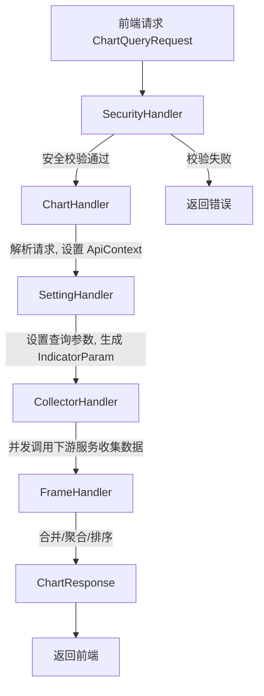
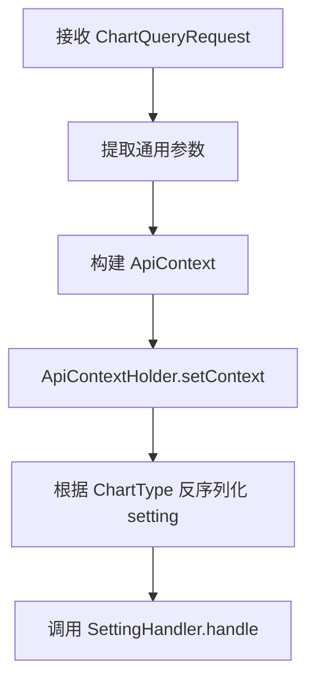
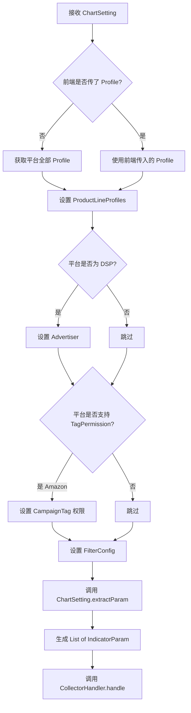
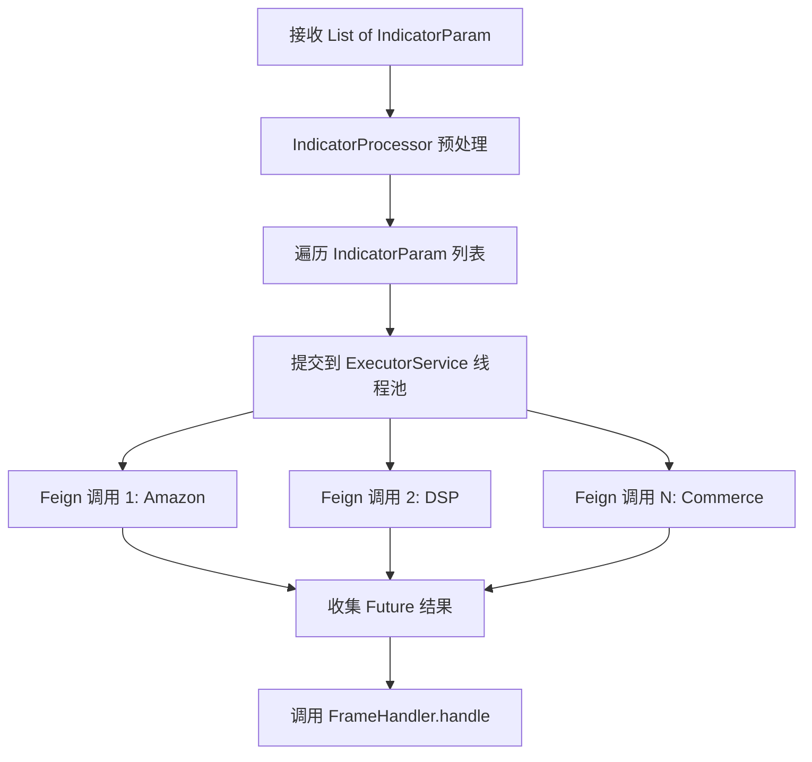
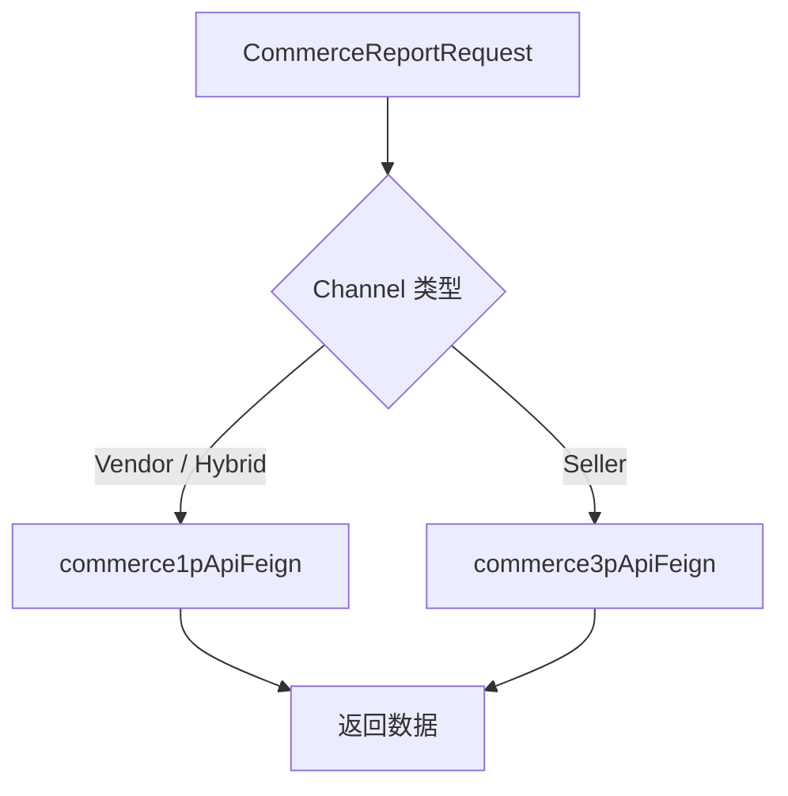
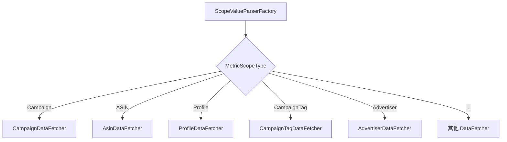
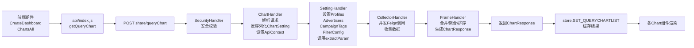

# 核心 API - Dashboard 与 Chart 管理 功能逻辑文档

> 本文档由 document-automation 工具自动生成，基于源代码、PRD 文档和技术评审文档。
> 生成时间: 2026-04-09 09:45:48
> 准确性评分: 未验证/100

---


# 核心 API - Dashboard 与 Chart 管理 功能逻辑文档

## 1. 模块概述

### 1.1 职责与定位

核心 API 模块是 Pacvue Custom Dashboard 系统的中枢，承担以下核心职责：

1. **Dashboard CRUD 管理**：提供 Dashboard 的创建、读取、更新、删除操作，包括草稿保存、正式发布、分享链接生成等完整生命周期管理。
2. **Chart 管理**：支持多种图表类型（TopOverview、LineChart/TrendChart、BarChart/ComparisonChart、StackedBarChart、PieChart、Table、WhiteBoard、GridTable）的创建、编辑、复制和删除。
3. **QueryChart 核心链路**：通过责任链模式完成图表数据查询的完整流程，从安全校验到数据收集再到结果组装，是整个系统最核心的数据通路。

### 1.2 系统架构位置

```
┌─────────────────────────────────────────────────────────┐
│                    前端 (Vue)                            │
│  CreateDashboard.vue / ChartsAll.vue / lineChart.vue    │
│  store.js (Pinia) / api/index.js                        │
└──────────────────────┬──────────────────────────────────┘
                       │ HTTP POST
                       ▼
┌─────────────────────────────────────────────────────────┐
│              custom-dashboard-api (本模块)               │
│  Controller → Handler Chain → Service → Feign Client    │
└──────────┬───────────────────────────────┬──────────────┘
           │                               │
           ▼                               ▼
┌──────────────────┐          ┌────────────────────────────┐
│   数据库 (MySQL)  │          │   下游微服务                 │
│  Dashboard 表     │          │  AmazonAdvertisingFeign     │
│  Chart 表         │          │  Commerce1pApiFeign         │
│  ChartSetting 表  │          │  Commerce3pApiFeign         │
└──────────────────┘          └────────────────────────────┘
```

**上游**：前端 Vue 应用通过 REST API 调用本模块。
**下游**：本模块通过 Feign Client 调用 Amazon Advertising 服务、Commerce 1P/3P 数据服务等获取实际业务数据。

### 1.3 涉及的后端模块与包结构

| Maven 模块 | 说明 |
|---|---|
| `custom-dashboard-api` | 主 API 模块，包含 Controller、Handler、Service |

核心包结构：

| 包路径 | 说明 |
|---|---|
| `com.pacvue.api.controller` | REST Controller 层，包含 `DashboardController`、`DashboardDatasourceController`、`AutoTestDashboardController` |
| `com.pacvue.api.handler` | 责任链 Handler 层，包含 `ChartHandler`、`SettingHandler`、`CollectorHandler`、`FrameHandler` |
| `com.pacvue.api.service` | 业务服务层，包含 `DashboardService`、`DashboardDatasourceManager` |
| `com.pacvue.api.core` | 核心基础设施，包含 `ApiContext`、`ApiContextHolder` |
| `com.pacvue.api.strategy` | 策略模式相关，包含 `ScopeValueParserFactory` 等 |
| `com.pacvue.api.dto.request.query` | 请求 DTO，包含 `ChartQueryRequest` |
| `com.pacvue.api.dto.response` | 响应 DTO，包含 `ChartResponse`、`DashboardDetail` |
| `com.pacvue.base.core` | 基础核心类，包含 `ApiContext` |
| `com.pacvue.base.enums.core` | 核心枚举，包含 `ChartType`、`MetricScopeType`、`Platform` |
| `com.pacvue.base.dto` | 基础 DTO，包含 `DashboardConfig` |
| `com.pacvue.base.annotations` | 自定义注解，包含 `ChartTypeQualifier`、`ScopeTypeQualifier` |
| `com.pacvue.commerce.handler` | Commerce 数据处理 Handler，包含 `AbstractChartDataHandler`、`LineChartDataHandler`、`BarChartDataHandler`、`PieChartDataHandler` |

### 1.4 涉及的前端组件

| 组件/文件 | 目录 | 说明 |
|---|---|---|
| `CreateDashboard.vue` | `Dashboard/` | Dashboard 创建主页面 |
| `CreateLeftBreadcrumb.vue` | `Dashboard/` | 左侧面包屑，触发保存事件 |
| `ChartsAll.vue` | `dashboardSub/` | Chart 通用容器组件 |
| `lineChart.vue` | `components/` | Trend Chart 设置弹窗 |
| `GridTableSetting.vue` | `components/` | Grid Table 设置弹窗 |
| `store.js` | `Dashboard/` | Pinia Store，管理 queryChartList 状态 |
| `api/index.js` | `Dashboard/` | API 调用层 |
| `withEnableMarketFilterForTemplate.js` | `components/` | 模板保存工具函数 |

---

## 2. 用户视角

### 2.1 Dashboard 创建与管理

#### 场景一：创建新 Dashboard

**操作流程**：

1. 用户在 Dashboard 列表页点击创建按钮，进入 `CreateDashboard.vue` 页面。
2. 页面顶部显示面包屑导航（`CreateLeftBreadcrumb.vue`），包含 **Back**（返回列表）、**Save as Draft**（保存草稿）、**Save**（正式保存）按钮。
3. 页面提供 **Add Chart** 和 **Use Template** 两个入口：
   - **Add Chart**：直接创建空白 Chart，选择图表类型后进入配置。
   - **Use Template**：从 Widget Library 中选择已有模板，支持筛选和预览（参见 PRD V2.0 §2.3）。选择模板后需为 Chart 命名，并根据模板的 Material Level 选择对应的 Data Scope。
4. 页面右上角可设置 **Currency**（如 US Dollar）。
5. 用户可通过 **Dashboard Setting** 下拉菜单配置 Dashboard 级别的筛选器（FilterConfig）。

**UI 交互要点**（基于 Figma 设计稿）：
- 顶部操作栏包含：Back 按钮、Save as Draft 灰色按钮、Save 主按钮。
- Dashboard Setting 以下拉菜单形式呈现。
- Add Chart 和 Use Template 按钮位于页面主体区域。

#### 场景二：编辑 Dashboard

用户在列表页选择已有 Dashboard 进入编辑模式，可以：
- 添加/删除/复制 Chart（通过 `ChartsAll.vue` 容器组件操作）。
- 修改 Chart 配置（点击编辑进入对应的设置弹窗）。
- 调整 Chart 布局和排列顺序。
- 保存为草稿或正式发布。

#### 场景三：分享 Dashboard

**操作流程**（参见 PRD V1.1 §1）：

1. 在 Dashboard 列表页，悬浮到表格方块展示"分享"按钮。
2. 点击后弹窗展示 Share Link，提供一键复制功能。
3. 访问 Share Link 时，页面去掉面包屑和 Edit Dashboard 按钮（只读模式）。
4. 如果 Dashboard 已被删除，访问链接时显示缺省页面。

**相关接口**（参见技术交接文档 §3）：
- `POST /share/create`：创建 Share Link
- `POST /share/getDashboard`：通过 Share Link 查询 Dashboard
- `POST /share/queryChart`：通过 Share Link 查询 Chart 数据

### 2.2 Chart 类型与配置

系统支持以下 Chart 类型（`ChartType` 枚举）：

| ChartType | 显示名称 | 说明 |
|---|---|---|
| `topOverview` | Top Overview | 关键指标概览卡片，支持 POP 和 YOY 对比（PRD V1.1 §6） |
| `lineChart` | Trend Chart | 趋势图，支持折线和柱状样式（PRD V1.1 §9 改名） |
| `barChart` | Comparison Chart | 对比图，支持 BySum/YOY/POP 模式（PRD V1.2 改名） |
| `stackedBarChart` | Stacked Bar Chart | 堆叠柱状图，目前 Amazon 专属 |
| `pieChart` | Pie Chart | 饼图，只能选一个指标 |
| `table` | Table | 表格，支持多指标、全屏/半屏、二级展开（PRD V1.1 §2-4） |
| `whiteBoard` | White Board | 白板，支持插入图片（PRD 25Q4-S4） |
| `gridTable` | Grid Table | 网格表格 |

#### Trend Chart 配置（lineChart.vue）

设置弹窗包含：
- **Basic Setting**：图表名称、时间范围等基础配置。
- **Metric 配置**：选择指标，每个指标可独立设置展示样式（折线/柱状）。
- **Commerce 1P/3P**：选择数据源渠道（Vendor/Seller/Hybrid）。
- **D/W/M 快捷按钮**：展示时支持 Day/Week/Month 粒度切换（PRD 25Q4-S4）。

#### Comparison Chart 配置

支持三种对比模式：
- **BySum**：按物料汇总对比，走 List 接口。
- **YOY**（Year over Year）：同比对比，支持 Multi xxx 模式（List 接口）和 Metric 模式（Total 接口）和 Multi Periods 模式（两次 Chart 接口调用后自行比较）。
- **POP**（Period over Period）：环比对比。
- 支持自定义对比时间范围（PRD V2.4）。

#### Table 配置

- 支持 **半屏/全屏** 样式设置（PRD V1.1 §2）。
- 选择 Campaign Tag 模式时支持 **父 Tag Total 行**（二级 Table）（PRD V1.1 §3）。
- 支持添加 **POP 数据列**（PRD V1.1 §4）。
- ASIN 信息展示项优化（PRD 25Q4-S3）。

### 2.3 Material Level（物料层级）

系统支持多种物料层级（`MetricScopeType` 枚举），用户在配置 Chart 时选择：

- **Campaign**：广告活动级别
- **Campaign Tag / Campaign Parent Tag**：广告活动标签/父标签（PRD V1.1 §7）
- **ASIN / ASIN Parent Tag**：商品/商品父标签
- **Profile**：账户级别（PRD V1.1 §8）
- **Advertiser**：广告主级别（DSP 平台）
- **Campaign Type / Placement**：广告类型/展示位置（PRD V2.4）
- **Cross Retailer**：跨零售商（PRD V2.4）
- **Keyword**：关键词（PRD 25Q4-S3 §2.2 新增 keywordFilter）
- **SOV Group**：SOV 分组（PRD 25Q4-S3 新增，需接入权限）

### 2.4 Dashboard 级别筛选器

Dashboard 支持全局筛选器配置（`DashboardConfig.FilterConfig`）：

- **Advertiser Filter**：按广告主筛选（DSP 平台）。
- **Campaign Tag Filter**：按广告活动标签筛选。
- **Market Filter**：市场筛选（通过 `enableMarketFilter` 字段控制，`withEnableMarketFilterForTemplate.js` 处理模板保存时的该字段）。

### 2.5 Chart 下载功能（PRD V2.4）

用户点击 Chart 上的下载按钮，可选择：
- **下载为 Excel**：按各图表类型的固定格式导出。
- **下载为图片**：导出无底色、无标题的纯图表图片。

### 2.6 需求收集 Survey（PRD 26Q1-S4 §3.4.4）

- Custom Dashboard 页面右下角新增悬浮 Survey 图标。
- 默认收起，hover 展开提示。
- 点击后弹出需求收集弹窗，包含 Title（必填）、Preferred Chart Type（必填多选）、Requirement Description（选填富文本）、Document Upload（选填，PDF/JPEG/PNG，最多 5 个，每个最大 5MB）。
- 提交后记录用户信息、反馈内容，Admin 端提供反馈列表页面。

---

## 3. 核心 API

### 3.1 QueryChart - 查询 Chart 数据

#### 正式接口

- **路径**: `POST /customDashboard/queryChart`
- **说明**: 查询 Chart 数据的主入口，前端通过 `api/index.js` 中的 `getQueryChart()` 方法调用。
- **前端调用路径**: `POST ${VITE_APP_CustomDashbord}share/queryChart`（Share 模式下内部调用普通 queryChart）

#### 自动测试/调试接口

- **路径**: `POST /autotest/queryChart`
- **Controller**: `AutoTestDashboardController`
- **说明**: 预览/调试入口，经由 `SecurityHandler` 启动责任链处理。
- **参数**: `ChartQueryRequest`

#### ChartQueryRequest 参数结构

| 字段 | 类型 | 说明 |
|---|---|---|
| `id` | String | Chart ID |
| `type` | ChartType | 图表类型枚举 |
| `startDate` | String | 查询开始日期 |
| `endDate` | String | 查询结束日期 |
| `timezone` | String | 时区 |
| `setting` | Object/JSON | 图表配置（JSON 格式，反序列化为具体 ChartSetting 实现类） |
| `productLineProfiles` | Map<Platform, List<String>> | 各平台的 Profile ID 列表 |
| `dashboardConfig` | DashboardConfig | Dashboard 级别配置（含 FilterConfig） |

#### ChartResponse 响应结构

**待确认** - 具体字段需进一步查看代码。基于上下文推断包含：
- 图表数据列表
- 汇总数据（Total）
- 对比数据（YOY/POP 相关）
- 元数据信息

### 3.2 Dashboard CRUD 接口

| 方法 | 路径 | 说明 |
|---|---|---|
| POST | `/customDashboard/queryChart` | 查询 Chart 数据 |
| POST | `/share/create` | 创建 Share Link |
| POST | `/share/getDashboard` | 通过 Share Link 查询 Dashboard（内部调用普通 getDashboard） |
| POST | `/share/briefTips` | 查询 Brief Tips（内部调用普通 briefTips） |
| POST | `/share/walmartUserGuidance` | 查询是否为 Walmart 有 Store 用户 |
| POST | `/share/getProfileList` | 获取 Profile 列表（内部调用普通 getProfileList） |
| POST | `/share/queryChart` | 通过 Share Link 查询 Chart 数据（内部调用普通 queryChart） |

**待确认**：Dashboard 的 create/update/delete/list 等 CRUD 接口的具体路径，需查看 `DashboardController` 完整代码。

### 3.3 前端 API 调用

在 `api/index.js` 中：

```javascript
// 查询 Chart 数据
export function getQueryChart(data) {
  return request({
    url: `${VITE_APP_CustomDashbord}share/queryChart`,
    method: 'post',
    data
  })
}
```

前端 Store（`store.js`）中通过 `SET_QUERYCHARTLIST` mutation 缓存查询结果：

```javascript
// Pinia Store
state: {
  queryChartList: []
},
mutations: {
  SET_QUERYCHARTLIST(state, payload) {
    state.queryChartList = payload
  }
}
```

---

## 4. 核心业务流程

### 4.1 QueryChart 责任链核心流程

QueryChart 是整个系统最核心的数据查询链路，采用**责任链模式（Chain of Responsibility）**实现。链路由 5 个 Handler 串联组成：

```
SecurityHandler → ChartHandler → SettingHandler → CollectorHandler → FrameHandler
```

每个 Handler 实现 `Handler<I, O>` 接口，通过构造器注入 `nextHandler` 形成链式调用。



#### 4.1.1 SecurityHandler（责任链入口）

**职责**：安全校验，验证请求的合法性。

**处理逻辑**（**待确认**具体实现）：
1. 验证用户身份和权限。
2. 校验请求参数的基本合法性。
3. 校验通过后，将 `ChartQueryRequest` 传递给 `ChartHandler`。

#### 4.1.2 ChartHandler（请求解析与上下文设置）

**类定义**：
```java
@Service
@Slf4j
public class ChartHandler implements Handler<ChartQueryRequest, ChartResponse> {
    private final SettingHandler nextHandler;
    @Resource protected ObjectMapper objectMapper;
    @Resource private HttpServletRequest httpServletRequest;
    @Resource private AmazonAdvertisingFeign amazonAdvertisingFeign;
    @Resource private DashboardService dashboardService;
    
    public ChartHandler(SettingHandler nextHandler) {
        this.nextHandler = nextHandler;
    }
}
```

**处理逻辑**（参见技术交接文档 §1）：

1. **设置 ThreadLocal 通用参数**：从 `ChartQueryRequest` 中提取 `id`、`startDate`、`endDate`、`timezone`、`productLineProfiles`、`dashboardConfig` 等信息，构建 `ApiContext` 对象并通过 `ApiContextHolder`（ThreadLocal）设置到当前线程上下文中。

2. **反序列化 ChartSetting**：根据请求中的 `type`（ChartType 枚举）字段，使用 `ObjectMapper` 将 `setting` JSON 反序列化为对应的 `ChartSetting` 实现类。不同图表类型对应不同的实现类：
   - `topOverview` → TopOverviewSetting
   - `lineChart` → LineChartSetting
   - `barChart` → BarChartSetting
   - `stackedBarChart` → StackedBarChartSetting
   - `pieChart` → PieChartSetting
   - `table` → TableSetting
   - `gridTable` → GridTableSetting
   - `whiteBoard` → **待确认**（白板可能不需要数据查询）

3. **调用 nextHandler**：将反序列化后的 `ChartSetting` 对象和初始化的 `ChartResponse` 传递给 `SettingHandler`。



#### 4.1.3 SettingHandler（查询参数设置）

**类定义**：
```java
@Service
@Slf4j
public class SettingHandler implements Handler<ChartSetting, ChartResponse> {
    private final CollectorHandler nextHandler;
    @Autowired private DashboardDatasourceManager dashboardDatasourceManager;
    @Autowired private ScopeValueParserFactory scopeValueParserFactory;
    private static final Set<Platform> supportTagPermissionPlatforms = Set.of(Platform.Amazon);
    
    public SettingHandler(CollectorHandler nextHandler) {
        this.nextHandler = nextHandler;
    }
}
```

**处理逻辑**（参见技术交接文档 §2）：

**Step 1：设置 Profile**

```java
if (CollectionUtils.isEmpty(ApiContextHolder.getContext().getProductLineProfiles())) {
    // 前端未传 profile，取平台全部
    Map<Platform, List<String>> groupProfileByProductLine = setting.supportProductLines().stream()
        .collect(Collectors.toMap(Function.identity(), this::getPlatformProfiles));
    ApiContextHolder.getContext().setProductLineProfiles(groupProfileByProductLine);
} else {
    // 前端已传 profile
    Map<Platform, List<String>> productLineProfiles = ApiContextHolder.getContext().getProductLineProfiles();
    ApiContextHolder.getContext().setAmazonProfiles(productLineProfiles.get(Platform.Amazon));
    // 对于未传的平台，补充获取全部 profile
    setting.supportProductLines().forEach(productLine -> {
        if (CollectionUtils.isEmpty(productLineProfiles.get(productLine))) {
            productLineProfiles.put(productLine, getPlatformProfiles(productLine));
        }
    });
}
```

逻辑说明：
- Profile 是前端必传参数，但如果未传则回退到获取平台全部 Profile。
- 通过 `ChartSetting.supportProductLines()` 获取当前图表支持的平台列表（如 Amazon、DSP）。
- 对每个支持的平台，确保都有对应的 Profile ID 列表。

**Step 2：设置 Advertiser（广告主）**

```java
Map<Platform, List<String>> productLineAdvertisers = ApiContextHolder.getContext().getProductLineAdvertisers();
Map<Platform, List<String>> advertiserFilterConfigMap = Optional.ofNullable(dashboardConfig)
    .map(DashboardConfig::getFilterConfig)
    .map(DashboardConfig.FilterConfig::getAdvertiserFilter)
    .map(DashboardConfig.Filter::getData)
    .orElse(null);
setting.supportProductLines().forEach(platform -> {
    if (Objects.equals(platform, Platform.DSP)) {
        applyPlatformAdvertisers(platform, productLineAdvertisers, advertiserFilterConfigMap);
    }
});
```

逻辑说明：
- Advertiser 设置仅对 **DSP 平台**生效。
- 从 `DashboardConfig.FilterConfig.AdvertiserFilter` 中获取 Dashboard 级别的广告主筛选配置。
- 通过 `applyPlatformAdvertisers` 方法合并用户选择和 Dashboard 级别筛选。

**Step 3：设置 Campaign Tag 权限**

```java
Map<Platform, List<String>> productLineCampaignTags = ApiContextHolder.getContext().getProductLineCampaignTags();
Map<Platform, List<String>> campaignTagConfigMap = Optional.ofNullable(dashboardConfig)
    .map(DashboardConfig::getFilterConfig)
    .map(DashboardConfig.FilterConfig::getCampaignTagFilter)
    .map(DashboardConfig.Filter::getData)
    .orElse(null);
setting.supportProductLines().forEach(platform -> {
    if (supportTagPermissionPlatforms.contains(platform)) {
        addCampaignTagsForPermission(platform, productLineCampaignTags, campaignTagConfigMap);
    }
});
```

逻辑说明：
- Campaign Tag 权限仅对 **Amazon 平台**生效（`supportTagPermissionPlatforms = Set.of(Platform.Amazon)`）。
- 从 `DashboardConfig.FilterConfig.CampaignTagFilter` 获取 Dashboard 级别的标签筛选配置。
- 通过 `addCampaignTagsForPermission` 方法设置标签权限。

**Step 4：设置 Filter Config**

代码中还有设置 filter config 的逻辑（代码被截断），核心处理在 `ChartSetting.setFilterConfig` 方法中（参见技术评审 V2.8 §五）。

**Step 5：调用 extractParam 生成 IndicatorParam 列表**

```java
List<IndicatorParam> params = setting.extractParam(ApiContextHolder.getContext());
```

这是 SettingHandler 最关键的一步。每个 `ChartSetting` 实现类各自实现 `extractParam` 方法（**策略模式**），根据：
- 客户选择的 `MetricScopeType`（物料级别）设置对应的 ID 列表。
- 设置 YOY/POP、是否需要 Total、additionalRequirementSql 等参数。
- 根据物料层级及数据源的指标分组（不同 Chart 有不同分组规则），生成 `List<IndicatorParam>`。

**Step 6：传递给 CollectorHandler**

将生成的 `List<IndicatorParam>` 传递给 `CollectorHandler.handle()`。



#### 4.1.4 CollectorHandler（数据收集）

**类定义**：
```java
@Service
@Slf4j
public class CollectorHandler implements Handler<List<IndicatorParam>, ChartResponse> {
    private final FrameHandler nextHandler;
    private ApiExecutor apiExecutor;
    private IndicatorProcessor indicatorProcessor;
    
    public CollectorHandler(FrameHandler nextHandler) {
        this.nextHandler = nextHandler;
    }
    
    @Autowired
    public void setApiExecutor(ApiExecutor apiExecutor) {
        this.apiExecutor = apiExecutor;
    }
    
    @Autowired
    public void setIndicatorProcessor(IndicatorProcessor indicatorProcessor) {
        this.indicatorProcessor = indicatorProcessor;
    }
}
```

**处理逻辑**：

CollectorHandler 依赖两个核心组件：
- **`ApiExecutor`**：API 执行器，负责实际调用下游服务。从代码导入可以看到使用了 `ExecutorService`、`Future`、`Callable`，说明采用**并发执行**策略。
- **`IndicatorProcessor`**：指标处理器，负责对 `IndicatorParam` 进行预处理或后处理。

**推断的处理流程**：

1. 接收 `List<IndicatorParam>` 参数列表。
2. 通过 `IndicatorProcessor` 对参数进行预处理（如指标映射、参数校验）。
3. 将多个 `IndicatorParam` 通过 `ApiExecutor` **并发**提交到线程池执行。
4. 每个 `IndicatorParam` 对应一次下游 Feign 调用（如 `AmazonAdvertisingFeign`、`Commerce1pApiFeign`、`Commerce3pApiFeign`）。
5. 收集所有 `Future` 的结果。
6. 将收集到的原始数据传递给 `FrameHandler`。



**注意**：CollectorHandler 使用 Setter 注入（`@Autowired` 在 setter 方法上）而非构造器注入来注入 `ApiExecutor` 和 `IndicatorProcessor`，这是因为构造器参数已被 `FrameHandler nextHandler` 占用（责任链模式的构造器注入约定）。

#### 4.1.5 FrameHandler（数据组装）

**职责**（**待确认**具体实现）：
1. 接收 CollectorHandler 收集的原始数据。
2. 进行数据合并（多个数据源的结果合并）。
3. 进行数据聚合（按维度聚合计算）。
4. 进行数据排序。
5. 生成最终的 `ChartResponse` 返回。

### 4.2 Commerce 数据处理链路

在 CollectorHandler 调用下游服务时，Commerce 数据源有独立的处理链路，采用**策略模式 + 模板方法模式**。

#### 4.2.1 ChartDataHandler 接口

```java
public interface ChartDataHandler {
    List<CommerceDashboardReportView> handleData(CommerceReportRequest request);
}
```

#### 4.2.2 AbstractChartDataHandler 抽象类

提供通用的模板方法：
- `processCommonParams(CommerceReportRequest request)`：处理通用参数，生成 `ReportCustomDashboardQuery`。
- `improveQueryParma(ReportCustomDashboardQuery query, CommerceReportRequest request)`：增强查询参数。
- `displayOptimization(List<CommerceDashboardReportView> result, CommerceReportRequest request)`：展示优化。
- `reportToCommerceView()`：将报表数据转换为 Commerce 视图。
- `compareReportToCommerce()`：将对比报表数据转换为 Commerce 视图。

#### 4.2.3 具体图表数据处理器

通过 `@ChartTypeQualifier` 注解标识图表类型，实现策略分发：

**BarChartDataHandler**：
```java
@Component
@ChartTypeQualifier(ChartType.BarChart)
@Slf4j
public class BarChartDataHandler extends AbstractChartDataHandler {
    @Override
    public List<CommerceDashboardReportView> handleData(CommerceReportRequest request) {
        ReportCustomDashboardQuery query = processCommonParams(request);
        query.setXaxisMode(request.getMode());
        
        // 根据对比类型设置查询参数
        if (Boolean.TRUE.equals(request.getYOY())) {
            query.setXaxisType(BarChartSetting.XAsisType.YOY.name());
            if (StringUtils.hasText(request.getPeriodType())) {
                query.setTimeSegment(TimeSegment.valueOf(request.getPeriodType()));
            }
        } else if (Boolean.TRUE.equals(request.getPOP())) {
            query.setXaxisType(BarChartSetting.XAsisType.POP.name());
        } else if (Boolean.TRUE.equals(request.getBySum())) {
            query.setXaxisType(BarChartSetting.XAsisType.BySum.name());
        }
        
        // 根据 Channel 路由到不同的 Feign 服务
        BaseResponse<BaseResponseComparisonChartVo> barChatData = null;
        switch (DashboardConfig.Channel.fromValue(query.getChannel())) {
            case Vendor, Hybrid -> barChatData = commerce1pApiFeign.getBarChatData(query);
            case Seller -> barChatData = commerce3pApiFeign.getBarChatData(query);
        }
        
        // 处理 YOY/POP 对比数据 vs 普通汇总数据
        if (data.isYoyOrPop()) {
            // 处理 YoyOrPopChart 数据
            result = yoyOrPopChart.stream()
                .map(d -> compareReportToCommerce(d, metricTypeList))
                .collect(Collectors.toList());
        } else {
            // 处理 BySumChart 数据
            result = bySumChart.stream()
                .map(d -> reportToCommerceView(d, metricTypeList))
                .collect(Collectors.toList());
        }
        displayOptimization(result, request);
        return result;
    }
}
```

**PieChartDataHandler**：
```java
@Slf4j
@Component
@ChartTypeQualifier(ChartType.PieChart)
public class PieChartDataHandler extends AbstractChartDataHandler {
    @Override
    public List<CommerceDashboardReportView> handleData(CommerceReportRequest request) {
        ReportCustomDashboardQuery query = processCommonParams(request);
        improveQueryParma(query, request);
        query.setNeedTotal(true); // PieChart 需要 Total 数据
        // ... 调用下游服务
    }
}
```

**LineChartDataHandler**：
```java
@Slf4j
@Component
@ChartTypeQualifier
public class LineChartDataHandler extends AbstractChartDataHandler {
    // Trend Chart 数据处理
}
```

**Commerce Channel 路由逻辑**：



### 4.3 物料解析工厂模式

`ScopeValueParserFactory` 采用**工厂模式**，根据 `MetricScopeType`（物料级别）创建对应的解析器。

技术交接文档中描述了这一设计的演进：

> 原先的 `fetchData` 方法中，大量的 switch-case 语句导致代码过于臃肿。新实现中，通过工厂模式配合 `AbstractDataFetcher` 抽象类，每种物料对应一个实现类。通过 `ScopeTypeQualifier` 注解实现 `MetricScopeType` 到 `AbstractDataFetcher` 的动态映射。



每个 `AbstractDataFetcher` 实现类封装了：
- `fetchListData()`：获取列表数据
- `fetchChartData()`：获取图表数据
- `fetchTotalData()`：获取汇总数据

### 4.4 完整数据流转路径



### 4.5 调试链路追踪

系统提供调试追踪机制，通过以下类实现：
- **`DebugQueryChartHolder`**：持有调试信息的上下文。
- **`DebugFeignCallDTO`**：记录 Feign 调用的详细信息（URL、参数、响应、耗时等）。
- **`DebugInfoDTO`**：汇总调试信息。

`AutoTestDashboardController` 的 `/autotest/queryChart` 接口可能会返回额外的调试信息，用于开发和测试阶段的问题排查。

---

## 5. 数据模型

### 5.1 数据库表

**待确认** - 具体表结构需查看 MyBatis Mapper 文件。基于代码推断存在以下表：

| 表名（推断） | 说明 |
|---|---|
| dashboard | Dashboard 主表，存储名称、状态、创建者等 |
| dashboard_chart | Chart 表，存储图表类型、配置、所属 Dashboard |
| dashboard_share | Share Link 表，存储分享链接信息 |

### 5.2 核心 DTO/VO

#### ChartQueryRequest

| 字段 | 类型 | 说明 |
|---|---|---|
| `id` | String | Chart ID |
| `type` | ChartType | 图表类型 |
| `startDate` | String | 开始日期 |
| `endDate` | String | 结束日期 |
| `timezone` | String | 时区 |
| `setting` | Object | 图表配置 JSON |
| `productLineProfiles` | Map<Platform, List<String>> | 各平台 Profile 列表 |
| `dashboardConfig` | DashboardConfig | Dashboard 配置 |

#### ApiContext（ThreadLocal 上下文）

| 字段 | 类型 | 说明 |
|---|---|---|
| `chartId` | String | 当前查询的 Chart ID |
| `dateRange` | DateRange | 日期范围 |
| `productLineProfiles` | Map<Platform, List<String>> | 各平台 Profile |
| `amazonProfiles` | List<String> | Amazon Profile 列表（快捷访问） |
| `productLineAdvertisers` | Map<Platform, List<String>> | 各平台 Advertiser |
| `productLineCampaignTags` | Map<Platform, List<String>> | 各平台 Campaign Tag |
| `dashboardConfig` | DashboardConfig | Dashboard 配置 |

#### DashboardConfig

```json
{
  "filterConfig": {
    "advertiserFilter": {
      "data": {
        "DSP": ["advertiser1", "advertiser2"]
      }
    },
    "campaignTagFilter": {
      "data": {
        "Amazon": ["tag1", "tag2"]
      }
    }
  }
}
```

| 字段路径 | 类型 | 说明 |
|---|---|---|
| `filterConfig` | FilterConfig | 筛选器配置 |
| `filterConfig.advertiserFilter` | Filter | 广告主筛选器 |
| `filterConfig.advertiserFilter.data` | Map<Platform, List<String>> | 各平台广告主 ID 列表 |
| `filterConfig.campaignTagFilter` | Filter | Campaign Tag 筛选器 |
| `filterConfig.campaignTagFilter.data` | Map<Platform, List<String>> | 各平台 Tag 列表 |

#### DashboardDetail

**待确认** - 通过 `DashboardService` 操作，包含 Dashboard 的完整详情信息。

### 5.3 核心枚举

#### ChartType

```java
public enum ChartType {
    topOverview,
    lineChart,      // 即 Trend Chart
    barChart,       // 即 Comparison Chart
    stackedBarChart,
    pieChart,
    table,
    whiteBoard,
    gridTable
}
```

#### Platform

```java
public enum Platform {
    Amazon,
    DSP,
    // 其他平台待确认：Walmart, Instacart, Chewy 等
}
```

#### MetricScopeType（物料级别）

包含但不限于：
- Campaign
- CampaignTag / CampaignParentTag
- ASIN / ASINParentTag
- Profile
- Advertiser
- CampaignType
- Placement
- CrossRetailer
- Keyword
- SOVGroup

#### TagOperator

```java
public enum TagOperator {
    or
    // 其他操作符待确认
}
```

#### BarChartSetting.XAsisType

```java
public enum XAsisType {
    YOY,    // Year over Year
    POP,    // Period over Period
    BySum   // 按汇总
}
```

### 5.4 ChartSetting JSON 结构

ChartSetting 是存储在数据库中的 JSON 配置，不同图表类型有不同的结构。以下是基于代码推断的结构：

#### 通用字段

所有 ChartSetting 实现类都实现 `ChartSetting` 接口的方法：
- `extractParam(ApiContext context)` → `List<IndicatorParam>`
- `supportProductLines()` → `List<Platform>`

#### V2026Q1S6 新增字段（5 个 ChartSetting 实现类，StackedBar/GridTable 除外）

```json
{
  "metrics": [
    {
      "showFilter": true,
      "specifyFilterScope": true,
      "filterScopes": [
        {
          "type": "Campaign",
          "values": ["campaign1", "campaign2"]
        }
      ]
    }
  ]
}
```

Filter 粒度：
- TopOverview：per section（同 sectionNo 的多个 metric 共享一个 filter 配置）
- LineChart / BarChart / PieChart：per metric（每个 metric 独立 filter）
- Table：per metric（通常只有一个 metric）

#### 25Q4-S3 新增字段

```json
{
  "keywordFilter": [
    {
      "id": "xxx",
      "name": "yyy"
    }
  ]
}
```

与 scope 平级，用于兼容小平台 keyword 有 id/name 的情况。

### 5.5 IndicatorParam（指标查询参数）

**待确认**具体字段。基于上下文推断包含：
- 平台类型（Platform）
- 物料级别（MetricScopeType）
- 物料 ID 列表
- 指标类型列表（MetricType）
- 日期范围
- 是否需要 Total
- YOY/POP 标识
- 时间分段（TimeSegment）
- 附加查询条件（additionalRequirementSql）

---

## 6. 平台差异

### 6.1 Amazon 平台

- **支持 Campaign Tag 权限**：`supportTagPermissionPlatforms = Set.of(Platform.Amazon)`，在 SettingHandler 中会调用 `addCampaignTagsForPermission` 设置标签权限。
- **StackedBarChart**：目前为 Amazon 专属功能，按 Break Down Type 分组查询。
- **SOV Metrics**：Chewy 平台新增（PRD 25Q4-S3），Amazon 平台**待确认**是否支持。
- **数据服务**：通过 `AmazonAdvertisingFeign` 调用 Amazon 广告平台数据服务。

### 6.2 DSP 平台

- **Advertiser 设置**：仅 DSP 平台需要设置 Advertiser（`Objects.equals(platform, Platform.DSP)`）。
- **ASIN 物料支持 Advertiser 筛选**（PRD 25Q4-S4）。
- **数据源**：PRD V1.2 新增 DSP 数据源，除 WhiteBoard 和 StackedBarChart 外所有 Chart 都需要改造。

### 6.3 Commerce 平台（Vendor/Seller/Hybrid）

- **Channel 路由**：
  - `Vendor` / `Hybrid` → `commerce1pApiFeign`（1P 数据服务）
  - `Seller` → `commerce3pApiFeign`（3P 数据服务）
- **lineChart.vue** 中包含 Commerce 1P/3P 配置选项。

### 6.4 Instacart 平台

技术交接文档以 Instacart 为例说明了不同物料对应不同接口的逻辑：
- **Trend Chart**：对接 Advertising 页面的 Chart 接口。
- **Top Overview**：对接 Total 接口。
- **Comparison Chart**：
  - BySum → List 接口
  - YOY Multi xxx → List 接口
  - YOY Metric → Total 接口
  - YOY Multi Periods → 两次 Chart 接口调用后自行比较
- **Pie Chart / Table**：同时查询 List 和 Total 接口。

### 6.5 Walmart 平台

- 提供 `walmartUserGuidance` 接口（`POST /share/walmartUserGuidance`），用于查询是否为 Walmart 有 Store 用户。

### 6.6 Chewy 平台

- 新增 SOV Metrics（PRD 25Q4-S3 V1.1）。

### 6.7 Cross Retailer（PRD V2.4）

- 新增 Cross Retailer 作为 Material Level。
- Table 中每一行代表一个 Retailer。
- Trend Chart 中每一根线代表一个 Retailer，或多个 Retailer 数据总和。

---

## 7. 配置与依赖

### 7.1 Feign 下游服务依赖

| Feign Client | 说明 | 使用场景 |
|---|---|---|
| `AmazonAdvertisingFeign` | Amazon 广告平台数据服务 | ChartHandler 中注入，用于获取 Amazon 广告数据 |
| `commerce1pApiFeign` | Commerce 1P 数据服务 | BarChartDataHandler/PieChartDataHandler 等中使用，处理 Vendor/Hybrid 渠道 |
| `commerce3pApiFeign` | Commerce 3P 数据服务 | 处理 Seller 渠道 |

### 7.2 关键配置项

| 配置项 | 说明 |
|---|---|
| `VITE_APP_CustomDashbord` | 前端环境变量，Custom Dashboard API 的 base URL |

**待确认**：Apollo/application.yml 中的具体配置项（如线程池大小、超时时间、缓存配置等）。

### 7.3 ThreadLocal 上下文

`ApiContextHolder` 使用 ThreadLocal 在请求链路中传递上下文：

```java
public class ApiContextHolder {
    private static final ThreadLocal<ApiContext> contextHolder = new ThreadLocal<>();
    
    public static void setContext(ApiContext context) {
        contextHolder.set(context);
    }
    
    public static ApiContext getContext() {
        return contextHolder.get();
    }
    
    // 请求结束后需要清理，防止内存泄漏
    public static void clear() {
        contextHolder.remove();
    }
}
```

**注意事项**：
- 在异步线程中（如 CollectorHandler 的并发执行），ThreadLocal 不会自动传递，需要手动传递或使用 `InheritableThreadLocal`。
- 请求结束后必须调用 `clear()` 防止内存泄漏。

### 7.4 缓存策略

**待确认** - 代码片段中未发现 `@Cacheable` 或 Redis 相关配置。前端通过 `store.SET_QUERYCHARTLIST` 在 Pinia Store 中缓存查询结果。

### 7.5 消息队列

**待确认** - 代码片段中未发现 Kafka 相关配置。

---

## 8. 版本演进

### 8.1 版本时间线

| 版本 | 时间（推断） | 主要变更 |
|---|---|---|
| **V0.0.1** | 初始版本 | QueryChart 核心流程建立，责任链模式设计 |
| **V1.1** | - | 支持 Share Link、Table 全屏/半屏、Campaign Tag 父 Tag Total 行、Table POP 数据、Bar Chart YOY/POP、Top Overview YOY、新增 Parent Tag 和 Profile 作为 Material Level、Line Chart 改造为 Trend Chart |
| **V1.2** | - | 新增 DSP 数据源、Bar Chart 改名为 Comparison Chart |
| **V2.0** | - | 支持 Template 引用（Widget Library）、Dashboard 创建页面重构 |
| **V2.4** | - | 支持 Cross Retailer Chart、Chart 下载（Excel/图片）、Campaign Type/Placement 作为物料、快速筛选物料、自定义对比时间范围、自动生成 Label、模块迁移到 Pacvue HQ |
| **V2.8** | - | FilterConfig 核心处理变更（`ChartSetting.setFilterConfig`） |
| **25Q4-S3** | 2025 Q4 | 单图表支持多种物料层级类型、优化 Table ASIN 信息展示、优化 Trend 图表 Y 轴分轴指标分组、Chewy 平台新增 SOV Metrics、SOV Group 权限接入、chart setting 新增 keywordFilter 字段 |
| **25Q4-S4** | 2025 Q4 | Trend 图表 D/W/M 快捷按钮、Overview 进度条样式、Whiteboard 插入图片、小数位符号格式优化、DSP ASIN 物料支持 Advertiser 筛选 |
| **26Q1-S4** | 2026 Q1 | 需求收集 Survey 功能（悬浮图标、反馈弹窗、Admin 管理页面） |
| **26Q1-S6** | 2026 Q1 | ChartSetting 新增 showFilter/specifyFilterScope/filterScopes 字段，支持 View/Share 页面物料 Filter |

### 8.2 架构演进亮点

**物料处理重构**（参见技术交接文档）：

从大量 switch-case 的 `fetchData` 方法重构为工厂模式 + 策略模式：

- **Before**：单一方法中通过 switch-case 处理所有 MetricScopeType，违反开闭原则。
- **After**：
  - `ScopeValueParserFactory` 工厂自动扫描 `AbstractDataFetcher` 实现类。
  - 通过 `ScopeTypeQualifier` 注解实现动态映射。
  - 新增物料类型只需新增实现类，无需修改已有逻辑。

### 8.3 待优化项与技术债务

1. **StackedBarChart 重构**：技术交接文档提到"未来产品可能会重新设计"，当前为 Amazon 专属。
2. **StackedBar / GridTable 不支持 showFilter**：26Q1-S6 新增的物料 Filter 功能未覆盖这两种图表类型。
3. **SecurityHandler 具体实现待确认**：责任链入口的安全校验逻辑需进一步查看代码。
4. **FrameHandler 具体实现待确认**：数据合并、聚合、排序的具体算法需进一步查看代码。
5. **YOY Multi Periods 模式**：需要调用两次 Chart 接口后自行比较，可能存在性能优化空间。

---

## 9. 已知问题与边界情况

### 9.1 ThreadLocal 并发安全

**问题**：`ApiContextHolder` 使用 ThreadLocal 存储上下文，但 `CollectorHandler` 使用 `ExecutorService` 并发调用下游服务。子线程无法自动获取父线程的 ThreadLocal 值。

**推断的解决方案**：
- 在提交任务到线程池前，手动将 `ApiContext` 传递给 `Callable`/`Runnable`。
- 或使用 `InheritableThreadLocal`（但线程池复用线程时可能有问题）。
- 或使用阿里 `TransmittableThreadLocal`（TTL）。

### 9.2 Profile 为空的降级处理

SettingHandler 中对 Profile 为空的情况有降级逻辑：
```java
if (CollectionUtils.isEmpty(ApiContextHolder.getContext().getProductLineProfiles())) {
    // 回退到获取平台全部 Profile
}
```

这意味着如果前端未传 Profile，系统会查询该平台下所有 Profile 的数据，可能导致数据量过大和性能问题。

### 9.3 下游服务调用失败

**待确认**：CollectorHandler 中并发调用下游服务时，如果某个 Feign 调用失败：
- 是否有重试机制？
- 是否有降级策略（返回部分数据 vs 整体失败）？
- Future.get() 的超时设置是多少？

### 9.4 ChartSetting 反序列化失败

ChartHandler 中使用 `ObjectMapper` 反序列化 `setting` JSON。如果 JSON 格式不匹配目标 ChartSetting 类型：
- 可能抛出 `JsonProcessingException`。
- 需要确认是否有全局异常处理。

### 9.5 Dashboard 被删除后的 Share Link

PRD V1.1 §1.3 明确要求：如果 Dashboard 被删除，访问 Share Link 时显示缺省页面。需要确认：
- 是在前端判断还是后端返回特定错误码？
- Share Link 是否有过期时间？

### 9.6 大数据量场景

- **Cross Retailer**：多个 Retailer 的数据汇总可能涉及大量数据。
- **Table 全屏模式**：可能展示大量行数据。
- **多平台多物料**：当 Chart 配置了多个平台和多种物料时，`IndicatorParam` 列表可能很长，导致并发 Feign 调用数量过多。

### 9.7 Commerce Channel 路由边界

BarChartDataHandler 中的 Channel 路由使用 switch 语句，仅处理了 `Vendor`、`Hybrid`、`Seller` 三种情况。如果出现未知 Channel 值，`barChatData` 将为 null，返回空列表。

### 9.8 调试模式数据泄露

`DebugQueryChartHolder`、`DebugFeignCallDTO`、`DebugInfoDTO` 用于调试链路追踪。需要确认

---

*本文档由 AI 自动生成，如有不准确之处请以源代码为准。标注"待确认"的内容需要人工核实。*