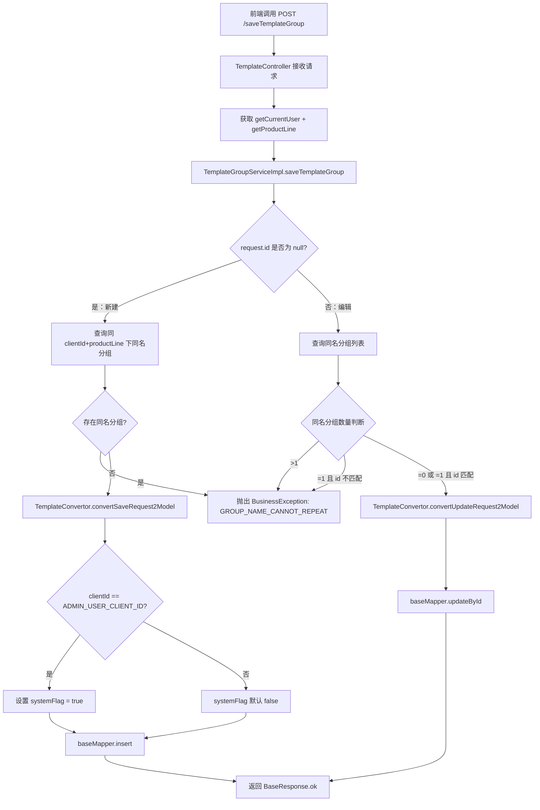
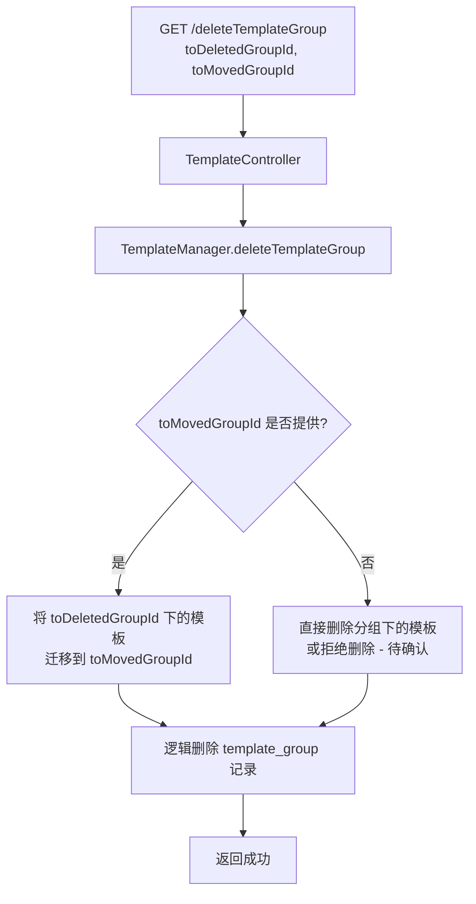
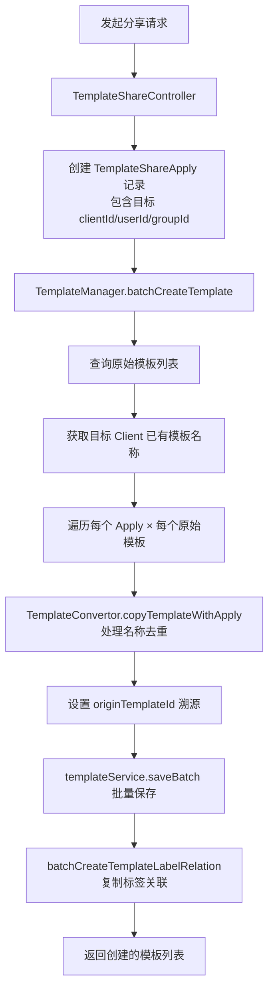
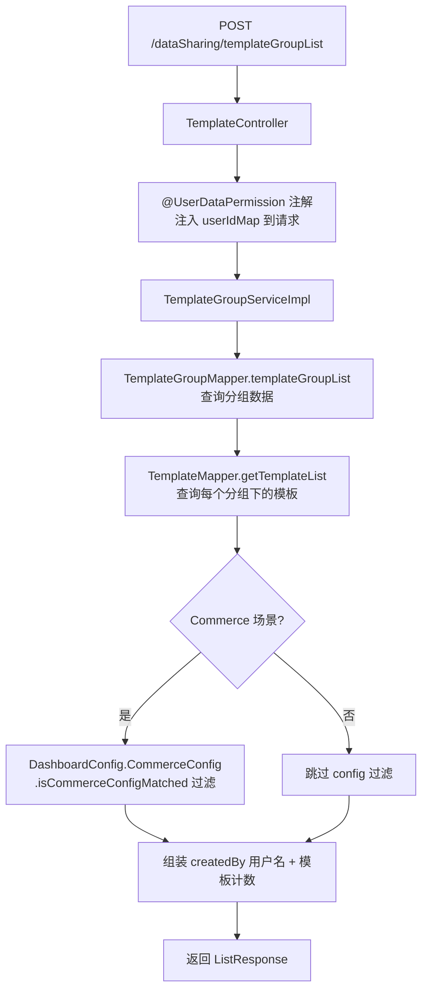

# Chart Template 管理 功能逻辑文档

> 本文档由 document-automation 工具自动生成，基于源代码、PRD 文档和技术评审文档。
> 生成时间: 2026-04-07 15:59:44
> 准确性评分: 72/100

---


# Chart Template 管理 功能逻辑文档

## 1. 模块概述

### 1.1 职责与定位

Chart Template 管理模块是 Pacvue Custom Dashboard 系统的核心组成部分，负责提供图表模板的全生命周期管理能力。用户可以将常用的图表配置抽象为模板（Template），后续在创建 Dashboard 时直接引用模板，避免重复配置，提升效率。

该模块的核心职责包括：

- **模板 CRUD**：创建、编辑、删除、查询模板
- **模板分组管理**：对模板进行分组归类，支持分组的增删改查及组内模板迁移
- **模板收藏**：用户可收藏/取消收藏模板，快速筛选常用模板
- **模板标签**：为模板打标签（最多 3 个），辅助分类和检索
- **批量引用**：在创建 Dashboard 时批量选择模板，一次性生成多个 Chart
- **跨 Client 分享**：通过 Share 机制将模板分享给其他 Client，接收方可将模板导入到自己的分组中
- **后台管理**：Pacvue 内部人员管理 Default Template（系统内置模板），并查看统计数据

### 1.2 系统架构位置

```
┌─────────────────────────────────────────────────┐
│                   前端层                          │
│  TemplateManagements / steps 组件                 │
└──────────────────────┬──────────────────────────┘
                       │ HTTP REST
┌──────────────────────▼──────────────────────────┐
│              custom-dashboard-api                 │
│  ┌─────────────────┐  ┌───────────────────────┐  │
│  │TemplateController│  │TemplateShareController│  │
│  └────────┬────────┘  └───────────┬───────────┘  │
│           │                       │               │
│  ┌────────▼────────────────────────▼───────────┐  │
│  │           TemplateManager (编排层)           │  │
│  └────────┬──────────┬──────────┬──────────────┘  │
│  ┌────────▼────┐ ┌───▼──────┐ ┌▼─────────────┐   │
│  │TemplateGroup││ Template  │ │TemplateFavorite│  │
│  │ServiceImpl  ││ Service   │ │ServiceImpl    │   │
│  └──────┬──────┘└─────┬─────┘ └──────┬────────┘  │
│         │             │              │            │
│  ┌──────▼─────────────▼──────────────▼────────┐   │
│  │         MyBatis-Plus BaseMapper 层          │   │
│  │  TemplateGroupMapper / TemplateMapper /     │   │
│  │  TemplateFavoriteMapper / TemplateLabelMapper│  │
│  └─────────────────────┬──────────────────────┘   │
└────────────────────────┼──────────────────────────┘
                         │
              ┌──────────▼──────────┐
              │     MySQL 数据库     │
              │  template           │
              │  template_group     │
              │  template_label     │
              │  template_favorite  │
              └─────────────────────┘
```

### 1.3 涉及的后端模块与前端组件

| 层级 | 组件 | 说明 |
|------|------|------|
| 后端模块 | `custom-dashboard-api` | 主服务模块 |
| 后端 Controller | `TemplateController` | 模板及分组的核心 API |
| 后端 Controller | `TemplateShareController` | 跨 Client 分享相关 API |
| 后端 Service | `TemplateGroupServiceImpl` | 模板分组业务逻辑 |
| 后端 Service | `TemplateFavoriteServiceImpl` | 模板收藏业务逻辑 |
| 后端 Service | `TemplateService` | 模板核心业务逻辑（含 checkTemplateGroup） |
| 后端 Manager | `TemplateManager` | 跨 Service 编排层（删除分组+迁移模板等事务） |
| 后端 Convertor | `TemplateConvertor` | Request ↔ Entity 转换器 |
| 前端目录 | `TemplateManagements` | 模板管理主页面 |
| 前端目录 | `steps` | 模板创建/编辑的步骤向导组件 |

### 1.4 Maven 坐标与部署方式

- Maven 坐标：**待确认**（代码片段未展示 pom.xml）
- 部署方式：作为 `custom-dashboard-api` 微服务的一部分，随主服务一起部署

---

## 2. 用户视角

### 2.1 功能场景总览

基于 PRD 文档，Template 管理模块面向以下场景：

| 场景 | 角色 | 描述 |
|------|------|------|
| 创建 Template | 普通用户 | 用户自定义图表配置并保存为模板，供后续复用 |
| 浏览 Template 列表 | 普通用户 | 按分组、图表类型筛选模板，查看名称/创建者/类型/收藏状态/热度 |
| 收藏 Template | 普通用户 | 快速标记常用模板，支持"我的收藏"快速筛选 |
| 单个引用 | 普通用户 | 在创建 Dashboard 时从 Widget Library 选择模板引用 |
| 批量引用 | 普通用户 | 一次选择多个模板批量创建 Dashboard 中的 Chart |
| 跨 Client 分享 | 普通用户 | 将模板分享给其他 Client，接收方导入到自己的分组 |
| 后台管理 | Pacvue 管理员 | 管理 Default Template，查看引用统计数据 |

### 2.2 用户操作流程

#### 2.2.1 创建 Template

1. 用户进入 Template 管理页面，点击"创建 Template"
2. **Step 1 - 基本配置**：输入 Template Name（Client 内不可重复），选择图表类型（不允许选择 White Board）
3. **Step 2 - 选择分组**：必选项，从已有分组中选择（不能选择 "Pacvue Default" 分组）
4. **Step 3 - 选择标签**：可选项，最多添加 3 个标签
5. **Step 4 - 图表配置**：配置图表的指标、物料层级等（创建模板时不选择具体的 data scope，仅选择层级）
6. 右侧实时预览假数据（预览规则见下方 2.2.2）
7. 保存模板

#### 2.2.2 模板预览假数据规则

由于创建模板时不选择具体 data scope，预览使用假数据，规则如下：

| 图表类型 | 预览规则 |
|----------|----------|
| Trend Chart - Mode 1 | 默认展示 5 根线，命名为 Material Level + 序号（如 Campaign Tag1, Campaign Tag2） |
| Trend Chart - Mode 2 | 用户选择多少个指标，展示多少根线 |
| Trend Chart - Mode 3 | 用户选择多少个指标，展示多少根线 |
| Comparison Chart (by sum / YOY-Multi Campaign / POP-Multi Campaign) | 默认展示 5 个组，每组柱子数量 = 用户选择的指标数量 |
| Comparison Chart (YOY-Multi Metric / POP-Multi Metric) | 组数 = 用户选择的 Metric 数量，每组固定 2 根柱子 |
| Pie Chart | 默认展示 10 个部分 |
| Stacked Bar Chart | 不管 by Trend 还是 by Sum，默认展示 6 个柱子 |
| Table | 默认展示 5~6 行（铺满第一页） |

#### 2.2.3 Template 列表浏览与筛选

1. 用户进入 Template 列表页
2. **筛选条件**：
   - 按 Group 筛选（多选，默认 All）
   - 按 Chart Type 筛选（多选，默认 All）
   - 快速筛选"我的收藏"
3. **列表展示信息**：Template 名称、创建者、图表类型、是否已收藏、热度（引用次数）
4. 点击可查看 Template 详情

#### 2.2.4 单个引用 Template

1. 在创建 Dashboard 页面，从 Widget Library 中选择 Template
2. 支持筛选和预览
3. 选完 Template 后，给 Chart 起名
4. 根据 Template 的 Material Level 选择对应的 data scope
5. Chart 创建完成，引用次数 +1

#### 2.2.5 批量引用 Template

1. 用户选择多个模板
2. 点击 "Go to Create" 时，系统检查是否存在不支持批量创建的模板：
   - Cross Retailer 的模板
   - Trend Chart Customized 模式的模板
   - Overview 中各 Section 物料不同的模板
   - Grid Table 类型的模板
3. 如存在不支持的模板，弹窗提示具体原因
4. 批量创建成功后，每个 Template 引用次数 +1，总次数 +n

#### 2.2.6 后台管理（Pacvue 管理员）

1. 管理 Default Template 的增删改查
2. 查看统计数据：
   - 所有 Template 引用总次数
   - 创建的 Template 总数量
   - 创建过 Template 的客户数量
   - 创建过 Template 的用户数量
   - 用户创建的 Template 数量及各类型占比
   - Template 列表展示被引用次数，可排序

### 2.3 UI 交互要点

- Template Name 在整个 Client 内唯一，保存时后端校验重复
- 分组选择为必选项，且不能选择 "Pacvue Default"（系统内置分组）
- 标签最多 3 个，为可选项
- 创建时不允许选择 White Board（V2.0 PRD 明确要求；后续版本通过 `/template/saveWhiteBoardTemplate` 单独支持白板模板）
- 收藏/取消收藏为即时操作，无需确认弹窗

---

## 3. 核心 API

### 3.1 模板分组相关 API

#### 3.1.1 查询模板分组列表（简单查询）

| 属性 | 值 |
|------|-----|
| 方法 | `GET` |
| 路径 | `/templateGroupList` |
| 描述 | 查询当前用户可见的模板分组列表，支持 systemFlag 过滤 |
| 参数 | `systemFlag: Boolean`（可选，是否系统内置） |
| 返回值 | `ListResponse<TemplateGroupInfo>` |
| 注解 | **待确认**（是否有 `@UserDataPermission`） |

**业务逻辑**：
- 获取当前用户信息（`getCurrentUser()`）和产品线（`getProductLine()`）
- 根据 clientId、productLine、systemFlag 查询 `template_group` 表
- 返回分组列表

#### 3.1.2 查询模板分组列表（数据共享场景）

| 属性 | 值 |
|------|-----|
| 方法 | `POST` |
| 路径 | `/dataSharing/templateGroupList` |
| 描述 | 跨用户数据共享场景下的模板分组列表查询，带分页/权限过滤/config 过滤 |
| 参数 | `TemplateGroupQueryRequest`（含 userIdMap、config、systemFlag、productLine） |
| 返回值 | `ListResponse<TemplateGroupInfo>` |
| 注解 | `@UserDataPermission`（注入用户权限组 userIdMap） |

**业务逻辑**：
- `@UserDataPermission` 注解自动注入当前用户的权限组 userIdMap
- 通过 `TemplateGroupMapper.templateGroupList` 查询分组数据
- 结合 `TemplateMapper.getTemplateList` 查询每个分组下的模板列表
- 通过 `DashboardConfig.CommerceConfig.isCommerceConfigMatched` 进行 config 过滤（Commerce 场景）
- 组装 createdBy 对应的用户名和模板计数
- 返回 `ListResponse`

#### 3.1.3 保存模板分组

| 属性 | 值 |
|------|-----|
| 方法 | `POST` |
| 路径 | `/saveTemplateGroup` |
| 参数 | `TemplateGroupSaveRequest`（含 id、name 等） |
| 返回值 | `BaseResponse<Void>` |

**业务逻辑**（详见代码 `saveTemplateGroup` 方法）：

1. 获取当前用户的 clientId 和 userId（null 时默认为 0）
2. 查询同 clientId + productLine 下是否存在同名分组（`delete_flag = false`）
3. **新建场景**（`request.id == null`）：
   - 如果存在同名分组 → 抛出 `BusinessException(GROUP_NAME_CANNOT_REPEAT)`
   - 通过 `TemplateConvertor.convertSaveRequest2Model` 转换为 `TemplateGroup` 实体
   - 如果 `clientId == ADMIN_USER_CLIENT_ID`，则标记 `systemFlag = true`（系统内置分组）
   - 插入 `template_group` 表
4. **编辑场景**（`request.id != null`）：
   - 如果同名分组 > 1 个 → 抛出异常
   - 如果同名分组 = 1 个且 id 不等于当前编辑的 id → 抛出异常
   - 通过 `TemplateConvertor.convertUpdateRequest2Model` 转换并更新

#### 3.1.4 删除模板分组

| 属性 | 值 |
|------|-----|
| 方法 | `GET` |
| 路径 | `/deleteTemplateGroup` |
| 参数 | `toDeletedGroupId: Long`（待删除分组 ID）, `toMovedGroupId: Long`（可选，迁移目标分组 ID） |
| 返回值 | `BaseResponse<Void>` |

**业务逻辑**：
- 由 `TemplateManager` 编排删除与模板迁移逻辑
- 如果指定了 `toMovedGroupId`，则将待删除分组下的模板迁移到目标分组
- 逻辑删除分组记录

#### 3.1.5 检查模板分组关联

| 属性 | 值 |
|------|-----|
| 方法 | `GET` |
| 路径 | `/checkTemplateGroup` |
| 参数 | `templateGroupId: Long` |
| 返回值 | `BaseResponse<Boolean>`（**待确认**具体返回类型） |

**业务逻辑**：
- 调用 `TemplateService.checkTemplateGroup` 检查分组下是否存在关联模板
- 用于删除分组前的前置校验，决定是否需要提示用户迁移模板

### 3.2 模板收藏相关 API

#### 3.2.1 收藏模板

| 属性 | 值 |
|------|-----|
| 方法 | `GET` |
| 路径 | `/collect` |
| 参数 | `templateId: Long` |
| 返回值 | `BaseResponse<Void>` |
| 注解 | `@ApiLog(value = ApiType.COLLECT)` |

**业务逻辑**：
1. 参数校验：`templateId` 不能为 null
2. 获取当前用户信息和产品线
3. 调用 `TemplateFavoriteServiceImpl.collect()`：
   - 查询是否已存在收藏记录（`commonCondition`：templateId + createdBy + productLine + deleteFlag=false）
   - 如果已存在 → 直接返回（幂等）
   - 如果不存在 → 通过 `TemplateConvertor.convertSaveRequest2Model` 创建 `TemplateFavorite` 实体并插入

#### 3.2.2 取消收藏模板

| 属性 | 值 |
|------|-----|
| 方法 | `GET` |
| 路径 | `/cancelCollect` |
| 参数 | `templateId: Long` |
| 返回值 | `BaseResponse<Void>` |
| 注解 | `@ApiLog(value = ApiType.CANCEL_COLLECT)` |

**业务逻辑**：
1. 参数校验：`templateId` 不能为 null
2. 获取当前用户信息
3. 调用 `TemplateFavoriteServiceImpl.cancelCollect()`：
   - 查询收藏记录（`commonCondition`：templateId + createdBy + deleteFlag=false，**注意 productLine 传 null，不参与过滤**）
   - 如果不存在 → 直接返回（幂等）
   - 如果存在 → 通过 `TemplateConvertor.convertUpdateRequest2Model` 创建更新实体（设置 `deleteFlag=true`），执行逻辑删除

> **注意**：收藏时使用 productLine 作为查询条件，取消收藏时不使用 productLine。这意味着取消收藏是跨产品线生效的。

### 3.3 模板分享相关 API

#### 3.3.1 批量创建模板（分享接收端）

| 属性 | 值 |
|------|-----|
| 方法 | **待确认**（代码片段未展示 Controller 层） |
| 路径 | **待确认**（位于 `TemplateShareController`） |
| 描述 | 接收分享后，为目标 Client 批量创建模板副本 |

**业务逻辑**（`TemplateManager.batchCreateTemplate`）：
1. 根据 `templateIds` 查询原始模板基本信息列表
2. 获取所有目标客户已存在的模板名称（用于去重/重命名）
3. 遍历每个 `TemplateShareApply`（代表一个目标 Client）：
   - 对每个原始模板，通过 `TemplateConvertor.copyTemplateWithApply` 创建副本
   - 设置 `originTemplateId` 为原始模板 ID（溯源）
   - 如果目标 Client 已存在同名模板，自动重命名（具体规则在 `copyTemplateWithApply` 中处理）
   - 将副本加入待插入列表
4. 批量保存（`templateService.saveBatch`）
5. 返回创建的模板列表

#### 3.3.2 批量创建模板标签关联

| 属性 | 值 |
|------|-----|
| 方法 | **待确认** |
| 描述 | 分享模板时同步复制标签关联关系 |

**业务逻辑**（`batchCreateTemplateLabelRelation`）：
- 根据原始 templateIds 和 insertApplyList，为新创建的模板建立标签关联
- 返回 `List<TemplateLabelRelation>`

### 3.4 白板模板 API

#### 3.4.1 保存白板模板

| 属性 | 值 |
|------|-----|
| 方法 | **待确认**（推测为 POST） |
| 路径 | `/template/saveWhiteBoardTemplate` |
| 描述 | 保存白板类型的模板，白板不需要生成 ChartLabel |

### 3.5 其他待确认 API

根据模块骨架和 PRD，以下 API 应存在但代码片段未完整展示：

| 功能 | 推测路径 | 说明 |
|------|----------|------|
| 模板列表查询 | `/templateList` 或 `/dataSharing/templateList` | 查询模板列表，支持分页/筛选 |
| 创建/编辑模板 | `/saveTemplate` | 保存模板配置 |
| 删除模板 | `/deleteTemplate` | 逻辑删除模板 |
| 复制模板 | `/copyTemplate` | 复制模板 |
| 批量引用创建 Dashboard | `/quicklyApplyTemplates` | 批量选择模板创建 Dashboard |
| 模板详情 | `/templateDetail` | 查看模板详情 |

---

## 4. 核心业务流程

### 4.1 模板分组保存流程



### 4.2 模板收藏/取消收藏流程

```mermaid
flowchart TD
    subgraph 收藏流程
        A1[GET /collect?templateId=xxx] --> B1[参数校验]
        B1 --> C1[获取 userInfo + productLine]
        C1 --> D1[查询已有收藏记录<br/>条件: templateId + userId + productLine + deleteFlag=false]
        D1 --> E1{记录存在?}
        E1 -->|是| F1[直接返回 - 幂等]
        E1 -->|否| G1[创建 TemplateFavorite 实体]
        G1 --> H1[insert 到 template_favorite 表]
        H1 --> I1[返回成功]
    end
    
    subgraph 取消收藏流程
        A2[GET /cancelCollect?templateId=xxx] --> B2[参数校验]
        B2 --> C2[获取 userInfo]
        C2 --> D2[查询收藏记录<br/>条件: templateId + userId + deleteFlag=false<br/>注意: 不过滤 productLine]
        D2 --> E2{记录存在?}
        E2 -->|否| F2[直接返回 - 幂等]
        E2 -->|是| G2[创建更新实体: deleteFlag=true]
        G2 --> H2[update template_favorite 表]
        H2 --> I2[返回成功]
    end
```



### 4.3 模板分组删除流程



> **说明**：删除分组前，前端通常先调用 `/checkTemplateGroup` 检查是否有关联模板。如果有，提示用户选择迁移目标分组。

### 4.4 跨 Client 模板分享流程



### 4.5 数据共享场景下的分组列表查询流程



### 4.6 关键设计模式说明

#### 4.6.1 Converter/Convertor 模式

`TemplateConvertor` 类集中负责所有 Request → Entity 的转换逻辑，避免转换代码散落在 Service 层。主要方法包括：

| 方法 | 用途 |
|------|------|
| `convertSaveRequest2Model(productLine, request, userId, clientId)` | 将 `TemplateGroupSaveRequest` 转换为 `TemplateGroup` 实体 |
| `convertUpdateRequest2Model(request, userId)` | 将编辑请求转换为更新实体 |
| `convertSaveRequest2Model(userInfo, productLine, templateId)` | 将收藏请求转换为 `TemplateFavorite` 实体 |
| `convertUpdateRequest2Model(userInfo)` | 创建取消收藏的

---

> **自动审核备注**: 准确性评分 72/100
>
> **待修正项**:
> - [error] 文档中收藏 API 的描述被截断，未完整展示。更重要的是，文档缺少对取消收藏 API (`/cancelCollect`) 的完整描述。代码中明确存在 `@GetMapping("/cancelCollect")` 和 `@ApiLog(value = ApiType.CANCEL_COLLECT)`。
> - [error] 文档未描述 `cancelCollect` 的实际实现逻辑。根据代码，`cancelCollect` 并非物理删除收藏记录，而是通过 `update` 操作将 `deleteFlag` 设置为 `true`（逻辑删除）。同时 `cancelCollect` 方法签名中不接收 `productLine` 参数（`commonCondition(userInfo, null, templateId)`），而 `collect` 方法接收 `productLine`。这一差异需要在文档中明确说明。
> - [warning] 文档描述新建分组时使用 `TemplateConvertor.convertSaveRequest2Model` 转换为 `TemplateGroup` 实体，编辑时使用 `TemplateConvertor.convertUpdateRequest2Model`。但从代码片段来看，`convertSaveRequest2Model` 和 `convertUpdateRequest2Model` 这两个方法名在 TemplateConvertor 中确实存在（用于 TemplateFavorite），但用于 TemplateGroup 的转换方法名是否完全一致无法从提供的代码片段中确认。代码片段中展示的 TemplateGroup 构造是直接 `new TemplateGroup()` 并逐字段设置，并非通过明确命名的 convertor 方法。
> - [warning] 文档描述删除分组由 `TemplateManager` 编排，包含逻辑删除和模板迁移。但代码片段中未提供 `TemplateManager` 或 `deleteTemplateGroup` 的实现代码，无法验证该描述的准确性。文档中提到的 '逻辑删除分组记录' 也无法从代码片段中确认。
> - [warning] 文档描述调用 `TemplateService.checkTemplateGroup` 检查分组下是否存在关联模板，但代码片段中未提供该方法的实现，返回类型标注为 '待确认'。


---

*本文档由 AI 自动生成，如有不准确之处请以源代码为准。标注"待确认"的内容需要人工核实。*