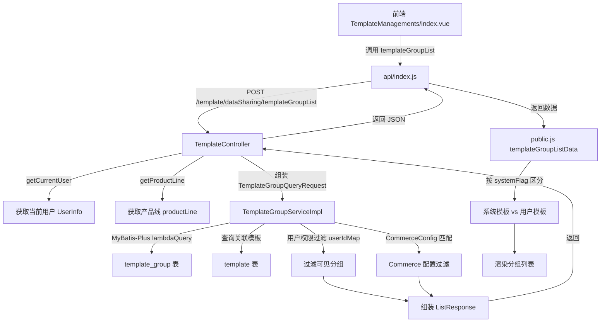
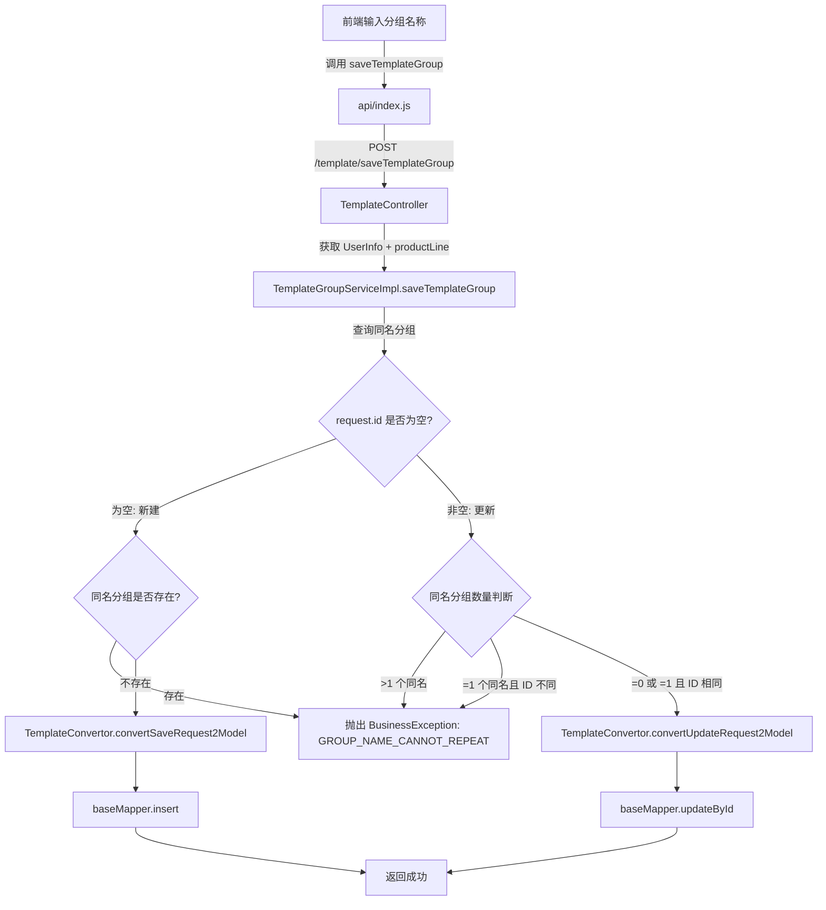
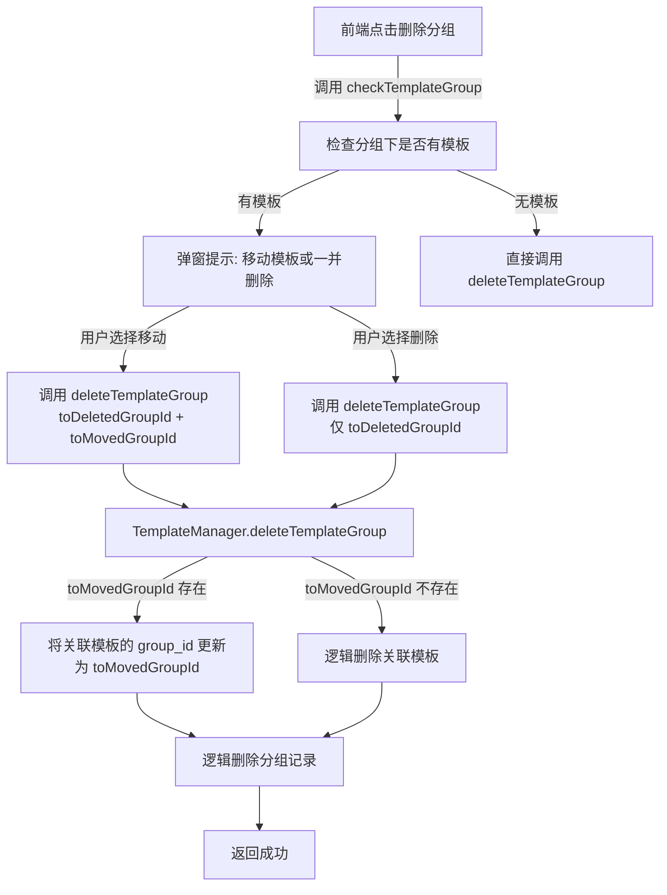
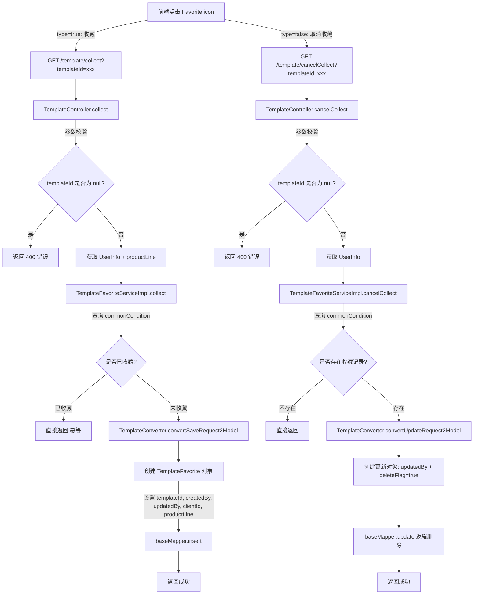
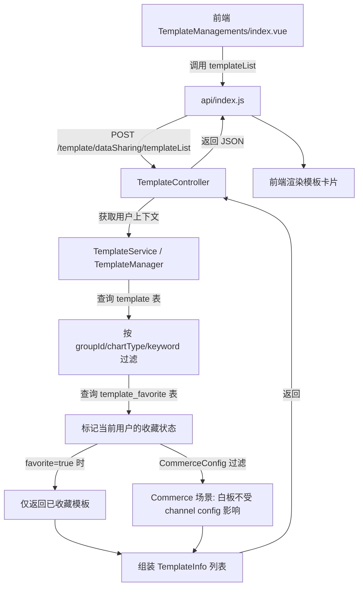
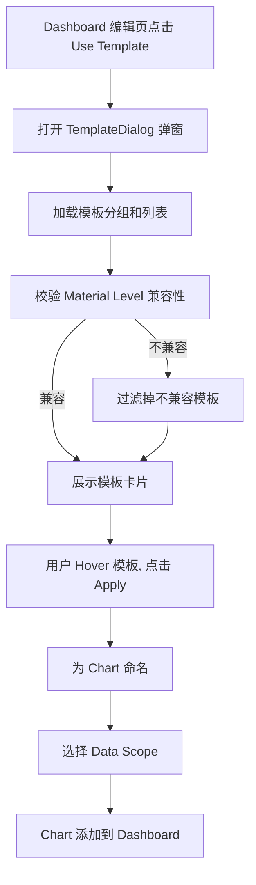

# Chart Template 管理 功能逻辑文档

> 本文档由 document-automation 工具自动生成，基于源代码、PRD 文档和技术评审文档。
> 生成时间: 2026-04-09 09:51:32
> 准确性评分: 未验证/100

---


# Chart Template 管理 功能逻辑文档

## 1. 模块概述

### 1.1 职责与定位

Chart Template 管理模块是 Pacvue Custom Dashboard 系统的核心子模块之一，负责提供图表模板（Chart Template）的全生命周期管理能力。用户可以将常用的图表配置保存为模板，后续在创建 Dashboard 时直接引用模板，避免重复配置，提升效率。

该模块的核心职责包括：

- **模板 CRUD**：创建、编辑、删除、复制图表模板
- **模板分组管理**：创建/删除/重命名模板分组（Template Group），将模板归类管理
- **模板收藏**：用户可收藏/取消收藏模板，快速筛选常用模板
- **模板标签**：为模板添加标签（Label），支持按标签分类和筛选
- **批量引用**：在 Dashboard 编辑页面批量选择模板并应用到 Dashboard
- **快速创建 Dashboard**：从模板管理页面直接选择多个模板，快速创建新 Dashboard
- **跨 Client 分享**：支持将模板分享给其他 Client 使用（HQ 场景）
- **系统默认模板**：Admin 用户可创建系统内置模板（Pacvue Default），供所有用户参考使用

### 1.2 系统架构位置

```
┌─────────────────────────────────────────────────────┐
│                    前端 (Vue)                         │
│  TemplateManagements/index.vue                       │
│  steps/ (创建/编辑模板步骤组件)                        │
│  TemplateDialog.vue (Dashboard编辑页模板选择弹窗)      │
│  api/index.js (API 调用层)                            │
│  public/public.js (公共方法层)                         │
└──────────────────────┬──────────────────────────────┘
                       │ HTTP REST
                       ▼
┌─────────────────────────────────────────────────────┐
│              后端 (Spring Boot)                       │
│  custom-dashboard-api                                │
│  ├── TemplateController (/template)                  │
│  ├── TemplateShareController (分享相关)               │
│  ├── TemplateGroupServiceImpl                        │
│  ├── TemplateFavoriteServiceImpl                     │
│  ├── TemplateService / TemplateManager               │
│  ├── TemplateConvertor (对象转换)                     │
│  └── MyBatis-Plus Mapper 层                          │
└──────────────────────┬──────────────────────────────┘
                       │ JDBC
                       ▼
┌─────────────────────────────────────────────────────┐
│              数据库 (MySQL)                           │
│  template / template_group / template_label          │
│  template_favorite                                   │
└─────────────────────────────────────────────────────┘
```

### 1.3 涉及的后端模块与前端组件

**后端模块（Maven 模块）**：
- `custom-dashboard-api` — 主要的 API 服务模块

**后端核心包**：
- `com.pacvue.api.controller.TemplateController` — 模板管理主控制器
- `com.pacvue.api.controller.TemplateShareController` — 模板分享控制器

**前端组件**：
- `TemplateManagements/index.vue` — 模板管理主页面，包含分组列表、模板卡片展示、筛选、批量操作、分享回调等
- `TempleteNameAry.vue` — 模板名称列表展示组件，支持展开/收起
- `TemplateDialog.vue` — Dashboard 编辑页中的模板选择弹窗
- `steps/` — 创建/编辑模板的步骤组件目录
- `api/index.js` — API 调用层，封装 `templateGroupList`、`templateList`、`saveTemplateGroup`、`checkTemplateGroup` 等方法
- `public/public.js` — 公共方法层，包含 `templateGroupListData` 方法，处理 commerce config 组装与分组数据过滤

### 1.4 核心设计模式

| 设计模式 | 应用位置 | 说明 |
|---|---|---|
| Converter/Assembler 模式 | `TemplateConvertor` | 负责 Request ↔ Model ↔ Response 之间的对象转换 |
| Manager 层模式 | `TemplateManager` | 封装跨 Service 的组合操作（如 deleteTemplateGroup 涉及模板迁移） |
| MyBatis-Plus BaseMapper 模式 | `TemplateGroupServiceImpl` 等 | 继承 `ServiceImpl`，利用 MyBatis-Plus 提供的通用 CRUD |
| 注解驱动权限控制 | `@UserDataPermission` | 在 Controller 方法上声明数据权限过滤 |
| 注解驱动审计日志 | `@ApiLog(value = ApiType.XXX)` | 自动记录操作日志 |

---

## 2. 用户视角

### 2.1 模板管理主页面

**入口**：Custom Dashboard Home Page 上的 **【Chart Library】** 按钮，点击后打开 Template Management 页面。

#### 2.1.1 页面布局

页面分为以下区域：

1. **顶部操作栏**：包含 Create Template、Quick Create、Bulk Operation、Search Template、Filter 等操作按钮
2. **左侧分组列表（Group）**：展示所有模板分组，包含系统分组（Pacvue Default）和用户自定义分组
3. **右侧模板卡片区域**：以卡片形式展示当前分组下的模板
4. **底部已选模板栏**：当选中模板时，页面下方展示选中的 Template 名称

#### 2.1.2 分组管理（Group）

**查看分组**：
1. 左侧展示分组列表，选择某个 Group 后，右侧展示该 Group 下的所有 Template
2. 选中 "All" 时，展示所有 Template
3. 分组分为系统分组（`systemFlag=true`，由 Admin 创建）和用户分组（`systemFlag=false`）

**新增分组**：
1. 点击分组列表旁的加号 icon
2. 弹出弹窗，输入分组名称
3. 分组名称在同一 Client + ProductLine 下不能重复
4. 确认后调用 `saveTemplateGroup` 接口创建

**编辑分组**：
1. 对已有分组进行重命名
2. 同样调用 `saveTemplateGroup` 接口（传入 `id` 字段表示更新）
3. 名称唯一性校验逻辑同创建

**删除分组**：
1. 点击删除按钮前，系统先调用 `checkTemplateGroup` 接口检查该分组下是否有关联模板
2. 如果有关联模板，提示用户选择将模板移至其他分组或一并删除
3. 调用 `deleteTemplateGroup` 接口，传入 `toDeletedGroupId`（必填）和 `toMovedGroupId`（可选，指定模板迁移目标分组）

**权限控制**：
- 分组操作涉及权限控制，需验证当前登录用户的菜单权限 + 数据权限
- 如无权限，则不可创建、编辑、删除 Group

#### 2.1.3 模板列表与筛选

**筛选功能**：
- **按 Group 筛选**：选择左侧分组
- **按 Chart Type 筛选**：支持多选，默认选中 All
- **按 Data Source 筛选**（Commerce 场景）：枚举值包括 Seller、Vendor
- **Favorite only**：勾选后仅展示已收藏的模板，与 Chart Type 筛选取交集
- **关键词搜索**：Search Template 输入框

**模板卡片展示**：
- 每张卡片展示：勾选框、Favorite icon、Popularity（引用次数）、Creator Name
- 卡片下方展示 Template 名称及 Tag（标签）
- **Label 自动生成规则**：
  - Data Source: Channel + (Distributor View) + Program，如 "Seller | SnS"、"Vendor | Sourcing | Retail"
  - Material Level
  - Time Segment
  - Find Metric from
  - X-axis Type

**Hover 交互**：
- 鼠标 hover 模板卡片时，右上角展示 **【Edit】【Copy】【Delete】【Favorite】** 四个 icon
- 点击卡片进入模板明细页

#### 2.1.4 创建模板

**操作流程**：
1. 点击 **【Create Template】** 按钮，在下拉框中选择需要创建的图表类型
2. **Commerce 场景**：初始化弹窗仅展示 **【Channel】** 筛选框，选择后对应展示 Distributor View/Program/Dimension，Program 可多选
3. **HQ 场景**：直接填写 Template Name 和 Group
4. 填写模板详情：
   - **Template Name**（必填）：在整个 Client 内不能重复
   - **Group**（必填）：选择分组，不能选择 Pacvue Default
   - **Introduction**（可选）：模板描述
   - **标签**（可选）：最多添加 3 个标签
5. 配置图表参数（Material Level、Metrics 等），图表的 Material Level 和 Metrics 与用户选择的 Data Source 联动
6. Material Level 不支持下钻到具体的物料层级（即不选择具体的 data scope）
7. 创建时**不允许选择 White Board**（注：后续版本已支持白板模板，见版本演进章节）
8. 右侧展示假数据预览

**预览假数据规则**（基于 PRD）：

| 图表类型 | 预览规则 |
|---|---|
| Trend Chart - mode1 | 默认展示 5 根线，命名为 Material Level + 序号（如 Campaign Tag1, Campaign Tag2） |
| Trend Chart - mode2 | 用户选择多少个指标，展示多少根线 |
| Trend Chart - mode3 | 用户选择多少个指标，展示多少根线 |
| Comparison Chart (by sum/YOY-Multi/POP-Multi Campaign) | 默认展示 5 个组，每组柱子数量根据用户选择的指标数量决定 |
| Comparison Chart (YOY-Multi Metric/POP-Multi Metric) | 用户选了几个 Metric 就展示几个组，每组固定 2 根柱子 |
| Pie Chart | 默认展示 10 个部分 |
| Stacked Bar Chart | 不管 by Trend 还是 by sum，默认展示 6 个柱子 |
| Table | 默认展示 5-6 行，以铺满第一页为准 |

#### 2.1.5 编辑模板

- 点击模板卡片上的 **【Edit】** icon 进入编辑模式
- 可修改模板名称、分组、标签、图表配置等
- 保存时同样进行名称唯一性校验

#### 2.1.6 复制模板

- 点击 **【Copy】** icon，系统创建一份模板副本
- 副本名称通常在原名基础上追加后缀（如 "Copy"）
- 副本归属当前用户

#### 2.1.7 删除模板

- 点击 **【Delete】** icon，弹出二次确认弹窗
- 确认后执行逻辑删除（`delete_flag` 置为 1）

#### 2.1.8 收藏/取消收藏

**收藏操作**：
1. 点击模板卡片上的 Favorite icon（空心星 → 实心星）
2. 前端调用 `collect(templateId)` 接口
3. 成功后更新卡片上的 favorite 状态
4. 提示 "操作成功"

**取消收藏**：
1. 点击已收藏模板的 Favorite icon（实心星 → 空心星）
2. 前端调用 `cancelCollect(templateId)` 接口
3. 取消收藏实际是逻辑删除（`delete_flag` 置为 true）

**前端代码逻辑**（来自 `index.clickFavorite`）：
```javascript
const clickFavorite = (type, val) => {
  let params = type ? collect(val.id) : cancelCollect(val.id)
  params.then((res) => {
    // 更新列表中对应模板的 favorite 状态
    const index = templateData.value.findIndex((item) => item.id === val.id)
    if (index !== -1) {
      templateData.value[index].favorite = type
    }
    // 如果在详情页，也更新详情页的 favorite 状态
    if (isDetail.value) {
      currentCheckedTemplate.value.favorite = type
    }
    PacvueMessage({ message: $t("amskey2539"), type: "success" })
  }).catch((err) => {
    PacvueMessage({ message: $t("amskey2540"), type: "error" })
  })
}
```

#### 2.1.9 批量操作

**Bulk Delete**：
1. 勾选多个模板后，点击 **【Bulk Operation】** → **【Bulk Delete】**
2. 弹出二次确认弹窗
3. 确认后批量删除选中的模板

**Bulk Move**：
1. 勾选多个模板后，点击 **【Bulk Operation】** → **【Bulk Move】**
2. 弹出弹窗，选择目标 Group
3. 确认后将选中模板批量移动到新 Group 下

**Bulk Share**（仅 HQ 场景）：
1. 勾选多个模板后，点击 **【Bulk Operation】** → **【Bulk Share】**
2. 将模板分享给其他 Client

#### 2.1.10 快速创建 Dashboard（Quick Create）

1. 在模板管理页面勾选多个模板，**【Quick Create】** 按钮变为可用
2. 点击后，系统校验选中的 Template 物料层级是否可存在于同一个 Dashboard 的 Data Source 中
3. 如果兼容，打开 Edit Dashboard 页面，根据选中的模板创建新 Dashboard
4. 如果不兼容，弹窗提示用户具体原因，手动关闭页面无需刷新
5. **注意**：Quick Create 仅 HQ 场景支持，Commerce 场景不支持

### 2.2 Dashboard 编辑页中的模板引用

#### 2.2.1 单个引用（Use Template）

1. 在 Dashboard 编辑页面，操作栏有 **【Use Template】** 按钮
2. 点击后弹出模板选择弹窗（`TemplateDialog.vue`）
3. 弹窗中展示分组列表和模板卡片，支持搜索、Favorite only 筛选
4. 系统校验 Template 的 Material Level 是否与当前 Dashboard 的 Data Source 兼容
   - 兼容：正常展示
   - 不兼容：过滤掉不展示
5. 弹窗底部展示文案："The current data source is xxx. Some templates that are not applicable to this data source have been filtered out."
6. Hover 模板卡片时展示 **【Apply】** 按钮
7. 点击 Apply 将模板应用到 Dashboard
8. 应用后需要给 Chart 起名字，并按照模板的 Material Level 让用户选择对应的 data scope

#### 2.2.2 批量应用（quicklyApplyTemplates）

- 通过 `/template/quicklyApplyTemplates` 接口批量应用模板到 Dashboard
- 请求参数中包含 `whiteboardSaveRequestList`（用于白板类型模板）

### 2.3 Figma 设计稿参考

根据 Figma 设计稿信息：

- **选择 Template 弹窗**：包含 "Use Template"、"Back"、"Save as Draft"、"Save" 按钮，以及 "Select template"、"Cancel"、"Apply" 操作区域
- **Dashboard 编辑页**：顶部操作栏包含 "Add Chart"、"Use Template"、"Currency"（US Dollar）、"Back"、"Save as Draft"、"Save" 按钮
- **模板列表表格**：展示 Template Name、Template Line、Chart Type、Group、Creator name、popularity 等列
- **模板后台管理**：基础表格形式展示模板列表

---

## 3. 核心 API

### 3.1 模板分组相关

#### 3.1.1 查询模板分组列表

- **路径**: `POST /template/dataSharing/templateGroupList`
- **权限注解**: `@UserDataPermission`（用户数据权限过滤）
- **请求参数**: `TemplateGroupQueryRequest`

| 字段 | 类型 | 必填 | 说明 |
|---|---|---|---|
| config | List<CommerceConfig> | 否 | Commerce 配置过滤条件 |
| userIdMap | Map | 否 | 用户 ID 映射（数据权限） |
| userInfo | UserInfo | 否 | 当前用户信息（由 Controller 注入） |
| productLine | String | 否 | 产品线（由 Header 获取） |
| systemFlag | Boolean | 否 | 是否系统内置分组 |

- **返回值**: `ListResponse<TemplateGroupInfo>`
- **说明**: 查询当前用户可见的模板分组列表。结合用户权限组（userIdMap）过滤可见分组和模板，通过 `DashboardConfig.CommerceConfig` 进行 commerce 配置匹配过滤。

**前端调用方式**（`api/index.js`）：
```javascript
export function templateGroupList(config = []) {
  let data = {}
  if (config.length > 0) {
    data.config = config
  }
  return request({
    url: `${VITE_APP_CustomDashbord}template/dataSharing/templateGroupList`,
    method: "post",
    headers: {
      productline: productlineFun()
    },
    data: data,
    isIgnoreRequestRegister: true
  })
}
```

前端 `public.js` 中的 `templateGroupListData` 方法会进一步处理返回数据，按 `systemFlag` 区分系统模板和用户模板进行展示。

#### 3.1.2 保存/更新模板分组

- **路径**: `POST /template/saveTemplateGroup`
- **请求参数**: `TemplateGroupSaveRequest`

| 字段 | 类型 | 必填 | 说明 |
|---|---|---|---|
| id | Long | 否 | 分组 ID，为空表示新建，非空表示更新 |
| name | String | 是 | 分组名称 |

- **返回值**: `BaseResponse<Void>`
- **说明**: 创建或更新模板分组。名称在同一 Client + ProductLine 下不能重复。

**前端调用方式**：
```javascript
saveTemplateGroup(data) {
  return request({
    url: `${VITE_APP_CustomDashbord}template/saveTemplateGroup`,
    method: "post",
    data: data
  })
}
```

#### 3.1.3 删除模板分组

- **路径**: `GET /template/deleteTemplateGroup`
- **请求参数**:

| 参数 | 类型 | 必填 | 说明 |
|---|---|---|---|
| toDeletedGroupId | Long | 是 | 要删除的分组 ID |
| toMovedGroupId | Long | 否 | 关联模板迁移的目标分组 ID |

- **返回值**: `BaseResponse<Void>`
- **说明**: 删除指定分组。如果提供了 `toMovedGroupId`，则将该分组下的模板迁移到目标分组；否则一并删除关联模板。

#### 3.1.4 检查分组关联模板

- **路径**: `GET /template/checkTemplateGroup`
- **请求参数**:

| 参数 | 类型 | 必填 | 说明 |
|---|---|---|---|
| templateGroupId | Long | 是 | 分组 ID |

- **返回值**: `BaseResponse<Boolean>`（**待确认**具体返回结构）
- **说明**: 检查指定分组下是否有关联的 template，用于删除前校验。

**前端调用方式**（`api/index.js`）：
```javascript
export function checkTemplateGroup(templateGroupId) {
  // 具体实现待确认
}
```

### 3.2 模板列表相关

#### 3.2.1 查询模板列表

- **路径**: `POST /template/dataSharing/templateList`（从前端代码推断，路径含 `dataSharing` 前缀）
- **请求参数**:

| 字段 | 类型 | 必填 | 说明 |
|---|---|---|---|
| favorite | Boolean | 否 | 是否仅查询收藏模板 |
| groupId | List<Long> | 否 | 分组 ID 列表，空数组表示查询所有 |
| chartType | List<String> | 否 | 图表类型筛选，空数组表示查询所有 |
| keyword | String | 否 | 关键词搜索 |
| config | List<CommerceConfig> | 否 | Commerce 配置过滤 |

- **返回值**: `ListResponse<TemplateInfo>`（**待确认**）
- **说明**: 查询模板列表，支持多维度筛选。

**前端调用方式**（`api/index.js`）：
```javascript
export function templateList(favorite, groupId, chartType, keyword = "", config = []) {
  let data = {
    favorite: favorite,
    groupId: groupId == "" ? [] : [groupId],
    chartType: chartType == "" ? [] : chartType,
    keyword: keyword
  }
  if (config.length > 0) {
    data.config = config
  }
  return request({
    url: `${VITE_APP_CustomDashbord}template/dataSharing/templateList`,
    method: "post",
    data: data
  })
}
```

### 3.3 模板收藏相关

#### 3.3.1 收藏模板

- **路径**: `GET /template/collect`
- **审计日志**: `@ApiLog(value = ApiType.COLLECT)`
- **请求参数**:

| 参数 | 类型 | 必填 | 说明 |
|---|---|---|---|
| templateId | Long | 是 | 模板 ID |

- **返回值**: `BaseResponse<Void>`
- **说明**: 收藏指定模板。如果已收藏则幂等返回成功。

#### 3.3.2 取消收藏

- **路径**: `GET /template/cancelCollect`
- **审计日志**: `@ApiLog(value = ApiType.CANCEL_COLLECT)`
- **请求参数**:

| 参数 | 类型 | 必填 | 说明 |
|---|---|---|---|
| templateId | Long | 是 | 模板 ID |

- **返回值**: `BaseResponse<Void>`
- **说明**: 取消收藏指定模板。实际是逻辑删除（`delete_flag` 置为 true）。

### 3.4 模板标签相关

#### 3.4.1 获取标签列表

- **路径**: `GET /template/templateLabelList`
- **请求参数**: 无
- **返回值**: `ListResponse<TemplateLabel>`（**待确认**具体返回结构）
- **说明**: 获取当前产品线下的模板标签列表。

### 3.5 白板模板相关

#### 3.5.1 保存白板模板

- **路径**: `POST /template/saveWhiteBoardTemplate`（来自技术评审文档）
- **请求参数**: **待确认**（JSON 格式，白板不需要生成 labels）
- **返回值**: **待确认**
- **说明**: 保存白板类型的模板。保存时注意 ChartLabel 生成逻辑，白板不需要生成 labels。

#### 3.5.2 快速批量应用模板

- **路径**: `POST /template/quicklyApplyTemplates`（来自技术评审文档）
- **请求参数**: 包含 `whiteboardSaveRequestList`（`List<WhiteBoardSaveRequest>`）
- **返回值**: **待确认**
- **说明**: 快速批量应用模板到 Dashboard，支持白板类型模板。

### 3.6 API 汇总表

| 方法 | 路径 | 说明 | 审计日志 | 权限注解 |
|---|---|---|---|---|
| POST | `/template/dataSharing/templateGroupList` | 查询模板分组列表 | — | `@UserDataPermission` |
| POST | `/template/saveTemplateGroup` | 创建/更新模板分组 | — | — |
| GET | `/template/deleteTemplateGroup` | 删除模板分组 | — | — |
| GET | `/template/checkTemplateGroup` | 检查分组关联模板 | — | — |
| GET | `/template/templateLabelList` | 获取标签列表 | — | — |
| POST | `/template/dataSharing/templateList` | 查询模板列表 | — | — |
| GET | `/template/collect` | 收藏模板 | `@ApiLog(COLLECT)` | — |
| GET | `/template/cancelCollect` | 取消收藏 | `@ApiLog(CANCEL_COLLECT)` | — |
| POST | `/template/saveWhiteBoardTemplate` | 保存白板模板 | **待确认** | **待确认** |
| POST | `/template/quicklyApplyTemplates` | 批量应用模板 | **待确认** | **待确认** |

---

## 4. 核心业务流程

### 4.1 模板分组列表查询流程



**详细步骤**：

1. **前端发起请求**：`TemplateManagements/index.vue` 组件在挂载或筛选条件变化时，调用 `api/index.js` 中的 `templateGroupList(config)` 方法。如果是 Commerce 场景，会传入 `config` 数组（CommerceConfig 列表）。
2. **请求头注入产品线**：前端在请求 headers 中注入 `productline` 字段，值由 `productlineFun()` 方法获取。
3. **Controller 接收请求**：`TemplateController` 的 `templateGroupList` 方法接收 `TemplateGroupQueryRequest`，通过 `getCurrentUser()` 获取当前登录用户的 `UserInfo`（包含 userId、clientId 等），通过 `getProductLine()` 从请求头获取产品线标识。
4. **权限注解生效**：`@UserDataPermission` 注解在方法执行前进行数据权限校验，注入 `userIdMap`（当前用户可见的用户 ID 集合）。
5. **Service 层查询**：`TemplateGroupServiceImpl` 通过 MyBatis-Plus 的 `BaseMapper` 查询 `template_group` 表，条件包括：
   - `client_id` 匹配当前用户的 clientId
   - `product_line` 匹配当前产品线
   - `delete_flag = false`
6. **关联模板查询**：通过 `TemplateMapper` 查询每个分组下的模板数量和信息。
7. **权限过滤**：结合 `userIdMap` 过滤出当前用户有权查看的分组和模板。
8. **Commerce 配置过滤**：如果请求中包含 `config`，通过 `DashboardConfig.CommerceConfig` 进行匹配过滤，确保只返回与当前 Commerce 配置兼容的模板。
9. **对象转换**：通过 `TemplateConvertor` 将数据库实体转换为 `TemplateGroupInfo` DTO。
10. **返回前端**：Controller 返回 `ListResponse<TemplateGroupInfo>`。
11. **前端二次处理**：`public.js` 中的 `templateGroupListData` 方法接收返回数据，按 `systemFlag` 字段区分系统模板（Pacvue Default）和用户自定义模板，分别渲染到左侧分组列表中。

### 4.2 保存模板分组流程



**详细步骤**（基于后端代码 `saveTemplateGroup` 方法）：

1. **获取用户上下文**：从 `UserInfo` 中获取 `clientId` 和 `userId`，如果为 null 则默认为 0L。
2. **名称唯一性校验**：查询 `template_group` 表，条件为：
   - `name = request.getName()`
   - `client_id = clientId`
   - `delete_flag = false`
   - `product_line = productLine`
3. **新建逻辑**（`request.getId()` 为 null）：
   - 如果查询到同名分组（`templateGroupList` 不为空），抛出 `BusinessException(GROUP_NAME_CANNOT_REPEAT)`
   - 否则通过 `TemplateConvertor.convertSaveRequest2Model` 创建 `TemplateGroup` 对象
   - 设置 `name`、`createdBy`、`updatedBy`、`clientId`、`productLine`
   - 如果 `clientId` 等于 `ADMIN_USER_CLIENT_ID`，则设置 `systemFlag = true`（系统内置分组）
   - 调用 `baseMapper.insert` 插入数据库
4. **更新逻辑**（`request.getId()` 非 null）：
   - 如果查询到超过 1 个同名分组，抛出异常
   - 如果查询到 1 个同名分组且其 ID 与 `request.getId()` 不同，抛出异常
   - 否则通过 `TemplateConvertor.convertUpdateRequest2Model` 创建更新对象
   - 调用 `baseMapper.updateById` 更新数据库

### 4.3 删除模板分组流程



**详细步骤**：

1. **前置检查**：前端先调用 `GET /template/checkTemplateGroup?templateGroupId=xxx` 检查分组下是否有关联模板。
2. **用户决策**：如果有关联模板，前端弹窗让用户选择：
   - 将模板移至其他分组（需选择目标分组）
   - 一并删除模板
3. **执行删除**：调用 `GET /template/deleteTemplateGroup?toDeletedGroupId=xxx&toMovedGroupId=yyy`
4. **Manager 层处理**：`TemplateManager.deleteTemplateGroup` 封装了跨 Service 的组合操作：
   - 如果 `toMovedGroupId` 存在，先将关联模板的 `group_id` 批量更新为目标分组 ID
   - 如果 `toMovedGroupId` 不存在，逻辑删除所有关联模板
   - 最后逻辑删除分组记录本身

### 4.4 模板收藏/取消收藏流程



**收藏详细步骤**（基于后端代码）：

1. Controller 层 `collect` 方法接收 `templateId` 参数，校验非空
2. 获取当前用户 `UserInfo` 和 `productLine`
3. 调用 `TemplateFavoriteServiceImpl.collect(userInfo, productLine, templateId)`
4. Service 层通过 `commonCondition` 构建查询条件（userInfo + productLine + templateId），查询 `template_favorite` 表
5. 如果已存在收藏记录（`Objects.nonNull(templateFavorite)`），直接返回（幂等设计）
6. 如果不存在，通过 `TemplateConvertor.convertSaveRequest2Model` 创建 `TemplateFavorite` 对象：
   - `templateId` = 传入的模板 ID
   - `createdBy` = `userInfo.getUserId()`
   - `updatedBy` = `userInfo.getUserId()`
   - `clientId` = `userInfo.getClientId()`
   - `productLine` = 传入的产品线
7. 调用 `baseMapper.insert` 插入记录

**取消收藏详细步骤**：

1. Controller 层 `cancelCollect` 方法接收 `templateId` 参数，校验非空
2. 获取当前用户 `UserInfo`（注意：取消收藏不需要 productLine）
3. 调用 `TemplateFavoriteServiceImpl.cancelCollect(userInfo, templateId)`
4. Service 层通过 `commonCondition` 查询（userInfo + null productLine + templateId）
5. 如果不存在收藏记录，直接返回
6. 如果存在，通过 `TemplateConvertor.convertUpdateRequest2Model` 创建更新对象：
   - `updatedBy` = `userInfo.getUserId()`
   - `deleteFlag` = `true`
7. 调用 `baseMapper.update` 执行逻辑删除

### 4.5 模板列表查询流程



**详细步骤**：

1. 前端组装请求参数：`favorite`（是否仅收藏）、`groupId`（分组 ID 数组）、`chartType`（图表类型数组）、`keyword`（搜索关键词）、`config`（Commerce 配置）
2. 发送 POST 请求到 `/template/dataSharing/templateList`
3. 后端查询 `template` 表，按条件过滤
4. 关联查询 `template_favorite` 表，标记当前用户是否已收藏每个模板
5. 如果 `favorite=true`，仅返回已收藏的模板
6. Commerce 场景下，白板类型模板的过滤不受 channel config 影响（来自技术评审文档）
7. 返回模板列表，前端渲染为卡片形式

### 4.6 模板应用到 Dashboard 流程



---

## 5. 数据模型

### 5.1 数据库表结构

#### 5.1.1 template 表

存储图表模板的核心配置信息。

| 字段 | 类型 | 说明 |
|---|---|---|
| `id` | bigint | 自增主键 |
| `name` | varchar | 模板名称，Client 内唯一 |
| `chart_type` | varchar | 图表类型（如 LineChart/TopOverview/BarChart/StackedBarChart/PieChart/Table/WhiteBoard） |
| `setting` | longtext | JSON 格式的图表配置信息 |
| `citation` | int | 模板引用次数（popularity） |
| `group_id` | long | 所属分组 ID，关联 template_group.id |
| `labels` | varchar | 标签，多个用逗号分割 |
| `description` | varchar | 模板描述 |
| `product_line` | varchar | 产品线标识 |
| `client_id` | long | 客户 ID |
| `delete_flag` | tinyint | 逻辑删除标志，默认 0，删除为 1 |
| `created_by` | long | 创建人 userId |
| `updated_by` | long | 更新人 userId |
| `created_at` | datetime | 创建时间（insert 时自动填充） |
| `updated_at` | datetime | 更新时间（update 时自动更新） |

#### 5.1.2 template_group 表

存储模板分组信息。

| 字段 | 类型 | 说明 |
|---|---|---|
| `id` | long | 自增主键 |
| `name` | varchar | 分组名称，同 Client + ProductLine 下唯一 |
| `system_flag` | tinyint | 系统内置标志，默认 0，1 为系统内置（Pacvue Default） |
| `product_line` | varchar | 产品线标识 |
| `client_id` | long | 客户 ID |
| `delete_flag` | tinyint | 逻辑删除标志，默认 0，删除为 1 |
| `created_by` | long | 创建人 userId |
| `updated_by` | long | 更新人 userId |
| `created_at` | datetime | 创建时间（insert 时自动填充） |
| `updated_at` | datetime | 更新时间（update 时自动更新） |

**系统分组判定逻辑**：当创建分组的用户 `clientId` 等于 `ADMIN_USER_CLIENT_ID` 时，`system_flag` 自动设置为 `true`。

#### 5.1.3 template_label 表

存储模板标签信息。

| 字段 | 类型 | 说明 |
|---|---|---|
| `id` | long | 自增主键 |
| `name` | varchar | 标签名称 |
| `product_line` | varchar | 产品线（如果不填就是多产品线共享标签） |
| `client_id` | long | 客户 ID |
| `delete_flag` | tinyint | 逻辑删除标志，默认 0，删除为 1 |
| `created_by` | long | 创建人 userId |
| `updated_by` | long | 更新人 userId |
| `created_at` | datetime | 创建时间（insert 时自动填充） |
| `updated_at` | datetime | 更新时间（update 时自动更新） |

#### 5.1.4 template_favorite 表

存储用户收藏模板的关系。

| 字段 | 类型 | 说明 |
|---|---|---|
| `id` | long | 自增主键 |
| `template_id` | long | 模板 ID，关联 template.id |
| `product_line` | varchar | 产品线 |
| `client_id` | long | 客户 ID |
| `delete_flag` | tinyint | 逻辑删除标志，默认 0，删除为 1 |
| `created_by` | long | 创建人（即收藏者）userId |
| `updated_by` | long | 更新人 userId |
| `created_at` | datetime | 创建时间（insert 时自动填充） |
| `updated_at` | datetime | 更新时间（update 时自动更新） |

**注意**：收藏记录的唯一性由 `created_by`（userId）+ `template_id` + `delete_flag` 组合确定。取消收藏时不物理删除记录，而是将 `delete_flag` 置为 `true`。

### 5.2 核心 DTO/VO/实体类

#### 5.2.1 TemplateGroup（实体类）

对应 `template_group` 表，使用 MyBatis-Plus `@TableName` 注解。

关键字段：
- `id`: Long — 主键
- `name`: String — 分组名称
- `systemFlag`: Boolean — 是否系统内置
- `productLine`: String — 产品线
- `clientId`: Long — 客户 ID
- `deleteFlag`: Boolean — 逻辑删除标志
- `createdBy`: Long — 创建人
- `updatedBy`: Long — 更新人

#### 5.2.2 TemplateFavorite（实体类）

对应 `template_favorite` 表，使用 `@TableName` 注解，实现 `Serializable` 接口。

```java
@Getter
@Setter
@TableName
public class TemplateFavorite implements Serializable {
    @TableId(type = IdType.AUTO) // 待确认具体 ID 策略
    private Long id;
    private Long templateId;
    private String productLine;
    private Long clientId;
    private Boolean deleteFlag;
    private Long createdBy;
    private Long updatedBy;
    private LocalDateTime createdAt;
    private LocalDateTime updatedAt;
}
```

#### 5.2.3 TemplateGroupQueryRequest（请求 DTO）

用于查询模板分组列表的请求参数。

| 字段 | 类型 | 说明 |
|---|---|---|
| config | List<CommerceConfig> | Commerce 配置过滤条件 |
| userIdMap | Map | 用户 ID 映射（数据权限注入） |
| userInfo | UserInfo | 当前用户信息 |
| productLine | String | 产品线 |
| systemFlag | Boolean | 是否系统内置分组 |

#### 5.2.4 TemplateGroupSaveRequest（请求 DTO）

用于创建/更新模板分组的请求参数。

| 字段 | 类型 | 说明 |
|---|---|---|
| id | Long | 分组 ID，为空表示新建 |
| name | String | 分组名称（必填） |

#### 5.2.5 TemplateGroupInfo（响应 DTO）

模板分组列表的响应对象。

| 字段 | 类型 | 说明 |
|---|---|---|
| id | Long | 分组 ID |
| name | String | 分组名称 |
| systemFlag | Boolean | 是否系统内置 |
| templateCount | Integer | 分组下模板数量（**待确认**） |

#### 5.2.6 TemplateInfo（响应 DTO）

模板列表的响应对象。

| 字段 | 类型 | 说明 |
|---|---|---|
| id | Long | 模板 ID |
| name | String | 模板名称 |
| chartType | String | 图表类型 |
| setting | String/Object | 图表配置 JSON |
| citation | Integer | 引用次数（popularity） |
| groupId | Long | 所属分组 ID |
| labels | String | 标签（逗号分割） |
| description | String | 描述 |
| favorite | Boolean | 当前用户是否已收藏 |
| creatorName | String | 创建者名称 |

#### 5.2.7 UserInfo（用户上下文）

| 字段 | 类型 | 说明 |
|---|---|---|
| userId | Long | 用户 ID |
| clientId | Long | 客户 ID |
| userName | String | 用户名（**待确认**） |

#### 5.2.8 TemplateConvertor（对象转换器）

核心转换方法：

| 方法 | 输入 | 输出 | 说明 |
|---|---|---|---|
| `convertSaveRequest2Model(productLine, request, userId, clientId)` | 分组保存请求 | `TemplateGroup` | 创建分组时的对象转换 |
| `convertUpdateRequest2Model(request, userId)` | 分组更新请求 | `TemplateGroup` | 更新分组时的对象转换 |
| `convertSaveRequest2Model(userInfo, productLine, templateId)` | 收藏请求 | `TemplateFavorite` | 创建收藏记录时的对象转换 |
| `convertUpdateRequest2Model(userInfo)` | 取消收藏请求 | `TemplateFavorite` | 取消收藏时的对象转换（设置 deleteFlag=true） |
| `constructTemplateShareApply(request, templateShareId, clientInfo)` | 分享申请请求 | `TemplateShareApply` | 构建模板分享申请对象 |

### 5.3 ChartSetting JSON 结构

模板的 `setting` 字段存储 JSON 格式的图表配置，不同图表类型有不同的结构。根据技术评审文档，支持的图表类型包括：

- **LineChart (Trend Chart)**：折线图/柱状图，支持 mode1/mode2/mode3
- **TopOverview**：概览卡片，支持 Regular/TargetProgress/TargetCompare 三种 format
- **BarChart (Comparison Chart)**：对比柱状图，支持 by sum/YOY/POP 等 X-axis Type
- **StackedBarChart**：堆叠柱状图
- **PieChart**：饼图
- **Table**：表格
- **WhiteBoard**：白板

具体的 setting JSON 结构定义在 `Custom Dashboard v0.0.1` 技术评审文档中，每种图表类型有独立的 setting schema（**待确认**完整结构，代码片段中未包含具体 JSON 定义）。

---

## 6. 平台差异

### 6.1 HQ vs Commerce 差异

根据技术评审文档（Custom Dashboard 功能点梳理），模板管理在 HQ 和 Commerce 场景下存在以下差异：

| 功能点 | HQ | Commerce | 备注 |
|---|---|---|---|
| 创建模板 | Template Name 和 Group 必填 | 必选数据源，再填写 Template Name 和 Group | Commerce 需先选择 Channel |
| 快速创建（Quick Create） | 支持 | 不支持 | — |
| 批量删除 | 支持 | 支持 | — |
| 批量移动 | 支持 | 支持 | — |
| 批量分享 | 支持 | 不支持 | 跨 Client 分享仅 HQ |
| 搜索模板 | 支持 | 支持 | — |
| 筛选模板 | 支持 Chart Type 筛选 | 支持 Chart Type 和 Program 筛选 | Commerce 多一个 Program 维度 |
| 编辑/复制/删除/收藏模板 | 支持 | 支持 | — |
| 模板标签 | 支持 | 支持 | — |
| 权限控制 | 支持 Data Share + Specify Accessible | 不支持 Specify Accessible | — |

### 6.2 Commerce 场景的 Data Source 筛选

Commerce 场景下，创建模板时需要先选择数据源：
1. 初始化弹窗仅展示 **【Channel】** 筛选框
2. 选择 Channel 后，对应展示 Distributor View / Program / Dimension
3. Program 可多选
4. 图表的 Material Level 和 Metrics 与用户选择的 Data Source 联动

筛选模板时新增 **【Data Source】** 筛选项，枚举值为 Seller、Vendor。

### 6.3 白板模板的平台差异

根据技术评审文档：
- HQ 场景：白板模板查询不需要改动
- Commerce 场景：白板过滤不受 channel config 影响

### 6.4 AdminSuite 场景

在 AdminSuite 页面：
- 支持统计分析 Commerce 的 Template 数据
- 允许 Admin 用户创建默认 Template（系统内置模板）
- 页面新增 Tab 区分 HQ 和 Commerce

---

## 7. 配置与依赖

### 7.1 关键配置项

- **`VITE_APP_CustomDashbord`**：前端环境变量，Custom Dashboard API 的基础路径前缀，用于拼接所有 API 请求 URL
- **`productline`**：通过请求 Header 传递的产品线标识，由前端 `productlineFun()` 方法获取
- **`ADMIN_USER_CLIENT_ID`**：后端常量，用于判断是否为 Admin 用户，Admin 创建的分组自动标记为系统内置（`systemFlag=true`）

### 7.2 Feign 下游服务依赖

代码片段中未显式出现 Feign 客户端定义。但从 `TemplateConvertor.constructTemplateShareApply` 方法中可以看到 `ClientInfoDto` 参数，推测存在获取 Client 信息的下游服务调用（**待确认**具体 Feign 接口）。

模板分享功能（`TemplateShareController`）可能依赖以下下游服务：
- Client 信息服务：获取 clientId、clientName、userId 等信息
- 用户权限服务：`@UserDataPermission` 注解的权限数据来源

### 7.3 缓存策略

代码片段中未显式出现 `@Cacheable` 或 Redis 相关配置。模板分组列表查询（`templateGroupList`）前端设置了 `isIgnoreRequestRegister: true`，表示该请求不参与前端的请求注册/去重机制。

**待确

---

*本文档由 AI 自动生成，如有不准确之处请以源代码为准。标注"待确认"的内容需要人工核实。*