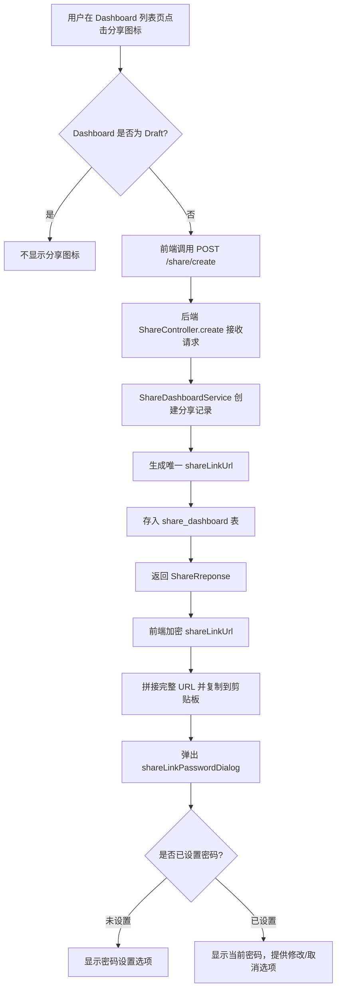
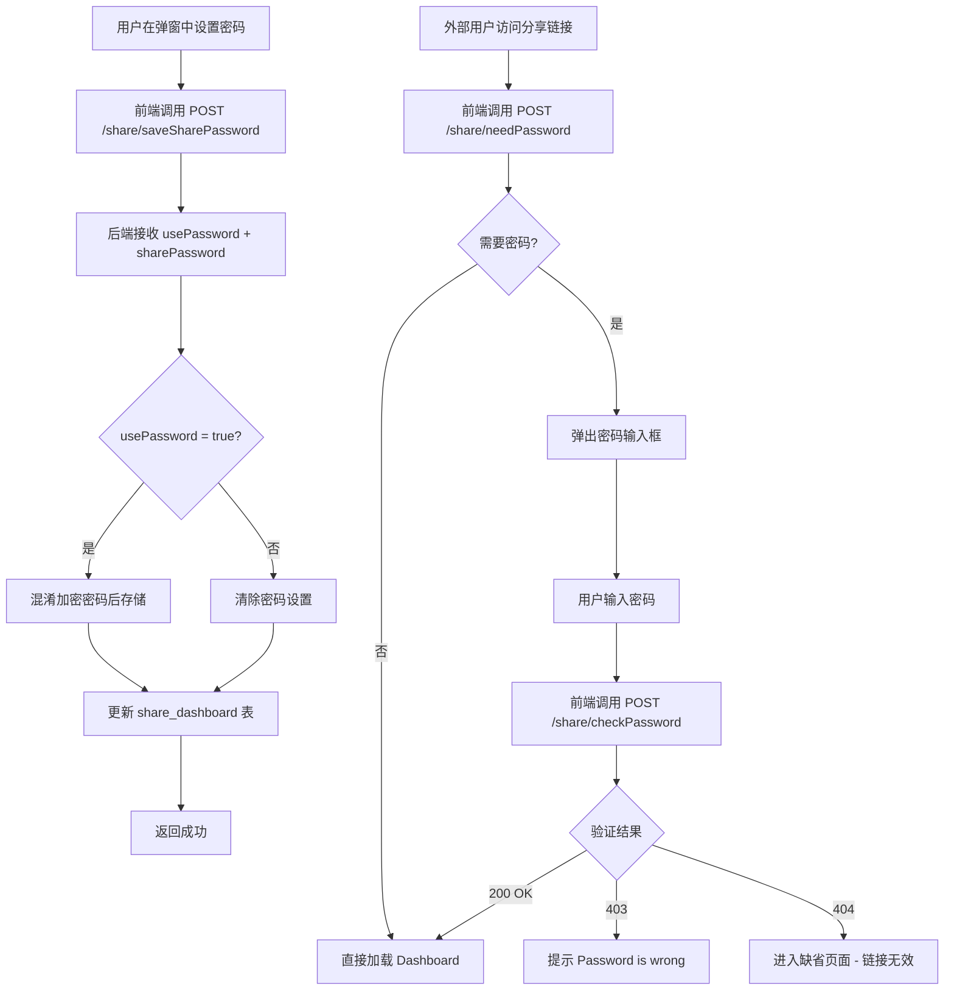
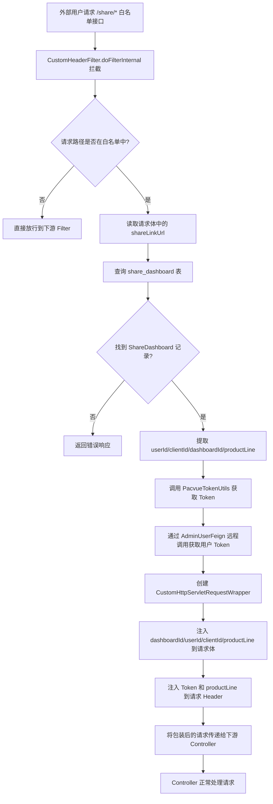
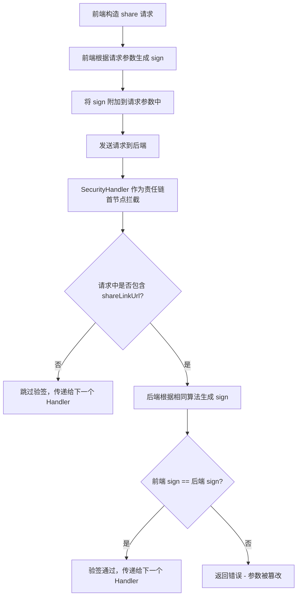
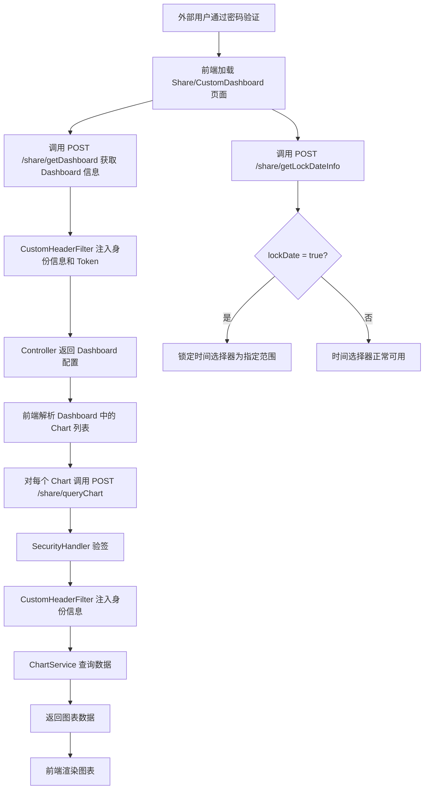

# ShareLink 分享功能 功能逻辑文档

> 本文档由 document-automation 工具自动生成，基于源代码、PRD 文档和技术评审文档。
> 生成时间: 2026-04-09 09:57:53
> 准确性评分: 未验证/100

---


# ShareLink 分享功能 功能逻辑文档

## 1. 模块概述

### 1.1 职责与定位

ShareLink 分享功能是 Pacvue Custom Dashboard 系统的核心子模块之一，负责将用户创建的 Dashboard 以外部链接的形式分享给第三方（如客户、合作伙伴），使其无需登录 Pacvue 平台即可查看 Dashboard 数据。

该模块提供以下核心能力：

1. **分享链接创建**：为指定 Dashboard 生成唯一的 shareLinkUrl，支持一键复制到剪贴板
2. **密码保护**：可选为分享链接设置访问密码，密码采用混淆 MD5 加密存储，防止简单反推
3. **时间范围锁定**：分享者可锁定分享链接的数据时间范围，防止被分享者自行调整时间查看非授权时段数据
4. **外部免登录访问**：通过 `CustomHeaderFilter` 拦截 share 白名单接口，自动注入原始用户的身份信息（userId、clientId、productLine）和 Token，使外部用户无需登录即可正常调用后端数据接口
5. **接口加签防篡改**：通过 `SecurityHandler` 对 share 请求参数进行签名验证，防止通过 Postman 等工具篡改请求参数

### 1.2 系统架构位置

```
┌─────────────────────────────────────────────────────────┐
│                    前端 (Vue)                            │
│  index.vue (列表页) → shareLinkPasswordDialog (密码弹窗) │
│  Share/CustomDashboard (分享页面路由)                     │
│  api/index.js (API 调用层)                               │
└──────────────────────┬──────────────────────────────────┘
                       │ HTTP
                       ▼
┌─────────────────────────────────────────────────────────┐
│              CustomHeaderFilter (OncePerRequestFilter)   │
│  拦截 /share/* 白名单接口 → 注入身份信息 + Token          │
└──────────────────────┬──────────────────────────────────┘
                       │
                       ▼
┌─────────────────────────────────────────────────────────┐
│              ShareController (/share/*)                   │
│  create / saveSharePassword / needPassword / checkPassword│
│  getDashboard / queryChart / briefTips / getLockDateInfo  │
└──────────────────────┬──────────────────────────────────┘
                       │
                       ▼
┌─────────────────────────────────────────────────────────┐
│         ShareDashboardService / ChartService              │
│         SecurityHandler (加签验签)                         │
└──────────────────────┬──────────────────────────────────┘
                       │
              ┌────────┼────────┐
              ▼        ▼        ▼
         share_dashboard   AdminUserFeign   各平台数据服务
         (MySQL)           (Token获取)      (Walmart/Amazon/DSP...)
```

### 1.3 涉及的后端模块与前端组件

**后端关键类（Java）：**

| 类名 | 包路径 | 职责 |
|---|---|---|
| `CustomHeaderFilter` | `com.pacvue.api.Filter` | OncePerRequestFilter 子类，拦截 share 白名单接口，注入身份信息和 Token |
| `CustomHttpServletRequestWrapper` | `com.pacvue.api.wrapper` | HttpServletRequest 装饰器，支持修改请求体和添加自定义 Header |
| `ShareController` | `com.pacvue.api.controller`（**待确认**） | 分享功能控制器，暴露 /share/* 端点 |
| `ShareDashboardService` | `com.pacvue.api.service` | 分享核心业务逻辑服务 |
| `ShareDashboard` | `com.pacvue.api.model` | 分享记录实体类 |
| `SecurityHandler` | **待确认** | 接口加签验签处理器，queryChart 责任链首节点 |
| `PacvueTokenUtils` | `com.pacvue.api.utils` | Token 工具类，为 share 请求生成内部认证 Token |
| `ChartService` | **待确认** | 图表服务，处理 briefTips、walmartUserGuidance 等 |
| `CustomDashboardApiConstants` | `com.pacvue.base.constatns` | 常量类（DASHBOARD_ID/PRODUCT_LINE/USER_ID/CLIENT_ID） |

**前端关键组件（Vue）：**

| 组件/文件 | 职责 |
|---|---|
| `index.vue` | Dashboard 列表页，包含 shareLink 方法（创建分享链接、复制到剪贴板、打开密码设置弹窗） |
| `shareLinkPasswordDialog` | 分享链接密码设置/查看弹窗组件（通过 ref 调用 init 方法） |
| `TopOverview.vue` | 顶部概览组件，支持 isShareLink 模式下的数据加载与加签逻辑 |
| `ChartsAll` | 图表通用组件，包含 GetTips 方法，根据 isShareLink 切换调用 sharelink_briefTips 或 briefTips |
| `Share/CustomDashboard` | 分享页面路由（/Share/CustomDashboard） |
| `api/index.js` | API 调用层，包含所有 share 相关接口函数 |
| `public.js` | 包含 shareHistoryColumns 和 shareHistoryfilterList |

### 1.4 部署方式

后端作为 Custom Dashboard 微服务的一部分部署，共享同一 Spring Boot 应用。`CustomHeaderFilter` 通过 `@Component` 注解自动注册到 Spring 容器中，作为 Servlet Filter 链的一部分。**Maven 坐标待确认**。

---

## 2. 用户视角

### 2.1 功能场景总览

基于 PRD 文档和代码实现，ShareLink 分享功能包含以下核心场景：

1. **创建分享链接**
2. **设置/修改/取消密码**
3. **锁定时间范围**
4. **外部用户访问分享链接**
5. **密码验证流程**
6. **分享页面数据查看**

### 2.2 场景一：创建分享链接

**前置条件：** Dashboard 处于非 Draft 状态（只有非 draft 情况下才会显示 sharelink 图标）。

**用户操作流程：**

1. 用户在 Dashboard 列表页（`index.vue`）悬浮到表格方块上，看到"分享"图标按钮
2. 点击分享图标，前端调用 `POST /share/create` 接口，传入 `dashboardId`
3. 后端创建分享记录，生成唯一的 `shareLinkUrl`，返回给前端
4. 前端将 `shareLinkUrl` 进行加密处理，拼接为完整的访问 URL（格式：`/Share/CustomDashboard?shareId={encrypted}&dashboardId={id}&isShareLink=true&dateFormat={format}`）
5. 前端自动将完整 URL 复制到用户剪贴板
6. 弹出密码设置弹窗（`shareLinkPasswordDialog`）：
   - 若**未设置密码**：弹窗提示可以设置密码，用户可选择设置密码或直接分享
   - 若**已设置密码**：弹窗显示已设置的密码，可查看/修改密码、取消密码设置，或直接分享

**UI 交互要点：**
- Figma 设计稿中显示弹窗标题为 "Copy Share Link"
- 弹窗为小号弹窗样式
- 分享图标仅在非 Draft 状态的 Dashboard 上显示
- Display 页面和编辑页面没有设置 share link 的功能

### 2.3 场景二：设置/修改/取消密码

**用户操作流程：**

1. 在密码设置弹窗中，用户可以：
   - **设置密码**：输入密码，点击保存，调用 `POST /share/saveSharePassword`，传入 `usePassword=true` 和 `sharePassword`
   - **修改密码**：修改已有密码，点击保存
   - **取消密码**：关闭密码开关，调用 `POST /share/saveSharePassword`，传入 `usePassword=false`
2. 保存成功后，可重新复制链接

**安全性设计（来自技术评审文档）：**
- 测试中发现可通过 ChatGPT 对 MD5 简单值反向快速推断原始密码
- 采取**混淆密码**的方式进行加密存储，兼顾设计实现与安全性
- 具体混淆方案：**待确认**（技术评审文档中提到了方案但未给出完整细节）

### 2.4 场景三：锁定时间范围

**背景（来自 PRD）：**
目前 Custom Dashboard 的 sharelink 是动态链接，当看板做出修改时，sharelink 打开的看板也会随之改变。作为代理机构的用户，他们希望分享给客户时，客户能看到的时间范围是锁定的，避免：
- 调整看板时间范围时影响客户查看 sharelink 的数据
- 分享给客户 2 月的数据，客户可以自己调整看到 1 月的数据

**用户操作流程：**

1. 在分享设置中，用户可以选择是否锁定时间范围（`lockDate` 字段）
2. 若选择锁定，需设置 `startDate`、`endDate`、`dateRangeType`（默认 "Custom"）、`fixedDateRange`
3. 调用 `POST /share/saveSharePassword` 保存锁定时间信息
4. 外部用户访问分享链接时，时间范围被锁定，无法自行调整

**范围：** 全平台支持

### 2.5 场景四：外部用户访问分享链接

**用户操作流程：**

1. 外部用户点击分享链接，进入 `/Share/CustomDashboard` 路由页面
2. 前端先调用 `POST /share/needPassword` 判断该链接是否需要密码
3. **若不需要密码**：直接加载 Dashboard 数据
4. **若需要密码**：
   - 弹出密码输入框，提示用户输入密码
   - 用户输入密码后，调用 `POST /share/checkPassword` 验证
   - **密码正确（200）**：正常打开 Dashboard
   - **密码错误（403）**：提示 "Password is wrong."
   - **链接无效（404）**：进入缺省页面（Dashboard 被删除的情况）
5. 验证通过后，前端携带 `shareLinkUrl` 调用各 share 白名单接口加载数据

**页面差异：**
- 访问 Share Link 时，去掉面包屑和 Edit Dashboard 按钮
- View 页面与 Share Link 页面交互完全一致（来自 PRD 基本原则）
- 展示逻辑以 Chart Setting 配置为准（所见即所得）

### 2.6 场景五：分享页面数据查看

分享页面支持的功能与正常 View 页面一致，包括：
- TopOverview 概览数据
- 各类图表（Trend、Bar、Pie、Table、Comparison、Stacked Bar 等）
- Brief Tips 提示信息
- 自定义指标列表
- Walmart 用户引导信息

前端通过 `isShareLink` 标志位区分普通模式和分享模式，在分享模式下：
- API 调用路径从 `/customDashboard/*` 切换为 `/share/*`
- 请求参数中附加 `shareLinkUrl`（通过 `commonJS.decrypt(route.query.shareId)` 解密获得）
- 加签逻辑通过 `SecurityHandler` 生成 `sign` 字段

### 2.7 Figma 设计稿补充

根据 Figma 设计稿信息：
- 分享方式分为两种：**直接分享**和**生成分享码**
- 直接分享需要选择 Client，可对分享的模板进行分组
- Client 可选择多个，选择后下方出现设置组的内容，Group 可不填（默认进入 All 分组）
- 点击 Share Log 进入分享记录页面，可编辑分享码有效期、复制分享码
- 分享记录页面展示所有已分享的模板，通过 filter 筛选直接分享和生成分享码的模板

> **注意**：Figma 设计稿中描述的"直接分享"和"生成分享码"两种模式，以及 Client 选择、分组功能，在当前代码片段中**未找到完整对应实现**，可能属于设计阶段方案或后续迭代内容。当前代码实现以"生成 shareLinkUrl 并复制"为主要分享方式。

---

## 3. 核心 API

### 3.1 ShareController 端点列表

#### 3.1.1 创建分享链接

- **路径**: `POST /share/create`
- **是否经 CustomHeaderFilter 处理**: 否（非白名单接口，需要用户已登录）
- **请求 Header**: `productLine`（retailer/commerce 区分来源）、`Authorization`
- **请求参数**: `CreateShareLinkRequest`

```json
{
  "dashboardId": "string — Dashboard ID"
}
```

- **返回值**: `ShareRreponse`

```json
{
  "shareLinkUrl": "string — 生成的分享链接标识",
  "usePassword": "boolean — 是否启用密码",
  "lockDate": "boolean — 是否锁定时间",
  "startDate": "date — 锁定开始时间",
  "endDate": "date — 锁定结束时间"
}
```

- **说明**: 为指定 Dashboard 创建分享记录，生成唯一 shareLinkUrl。productLine 从 Header 中获取，用于区分 retailer/commerce 来源。

#### 3.1.2 获取分享密码信息

- **路径**: `POST /share/getSharePassword`
- **是否经 CustomHeaderFilter 处理**: 否
- **请求参数**: `CreateShareLinkRequest`
- **返回值**: 包含密码信息的响应（**具体结构待确认**）
- **说明**: 获取已创建的 share link 的密码设置信息，用于在弹窗中展示当前密码状态

#### 3.1.3 保存分享密码

- **路径**: `POST /share/saveSharePassword`
- **是否经 CustomHeaderFilter 处理**: 否
- **请求参数**: `CreateShareLinkRequest`

```json
{
  "dashboardId": "string",
  "usePassword": "boolean — 是否启用密码",
  "sharePassword": "string — 密码明文（后端混淆加密存储）",
  "lockDate": "boolean — 是否锁定时间范围",
  "startDate": "date — 锁定开始日期（lockDate=true 时有效）",
  "endDate": "date — 锁定结束日期（lockDate=true 时有效）",
  "dateRangeType": "string — 日期范围类型，默认 'Custom'",
  "fixedDateRange": "string — 固定日期范围枚举值"
}
```

- **返回值**: `ShareRreponse`
- **说明**: 保存/更新分享链接的密码和时间锁定设置。以 `lockDate` 为主判断逻辑——如果 `lockDate=false`，即使有 `endDate` 也不认可。

#### 3.1.4 判断是否需要密码

- **路径**: `POST /share/needPassword`
- **是否经 CustomHeaderFilter 处理**: 是（属于 share 白名单接口）
- **请求参数**: `ShareRequest`

```json
{
  "shareLinkUrl": "string — 分享链接标识"
}
```

- **返回值**: `boolean` 或包含是否需要密码的响应
- **说明**: 外部用户访问分享链接时，前端首先调用此接口判断是否需要输入密码

#### 3.1.5 校验密码

- **路径**: `POST /share/checkPassword`
- **是否经 CustomHeaderFilter 处理**: 是
- **请求参数**:

```json
{
  "shareLinkUrl": "string — 分享链接标识",
  "password": "string — 用户输入的密码"
}
```

- **返回值**: 状态码区分结果
  - `200 (OK)` — 密码正确，正常访问
  - `403 (BAD403_REQUEST)` — 需要密码且密码错误，提示 "no permission"
  - `404 (URL_INVALID)` — shareLinkUrl 无效，提示 "No share dashboard found by shareLinkUrl"
- **说明**: 对应 `ResponseErrorCode` 枚举中的 `URL_INVALID(404)` 和 `BAD403_REQUEST(403)`

#### 3.1.6 获取锁定时间信息

- **路径**: `POST /share/getLockDateInfo`
- **是否经 CustomHeaderFilter 处理**: **待确认**
- **请求参数**:

```json
{
  "shareLinkUrl": "string"
}
```

- **返回值**:

```json
{
  "lockDate": "boolean",
  "startDate": "date",
  "endDate": "date",
  "dateRangeType": "string",
  "fixedDateRange": "string"
}
```

- **说明**: 获取分享链接的时间锁定配置，前端据此决定是否限制时间选择器

#### 3.1.7 获取分享 Dashboard 信息

- **路径**: `POST /share/getDashboard`
- **是否经 CustomHeaderFilter 处理**: 是
- **请求参数**: **待确认**（包含 `shareLinkUrl`）
- **返回值**: Dashboard 完整信息
- **说明**: 内部调用了普通的 `getDashboard` 方法（来自交接文档）

#### 3.1.8 获取分享页面 Brief Tips

- **路径**: `POST /share/briefTips`
- **是否经 CustomHeaderFilter 处理**: 是
- **请求参数**: `TipsQueryRequest`（附加 `shareLinkUrl`）

```json
{
  "type": "string — 图表类型",
  "setting": "string — 图表设置 JSON",
  "shareLinkUrl": "string",
  "config": "object — Commerce 特有配置（可选）"
}
```

- **返回值**: `List<ChartTipsPlus>` — 提示信息列表，每项包含 `format`、`placeholderValues`、`appendixes`
- **说明**: 内部调用了普通的 `briefTips`（`chartService.generateBriefTips`）

#### 3.1.9 获取自定义指标列表

- **路径**: `POST /share/customMetricList`
- **是否经 CustomHeaderFilter 处理**: 是
- **请求参数**: **待确认**
- **返回值**: 自定义指标列表
- **说明**: 分享页面获取可用的自定义指标

#### 3.1.10 Walmart 用户引导

- **路径**: `POST /share/walmartUserGuidance`
- **是否经 CustomHeaderFilter 处理**: 是
- **请求参数**: `ShareRequest`
- **返回值**: `Map<String, Object>` — Walmart 引导信息
- **说明**: 用于给前端查询是否为 Walmart 有 store 用户。内部通过 `walmartMainApiFeign.getWalmartGuidance()` 获取数据

```java
@Override
public Map<String, Object> walmartUserGuidance() {
    BaseResponse<Map<String, Object>> walmartGuidance = walmartMainApiFeign.getWalmartGuidance();
    if (Objects.isNull(walmartGuidance) || Objects.isNull(walmartGuidance.getData())) {
        return Maps.newHashMap();
    }
    return walmartGuidance.getData();
}
```

#### 3.1.11 获取 Profile 列表

- **路径**: `POST /share/data/getProfileList`
- **是否经 CustomHeaderFilter 处理**: 是
- **请求参数**: `ShareRequest`
- **返回值**: `List<ProfileResp>`
- **说明**: 内部调用了普通的 `getProfileList`，需要用户已登录（通过 `SecurityContextHelper.getUserInfo()` 获取，若为 null 返回 401）

#### 3.1.12 查询图表数据

- **路径**: `POST /share/queryChart`
- **是否经 CustomHeaderFilter 处理**: 是
- **请求参数**: 与普通 `queryChart` 相同，附加 `shareLinkUrl`
- **返回值**: 图表数据
- **说明**: 内部调用了普通的 `queryChart`，经过 `SecurityHandler` 加签验签

### 3.2 前端 API 调用函数

在 `api/index.js` 中定义的 share 相关函数：

```javascript
// 创建分享链接
export function createShareLink(data) {
  return request({
    url: `${VITE_APP_CustomDashbord}share/create`,
    method: "post",
    data: data
  })
}

// 设置分享链接密码
export function setShareLinkPassword(data) { /* POST share/saveSharePassword */ }

// 获取分享密码
export function getSharePassword(data) { /* POST share/getSharePassword */ }

// 判断是否需要密码
export function getNeedPassword(data) { /* POST share/needPassword */ }

// 获取分享自定义指标
export function getShareCustomMetrics(data) { /* POST share/customMetricList */ }

// 获取分享 Brief Tips
export function sharelink_briefTips(data) {
  return request({
    url: `${VITE_APP_CustomDashbord}share/briefTips`,
    method: "post",
    data: data
  })
}

// 获取分享链接用户引导步骤
export function getShareLinkUserGuidanceStep(data) {
  return request({
    url: `${VITE_APP_CustomDashbord}share/walmartUserGuidance`,
    method: "post",
    data: data
  })
}
```

---

## 4. 核心业务流程

### 4.1 分享链接创建流程



**详细步骤说明：**

1. **前端触发**：用户在 `index.vue` 的 Dashboard 列表中，悬浮到某个 Dashboard 卡片上，出现分享图标。点击图标触发 `shareLink` 方法。
2. **调用创建接口**：前端发送 `POST /share/create`，请求体包含 `dashboardId`，Header 中携带 `productLine` 和 `Authorization`。
3. **后端处理**：`ShareController` 接收请求，调用 `ShareDashboardService` 的创建逻辑。服务层生成唯一的 `shareLinkUrl`（具体生成算法**待确认**，可能为 UUID 或哈希值），并将分享记录写入 `share_dashboard` 表，关联 `dashboardId`、`userId`、`clientId`、`productLine` 等信息。
4. **前端处理响应**：前端收到 `shareLinkUrl` 后，使用 `commonJS.encrypt()` 对其加密，拼接为完整的访问 URL：`/Share/CustomDashboard?shareId={encrypted_shareLinkUrl}&dashboardId={id}&isShareLink=true&dateFormat={format}`。
5. **复制到剪贴板**：自动将完整 URL 复制到用户剪贴板。
6. **弹出密码弹窗**：通过 `ref` 调用 `shareLinkPasswordDialog` 组件的 `init` 方法，展示密码设置/查看弹窗。

### 4.2 密码设置与验证流程



**密码安全性详细说明（来自技术评审文档）：**

- **问题发现**：测试中发现可通过 ChatGPT 对 MD5 简单值反向快速推断原始密码
- **解决方案**：采取混淆密码的方式进行加密
- **原则**：兼顾设计实现与一定程度的安全
- **模型结构**：`dashboard_id + user_id : password = 1:1`，即每个用户对每个 Dashboard 的分享只有一个密码

### 4.3 CustomHeaderFilter 身份注入流程（核心流程）

这是 ShareLink 模块最关键的流程，实现了外部用户免登录访问的能力。



**详细步骤说明：**

1. **Filter 拦截**：`CustomHeaderFilter` 继承自 `OncePerRequestFilter`，通过 `@Component` 注解注册到 Spring 容器。它维护一个 share 白名单接口列表（如 `/share/getDashboard`、`/share/queryChart`、`/share/briefTips`、`/share/needPassword`、`/share/checkPassword` 等）。

2. **白名单判断**：在 `doFilterInternal` 方法中，首先判断当前请求路径是否在白名单中。非白名单接口（如 `/share/create`、`/share/getSharePassword`、`/share/saveSharePassword`）直接放行，这些接口需要用户已登录。

3. **读取请求体**：对于白名单接口，Filter 读取请求体中的 `shareLinkUrl` 字段。由于 `HttpServletRequest` 的输入流只能读取一次，这里使用 `BufferedReader` 读取后需要通过 `CustomHttpServletRequestWrapper` 重新包装。

4. **查询分享记录**：通过 `ShareDashboardService` 根据 `shareLinkUrl` 查询 `share_dashboard` 表，获取 `ShareDashboard` 实体。

5. **提取身份信息**：从 `ShareDashboard` 记录中提取原始分享者的 `userId`、`clientId`、`dashboardId`、`productLine`。

6. **获取 Token**：调用 `PacvueTokenUtils`（内部通过 `AdminUserFeign` 远程调用）为该用户生成内部认证 Token。这使得后续的 Controller 和 Service 层可以像处理正常登录用户的请求一样处理 share 请求。

7. **包装请求**：创建 `CustomHttpServletRequestWrapper` 实例：
   - **修改请求体**：将 `dashboardId`、`userId`、`clientId`、`productLine` 注入到请求体 JSON 中
   - **添加 Header**：将 Token 设置到 `Authorization` Header，将 `productLine` 设置到对应 Header

8. **传递给下游**：调用 `filterChain.doFilter(wrappedRequest, response)`，将包装后的请求传递给下游 Controller。Controller 无需感知请求来自 share 链接还是正常登录用户。

**关键类 — CustomHttpServletRequestWrapper：**

```
装饰器模式实现，继承 HttpServletRequestWrapper：
- 支持修改请求体（通过重写 getInputStream/getReader 方法）
- 支持添加自定义 Header（通过维护额外的 Header Map）
- 包路径：com.pacvue.api.wrapper
```

**关键常量 — CustomDashboardApiConstants：**

```
DASHBOARD_ID — "dashboardId"
PRODUCT_LINE — "productLine"  
USER_ID — "userId"
CLIENT_ID — "clientId"
```

### 4.4 接口加签防篡改流程



**详细说明（来自技术评审文档）：**

- **目的**：防止 shareLink 后用户使用 Postman 篡改请求参数
- **实现位置**：拓展 `queryChart` 主方法的责任链，增加首链条 `SecurityHandler`
- **触发条件**：入参中存在 `shareLinkUrl` 字段时触发加签验签
- **签名算法**：
  1. 将请求参数扁平化为 `TreeMap`（保证参数顺序一致）
  2. 新增 `startDate.` 和 `endDate.` 也加入到生成 sign 的扁平参数中（防止篡改时间参数）
  3. 将所有参数拼接为 `key=value&key=value...` 格式
  4. 末尾追加 `&secret={KEY}`
  5. 对拼接字符串进行签名（具体签名算法**待确认**，可能为 MD5 或 SHA）

**签名生成伪代码（来自技术评审文档）：**

```java
TreeMap<String, String> flatMap = new TreeMap<>();
// 以前的逻辑...
// 新增 startDate 和 endDate
flatMap.put("startDate.", request.getStartDate() != null ? request.getStartDate().toString() : "");
flatMap.put("endDate.", request.getEndDate() != null ? request.getEndDate().toString() : "");

String paramString = flatMap.entrySet().stream()
    .map(e -> e.getKey() + "=" + (e.getValue() != null ? e.getValue() : ""))
    .collect(Collectors.joining("&"));
paramString += "&secret=" + KEY;
// 生成 sign...
```

### 4.5 分享页面数据加载流程



**前端 isShareLink 模式下的 Brief Tips 加载逻辑（来自 ChartsAll.GetTips）：**

```javascript
const GetTips = () => {
  let briefTipData = { type: data.type, setting: data.setting }
  // Commerce 特殊处理
  if (productline == "commerce") {
    briefTipData.config = commerceConfig
  }
  // 根据 isShareLink 切换 API
  let parmes = isShareLink 
    ? sharelink_briefTips(Object.assign(briefTipData, { 
        shareLinkUrl: commonJS.decrypt(route.query.shareId) 
      })) 
    : briefTips(briefTipData)
  
  parmes.then((res) => {
    // 处理 tips 数据：format + placeholderValues + appendixes
    let list = []
    if (res && res.length > 0) {
      res.forEach((item) => {
        const result = fillPlaceholders(item.format, item.placeholderValues)
        list.push(result)
        if (item?.appendixes?.length > 0) {
          item.appendixes.forEach((i) => {
            list.push(fillPlaceholders(i, null))
          })
        }
      })
    }
    tipValue.value = list
    lineTipValue.value = cloneList.length > 3 ? cloneList.splice(0, 3) : []
  })
}
```

### 4.6 设计模式总结

| 设计模式 | 应用位置 | 说明 |
|---|---|---|
| **Filter 模式** | `CustomHeaderFilter` | 作为 `OncePerRequestFilter` 拦截 share 相关请求，在请求到达 Controller 之前进行身份注入 |
| **装饰器模式** | `CustomHttpServletRequestWrapper` | 包装原始 `HttpServletRequest`，在不修改原始对象的前提下扩展其功能（修改请求体、添加 Header） |
| **责任链模式** | `SecurityHandler` | 作为 `queryChart` 责任链的首节点，进行加签验签。验签通过后传递给下一个 Handler 继续处理 |
| **Feign 远程调用** | `AdminUserFeign` | 通过 Feign 客户端远程调用用户服务获取用户信息和 Token |

---

## 5. 数据模型

### 5.1 数据库表：share_dashboard

| 字段名 | 类型 | 说明 |
|---|---|---|
| `id` | BIGINT (PK) | 主键（**待确认**自增或 UUID） |
| `dashboard_id` | VARCHAR | 关联的 Dashboard ID |
| `user_id` | VARCHAR | 分享者的用户 ID |
| `client_id` | VARCHAR | 分享者的客户 ID |
| `product_line` | VARCHAR | 产品线（walmart/amazon/dsp/commerce 等） |
| `share_link_url` | VARCHAR | 唯一的分享链接标识 |
| `use_password` | BOOLEAN | 是否启用密码保护 |
| `share_password` | VARCHAR | 混淆加密后的密码 |
| `lock_date` | BOOLEAN | 是否锁定时间范围 |
| `start_date` | DATE/DATETIME | 锁定的开始日期 |
| `end_date` | DATE/DATETIME | 锁定的结束日期 |
| `date_range_type` | VARCHAR | 日期范围类型，默认 "Custom"（预留支持 "last_7_days" 等） |
| `fixed_date_range` | VARCHAR | 固定日期范围，来源于枚举 `FixedDateRange` |
| `created_at` | DATETIME | 创建时间（**待确认**） |
| `updated_at` | DATETIME | 更新时间（**待确认**） |

**模型关系：** `dashboard_id + user_id : password = 1:1`，即每个用户对每个 Dashboard 的分享记录唯一。

**设计说明（来自技术评审文档）：**
- `date_range_type` 默认要传 "Custom"，防止后续支持例如 "last_7_days" 等动态范围
- 上述时间相关字段复用 Dashboard 的 setting 结构
- `fixed_date_range` 来源于枚举 `FixedDateRange`

### 5.2 核心 DTO/VO

#### CreateShareLinkRequest

```
CreateShareLinkRequest {
  dashboardId: String       — Dashboard ID
  usePassword: Boolean      — 是否启用密码
  sharePassword: String     — 密码明文
  lockDate: Boolean         — 是否锁定时间
  startDate: Date           — 开始日期
  endDate: Date             — 结束日期
  dateRangeType: String     — 日期范围类型
  fixedDateRange: String    — 固定日期范围
}
```

#### ShareRequest

```
ShareRequest {
  shareLinkUrl: String      — 分享链接标识
}
```

#### ShareRreponse

```
ShareRreponse {
  shareLinkUrl: String      — 分享链接标识
  usePassword: Boolean      — 是否启用密码
  lockDate: Boolean         — 是否锁定时间
  startDate: Date           — 开始日期
  endDate: Date             — 结束日期
}
```

#### ShareDashboard（实体类）

```
ShareDashboard {
  dashboardId: String
  userId: String
  clientId: String
  productLine: String
  shareLinkUrl: String
  usePassword: Boolean
  sharePassword: String     — 混淆加密后的密码
  lockDate: Boolean
  startDate: Date
  endDate: Date
  dateRangeType: String
  fixedDateRange: String
}
```

### 5.3 核心枚举

#### ResponseErrorCode

```java
enum ResponseErrorCode {
  OK(200, "Normal"),
  BAD403_REQUEST(403, "no permission"),
  URL_INVALID(404, "No share dashboard found by shareLinkUrl")
}
```

---

## 6. 平台差异

### 6.1 Walmart 平台特殊处理

1. **Walmart 用户引导**：提供 `POST /share/walmartUserGuidance` 接口，通过 `walmartMainApiFeign.getWalmartGuidance()` 获取 Walmart 特有的引导信息，用于判断是否为 Walmart 有 store 用户。

2. **Walmart 指标支持**：根据代码中的枚举定义，Walmart 平台支持大量特有指标，包括但不限于：
   - 基础指标：`WALMART_IMPRESSIONS`、`WALMART_CLICKS`、`WALMART_CTR`、`WALMART_SPEND`、`WALMART_CPC`、`WALMART_CPA`、`WALMART_CVR`、`WALMART_ACOS`、`WALMART_ROAS`
   - Online 指标：`ONLINE_CPA`、`ONLINE_CVR`、`ONLINE_ACOS`、`ONLINE_ROAS`、`ONLINE_SALES`、`ONLINE_ORDERS`、`ONLINE_SALE_UNITS`
   - Store 指标：`STORE_SALES`、`STORE_ORDERS`、`STORE_SALE_UNITS`、`STORE_AD_SKU_SALES`
   - NTB 指标：`WALMART_NTB_ORDERS`、`WALMART_NTB_ORDERS_PERCENT`、`WALMART_NTB_ORDERS_RATE`、`WALMART_NTB_UNITS`
   - 物料信息：`WALMART_PROFILE`、`WALMART_CAMPAIGN`、`WALMART_ITEM`、`WALMART_ADGROUP`、`WALMART_KEYWORD`、`WALMART_TAG_NAME`、`WALMART_SEARCH_TERM`

3. **日期格式转换**：`displayOptimization` 方法对 Walmart 报告数据进行日期格式优化，包括：
   - `date` 字段：从 `MM_DD_YYYY` 转换为指定的 `dateFormat`
   - `weekOfYear`：转换为周显示格式
   - `monthOfYear`：转换为 `MMM_YYYY` 格式
   - `quarterOfYear`：Walmart 不会返回 `quarterOfYear`，需要根据 `monthOfYear` 自行拼接
   - `CampaignType` → `AdType` 映射

4. **前端 Walmart 指标定义**（来自 `walmart.js`）：
   - 每个指标定义包含 `label`、`value`（枚举值）、`formType`（Number/Percent/Money）、`compareType`（ascGray/ascGreen/ascRed）、`decimalPlaces`、`supportChart`（支持的图表类型）、`groupLevel`、`SocpeSettingObj`
   - 例如 `CPA` 指标标记了 `isStore: "true"`，表示仅 store 用户可见

### 6.2 Commerce 平台特殊处理

1. **Brief Tips 请求**：Commerce 平台在请求 briefTips 时需要附加 `config` 字段，包含 `commerceConfig`（program、dimension 等）
2. **Show Filter 功能**（来自 PRD）：Commerce 平台支持 Show Filter / No Limitation 配置项，控制 View/Share 页面的筛选器展示
3. **物料范围限制**：Commerce 平台支持 ASIN 物料和 productTag 物料

### 6.3 DSP 平台

DSP 平台有大量特有指标（如 `ViewabilityRate`、`SeCPM`、`BrandSearch`、`VideoComplete` 等），在 share 页面中同样通过 `CustomHeaderFilter` 注入身份信息后正常查询。

### 6.4 Cross Retailer

- SharePTag（Share Parent Tag）支持跨平台物料，支持的 chart 类型包括：overview、trend、bar、pie、table
- SharePTag 的映射关系：`sharePTagId + "_" + platform → Pair<campaignTagId, campaignTagName>`
- 在 share 页面中，cross retailer 分类的 chart 不支持 Show Filter 功能

---

## 7. 配置与依赖

### 7.1 Feign 下游服务依赖

| Feign 客户端 | 用途 | 调用场景 |
|---|---|---|
| `AdminUserFeign` | 获取用户信息及生成 Token | `CustomHeaderFilter` 中通过 `PacvueTokenUtils.callApiForToken` 调用，为 share 请求生成内部认证 Token |
| `walmartMainApiFeign` | 获取 Walmart 引导信息 | `walmartUserGuidance` 接口中调用 `getWalmartGuidance()` |

### 7.2 关键配置项

| 配置项 | 说明 |
|---|---|
| `VITE_APP_CustomDashbord` | 前端 API 基础路径，用于拼接所有 share 接口 URL |
| `KEY`（SecurityHandler 中） | 加签密钥，用于生成和验证 sign 字段 |
| share 白名单接口列表 | `CustomHeaderFilter` 中维护的需要拦截处理的接口路径集合（`Set<String>`） |

### 7.3 前端路由配置

分享页面路由：`/Share/CustomDashboard`

Query 参数：
- `shareId` — 加密后的 shareLinkUrl
- `dashboardId` — Dashboard ID
- `isShareLink` — 标志位，值为 "true"
- `dateFormat` — 日期格式

### 7.4 缓存策略

**待确认** — 当前代码片段中未发现明确的 Redis 缓存配置。`CustomHeaderFilter` 每次请求都会查询 `share_dashboard` 表和调用 `AdminUserFeign` 获取 Token，可能存在性能优化空间。

### 7.5 消息队列

**不适用** — 当前 ShareLink 模块未使用消息队列。

---

## 8. 版本演进

### 8.1 版本时间线

| 版本 | 时间 | 主要变更 | 来源 |
|---|---|---|---|
| **Custom Dashboard V1.1** | 早期 | 首次支持创建 Share Link、访问 Share Link、缺省提示（Dashboard 被删除时） | Custom Dashboard V1.1 PRD / 技术评审 |
| **Custom Dashboard V2.13** | 2024 年中（**待确认**） | 新增 SharePTag（跨平台 Parent Tag）支持，涉及 share 页面的 overview/trend/bar/pie/table | V2.13 技术评审 |
| **Custom Dashboard V2.14** | 2024 年下半年（**待确认**） | 新增 shareLink 接口加签功能（SecurityHandler），防止 share link 请求参数被篡改 | V2.14 技术评审 |
| **Custom Dashboard 25Q4-S6** | 2025 Q4 | 为 share link 增加密码设置功能（usePassword/sharePassword），支持 HQ 和 Commerce | 25Q4-S6 PRD / 技术评审 |
| **Custom Dashboard 26Q1-S5** | 2026 Q1 | Sharelink 可选择锁定分享数据的时间范围（lockDate/startDate/endDate），全平台支持；SecurityHandler 验签新增 startDate/endDate 参数 | 26Q1-S5 PRD / 技术评审 |
| **Custom Dashboard 26Q1-S6** | 2026 Q1 | Commerce 平台 Show Filter 功能，View/Share 页面支持筛选器展示和物料范围限制 | 26Q1-S6 PRD |

### 8.2 关键设计决策演进

1. **V1.1 → V2.14**：最初的 share link 没有任何安全防护，用户可以通过 Postman 篡改请求参数查看非授权数据。V2.14 引入 SecurityHandler 加签机制解决此问题。

2. **V2.14 → 25Q4-S6**：加签只能防止参数篡改，但无法防止链接被未授权人员访问。25Q4-S6 引入密码保护机制，并在密码存储上采用混淆 MD5 方案（因发现简单 MD5 可被 AI 反推）。

3. **25Q4-S6 → 26Q1-S5**：密码保护解决了"谁能看"的问题，但代理机构用户还需要控制"能看什么时间段的数据"。26Q1-S5 引入时间范围锁定功能，并将 startDate/endDate 也纳入加签范围。

4. **26Q1-S6**：进一步增强 share 页面的交互能力，Commerce 平台支持在 View/Share 页面展示筛选器，但有明确的限制条件（不支持 FilterLinked Campaign、Cross retailer 等）。

### 8.3 待优化项与技术债务

1. **CustomHeaderFilter 性能**：每次 share 请求都需要查询数据库和远程调用获取 Token，高并发场景下可能成为瓶颈。建议引入 Redis 缓存 ShareDashboard 记录和 Token。
2. **密码安全性**：当前采用混淆 MD5 方案，安全性有限。后续可考虑升级为 bcrypt 或 argon2。
3. **date_range_type 扩展**：当前默认传 "Custom"，预留了支持 "last_7_days" 等动态范围的能力，但尚未实现。
4. **Figma 设计稿中的"直接分享"和"分享码"双模式**：设计稿中描述了两种分享方式，但当前代码实现仅支持生成 shareLinkUrl 一种方式，"直接分享到 Client"的功能**待确认**是否已实现或计划实现。
5. **Share Log 功能**：Figma 设计稿中提到了分享记录页面（Share Log），前端 `public.js` 中也定义了 `shareHistoryColumns` 和 `shareHistoryfilterList`，但完整实现细节**待确认**。

---

## 9. 已知问题与边界情况

### 9.1 异常处理

1. **shareLinkUrl 无效**：当 `CustomHeaderFilter` 根据 `shareLinkUrl` 查询 `share_dashboard` 表未找到记录时，返回 404 错误（`ResponseErrorCode.URL_INVALID`）。这可能发生在：
   - Dashboard 被删除后，share link 仍被访问
   - shareLinkUrl 被手动篡改

2. **Token 获取失败**：`CustomHeaderFilter` 通过 `AdminUserFeign` 获取 Token 时，如果远程服务不可用，请求将失败。**降级策略待确认**。

3. **密码校验**：`checkPassword` 接口通过 HTTP 状态码区分结果（200/403/404），前端需要根据不同状态码展示不同的 UI 反馈。

4. **用户未登录**：`getProfileList` 接口中有明确的登录检查：
   ```java
   UserInfo userInfo = SecurityContextHelper.getUserInfo();
   if (userInfo == null) {
       return BaseResponse.fail(401, "not logged in");
   }
   ```
   但由于 `CustomHeaderFilter` 已注入 Token，正常情况下不应出现此问题。如果 Token 过期或无效，可能触发此错误。

### 9.2 并发与一致性

1. **分享记录唯一性**：`dashboard_id + user_id` 构成 1:1 关系，如果同一用户对同一 Dashboard 多次调用 `/share/create`，应返回已有的 shareLinkUrl 而非创建新记录（**具体行为待确认**）。

2. **密码修改与并发访问**：如果分享者正在修改密码，而外部用户同时在验证密码，可能出现短暂的不一致。由于密码修改频率极低，此问题影响可忽略。

3. **Dashboard 删除后的 share link**：Dashboard 被删除后，share_dashboard 记录是否级联删除**待确认**。如果不级联删除，`CustomHeaderFilter` 查询到 ShareDashboard 记录但 Dashboard 已不存在，后续 `getDashboard` 调用将返回空或错误。

### 9.3 安全边界

1. **加签密钥泄露**：如果 `SecurityHandler` 中的 `KEY` 泄露，攻击者可以自行生成合法的 sign，绕过防篡改机制。密钥应通过安全配置管理（如 Apollo 加密配置）存储。

2. **shareLinkUrl 可预测性**：如果 shareLinkUrl 的生成算法可预测（如简单自增 ID），攻击者可能遍历访问其他用户的 share link。应确保使用足够随机的生成算法（如 UUID v4）。

3. **前端加密的 shareId**：前端通过 `commonJS.encrypt()` 加密 shareLinkUrl 后放入 URL query 参数，通过 `commonJS.decrypt()` 解密。这层加密的强度和密钥管理**待确认**。

### 9.4 Show Filter 在 Share 页面的限制

根据 PRD（26Q1-S6），以下情况在 Share 页面不支持展示 Filter：
- FilterLinked Campaign 作为物料选择
- Top XX in 选择 filterlinked 的类型
- Cross retailer 分类的 chart
- Custom metric 指标状态产生变更，导致一个可用的指标都没有了
- White Board 类型的 chart

### 9.5 代码中的 TODO/FIXME

当前提供的代码片段中未发现明确的 TODO 或 FIXME 注释。但以下区域可能存在待完善的逻辑：
- `CustomHeaderFilter` 中的错误处理和日志记录
- `SecurityHandler` 中签名算法的完整实现
- share_dashboard 表的索引优化（`share_link_url` 字段应有唯一索引）

---

*文档生成时间：基于提供的代码片段和文档数据源*
*标注"待确认"的内容需要进一步查阅完整代码或与开发团队确认*

---

*本文档由 AI 自动生成，如有不准确之处请以源代码为准。标注"待确认"的内容需要人工核实。*