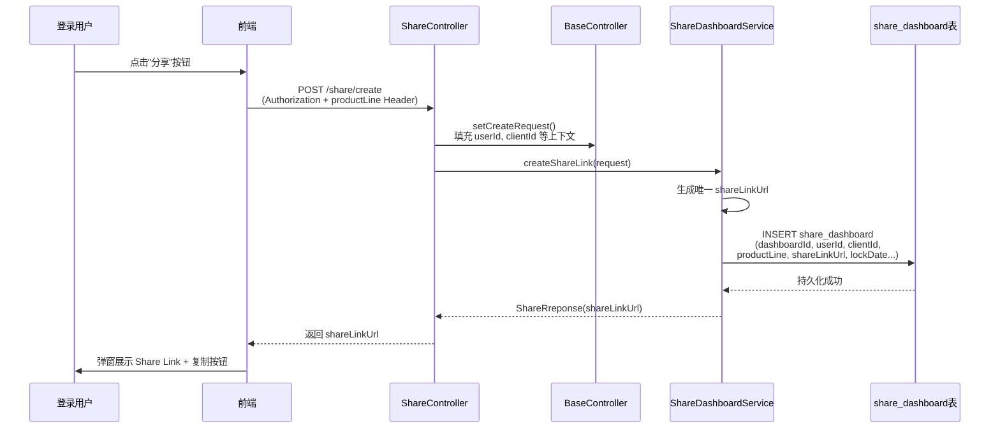
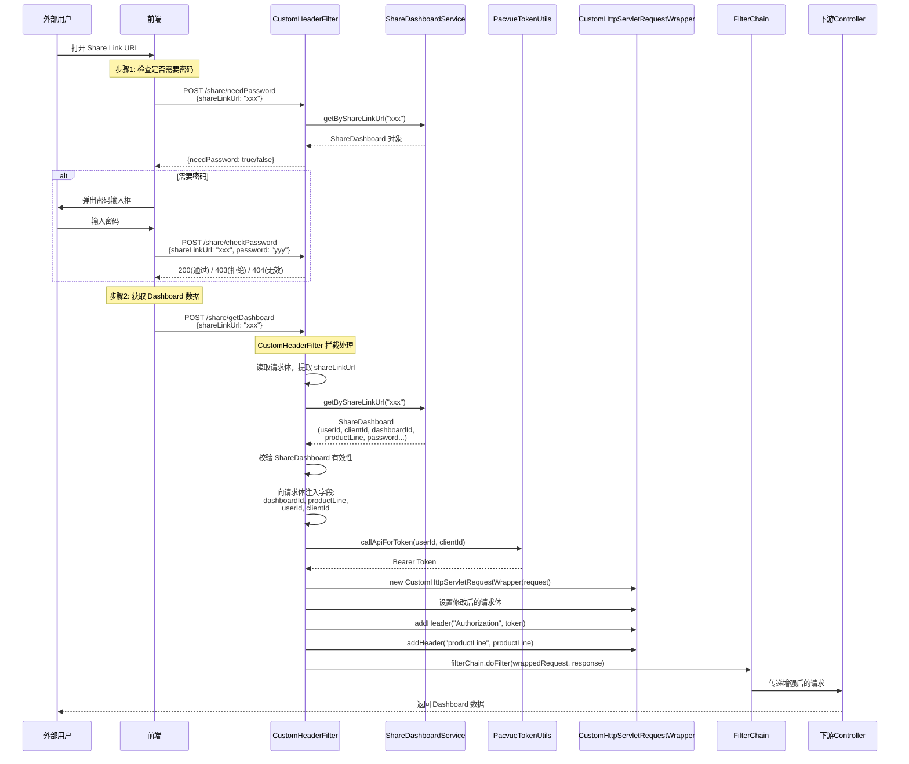
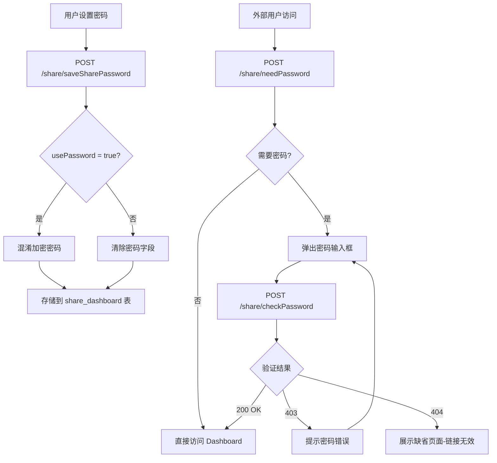
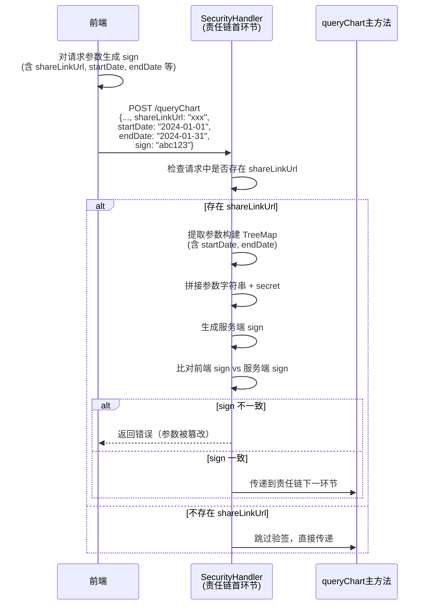
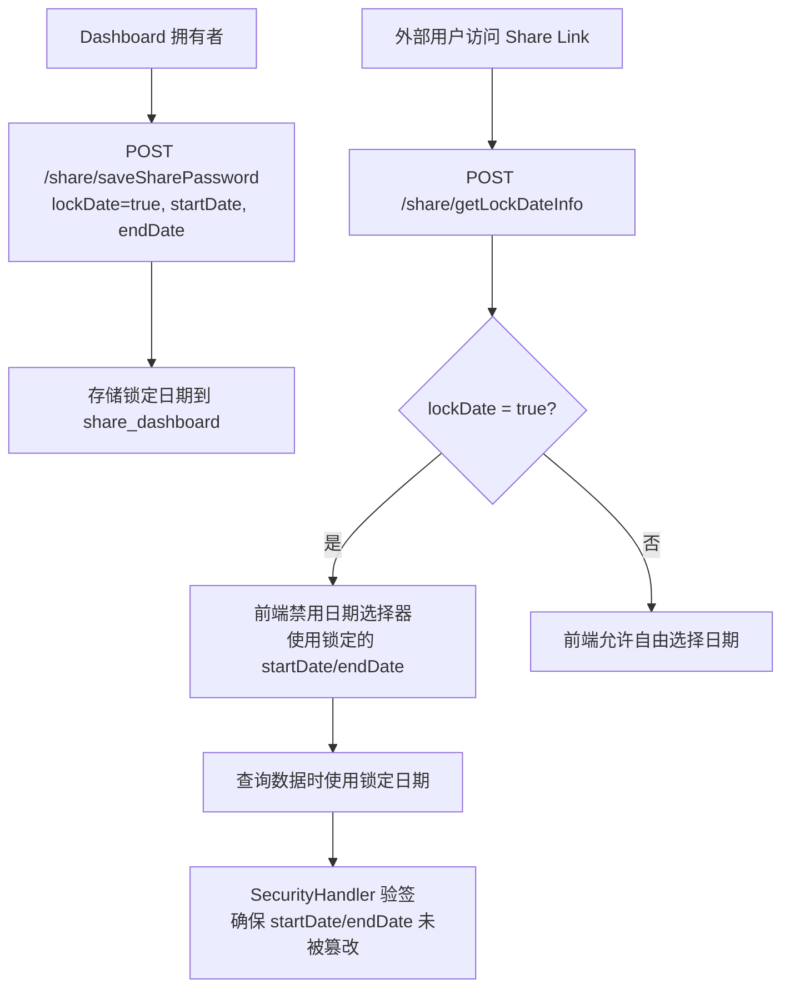

# ShareLink 分享功能 功能逻辑文档

> 本文档由 document-automation 工具自动生成，基于源代码、PRD 文档和技术评审文档。
> 生成时间: 2026-04-07 16:03:48
> 准确性评分: 42/100

---


# ShareLink 分享功能 功能逻辑文档

## 1. 模块概述

### 1.1 职责与定位

ShareLink 分享功能是 Pacvue Custom Dashboard 平台的核心能力之一，允许用户将已创建的 Dashboard 通过生成唯一链接的方式分享给外部用户（无需登录 Pacvue 系统）。该模块解决了以下核心问题：

- **外部分享**：外部用户无需 Pacvue 账号即可查看 Dashboard 数据
- **安全控制**：支持密码保护、接口加签防篡改、日期范围锁定等多层安全机制
- **身份代理**：通过 `CustomHeaderFilter` 在请求链路中自动注入原始创建者的身份信息和 Token，使下游接口无感知地以创建者身份执行数据查询

### 1.2 系统架构位置

```
┌─────────────────────────────────────────────────────────────────┐
│                        前端 (Browser)                            │
│  ┌──────────────┐  ┌──────────────────┐  ┌───────────────────┐  │
│  │ Dashboard页面 │  │ ShareLink创建弹窗 │  │ 外部访问页面(免登录)│  │
│  └──────┬───────┘  └────────┬─────────┘  └─────────┬─────────┘  │
└─────────┼──────────────────┼───────────────────────┼────────────┘
          │                  │                       │
          ▼                  ▼                       ▼
┌─────────────────────────────────────────────────────────────────┐
│                   Spring Boot Application                        │
│                                                                  │
│  ┌─────────────────────────────────────────────────────────┐    │
│  │              CustomHeaderFilter (OncePerRequestFilter)    │    │
│  │  拦截 share 白名单接口 → 注入身份信息 + Token → 包装请求   │    │
│  └──────────────────────────┬────────────────────────────────┘    │
│                             ▼                                    │
│  ┌──────────────────┐  ┌──────────────────┐                     │
│  │  ShareController  │  │  ChartController  │  (下游 Controller) │
│  └────────┬─────────┘  └────────┬─────────┘                     │
│           ▼                     ▼                                │
│  ┌──────────────────┐  ┌──────────────────┐                     │
│  │ShareDashboardSvc │  │SecurityHandler   │ (责任链首环节-验签)  │
│  └────────┬─────────┘  └──────────────────┘                     │
│           ▼                                                      │
│  ┌──────────────────┐                                           │
│  │  share_dashboard  │  (MySQL)                                  │
│  └──────────────────┘                                           │
└─────────────────────────────────────────────────────────────────┘
```

### 1.3 涉及的后端模块

| 模块 | 说明 |
|------|------|
| `custom-dashboard-api` | 主服务模块，包含 ShareController、CustomHeaderFilter 等核心组件 |

### 1.4 涉及的核心包

| 包路径 | 说明 |
|--------|------|
| `com.pacvue.api.controller.ShareController` | 分享功能控制器 |
| `com.pacvue.api.Filter.CustomHeaderFilter` | 请求拦截过滤器 |
| `com.pacvue.api.wrapper.CustomHttpServletRequestWrapper` | 请求包装器 |
| `com.pacvue.api.model.ShareDashboard` | 分享链接数据模型 |
| `com.pacvue.api.service.ShareDashboardService` | 分享业务服务 |
| `com.pacvue.api.utils.PacvueTokenUtils` | Token 工具类 |

### 1.5 部署方式

ShareLink 功能作为 `custom-dashboard-api` 服务的一部分部署，无独立部署单元。`CustomHeaderFilter` 通过 `@Component` 注解自动注册到 Spring 容器中，作为 Servlet Filter 链的一部分运行。

---

## 2. 用户视角

### 2.1 功能场景

基于 PRD 文档，ShareLink 功能覆盖以下场景：

#### 场景一：创建 Share Link

**用户故事**：作为 Dashboard 拥有者，我希望将 Dashboard 分享给外部同事或客户查看，而不需要他们注册 Pacvue 账号。

**操作流程**：
1. 用户在 Dashboard 列表页，悬浮到表格方块上，展示"分享"按钮
2. 点击"分享"按钮，弹窗展示生成的 Share Link URL
3. 提供"一键复制"按钮，用户可快速复制链接
4. （可选）用户可设置密码保护
5. （可选）用户可锁定分享数据的日期范围

#### 场景二：访问 Share Link

**用户故事**：作为外部用户，我收到一个 Share Link，希望直接打开查看 Dashboard 数据。

**操作流程**：
1. 外部用户在浏览器中打开 Share Link
2. 系统判断是否需要密码：
   - 若需要密码：弹出密码输入框，用户输入密码后验证
   - 若不需要密码：直接展示 Dashboard
3. 访问 Share Link 时，页面去掉面包屑和"Edit Dashboard"按钮（只读模式）
4. 如果日期范围被锁定，用户无法修改查询的时间范围

#### 场景三：Dashboard 已删除

**用户故事**：当分享的 Dashboard 被删除后，访问链接应给出友好提示。

**操作流程**：
1. 外部用户打开 Share Link
2. 系统检测到对应 Dashboard 已不存在
3. 展示缺省页面（404 状态）

### 2.2 UI 交互要点

| 交互点 | 说明 |
|--------|------|
| 分享按钮位置 | Dashboard 列表页，悬浮到表格方块时展示 |
| 分享弹窗 | 展示 Share Link URL + 一键复制按钮 |
| 密码设置 | 可选开启，支持设置/修改密码 |
| 日期锁定 | 可选开启，锁定后外部用户无法修改日期范围 |
| 外部访问页面 | 去掉面包屑、Edit Dashboard 按钮，纯只读模式 |
| 密码输入弹窗 | 外部用户访问需密码的链接时弹出 |
| 缺省页面 | Dashboard 被删除时展示 |

---

## 3. 核心 API

### 3.1 REST 端点总览

| 方法 | 路径 | 是否走 CustomHeaderFilter 白名单 | 是否需要登录 | 说明 |
|------|------|----------------------------------|-------------|------|
| POST | `/share/create` | ❌ | ✅ | 创建 share link |
| POST | `/share/getSharePassword` | ❌ | ✅ | 获取分享密码信息 |
| POST | `/share/saveSharePassword` | ❌ | ✅ | 保存分享密码及日期锁定配置 |
| POST | `/share/needPassword` | 待确认 | ❌ | 判断是否需要密码 |
| POST | `/share/checkPassword` | 待确认 | ❌ | 校验密码 |
| POST | `/share/getDashboard` | ✅ | ❌（Filter 注入身份） | 获取 Dashboard 数据 |
| POST | `/share/getLockDateInfo` | 待确认 | ❌ | 获取锁定日期信息 |
| POST | `/share/data/getProfileList` | ✅（待确认） | ❌（Filter 注入身份） | 获取 Profile 列表 |

### 3.2 接口详细定义

#### 3.2.1 POST `/share/create`

**功能**：创建 Share Link

**请求 Header**：
- `Authorization`: Bearer Token（必须）
- `productLine`: 平台标识，如 Amazon、Walmart、Commerce 等（必须）

**请求体** `CreateShareLinkRequest`：
```json
{
  "dashboardId": "string — Dashboard ID（必填）",
  "lockDate": "boolean — 是否锁定日期范围",
  "startDate": "date — 锁定的开始日期",
  "endDate": "date — 锁定的结束日期",
  "productLine": "string — 平台标识"
}
```

**响应体** `ShareRreponse`：
```json
{
  "code": 200,
  "data": {
    "shareLinkUrl": "string — 生成的分享链接 URL"
  }
}
```

**业务逻辑**：
1. 通过 `BaseController.setCreateRequest` 填充用户上下文（userId、clientId 等）
2. 调用 `ShareDashboardService.createShareLink` 生成唯一的 `shareLinkUrl`
3. 持久化到 `share_dashboard` 表
4. 返回生成的 `shareLinkUrl`

**说明**：`productLine` 字段来源于 Header 中的 retailer/commerce 区分，属于常规字段。

---

#### 3.2.2 POST `/share/getSharePassword`

**功能**：获取已设置的分享密码信息

**请求 Header**：`Authorization`、`productLine`

**请求体** `CreateShareLinkRequest`：
```json
{
  "dashboardId": "string",
  "shareLinkUrl": "string（待确认）"
}
```

**响应体**：待确认，预期包含 `usePassword`（是否启用密码）、密码相关信息

**说明**：此接口为内部管理接口，需要登录态。

---

#### 3.2.3 POST `/share/saveSharePassword`

**功能**：保存/更新 Share Link 的密码设置和日期锁定配置

**请求 Header**：`Authorization`、`productLine`

**请求体** `CreateShareLinkRequest`：
```json
{
  "dashboardId": "string",
  "usePassword": "boolean — 是否启用密码保护",
  "sharePassword": "string — 分享密码",
  "lockDate": "boolean — 是否锁定日期",
  "startDate": "date — 锁定开始日期",
  "endDate": "date — 锁定结束日期",
  "fixedDateRange": "string — 固定日期范围枚举值，来源于 FixedDateRange 枚举",
  "dateRangeType": "string — 日期范围类型，默认传 'Custom'，预留支持 'last_7_days' 等"
}
```

**响应体**：
```json
{
  "code": 200,
  "data": {
    "shareLinkUrl": "string"
  }
}
```

**业务逻辑**：
- 以 `lockDate` 字段为主控开关：如果 `lockDate = false`，即使传了 `endDate` 也不认可
- 密码存储采用混淆加密方式（见安全性章节）

---

#### 3.2.4 POST `/share/needPassword`

**功能**：判断指定 Share Link 是否需要密码

**请求体** `ShareRequest`：
```json
{
  "shareLinkUrl": "string — 分享链接 URL"
}
```

**响应体**：
```json
{
  "code": 200,
  "data": true  // boolean: true=需要密码, false=不需要
}
```

---

#### 3.2.5 POST `/share/checkPassword`

**功能**：校验 Share Link 密码

**请求体**：
```json
{
  "shareLinkUrl": "string",
  "password": "string"
}
```

**响应体及状态码**：

| HTTP 状态码 | 含义 | 场景 |
|-------------|------|------|
| 200 (`OK`) | 密码正确 | 正常通过 |
| 403 (`BAD403_REQUEST`) | 无权限 | 需要密码且密码错误 |
| 404 (`URL_INVALID`) | 链接无效 | `shareLinkUrl` 传值错误或对应 Dashboard 已删除 |

**错误码枚举** `ResponseErrorCode`：
```java
OK(200, "Normal"),
BAD403_REQUEST(403, "no permission"),
URL_INVALID(404, "No share dashboard found by shareLinkUrl")
```

---

#### 3.2.6 POST `/share/getDashboard`

**功能**：通过 Share Link 获取 Dashboard 数据（外部用户免登录访问）

**请求体**：
```json
{
  "shareLinkUrl": "string"
}
```

**响应体**：Dashboard 完整数据结构（与正常登录用户查看 Dashboard 的响应一致）

**关键说明**：此接口属于 **CustomHeaderFilter 白名单接口**，请求会被 Filter 拦截并注入身份信息后传递给下游 Controller。

---

#### 3.2.7 POST `/share/getLockDateInfo`

**功能**：获取 Share Link 的锁定日期信息

**请求体**：
```json
{
  "shareLinkUrl": "string"
}
```

**响应体**：
```json
{
  "code": 200,
  "data": {
    "lockDate": "boolean — 是否锁定日期",
    "startDate": "date — 锁定开始日期",
    "endDate": "date — 锁定结束日期",
    "fixedDateRange": "string — 固定日期范围枚举",
    "dateRangeType": "string — 日期范围类型"
  }
}
```

---

#### 3.2.8 POST `/share/data/getProfileList`

**功能**：通过 Share Link 获取 Profile 列表

**请求体** `ShareRequest`：
```json
{
  "shareLinkUrl": "string"
}
```

**响应体**：
```json
{
  "code": 200,
  "data": [
    {
      // ProfileResp 结构，待确认具体字段
    }
  ]
}
```

**业务逻辑**（基于代码）：
```java
UserInfo userInfo = SecurityContextHelper.getUserInfo();
if (userInfo == null) {
    return BaseResponse.fail(401, "not logged in");
}
return shareDashboardService.getProfileList(shareRequest, userInfo);
```
此接口依赖 `SecurityContextHelper` 获取用户信息，说明它需要通过 CustomHeaderFilter 注入身份后才能正常工作。

---

### 3.3 前端调用方式

**内部管理接口**（create、getSharePassword、saveSharePassword）：
- 前端携带正常的 `Authorization` Header 和 `productLine` Header 调用
- 需要用户已登录

**外部访问接口**（needPassword、checkPassword、getDashboard、getLockDateInfo）：
- 前端仅携带 `shareLinkUrl` 参数调用
- 不需要 `Authorization` Header（由 CustomHeaderFilter 自动注入）
- 对于 queryChart 等数据查询接口，前端需要对参数进行加签生成 `sign` 字段

---

## 4. 核心业务流程

### 4.1 Share Link 创建流程



### 4.2 外部用户访问 Share Link 流程（核心流程）

这是整个 ShareLink 模块最关键的流程，涉及 CustomHeaderFilter 的身份注入机制。



### 4.3 密码保护流程



**密码安全性说明**：

根据技术评审文档，测试中发现简单 MD5 值可被 ChatGPT 反向推断原始密码，因此采用**混淆密码**方式：
- 不直接对原始密码做 MD5
- 采用混淆处理后再加密存储
- 具体混淆算法：待确认（技术评审文档中提到"兼顾设计实现&一定程度的安全"）

### 4.4 接口加签防篡改流程

**背景**：外部用户通过 Share Link 访问时，前端会携带 `shareLinkUrl` 和查询参数（如日期范围）。为防止用户使用 Postman 等工具篡改请求参数，引入了加签机制。



**加签算法**（基于技术评审文档）：

```java
TreeMap<String, String> flatMap = new TreeMap<>();

// 原有逻辑的参数...
// 新增 startDate 和 endDate 加入验签
flatMap.put("startDate.", request.getStartDate() != null ? request.getStartDate().toString() : "");
flatMap.put("endDate.", request.getEndDate() != null ? request.getEndDate().toString() : "");

// 拼接参数字符串
String paramString = flatMap.entrySet().stream()
    .map(e -> e.getKey() + "=" + (e.getValue() != null ? e.getValue() : ""))
    .collect(Collectors.joining("&"));

// 追加密钥
paramString += "&secret=" + KEY;

// 生成 sign（待确认具体哈希算法，推测为 MD5 或 SHA-256）
```

**关键点**：
- 使用 `TreeMap` 保证参数排序一致性
- `startDate` 和 `endDate` 被纳入签名范围，防止篡改日期绕过锁定
- `secret` 为服务端密钥，前后端共享（待确认前端如何获取或是否硬编码）

### 4.5 日期锁定流程



### 4.6 关键设计模式详解

#### 4.6.1 Filter 模式 — CustomHeaderFilter

`CustomHeaderFilter` 继承自 `OncePerRequestFilter`，确保每个请求只被过滤一次。它是整个 ShareLink 外部访问能力的核心：

```java
@Component
public class CustomHeaderFilter extends OncePerRequestFilter {
    
    @Autowired
    private ShareDashboardService shareDashboardService;
    
    // 白名单接口集合（如 /share/getDashboard 等）
    private static final Set<String> SHARE_WHITELIST_URLS = Set.of(
        "/share/getDashboard",
        // 其他 share 白名单接口...
    );
    
    @Override
    protected void doFilterInternal(HttpServletRequest request, 
                                     HttpServletResponse response, 
                                     FilterChain filterChain) {
        // 1. 判断是否为白名单接口
        // 2. 读取请求体获取 shareLinkUrl
        // 3. 查询 ShareDashboard
        // 4. 注入身份信息到请求体
        // 5. 获取 Token
        // 6. 包装请求并传递
    }
}
```

**设计意图**：将身份注入逻辑从业务 Controller 中解耦，下游 Controller 无需感知请求来自登录用户还是 Share Link 外部用户。

#### 4.6.2 Decorator/Wrapper 模式 — CustomHttpServletRequestWrapper

由于 `HttpServletRequest` 的请求体（InputStream）只能读取一次，且 Header 不可修改，因此需要包装器：

```java
public class CustomHttpServletRequestWrapper extends HttpServletRequestWrapper {
    // 支持修改请求体（注入 dashboardId, userId 等字段）
    // 支持添加自定义 Header（Authorization, productLine）
}
```

**核心能力**：
- **请求体修改**：将 `shareLinkUrl` 解析后的 `dashboardId`、`userId`、`clientId`、`productLine` 注入到请求体 JSON 中
- **Header 添加**：注入 `Authorization`（Bearer Token）和 `productLine` Header

#### 4.6.3 责任链模式 — SecurityHandler

`SecurityHandler` 作为 `queryChart` 主方法责任链的**首环节**，在数据查询之前进行加签验证：

```
请求 → SecurityHandler(验签) → [其他Handler] → 实际数据查询
```

只有当请求中存在 `shareLinkUrl` 字段时才触发验签逻辑，普通登录用户的请求不受影响。

#### 4.6.4 模板方法模式 — BaseController

`ShareController` 继承 `BaseController`，复用 `setCreateRequest` 等模板方法：

```java
public class ShareController extends BaseController {
    // setCreateRequest() 从 SecurityContext 中提取 userId, clientId 等
    // 填充到 CreateShareLinkRequest 中
}
```

---

## 5. 数据模型

### 5.1 数据库表结构

#### `share_dashboard` 表

| 字段名 | 类型 | 说明 |
|--------|------|------|
| `id` | BIGINT (PK) | 主键，自增（待确认） |
| `dashboard_id` | VARCHAR | Dashboard ID |
| `user_id` | VARCHAR | 创建者用户 ID |
| `client_id` | VARCHAR | 创建者所属 Client ID |
| `product

---

> **自动审核备注**: 准确性评分 42/100
>
> **待修正项**:
> - [error] 文档将 `/share/data/getProfileList` 归入 ShareController，但代码片段显示 `getProfileList` 方法的路径是 `/data/getProfileList`，且它与 `briefTips`、`walmartUserGuidance` 定义在同一个 Controller 中（从代码上下文看应该是 ChartController 或类似的非 ShareController 类）。该方法依赖 `SecurityContextHelper.getUserInfo()` 判断登录态，未登录返回 401，说明它并非免登录接口，文档中标注'❌（Filter 注入身份）'与代码逻辑矛盾。
> - [error] 文档声称请求体类型为 `CreateShareLinkRequest`，包含 `lockDate`、`startDate`、`endDate`、`productLine` 等字段，但代码片段中未提供 ShareController 的 create 方法源码，也未提供 `CreateShareLinkRequest` 类定义。这些字段名和类型完全是推测/臆造的，无法从提供的代码中验证。
> - [error] 文档声称响应类型为 `ShareRreponse`（注意拼写为 Rreponse），该类名未在任何代码片段中出现，属于臆造信息。
> - [error] 文档列出了 `usePassword`、`sharePassword`、`fixedDateRange`、`dateRangeType` 等字段，但代码片段中未提供 `saveSharePassword` 方法或 `CreateShareLinkRequest` 的定义。这些字段名属于推测，无法验证。
> - [error] 文档定义了 `ResponseErrorCode` 枚举，包含 `OK(200)`, `BAD403_REQUEST(403)`, `URL_INVALID(404)` 等值，但代码片段中未提供该枚举类的定义。枚举名 `BAD403_REQUEST` 的命名风格不常见，可能是臆造的。


---

*本文档由 AI 自动生成，如有不准确之处请以源代码为准。标注"待确认"的内容需要人工核实。*