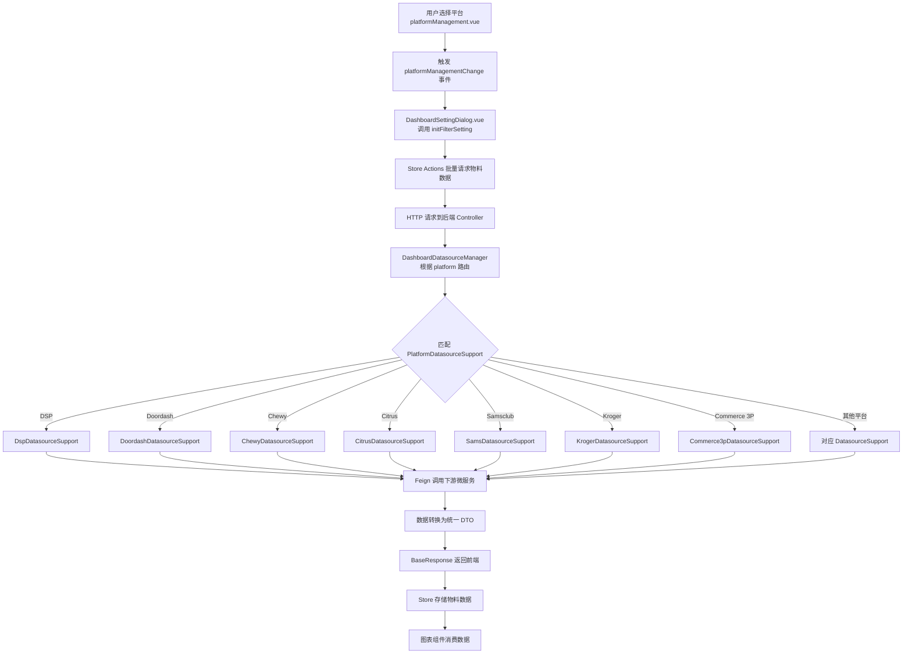
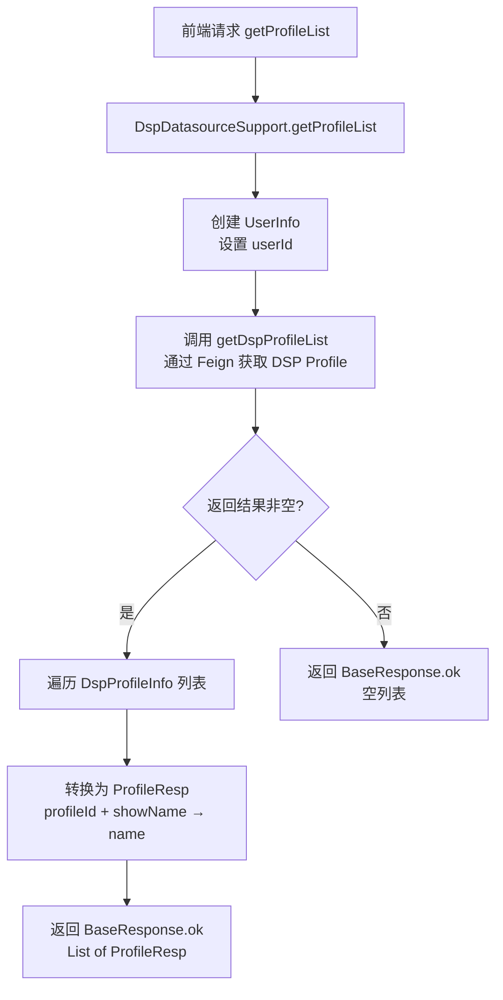
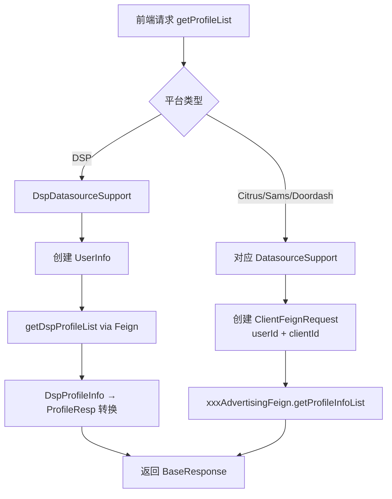
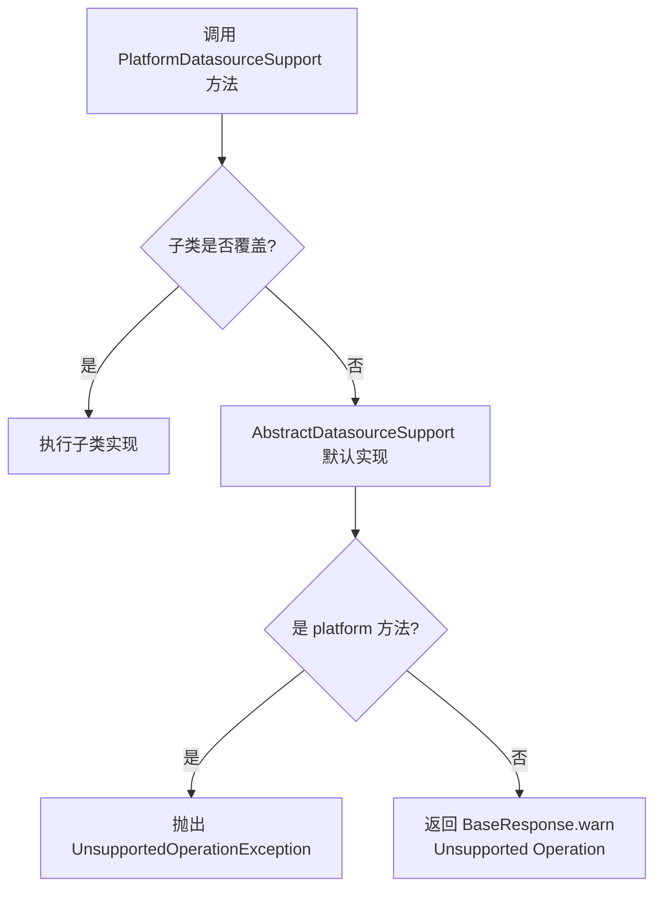
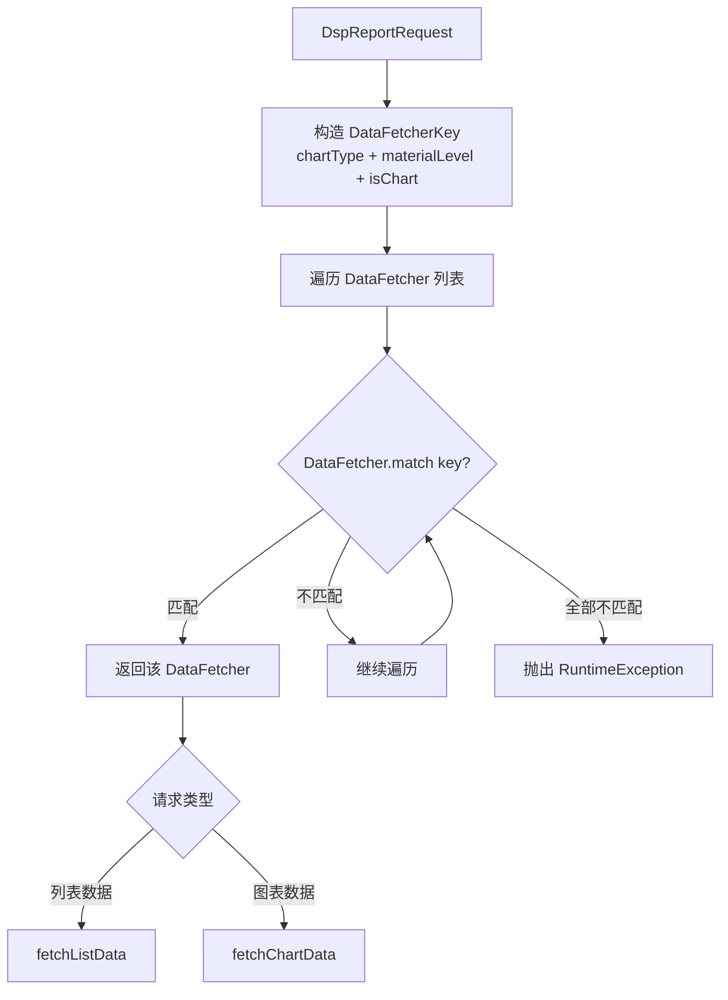
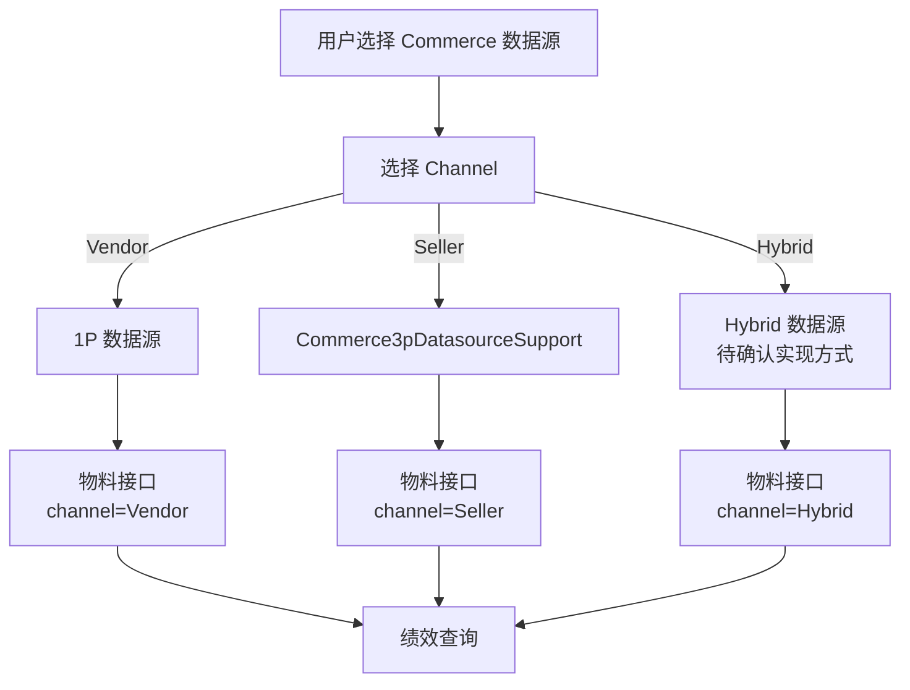
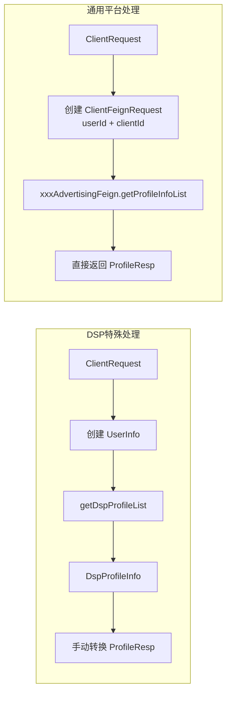

# 数据源路由与物料查询 功能逻辑文档

> 本文档由 document-automation 工具自动生成，基于源代码、PRD 文档和技术评审文档。
> 生成时间: 2026-04-09 10:03:35
> 准确性评分: 未验证/100

---


# 数据源路由与物料查询 功能逻辑文档

## 1. 模块概述

### 1.1 职责与定位

数据源路由与物料查询模块是 Pacvue Custom Dashboard 系统的**核心基础设施层**，负责为多平台（Amazon、DSP、Walmart、Instacart、Criteo、Chewy、Doordash、Target、Citrus、Kroger、Bol、Samsclub、CrossRetailers 等）提供统一的数据源抽象接口。该模块解决的核心问题是：**在一个统一的 Dashboard 产品中，如何屏蔽各广告平台的 API 差异，为上层图表组件（Trend/Comparison/TopOverview/Table/Pie）提供一致的物料数据查询能力**。

"物料"（Material）在本系统中指构成广告投放层级结构的各类实体数据，包括但不限于：
- **Profile**：广告账户/配置文件
- **Advertiser**：广告主（DSP 特有）
- **AdType**：广告类型
- **Campaign / Campaign Tag / Campaign Parent Tag**：广告活动及其标签体系
- **ASIN / Item / Product**：商品标识（不同平台命名不同）
- **Keyword / Keyword Tag**：关键词及其标签
- **SOV Market**：Share of Voice 市场信息
- **Commerce 数据源**：1P（Vendor）/ 3P（Seller）/ Hybrid 三种通道

### 1.2 系统架构位置

```
┌─────────────────────────────────────────────────────────┐
│                    前端 (Vue)                             │
│  platformManagement.vue → DashboardSettingDialog.vue     │
│  → CreateDashboard.vue → metricsListIndex.js             │
│  → 各平台指标定义文件 (amazon.js/dsp.js/walmart.js...)    │
└──────────────────────┬──────────────────────────────────┘
                       │ HTTP / REST API
                       ▼
┌─────────────────────────────────────────────────────────┐
│              custom-dashboard-api (后端)                  │
│  Controller 层: DashboardDatasourceController (待确认)    │
│  ┌─────────────────────────────────────────────────┐    │
│  │  DashboardDatasourceManager (路由层，待确认)       │    │
│  │  ┌───────────────────────────────────────────┐  │    │
│  │  │  PlatformDatasourceSupport (策略接口)       │  │    │
│  │  │  ├─ AbstractDatasourceSupport (抽象基类)    │  │    │
│  │  │  ├─ DspDatasourceSupport                   │  │    │
│  │  │  ├─ DoordashDatasourceSupport              │  │    │
│  │  │  ├─ ChewyDatasourceSupport                 │  │    │
│  │  │  ├─ CitrusDatasourceSupport                │  │    │
│  │  │  ├─ SamsDatasourceSupport                  │  │    │
│  │  │  ├─ KrogerDatasourceSupport                │  │    │
│  │  │  ├─ Commerce3pDatasourceSupport            │  │    │
│  │  │  └─ ... (其他平台)                          │  │    │
│  │  └───────────────────────────────────────────┘  │    │
│  └─────────────────────────────────────────────────┘    │
└──────────────────────┬──────────────────────────────────┘
                       │ Feign RPC
                       ▼
┌─────────────────────────────────────────────────────────┐
│              下游微服务                                    │
│  AmazonAdvertisingFeign / AmazonDspMainApiFeign          │
│  AmazonDspProviderFeign / DoordashAdvertisingFeign       │
│  DoordashSovFeign / ChewyAdvertisingFeign / ChewySovFeign│
│  CitrusAdvertisingFeign / CitrusSovFeign                 │
│  CitrusApiMaterialFeign / SamsAdvertisingFeign           │
│  SamsMainApiFeign / SamsSovFeign / Krogerv3AdvertisingFeign│
│  KrogerSovFeign / TagServiceFeign                        │
└─────────────────────────────────────────────────────────┘
```

### 1.3 涉及的后端模块

| 模块 | Maven 模块名 | 核心包路径 |
|------|-------------|-----------|
| API 层 | `custom-dashboard-api` | `com.pacvue.api.controller.DashboardDatasourceController`（**待确认**） |
| 管理层 | `custom-dashboard-api` | `com.pacvue.api.manager` |
| 策略实现层 | `custom-dashboard-api` | `com.pacvue.api.manager.support` |
| DTO 层 | `custom-dashboard-api` | `com.pacvue.api.dto.request.data` |
| Feign 层 | **待确认**（可能为独立 feign 模块） | `com.pacvue.feign.*` |
| 基础枚举 | **待确认** | `com.pacvue.base.enums.core.Platform` |

### 1.4 涉及的前端组件

| 组件/文件 | 路径（推测） | 职责 |
|----------|-------------|------|
| `platformManagement.vue` | `frontend/src/components/` | 平台管理选择组件，触发 `platformManagementChange` 事件 |
| `DashboardSettingDialog.vue` | `frontend/src/components/` | Dashboard 设置弹窗，处理平台切换与 filterConfig 联动 |
| `CreateDashboard.vue` | `frontend/src/views/` | 创建 Dashboard 页面，初始化各平台物料数据 |
| `index.vue` | `frontend/src/views/` | Dashboard 首页，含 `getEventdefaut` 平台物料初始化逻辑（当前被注释） |
| `metricsListIndex.js` | `frontend/src/metricsList/` | 平台指标配置注册中心，定义 `PLATFORM_CONFIG` |
| `defaultCustomDashboard.js` | `frontend/src/metricsList/` | 平台常量定义 |
| 各平台指标文件 | `frontend/src/metricsList/` | `amazon.js`、`walmart.js`、`dsp.js`、`instacart.js`、`criteo.js`、`target.js`、`citrus.js`、`kroger.js`、`chewy.js`、`bol.js`、`doordash.js`、`samsclub.js`、`crossRetailers.js`、`common.js` |

### 1.5 设计模式总览

| 设计模式 | 应用位置 | 说明 |
|---------|---------|------|
| **策略模式** | `PlatformDatasourceSupport` 接口 + 各平台实现类 | 通过 `platform()` 方法标识平台，运行时路由到对应实现 |
| **模板方法模式** | `AbstractDatasourceSupport` 抽象基类 | 提供所有方法的默认实现（返回 Unsupported Operation），子类按需覆盖 |
| **工厂模式** | `DataFetcherFactory` | 根据 `chartType` + `materialLevel` 匹配对应的 `DataFetcher` 策略（DSP 报表场景） |
| **空对象模式** | `AbstractDatasourceSupport` | 默认返回 `BaseResponse.warn("Unsupported Operation")` 而非抛异常（`platform()` 除外） |

---

## 2. 用户视角

### 2.1 功能场景总览

基于 PRD 文档和代码分析，本模块支撑以下核心用户场景：

#### 场景一：创建/编辑 Dashboard 时选择平台与物料

**用户操作流程：**

1. 用户进入 Custom Dashboard 创建页面（`CreateDashboard.vue`）
2. 在页面左上角选择平台入口：
   - **Pacvue HQ** 模块下可选择 Cross Retailer Custom Dashboard
   - **Report** 模块下可选择各单平台 Custom Dashboard
3. 用户点击平台管理组件（`platformManagement.vue`），选择目标平台（如 Amazon、DSP、Walmart 等）
4. 系统触发 `platformManagementChange` 事件
5. `DashboardSettingDialog.vue` 响应事件，调用 `initFilterSetting` 方法
6. 系统根据所选平台，通过 Store actions 批量请求物料数据：
   - `getProfileListData` → 获取 Profile 列表
   - `getAdTypeListData` → 获取 AdType 列表
   - `getCampaignTagListData` → 获取 Campaign Tag 列表
   - `getOrderTagData` → 获取 Order Tag 数据
   - `getCommerceTypeOther` → 获取 Commerce 类型数据
   - `getDspEntityAdvertiserTreeInfo` → 获取 DSP Entity-Advertiser 树形结构
7. 物料数据返回后存入 Vuex Store，供后续图表配置使用

#### 场景二：Dashboard Setting 中配置数据源

**用户操作流程：**

1. 用户在 Dashboard Setting 弹窗中选择指标（Metric）
2. 系统根据所选指标的支持情况，展示可选的数据源（Data Source）
3. 数据源选择规则：
   - **只选择 Ads 数据**：如现状，直接使用广告平台数据
   - **只选择 Commerce 数据**：先选指标，在指标区域按数据源区分指标；先选物料，需要先确认数据源
   - **Ads 和 Commerce 数据混选**：**待确认**具体交互逻辑
4. Commerce 场景下分层级选择：1P（Vendor）/ 3P（Seller）/ Hybrid
5. 选择指标时展示 Data Source 选择器，根据指标支持情况取交集，有冲突时提示用户

#### 场景三：DSP 平台 Advertiser 层级筛选

**用户操作流程：**

1. 用户选择 DSP 平台
2. Profile 显示按照 **Entity → Advertisers** 二级菜单方式展示
3. 用户可以展开 Entity 查看其下的 Advertiser 列表
4. 选择后，存储分为 `profileFilter` + `advertiserFilter` 两个独立字段
5. 树形结构数据通过 `getDspAdvertiserTreeInfo` 接口获取
6. 绩效查询时新增 `productLineAdvertisers` 字段

#### 场景四：多平台 ASIN/Item/Product 查询

**用户操作流程：**

1. 用户在 Filter 搜索框中输入 ASIN/Item/Product 关键词
2. 系统根据当前平台调用对应的查询接口：
   - Amazon/DSP → `/data/getASINList`（ASIN）
   - Walmart/Samsclub → `/data/getItemList`（Item）
   - Instacart/Criteo/Target/Citrus/Kroger/Chewy/Bol/Doordash → `/data/getProductList`（Product）
   - Commerce → `/data/getCommerceAsin`（CommerceMarketASIN）
3. 返回结果展示在下拉列表中供用户选择

#### 场景五：Cross Retailer 场景

**用户操作流程：**

1. 用户在 HQ 模块下选择 Cross Retailer Custom Dashboard
2. 支持的图表类型：Trend Chart、Comparison Chart、Top Overview、Table、Pie Chart
3. 物料选择仅支持 Customize 类型的自定义物料选择
4. Cross Retailer 场景下，物料层级为 Cross Retailer | Share Parent Tag 时，retailers 支持选择 Amazon DSP
5. Grid Table 中支持复杂的 Material Level 组合（详见 PRD 3.4.4 业务逻辑中的矩阵表）

#### 场景六：Select Metric 中的数据源展示

根据 Figma 设计稿：
- Select Metric 弹窗中新增 DSP 数据源
- 现有 4 个数据源（**待确认**具体为哪 4 个，推测为 Amazon Ads、DSP、Commerce、Cross Retailer）
- 可展开/收起查看各数据源下的指标列表
- 用户选择指标后，系统自动关联对应的数据源

### 2.2 UI 交互要点

基于 Figma 设计稿和前端代码分析：

**平台选择器**（`platformManagement.vue`）：
- 下拉菜单形式，列出所有支持的平台：Amazon、Walmart、Instacart、Criteo、Cross Retailer 等
- 选择后触发 `platformManagementChange` 事件

**Filter 联动区域**（`DashboardSettingDialog.vue`）：
- 包含多个筛选器：Profile、Ad Type、Campaign、Campaign Tag、Campaign Parent Tag、Keyword、Keyword Tag
- 根据所选平台动态显示/隐藏筛选器
- Filter-linked Campaign 支持关联筛选

**指标选择弹窗**：
- 按数据源分组展示指标
- 支持 Type Color 和 Bulk Setting
- 展示 Impression、Click、CTR 等常见指标

---

## 3. 核心 API

### 3.1 图表数据查询接口

基于技术评审文档和模块骨架信息，以下接口已确认存在且已完成开发：

#### 3.1.1 获取 Top Overview 图表数据

- **路径**: `POST /report/customDashboard/getTopOverview`（**待确认** HTTP 方法）
- **参数**: **待确认**（推测包含 `chartId`、`platform`、`dateRange`、`filterConfig`、`metrics` 等）
- **返回值**: **待确认**
- **说明**: 获取概览图数据，支持 Ads 和 Commerce（1P/3P）数据源
- **状态**: 已完成（1P ✓、3P ✓）

#### 3.1.2 获取趋势图数据

- **路径**: `POST /report/customDashboard/getTrendChart`（**待确认** HTTP 方法）
- **参数**: **待确认**
- **返回值**: **待确认**
- **说明**: 获取趋势图数据，支持 Single metric 模式和多指标模式
- **状态**: 已完成（1P ✓ 除 single 模式、3P ✓ 除 single 模式）

#### 3.1.3 获取对比图数据

- **路径**: `POST /report/customDashboard/getComparisonChart`（**待确认** HTTP 方法）
- **参数**: **待确认**
- **返回值**: **待确认**
- **说明**: 获取对比图数据
- **状态**: 已完成（1P ✓、3P ✓）

#### 3.1.4 获取饼图数据

- **路径**: `POST /report/customDashboard/getPie`（**待确认** HTTP 方法）
- **参数**: **待确认**
- **返回值**: **待确认**
- **说明**: 获取饼图数据
- **状态**: 已完成（1P ✓、3P ✓）

#### 3.1.5 获取表格数据

- **路径**: `POST /report/customDashboard/getTable`（**待确认** HTTP 方法）
- **参数**: **待确认**
- **返回值**: **待确认**
- **说明**: 获取表格数据，Table 下选完物料后下方出现筛选框选择 1P/3P（在 scope setting 里选数据源）
- **状态**: 已完成（1P ✓、3P ✓）

#### 3.1.6 获取 Commerce ASIN 列表

- **路径**: `POST /report/customDashboard/getCommerceAsins`（**待确认** HTTP 方法）
- **参数**: **待确认**（推测使用 `CommerceAsinFeignRequest`）
- **返回值**: **待确认**
- **说明**: 获取 Commerce 场景下的 ASIN 列表
- **状态**: 已完成（1P ✓、3P ✓）

### 3.2 物料查询接口

基于技术评审文档中的接口详情表：

| 平台 | 物料类型 | 接口路径 | 说明 |
|------|---------|---------|------|
| Commerce | CommerceMarketASIN | `/data/getCommerceAsin` | Commerce 市场 ASIN 查询 |
| Amazon | ASIN | `/data/getASINList` | Amazon ASIN 查询 |
| DSP | ASIN | `/data/getASINList` | DSP ASIN 查询（复用 Amazon 接口） |
| Walmart | Item | `/data/getItemList` | Walmart Item 查询 |
| Samsclub | Item | `/data/getItemList` | Samsclub Item 查询 |
| Instacart | InstacartProduct | `/data/getProductList` | Instacart 产品查询 |
| Criteo | Product | `/data/getProductList` | Criteo 产品查询 |
| Target | Product | `/data/getProductList` | Target 产品查询 |
| Citrus | CitrusProduct | `/data/getProductList` | Citrus 产品查询 |
| Kroger | Product | `/data/getProductList` | Kroger 产品查询 |
| Chewy | Product | `/data/getProductList` | Chewy 产品查询 |
| Bol | Product | `/data/getProductList` | Bol 产品查询 |
| Doordash | Product | `/data/getProductList` | Doordash 产品查询 |

### 3.3 DSP Advertiser 树形结构接口

- **路径**: **待确认**（推测为 `/data/getDspAdvertiserTreeInfo`）
- **参数**: **待确认**（推测包含 `userId`）
- **返回值**: Entity → Advertiser 树形结构 JSON
- **说明**: 获取 DSP 平台的 Entity-Advertiser 层级关系，用于 Profile 筛选器的二级菜单展示

### 3.4 前端 API 调用方式

前端通过 Vuex Store 的 actions 统一调用后端接口：

```javascript
// Store actions（推测）
getProfileListData({ commit }, params)        // 获取 Profile 列表
getAdTypeListData({ commit }, params)         // 获取 AdType 列表
getCampaignTagListData({ commit }, params)    // 获取 Campaign Tag 列表
getOrderTagData({ commit }, params)           // 获取 Order Tag 数据
getCommerceTypeOther({ commit }, params)      // 获取 Commerce 类型数据
getDspEntityAdvertiserTreeInfo({ commit }, params) // 获取 DSP Entity-Advertiser 树
```

---

## 4. 核心业务流程

### 4.1 平台数据源路由流程

这是本模块最核心的流程，描述了请求如何从前端到达正确的平台实现类。

**详细步骤：**

1. **前端平台选择**：用户在 `platformManagement.vue` 组件中选择目标平台（如 DSP），组件触发 `platformManagementChange` 事件，携带平台标识。

2. **Setting 初始化**：`DashboardSettingDialog.vue` 监听到平台变更事件，调用 `initFilterSetting` 方法。该方法根据新选择的平台，重置 filterConfig 配置，并触发物料数据的批量加载。

3. **Store Action 分发**：前端 Store 中的 actions（如 `getProfileListData`）被调用，构造请求参数（包含 `userId`、`clientId`、`platform` 等），通过 HTTP 请求发送到后端。

4. **Controller 接收**：后端 Controller（推测为 `DashboardDatasourceController`，位于 `com.pacvue.api.controller` 包下）接收请求，提取 platform 参数。

5. **Manager 路由**：`DashboardDatasourceManager`（**待确认**具体实现方式）根据请求中的 platform 参数，从已注册的 `PlatformDatasourceSupport` 实现类列表中，找到 `platform()` 方法返回值匹配的实现类。这一步的实现方式推测为：Spring 容器注入所有 `PlatformDatasourceSupport` 实现类的列表，遍历匹配 `platform()` 返回值。

6. **策略执行**：路由到对应的实现类后，调用具体的方法（如 `getProfileList`、`getCampaignList` 等）。

7. **Feign 调用**：各平台实现类通过注入的 Feign 客户端调用下游微服务。例如：
   - `DspDatasourceSupport` 调用 `AmazonAdvertisingFeign`、`AmazonDspMainApiFeign`
   - `DoordashDatasourceSupport` 调用 `DoordashAdvertisingFeign`
   - `ChewyDatasourceSupport` 调用 `ChewyAdvertisingFeign`

8. **数据转换与返回**：下游服务返回原始数据后，各实现类进行必要的数据转换（如 `DspDatasourceSupport.getProfileList` 将 `DspProfileInfo` 转换为统一的 `ProfileResp`），封装为 `BaseResponse` 返回。

9. **前端存储与消费**：前端接收到响应数据后，存入 Vuex Store，供 `metricsListIndex.js` 中 `PLATFORM_CONFIG` 定义的指标体系和图表组件消费使用。



### 4.2 DSP Profile 获取流程

以 DSP 平台获取 Profile 列表为例，详细展开每一步的具体逻辑：

**步骤 1**：前端构造 `ClientRequest`，包含 `userId` 和 `clientId`（**待确认**是否包含 `clientId`）。

**步骤 2**：请求到达 `DspDatasourceSupport.getProfileList(ClientRequest request)` 方法。

**步骤 3**：方法内部创建 `UserInfo` 对象，设置 `userId`：
```java
UserInfo userInfo = new UserInfo();
userInfo.setUserId(request.getUserId());
```

**步骤 4**：调用内部方法 `getDspProfileList(userInfo)`（该方法可能定义在 `AbstractDatasourceSupport` 或 `DspDatasourceSupport` 中），通过 `AmazonAdvertisingFeign` 或 `AmazonDspMainApiFeign` 或 `AmazonDspProviderFeign` 获取 DSP Profile 原始数据，返回 `BaseResponse<List<DspProfileInfo>>`。

**步骤 5**：判断返回结果非空且数据列表不为空：
```java
if (Objects.nonNull(baseResponse) && !CollectionUtils.isEmpty(baseResponse.getData()))
```

**步骤 6**：将 `DspProfileInfo` 列表转换为统一的 `ProfileResp` 列表：
- `DspProfileInfo.getProfileId()` → `ProfileResp.setProfileId()`
- `DspProfileInfo.getShowName()` → `ProfileResp.setName()`

**步骤 7**：如果原始数据为空，返回空列表 `BaseResponse.ok(Lists.newArrayList())`。



### 4.3 通用平台 Profile 获取流程（Citrus/Samsclub/Doordash 等）

与 DSP 不同，Citrus、Samsclub、Doordash 等平台的 `getProfileList` 实现更为直接：

**步骤 1**：接收 `ClientRequest` 参数。

**步骤 2**：创建 `ClientFeignRequest` 对象，设置 `userId` 和 `clientId`：
```java
ClientFeignRequest clientFeignRequest = new ClientFeignRequest();
clientFeignRequest.setUserId(request.getUserId());
clientFeignRequest.setClientId(request.getClientId());
```

**步骤 3**：直接调用对应平台的 Feign 客户端：
- Citrus: `citrusAdvertisingFeign.getProfileInfoList(clientFeignRequest)`
- Samsclub: `samsAdvertisingFeign.getProfileInfoList(clientFeignRequest)`
- Doordash: `doordashAdvertisingFeign.getProfileInfoList(clientFeignRequest)`

**步骤 4**：Feign 客户端直接返回 `BaseResponse<List<ProfileResp>>`，无需额外转换。

**关键差异**：DSP 平台需要额外的数据转换步骤（`DspProfileInfo` → `ProfileResp`），而其他平台的 Feign 接口直接返回统一的 `ProfileResp` 格式。



### 4.4 Citrus 平台 Campaign 获取流程

以 Citrus 平台为例展示 Campaign 查询的完整流程：

**步骤 1**：接收 `UserInfo` 和 `CampaignRequest` 参数。

**步骤 2**：创建 `CampaignFeignRequest` 对象，映射请求参数：
```java
CampaignFeignRequest campaignFeignRequest = new CampaignFeignRequest();
campaignFeignRequest.setCampaignName(request.getCampaignName());
campaignFeignRequest.setTagIds(request.getCampaignTagIds());
campaignFeignRequest.setProfileIds(request.getProfileIds());
```

**步骤 3**：调用 `citrusAdvertisingFeign.getCampaignList(campaignFeignRequest)` 获取 Campaign 列表。

**步骤 4**：返回 `BaseResponse<List<CampaignResp>>`。

### 4.5 AbstractDatasourceSupport 默认行为流程

当某个平台实现类未覆盖某个方法时，调用会落入 `AbstractDatasourceSupport` 的默认实现：

**步骤 1**：调用到达 `AbstractDatasourceSupport` 的默认方法。

**步骤 2**：方法返回 `BaseResponse.warn("Unsupported Operation")`。

**步骤 3**：`BaseResponse.warn()` 构造一个带有警告信息的响应对象，HTTP 状态码仍为 200，但业务状态码标识为警告。

**特殊情况**：`platform()` 方法在 `AbstractDatasourceSupport` 中直接抛出 `UnsupportedOperationException`，这是因为每个子类**必须**覆盖此方法以标识自己的平台身份，如果未覆盖则属于编程错误，应该快速失败。



### 4.6 DataFetcherFactory 策略匹配流程（DSP 报表场景）

基于技术评审文档中的 `DataFetcherFactory` 设计：

**步骤 1**：接收 `DspReportRequest` 请求。

**步骤 2**：构造 `DataFetcherKey`，包含三个维度：
- `chartType`：图表类型（Trend/Comparison/TopOverview/Table/Pie）
- `materialLevel`：物料层级
- `isChart`：是否为图表模式（通过 `DspReportHelper.isChart(request)` 判断）

**步骤 3**：遍历所有注入的 `DataFetcher` 实现类列表。

**步骤 4**：调用每个 `DataFetcher` 的 `match(key)` 方法进行匹配。

**步骤 5**：返回第一个匹配的 `DataFetcher`，如果没有匹配则抛出 `RuntimeException("DataFetcher not found for key: " + key)`。

**步骤 6**：调用匹配到的 `DataFetcher` 的 `fetchListData` 或 `fetchChartData` 方法获取数据。



### 4.7 Commerce 数据源通道选择流程

基于技术评审文档中的 Commerce Hybrid 数据源设计：

**步骤 1**：用户在 Dashboard Setting 中选择 Commerce 数据源。

**步骤 2**：系统展示数据源通道选择：Vendor（1P）、Seller（3P）、Hybrid。

**步骤 3**：全部物料接口统一移除 `is3p` 字段，改为 `channel` 字段，取值为 `Vendor`、`Seller`、`Hybrid`。

**步骤 4**：连带新增 `chartId` 字段作为接口入参。

**步骤 5**：根据 `channel` 值路由到对应的数据源实现：
- `Vendor` → 1P 数据源
- `Seller` → `Commerce3pDatasourceSupport`
- `Hybrid` → **待确认**（可能同时查询 1P 和 3P 后合并）

**步骤 6**：绩效接口根据 `channel` 值查询对应的数据。



### 4.8 前端指标配置驱动流程

**步骤 1**：`metricsListIndex.js` 定义 `PLATFORM_CONFIG`，包含 `default` 和 `commerce` 两种模式。

**步骤 2**：各平台指标定义文件（`amazon.js`、`dsp.js`、`walmart.js` 等）导出该平台支持的指标列表，每个指标包含名称、数据源、支持的图表类型等信息。

**步骤 3**：`defaultCustomDashboard.js` 定义平台常量：
- `customDashboardGroupLevelStr`：物料层级分组字符串
- `excludeItems`：排除项
- `platformGroups`：平台分组
- `customDashboardSettingSupportMaterial`：各平台支持的物料类型

**步骤 4**：当用户在 Select Metric 弹窗中选择指标时，系统根据 `PLATFORM_CONFIG` 和当前平台，过滤出可用的指标列表。

**步骤 5**：指标选择后，系统根据指标的数据源要求，自动确定需要查询的后端接口和数据源类型。

---

## 5. 数据模型

### 5.1 数据库表

**待确认**。当前代码片段中未发现直接的数据库表定义。物料数据主要通过 Feign 调用下游微服务获取，本模块可能不直接操作数据库。

### 5.2 核心 DTO/VO

#### 5.2.1 请求 DTO

| 类名 | 包路径 | 说明 | 关键字段 |
|------|--------|------|---------|
| `ClientRequest` | `com.pacvue.api.dto.request.data` | 客户端请求 DTO | `userId`（用户ID）、`clientId`（客户端ID） |
| `AsinRequest` | `com.pacvue.api.dto.request.data` | ASIN 查询请求 DTO | **待确认** |
| `CampaignRequest` | `com.pacvue.api.dto.request.data`（推测） | Campaign 查询请求 | `campaignName`（活动名称）、`campaignTagIds`（标签ID列表）、`profileIds`（Profile ID列表） |
| `CommerceAsinRequest` | `com.pacvue.api.dto.request.data` | Commerce ASIN 请求 | **待确认** |
| `CommerceBrandCategoryRequest` | `com.pacvue.api.dto.request.data` | Commerce 品牌分类请求 | **待确认** |
| `CommerceDataRequest` | `com.pacvue.api.dto.request.data` | Commerce 数据请求 | **待确认** |
| `ClientFeignRequest` | `com.pacvue.feign.dto.request`（推测） | Feign 客户端请求 | `userId`、`clientId` |
| `CampaignFeignRequest` | `com.pacvue.feign.dto.request`（推测） | Feign Campaign 请求 | `campaignName`、`tagIds`、`profileIds` |
| `CommerceAsinFeignRequest` | `com.pacvue.feign.dto.request` | Commerce ASIN Feign 请求 | **待确认** |
| `CommerceDataFeignRequest` | `com.pacvue.feign.dto.request` | Commerce 数据 Feign 请求 | **待确认** |

#### 5.2.2 响应 DTO

| 类名 | 包路径 | 说明 | 关键字段 |
|------|--------|------|---------|
| `ProfileResp` | `com.pacvue.feign.dto.response` | Profile 统一响应 | `profileId`（Profile ID）、`name`（显示名称） |
| `DspProfileInfo` | `com.pacvue.feign.dto.response.dsp` | DSP Profile 原始信息 | `profileId`、`showName`（显示名称） |
| `DspAdvertiserInfo` | `com.pacvue.feign.dto.response.dsp` | DSP Advertiser 信息 | **待确认**（推测包含 `advertiserId`、`advertiserName`、`entityId` 等） |
| `CampaignResp` | `com.pacvue.feign.dto.response` | Campaign 响应 | **待确认** |
| `TagTreeInfo` | `com.pacvue.feign.dto.response` | 标签树信息 | **待确认**（推测为树形结构，包含 `tagId`、`tagName`、`children`） |
| `KeywordInfo` | `com.pacvue.feign.dto` | 关键词信息 | **待确认** |
| `SovMarketInfo` | `com.pacvue.feign.dto` | SOV 市场信息 | **待确认** |
| `BaseResponse<T>` | `com.pacvue.base.dto.response` | 统一响应封装 | `data`（数据）、状态码、消息（支持 `ok()`、`warn()` 等静态方法） |

#### 5.2.3 用户信息 DTO

| 类名 | 包路径 | 说明 | 关键字段 |
|------|--------|------|---------|
| `UserInfo` | `com.pacvue.web.base.dto` | 用户信息 | `userId`（用户ID） |

### 5.3 核心枚举

#### Platform 枚举

位于 `com.pacvue.base.enums.core.Platform`，定义了系统支持的所有平台：

| 枚举值 | 说明 | 对应 DatasourceSupport |
|--------|------|----------------------|
| `DSP` | Amazon DSP | `DspDatasourceSupport` |
| `Chewy` | Chewy 平台 | `ChewyDatasourceSupport` |
| `Amazon` | Amazon 广告 | **待确认**（可能为 `AmazonDatasourceSupport`） |
| `Walmart` | Walmart 广告 | **待确认** |
| `Instacart` | Instacart 广告 | **待确认** |
| `Criteo` | Criteo 广告 | **待确认** |
| `Target` | Target 广告 | **待确认** |
| `Citrus` | Citrus 广告 | `CitrusDatasourceSupport`（从代码片段推测） |
| `Kroger` | Kroger 广告 | `KrogerDatasourceSupport` |
| `Bol` | Bol 平台 | **待确认** |
| `Doordash` | Doordash 广告 | `DoordashDatasourceSupport` |
| `Samsclub` | Sam's Club 广告 | `SamsDatasourceSupport` |

### 5.4 DashboardConfig

`DashboardConfig` 类出现在 `Commerce3pDatasourceSupport` 的导入中（`com.pacvue.base.dto.DashboardConfig`），推测用于存储 Dashboard 的配置信息，包括 `channel`（Vendor/Seller/Hybrid）、`chartId` 等字段。**待确认**具体字段。

### 5.5 DataFetcherKey

用于 `DataFetcherFactory` 的策略匹配键：

| 字段 | 类型 | 说明 |
|------|------|------|
| `chartType` | **待确认** | 图表类型（Trend/Comparison/TopOverview/Table/Pie） |
| `materialLevel` | **待确认** | 物料层级 |
| `isChart` | `boolean` | 是否为图表模式 |

---

## 6. 平台差异

### 6.1 各平台 DatasourceSupport 实现对比

| 平台 | 实现类 | Feign 依赖 | Profile 获取方式 | Campaign Tag 获取方式 | 特殊处理 |
|------|--------|-----------|-----------------|---------------------|---------|
| **DSP** | `DspDatasourceSupport` | `AmazonAdvertisingFeign`、`AmazonDspMainApiFeign`、`AmazonDspProviderFeign`、`TagServiceFeign` | 通过 `getDspProfileList` 获取 `DspProfileInfo`，手动转换为 `ProfileResp` | **待确认** | 支持 Advertiser 层级（Entity → Advertiser 二级菜单）；`productLineAdvertisers` 字段 |
| **Doordash** | `DoordashDatasourceSupport` | `DoordashAdvertisingFeign`、`TagServiceFeign`、`DoordashSovFeign` | 通过 `ClientFeignRequest` 直接调用 `getProfileInfoList` | **待确认** | 支持 SOV 查询 |
| **Chewy** | `ChewyDatasourceSupport` | `ChewyAdvertisingFeign`、`TagServiceFeign`、`ChewySovFeign` | **待确认** | **待确认** | 版本号 `v2`；支持 SOV 查询 |
| **Citrus** | **待确认**（从代码片段推测存在） | `CitrusAdvertisingFeign`、`TagServiceFeign`、`CitrusSovFeign`、`CitrusApiMaterialFeign` | 通过 `ClientFeignRequest` 直接调用 `getProfileInfoList` | **待确认** | 额外依赖 `CitrusApiMaterialFeign` |
| **Samsclub** | `SamsDatasourceSupport` | `SamsAdvertisingFeign`、`SamsMainApiFeign`、`SamsSovFeign` | 通过 `ClientFeignRequest` 直接调用 `getProfileInfoList` | 通过 `SamsMainApiFeign.getCampaignTagList()` | 支持 SOV 查询 |
| **Kroger** | `KrogerDatasourceSupport` | `Krogerv3AdvertisingFeign`、`TagServiceFeign`、`KrogerSovFeign` | **待确认** | **待确认** | 版本号 `v3`；支持 SOV 查询 |
| **Commerce 3P** | `Commerce3pDatasourceSupport` | **待确认** | **待确认** | **待确认** | 使用 `SearchRankingUtils` 工具类；依赖 `DashboardConfig` |

### 6.2 Profile 获取方式差异



**关键差异说明**：

1. **DSP 平台**：不使用 `clientId`，仅使用 `userId` 构造 `UserInfo`；返回的原始数据类型为 `DspProfileInfo`，需要手动映射 `profileId` 和 `showName` → `name`。

2. **Citrus/Samsclub/Doordash 等平台**：使用 `userId` + `clientId` 构造 `ClientFeignRequest`；Feign 接口直接返回 `BaseResponse<List<ProfileResp>>`，无需额外转换。

### 6.3 ASIN/Item/Product 命名差异

不同平台对商品标识的命名不同，这直接影响前端 Filter 搜索框的标签文本和后端查询接口：

| 平台分组 | 物料名称 | 查询接口 |
|---------|---------|---------|
| Amazon、DSP | ASIN | `/data/getASINList` |
| Walmart、Samsclub | Item | `/data/getItemList` |
| Instacart、Criteo、Target、Citrus、Kroger、Chewy、Bol、Doordash | Product | `/data/getProductList` |
| Commerce | CommerceMarketASIN | `/data/getCommerceAsin` |

### 6.4 版本号差异

部分平台实现类中定义了版本号常量：

| 平台 | 版本号 | 说明 |
|------|--------|------|
| Chewy | `v2` | `private final static String VERSION = "v2"` |
| Kroger | `v3` | `private final static String VERSION = "v3"` |

版本号的具体用途**待确认**，推测用于 Feign 调用时的 API 版本路由。

### 6.5 Cross Retailer 平台特殊逻辑

Cross Retailer 场景下的物料层级支持矩阵（基于 PRD 3.4.4）：

| Material Level | Profile | Campaign (Parent) Tag | Campaign Type | Retailer | Share Tag |
|---------------|---------|----------------------|---------------|----------|-----------|
| **Profile** | × | ✓ | ✓ | × | ✓ |
| **Campaign (Parent) Tag** | ✓ | ✓ | ✓ | × | ✓ |
| **Campaign Type** | ✓ | ✓ | × | × | ✓ |
| **Retailer** | × | × | × | × | ✓ |
| **Share Tag** | ✓ | ✓ | ✓ | ✓ | × |

当物料层级为 Cross Retailer | Share Parent Tag 时，retailers 支持选择 Amazon DSP。

### 6.6 DSP Advertiser 层级特殊处理

DSP 平台独有的 Advertiser 层级筛选：

- **显示方式**：Entity → Advertisers 二级菜单
- **存储方式**：`profileFilter` + `advertiserFilter` 分开存储
- **数据获取**：通过 `getDspAdvertiserTreeInfo` 接口获取树形结构 JSON
- **绩效查询**：新增 `productLineAdvertisers` 字段

### 6.7 Commerce 数据源通道差异

| 通道 | 标识 | 说明 |
|------|------|------|
| Vendor | `channel: Vendor` | 1P 数据源 |
| Seller | `channel: Seller` | 3P 数据源，对应 `Commerce3pDatasourceSupport` |
| Hybrid | `channel: Hybrid` | 混合数据源 |

**重要变更**：全部物料接口统一移除 `is3p` 字段，改为 `channel` 字段。

### 6.8 前端指标配置文件

每个平台都有独立的指标定义文件：

| 文件 | 平台 | 说明 |
|------|------|------|
| `amazon.js` | Amazon | Amazon 广告指标定义 |
| `walmart.js` | Walmart | Walmart 广告指标定义 |
| `dsp.js` | DSP | Amazon DSP 指标定义 |
| `instacart.js` | Instacart | Instacart 广告指标定义 |
| `criteo.js` | Criteo | Criteo 广告指标定义 |
| `target.js` | Target | Target 广告指标定义 |
| `citrus.js` | Citrus | Citrus 广告指标定义 |
| `kroger.js` | Kroger | Kroger 广告指标定义 |
| `chewy.js` | Chewy | Chewy 广告指标定义 |
| `bol.js` | Bol | Bol 平台指标定义 |
| `doordash.js` | Doordash | Doordash 广告指标定义 |
| `samsclub.js` | Samsclub | Sam's Club 广告指标定义 |
| `crossRetailers.js` | Cross Retailer | 跨平台指标定义 |
| `common.js` | 通用 | 各平台共享的通用指标定义 |

`metricsListIndex.js` 中的 `PLATFORM_CONFIG` 定义了两种模式：
- **default**：标准广告数据模式
- **commerce**：Commerce 数据模式

---

## 7. 配置与依赖

### 7.1 Feign 下游服务依赖

| Feign 客户端 | 所属平台 | 注入位置 | 主要接口 |
|-------------|---------|---------|---------|
| `AmazonAdvertisingFeign` | Amazon/DSP | `DspDatasourceSupport` | DSP Profile 查询等 |
| `AmazonDspMainApiFeign` | DSP | `DspDatasourceSupport` | DSP 主 API 调用 |
| `AmazonDspProviderFeign` | DSP | `DspDatasourceSupport` | DSP Provider 调用 |
| `DoordashAdvertisingFeign` | Doordash | `DoordashDatasourceSupport` | `getProfileInfoList`、Campaign 查询等 |
| `DoordashSovFeign` | Doordash | `DoordashDatasourceSupport` | SOV 数据查询 |
| `ChewyAdvertisingFeign` | Chewy | `ChewyDatasourceSupport` | Profile/Campaign 查询等 |
| `ChewySovFeign` | Chewy | `ChewyDatasourceSupport` | SOV 数据查询 |
| `CitrusAdvertisingFeign` | Citrus | Citrus DatasourceSupport | `getProfileInfoList`、`getCampaignList` |
| `CitrusSovFeign` | Citrus | Citrus DatasourceSupport | SOV 数据查询 |
| `CitrusApiMaterialFeign` | Citrus | Citrus DatasourceSupport | 物料数据查询 |
| `SamsAdvertisingFeign` | Samsclub | `SamsDatasourceSupport` | `getProfileInfoList` |
| `SamsMainApiFeign` | Samsclub | `SamsDatasourceSupport` | `getCampaignTagList` |
| `SamsSovFeign` | Samsclub | `SamsDatasourceSupport` | SOV 数据查询 |
| `Krogerv3AdvertisingFeign` | Kroger | `KrogerDatasourceSupport` | Kroger v3 广告 API |
| `KrogerSovFeign` | Kroger | `KrogerDatasourceSupport` | SOV 数据查询 |
| `TagServiceFeign` | 通用 | 多个 DatasourceSupport | 标签服务（Campaign Tag 等） |

### 7.2 关键配置项

**待确认**。当前代码片段中未发现 `@Value`、`@Cacheable` 等配置注解。推测可能存在以下配置：

- Feign 服务地址配置（通过 Spring Cloud 服务发现或直接配置）
- 各平台 API 版本号配置（如 Kroger v3、Chewy v2）
- 缓存策略配置（物料数据可能有 Redis 缓存）

### 7.3 缓存策略

**待确认**。代码片段中未发现明确的缓存实现。推测物料数据（如 Profile 列表、Campaign Tag 列表）可能在前端 Vuex Store 中缓存，避免重复请求。

### 7.4 消息队列

**待确认**。当前模块代码片段中未发现 Kafka 或其他消息队列的使用。

---

## 8. 版本演进

基于技术评审文档，按时间线整理主要版本变更：

### V2.4 — Cross Retailer 支持

- **新增入口**：在 Pacvue HQ 模块下新增 Cross Retailer Custom Dashboard 入口
- **物料支持**：支持 Trend Chart、Comparison Chart、Top Overview、Table、Pie Chart
- **物料选择**：仅支持 Customize 类型的自定义物料选择

### V2.5 — Instacart 平台对接 & Product Center 数据查询

- **Instacart 对接**：对接 Instacart 平台数据，详见指标文档列表
- **Product Center 查询**（下个迭代）：
  - 1P ASIN Level：支持按 Product Center 字段排序，支持 Profile 和 Vendor Group 范围
  - 1P ASIN Tag Level：同上，跨 Profile 的 ASIN Tag 取交集后排序
  - 3P ASIN Level：支持按 Product Center 字段排序，支持 Profile 范围
  - 3P ASIN Tag Level：同上

### V2.8 — Filter 支持 & DataFetcher 优化

- **Filter 支持**：支持 Filter 功能
- **DataFetcher 优化**：参考 Instacart 实现，定义 `DataFetcher` 接口和 `DataFetcherFactory` 策略工厂
  - `DataFetcher` 接口包含 `fetchListData` 和 `fetchChartData` 方法
  - `DataFetcherFactory` 通过 `DataFetcherKey`（chartType + materialLevel + isChart）匹配策略

### 2025Q3S2 — Commerce 1P/3P 数据源

- **Commerce 1P 数据源**：完成 TopOverview、TrendChart（除 single 模式）、ComparisonChart、Pie、Table、CommerceAsins 接口
- **Commerce 3P 数据源**：同上，全部接口已完成

### 2025Q3S4 — 多 ASIN 查询支持

- **HQ 和 Commerce 支持多 ASIN 查询**
- 统一各平台 Filter 搜索框中的 ASIN/Item/Product 查询接口
- 详细接口映射见第 3.2 节

### 2025Q4S1 — DSP ASIN 物料 & Commerce Template

- DSP ASIN 物料支

---

*本文档由 AI 自动生成，如有不准确之处请以源代码为准。标注"待确认"的内容需要人工核实。*