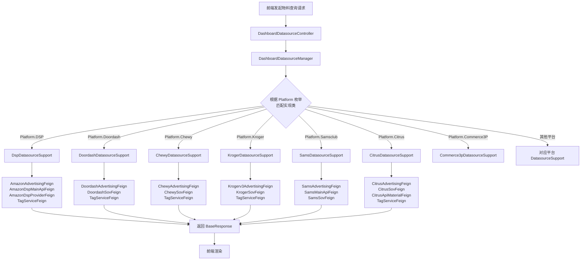
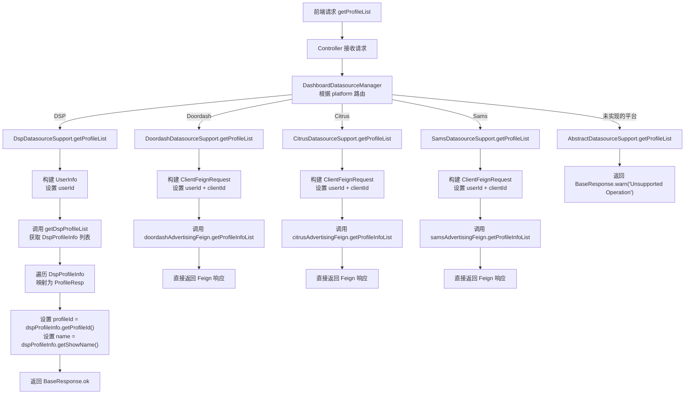
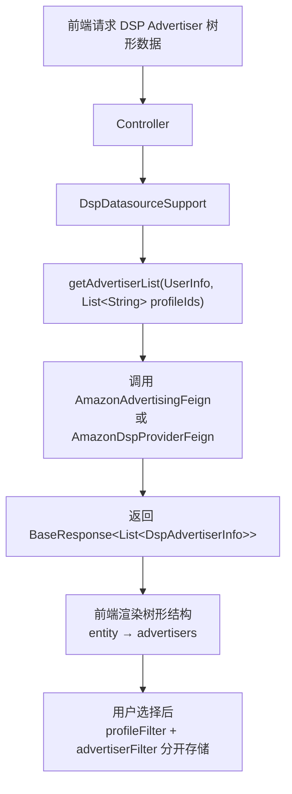
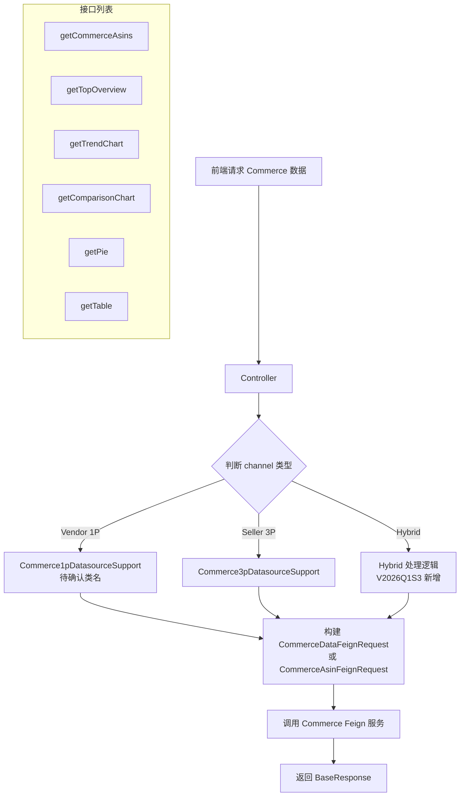
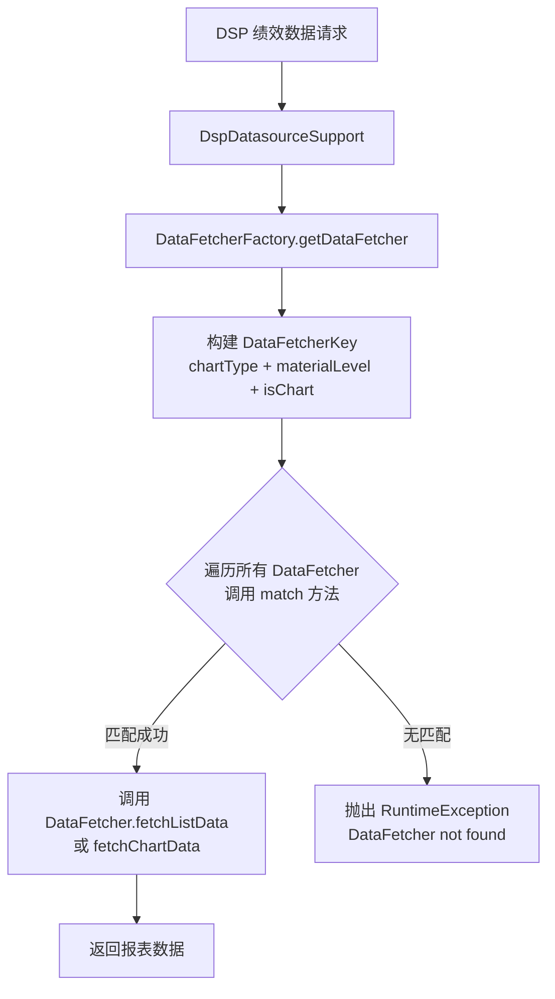

# 数据源路由与物料查询 功能逻辑文档

> 本文档由 document-automation 工具自动生成，基于源代码、PRD 文档和技术评审文档。
> 生成时间: 2026-04-07 16:07:46
> 准确性评分: 未验证/100

---


# 数据源路由与物料查询 功能逻辑文档

## 1. 模块概述

### 1.1 职责与定位

数据源路由与物料查询模块是 Pacvue Custom Dashboard 系统的**数据接入层**，负责为上层图表组件（Trend Chart、Comparison Chart、Top Overview、Table、Pie Chart 等）提供统一的、跨平台的物料数据访问能力。

该模块的核心职责包括：

1. **平台路由**：根据请求中的平台标识（Platform 枚举），将数据查询请求路由到对应平台的实现类。
2. **物料查询**：提供 Profile 列表、Advertiser 列表、Campaign 列表、ASIN/Item/Product 列表、SOV/Keyword 数据、Campaign Tag 等物料数据的统一查询契约。
3. **兜底保护**：通过抽象基类 `AbstractDatasourceSupport` 为所有接口方法提供默认的 `Unsupported Operation` 返回，确保新平台接入时不会因未实现某个方法而导致运行时异常。
4. **下游服务聚合**：各平台实现类通过 Feign 客户端调用各自的下游广告服务、SOV 服务、标签服务等，将分散的微服务数据聚合为统一的响应格式。

### 1.2 系统架构位置

```
┌─────────────────────────────────────────────────────────────┐
│                     前端 (Vue)                               │
│  Cross Retailer Custom Dashboard / Report Custom Dashboard  │
│  ┌──────────┐ ┌──────────┐ ┌──────────┐ ┌──────┐ ┌──────┐  │
│  │TrendChart│ │Comparison│ │TopOverview│ │Table │ │ Pie  │  │
│  └────┬─────┘ └────┬─────┘ └────┬──────┘ └──┬───┘ └──┬───┘  │
└───────┼────────────┼────────────┼───────────┼────────┼──────┘
        │            │            │           │        │
        ▼            ▼            ▼           ▼        ▼
┌─────────────────────────────────────────────────────────────┐
│              Controller 层 (DashboardDatasourceController)   │
│   /data/getASINList, /data/getProfileList, /data/getItemList│
│   /data/getProductList, /data/getCommerceAsin, ...          │
└──────────────────────────┬──────────────────────────────────┘
                           │
                           ▼
┌─────────────────────────────────────────────────────────────┐
│           DashboardDatasourceManager (路由层)                 │
│   根据 Platform 枚举匹配对应 PlatformDatasourceSupport 实现   │
└──────────────────────────┬──────────────────────────────────┘
                           │
        ┌──────────┬───────┼───────┬──────────┬────────┐
        ▼          ▼       ▼       ▼          ▼        ▼
   ┌────────┐ ┌────────┐┌──────┐┌───────┐┌───────┐┌────────┐
   │  DSP   │ │Doordash││Chewy ││Kroger ││ Sams  ││Citrus  │
   │Support │ │Support ││Support││Support││Support││Support │
   └───┬────┘ └───┬────┘└──┬───┘└───┬───┘└───┬───┘└───┬────┘
       │          │        │        │        │        │
       ▼          ▼        ▼        ▼        ▼        ▼
   ┌────────────────────────────────────────────────────────┐
   │              Feign 客户端层                              │
   │  AmazonAdvertisingFeign, DoordashAdvertisingFeign,     │
   │  ChewyAdvertisingFeign, KrogerAdvertisingFeign,        │
   │  SamsAdvertisingFeign, CitrusAdvertisingFeign,         │
   │  TagServiceFeign, *SovFeign, ...                       │
   └────────────────────────────────────────────────────────┘
```

### 1.3 涉及的后端模块

| 模块 | 说明 |
|------|------|
| `custom-dashboard-api` | 主服务模块，包含 Controller、Manager、Support 等核心代码 |

### 1.4 核心包路径

| 包路径 | 说明 |
|--------|------|
| `com.pacvue.api.manager` | `PlatformDatasourceSupport` 接口、`AbstractDatasourceSupport` 抽象基类、`DashboardDatasourceManager`（待确认） |
| `com.pacvue.api.manager.support` | 各平台实现类（`DspDatasourceSupport`、`DoordashDatasourceSupport`、`ChewyDatasourceSupport`、`KrogerDatasourceSupport`、`SamsDatasourceSupport`、`CitrusDatasourceSupport`、`Commerce3pDatasourceSupport` 等） |
| `com.pacvue.api.controller` | `DashboardDatasourceController`（待确认具体代码） |
| `com.pacvue.api.dto.request.data` | 请求 DTO（`ClientRequest`、`AsinRequest`、`CampaignRequest`、`CommerceAsinRequest`、`CommerceDataRequest` 等） |
| `com.pacvue.feign.dto.response` | 响应 DTO（`ProfileResp`、`CampaignResp`、`TagTreeInfo` 等） |
| `com.pacvue.feign.dto.response.dsp` | DSP 专用响应 DTO（`DspProfileInfo`、`DspAdvertiserInfo` 等） |
| `com.pacvue.base.enums.core` | `Platform` 枚举 |

### 1.5 涉及的前端组件

| 组件 | 说明 |
|------|------|
| Cross Retailer Custom Dashboard 入口 | Pacvue HQ 模块下 + Report 模块下双入口 |
| Trend Chart（趋势图组件） | 支持 Single Metric / Multiple Metric / Customized Combination 三种模式 |
| Comparison Chart（对比图组件） | 支持 by sum / YOY / POP 等多种对比模式 |
| Top Overview（概览图组件） | 概览数据展示 |
| Table（表格组件） | 支持 Customize 和 Top xxx 两种模式 |
| Pie Chart（饼图组件） | 支持 Customize 和 Top xxx 两种模式 |
| DSP Advertiser 树形筛选组件 | entity → advertisers 二级菜单 |
| Filter 组件（Setting Filter） | Dashboard 级别的全局筛选 |

### 1.6 Maven 坐标与部署方式

**待确认**。根据代码结构推断，`custom-dashboard-api` 为 Spring Boot 微服务，通过 Spring Cloud 注册到服务中心，Feign 客户端通过服务发现调用下游平台服务。

---

## 2. 用户视角

### 2.1 功能场景

#### 场景一：创建/编辑 Dashboard 图表时选择物料

用户在 Custom Dashboard 中创建或编辑图表（如 Trend Chart、Table 等）时，需要选择数据的物料层级（Material Level）和具体物料值。系统根据用户所选的平台（Retailer），动态加载该平台下可用的物料数据：

- **Profile 列表**：用户选择广告账户（Profile）
- **Campaign 列表**：用户选择广告活动
- **Campaign Tag 列表**：用户选择广告活动标签
- **ASIN/Item/Product 列表**：用户选择商品
- **SOV Group / Keyword 列表**：用户选择 SOV 相关物料
- **Advertiser 列表**（DSP 专用）：用户选择广告主

#### 场景二：Dashboard Filter 中搜索物料

用户在 Dashboard 的 Setting Filter 中，通过搜索框搜索 ASIN/Item/Product 等物料。不同平台调用不同的接口：

| 平台 | 物料名称 | 接口 |
|------|----------|------|
| Amazon | ASIN | `/data/getASINList` |
| DSP | ASIN | `/data/getASINList` |
| Walmart | Item | `/data/getItemList` |
| Samsclub | Item | `/data/getItemList` |
| Instacart | InstacartProduct | `/data/getProductList` |
| Criteo | Product | `/data/getProductList` |
| Target | Product | `/data/getProductList` |
| Citrus | CitrusProduct | `/data/getProductList` |
| Kroger | Product | `/data/getProductList` |
| Chewy | Product | `/data/getProductList` |
| Bol | Product | `/data/getProductList` |
| Doordash | Product | `/data/getProductList` |
| Commerce | CommerceMarketASIN | `/data/getCommerceAsin` |

#### 场景三：DSP 平台的 Advertiser 层级筛选

DSP 平台的 Profile 展示采用 **entity → advertisers** 二级菜单方式。用户在筛选时：
1. 先看到 entity 列表
2. 展开后看到该 entity 下的 advertisers 列表
3. 存储时 `profileFilter` 和 `advertiserFilter` 分开存储
4. 树形结构数据通过 `getDspAdvertiserTreeInfo` 接口获取

#### 场景四：Commerce 数据源查询

Commerce 数据源支持三种 channel 模式：
- **Vendor**（1P）：卖家直供模式
- **Seller**（3P）：第三方卖家模式
- **Hybrid**：混合模式（V2026Q1S3 新增）

物料接口统一移除 `is3p` 字段，改为 `channel` 字段区分 Vendor、Seller、Hybrid。

#### 场景五：Cross Retailer 图表

Cross Retailer 作为一种特殊的 Material Level，允许用户在一个图表中展示多个平台的数据：
- Table 中每一行是一个 Retailer
- Trend Chart 中每一根线是一个 Retailer（或多个 Retailer 的数据总和）

### 2.2 用户操作流程

```
用户打开 Custom Dashboard
    │
    ├─ 从 Pacvue HQ 模块进入 Cross Retailer Custom Dashboard
    │
    └─ 从 Report 模块进入 Custom Dashboard
         │
         ▼
    选择/创建 Dashboard
         │
         ▼
    添加/编辑图表 (Chart)
         │
         ├─ 选择图表类型 (Trend/Comparison/TopOverview/Table/Pie)
         │
         ├─ 选择平台 (Amazon/DSP/Walmart/Instacart/Chewy/Doordash/...)
         │
         ├─ 选择 Material Level (Profile/Campaign/ASIN/SOV Group/...)
         │     │
         │     └─ 系统调用对应平台的物料查询接口加载可选物料
         │           │
         │           ├─ getProfileList → 加载 Profile 列表
         │           ├─ getCampaignList → 加载 Campaign 列表
         │           ├─ getASINList/getItemList/getProductList → 加载商品列表
         │           ├─ getKeywordList → 加载关键词列表
         │           └─ getSovMarketList → 加载 SOV 市场列表
         │
         ├─ 选择具体物料值
         │
         ├─ 选择指标 (Metrics)
         │
         └─ 保存图表配置
              │
              ▼
         Dashboard 渲染图表
              │
              └─ 调用绩效数据接口 (getTopOverview/getTrendChart/getComparisonChart/getPie/getTable)
```

### 2.3 UI 交互要点

1. **物料搜索**：Filter 搜索框支持多 ASIN/Item/Product 查询（V2025Q3S4 新增），用户可以粘贴多个商品标识进行批量搜索。
2. **DSP Advertiser 树形选择**：DSP 平台的 Profile 筛选采用二级树形菜单，第一级为 entity，第二级为 advertisers。
3. **Commerce Channel 切换**：Commerce 数据源通过 `channel` 字段区分 Vendor/Seller/Hybrid，前端需要在物料接口中传递该字段。
4. **物料分类**：
   - **单一物料**：Profile、Campaign Tag、Keyword、ASIN 等，本身即可确定数据范围
   - **复合物料**：SOV ASIN + SOV Group、SOV Brand + SOV Brand，需要额外框定数据范围
   - **不固定物料**：Filter-linked Campaign、Ad Type，始终跟随 Dashboard Filter 查询

---

## 3. 核心 API

### 3.1 物料查询接口

以下接口由 `DashboardDatasourceController`（待确认具体代码）暴露，前端通过这些接口获取各平台的物料数据。

| 接口路径 | HTTP 方法 | 说明 | 适用平台 |
|----------|-----------|------|----------|
| `/data/getProfileList` | POST（待确认） | 获取 Profile 列表 | 全平台 |
| `/data/getASINList` | POST（待确认） | 获取 ASIN 列表 | Amazon、DSP |
| `/data/getItemList` | POST（待确认） | 获取 Item 列表 | Walmart、Samsclub |
| `/data/getProductList` | POST（待确认） | 获取 Product 列表 | Instacart、Criteo、Target、Citrus、Kroger、Chewy、Bol、Doordash |
| `/data/getCommerceAsin` | POST（待确认） | 获取 Commerce ASIN 列表 | Commerce |
| `/data/getCampaignList` | POST（待确认） | 获取 Campaign 列表 | 全平台 |
| `/data/getCampaignTagList` | POST（待确认） | 获取 Campaign Tag 列表 | 全平台 |
| `/data/getKeywordList` | POST（待确认） | 获取 Keyword 列表 | 支持 SOV 的平台 |
| `/data/getSovMarketList` | POST（待确认） | 获取 SOV 市场列表 | 支持 SOV 的平台 |
| `/data/getAdvertiserList` | POST（待确认） | 获取 Advertiser 列表 | DSP |
| `/data/getDspAdvertiserTreeInfo` | POST（待确认） | 获取 DSP Advertiser 树形结构 | DSP |

### 3.2 绩效数据接口

以下接口用于图表渲染时获取绩效数据，内部也会依赖数据源路由机制：

| 接口路径 | HTTP 方法 | 说明 |
|----------|-----------|------|
| `/report/customDashboard/getTopOverview` | POST（待确认） | 获取 Top Overview 数据 |
| `/report/customDashboard/getTrendChart` | POST（待确认） | 获取趋势图数据 |
| `/report/customDashboard/getComparisonChart` | POST（待确认） | 获取对比图数据 |
| `/report/customDashboard/getPie` | POST（待确认） | 获取饼图数据 |
| `/report/customDashboard/getTable` | POST（待确认） | 获取表格数据 |
| `/report/customDashboard/getCommerceAsins` | POST（待确认） | 获取 Commerce ASIN 数据 |

### 3.3 请求/响应示例

#### getProfileList 请求（以 DSP 为例）

**请求 DTO：`ClientRequest`**
```json
{
  "userId": 12345,
  "clientId": 67890,
  "platform": "DSP"
}
```

**响应 DTO：`BaseResponse<List<ProfileResp>>`**
```json
{
  "code": 200,
  "message": "success",
  "data": [
    {
      "profileId": "ENTITY_ABC123",
      "name": "Entity ABC - US"
    },
    {
      "profileId": "ENTITY_DEF456",
      "name": "Entity DEF - UK"
    }
  ]
}
```

#### getProfileList 请求（以 Doordash/Citrus/Sams 为例）

这些平台使用 `ClientFeignRequest` 转发到下游 Feign 服务：
```json
{
  "userId": 12345,
  "clientId": 67890
}
```

---

## 4. 核心业务流程

### 4.1 数据源路由流程

#### 4.1.1 整体路由流程



#### 4.1.2 路由匹配机制

`DashboardDatasourceManager`（待确认具体代码）采用**策略模式**进行路由。其核心逻辑推断如下：

1. Spring 容器启动时，所有 `PlatformDatasourceSupport` 实现类（标注了 `@Component`）被自动注入到 `DashboardDatasourceManager` 中（通过 `List<PlatformDatasourceSupport>` 注入）。
2. 当收到请求时，`DashboardDatasourceManager` 遍历所有实现类，调用 `platform()` 方法匹配请求中的平台标识。
3. 匹配成功后，调用对应实现类的具体方法（如 `getProfileList`、`getAsinList` 等）。
4. 如果某个平台未实现某个方法，`AbstractDatasourceSupport` 的默认实现会返回 `BaseResponse.warn("Unsupported Operation")`。

### 4.2 Profile 查询流程



**关键差异说明**：

- **DSP 平台**：Profile 查询逻辑较为特殊，先通过内部方法 `getDspProfileList` 获取 `DspProfileInfo` 列表，然后手动映射为统一的 `ProfileResp`。映射时使用 `getShowName()` 作为显示名称。
- **Doordash/Citrus/Sams 等平台**：直接构建 `ClientFeignRequest`（包含 `userId` 和 `clientId`），调用对应平台的 Feign 客户端 `getProfileInfoList` 方法，Feign 服务直接返回 `BaseResponse<List<ProfileResp>>` 格式。

### 4.3 DSP Advertiser 查询流程



**存储说明**：
- DSP 平台的筛选结果分为两部分存储：`profileFilter`（Profile/Entity 级别）和 `advertiserFilter`（Advertiser 级别）
- 绩效查询时新增 `productLineAdvertisers` 字段传递选中的 Advertiser 信息

### 4.4 Commerce 数据查询流程



**Commerce 数据源演进**：
1. **V2025Q3S2**：支持 Commerce 1P 和 3P 数据源，对接 getTopOverview、getTrendChart（除 single 模式）、getComparisonChart、getPie、getTable、getCommerceAsins 六个接口
2. **V2026Q1S3**：新增 Hybrid 数据源支持，物料接口统一移除 `is3p` 字段，改为 `channel` 字段（Vendor/Seller/Hybrid），同时新增 `chartId` 字段作为接口入参

### 4.5 DSP 报表数据获取路由（DataFetcherFactory）

DSP 平台的绩效数据获取引入了额外的策略路由层——`DataFetcherFactory`，用于根据图表类型和物料层级进一步匹配数据获取策略。



**DataFetcher 接口定义**（来自技术评审文档）：
```java
public interface DataFetcher {
    boolean match(DataFetcherKey key);
    List fetchListData(DSPReportParam param);
    List fetchChartData(DSPReportParam param);
}
```

**DataFetcherFactory 工厂逻辑**：
```java
@Component
public class DataFetcherFactory {
    private final List<DataFetcher> dataFetchers;
    
    public DataFetcherFactory(List<DataFetcher> dataFetchers) {
        this.dataFetchers = dataFetchers;
    }
    
    public DataFetcher getDataFetcher(DspReportRequest request) {
        DataFetcherKey key = new DataFetcherKey(
            request.getChartType(), 
            request.getMaterialLevel(), 
            DspReportHelper.isChart(request)
        );
        return dataFetchers.stream()
                .filter(df -> df.match(key))
                .findFirst()
                .orElseThrow(() -> new RuntimeException(
                    "DataFetcher not found for key: " + key));
    }
}
```

**DataFetcherKey 维度**：
- `chartType`：图表类型（Trend/Comparison/TopOverview/Table/Pie 等）
- `materialLevel`：物料层级（Profile/Campaign/ASIN 等）
- `isChart`：是否为图表请求（区分图表数据和列表数据）

### 4.6 设计模式详解

#### 4.6.1 策略模式

**核心结构**：

```
PlatformDatasourceSupport (接口/策略契约)
    │
    ├── platform() : Platform          ← 

---

*本文档由 AI 自动生成，如有不准确之处请以源代码为准。标注"待确认"的内容需要人工核实。*