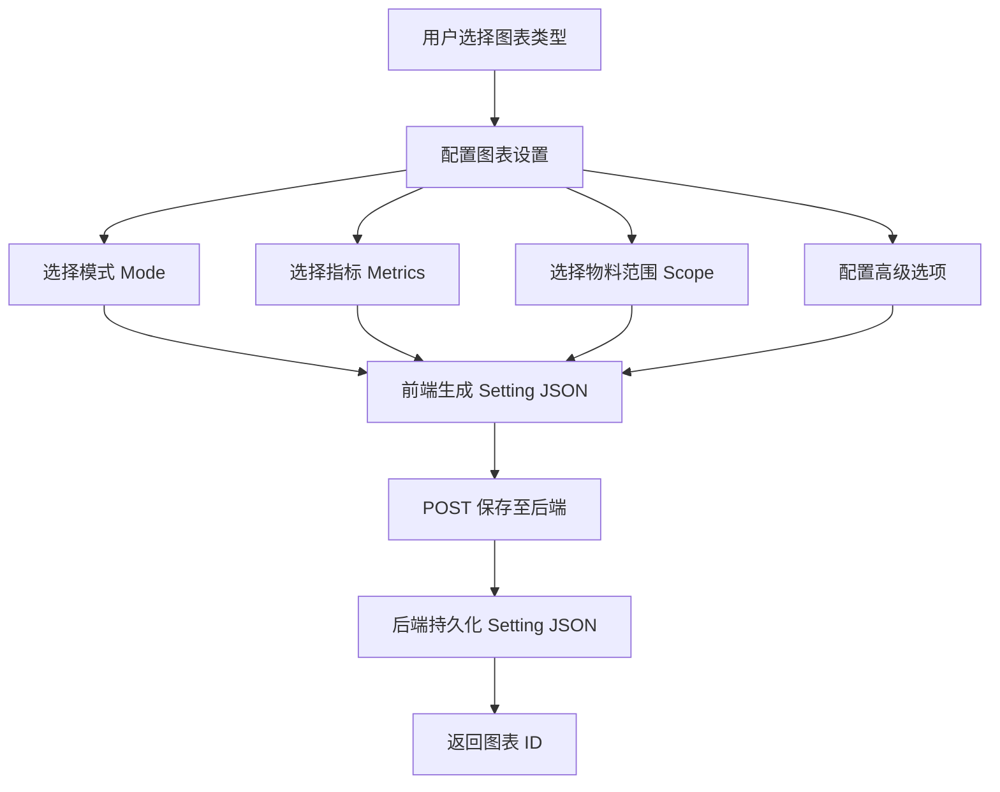
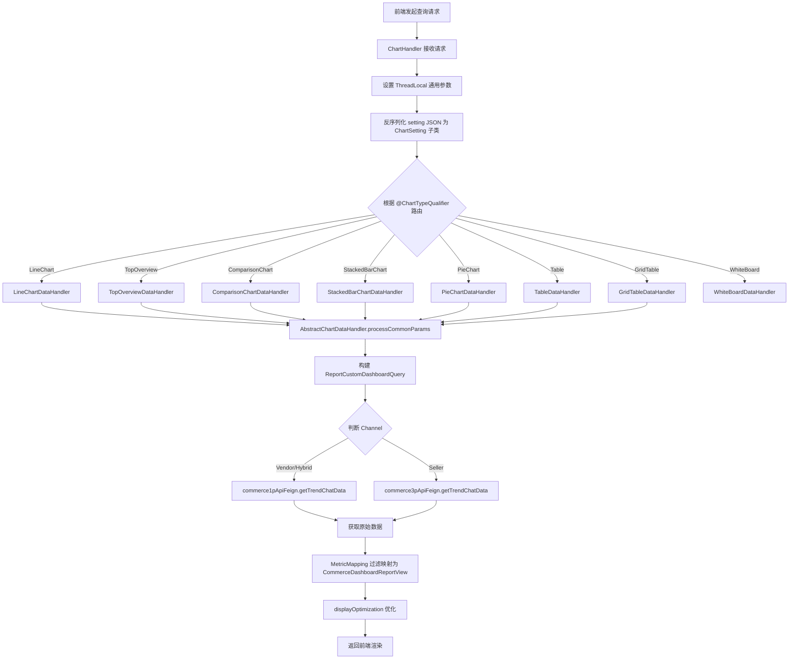
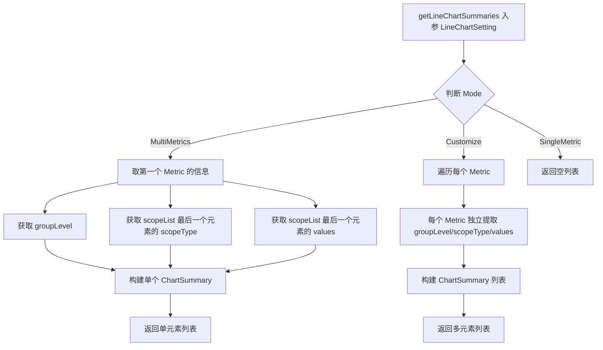

# 图表类型详解 功能逻辑文档

> 本文档由 document-automation 工具自动生成，基于源代码、PRD 文档和技术评审文档。
> 生成时间: 2026-04-07 16:11:32
> 准确性评分: 未验证/100

---


# 图表类型详解 功能逻辑文档

## 1. 模块概述

### 1.1 职责与定位

本模块是 Pacvue Custom Dashboard 系统的**图表类型核心层**，负责定义和管理所有支持的图表类型的 Setting 数据结构、数据查询逻辑和渲染处理流程。系统共支持 **8 种图表类型**：

| 图表类型 | 枚举值 | 说明 |
|---------|--------|------|
| TrendChart | `ChartType.LineChart` | 趋势折线图，支持三种模式 |
| TopOverview | `ChartType.TopOverview` | 概览卡片，支持三种展示格式 |
| ComparisonChart | `ChartType.ComparisonChart` | 对比图（原 BarChart 改名） |
| StackedBarChart | `ChartType.StackedBarChart` | 堆叠柱状图 |
| PieChart | `ChartType.PieChart` | 饼图 |
| Table | `ChartType.Table` | 表格 |
| GridTable | `ChartType.GridTable` | 二维交叉表格（25Q2 Sprint3 新增） |
| WhiteBoard | `ChartType.WhiteBoard` | 白板（自由文本/图片） |

本模块的核心职责：
1. **Setting 结构定义**：每种图表类型对应一个 `ChartSetting` 实现类，描述该图表的配置信息（指标、物料范围、模式等）
2. **Setting 反序列化**：`ChartHandler` 根据请求参数将 JSON 反序列化为对应的 `ChartSetting` 子类
3. **数据查询与处理**：通过 `@ChartTypeQualifier` 注解路由到对应的 `ChartDataHandler` 实现类，完成参数构建、下游服务调用和数据转换
4. **图表摘要提取**：`ChartServiceImpl` 中根据各图表 Setting 提取 `ChartSummary`，用于生成图表提示文案（Chart Tips）

### 1.2 系统架构位置

```
┌─────────────────────────────────────────────────────────┐
│                    Frontend (Vue)                        │
│  TrendChart / TopOverview / ComparisonChart / ...        │
└──────────────────────┬──────────────────────────────────┘
                       │ REST API (queryChart)
┌──────────────────────▼──────────────────────────────────┐
│              ChartHandler (Controller 层)                │
│  - ThreadLocal 设置通用参数                               │
│  - 反序列化 setting JSON → ChartSetting 子类              │
└──────────────────────┬──────────────────────────────────┘
                       │
┌──────────────────────▼──────────────────────────────────┐
│           ChartServiceImpl (Service 层)                  │
│  - getLineChartSummaries / getBarChartSummaries 等       │
│  - 图表摘要提取、Tips 生成                                │
└──────────────────────┬──────────────────────────────────┘
                       │ @ChartTypeQualifier 路由
┌──────────────────────▼──────────────────────────────────┐
│         ChartDataHandler 体系 (Strategy 层)              │
│  AbstractChartDataHandler                                │
│    ├── LineChartDataHandler (@ChartType.LineChart)       │
│    ├── TopOverviewDataHandler (@ChartType.TopOverview)   │
│    ├── ComparisonChartDataHandler                        │
│    ├── StackedBarChartDataHandler                        │
│    ├── PieChartDataHandler                               │
│    ├── TableDataHandler                                  │
│    ├── GridTableDataHandler                              │
│    └── WhiteBoardDataHandler (待确认)                     │
└──────────────────────┬──────────────────────────────────┘
                       │ Feign 调用
┌──────────────────────▼──────────────────────────────────┐
│          Commerce 数据服务                                │
│  commerce1pApiFeign (Vendor/Hybrid)                      │
│  commerce3pApiFeign (Seller)                             │
└─────────────────────────────────────────────────────────┘
```

### 1.3 涉及的后端模块与前端组件

**后端模块：**
- `custom-dashboard-base`：包含所有 ChartSetting 定义类、枚举、DTO
- `custom-dashboard-api`：包含 Controller、Service、ChartDataHandler 实现

**后端核心包：**
- `com.pacvue.base.dto`：ChartSetting、BasicInfo、Metric、MetricScope 等数据结构

**前端目录：**
- `dashboardSub`：各图表子组件
- `components`：通用图表组件

**前端组件：**
- TrendChart（LineChart）
- TopOverview
- ComparisonChart
- StackedBarChart
- PieChart
- Table
- GridTable
- WhiteBoard

### 1.4 Maven 坐标与部署方式

> **待确认**：具体 Maven groupId/artifactId 和部署方式需查阅项目 pom.xml。根据模块命名推测为 `com.pacvue:custom-dashboard-base` 和 `com.pacvue:custom-dashboard-api`。

---

## 2. 用户视角

### 2.1 功能场景总览

Custom Dashboard 允许用户创建自定义仪表盘，在仪表盘中添加各种类型的图表来可视化广告和零售数据。用户可以：

1. **选择图表类型**：从 8 种图表类型中选择
2. **配置图表设置**：选择指标（Metrics）、物料范围（Scope）、展示模式（Mode）等
3. **查看图表数据**：系统根据 Setting 查询数据并渲染
4. **交互操作**：如 TrendChart 的 D/W/M 快捷切换、Table 的自定义排序等

### 2.2 各图表类型用户操作流程

#### 2.2.1 TrendChart（趋势图）

**三种模式：**

| 模式 | 枚举值 | 说明 |
|------|--------|------|
| Single Metric | `SingleMetric` | 单指标，按物料维度拆分多条线 |
| Multiple Metrics | `MultiMetrics` | 多指标，共享同一物料范围，每个指标一条线 |
| Customize | `Customize` | 自定义组合，每条线独立配置指标和物料 |

**用户操作流程：**
1. 选择模式（Single Metric / Multiple Metrics / Customize）
2. 配置指标和物料范围
3. 可选开启 "Show Quick Switch"（D/W/M 时间粒度快捷切换）
4. 保存后，图表根据 `basic.timeSegment` 决定默认时间粒度
5. 查看时可通过 D/W/M 按钮切换时间粒度

**Filter-linked Campaign 支持：** 仅 Multiple Metrics 模式支持选择 Filter-linked Campaign 作为物料层级。

**Quick Switch（D/W/M）交互要点：**
- 开启后 `quickSwitchOn=true`，前端根据 `basic.timeSegment` 决定默认显示值
- 查询接口中不新增字段，入参 setting 中 `basic.timeSegment` 决定查询方式，回参中也包含相应的 `timeSegment`
- **限制**：Commerce 数据源为 SnS 时，不允许勾选 Show Quick Switch（因为 SnS 数据源已默认 W/M）

#### 2.2.2 TopOverview（概览卡片）

**三种展示格式（chartFormat）：**

| 格式 | 说明 | 联动 FilterLinked 时间 | 联动 Customize 时间 | 对比期 | 可选将来时间 | 可选指标 |
|------|------|----------------------|---------------------|--------|------------|---------|
| Regular | 常规展示 | ✅ | ✅ | 可选 POP/YOY | ❌ | 全部 |
| TargetProgress | 目标进度条 | ❌ | ✅ | 仅当期值 | ✅ | 数字+货币 |
| TargetCompare | 目标对比 | ✅ | ✅ | 仅当期值 | ❌ | 百分比 |

**TargetCompare 颜色规则：**

| 指标种类 | 具体指标 | 🟥 危险 | 🟧 警告 | 🟩 安全 | ⬜ 中性 |
|---------|---------|---------|---------|---------|---------|
| 正向 | 其他全部 | ≤80 | 80<X<100 | ≥100 | — |
| 反向 | CPC/CPM/CPA/ACOS/Price/Position后缀 | ≥120 | 100<X<120 | ≤100 | — |
| 中性 | Impressions/Spend/ASP/COGS | — | — | — | 全部 |

**默认名称：** 创建时如果未指定名称，系统自动为前三个 section 设置默认名称：Performance、Efficiency、Awareness。

**Filter-linked Campaign 支持：** 支持。

#### 2.2.3 ComparisonChart（对比图）

原名 BarChart，V1.2 版本改名为 Comparison Chart，允许用户将指标设置为柱子或折线。

**支持的模式：**
- By Sum：按汇总对比
- YOY Multi xxx / YOY Multi Metrics / YOY Multi Period：同比对比
- POP Multi xxx / POP Multi Metrics：环比对比

**Filter-linked Campaign 支持：** 暂不支持。

#### 2.2.4 StackedBarChart（堆叠柱状图）

**支持的模式：**
- By Trend：按时间趋势堆叠
- By Sum：按汇总堆叠

Metric 结构与 LineChart 完全一致（scope 是 `List<MetricScope>`，每个 MetricScope 含 scopeType + values）。

**Filter-linked Campaign 支持：** 暂不支持。

#### 2.2.5 PieChart（饼图）

**支持的模式：**
- Customize：自定义选择物料
- Top xxx：按指标排序取 Top N

**Filter-linked Campaign 支持：** 暂不支持。

#### 2.2.6 Table（表格）

**支持的模式：**
- Customize：自定义选择物料
- Top xxx：按指标排序取 Top N

**特殊功能：**
- V2.6 新增字段自定义排序
- Setting 中含 `keywordFilter` 扩展（与 scope 平级，`List<Object>` 类型，兼容小平台 keyword 有 id/name 的情况）

**Filter-linked Campaign 支持：** 暂不支持。

#### 2.2.7 GridTable（二维交叉表格）

**25Q2 Sprint3 新增**，解决用户查看二维交叉数据的需求（如各 Brand 在各 Retailer 下的 Sales）。

**创建步骤：**
1. 选择指标（仅单选，支持 Cross Retailer 指标）
2. 选择横向物料层级（Profile / Campaign Parent Tag / Campaign Tag / Campaign Type / Retailer / Share Tag）
3. 根据横向物料层级选择纵向物料层级（有兼容性限制，见下表）
4. 高级配置：Add Total Row、Add % of Total（仅纯数值指标支持，比率类指标如 ROAS/CPC/CVR 不支持）

**横向/纵向物料兼容矩阵：**

| 纵向 \ 横向 | Profile | Campaign (Parent) Tag | Campaign Type | Retailer | Share Tag |
|-------------|---------|----------------------|---------------|----------|-----------|
| Profile | ❌ | ✅ | ✅ | ❌ | ✅ |
| Campaign (Parent) Tag | ✅ | ✅ | ✅ | ❌ | ✅ |
| Campaign Type | ✅ | ✅ | ❌ | ❌ | ✅ |
| Retailer | ❌ | ❌ | ❌ | ❌ | ✅ |
| Share Tag | ✅ | ✅ | ✅ | ✅ | ❌ |

**限制：**
- 不支持 Filter 功能（`StackedBar / GridTable 不支持`）
- 不支持批量选择 Chart 创建 Dashboard
- 创建模板时只需选择横向/纵向物料层级，不需选择具体范围

#### 2.2.8 WhiteBoard（白板）

自由文本/图片展示，无数据查询逻辑。除 WhiteBoard 和 Stacked Bar Chart 以外的所有 Chart 在 V1.2 中都进行了 DSP 数据源改造。

### 2.3 Chart Tips 文案规则

系统根据图表类型和模式自动生成提示文案，帮助用户理解图表含义：

| 图表及类型 | Tips 模板 | 示例 |
|-----------|----------|------|
| Trend Chart - Single Metric | The {指标} for each {物料层级} individually | The Impression for each campaign tag individually |
| Trend Chart - Multiple Metric | The {指标列表} for the combined data of N {物料层级}, including {物料枚举} | The ROAS, sales, and spend for the combined data of 3 profiles, including profile A, profile B, and profile C |
| Trend Chart - Customized | Line N: The {指标} for the combined data of N {物料层级}, including {物料枚举} | Line 1: The Impression for the combined data of 3 profiles, including profile A, profile B, and profile C |
| Comparison Chart - by sum | The {指标列表} for each {物料层级} individually | The ROAS, sales, and spend for each profile individually |
| Stacked Bar Chart - by trend | The {指标} for N {物料层级}, including {物料枚举} | The spend for 3 profiles, including profile A, profile B, and profile C |
| Stacked Bar Chart - by sum | The {指标} for each {物料层级} individually | The spend for each campaign tag individually |
| Pie Chart - customize | The proportion of the selected {物料层级}. | The proportion of the selected profiles. |
| Pie Chart - Top xxx | Top N ranked {物料} sort by {指标} in {范围} | Top 5 ranked ASINs sort by Impression in Profile AAA |
| GridTable | The {指标} at the intersection of each {横向物料} and {纵向物料} | The Sales at the intersection of each retailer and brand |

> **SOV Group 特殊处理**：如果涉及 SOV Group，Brand 和 ASIN 按正常物料显示，最后补充 "within SOV Group AAA->Sub AAA, BBB->Sub BBB"，多选的 SOV Group 都列出。

---

## 3. 核心 API

### 3.1 图表数据查询接口

> **待确认**：具体 Controller 类名和路径需查阅代码。根据骨架信息推测如下：

| 方法 | 路径 | 说明 |
|------|------|------|
| POST | `/api/custom-dashboard/chart/query`（待确认） | 查询图表数据 |

**请求参数：**

```json
{
  "chartType": "LineChart",
  "setting": {
    "basic": {
      "crossRetailer": false,
      "mode": "MultiMetrics",
      "timeSegment": "D",
      "quickSwitchOn": true,
      "chartFormat": "Regular",
      "groupLevel": "Amazon"
    },
    "metrics": [
      {
        "groupLevel": "Amazon",
        "scope": [
          {
            "scopeType": "Profile",
            "values": ["profile-id-1", "profile-id-2"]
          }
        ],
        "keywordFilter": [
          { "id": "xxx", "name": "yyy" }
        ],
        "showFilter": true,
        "specifyFilterScope": false,
        "filterScopes": []
      }
    ]
  },
  "dateRange": { "startDate": "2024-01-01", "endDate": "2024-01-31" }
}
```

**关键约定：**
- 入参 setting 中 `basic.timeSegment` 决定查询的时间粒度（D/W/M）
- 回参中也包含相应的 `basic.timeSegment`
- `chartType` 决定 setting JSON 反序列化为哪个 ChartSetting 子类

**返回值：**

对于 TrendChart，返回 `ReportCustomDashboardTrendChartVO` 列表，经转换后为 `CommerceDashboardReportView` 列表。

> **待确认**：各图表类型的具体返回 VO 结构。

### 3.2 前端调用方式

前端根据图表类型组装 setting JSON，通过 POST 请求发送到后端查询接口。查询时：
1. 前端将当前图表的完整 setting（含 basic、metrics、scope 等）序列化为 JSON
2. 如果开启了 Quick Switch，前端修改 `basic.timeSegment` 后重新发起查询
3. 后端返回数据后，前端根据图表类型选择对应的渲染组件

---

## 4. 核心业务流程

### 4.1 图表创建与保存流程



### 4.2 图表数据查询主流程



### 4.3 LineChartDataHandler 详细处理流程

以 `LineChartDataHandler.handleData` 为例，这是代码中最完整的数据处理流程：

```java
@Slf4j
@Component
@ChartTypeQualifier(ChartType.LineChart)
public class LineChartDataHandler extends AbstractChartDataHandler {
    @Override
    public List<CommerceDashboardReportView> handleData(CommerceReportRequest request) {
        // 1. 构建通用查询参数
        ReportCustomDashboardQuery query = processCommonParams(request);
        
        // 2. 根据 Channel 路由到不同的 Feign 客户端
        switch (DashboardConfig.Channel.fromValue(query.getChannel())) {
            case Vendor, Hybrid -> trendChatData = commerce1pApiFeign.getTrendChatData(query);
            case Seller -> trendChatData = commerce3pApiFeign.getTrendChatData(query);
        }
        
        // 3. 空数据检查
        if (trendChatData == null || ObjectUtils.isEmpty(trendChatData.getData())) {
            return Collections.emptyList();
        }
        
        // 4. 指标类型过滤与映射
        Set<MetricType> metricTypeList = MetricMapping.getMetricTypeList(request.getMetricTypeList());
        List<CommerceDashboardReportView> result = data.stream()
            .filter(Objects::nonNull)
            .map(d -> reportToCommerceView(d, metricTypeList))
            .collect(Collectors.toList());
        
        // 5. 展示优化
        displayOptimization(result, request);
        
        return result;
    }
}
```

**处理步骤详解：**

1. **processCommonParams**（模板方法，由 `AbstractChartDataHandler` 提供）：将 `CommerceReportRequest` 转换为 `ReportCustomDashboardQuery`，填充通用参数（时间范围、Channel、指标列表等）
2. **Channel 路由**：根据 `DashboardConfig.Channel` 枚举值（Vendor/Hybrid/Seller）选择调用 1P 或 3P 的 Commerce Feign 接口
3. **数据映射**：通过 `MetricMapping.getMetricTypeList` 获取需要的指标类型集合，然后将 `ReportCustomDashboardTrendChartVO` 转换为统一的 `CommerceDashboardReportView`
4. **displayOptimization**（模板方法）：对结果进行展示优化处理

### 4.4 ChartSummary 提取流程

`ChartServiceImpl` 中的 `getLineChartSummaries` 方法根据图表模式提取摘要信息，用于生成 Chart Tips：



**关键逻辑：**
- **MultiMetrics 模式**：所有 Metric 共享同一物料范围，因此只取第一个 Metric 的 scope 信息，生成一个 ChartSummary
- **Customize 模式**：每个 Metric 独立配置，因此遍历所有 Metric，每个生成一个 ChartSummary
- **SingleMetric 模式**：返回空列表（Tips 由其他方式生成）
- **scopeType 取最后一个**：`scopeList.get(scopeList.size() - 1).getScopeType()`，说明 scope 是层级结构，最后一个是最细粒度

### 4.5 BarChart（ComparisonChart/StackedBarChart）Summary 提取

BarChartSetting 的 `getLineChartSummaries`（方法名复用）逻辑类似但有差异：

- **MultiMetrics 或 MultiPeriods 模式**：取第一个 Metric 的信息，如果 `groupLevel` 为 null 则回退到 `basic.groupLevel`
- **其他模式**：返回空列表

```java
if (groupLevel == null) {
    groupLevel = chartSetting.getBasic().getGroupLevel();
}
```

这说明 BarChart 在某些模式下，Metric 级别的 groupLevel 可能为空，需要从 BasicInfo 中获取。

### 4.6 关键设计模式详解

#### 4.6.1 Visitor 模式

`ChartSetting` 接口定义了 `accept(ChartVisitor<T>)` 方法，各实现类通过双重分派实现类型安全的图表处理：

```java
// ChartSetting 接口
public interface ChartSetting {
    <T> T accept(ChartVisitor<T> visitor);
    ChartType getChartType();
    boolean isCrossRetailer();
    Set<Platform> supportProductLines();
    // ...
}

// LineChartSetting 实现
public <T> T accept(ChartVisitor<T> visitor) {
    return visitor.visit(this);
}
```

`ChartVisitor<T>` 接口为每种 ChartSetting 子类定义一个 `visit` 方法，调用方无需 instanceof 判断即可处理不同图表类型。

#### 4.6.2 Strategy + Qualifier 注解注入

通过自定义注解 `@ChartTypeQualifier` 实现按图表类型的 Bean 选择：

```java
@Component
@ChartTypeQualifier(ChartType.LineChart)
public class LineChartDataHandler extends AbstractChartDataHandler { ... }
```

Spring 容器启动时，所有 `ChartDataHandler` 实现类通过 `@ChartTypeQualifier` 注册，运行时根据请求中的 `chartType` 选择对应的 Handler。

#### 4.6.3 Template Method 模式

`AbstractChartDataHandler` 提供通用模板方法：
- `processCommonParams(CommerceReportRequest)`：构建通用查询参数
- `displayOptimization(List<CommerceDashboardReportView>, CommerceReportRequest)`：展示优化
- `reportToCommerceView(ReportCustomDashboardTrendChartVO, Set<MetricType>)`：数据转换

子类（如 `LineChartDataHandler`）只需实现 `handleData` 方法，调用这些模板方法完成具体逻辑。

---

## 5. 数据模型

### 5.1 数据库表

> **待确认**：图表 setting 持久化表名，可能为 `custom_dashboard_chart` 或类似表。Setting JSON 作为一个字段存储在该表中。

### 5.2 核心类型体系

#### 5.2.1 ChartSetting 接口

```java
public interface ChartSetting {
    /** 是否跨 Retailer */
    boolean isCrossRetailer();
    
    /** 判断单个 metric 是否跨 Retailer（TopOverview 等需要） */
    default boolean isCrossRetailer(Object metric) { ... }
    
    /** 访问者模式分派 */
    <T> T accept(ChartVisitor

---

*本文档由 AI 自动生成，如有不准确之处请以源代码为准。标注"待确认"的内容需要人工核实。*