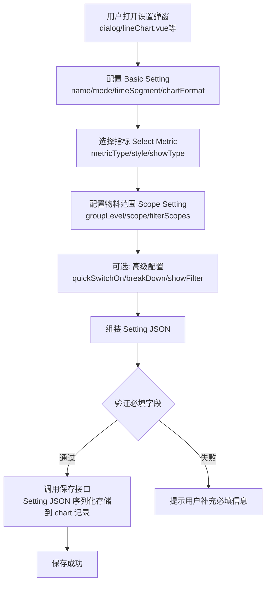
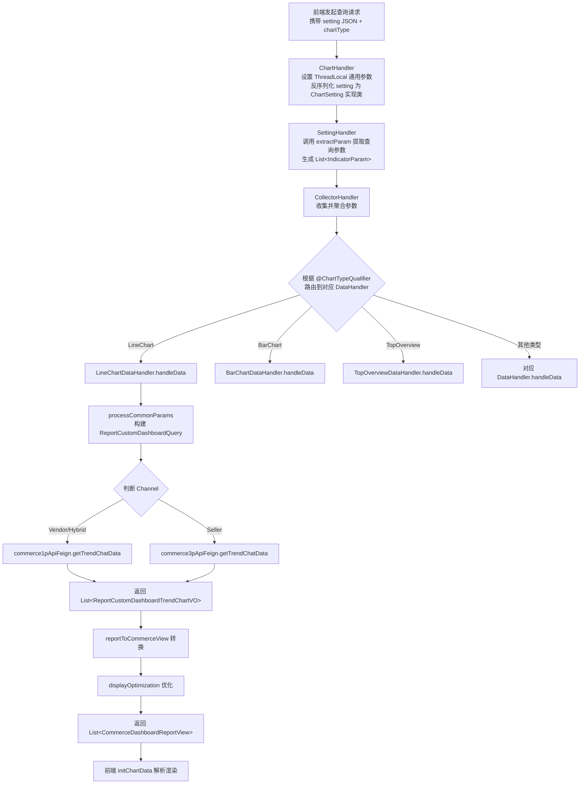
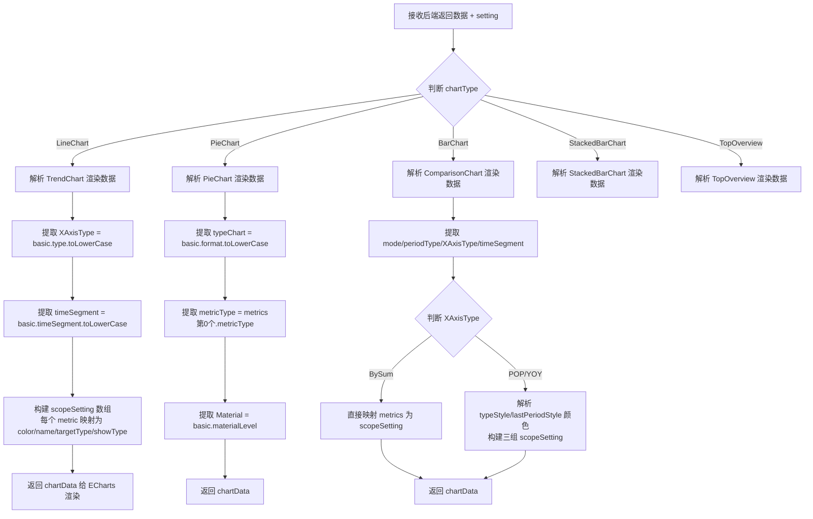
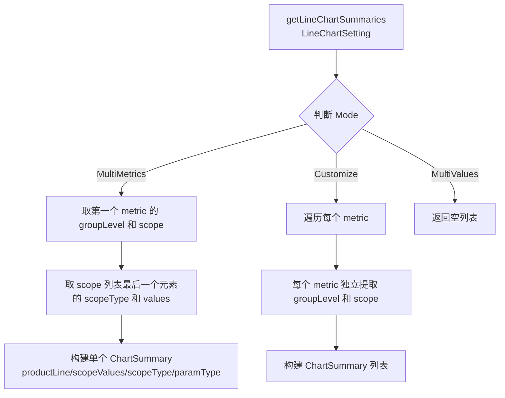

# 图表类型详解 功能逻辑文档

> 本文档由 document-automation 工具自动生成，基于源代码、PRD 文档和技术评审文档。
> 生成时间: 2026-04-09 10:09:48
> 准确性评分: 未验证/100

---


# 图表类型详解 功能逻辑文档

## 1. 模块概述

### 1.1 模块职责与定位

图表类型详解模块是 Pacvue Custom Dashboard 系统的核心渲染引擎层，负责定义、存储、解析和渲染八种图表类型的配置与数据。这八种图表类型分别为：

| 图表类型 | 枚举值 | 主要用途 |
|---|---|---|
| TrendChart | `ChartType.LineChart` | 展示指标随时间变化的趋势折线/面积图 |
| TopOverview | `ChartType.TopOverview` | 展示关键指标的汇总数值卡片（支持 Regular/TargetProgress/TargetCompare 三种格式） |
| ComparisonChart | `ChartType.BarChart` | 对比不同物料/时间段的指标柱状图（支持 BySum/YOY/POP 模式） |
| StackedBarChart | `ChartType.StackedBarChart` | 堆叠柱状图，按 breakDown 维度拆分指标 |
| PieChart | `ChartType.PieChart` | 饼图/环形图，展示指标占比分布 |
| Table | **待确认**（可能为 `ChartType.Table`） | 表格形式展示多指标数据 |
| GridTable | **待确认**（可能为 `ChartType.GridTable`） | 二维交叉表格，行列均为物料维度 |
| WhiteBoard | **待确认** | 白板/自由画布类型 |

本模块的核心职责包括：

1. **Setting 数据结构定义**：每种图表类型对应一个 `ChartSetting` 实现类（如 `LineChartSetting`、`TopOverviewSetting`、`BarChartSetting` 等），封装该图表的全部配置信息。
2. **序列化/反序列化**：Setting 以 JSON 形式随 chart 记录持久化存储，查询时由 `ChartHandler` 反序列化为对应的 Java 对象。
3. **参数提取与路由**：通过 Visitor 模式和 `@ChartTypeQualifier` 注解，将不同图表类型的查询请求路由到对应的 `DataHandler`。
4. **前端渲染初始化**：前端 `initChartData` 函数根据 `chartType` 解析 setting JSON，映射为 ECharts/HighCharts 所需的渲染数据结构。
5. **设置弹窗交互**：前端 `dialog/lineChart.vue` 等组件提供图表配置的可视化编辑界面。

### 1.2 系统架构位置

```
┌─────────────────────────────────────────────────────────┐
│                    前端 Vue 组件层                         │
│  dialog/lineChart.vue  │  TemplateManagements/index.js  │
│  bulkChart.vue         │  viewSample.js                 │
└──────────────────────────┬──────────────────────────────┘
                           │ HTTP / Setting JSON
                           ▼
┌─────────────────────────────────────────────────────────┐
│                  后端 Handler Chain                       │
│  ChartHandler → SettingHandler → CollectorHandler        │
└──────────────────────────┬──────────────────────────────┘
                           │ ChartSetting 对象
                           ▼
┌─────────────────────────────────────────────────────────┐
│              DataHandler 层（Strategy + Qualifier）       │
│  LineChartDataHandler │ BarChartDataHandler │ ...        │
└──────────────────────────┬──────────────────────────────┘
                           │ ReportCustomDashboardQuery
                           ▼
┌─────────────────────────────────────────────────────────┐
│                  Feign 下游服务                           │
│  commerce1pApiFeign (Vendor/Hybrid)                      │
│  commerce3pApiFeign (Seller)                             │
└─────────────────────────────────────────────────────────┘
```

### 1.3 涉及的后端模块与前端组件

**后端 Maven 模块：**
- `custom-dashboard-base` — 包含 DTO、Setting 类、枚举等基础定义
- `custom-dashboard-api` — 包含 Service 层、DataHandler、Feign 客户端

**后端核心包：**
- `com.pacvue.base.dto` — ChartSetting 接口及其实现类、BasicInfo、Metric、MetricScope 等

**前端核心组件：**
- `dialog/lineChart.vue` — Trend Chart 设置弹窗
- `TemplateManagements/index.js` — `initChartData` 函数
- `TemplateManagements/index.vue` — 模板管理页面
- `TemplateManagements/bulkCreateSteps/components/bulkChart.vue` — 批量创建中的图表解析
- `TemplateManagements/lib` — `getStackedBar` 等辅助函数
- `public/viewSample.js` — 各图表类型的 mock setting 数据
- `public/filter.js` — `CounterList_All` 指标名称映射字典

---

## 2. 用户视角

### 2.1 图表创建总体流程

用户在 Custom Dashboard 中创建图表时，需要经历以下步骤：

1. **选择图表类型**：从 TrendChart、TopOverview、ComparisonChart、StackedBarChart、PieChart、Table、GridTable、WhiteBoard 中选择一种。
2. **配置 Basic Setting**：设置图表名称、模式（Mode）、时间粒度（TimeSegment）、图表格式（ChartFormat）等基础参数。
3. **选择指标（Select Metric）**：根据图表类型选择一个或多个指标（MetricType），每个指标可独立配置颜色、展示类型等。
4. **配置物料范围（Scope Setting）**：为每个指标选择数据范围，包括 Platform、Profile、Campaign Tag 等层级。
5. **高级配置**：如 Filter-linked Campaign、Quick Switch、BreakDown 等特殊选项。
6. **保存**：Setting JSON 序列化存储到 chart 记录。

### 2.2 TrendChart（趋势图）

**功能场景：** 展示一个或多个指标随时间变化的趋势，支持折线图和面积图。

**三种模式（Mode）：**

| 模式 | 枚举值 | 说明 |
|---|---|---|
| 多指标模式 | `MultiMetrics` | 所有指标共享同一物料范围，在同一图表上展示多条线 |
| 多物料模式 | `MultiValues` | 单一指标，按不同物料分别展示多条线 |
| 自定义模式 | `Customize` | 每条线可独立配置指标和物料范围 |

**用户操作流程：**

1. 打开 `dialog/lineChart.vue` 设置弹窗，弹窗包含四个面板：**Basic Setting**、**Select Metric**、**Scope Setting**、**Bulk Setting**。
2. 在 Basic Setting 中：
   - 输入图表名称（name）
   - 选择模式（MultiMetrics / MultiValues / Customize）
   - 选择图表子类型（line / area，对应 `basic.type`）
   - 选择时间粒度（Daily / Weekly / Monthly，对应 `basic.timeSegment`）
   - 可选开启 Quick Switch（`basic.quickSwitchOn = true`），在展示时显示 D/W/M 快捷切换按钮
3. 在 Select Metric 面板中，通过 `SelectMetric` 组件（`refSelectMetricRef`）选择指标，每个指标配置：
   - `metricType`：指标类型
   - `style`：JSON 字符串，含 `color` 属性
   - `showType`：展示类型
4. 在 Scope Setting 面板中，通过 `ScopeSetting` 组件配置物料范围：
   - 选择 Platform（`groupLevel`，如 Amazon、Walmart 等）
   - 选择物料层级和具体值（`scope: List<MetricScope>`）
5. 保存后生成 Setting JSON。

**Filter-linked Campaign 支持：** 根据 PRD，TrendChart 仅在 `MultiMetrics` 模式下支持 Filter-linked Campaign 物料。选中后右侧不展示具体 Data Scope 选择，而是展示提示文案。

**Quick Switch 功能：** 根据技术评审文档，开启后 `quickSwitchOn=true`，展示时根据 `basic.timeSegment` 由前端决定默认值。查询接口不新增字段，入参 setting 中 `basic.timeSegment` 决定查询方式。注意：Commerce 数据源为 SnS 时不允许勾选 Quick Switch。

**Chart Tips 文案规则：**
- Single Metric：`The {指标名称} for each {物料层级} individually`
- Multiple Metric：`The combined data of {N} {物料层级}, including {物料A}, {物料B}, and {物料C}`
- Customized：`Line 1: The {指标} for {物料层级} {物料枚举}`

### 2.3 TopOverview（概览卡片）

**功能场景：** 以数值卡片形式展示关键指标的汇总值，支持三种展示格式。

**三种 ChartFormat（25Q4-S4 新增）：**

| 格式 | 说明 | 时间联动 | 可选指标类型 | 可选未来时间 |
|---|---|---|---|---|
| Regular | 默认样式，保持原有逻辑 | 支持 FilterLinked + Customize | 全部 | 否 |
| TargetProgress | 进度条样式，展示当前值/目标值的进度 | 仅 Customize | 数字+货币类型 | 是 |
| TargetCompare | 目标对比样式，展示当前值与目标值的对比 | 支持 FilterLinked + Customize | 百分比类型 | 否 |

**TargetProgress 操作流程：**
1. 在 Basic Setting 中选择 `Chart Format = TargetProgress`
2. 选择指标（仅数字+货币类型，排除百分比类型）
3. 为每个选中的 Metric 输入 Target Value（必填，纯数字，最多两位小数，大于0）
4. 系统自动计算百分比：
   - 正向及中性指标：`Current / Target`
   - 反向指标：`Target / Current`
5. 每选中一个 Metric 展示一个进度条，最多3个 Metric

**TargetCompare 操作流程：**
1. 选择 `Chart Format = TargetCompare`
2. 选择指标（仅百分比类型）
3. 输入 Target Value（与 Current Value 单位一致）
4. 对比计算：`current / target * 100%`
5. 颜色规则（根据技术评审文档）：
   - 正向指标：≤80% 红色，80%<X<100% 橙色，≥100% 绿色
   - 反向指标：≥120% 红色，100%<X<120% 橙色，≤100% 绿色
   - 中性指标（Impressions、Spend、ASP、COGS）：全部灰色

**默认名称设置：** 根据代码，`TopOverviewSetting.setChartName()` 方法会为前三个 metric 设置默认名称：`Performance`、`Efficiency`、`Awareness`。

**跨 Retailer 支持：** `TopOverviewSetting.isCrossRetailer()` 通过遍历所有 metrics 判断是否有任一 metric 跨 Retailer。

### 2.4 ComparisonChart（对比图）

**功能场景：** 以柱状图形式对比不同物料或时间段的指标数据。

**模式与 X 轴类型：**

| X 轴类型（xAsisType） | 说明 |
|---|---|
| BySum | 按汇总值对比，支持多指标 |
| YOY | 同比对比（Year over Year） |
| POP | 环比对比（Period over Period） |

**Mode 枚举：**
- `MultiMetrics`：多指标模式
- `MultiPeriods`：多时间段模式
- `MultiValues`：多物料模式（**待确认**）

**前端初始化逻辑（来自 `initChartData`）：**
- 当 `XAxisType` 为 `POP` 或 `YOY` 时，会解析 `basic.typeStyle` 和 `basic.lastPeriodStyle` 中的颜色配置
- `typeStyle` 默认颜色 `#ffdf6f`（YOY/POP 当期柱）
- `lastPeriodStyle` 默认颜色 `#28c76f`（同期对比柱）
- `scopeSetting` 数组包含三组数据：YOY/POP 柱、Same Period Last Year 柱、以及各指标柱

**Chart Tips 文案规则：**
- BySum：`The {指标1}, {指标2}, and {指标3} for each {物料层级} individually`
- YOY Multi Values：`The {指标} for each {物料层级} individually and their YOY comparison`
- YOY Multi Metrics：`The combined data of {N} {物料层级} and their YOY comparison, including {物料枚举}`
- YOY Multi Period：`The {指标} for the combined data of {N} {物料层级}, including {物料枚举}`

### 2.5 StackedBarChart（堆叠柱状图）

**功能场景：** 将单一指标按 breakDown 维度拆分为堆叠柱状图。

**两种展示模式：**
- **By Trend**：按时间趋势展示堆叠柱状图
- **By Sum**：按汇总值展示堆叠柱状图

**breakDown 维度：** 在 Metric 中通过 `breakDown` 字段指定拆分维度（如 Placement、Campaign Type 等），由 `TemplateManagements/lib` 中的 `getStackedBar` 函数生成可选项。

**Chart Tips 文案：**
- By Trend：`The daily trend of {指标} break down by {breakDown维度} for {N} {物料层级}, including {物料枚举}`
- By Sum：`The sum of {指标} break down by {breakDown维度} for each {物料层级} individually`

**限制：** StackedBarChart 不支持 Filter-linked Campaign，不支持 `showFilter`/`specifyFilterScope`/`filterScopes` 字段。

### 2.6 PieChart（饼图）

**功能场景：** 展示指标在不同物料间的占比分布。

**两种格式（basic.format）：**
- **Customize**：用户自选物料范围
- **Top N**：按指标排序取前 N 个物料

**前端初始化逻辑（来自 `initChartData`）：**
```javascript
{
  typeChart: basic.format.toLowerCase(),  // "customize" 或 "top"
  chartName: "",
  XAxisType: basic.format,
  metricType: metrics[0].metricType,      // 单指标
  Material: basic.materialLevel           // 物料层级
}
```

**Chart Tips 文案：**
- Customize：`The proportion of the selected {物料层级}.`
- Top N：`Top {N} ranked {物料层级} sort by {指标} in {Profile名称}`

### 2.7 GridTable（二维交叉表格）

**功能场景：** 提供二维交叉表格，行列均为物料维度，单元格展示指标交叉值。

**创建步骤（来自 PRD）：**
1. **选择指标**：与 Cross Retailer 指标一致，仅单选
2. **选择横向物料层级**：Profile / Campaign Parent Tag / Campaign Tag / Campaign Type / Retailer / Share Tag
3. **选择纵向物料层级**：根据横向物料的不同有限制（见下表）
4. **高级配置**：Add Total Row、Add % of Total（仅纯数值指标支持）

**横向/纵向物料兼容矩阵：**

| 纵向 \ 横向 | Profile | Campaign (Parent) Tag | Campaign Type | Retailer | Share Tag |
|---|---|---|---|---|---|
| Profile | ✗ | ✓ | ✓ | ✗ | ✓ |
| Campaign (Parent) Tag | ✓ | ✓ | ✓ | ✗ | ✓ |
| Campaign Type | ✓ | ✓ | ✗ | ✗ | ✓ |
| Retailer | ✗ | ✗ | ✗ | ✗ | ✓ |
| Share Tag | ✓ | ✓ | ✓ | ✓ | ✗ |

**限制：** GridTable 不支持 `showFilter`/`specifyFilterScope`/`filterScopes` 字段，不支持批量选择 Chart 创建 Dashboard。

**Chart Tips：** `The {指标} at the intersection of each {横向物料层级} and {纵向物料层级}.`

### 2.8 Table（表格）

**功能场景：** 以表格形式展示多指标数据，支持 Customize 和 Top N 两种模式。

**Chart Tips 文案：**
- Customize：`The proportion of the selected {物料层级}.`
- Top N：`Top {N} ranked {物料层级} sort by {指标} in {Profile名称}`

### 2.9 WhiteBoard（白板）

**待确认**：代码片段中未展示 WhiteBoard 的 Setting 实现类和渲染逻辑。根据模块骨架信息，WhiteBoard 是八种图表类型之一，但具体的 Setting 结构和渲染方式需要进一步确认。

### 2.10 批量创建 Dashboard 的限制

根据 PRD，以下情况不支持批量选择 Chart 创建 Dashboard：
1. 选了 Cross Retailer 的图表
2. 选了 Trend Chart Customized 模式的图表
3. Overview 选了不同物料的图表
4. 选了 Grid Table 的图表

点击 "Go to Create" 后会弹窗提示具体原因。

---

## 3. 核心 API

### 3.1 查询图表数据接口

- **路径**: **待确认**（推测为 `POST /api/chart/query` 或类似路径）
- **处理类**: `ChartServiceImpl`
- **参数**:
  - `setting`：JSON 对象，包含 `basic`（BasicInfo）和 `metrics`（List\<Metric\>）
  - `chartType`：图表类型枚举值
  - `timeSegment`：时间粒度（Daily/Weekly/Monthly），位于 `setting.basic.timeSegment`
  - 其他通用参数：日期范围、用户上下文等
- **返回值**: `List<CommerceDashboardReportView>` — 统一报表视图
- **说明**: 根据 setting 中的 chartType 分发到对应 DataHandler 处理

### 3.2 TrendChart 数据查询（LineChartDataHandler）

- **路由注解**: `@ChartTypeQualifier(ChartType.LineChart)`
- **入口方法**: `handleData(CommerceReportRequest request)`
- **内部调用**:
  - `processCommonParams(request)` → 构建 `ReportCustomDashboardQuery`
  - 根据 `query.getChannel()` 分发：
    - `Vendor` / `Hybrid` → `commerce1pApiFeign.getTrendChatData(query)`
    - `Seller` → `commerce3pApiFeign.getTrendChatData(query)`
- **返回值**: `BaseResponse<List<ReportCustomDashboardTrendChartVO>>`，经过 `reportToCommerceView` 转换和 `displayOptimization` 优化后返回 `List<CommerceDashboardReportView>`

### 3.3 Feign 下游接口

| Feign 客户端 | 方法 | 适用渠道 | 说明 |
|---|---|---|---|
| `commerce1pApiFeign` | `getTrendChatData(ReportCustomDashboardQuery)` | Vendor, Hybrid | 1P 渠道数据查询 |
| `commerce3pApiFeign` | `getTrendChatData(ReportCustomDashboardQuery)` | Seller | 3P 渠道数据查询 |

### 3.4 前端 API 调用

前端通过 `initChartData` 函数（位于 `TemplateManagements/index.js`）解析后端返回的 setting 和数据，根据 `chartType` 分支处理。前端具体的 API 调用文件路径**待确认**。

---

## 4. 核心业务流程

### 4.1 Setting 保存流程



**详细步骤说明：**

**步骤 1 — 打开设置弹窗：** 前端根据用户选择的图表类型，加载对应的设置弹窗组件。以 TrendChart 为例，加载 `dialog/lineChart.vue`，该弹窗包含四个面板：Basic Setting、Select Metric、Scope Setting、Bulk Setting。

**步骤 2 — 配置 Basic Setting：** 用户填写图表名称（`basic.name`），选择模式（`basic.mode`，如 MultiMetrics/MultiValues/Customize），选择图表子类型（`basic.type`，如 line/area），选择时间粒度（`basic.timeSegment`，如 Daily/Weekly/Monthly）。对于 TopOverview，还需选择 `basic.chartFormat`（Regular/TargetProgress/TargetCompare）。

**步骤 3 — 选择指标：** 通过 `SelectMetric` 组件选择指标。每个指标生成一个 Metric 对象，包含 `metricType`（指标类型）、`name`（指标名称）、`style`（JSON 字符串，含 color）、`showType`（展示类型）。对于 TargetProgress/TargetCompare 格式，还需输入 `targetValue`。

**步骤 4 — 配置物料范围：** 通过 `ScopeSetting` 组件为每个指标配置物料范围。物料范围由 `scope: List<MetricScope>` 表示，每个 MetricScope 包含 `scopeType`（MetricScopeType 枚举）和 `values`（List\<String\>）。物料层级从粗到细排列，最后一个 MetricScope 代表最细粒度。

**步骤 5 — 高级配置：** 包括：
- `quickSwitchOn`：是否在展示时显示 D/W/M 快捷切换按钮（仅 TrendChart）
- `breakDown`：堆叠柱状图的拆分维度（仅 StackedBarChart）
- `showFilter`：View/Share 页面是否展示物料 Filter
- `specifyFilterScope`：是否指定可选物料范围
- `filterScopes`：指定范围时的物料 scope 配置
- `keywordFilter`：关键词过滤（list\<Object\> 类型，兼容小平台 keyword 有 id/name 的情况）

**步骤 6 — 组装 Setting JSON：** 前端将所有配置组装为 Setting JSON 对象，结构为 `{ basic: BasicInfo, metrics: List<Metric> }`。

### 4.2 图表数据查询流程



**详细步骤说明：**

**步骤 1 — ChartHandler 处理：** 这是 Handler Chain 的第一环。ChartHandler 负责：
- 在 ThreadLocal 中设置通用参数（用户上下文、租户信息等）
- 根据请求参数中的 `chartType`，将 setting JSON 反序列化为对应的 `ChartSetting` 实现类（如 `LineChartSetting`、`TopOverviewSetting`、`BarChartSetting` 等）

**步骤 2 — SettingHandler 处理：** 调用 `ChartSetting.extractParam(ApiContext)` 方法，根据 MetricScopeType 提取具体的查询参数：
- 按 `MetricScopeType` 提取 profileId、物料 Id 等
- 生成 `List<IndicatorParam>`，每个 IndicatorParam 对应一个指标的查询参数

**步骤 3 — CollectorHandler 处理：** 收集并聚合来自 SettingHandler 的参数，准备传递给 DataHandler。

**步骤 4 — DataHandler 路由：** 通过 `@ChartTypeQualifier` 注解实现路由。例如 `@ChartTypeQualifier(ChartType.LineChart)` 标注在 `LineChartDataHandler` 上，Spring 容器根据 chartType 注入对应的 DataHandler。

**步骤 5 — LineChartDataHandler 处理（以 TrendChart 为例）：**
1. 调用 `processCommonParams(request)` 构建 `ReportCustomDashboardQuery` 对象
2. 记录日志：`Trend Chart channel:{}, Query Commerce params: {}`
3. 根据 `DashboardConfig.Channel.fromValue(query.getChannel())` 判断渠道：
   - `Vendor` 或 `Hybrid` → 调用 `commerce1pApiFeign.getTrendChatData(query)`
   - `Seller` → 调用 `commerce3pApiFeign.getTrendChatData(query)`
4. 检查返回数据是否为空，为空则返回 `Collections.emptyList()`
5. 通过 `MetricMapping.getMetricTypeList(request.getMetricTypeList())` 获取指标类型集合
6. 将 `ReportCustomDashboardTrendChartVO` 转换为 `CommerceDashboardReportView`
7. 调用 `displayOptimization(result, request)` 进行展示优化

### 4.3 前端渲染初始化流程



**LineChart 渲染数据结构：**
```javascript
{
  chartName: "",
  XAxisType: "line" | "area",           // 来自 basic.type
  timeSegment: "daily" | "weekly" | "monthly",  // 来自 basic.timeSegment
  scopeSetting: [
    {
      color: "#00Cfe8",                 // 来自 metric.style JSON 的 color
      name: "Impressions",             // 来自 $t(metric.metricType)
      targetType: "Impressions",       // metric.metricType
      showType: "line"                 // metric.showType
    }
    // ... 更多指标
  ]
}
```

**BarChart（ComparisonChart）渲染数据结构：**
```javascript
{
  chartName: "",
  mode: "MultiMetrics" | "MultiPeriods" | "MultiValues",
  periodType: "...",
  XAxisType: "BySum" | "POP" | "YOY",
  timeSegment: "daily" | "weekly" | "monthly",
  chartType: "bar",
  date: [],
  scopeSetting: [...]  // 结构因 XAxisType 不同而异
}
```

当 `XAxisType` 为 `POP` 或 `YOY` 时，`scopeSetting` 包含：
1. 第一组：YOY/POP 当期柱（颜色来自 `basic.typeStyle`，默认 `#ffdf6f`）
2. 第二组：Same Period Last Year 柱（颜色来自 `basic.lastPeriodStyle`，默认 `#28c76f`）
3. 后续组：各指标的详细数据

### 4.4 ChartSummary 提取流程

ChartSummary 用于生成图表的提示信息（Chart Tips），不同图表类型有不同的提取逻辑：

**LineChart 的 ChartSummary 提取：**



- **MultiMetrics 模式**：所有 metric 共享同一物料范围，因此只取第一个 metric 的 `groupLevel` 和 `scope`（取 scope 列表最后一个元素，即最细粒度），构建单个 ChartSummary。
- **Customize 模式**：每个 metric 独立配置，遍历所有 metric，为每个 metric 构建一个 ChartSummary。
- **MultiValues 模式**：返回空列表（**待确认**具体原因）。

**BarChart 的 ChartSummary 提取：**
- **MultiMetrics / MultiPeriods 模式**：与 LineChart 的 MultiMetrics 类似，取第一个 metric 的信息。特殊之处在于如果 metric 的 `groupLevel` 为 null，则回退到 `basic.getGroupLevel()`。

### 4.5 设计模式详解

#### 4.5.1 Visitor 模式

`ChartSetting` 接口定义了 `accept(ChartVisitor<T> visitor)` 方法，各实现类通过调用 `visitor.visit(this)` 实现类型分派：

```java
// ChartSetting 接口
public interface ChartSetting {
    <T> T accept(ChartVisitor<T> visitor);
    ChartType getChartType();
    boolean isCrossRetailer();
    Set<Platform> supportProductLines();
    // ...
}

// LineChartSetting 实现
@Override
public <T> T accept(ChartVisitor<T> visitor) {
    return visitor.visit(this);
}
```

`ChartVisitor<T>` 是泛型接口，定义了对每种 ChartSetting 的 visit 方法。这样在需要根据图表类型执行不同逻辑时，无需使用 `instanceof` 判断，而是通过 Visitor 模式实现双重分派。

#### 4.5.2 Strategy 模式

各 `ChartSetting` 实现类封装了不同图表的配置与参数提取策略：
- `LineChartSetting`：TrendChart 的配置，含 Mode 枚举（MultiMetrics/MultiValues/Customize）
- `TopOverviewSetting`：TopOverview 的配置，含 ChartFormat（Regular/TargetProgress/TargetCompare）
- `BarChartSetting`：ComparisonChart 的配置，含 xAsisType（BySum/YOY/POP）
- 每个实现类的 `supportProductLines()` 方法有不同的实现策略

#### 4.5.3 Qualifier/注解驱动路由

`@ChartTypeQualifier` 注解将 DataHandler 与图表类型绑定：

```java
@Component
@ChartTypeQualifier(ChartType.LineChart)
public class LineChartDataHandler extends AbstractChartDataHandler { ... }
```

Spring 容器在注入时根据 chartType 选择对应的 DataHandler 实例。

#### 4.5.4 Template Method 模式

`AbstractChartDataHandler` 提供公共逻辑（如 `processCommonParams`），子类实现 `handleData` 方法：

```java
public abstract class AbstractChartDataHandler {
    protected ReportCustomDashboardQuery processCommonParams(CommerceReportRequest request) {
        // 公共参数构建逻辑
    }
    
    public abstract List<CommerceDashboardReportView> handleData(CommerceReportRequest request);
}
```

#### 4.5.5 Handler Chain 模式

请求处理链：`ChartHandler → SettingHandler → CollectorHandler`，每个 Handler 负责不同的处理阶段：
- `ChartHandler`：设置 ThreadLocal、反序列化 setting
- `SettingHandler`：提取查询参数
- `CollectorHandler`：收集聚合参数并分发到 DataHandler

---

## 5. 数据模型

### 5.1 数据库表

Setting 以 JSON 形式随 chart 记录序列化存储，具体表名**待确认**。推测存储在类似 `custom_dashboard_chart` 的表中，setting 字段为 TEXT/JSON 类型。

### 5.2 ChartSetting 接口

```java
public interface ChartSetting {
    boolean isCrossRetailer();
    boolean isCrossRetailer(Object metric);  // TopOverview 特有
    <T> T accept(ChartVisitor<T> visitor);
    ChartType getChartType();
    Set<Platform> supportProductLines();
    void setChartName(String chartName);
    // extractParam(ApiContext) — 待确认完整签名
}
```

### 5.3 ChartType 枚举

| 枚举值 | 对应图表 |
|---|---|
| `LineChart` | TrendChart |
| `TopOverview` | TopOverview |
| `BarChart` | ComparisonChart |
| `StackedBarChart` | StackedBarChart |
| `PieChart` | PieChart |
| `Table` | Table（**待确认**） |
| `GridTable` | GridTable（**待确认**） |

### 5.4 BasicInfo 字段详解

| 字段 | 类型 | 说明 |
|---|---|---|
| `name` | String | 图表名称 |
| `mode` | Enum | 模式：MultiMetrics / MultiValues / Customize / MultiPeriods |
| `timeSegment` | Enum | 时间粒度：Daily / Weekly / Monthly |
| `type` | String | 图表子类型：line / area（TrendChart 用） |
| `format` | String | PieChart 格式：Customize / Top |
| `xAsisType` | String | X 轴类型：BySum / POP / YOY（BarChart 用） |
| `periodType` | String | 时间段类型（BarChart 用） |
| `materialLevel` | String | 物料层级（PieChart 用） |
| `quickSwitchOn` | Boolean | 是否显示 D/W/M 快捷切换按钮（TrendChart 用） |
| `typeStyle` | String | JSON 字符串，YOY/POP 当期柱样式，含 color |
| `lastPeriodStyle` | String | JSON 字符串，同期对比柱样式，含 color |
| `chartFormat` | Enum | 图表格式：Regular / TargetProgress / TargetCompare（TopOverview 用） |
| `groupLevel` | Platform | 平台枚举（BarChart 用，当 metric 的 groupLevel 为 null 时回退） |

### 5.5 Metric 字段详解

| 字段 | 类型 | 说明 | 适用图表 |
|---|---|---|---|
| `metricType` | String | 指标类型标识 | 全部 |
| `name` | String | 指标名称 | 全部 |
| `fatherValue` | String | 父级值（用于层级指标） | 全部 |
| `groupLevel` | Platform | 平台枚举 | 全部 |
| `scope` | List\<MetricScope\> | 物料范围列表 | 全部 |
| `style` | String | JSON 字符串，含 color 等样式配置 | 全部 |
| `showType` | String | 展示类型（line/bar 等） | LineChart/BarChart |
| `showFilter` | Boolean | View/Share 页面是否展示物料 Filter | Line/Bar/Pie/Table/TopOverview |
| `specifyFilterScope` | Boolean | 是否指定可选物料范围 | 同上 |
| `filterScopes` | List\<MaterialFilter\> | 指定范围时的物料 scope 配置 | 同上 |
| `breakDown` | String/Object | 堆叠拆分维度 | StackedBarChart |
| `keywordFilter` | List\<Object\> | 关键词过滤，兼容 {id, name} 格式 | 全部（2025Q4S3 新增） |
| `retailers` | List\<Platform\> | Retailer 列表（跨 Retailer 时使用） | LineChart |

### 5.6 MetricScope 结构

```java
@Data
public class MetricScope {
    private MetricScopeType scopeType;  // 枚举：Profile/CampaignTag/CampaignType/Retailer 等
    private List<String> values;         // 具体值列表
}
```

### 5.7 MaterialFilter 结构

```java
@Data
public class MaterialFilter {
    private MetricScopeType type;   // 物料类型
    private List<String> values;     // 物料值列表
}
```

常用 type 值（Commerce 场景）：`CommerceAsin`、`CommerceBrand`、`CommerceCategory`、`CommerceAmazonBrand`、`CommerceAmazonCategory`、`CommerceStore`。

### 5.8 ChartSummary 结构

```java
@Data
public class ChartSummary {
    private String productLine;        // 平台名称
    private List<String> scopeValues;  // 物料值列表
    private MetricScopeType scopeType; // 物料类型
    private ChartTips.ParamType paramType; // 参数类型（由 MetricScopeType 映射）
}
```

### 5.9 各图表类型 Setting JSON 示例

#### LineChartSetting（TrendChart）

```json
{
  "basic": {
    "name": "Sales Trend",
    "mode": "MultiMetrics",
    "type": "line",
    "timeSegment": "Daily",
    "quickSwitchOn": true
  },
  "metrics": [
    {
      "metricType": "Sales",
      "name": "Sales",
      "groupLevel": "Amazon",
      "scope": [
        { "scopeType": "Profile", "values": ["profile-001", "profile-002"] }
      ],
      "style": "{\"color\":\"#00Cfe8\"}",
      "showType": "line",
      "showFilter": true,
      "specifyFilterScope": false,
      "filterScopes": [],
      "keywordFilter": []
    },
    {
      "metricType": "Spend",
      "name": "Spend",
      "groupLevel": "Amazon",
      "scope": [
        { "scopeType": "Profile", "values": ["profile-001", "profile-002"] }
      ],
      "style": "{\"color\":\"#ff6384\"}",
      "showType": "line"
    }
  ]
}
```

#### TopOverviewSetting

```json
{
  "basic": {
    "name": "Performance Overview",
    "chartFormat": "TargetProgress"
  },
  "metrics": [
    {
      "metricType": "Sales",
      "name": "Performance",
      "groupLevel": "Amazon",
      "scope": { "scopeType": "Profile", "values": ["profile-001"] },
      "targetValue": 10000
    },
    {
      "metricType": "ROAS",
      "name": "Efficiency",
      "groupLevel": "Amazon",
      "scope": { "scopeType": "Profile", "values": ["profile-001"] }
    }
  ]
}
```

注意：TopOverview 的 scope 结构与 LineChart 不同——从代码片段 `ChartSummary` 部分可以看到 `chartSetting.getMetrics().get(0).getScope()` 直接返回单个对象（`scope.getScopeType()`），而非列表。这表明 TopOverview 的 Metric.scope 可能是单个 MetricScope 对象而非 List。

#### BarChartSetting（ComparisonChart）

根据技术评审文档，BarChart 的 Metric 结构与 LineChart 完全一致（scope 是 `List<MetricScope>`）：

```json
{
  "basic": {
    "name": "Sales Comparison",
    "mode": "MultiMetrics",
    "xAsisType": "YOY",
    "timeSegment": "Monthly",
    "typeStyle": "{\"color\":\"#ffdf6f\"}",
    "lastPeriodStyle": "{\"color\":\"#28c76f\"}"
  },
  "metrics": [
    {
      "metricType": "Sales",
      "name": "Sales",
      "groupLevel": "Amazon",
      "scope": [
        { "scopeType": "Profile", "values": ["profile-001"] }
      ],
      "style": "{\"color\":\"#00Cfe8\"}",
      "showType": "bar"
    }
  ]
}
```

### 5.10 各 ChartSetting 实现类的 supportProductLines 差异

| 实现类 | supportProductLines 逻辑 |
|---|---|
| `LineChartSetting` | 如果第一个 metric 的 groupLevel 为 `Platform.Retailer`，则从所有 metric 的 `retailers` 列表中收集；否则从所有 metric 的 `groupLevel` 中收集 |
| `TopOverviewSetting` | 从所有 metric 的 `groupLevel` 中收集 |
| `BarChartSetting` | 如果 `isCrossRetailer()` 为 true，从所有 metric 的 `groupLevel` 中收集；否则返回 `basic.getGroupLevel()` 的单元素集合 |

### 5.11 各 ChartSetting 实现类的 isCrossRetailer 差异

| 实现类 | isCrossRetailer 逻辑 |
|---|---|
| `LineChartSetting` | 委托给 `basic.isCrossRetailer()` |
| `TopOverviewSetting` | 遍历所有 metrics，任一 metric 的 `isCrossRetailer()` 为 true 则返回 true |
| `BarChartSetting` | 委托给 `basic.isCrossRetailer()` |

---

## 6. 平台差异

### 6.1 渠道分发逻辑

`LineChartDataHandler` 根据 `DashboardConfig.Channel` 枚举进行渠道分发：

| Channel | Feign 客户端 | 说明 |
|---|---|---|
| `Vendor` | `commerce1pApiFeign` | Amazon Vendor Central（1P） |
| `Hybrid` | `commerce1pApiFeign` | 混合模式，走 1P 接口 |
| `Seller` | `commerce3pApiFeign` | Amazon Seller Central（3P） |

### 6.2 Platform 枚举与 groupLevel

`groupLevel` 字段使用 `Platform` 枚举，代表不同的广告/零售平台。已知值包括：
- `Amazon` — Amazon 广告
- `Retailer` — 跨 Retailer 模式（特殊处理，LineChartSetting 中会从 `retailers` 列表提取具体平台）
- 其他平台值**待确认**

### 6.3 Commerce 数据源限制

根据技术评审文档：
- Commerce 数据源为 SnS（Subscribe & Save）时，不允许勾选 Quick Switch（D/W/M 快捷切换），因为此类数据源已默认了 W/M 粒度。

### 6.4 指标类型与图表格式的平台差异

TopOverview 的 TargetProgress 和 TargetCompare 格式对指标类型有限制：
- **TargetProgress**：仅支持数字+货币类型指标（排除百分比类型和 customMetric）
- **TargetCompare**：仅支持百分比类型指标

反向指标列表（影响颜色显示规则）：
- 广告：CPC、CPM、CPA、ACOS
- Retail：Price
- SOV：带有 Position 后缀的指标

中性指标列表：
- 广告：Impressions、Spend、ASP
- Retail：COGS

### 6.5 Filter 粒度差异

根据技术评审文档（2026Q1S6），各图表类型的 filter 粒度不同：

| 图表类型 | Filter 粒度 | 说明 |
|---|---|---|
| TopOverview | per section | 同 sectionNo 的多个 metric 共享一个 filter 配置 |
| LineChart | per metric | 每个 metric 独立 filter |
| BarChart | per metric | 每个 metric 独立 filter |
| PieChart | per metric | 每个 metric 独立 filter |
| Table | per metric | 通常只有一个 metric |
| StackedBar | 不支持 | — |
| GridTable | 不支持 | — |

---

## 7. 配置与依赖

### 7.1 Feign 下游服务依赖

| Feign 客户端 | 接口方法 | 说明 |
|---|---|---|
| `commerce1pApiFeign` | `getTrendChatData(ReportCustomDashboardQuery)` | Vendor/Hybrid 渠道的 TrendChart 数据查询 |
| `commerce3pApiFeign` | `getTrendChatData(ReportCustomDashboardQuery)` | Seller 渠道的 TrendChart 数据查询 |

### 7.2 关键配置项

- `DashboardConfig.Channel` — 渠道配置枚举，包含 Vendor、Seller、Hybrid
- 其他 Apollo/application.yml 配置项**待确认**

### 7.3 缓存策略

**待确认**：代码片段中未展示 Redis 缓存相关逻辑。

### 7.4 消息队列

**待确认**：代码片段中未展示 Kafka 相关逻辑。

### 7.5 前端依赖

- `CounterList_All`（来自 `public/filter.js`）：指标名称映射字典，用于将 metricType 转换为可读名称
- `Commerce1p3p` 组件：Commerce 渠道选择组件，在 `lineChart.vue` 中引用
- `Title` 组件：设置面板标题组件
- `SelectMetric` 组件（`refSelectMetricRef`）：指标选择器
- `ScopeSetting` 组件（`refScopeSetting` / `refBySumscopeSetting`）：物料范围设置器

---

## 8. 版本演进

### 8.1 V2.0 — TrendChart 新增 Mode

**来源：** Custom Dashboard V2.0 技术评审

- TrendChart 支持三种模式：Single Metric（后改名 MultiValues）、Multiple Metric（MultiMetrics）、Custom（Customize）
- 原型链接：`https://app.mockplus.cn/run/prototype/hw3uWkRGGgxWz/...`

### 8.2 V2.5 — Chart Tips 文案整理

**来源：** Custom Dashboard V2.5 PRD

- 为所有图表类型定义了标准化的 Tips 文案模板
- 涵盖 TrendChart（三种模式）、ComparisonChart（BySum/YOY/POP × 三种子模式）、StackedBarChart（ByTrend/BySum）、PieChart（Customize/Top）、Table（Customize/Top）
- SOV Group 场景的特殊文案处理

### 8.3 V2.8 — Filter-linked Campaign

**来源：** Custom Dashboard V2.8 PRD

- 新增 Filter-linked Campaign 物料类型
- 每个 Retailer 下存在一个，不存在于 Cross Retailer
- 支持情况：TopOverview（支持）、TrendChart（仅 MultiMetrics）、其他图表暂不支持
- Bind to Filter 支持的字段列表与 Profile 一致

### 8.4 2025Q4-S3 — keywordFilter 字段新增

**来源：** Custom Dashboard 2025Q4S3 技术评审

- 在 Metric 中新增 `keywordFilter` 字段，`List<Object>` 类型
- 兼容小平台 keyword 有 id/name 的情况：`[{"id": "xxx", "name": "yyy"}]`
- 跟 scope 平级添加

### 8.5 2025Q4-S4 — TopOverview 新增进度条展示样式 + Quick Switch

**来源：** Custom Dashboard 2025Q4S4 技术评审

**TopOverview ChartFormat：**
- 新增 `chartFormat` 字段：Regular / TargetProgress / TargetCompare
- 默认 Regular，保持原有逻辑
- TargetProgress：只有当期值，先选指标再输入目标值，百分比自动计算
- TargetCompare：对比计算 `current/target*100%`，颜色根据正向/反向/中性指标规则显示

**Quick Switch（D/W/M）：**
- 范围：(retailer + commerce) + trend
- `quickSwitchOn=true` 时保存，展示时显示 D/W/M 快捷按钮
- queryChart 接口不新增字段，`basic.timeSegment` 决定查询方式
- Commerce SnS 数据源不允许勾选

### 8.6 2026Q1-S6 — showFilter/specifyFilterScope/filterScopes 字段新增

**来源：** Custom Dashboard 2026Q1S6 技术评审

- 在 5 个 ChartSetting 实现类的 Metric 中新增 3 个字段
- `showFilter`（Boolean）：View/Share 页面是否展示物料 Filter
- `specifyFilterScope`（Boolean）：是否指定可选物料范围
- `filterScopes`（List\<MaterialFilter\>）：指定范围时的物料 scope 配置
- StackedBar / GridTable 不支持
- 存储随 chart.setting JSON 序列化，无 DDL 变更

### 8.7 25Q2-S3 — GridTable 新图表类型

**来源：** Custom Dashboard 25Q2 Sprint3 PRD

- 全新的二维 Table 图表类型
- 单指标，行列均为物料维度，取交集确定数据范围
- 支持 Add Total Row 和 Add % of Total
- 暂不支持批量选择 Chart 创建 Dashboard

### 8.8 26Q1-S4 — Chart Type Collection Survey

**来源：** Custom DB 26Q1-S4 PRD

- Custom Dashboard 页面右下角新增悬浮图标，收集用户对新图表类型的需求
- 可选图表类型：Scatter Plot、Radar、Gauge、Rising Sun、Decomposition Tree、Metric Relationship、Stacked Area、Funnel
- 提交后记录用户反馈数据

---

## 9. 已知问题与边界情况

### 9.1 数据为空处理

`LineChartDataHandler.handleData` 中明确处理了数据为空的情况：
```java
if (trendChatData == null || ObjectUtils.isEmpty(trendChatData.getData())) {
    return Collections.emptyList();
}
```

### 9.2 前端默认

---

*本文档由 AI 自动生成，如有不准确之处请以源代码为准。标注"待确认"的内容需要人工核实。*