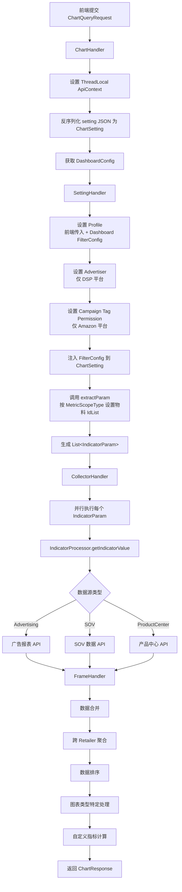
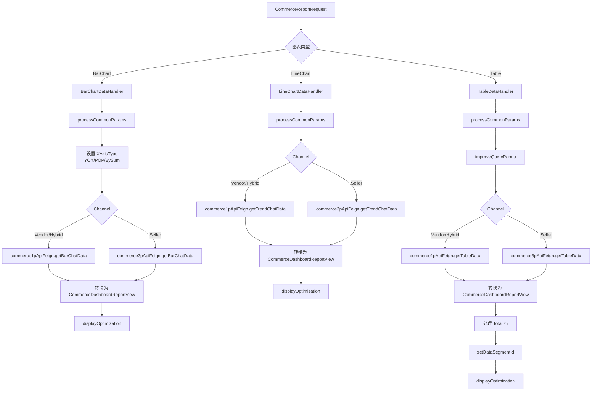
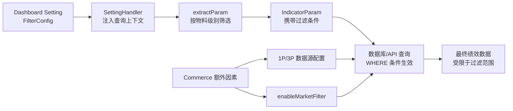

# Dashboard Setting 过滤条件与绩效影响（Retail/Commerce） 功能逻辑文档

> 本文档由 document-automation 工具自动生成，基于源代码、PRD 文档和技术评审文档。
> 生成时间: 2026-04-09 10:15:52
> 准确性评分: 未验证/100

---


# Dashboard Setting 过滤条件与绩效影响（Retail/Commerce） 功能逻辑文档

## 1. 模块概述

### 1.1 职责与定位

本模块负责 Custom Dashboard 中 **Dashboard Setting 过滤条件**如何层层传递并最终影响绩效数据查询结果。核心职责包括：

1. **过滤条件配置管理**：在 Dashboard Setting 中提供 Filter Setting 面板，允许用户配置 Profile、Campaign Tag、Ad Type、Advertiser、Retailer 等过滤维度的数据范围。
2. **过滤条件注入与传递**：在图表数据查询的责任链中，将 Dashboard 级别的过滤配置（`DashboardConfig.FilterConfig`）与图表级别的物料设置（`MetricScopeType`）进行合并，生成最终的查询参数。
3. **平台差异处理**：Retail（HQ）与 Commerce 两个平台有各自独立的过滤逻辑、指标计算方式和数据口径，本模块分别处理两条链路。

### 1.2 系统架构位置

```
┌─────────────────────────────────────────────────────────────────┐
│                        前端 Vue 组件层                           │
│  (TableSetting.vue / barChart.vue / lineChart.vue / ChartsAll)  │
└──────────────────────────────┬──────────────────────────────────┘
                               │ HTTP POST (ChartQueryRequest)
                               ▼
┌─────────────────────────────────────────────────────────────────┐
│                     ChartHandler (责任链入口)                     │
│  设置 ThreadLocal 上下文，反序列化 setting JSON                    │
└──────────────────────────────┬──────────────────────────────────┘
                               ▼
┌─────────────────────────────────────────────────────────────────┐
│                     SettingHandler (核心过滤节点)                  │
│  注入 ProfileFilter / AdvertiserFilter / CampaignTagFilter       │
│  按 MetricScopeType 设置物料 IdList，生成 List<IndicatorParam>    │
└──────────────────────────────┬──────────────────────────────────┘
                               ▼
┌─────────────────────────────────────────────────────────────────┐
│                     CollectorHandler (并行执行)                   │
│  调用 IndicatorProcessor / ApiExecutor 查询各平台绩效数据          │
└──────────────────────────────┬──────────────────────────────────┘
                               ▼
┌─────────────────────────────────────────────────────────────────┐
│                     FrameHandler (数据合并与格式化)                │
│  合并、聚合、排序、图表类型特定处理，生成 ChartResponse              │
└─────────────────────────────────────────────────────────────────┘
```

对于 **Commerce 平台**，存在一条独立的数据处理链路：

```
CommerceReportRequest → AbstractChartDataHandler 子类
  ├── BarChartDataHandler   → commerce1pApiFeign / commerce3pApiFeign
  ├── LineChartDataHandler  → commerce1pApiFeign / commerce3pApiFeign
  └── TableDataHandler      → commerce1pApiFeign / commerce3pApiFeign
```

### 1.3 涉及的后端模块

| Maven 模块 | 说明 |
|---|---|
| `custom-dashboard-api` | Retail（HQ）平台的图表查询主链路，包含 ChartHandler → SettingHandler → CollectorHandler → FrameHandler |
| `custom-dashboard-commerce` | Commerce 平台的图表数据处理，包含 AbstractChartDataHandler 及其子类 |

### 1.4 涉及的前端组件

| 组件路径 | 说明 |
|---|---|
| `dialog/TableSetting.vue` | Table 图表设置弹窗，配置物料级别、指标、Data Segment 等 |
| `dialog/barChart.vue` | Comparison（Bar）图表设置弹窗 |
| `dialog/lineChart.vue` | Trend（Line）图表设置弹窗 |
| `dashboardSub/ChartsAll.vue` | 图表容器组件，触发 editChart 事件 |
| `dashboardSub/withEnableMarketFilterForTemplate.js` | 模板保存时处理 enableMarketFilter 逻辑 |
| `public/metrics.js` | `ScopeSettingTypeFun` 物料设置类型工具函数 |
| `TemplateManagements/index.js` | 模板管理，`initChartData` 初始化各图表类型数据 |
| `Commerce1p3p` 组件 | Commerce 平台 1P/3P 数据源配置 |

### 1.5 核心设计模式

| 设计模式 | 应用位置 | 说明 |
|---|---|---|
| **责任链模式** | ChartHandler → SettingHandler → CollectorHandler → FrameHandler | 请求依次经过各 Handler 处理 |
| **工厂模式** | `ScopeValueParserFactory` | 根据 `MetricScopeType` 创建对应的值解析器 |
| **策略模式** | 各 `ChartSetting` 实现类的 `extractParam` 方法 | 不同图表类型有不同的参数提取与分组策略 |
| **ThreadLocal 上下文模式** | `ApiContextHolder` / `ApiContext` | 在请求链路中传递上下文信息 |
| **模板方法模式** | `Handler<I, O>` 接口 + `AbstractChartDataHandler` | 统一 handle 签名，子类实现具体逻辑 |

---

## 2. 用户视角

### 2.1 Dashboard Setting 整体结构

根据 PRD（Custom Dashboard V2.8），Dashboard Setting 被拆分为两部分：

1. **Basic Setting**：Dashboard 基础信息配置（名称、描述等）
2. **Filter Setting**：过滤条件配置面板

#### Filter Setting 面板功能

用户在 Dashboard 编辑页面点击 "Dashboard Setting" 后，可以看到 Filter Setting Tab，其中包含以下过滤项：

**Retail（HQ）平台的 Filter 项：**

| Filter 项 | 默认状态 | 说明 |
|---|---|---|
| **Retailer** | 默认 Select All | 25Q2 Sprint2 新增，控制显示/隐藏某个 Retailer，与 Profile 联动 |
| **Profile** | 默认选中，不可取消 | 从原先的 Dashboard Setting 挪入 Filter Setting |
| **Campaign Tag** | 默认不选中 | 用户可为每个 Retailer 配置 Campaign Tag；未选择 Tag 视为全选 |
| **Ad Type Filter** | 默认不选中 | 每个 Retailer 支持的 Ad Type 不同；只有一种 Ad Type 的 Retailer 不展示 |
| **Advertiser** | 默认不选中 | 仅 DSP 平台使用 |

**Commerce 平台的 Filter 项（25Q3 Sprint2 新增）：**

| Filter 项 | 默认状态 | 联动关系 |
|---|---|---|
| **Market** | 默认关闭，开启后默认为空（不选=全选） | 无 |
| **Account** | 默认关闭 | 受 Market 影响 |
| **Category** | 默认关闭 | 受 Market、Account 影响 |
| **Amazon Category** | 默认关闭 | 受 Market、Account 影响 |
| **Brand** | 默认关闭 | 受 Market、Account 影响 |
| **Amazon Brand** | 默认关闭 | 受 Market、Account 影响 |
| **Tag (Product Tag)** | 默认关闭 | 无 |

### 2.2 用户操作流程

#### 场景一：配置 Dashboard Filter Setting

**步骤 1**：用户进入 Dashboard 编辑页面，点击顶部下拉菜单中的 "Dashboard Setting"。

**步骤 2**：在弹窗中切换到 "Filter Setting" Tab。

**步骤 3**：用户看到各个 Filter 项，每个 Filter 有一个开关控制是否启用。

**步骤 4**：用户开启需要的 Filter，并在下拉框中选择数据范围。
- 对于 Retail 平台：选择 Profile（必选）、Campaign Tag（可选，按 Retailer 配置）、Ad Type（可选）。
- 对于 Commerce 平台：选择 Market、Account、Category、Brand 等，注意联动关系。

**步骤 5**：点击保存。保存后，Dashboard 的数据范围不可超过此处 Filter 设置，包括 Share Link 场景。

#### 场景二：查看 Dashboard 时使用 Filter

**步骤 1**：用户进入 Dashboard 查看页面。

**步骤 2**：页面顶部展示已配置的 Filter 下拉框，候选项与编辑时配置的范围一致。

**步骤 3**：用户对某个 Filter 进行筛选（如选择特定的 Market 或 Campaign Tag）。

**步骤 4**：下方所有图表（Overview、Trend Chart、Comparison Chart、Pie Chart、Table）的数据都会相应变化：
- 如果图表的物料类型与 Filter 类型相同（如物料类型是 Market，Filter 也是 Market），则物料范围与 Filter 取**交集**。
- 如果图表的物料类型是其他类型，则数据范围跟随 Filter 取交集。

#### 场景三：Campaign Tag 与 Tag Filter 取交集（25Q2 Sprint2）

**步骤 1**：用户在图表设置中选择 Campaign Tag 或 Campaign Parent Tag 作为物料。

**步骤 2**：在 Scope Setting 中，用户可以看到一个复选框 "Link Campaign Tag Filter"（默认勾选）。

**步骤 3**：勾选后的数据处理逻辑：
- Filter 中多选的 Tag 之间是 **OR** 关系。
- 然后再与每一行的 Campaign Tag 取**交集**。
- Filter 的筛选**不影响**每一行 Tag 的显示与隐藏。如果交集结果为空数据，则显示为 0。

**不支持的场景**：
- Cross Retail - Retailer 场景不支持。
- Pie Chart 和 Table 的 Top XX 排序范围不支持。
- Pie Chart 和 Table 选择 Campaign Tag 后的 Top XX 不支持。

**Tips 文案**：*"If you do not check this option, the Campaign Tag in the top Filter will not affect the data scope. If you check it, the selected Campaign Tag here will intersect with the Campaign Tag in the Filter."*

#### 场景四：Share Tag 作为物料（25Q2 Sprint2）

**步骤 1**：用户在 Cross-Retailer 分类中选择 Share Tag 物料。

**步骤 2**：在 Scope Setting 中选择 Share Tag 和 Retailer 范围。

**步骤 3**：支持的指标与 Cross Retailer - Retailer 一致。

**Filter 联动**：本期只支持与 Profile 联动，暂不支持与 Campaign Tag 或 Campaign Type 联动。

**不支持的图表**：Stacked Bar Chart 不支持 Share Tag。

#### 场景五：Commerce 平台 Data Segment（25Q4 Sprint3）

**步骤 1**：用户在 Commerce 的 Table 图表中选择 Material Level 为 Account、Category 或 Brand。

**步骤 2**：出现 "Data Segment" 选项（默认为空，只允许单选）。

**步骤 3**：选择具体的 Data Segment 后，以 Material Level 为主物料，按 Data Segment 为子维度进行组合。

可选的 Data Segment 组合：

| Material Level | 可选 Data Segment |
|---|---|
| Account | Category, Brand |
| Category | Account, Market, Brand |
| Brand | Category, Market, Account |
| Amazon Category | Account |
| Amazon Brand | Account |

#### 场景六：Commerce 图表中的 Market 筛选项（25Q4 Sprint3）

当 Commerce 图表的 Material Level 选择 Account、Category 或 Brand 时，新增 Market 筛选项：
- 默认不筛选（不筛选=全选）
- 选择具体 Market 后，数据范围取原先范围与所选 Market 的交集

各图表中 Market 筛选项的位置：
- **Overview**：Basic Setting 模块下
- **Trend**：指标卡片内
- **Comparison**：Scope Setting 下
- **Pie Chart**：Material Level 为 Customize 时展示
- **Table**：Material Level 为 Customize 时展示

### 2.3 Filter 与物料级别联动清单

PRD 要求给用户提供一个清单，说明哪些 Material Level 会和 Filter 产生联动。根据代码和 PRD 交叉验证：

**Retail（HQ）平台**：
- Profile Filter → 影响所有物料级别的数据范围
- Campaign Tag Filter → 影响 Campaign、AdGroup、Keyword、ASIN 等物料级别的数据范围；当物料类型本身是 Campaign Tag 时，可选择是否与 Filter 取交集
- Ad Type Filter → 影响 Campaign 及其下级物料的数据范围
- Advertiser Filter → 仅影响 DSP 平台的数据范围

**Commerce 平台**：
- Market Filter → 影响 Account、Category、Brand 等物料级别
- Account Filter → 受 Market 联动，影响 Category、Brand 等
- Category / Amazon Category Filter → 受 Market、Account 联动
- Brand / Amazon Brand Filter → 受 Market、Account 联动
- Product Tag Filter → 独立过滤

---

## 3. 核心 API

### 3.1 图表数据查询接口

由于代码片段中 Controller 层的具体路径标注为"待确认"，根据责任链入口 `ChartHandler` 的实现推断：

- **路径**: `POST /api/chart/query`（**待确认**，入口可能在 ChartHandler 上游的 Controller）
- **参数**: `ChartQueryRequest`
  ```json
  {
    "dashboardId": "string — Dashboard ID",
    "setting": "string — 图表设置 JSON，反序列化为具体 ChartSetting 实现类",
    "profileIds": ["string — 前端传入的 Profile ID 列表"],
    "productLineProfiles": {
      "Amazon": ["profileId1", "profileId2"],
      "DSP": ["profileId3"],
      "Commerce": ["profileId4"]
    },
    "productLineAdvertisers": {
      "DSP": ["advertiserId1"]
    },
    "productLineCampaignTags": {
      "Amazon": ["tagId1", "tagId2"]
    },
    "filter": "object — 前端传入的额外过滤条件",
    "dateRange": "object — 日期范围",
    "currency": "string — 币种"
  }
  ```
- **返回值**: `ChartResponse`
  ```json
  {
    "data": "object — 图表数据，结构因图表类型而异",
    "chartType": "string — 图表类型",
    "metadata": "object — 元数据"
  }
  ```
- **说明**: 请求经 ChartHandler → SettingHandler → CollectorHandler → FrameHandler 链式处理。

### 3.2 Commerce 平台数据查询接口

Commerce 平台通过 Feign 调用下游服务，根据 Channel（1P/3P）路由到不同的 API：

| 图表类型 | 1P (Vendor/Hybrid) | 3P (Seller) |
|---|---|---|
| Bar Chart | `commerce1pApiFeign.getBarChatData(query)` | `commerce3pApiFeign.getBarChatData(query)` |
| Line Chart | `commerce1pApiFeign.getTrendChatData(query)` | `commerce3pApiFeign.getTrendChatData(query)` |
| Table | `commerce1pApiFeign.getTableData(query)` | `commerce3pApiFeign.getTableData(query)` |

请求参数类型为 `ReportCustomDashboardQuery`，由 `AbstractChartDataHandler.processCommonParams(request)` 从 `CommerceReportRequest` 转换而来。

### 3.3 前端 API 调用

前端图表设置弹窗（`TableSetting.vue`、`barChart.vue`、`lineChart.vue`）收集用户配置后，序列化为 `chart.setting` JSON 提交后端。具体的 API 调用文件**待确认**，但数据流为：

```
Vue 组件 → API 层 → POST /api/chart/query → ChartHandler
```

---

## 4. 核心业务流程

### 4.1 Retail（HQ）平台：图表数据查询全链路

#### 4.1.1 ChartHandler — 责任链入口

**详细步骤**：

1. 接收 `ChartQueryRequest` 请求。
2. 从 `HttpServletRequest` 中提取通用参数（clientId、currency 等）。
3. 创建 `ApiContext` 对象，设置到 `ApiContextHolder`（ThreadLocal）中：
   - `clientId`、`currency`、`dateRange`
   - `productLineProfiles`、`productLineAdvertisers`、`productLineCampaignTags`（前端传入）
4. 通过 `DashboardService` 获取 `DashboardConfig`（含 `FilterConfig`），设置到 `ApiContext` 中。
5. 使用 `ObjectMapper` 将 `setting` JSON 反序列化为具体的 `ChartSetting` 实现类（如 `BarChartSetting`、`LineChartSetting`、`TableSetting` 等）。
6. 如果需要，通过 `AmazonAdvertisingFeign` 获取 Amazon 广告相关的辅助数据。
7. 将 `ChartSetting` 传递给 `SettingHandler.handle()`。

#### 4.1.2 SettingHandler — 核心过滤设置节点

这是过滤条件影响绩效数据的**核心节点**。详细步骤如下：

**Step 1：设置 Profile**

```java
if (CollectionUtils.isEmpty(ApiContextHolder.getContext().getProductLineProfiles())) {
    // 前端未传 Profile，取平台全部
    Map<Platform, List<String>> groupProfileByProductLine = setting.supportProductLines().stream()
        .collect(Collectors.toMap(Function.identity(), this::getPlatformProfiles));
    ApiContextHolder.getContext().setProductLineProfiles(groupProfileByProductLine);
} else {
    // 前端已传 Profile
    Map<Platform, List<String>> productLineProfiles = ApiContextHolder.getContext().getProductLineProfiles();
    ApiContextHolder.getContext().setAmazonProfiles(productLineProfiles.get(Platform.Amazon));
    // 对于未传的平台，补充全部 Profile
    setting.supportProductLines().forEach(productLine -> {
        if (CollectionUtils.isEmpty(productLineProfiles.get(productLine))) {
            productLineProfiles.put(productLine, getPlatformProfiles(productLine));
        }
    });
}
```

关键逻辑：
- Profile 是**必传**的过滤条件（前端默认选中，不可取消）。
- 如果前端未传某个平台的 Profile，则取该平台的全部 Profile。
- Amazon 平台的 Profile 会单独设置到 `ApiContext.amazonProfiles` 中。

**Step 2：设置 Advertiser（仅 DSP 平台）**

```java
Map<Platform, List<String>> advertiserFilterConfigMap = Optional.ofNullable(dashboardConfig)
    .map(DashboardConfig::getFilterConfig)
    .map(DashboardConfig.FilterConfig::getAdvertiserFilter)
    .map(DashboardConfig.Filter::getData)
    .orElse(null);
setting.supportProductLines().forEach(platform -> {
    if (Objects.equals(platform, Platform.DSP)) {
        applyPlatformAdvertisers(platform, productLineAdvertisers, advertiserFilterConfigMap);
    }
});
```

关键逻辑：
- 从 `DashboardConfig.FilterConfig.AdvertiserFilter` 获取 Dashboard 级别的 Advertiser 过滤配置。
- 仅对 DSP 平台应用 Advertiser 过滤。
- `applyPlatformAdvertisers` 方法将前端传入的 Advertiser 与 Dashboard 配置的 Advertiser 范围取交集。

**Step 3：设置 Campaign Tag Permission（仅 Amazon 平台）**

```java
private static final Set<Platform> supportTagPermissionPlatforms = Set.of(Platform.Amazon);

setting.supportProductLines().forEach(platform -> {
    if (supportTagPermissionPlatforms.contains(platform)) {
        addCampaignTagsForPermission(platform, productLineCampaignTags, campaignTagConfigMap);
    }
});
```

关键逻辑：
- 仅 Amazon 平台支持 Tag Permission。
- 从 `DashboardConfig.FilterConfig.CampaignTagFilter` 获取 Dashboard 级别的 Campaign Tag 配置。
- `addCampaignTagsForPermission` 方法将前端传入的 Campaign Tag 与 Dashboard 配置的 Tag 范围合并/取交集。

**Step 4：设置 Filter Config**

根据技术评审文档（V2.8），核心处理在 `ChartSetting.setFilterConfig` 方法中：

```java
// 设置filter config（代码片段中标注为截断）
setting.setFilterConfig(dashboardConfig.getFilterConfig());
```

这一步将 Dashboard 级别的 `FilterConfig`（包含 ProfileFilter、AdvertiserFilter、CampaignTagFilter、AdTypeFilter 等）注入到 `ChartSetting` 中，供后续 `extractParam` 使用。

**Step 5：调用 extractParam 生成 IndicatorParam 列表**

```java
List<IndicatorParam> indicatorParams = setting.extractParam(ApiContextHolder.getContext());
```

`extractParam` 是策略模式的核心方法，各图表类型有不同的实现：

- 根据用户选择的 `MetricScopeType`（Campaign、AdGroup、Keyword、ASIN、SKU、CampaignTag、ShareParentTag 等）设置对应的物料 IdList。
- 使用 `ScopeValueParserFactory` 根据 `MetricScopeType` 创建对应的值解析器，解析物料 ID。
- 根据物料层级、数据源（Advertising/SOV/ProductCenter）和指标分组，生成 `List<IndicatorParam>`。
- 不同图表可能有不同的分组规则。

**Step 6：处理 filterScopes（2026Q1S6 新增）**

根据技术评审文档（2026Q1S6），ChartSetting 的 Metric 中新增了 `showFilter`、`specifyFilterScope`、`filterScopes` 字段：

```json
{
  "showFilter": true,
  "specifyFilterScope": true,
  "filterScopes": [
    {
      "type": "Campaign",
      "values": ["campaignId1", "campaignId2"]
    }
  ]
}
```

各图表的 filter 粒度：
- **TopOverview**：per section（同 sectionNo 的多个 metric 共享一个 filter 配置）
- **LineChart / BarChart / PieChart**：per metric（每个 metric 独立 filter）
- **Table**：per metric（通常只有一个 metric）
- **StackedBar / GridTable**：不支持

**Step 7：传递给 CollectorHandler**

将生成的 `List<IndicatorParam>` 传递给 `CollectorHandler.handle()`。

#### 4.1.3 CollectorHandler — 并行数据采集

**详细步骤**：

1. 接收 `List<IndicatorParam>`。
2. 对每个 `IndicatorParam`，创建 `Callable` 任务。
3. 使用 `ExecutorService` 并行提交所有任务。
4. 每个任务调用 `indicatorProcessor.getIndicatorValue(indicatorParam)` 获取指标数据。
5. `IndicatorProcessor` 内部通过 `ApiExecutor` 调用各平台的数据接口：
   - **Advertising 指标**：调用广告报表 API
   - **SOV 指标**：调用 SOV 数据 API
   - **ProductCenter 指标**：调用产品中心 API
6. **Amazon 平台的特殊处理**：SOV 指标查询可能有先后依赖。例如 Table 中要求查询 Top 数据时，会先根据 Top 字段查出对应数据，再去查另外两种类型的指标。
7. 收集所有 `Future` 的结果，合并为数据列表。
8. 传递给 `FrameHandler.handle()`。

#### 4.1.4 FrameHandler — 数据合并与格式化

**详细步骤**：

1. 接收 CollectorHandler 收集到的数据列表。
2. **数据合并**：合并来自不同数据源（Advertising、SOV、ProductCenter）的数据。
3. **跨 Retailer 聚合**：处理 Retailer 维度的指标聚合。
4. **数据排序**：根据图表设置中的排序规则对数据排序。
5. **图表类型特定处理**：
   - StackedBarChart：按分组维度进行特殊处理。
   - Table：处理 Total 行、Compare 数据（POP/YOY）。
   - Pie Chart：处理超过 10 条数据的场景。
6. **自定义指标计算**（`calculateCustomMetric`）：对自定义指标进行占位符替换和公式解析。
7. 生成 `ChartResponse` 对象返回。

#### 4.1.5 Retail 平台完整流程图



### 4.2 Commerce 平台：图表数据查询链路

Commerce 平台有独立的数据处理链路，通过 `AbstractChartDataHandler` 及其子类实现。

#### 4.2.1 通用参数处理 — processCommonParams

所有 Commerce 图表数据处理器都继承 `AbstractChartDataHandler`，并调用 `processCommonParams(request)` 将 `CommerceReportRequest` 转换为 `ReportCustomDashboardQuery`。

此方法处理的内容包括（**待确认**具体实现细节）：
- 日期范围转换
- Channel（1P/3P/Hybrid）设置
- 物料级别（`MetricScopeType`）映射
- 指标类型（`MetricType`）映射
- Market、Account、Category、Brand 等过滤条件注入

#### 4.2.2 BarChartDataHandler — Comparison 图表

```java
@Component
@ChartTypeQualifier(ChartType.BarChart)
public class BarChartDataHandler extends AbstractChartDataHandler {
    @Override
    public List<CommerceDashboardReportView> handleData(CommerceReportRequest request) {
        ReportCustomDashboardQuery query = processCommonParams(request);
        query.setXaxisMode(request.getMode());
        // 处理 YOY / POP / BySum 模式
        if (Boolean.TRUE.equals(request.getYOY())) {
            query.setXaxisType(BarChartSetting.XAsisType.YOY.name());
            // ...
        } else if (Boolean.TRUE.equals(request.getPOP())) {
            query.setXaxisType(BarChartSetting.XAsisType.POP.name());
        } else if (Boolean.TRUE.equals(request.getBySum())) {
            query.setXaxisType(BarChartSetting.XAsisType.BySum.name());
        }
        // 根据 Channel 路由到 1P 或 3P API
        switch (DashboardConfig.Channel.fromValue(query.getChannel())) {
            case Vendor, Hybrid -> barChatData = commerce1pApiFeign.getBarChatData(query);
            case Seller -> barChatData = commerce3pApiFeign.getBarChatData(query);
        }
        // 处理响应数据...
    }
}
```

关键逻辑：
- 支持三种 X 轴类型：**YOY**（同比）、**POP**（环比）、**BySum**（汇总）。
- YOY 模式下可设置 `periodType`（时间粒度）。
- 根据 `DashboardConfig.Channel` 路由到 1P（Vendor/Hybrid）或 3P（Seller）API。
- 响应数据分为 `yoyOrPopChart`（同比/环比数据）和 `bySumChart`（汇总数据）两种结构。
- 最后调用 `displayOptimization(result, request)` 进行显示优化。

#### 4.2.3 LineChartDataHandler — Trend 图表

```java
@Component
@ChartTypeQualifier(ChartType.LineChart)
public class LineChartDataHandler extends AbstractChartDataHandler {
    @Override
    public List<CommerceDashboardReportView> handleData(CommerceReportRequest request) {
        ReportCustomDashboardQuery query = processCommonParams(request);
        // 根据 Channel 路由
        switch (DashboardConfig.Channel.fromValue(query.getChannel())) {
            case Vendor, Hybrid -> trendChatData = commerce1pApiFeign.getTrendChatData(query);
            case Seller -> trendChatData = commerce3pApiFeign.getTrendChatData(query);
        }
        // 转换为 CommerceDashboardReportView 列表
    }
}
```

关键逻辑：
- 调用 Trend Chart 专用 API。
- 响应类型为 `List<ReportCustomDashboardTrendChartVO>`。
- 按 `MetricType` 过滤并转换为统一的 `CommerceDashboardReportView`。

#### 4.2.4 TableDataHandler — Table 图表

```java
@Component
@ChartTypeQualifier(ChartType.Table)
public class TableDataHandler extends AbstractChartDataHandler {
    @Override
    public List<CommerceDashboardReportView> handleData(CommerceReportRequest request) {
        ReportCustomDashboardQuery query = processCommonParams(request);
        improveQueryParma(query, request); // 额外参数增强
        // 根据 Channel 路由
        switch (DashboardConfig.Channel.fromValue(query.getChannel())) {
            case Vendor, Hybrid -> tableData = commerce1pApiFeign.getTableData(query);
            case Seller -> tableData = commerce3pApiFeign.getTableData(query);
        }
        // 处理 Total 行
        if (Boolean.TRUE.equals(request.getAddTotalLine()) && ObjectUtils.isNotEmpty(data.getTotal())) {
            CommerceDashboardReportView total = compareReportToCommerce(data.getTotal(), metricTypeList);
            total.setIsTotal(true);
            result.add(total);
        }
        // 设置 Data Segment ID
        setDataSegmentId(result, request);
        displayOptimization(result, request);
    }
}
```

关键逻辑：
- 调用 `improveQueryParma` 进行额外参数增强（**待确认**具体内容，可能包含排序、分页、Data Segment 等）。
- 支持 Total 行：当 `addTotalLine` 为 true 时，将 Total 数据追加到结果末尾，并标记 `isTotal = true`。
- 调用 `setDataSegmentId` 设置 Data Segment 标识。

#### 4.2.5 Commerce 平台完整流程图



### 4.3 过滤条件影响路径总结



**过滤条件传递链路**：

1. **Dashboard Setting FilterConfig**（Profile/CampaignTag/AdType/Advertiser/Retailer）
2. → **SettingHandler** 注入查询上下文（`ApiContext`）
3. → **extractParam** 按物料级别（`MetricScopeType`）筛选，设置物料 IdList
4. → **IndicatorParam** 携带所有过滤条件
5. → **数据库/API 查询**时 WHERE 条件生效
6. → **最终绩效数据结果**受限于过滤范围

Commerce 平台额外受以下因素影响：
- **1P/3P 数据源配置**（Channel: Vendor/Hybrid/Seller）
- **enableMarketFilter**（是否启用 Market 过滤）
- **Commerce 特有的 Filter**（Market/Account/Category/Brand/Amazon Category/Amazon Brand/Product Tag）

---

## 5. 数据模型

### 5.1 核心 DTO/VO

#### 5.1.1 DashboardConfig

Dashboard 级别配置对象，包含 Filter 配置：

```java
public class DashboardConfig {
    private FilterConfig filterConfig;
    // Channel 枚举（Commerce 使用）
    public enum Channel {
        Vendor, Seller, Hybrid;
        public static Channel fromValue(String value) { ... }
    }
    
    public static class FilterConfig {
        private Filter profileFilter;        // Profile 过滤器
        private Filter advertiserFilter;     // Advertiser 过滤器（DSP）
        private Filter campaignTagFilter;    // Campaign Tag 过滤器（Amazon）
        private Filter adTypeFilter;         // Ad Type 过滤器
        private Filter retailerFilter;       // Retailer 过滤器
        // Commerce 特有
        private Filter marketFilter;         // Market 过滤器
        private Filter accountFilter;        // Account 过滤器
        private Filter categoryFilter;       // Category 过滤器
        private Filter amazonCategoryFilter; // Amazon Category 过滤器
        private Filter brandFilter;          // Brand 过滤器
        private Filter amazonBrandFilter;    // Amazon Brand 过滤器
        private Filter productTagFilter;     // Product Tag 过滤器
    }
    
    public static class Filter {
        private Map<Platform, List<String>> data; // 按平台分组的过滤值
    }
}
```

#### 5.1.2 ApiContext

ThreadLocal 上下文对象：

```java
public class ApiContext {
    private String clientId;
    private String currency;
    private Object dateRange;
    private DashboardConfig dashboardConfig;
    
    // 按平台分组的过滤数据
    private Map<Platform, List<String>> productLineProfiles;
    private Map<Platform, List<String>> productLineAdvertisers;
    private Map<Platform, List<String>> productLineCampaignTags;
    
    // Amazon 专用
    private List<String> amazonProfiles;
}
```

#### 5.1.3 ChartSetting 接口及实现

```java
public interface ChartSetting {
    List<IndicatorParam> extractParam(ApiContext context);
    List<Platform> supportProductLines();
    void setFilterConfig(DashboardConfig.FilterConfig filterConfig);
}
```

各图表类型的实现类（**待确认**完整列表）：
- `BarChartSetting` — Comparison 图表
- `LineChartSetting` — Trend 图表
- `TableSetting` — Table 图表
- `TopOverviewSetting` — Overview 图表
- `PieChartSetting` — Pie 图表
- `StackedBarSetting` — Stacked Bar 图表（**不支持** filterScopes）
- `GridTableSetting` — Grid Table 图表（**不支持** filterScopes）

#### 5.1.4 MetricScopeType 枚举

物料级别枚举，决定查询的数据粒度：

```java
public enum MetricScopeType {
    Campaign,
    AdGroup,
    Keyword,
    ASIN,
    SKU,
    CampaignTag,
    CampaignParentTag,
    ShareParentTag,
    // Commerce 特有
    Market,
    Account,
    Category,
    AmazonCategory,
    Brand,
    AmazonBrand,
    ProductTag
    // ... 其他
}
```

每个 `MetricScopeType` 有一个 `responseFieldName` 属性，用于从响应数据中提取对应字段。

#### 5.1.5 MaterialFilter

物料过滤配置（2026Q1S6 新增）：

```java
public class MaterialFilter {
    private MetricScopeType type;  // 物料级别类型
    private List<String> values;   // 物料 ID 列表
}
```

#### 5.1.6 IndicatorParam

指标查询参数，携带所有过滤条件传递给数据层：

```java
public class IndicatorParam {
    private List<String> profileIds;
    private List<String> campaignIds;
    private List<String> adGroupIds;
    private List<String> keywordIds;
    private List<String> asinIds;
    private List<String> skuIds;
    private List<String> campaignTagIds;
    private MetricScopeType scopeType;
    private List<MetricType> metricTypes;
    private Object dateRange;
    private boolean yoy;
    private boolean pop;
    private boolean needTotal;
    private String additionalRequirementSql;
    // ... 其他参数
}
```

#### 5.1.7 CommerceReportRequest

Commerce 平台的报表请求：

```java
public class CommerceReportRequest {
    private String mode;
    private Boolean YOY;
    private Boolean POP;
    private Boolean bySum;
    private String periodType;
    private MetricScopeType materialLevel;
    private List<String> metricTypeList;
    private Boolean addTotalLine;
    // ... 其他参数
}
```

#### 5.1.8 CommerceDashboardReportView

Commerce 平台的统一响应视图：

```java
public class CommerceDashboardReportView {
    private Boolean isTotal;
    // 各指标字段（动态，根据 MetricType 映射）
    // ... 
}
```

### 5.2 ChartSetting JSON 结构

图表设置以 JSON 格式存储，以下是各图表类型的典型结构：

#### Trend Chart (LineChart) Setting

```json
{
  "chartType": "LineChart",
  "timeSegment": "Daily",
  "metrics": [
    {
      "metricType": "Spend",
      "scope": {
        "type": "Campaign",
        "values": ["campaignId1", "campaignId2"]
      },
      "enableMarketFilter": false,
      "linkCampaignTagFilter": true,
      "showFilter": true,
      "specifyFilterScope": false,
      "filterScopes": []
    }
  ]
}
```

#### Comparison Chart (BarChart) Setting

```json
{
  "chartType": "BarChart",
  "xAxisType": "YOY",
  "mode": "...",
  "metrics": [
    {
      "metricType": "Sales",
      "scope": {
        "type": "AdGroup",
        "values": ["adGroupId1"]
      },
      "showFilter": true,
      "specifyFilterScope": true,
      "filterScopes": [
        {
          "type": "Campaign",
          "values": ["campaignId1"]
        }
      ]
    }
  ]
}
```

#### Table Setting

```json
{
  "chartType": "Table",
  "materialLevel": "Account",
  "dataSegment": "Category",
  "metrics": [
    {
      "metricType": "Spend",
      "showFilter": true,
      "specifyFilterScope": false,
      "filterScopes": []
    }
  ],
  "compare": "POP_CHANGE",
  "showValue": true,
  "addTotalLine": true,
  "keywordFilter": [
    {
      "id": "xxx",
      "name": "yyy"
    }
  ]
}
```

### 5.3 数据库表

具体表名在代码片段中未暴露，由 `DashboardService` 管理。推测包含以下表（**待确认**）：

| 表名（推测） | 说明 |
|---|---|
| dashboard_config | Dashboard 配置表，存储 FilterConfig JSON |
| chart_setting | 图表设置表，存储各图表的 setting JSON |
| dashboard_template | 模板表，存储模板配置 |

---

## 6. 平台差异

### 6.1 Retail（HQ）平台

#### 6.1.1 支持的过滤维度

| 过滤维度 | 适用平台 | 说明 |
|---|---|---|
| Profile | Amazon, DSP, Walmart 等所有平台 | 必选，不可取消 |
| Campaign Tag | 仅 Amazon | 支持 Tag Permission；可与图表物料取交集 |
| Ad Type | 各 Retailer 不同 | 只有一种 Ad Type 的 Retailer 不展示 |
| Advertiser | 仅 DSP | DSP 平台特有 |
| Retailer | 所有平台 | 25Q2 新增，控制显示/隐藏 Retailer |

#### 6.1.2 数据源类型

Retail 平台的数据来源分为三类：
- **Advertising**：广告绩效数据（Spend、Sales、ROAS 等）
- **SOV**：Share of Voice 数据
- **ProductCenter**：产品中心数据

#### 6.1.3 Tag Permission 机制

仅 Amazon 平台支持 Tag Permission：

```java
private static final Set<Platform> supportTagPermissionPlatforms = Set.of(Platform.Amazon);
```

当 Amazon 平台启用 Campaign Tag Filter 时：
1. 从 `DashboardConfig.FilterConfig.CampaignTagFilter` 获取 Dashboard 级别配置的 Tag 范围。
2. 与前端传入的 `productLineCampaignTags` 合并。
3. 在 `extractParam` 中，如果图表物料类型是 CampaignTag 且 `linkCampaignTagFilter` 为 true，则与 Filter 中的 Tag 取交集。

#### 6.1.4 NTB 数据计算逻辑（2025Q3S3 修改）

根据技术评审文档，NTB（New-to-Brand）指标的计算逻辑进行了修改：

**修改前**（使用所有 Sales/Orders/Sale Units 作为分母）：
- NTB Orders % = attributedOrdersNewToBrand14d / attributedConversions14d × 100%
- NTB Sales % = attributedSalesNewToBrand14d / attributedSales14d × 100%
- NTB Sale Units % = attributedUnitsOrderedNewToBrand14d / attributedUnitsOrdered14d × 100%

**修改后**（仅使用 SB、SD 的 Sales 等作为分母）：
- 通过 `CASE WHEN` 给 `dayreportCampaignView_alll` 基础表扩展 `sbsdSales`、`sbsdSaleUnits`、`sbsdOrders` 列。
- 如果是 SB/SD 类型，取 Sales/SaleUnits/Orders；否则为 0。

#### 6.1.5 Custom Metric 支持

根据技术评审文档（2025Q3S3），支持自定义指标：

- `CustomMetricScopeTypeMapping`：自定义指标中 data level 与 Custom Dashboard 物料的映射关系（1:m）
  - 例如：`("amazon", "Campaign Tag", MetricScopeType.CampaignTag, MetricScopeType.CampaignParentTag)`
- `CustomMetricTypeMapping`：自定义指标中公式占位符与指标的映射关系（1:1）
  - 例如：`("amazon", "Spend", MetricType.Spend)`
- 在 `FrameHandler.calculateCustomMetric` 中进行占位符替换和公式解析。

### 6.2 Commerce 平台

#### 6.2.1 支持的过滤维度

| 过滤维度 | 联动关系 | 说明 |
|---|---|---|
| Market | 无 | 独立过滤 |
| Account | 受 Market 影响 | Market 选择会影响 Account 下拉框 |
| Category | 受 Market、Account 影响 | |
| Amazon Category | 受 Market、Account 影响 | |
| Brand | 受 Market、Account 影响 | |
| Amazon Brand | 受 Market、Account 影响 | |
| Product Tag | 无 | 独立过滤 |

#### 6.2.2 数据源配置（1P/3P）

Commerce 平台的核心差异在于 **Channel**（数据源）配置：

```java
public enum Channel {
    Vendor,  // 1P 供应商模式
    Seller,  // 3P 卖家模式
    Hybrid   // 混合模式
}
```

根据 Channel 路由到不同的 Feign 客户端：
- **Vendor / Hybrid** → `commerce1pApiFeign`
- **Seller** → `commerce3pApiFeign`

这在 `BarChartDataHandler`、`LineChartDataHandler`、`TableDataHandler` 中均有体现：

```java
switch (DashboardConfig.Channel.fromValue(query.getChannel())) {
    case Vendor, Hybrid -> data = commerce1pApiFeign.getXxxData(query);
    case Seller -> data = commerce3pApiFeign.getXxxData(query);
}
```

#### 6.2.3 enableMarketFilter

Commerce 平台特有的 `enableMarketFilter` 标志，在前端组件 `withEnableMarketFilterForTemplate.js` 中处理：
- 当图表的 Material Level 选择 Account、Category 或 Brand 时，可以启用 Market 筛选。
- 启用后，数据范围取原先范围与所选 Market 的交集。
- 模板保存时需要特殊处理此标志。

#### 6.2.4 Data Segment（25Q4 Sprint3）

Commerce 平台的 Table 图表支持 Data Segment 功能：

| Material Level | 可选 Data Segment |
|---|---|
| Account | Category, Brand |
| Category | Account, Market, Brand |
| Brand | Category, Market, Account |
| Amazon Category | Account |
| Amazon Brand | Account |

在 `TableDataHandler` 中通过 `setDataSegmentId(result, request)` 设置 Data Segment 标识。

#### 6.2.5 Commerce 与 Retail 的 Filter 区分

根据 PRD（CDB - Commerce 功能数据与 HQ 合并）：
- 编辑页的 Custom Filter 选择平台时新增 "Amazon Commerce"。
- 需要区分 Commerce 和 Ads 的 Filter。
- 查看页面的 Filter 也需要区分 Ads 和 Commerce 的 Filter。

### 6.3 平台差异对比总结

| 维度 | Retail（HQ） | Commerce |
|---|---|---|
| **过滤维度** | Profile、Campaign Tag、Ad Type、Advertiser、Retailer | Market、Account、Category、Amazon Category、Brand、Amazon Brand、Product Tag |
| **数据源** | Advertising / SOV / ProductCenter | 1P (Vendor/Hybrid) / 3P (Seller) |
| **Tag Permission** | 仅 Amazon 平台支持 | 不支持 |
| **数据查询链路** | ChartHandler → SettingHandler → CollectorHandler → FrameHandler | AbstractChartDataHandler 子类 → Feign 调用 |
| **Channel 路由** | 不适用 | 根据 Channel 路由到 1P/3P API |
| **Market Filter** | 不适用 | enableMarketFilter 控制 |
| **Data Segment** | 不适用 | Table 图表支持 |
| **Filter 联动** | Profile 必选；Campaign Tag 可与物料取交集 | Filter 之间有层级联动关系 |
| **YOY/POP 处理** | 在 API 层转换为 boolean 传递给模块 | 3P 的 YOY/POP 需要重新计算 |

---

## 7. 配置与依赖

### 7.1 Feign 下游服务依赖

| Feign 客户端 | 说明 | 使用位置 |
|---|---|---|
| `AmazonAdvertisingFeign` | Amazon 广告数据服务 | ChartHandler 中获取辅助数据 |
| `commerce1pApiFeign` | Commerce 1P 数据服务 | BarChartDataHandler / LineChartDataHandler / TableDataHandler |
| `commerce3pApiFeign` | Commerce 3P 数据服务 | 同上 |

### 7.2 关键配置项

具体的 Apollo/application.yml 配置项在代码片段中未暴露（**待确认**）。推测包含：
- 线程池配置（CollectorHandler 并行执行使用的 ExecutorService）
- Feign 超时配置
- 缓存配置

### 7.3 缓存策略

代码片段中未明确展示缓存相关注解（**待确认**）。根据架构推测，可能在以下位置使用缓存：
- `DashboardService` 获取 `DashboardConfig` 时可能有缓存
- Profile 列表查询可能有缓存

### 7.4 消息队列

代码片段中未展示消息队列使用（**待确认**）。

---

## 8. 版本演进

### 8.1 版本时间线

| 版本 | 时间（推测） | 主要变更 |
|---|---|---|
| **V2.5** | 较早期 | Commerce Dashboard Setting 改造：新增数据源配置（1P/3P），根据不同数据源展示不同字段 |
| **V2.8** | 中期 | Dashboard Setting 拆分为 Basic Setting + Filter Setting；新增 Profile Filter、Campaign Tag Filter、Ad Type Filter；核心处理在 `ChartSetting.setFilterConfig` |
| **25Q2 Sprint2** | 2025 Q2 | 1) Campaign Tag 与 Tag Filter 取交集（`linkCampaignTagFilter`）；2) Share Tag 作为物料；3) Dashboard Setting 可控制不显示某个 Retailer；4) Top Overview 改造为 Overview |
| **25Q3 Sprint2** | 2025 Q3 | Commerce 平台新增 Filter Setting（Market/Account/Category/Brand 等），含联动关系 |
| **25Q3 Sprint3** | 2025 Q3 | 1) Walmart 支持 Keyword TopMover；2) Custom Metric 支持；3) NTB 数据计算逻辑修改；4) Overview/Table 支持随日期筛选器联动；5) Table Compare 枚举值统一 |
| **25Q4 Sprint3** | 2025 Q4 | 1) Commerce Table 新增 Data Segment；2) Commerce 图表新增 Market 筛选项；3) Table Top Movers 增加 YOY 选项 |
| **2026Q1 Sprint6** | 2026 Q1 | ChartSetting Metric 新增 `showFilter`、`specifyFilterScope`、`filterScopes` 字段，支持 View/Share 页面展示物料 Filter |

### 8.2 关键设计决策

1. **责任链模式的选择**：将图表数据查询拆分为 ChartHandler → SettingHandler → CollectorHandler → FrameHandler 四个节点，每个节点职责单一，便于扩展和维护。

2. **Commerce 独立链路**：Commerce 平台由于数据源（1P/3P）和过滤维度与 Retail 差异较大，采用独立的 `AbstractChartDataHandler` 子类体系，通过 `@ChartTypeQualifier`

---

*本文档由 AI 自动生成，如有不准确之处请以源代码为准。标注"待确认"的内容需要人工核实。*