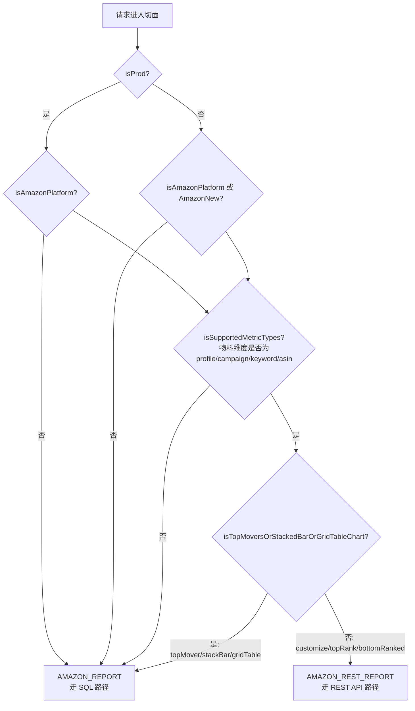
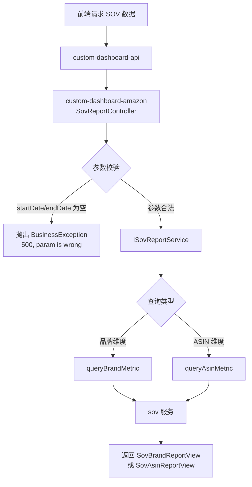
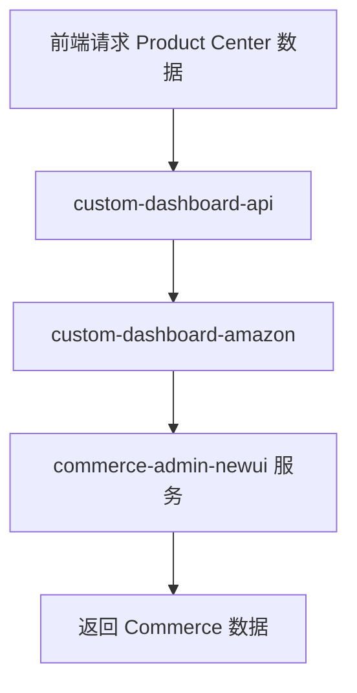
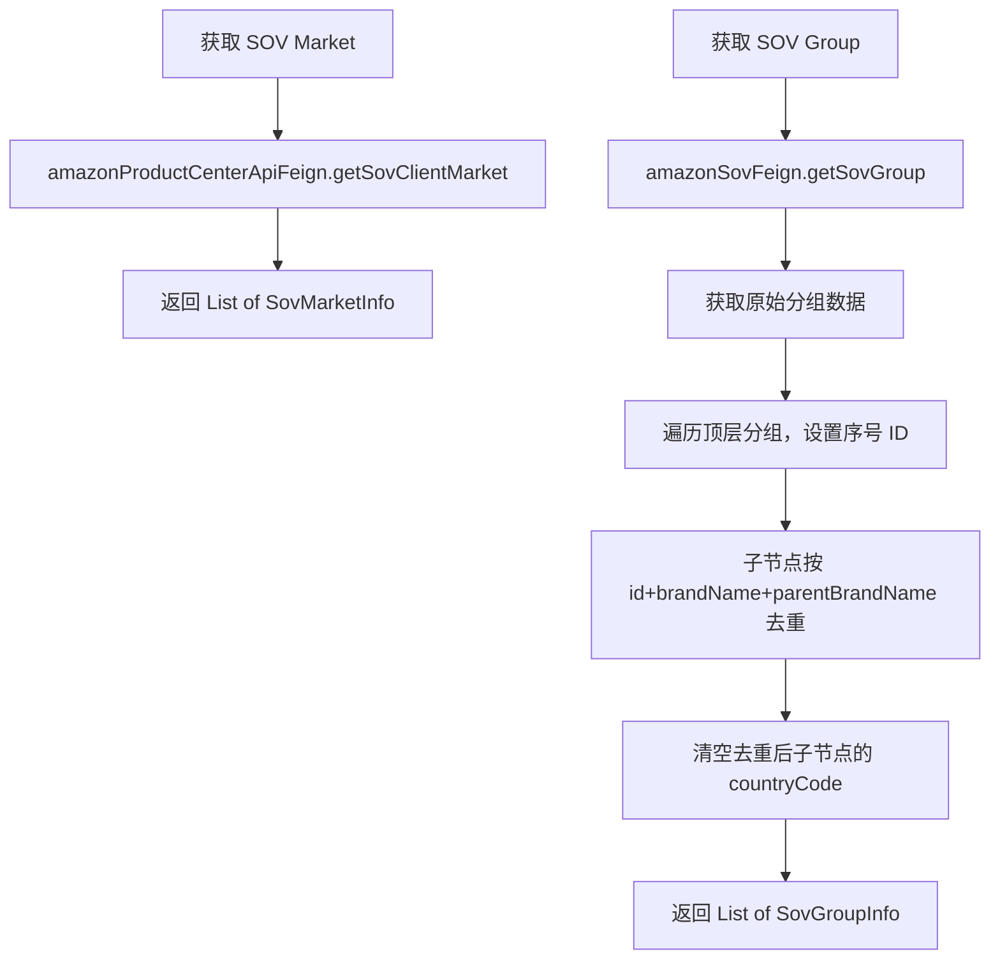

# Amazon 平台模块 功能逻辑文档

> 本文档由 document-automation 工具自动生成，基于源代码、PRD 文档和技术评审文档。
> 生成时间: 2026-04-07 16:16:00
> 准确性评分: 未验证/100

---


# Amazon 平台模块 功能逻辑文档

## 1. 模块概述

### 1.1 职责与定位

Amazon 平台模块是 Pacvue Custom Dashboard 系统中负责 Amazon 平台数据查询的核心模块，覆盖三大数据域：

1. **Amazon Advertising（广告绩效）**：查询 ACOS、ROAS、CPC、Sales、Spend 等数十种广告指标，支持 Profile / Campaign / Keyword / ASIN / AdType / SearchTerm / PT / CampaignTag / AsinTag / KeywordTag 等多种物料维度。
2. **Amazon SOV（Share of Voice）**：查询品牌和 ASIN 维度的搜索份额数据。
3. **Amazon Product Center（Commerce）**：查询 1P/3P 商品维度的销售与库存等数据。

### 1.2 系统架构位置

本模块处于 Custom Dashboard 中台的**平台数据层**，位于中台路由层（`custom-dashboard-api`）与下游 Amazon 服务之间。中台路由层根据请求中的平台标识将请求分发到本模块，本模块再根据物料维度和查询模式决定走 REST API 路径还是 SQL 查询路径。

```
前端 → custom-dashboard-api（中台路由层）
        ├── AmazonFeignAccessControl 切面（二级路由判定）
        │     ├── AmazonRestReportFeign → custom-dashboard-amazon-rest（REST API 路径）
        │     │     └── 下游：pacvuemainapiv2 / amazon-advertising-api
        │     └── AmazonReportFeign → custom-dashboard-amazon（SQL 路径）
        │           └── 下游：ClickHouse / SqlServer
        ├── CommerceReport → custom-dashboard-amazon → commerce-admin-newui
        └── SovReport → custom-dashboard-amazon → sov 服务
```

### 1.3 涉及的后端模块

| 模块名 | 职责 | 说明 |
|--------|------|------|
| `custom-dashboard-amazon` | Amazon 广告 SQL 查询、SOV 查询、Product Center 查询 | 原有模块，基于 MyBatis 模块化 SQL |
| `custom-dashboard-amazon-rest` | Amazon 广告 REST API 查询 | 新增模块（2025Q2S6 引入），通过调用下游 API 获取数据 |
| `custom-dashboard-api` | 中台路由层 | 包含二级路由切面 `AmazonFeignAccessControl` |
| `platform-provider` | 物料值读取 | 从 SqlServer 读取 asin / asinTag / campaignTag 等物料数据 |

### 1.4 涉及的前端组件

待确认（代码片段中未提供前端组件信息）。根据 PRD 推断，前端通过 Chart 配置面板选择 Amazon 平台、物料维度、指标和时间范围，提交请求到中台。

### 1.5 Maven 坐标与部署

| 模块 | FeignClient name | contextId |
|------|------------------|-----------|
| `custom-dashboard-amazon-rest` | `custom-dashboard-amazon-rest` | `custom-dashboard-amazon-rest-advertising` |
| `custom-dashboard-amazon` | 待确认 | 待确认 |

两个模块独立部署为微服务，通过 Spring Cloud Feign 进行服务间调用。

---

## 2. 用户视角

### 2.1 功能场景

基于 PRD 文档，Amazon 平台模块支持以下用户场景：

#### 场景一：广告绩效报表查看

用户在 Custom Dashboard 中创建或编辑 Chart，选择 Amazon 平台后：

1. **选择物料维度**：Profile / Campaign / Keyword / ASIN / AdType / SearchTerm / PT / CampaignTag / AsinTag / KeywordTag 等。
2. **选择指标**：ACOS、ROAS、CPC、Sales、Spend、Impressions、Clicks、CTR、CVR、Orders 等数十种广告指标，以及 Target 类型指标（targetACOS、targetROAS）。
3. **选择查询模式**：
   - **Customize**：用户自选物料项，查看指定物料的绩效数据。
   - **Top Ranked / Bottom Ranked**：按指标排序取前 N / 后 N 名物料。
   - **Top Mover**：查看指标变化最大的物料（仅走 SQL 路径）。
4. **选择图表类型**：Trend Chart、Pie Chart、Stacked Bar Chart、Grid Table 等。
5. **选择时间范围**：支持自定义日期范围，支持 YOY / POP 对比，也支持自定义对比时间范围（V2.4 新增）。

#### 场景二：Ad Type 作为物料维度（V2.8）

用户可以将四种 Ad Type（SP / SB / SD / SBV 等）平铺展示，对比不同广告类型的绩效。此前用户需要通过打 Tag 的方式实现，操作繁琐。

- 除 Stacked Bar Chart 以外，其余 Chart 的所有细分类型下都支持选择 Ad Type。
- 选择 Ad Type 后，默认数据查询范围跟随 Filter。

#### 场景三：Product Center 数据查询（V2.5）

- **1P ASIN Level**：在 Table 中选择 Top/Bottom Ranked 时，支持按 Product Center 字段排序，支持在 Profile 和 Vendor Group 范围内查询。
- **1P ASIN Tag Level**：同上，若 ASIN Tag 横跨多个 Profile，先取交集再排序。
- **3P ASIN Level / ASIN Tag Level**：支持按 Product Center 字段排序，在 Profile 范围内查询。
- Commerce ASIN 支持选择市场（Market），多选后取并集（V2.5）。

#### 场景四：SOV 数据查询

用户查看 Amazon 品牌搜索份额（SOV）数据，支持品牌维度和 ASIN 维度的报表查询。SOV 数据来源于独立的 `sov` 服务。

#### 场景五：Cross Retailer（V2.4）

在一个 Table 或 Trend Chart 中对比多个 Retailer（包括 Amazon）的数据。

#### 场景六：Keyword Tag 作为物料维度（25Q2 Sprint 5）

为所有 Chart 类型新增 Keyword Tag 作为物料类型，用户可按 Keyword Tag 维度查看汇总数据。

#### 场景七：Target 类型指标（25Q2 Sprint 5）

Table 中新增四个 Target 指标：CampaignTargetACOS、CampaignTargetROAS、CampaignTargetCPA、CampaignTargetCPC。Amazon 平台支持 targetACOS 和 targetROAS，作用于 campaignTag（campaignPTag）物料。

### 2.2 用户操作流程

1. 用户进入 Custom Dashboard → 创建/编辑 Dashboard。
2. 添加 Chart → 选择平台为 Amazon。
3. 选择数据源（Advertising / Product Center / SOV）。
4. 选择物料维度（如 Campaign）→ 通过搜索或快速筛选（V2.4 支持按 Campaign Type、ASIN Tag 等筛选）选择具体物料。
5. 选择指标（如 ACOS、Sales）。
6. 选择时间范围和对比模式。
7. 保存 Chart 配置 → 系统自动查询数据并渲染图表。
8. 用户可下载 Chart 为 Excel 或图片（V2.4）。

### 2.3 UI 交互要点

- 物料选择支持搜索和快速筛选（V2.4）。
- 搜索结果支持排序（25Q2 Sprint 6）。
- Chart 支持自动生成 Label（V2.4）。
- 下载图片时无底色、无 title（V2.4）。
- Commerce 查看 Chart 时可展示 ASIN 的市场（V2.7）。

---

## 3. 核心 API

### 3.1 REST 端点

#### 3.1.1 AmazonRestReportController（REST API 路径）

| 方法 | 路径 | 描述 | 请求参数 | 返回值 |
|------|------|------|----------|--------|
| POST | `/queryAmazonReport` | 通过 REST API 查询 Amazon 广告报表数据 | `AdvertisingReportRequest` | `List<AmazonReportModel>` |

**说明**：该接口由 `AmazonRestReportFeign` 定义，`AmazonRestReportController` 实现。支持 ACOS / ROAS / CPC / Sales / Spend 等数十种指标，覆盖 Profile / Campaign / Keyword / ASIN / AdType / SearchTerm / PT 等多种物料维度。

**实现逻辑**：
```java
@RestController
public class AmazonRestReportController implements AmazonRestReportFeign {
    @Autowired
    private AmazonReportServiceImpl amazonReportService;

    @Override
    public List<AmazonReportModel> queryAmazonReport(AdvertisingReportRequest campaignReportRequest) {
        return amazonReportService.queryReport(campaignReportRequest);
    }
}
```

#### 3.1.2 AmazonReportController（SQL 路径）

| 方法 | 路径 | 描述 | 请求参数 | 返回值 |
|------|------|------|----------|--------|
| POST | 待确认（实现 `AmazonReportFeign` 接口） | 通过 SQL 查询 Amazon 广告 Campaign 报表数据 | `AdvertisingReportRequest` | `List<AdvertisingReportView>` |

**说明**：该接口由 `AmazonReportFeign` 定义，`AmazonReportController` 实现。基于 MyBatis 模块化 SQL 查询 ClickHouse / SqlServer。

**实现逻辑**：
```java
@Slf4j
@RestController
public class AmazonReportController implements AmazonReportFeign {
    @Autowired
    private IDayreportCampaignService dayreportCampaignService;

    @ReportMetrics(value = "queryCampaignReport", module = "amazon")
    @Override
    public List<AdvertisingReportView> queryCampaignReport(
            @RequestBody AdvertisingReportRequest campaignReportRequest) {
        return dayreportCampaignService.queryCampaignReport(campaignReportRequest);
    }
}
```

#### 3.1.3 SovReportController（Amazon SOV）

| 方法 | 路径 | 描述 | 请求参数 | 返回值 |
|------|------|------|----------|--------|
| POST | 待确认（实现 `SovReportFeign` 接口） | 查询 SOV 品牌维度报表 | `SovReportRequest` | `List<SovBrandReportView>` |
| POST | 待确认（实现 `SovReportFeign` 接口） | 查询 SOV ASIN 维度报表 | `SovReportRequest` | `List<SovAsinReportView>` |

**参数校验**：`startDate` 和 `endDate` 不能为空，否则抛出 `BusinessException(500, "param is wrong")`。

#### 3.1.4 SOV 配置接口

| 方法 | 路径 | 描述 | 请求参数 | 返回值 |
|------|------|------|----------|--------|
| GET/POST | 待确认 | 获取 SOV 市场列表 | `UserInfo` | `BaseResponse<List<SovMarketInfo>>` |
| GET/POST | 待确认 | 获取 SOV 分组列表 | `UserInfo` | `BaseResponse<List<SovGroupInfo>>` |

**SOV 分组逻辑**：
- 调用 `amazonSovFeign.getSovGroup()` 获取原始分组数据。
- 对子节点按 `id + brandName + parentBrandName` 去重。
- 去重后清空 `countryCode` 字段。
- 为每个顶层分组设置序号 ID。

### 3.2 前端调用方式

前端不直接调用上述接口，而是通过中台路由层 `custom-dashboard-api` 统一入口调用。中台路由层通过 `AmazonFeignAccessControl` 切面判定后，将请求转发到对应的 Feign 接口。

---

## 4. 核心业务流程

### 4.1 广告绩效查询主流程

```mermaid
flowchart TD
    A[前端请求] --> B[custom-dashboard-api 中台路由层]
    B --> C{AmazonFeignAccessControl 切面判定}
    
    C -->|策略: AMAZON_REST_REPORT| D[AmazonRestReportFeign]
    C -->|策略: AMAZON_REPORT| E[AmazonReportFeign]
    C -->|策略: NONE| F[默认处理]
    
    D --> G[custom-dashboard-amazon-rest]
    G --> H[AmazonRestReportController]
    H --> I[AmazonReportServiceImpl.queryReport]
    I --> J{AbstractDataFetcher 策略分发}
    J -->|@ScopeTypeQualifier: Profile| K1[ProfileDataFetcher]
    J -->|@ScopeTypeQualifier: Campaign| K2[CampaignDataFetcher]
    J -->|@ScopeTypeQualifier: Keyword| K3[KeywordDataFetcher]
    J -->|@ScopeTypeQualifier: ASIN| K4[AsinDataFetcher]
    J -->|@ScopeTypeQualifier: Audience| K5[AudienceDataFetchDelegate]
    
    K1 --> L1[AmazonMainApiFeign<br/>pacvuemainapiv2]
    K2 --> L1
    K3 --> L2[AmazonAdvertisingApiFeign<br/>amazon-advertising-api]
    K4 --> L1
    K5 --> L2
    
    L1 --> M[返回 AmazonReportModel]
    L2 --> M
    
    E --> N[custom-dashboard-amazon]
    N --> O[AmazonReportController]
    O --> P[IDayreportCampaignService]
    P --> Q[MyBatis XML<br/>queryAdvertisingReportSql<br/>queryAdvertisingTotalSql]
    Q --> R[ClickHouse / SqlServer]
    R --> S[返回 AdvertisingReportView]
```

### 4.2 二级路由判定逻辑

`AmazonFeignAccessControl` 注解 + 切面实现二级路由，判定逻辑如下：



**路由规则总结**：

| 条件 | 路由策略 |
|------|----------|
| 物料维度为 profile / campaign / keyword / asin **且** 查询模式为 customize / topRank / bottomRanked | `AMAZON_REST_REPORT`（REST API 路径） |
| 物料维度为 profile / campaign / keyword / asin **且** 查询模式为 topMover / stackBar / gridTable | `AMAZON_REPORT`（SQL 路径） |
| 物料维度为其他（adType / searchTerm / PT / campaignTag / asinTag / keywordTag 等） | `AMAZON_REPORT`（SQL 路径） |
| 非 Amazon 平台 | `AMAZON_REPORT`（SQL 路径） |

**测试环境特殊处理**：非生产环境下，新增 `AmazonNew` 平台用于快捷比对数据，切面中通过 `isProd` 判定进行环境区分。

### 4.3 REST API 路径详细流程

#### 4.3.1 AmazonReportServiceImpl 核心逻辑

`AmazonReportServiceImpl` 实现 `IAmazonReportService` 接口，是 `custom-dashboard-amazon-rest` 模块的核心服务。

主要流程：
1. 接收 `AdvertisingReportRequest` 请求参数。
2. 解析请求中的物料维度（ScopeType）。
3. 通过 Spring 容器获取对应的 `AbstractDataFetcher` 子类（基于 `@ScopeTypeQualifier` 注解匹配）。
4. 调用 `AbstractDataFetcher` 的模板方法获取数据。
5. 将下游返回的数据映射为 `AmazonReportModel`。
6. 返回结果列表。

#### 4.3.2 AbstractDataFetcher 策略模式

`AbstractDataFetcher` 是抽象数据获取器，定义了数据获取的模板方法流程。子类通过 `@ScopeTypeQualifier` 注解标识自己负责的物料维度，Spring 容器在运行时根据请求的物料维度选择对应的子类。

**模板方法流程**（推断）：
1. 构建请求参数（`AmazonReportParams`）。
2. 调用下游 API 获取原始数据。
3. 将原始数据转换为 `AmazonReportModel`。
4. 应用指标字段映射（`@IndicatorField` 注解驱动）。
5. 返回结果。

**子类与下游服务映射**：

| 物料维度 | DataFetcher 子类 | 下游 Feign | 下游服务 |
|----------|-----------------|------------|----------|
| Profile | ProfileDataFetcher（待确认类名） | `AmazonMainApiFeign` | `pacvuemainapiv2` |
| Campaign | CampaignDataFetcher（待确认类名） | `AmazonMainApiFeign` | `pacvuemainapiv2` |
| Keyword | KeywordDataFetcher（待确认类名） | `AmazonAdvertisingApiFeign` | `amazon-advertising-api` |
| ASIN | AsinDataFetcher（待确认类名） | `AmazonMainApiFeign` | `pacvuemainapiv2` |
| Audience | `AudienceDataFetchDelegate` | `AmazonAdvertisingApiFeign`（待确认） | `amazon-advertising-api`（待确认） |

**下游 API 端点参考**（来自技术评审文档）：

| 物料维度 | 下游 API 端点 |
|----------|--------------|
| Profile | `/api/Profile/v3/GetProfileChartData`、`/api/Profile/v3/GetProfilePageData`、`/api/Profile/v3/GetProfilePageDataTotal` |
| Campaign | 待确认 |
| Keyword | 待确认 |
| ASIN | 待确认 |

### 4.4 SQL 路径详细流程

#### 4.4.1 IDayreportCampaignService 核心逻辑

`IDayreportCampaignService` 是 `custom-dashboard-amazon` 模块的核心服务接口，基于 MyBatis 模块化 SQL 查询 ClickHouse 和 SqlServer。

**核心 SQL 模块**：
- `queryAdvertisingReportSql`：查询广告绩效明细数据。
- `queryAdvertisingTotalSql`：查询广告绩效汇总数据。

SQL 采用模块化结构，根据请求参数动态拼接查询条件、分组维度和排序规则。

#### 4.4.2 CampaignTag Target 指标查询

针对 campaignTag（campaignPTag）物料下的 Target 指标（targetACOS、targetROAS），在 `DayreportCampaignMapper.xml` 中扩展了新方法 `queryCampaignTagTargetReport`（25Q2 Sprint 6 新增）。

### 4.5 SOV 数据查询流程



### 4.6 Product Center 数据查询流程



Product Center 查询支持：
- 按 Profile / Vendor Group 范围筛选。
- 按 Product Center 字段排序（Top/Bottom Ranked）。
- 选择市场（Market）后获取对应市场的 ASIN 数据。

### 4.7 SOV 配置数据获取流程



### 4.8 关键设计模式详解

#### 4.8.1 策略模式（AbstractDataFetcher + @ScopeTypeQualifier）

不同物料维度的数据获取逻辑差异较大（调用不同的下游 API、参数构建方式不同），通过策略模式将每种物料维度的获取逻辑封装到独立的 DataFetcher 子类中。

- **抽象类**：`AbstractDataFetcher` 定义模板方法。
- **子类**：通过 `@ScopeTypeQualifier` 注解标识负责的物料维度。
- **分发**：`AmazonReportServiceImpl` 根据请求中的物料维度，从 Spring 容器中获取对应的子类实例。

#### 4.8.2 注解驱动指标元数据

三个核心注解构成指标元数据体系：

| 注解 | 作用位置 | 说明 |
|------|----------|------|
| `@IndicatorProvider` | Feign 接口类 | 声明该接口是指标数据提供者，定义支持的指标集合 |
| `@IndicatorMethod` | Feign 接口方法 | 声明该方法提供的指标和物料维度 |
| `@IndicatorField` | Model 字段 | 声明字段与指标的映射关系，包含 `IndicatorType` 和 `MetricType` |
| `@TimeSegmentField` | Model 字段 | 声明字段的时间分段类型 |

这套注解体系使得系统可以在运行时自动发现和映射指标，无需硬编码。

#### 4.8.3 二级路由 / 切面模式

`AmazonFeignAccessControl` 注解 + AOP 切面实现请求的二级路由：

- **注解**：标注在中台路由层的方法上，声明路由策略。
- **切面**：拦截标注了该注解的方法，根据请求参数（平台、物料维度、查询模式）判定路由到 `AmazonRestReportFeign` 还是 `AmazonReportFeign`。
- **策略枚举**：`AMAZON_REST_REPORT`（REST API）、`AMAZON_REPORT`（SQL）、`NONE`（默认无策略）。

#### 4.8.4 装饰器模式（AmazonReportModelWrapper）

`AmazonReportModelWrapper` 继承 `AmazonReportModel`，用于 TopMover 场景。TopMover 需要额外的包装信息（如变化量、变化率等），通过装饰器模式在不修改基类的情况下扩展功能。

#### 4.8.5 代理 / 门面模式（Feign 接口）

所有下游服务调用通过 Feign 接口抽象，屏蔽了远程调用的复杂性：
- `AmazonMainApiFeign`：对接 `pacvuemainapiv2` 服务。
- `AmazonAdvertisingApiFeign`：对接 `amazon-advertising-api` 服务。
- `AmazonRestReportFeign`：对接 `custom-dashboard-amazon-rest` 服务。
- `AmazonReportFeign`：对接 `custom-dashboard-amazon` 服务。

---

## 5. 数据模型

### 5.1 数据库表结构

#### 5.1.1 ClickHouse 表

| 表名 | 用途 | 说明 |
|------|------|------|
| `dayreportCampaignView_all` | Campaign 日报视图 | 广告绩效核心表 |
| `dayreportCampaignPlacementView_all` | Campaign Placement 日报视图 | 按广告位分维度 |
| `dayreportProductAdView_all` | ProductAd 日报视图 | 产品广告维度 |
| `dayreportTargetView_all` | Target 日报视图 | 定向维度 |
| `dayreportTargetAggregateView` | Target 聚合视图 | 定向聚合数据 |
| `dayreportSearchTermAggregate_all` | SearchTerm 聚合 | 搜索词维度 |
| `dayreportAsin_all` | ASIN 日报 | ASIN 维度绩效 |
| `Campaign_all` | Campaign 信息 | ClickHouse 中的 Campaign 副本 |
| `Profile_all` | Profile 信息 | ClickHouse 中的 Profile 副本 |
| `ProductAd_all` | ProductAd 信息 | ClickHouse 中的 ProductAd 副本 |
| `TargetingClause_all` | TargetingClause 信息 | ClickHouse 中的定向副本 |
| `ExchangeRate_all` | 汇率信息 | 多币种转换 |
| `PortfolioAdgroup_all` | Portfolio 广告组 | Portfolio 维度 |
| `CampaignHistoryInfoForUsag_all` | Campaign 

---

*本文档由 AI 自动生成，如有不准确之处请以源代码为准。标注"待确认"的内容需要人工核实。*