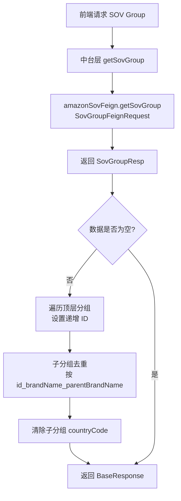

# Amazon 平台模块 功能逻辑文档

> 本文档由 document-automation 工具自动生成，基于源代码、PRD 文档和技术评审文档。
> 生成时间: 2026-04-09 10:22:05
> 准确性评分: 62/100

---


# Amazon 平台模块 功能逻辑文档

## 1. 模块概述

### 1.1 模块职责与定位

Amazon 平台模块是 Pacvue Custom Dashboard 系统中负责 Amazon 平台数据查询与聚合的核心模块，涵盖三大数据域：

1. **Amazon Advertising（广告报表）**：查询 Amazon 广告投放的绩效数据，包括 ACOS、ROAS、CPC、Sales、Spend、CTR、CVR、NTB 系列、SameSku 系列等指标，支持 Profile / Campaign / Keyword / ASIN / AdType / SearchTerm / PT / AmazonChannel / AudienceBidModifier 等多种物料维度的数据聚合。
2. **Amazon SOV（Share of Voice）**：查询品牌和 ASIN 维度的搜索份额数据，支持 Brand 和 ASIN 两种报表视图。
3. **Amazon Product Center（Commerce）**：查询 Amazon 零售/商业数据，支持 Vendor / Seller 两种渠道模式，涵盖 Account / Market / Category / Amazon Category / Brand / Amazon Brand / Product Tag / ASIN 等物料层级。

### 1.2 系统架构位置与上下游关系

```
前端组件层
  │  (pieChart.vue / AmazonChannelScopeSetting.vue / CellItem.vue / store.js / api/index.js)
  ▼
custom-dashboard-api（网关层/中台层）
  │  @AmazonFeignAccessControl 切面路由
  ├──────────────────────────────────────┐
  ▼                                      ▼
custom-dashboard-amazon-rest           custom-dashboard-amazon
(新模块: REST API 查询)                (原模块: SQL 查询)
  │                                      │
  ├─ AmazonRestReportController          ├─ AmazonReportController
  ├─ AmazonReportServiceImpl             ├─ IDayreportCampaignService
  ├─ AbstractDataFetcher 子类            ├─ SovReportController
  │                                      ├─ CommerceReport
  ▼                                      ▼
pacvuemainapiv2                        ClickHouse / SqlServer
amazon-advertising-api                 (MyBatis SQL 查询)
commerce-admin-newui
platform-provider
```

### 1.3 涉及的后端模块

| Maven 模块 | 说明 |
|---|---|
| `custom-dashboard-amazon-rest` | 新模块，通过 REST API 查询 Amazon 广告绩效，contextId: `custom-dashboard-amazon-rest-advertising` |
| `custom-dashboard-amazon` | 原模块，基于 MyBatis SQL 查询 Amazon 广告绩效、SOV、Commerce 数据 |
| `custom-dashboard-api` | 网关/中台层，包含 `@AmazonFeignAccessControl` 切面路由逻辑 |
| `platform-provider` | 物料值读取服务（ASIN / AsinTag / CampaignTag 等从 SqlServer） |

### 1.4 涉及的前端组件

| 组件/文件 | 说明 |
|---|---|
| `AmazonBMTagScopeSetting.vue` | Amazon BM Tag 物料范围设置组件 |
| `AmazonChannelScopeSetting.vue` | Amazon Channel 物料范围设置组件 |
| `CellItem.vue` | 表格单元格渲染组件（含 ActlBid 等指标展示） |
| `pieChart.vue` | 饼图对话框组件，支持 SOV / CommerceASIN / Advertising 多种保存逻辑 |
| `metricsList/common.js` | 指标定义配置（Commerce 下 ProductInfo / Sales 等分类，含 Vendor / Seller 渠道区分） |
| `store.js` | Pinia/Vuex Store，含 `getAmazonChannelListData` / `getCommerceVendorCommerceAmazonCategoryData` |
| `api/index.js` | API 请求封装，含 `getCommerceAmazonCategory` |

### 1.5 部署方式

- `custom-dashboard-amazon-rest` 和 `custom-dashboard-amazon` 作为独立微服务部署
- 通过 Spring Cloud Feign 进行服务间调用
- `custom-dashboard-api` 作为统一网关，通过切面决定路由目标

---

## 2. 用户视角

### 2.1 Amazon Advertising 广告报表查询

#### 场景描述
用户在 Custom Dashboard 中创建或编辑图表时，选择 Amazon 平台作为数据源，配置物料层级（Profile / Campaign / Keyword / ASIN / AdType / SearchTerm / PT / CampaignTag / AmazonChannel 等）和指标（ACOS / ROAS / CPC / Sales / Spend / CTR / CVR 等），系统返回对应的广告绩效数据用于图表渲染。

#### 用户操作流程

1. **进入 Dashboard 编辑页面**：用户点击 Edit Dashboard 或 Create Dashboard。
2. **添加图表**：选择图表类型（Table / Pie / Line / StackBar / GridTable 等）。
3. **选择数据源**：选择 Amazon 平台。
4. **配置物料层级**：
   - 选择物料维度（如 Campaign、Keyword、ASIN 等）
   - 选择物料范围模式：Customize（自定义选择具体物料）/ TopRank / TopMover / BottomRanked
   - 对于 Customize 模式，用户可以搜索并选择具体的物料项
   - 对于 Commerce ASIN，支持批量粘贴 ASIN 进行选择（25Q3 Sprint4 新增）
5. **配置指标**：从指标列表中选择需要展示的指标。
6. **配置筛选条件**：
   - Profile（必选）
   - Campaign Tags（支持 And / Or 条件筛选，25Q4-S2 新增）
   - 时间范围
   - Time Segment（Daily / Weekly / Monthly）
7. **预览与保存**：系统实时查询数据并渲染图表预览，用户确认后保存。

#### UI 交互要点

- **Amazon Channel 物料层级**（25Q4-S5 新增）：在 Cross Retailer 模式下，物料层级新增 Amazon Channel，包含 Search（4 个广告类型）和 DSP（1 个广告类型）。选择 Amazon Channel 后，新增筛选条件：Amazon 需选择 Profile（必选）和 Campaign Tags；DSP 需选择 Advertiser 和 Order Tag。
- **Campaign Tag And/Or 筛选**（25Q4-S2 V1.3 新增）：看板设置中 Campaign Tag 筛选项支持选择 "and" 或 "or" 条件。
- **Search Term 和 PAT 物料层级**（25Q4-S2 V1.0 新增）：Amazon Material Level 增加 Search Term 和 PAT。
- **SOV Keyword 筛选**（25Q4-S2 V1.2 新增）：物料层级 SOV 新增 Keyword 作为筛选项。
- **Weekly 日期展示**（25Q3 Sprint4）：Time Segment 为 Weekly 时，将一周第一天的日期放在"第 xx 周"前面。

#### Figma 设计稿参考

根据 Figma 设计稿信息：
- **Line Chart**：图例区域展示 "Amazon" 标签和 "Sales" 等指标名称
- **Pie Chart**：支持 Instacart 等多平台数据展示，金额格式如 "$23.9K"
- **Grid-table**：表格中展示 "Amazon" 平台标识
- **说明页**：展示 Amazon 平台配置说明

### 2.2 Amazon SOV 数据查询

#### 场景描述
用户查看 Amazon 搜索份额（Share of Voice）数据，支持 Brand 维度和 ASIN 维度的报表查看。

#### 用户操作流程

1. 在 Dashboard 中选择 SOV 数据源。
2. 配置 SOV Market（通过 `getSovMarket` 接口获取可用市场列表）。
3. 配置 SOV Group（通过 `getSovGroup` 接口获取分组信息，支持品牌和父品牌的去重展示）。
4. 选择查看维度：Brand Metric 或 ASIN Metric。
5. 配置时间范围（startDate / endDate 必填）。
6. 系统返回 SOV 报表数据用于图表渲染。

### 2.3 Amazon Product Center（Commerce）数据查询

#### 场景描述
用户查看 Amazon 零售/商业数据，支持 Vendor 和 Seller 两种渠道模式。

#### 支持的物料层级（按模式区分）

| 模式 | 支持的物料层级 |
|---|---|
| Hybrid | Account Summary / Account / Market / Category / Brand |
| Vendor | Account / Market / Category / Amazon Category / Brand / Amazon Brand / Product Tag / ASIN |
| Seller | Account / Market / Category / Amazon Category / Brand / Amazon Brand / ASIN / Product Tag |

#### 新增 Retail Metric（25Q3 Sprint4）

对于 Amazon Profile 层级，新增三个字段（仅 3P Profile 有数据）：
- **Total Orders(3P)**
- **Total CVR(3P)**：计算公式 = Total Orders(3P) / Pageviews(3P)
- **Total AOV(3P)**：计算公式 = Total Revenue / Total Orders(3P)

### 2.4 Template Management（模板管理）

#### 场景描述（25Q4-S1）

用户可以在 Chart Library 中创建、管理和应用图表模板。

#### 用户操作流程

1. **进入 Template Management**：从 Custom Dashboard Home Page 点击 Chart Library 入口。
2. **创建模板**：
   - 点击 Create Template，选择图表类型
   - 选择 Channel 后，对应展示 Distributor View / Program / Dimension
   - 配置 Material Level 和 Metrics（与 Data Source 联动）
   - 填写 Template Name（必填）、Group、Introduction
3. **Quick Create**：勾选模板后，校验物料层级兼容性，创建新 Dashboard。
4. **应用模板**：在 Edit Dashboard 页面点击 Use Template，系统自动过滤不兼容的模板。
5. **模板标签自动生成**：
   - Data Source: Channel + (Distributor View) + Program
   - Material Level
   - Time Segment
   - Find Metric from
   - X-axis Type

---

## 3. 核心 API

### 3.1 Amazon Advertising REST API

#### 3.1.1 查询 Amazon 广告报表（REST 模式）

- **路径**: `POST /queryAmazonReport`
- **Controller**: `AmazonRestReportController`
- **Feign 接口**: `AmazonRestReportFeign`（contextId: `custom-dashboard-amazon-rest-advertising`）
- **参数**: `AdvertisingReportRequest campaignReportRequest`
- **返回值**: `List<AmazonReportModel>`
- **说明**: 通过 REST API 查询 Amazon 广告绩效数据。适用于 Profile / Campaign / Keyword / ASIN 物料的 Customize / TopRank 模式。该接口由 `@AmazonFeignAccessControl` 切面路由到 `custom-dashboard-amazon-rest` 服务。

```java
@RestController
public class AmazonRestReportController implements AmazonRestReportFeign {
    @Autowired
    private AmazonReportServiceImpl amazonReportService;

    @Override
    public List<AmazonReportModel> queryAmazonReport(AdvertisingReportRequest campaignReportRequest) {
        return amazonReportService.queryReport(campaignReportRequest);
    }
}
```

#### 3.1.2 查询 Amazon 广告报表（SQL 模式）

- **路径**: **待确认**
- **Controller**: `AmazonReportController`
- **Feign 接口**: `AmazonReportFeign`
- **参数**: `AdvertisingReportRequest`
- **返回值**: `List<AdvertisingReportView>`（**待确认**）
- **说明**: 原有 SQL 查询模式，用于 TopMover / StackBar / GridTable 等未迁移场景。通过 `IDayreportCampaignService` 执行 MyBatis SQL 查询。

```java
@Slf4j
@RestController
public class AmazonReportController implements AmazonReportFeign {
    @Autowired
    private IDayreportCampaignService dayreportCampaignService;
    // 具体端点方法待确认
}
```

### 3.2 Amazon SOV API

#### 3.2.1 查询 SOV Brand 指标

- **路径**: **待确认**（通过 `SovReportFeign` 定义）
- **Controller**: `SovReportController`（`com.pacvue.amazon.controller` 包）
- **参数**: `SovReportRequest sovReportRequest`
  - `startDate`（必填）：查询开始日期
  - `endDate`（必填）：查询结束日期
- **返回值**: `List<SovBrandReportView>`
- **说明**: 查询 Amazon SOV 品牌维度的报表数据。startDate 和 endDate 为空时抛出 `BusinessException(500, "param is wrong")`。

#### 3.2.2 查询 SOV ASIN 指标

- **路径**: **待确认**（通过 `SovReportFeign` 定义）
- **Controller**: `SovReportController`（`com.pacvue.amazon.controller` 包）
- **参数**: `SovReportRequest sovReportRequest`
  - `startDate`（必填）
  - `endDate`（必填）
- **返回值**: `List<SovAsinReportView>`
- **说明**: 查询 Amazon SOV ASIN 维度的报表数据。

#### 3.2.3 查询 SOV Table 报表

- **路径**: **待确认**
- **Controller**: `SovReportController`
- **参数**: `SovTableReportRequest`
- **返回值**: **待确认**
- **说明**: 从 `ISovReportService` 接口定义推断，支持 Table 格式的 SOV 报表查询。

#### 3.2.4 获取 SOV Market 列表

- **路径**: **待确认**（通过中台层调用 `amazonProductCenterApiFeign.getSovClientMarket()`）
- **参数**: `UserInfo currentUser`
- **返回值**: `BaseResponse<List<SovMarketInfo>>`
- **说明**: 获取当前用户可用的 SOV 市场列表。

#### 3.2.5 获取 SOV Group 列表

- **路径**: **待确认**（通过中台层调用 `amazonSovFeign.getSovGroup()`）
- **参数**: `UserInfo userInfo`
- **返回值**: `BaseResponse<List<SovGroupInfo>>`
- **说明**: 获取 SOV 分组信息。返回数据经过以下处理：
  1. 为每个顶层分组设置递增 ID
  2. 对子分组按 `id + "_" + brandName + "_" + parentBrandName` 进行去重
  3. 去重后清除子分组的 `countryCode` 字段

### 3.3 下游平台 API（通过 Feign 调用）

#### 3.3.1 AmazonMainApiFeign（pacvuemainapiv2）

| 接口路径 | 说明 | 物料维度 |
|---|---|---|
| `/api/Profile/v3/GetProfileChartData` | Profile 图表数据 | Profile |
| `/api/Profile/v3/GetProfilePageData` | Profile 分页数据 | Profile |
| `/api/Profile/v3/GetProfilePageDataTotal` | Profile 汇总数据 | Profile |
| `/api/Campaign/v3/GetCampaignChart` | Campaign 图表数据 | Campaign, AdType |
| `/api/Campaign/v3/GetCampaignPageData` | Campaign 分页数据 | Campaign, AdType |
| `/api/Campaign/v3/GetCampaignPageDataTotal` | Campaign 汇总数据 | Campaign, AdType |
| `/api/Asin/v3/GetAsinChart` | ASIN 图表数据 | ASIN |
| `/api/Asin/v3/GetAsinPageData` | ASIN 分页数据 | ASIN |
| `/api/Asin/v3/GetAsinPageDataTotal` | ASIN 汇总数据 | ASIN |

#### 3.3.2 AmazonAdvertisingApiFeign（amazon-advertising-api）

| 接口路径 | 说明 | 物料维度 |
|---|---|---|
| `/api/Target/GetR...`（**截断，待确认完整路径**） | Target 报表数据 | Keyword, PT |
| `/api/SearchTerm/...`（**待确认**） | SearchTerm 报表数据 | SearchTerm |

#### 3.3.3 Commerce 相关 Feign

| 服务 | 接口 | 说明 |
|---|---|---|
| `commerce-admin-newui` | `getCommerceVendorCategoryForAdvertising` | 获取 Commerce Vendor 品类数据 |
| `amazonProductCenterApiFeign` | `getSovClientMarket` | 获取 SOV 市场列表 |

### 3.4 前端 API 调用

前端通过 `api/index.js` 封装请求：
- `getCommerceAmazonCategory`：获取 Amazon Commerce 品类数据
- Store 中的 `getAmazonChannelListData`：获取 Amazon Channel 列表
- Store 中的 `getCommerceVendorCommerceAmazonCategoryData`：获取 Commerce Vendor 品类数据

---

## 4. 核心业务流程

### 4.1 Amazon 广告报表查询主流程

#### 4.1.1 流程概述

Amazon 广告报表查询采用**二级路由架构**，通过 `@AmazonFeignAccessControl` 切面在中台层（`custom-dashboard-api`）根据策略判定，将请求路由到新模块（`custom-dashboard-amazon-rest`，REST API 查询）或原模块（`custom-dashboard-amazon`，SQL 查询）。

#### 4.1.2 详细流程步骤

**步骤 1：前端发起请求**

前端组件（如 `pieChart.vue`、`AmazonChannelScopeSetting.vue`）通过 `store.js` 调用 `api/index.js` 中封装的 API 方法，构造 `AdvertisingReportRequest` 请求体，包含：
- 平台标识（Amazon）
- 物料维度（scopeType）
- 物料 ID 列表
- 指标列表（metricTypes）
- 时间范围（startDate / endDate）
- Time Segment（Daily / Weekly / Monthly）
- 图表类型（ChartType）
- 物料范围模式（Customize / TopRank / TopMover / BottomRanked）
- Campaign Tag 筛选条件（含 And/Or 操作符）

**步骤 2：中台层接收请求并路由**

`custom-dashboard-api` 网关层接收请求后，`@AmazonFeignAccessControl` 切面拦截调用，执行以下判定逻辑：

1. **`isProd`**：判断当前环境是否为生产环境（测试环境采用新增平台 AmazonNew 进行数据比对）
2. **`isAmazonPlatform`**：确认请求平台为 Amazon
3. **`isSupportedMetricTypes`**：检查请求的指标类型是否被新模块支持
4. **`isTopMoversOrStackedBarOrGridTableChart`**：检查是否为 TopMover / StackBar / GridTable 图表类型

路由策略：
- **`AMAZON_REST_REPORT`**（Query through REST API）：当物料为 Profile / Campaign / Keyword / ASIN，且模式为 Customize / TopRank / BottomRanked 时，路由到 `AmazonRestReportFeign`
- **`AMAZON_REPORT`**（Query through SQL）：TopMover / StackBar / GridTable 图表，或不支持的物料维度，路由到 `AmazonReportFeign`
- **`NONE`**（No policy by default）：默认无策略

**步骤 3a：REST API 查询路径（新模块）**

请求被路由到 `custom-dashboard-amazon-rest` 服务的 `AmazonRestReportController`：

```
AmazonRestReportController.queryAmazonReport(campaignReportRequest)
  → AmazonReportServiceImpl.queryReport(campaignReportRequest)
    → AbstractDataFetcher 子类（按 @ScopeTypeQualifier 物料维度分发）
      → 调用 AmazonMainApiFeign 或 AmazonAdvertisingApiFeign
      → 返回 AmazonReportModel 列表
```

`AmazonReportServiceImpl` 的 `queryReport` 方法内部逻辑：
1. 解析请求参数，确定物料维度（scopeType）
2. 通过 `AbstractDataFetcher` 的策略模式，根据 `@ScopeTypeQualifier` 注解找到对应的子类
3. 子类调用对应的下游 Feign 接口获取数据
4. 将返回数据映射为 `AmazonReportModel`（通过 `@IndicatorField` 注解驱动的指标映射）
5. 返回结果列表

**步骤 3b：SQL 查询路径（原模块）**

请求被路由到 `custom-dashboard-amazon` 服务的 `AmazonReportController`：

```
AmazonReportController → IDayreportCampaignService
  → MyBatis SQL 查询（queryAdvertisingReportSql / queryAdvertisingTotalSql）
  → ClickHouse 数据库
  → 返回 AdvertisingReportView 列表
```

核心 SQL 模块：
- `queryAdvertisingReportSql`：广告报表明细查询
- `queryAdvertisingTotalSql`：广告报表汇总查询

**步骤 4：数据返回与聚合**

中台层接收到平台模块返回的数据后，进行聚合处理（如多物料维度的数据合并、指标计算等），最终返回给前端。

**步骤 5：前端渲染**

前端接收到数据后，根据图表类型（Table / Pie / Line / StackBar / GridTable）进行渲染。

#### 4.1.3 流程图

```mermaid
flowchart TD
    A[前端组件发起请求] --> B[custom-dashboard-api 网关层]
    B --> C{@AmazonFeignAccessControl 切面}
    C -->|isProd & isAmazonPlatform| D{判断物料和图表类型}
    D -->|Profile/Campaign/Keyword/ASIN<br/>+ Customize/TopRank| E[AMAZON_REST_REPORT 策略]
    D -->|TopMover/StackBar/GridTable<br/>或其他物料| F[AMAZON_REPORT 策略]
    D -->|默认| G[NONE 策略]
    
    E --> H[AmazonRestReportFeign]
    H --> I[AmazonRestReportController]
    I --> J[AmazonReportServiceImpl.queryReport]
    J --> K{AbstractDataFetcher<br/>@ScopeTypeQualifier 分发}
    K -->|Profile/Campaign/ASIN| L[AmazonMainApiFeign<br/>pacvuemainapiv2]
    K -->|Keyword/PT/SearchTerm| M[AmazonAdvertisingApiFeign<br/>amazon-advertising-api]
    L --> N[返回 AmazonReportModel]
    M --> N
    
    F --> O[AmazonReportFeign]
    O --> P[AmazonReportController]
    P --> Q[IDayreportCampaignService]
    Q --> R[MyBatis SQL 查询<br/>ClickHouse]
    R --> S[返回 AdvertisingReportView]
    
    N --> T[中台聚合处理]
    S --> T
    T --> U[返回前端渲染]
```

### 4.2 SOV 数据查询流程

#### 4.2.1 详细流程步骤

**步骤 1：前端发起 SOV 查询请求**

用户在 Dashboard 中配置 SOV 数据源，前端构造 `SovReportRequest`，包含 startDate、endDate 及其他筛选条件。

**步骤 2：中台层路由**

SOV 查询不走 REST API 迁移路径，始终路由到 `custom-dashboard-amazon` 模块的 `SovReportController`。

**步骤 3：参数校验**

`SovReportController` 对请求参数进行校验：
```java
if (sovReportRequest.getStartDate() == null || sovReportRequest.getEndDate() == null) {
    throw new BusinessException(500, "param is wrong");
}
```

**步骤 4：调用 Service 层**

根据查询维度调用 `ISovReportService` 的对应方法：
- `queryBrandMetric(sovReportRequest)` → 返回 `List<SovBrandReportView>`
- `queryAsinMetric(sovReportRequest)` → 返回 `List<SovAsinReportView>`

**步骤 5：数据返回**

Service 层查询数据库（**具体查询逻辑待确认**），返回 SOV 报表视图。

#### 4.2.2 SOV Group 获取流程



### 4.3 Campaign Tag And/Or 筛选流程

#### 4.3.1 背景

25Q4-S2 V1.3 新增功能：看板设置中 Campaign Tag 筛选项支持选择 "and" 或 "or" 条件。

#### 4.3.2 改造模式分类

根据技术评审文档，Campaign Tag And/Or 筛选的改造分为以下几种模式：

| 改造模式 | 说明 |
|---|---|
| 模式 0 | 平台接口已支持，中台修改传参即可 |
| 模式 1 | Amazon 未迁移的部分，中台改造 SQL |
| 模式 2 | 平台接口未支持，非 tag 类物料：添加 `campaignTagOperand` 字段 |
| 模式 3 | 平台接口未支持，campaignTag 物料：添加 `performanceCampaignTagOperator` 字段 |

#### 4.3.3 Amazon 平台各物料支持情况

| 物料 | 模式 | 是否支持 And | 改造模式 |
|---|---|---|---|
| Keyword（Customize/TopRank） | REST API | 是 | 模式 0 |
| Keyword（TopMover） | SQL | 否 | 模式 1（中台改造 SQL） |
| ASIN（Customize/TopRank） | REST API | 是 | 模式 0 |
| ASIN（TopMover） | SQL | 否 | 模式 1 |
| Campaign（Customize/TopRank） | REST API | 是 | 模式 0 |
| Campaign（TopMover） | SQL | 否 | 模式 1 |
| Profile（Customize） | REST API | 否 | 模式 2（需平台接口支持） |
| AdType（Customize/TopRank） | REST API | 是 | 模式 0 |
| CampaignTag（Customize） | SQL | 否 | 模式 1 |
| CampaignTag（TopRank/TopMover） | SQL | 否 | 模式 1 |

### 4.4 AbstractDataFetcher 策略分发流程

#### 4.4.1 设计模式说明

`AbstractDataFetcher` 采用**策略模式**，通过 `@ScopeTypeQualifier` 注解标识每个子类负责的物料维度。`AmazonReportServiceImpl` 在运行时根据请求中的 scopeType，查找对应的 `AbstractDataFetcher` 子类实例，委托其执行数据获取。

```mermaid
flowchart TD
    A[AmazonReportServiceImpl.queryReport] --> B{解析 scopeType}
    B -->|Profile| C[ProfileDataFetcher<br/>@ScopeTypeQualifier-Profile]
    B -->|Campaign| D[CampaignDataFetcher<br/>@ScopeTypeQualifier-Campaign]
    B -->|Keyword| E[KeywordDataFetcher<br/>@ScopeTypeQualifier-Keyword]
    B -->|ASIN| F[AsinDataFetcher<br/>@ScopeTypeQualifier-ASIN]
    B -->|Audience| G[AudienceDataFetchDelegate]
    B -->|其他| H[对应 DataFetcher 子类]
    
    C --> I[AmazonMainApiFeign]
    D --> I
    F --> I
    E --> J[AmazonAdvertisingApiFeign]
    G --> K[Audience 专用数据源]
    
    I --> L[返回 AmazonReportModel]
    J --> L
    K --> L
```

#### 4.4.2 AudienceDataFetchDelegate

`AudienceDataFetchDelegate` 是 Audience 数据获取的委托类，使用 `AmazonReportParams` 作为查询参数。该类采用**委托模式**，将 Audience 维度的数据获取逻辑从主流程中解耦。

---

## 5. 数据模型

### 5.1 数据库表结构

#### 5.1.1 ClickHouse 表（绩效数据）

| 表名 | 说明 | 关键字段（推断） |
|---|---|---|
| `dayreportCampaignView_all` | Campaign 维度日报表视图 | profileId, campaignId, date, impressions, clicks, cost, sales 等 |
| `dayreportCampaignPlacementView_all` | Campaign Placement 维度日报表视图 | profileId, campaignId, placement, date 等 |
| `dayreportProductAdView_all` | Product Ad 维度日报表视图 | profileId, campaignId, adGroupId, asin, date 等 |
| `dayreportTargetView_all` | Target 维度日报表视图 | profileId, campaignId, targetId, date 等 |
| `dayreportTargetAggregateView` | Target 聚合视图 | 聚合维度字段 |
| `dayreportSearchTermAggregate_all` | SearchTerm 聚合表 | searchTerm, date 等 |
| `dayreportAsin_all` | ASIN 维度日报表 | asin, date 等 |
| `CampaignHistoryInfoForUsag_all` | Campaign 历史信息（用量） | campaignId, date 等 |
| `Campaign_all` | Campaign 维度表 | campaignId, profileId, name, state, type 等 |
| `Profile_all` | Profile 维度表 | profileId, accountId, countryCode 等 |
| `ProductAd_all` | Product Ad 维度表 | adId, campaignId, adGroupId, asin 等 |
| `TargetingClause_all` | Targeting Clause 维度表 | targetId, campaignId, expression 等 |
| `ExchangeRate_all` | 汇率表 | currencyCode, rate, date 等 |
| `PortfolioAdgroup_all` | Portfolio AdGroup 关联表 | portfolioId, adGroupId 等 |

#### 5.1.2 SqlServer 表（物料/配置数据）

| 表名 | 说明 | 关键字段（推断） |
|---|---|---|
| `ClientKeywordTextTag` | 客户关键词文本标签 | clientId, keywordId, tagId 等 |
| `ClientKeywordTagName` | 客户关键词标签名称 | tagId, tagName 等 |
| `UserProfile` | 用户 Profile 关联 | userId, profileId 等 |
| `Portfolio` | Portfolio 信息 | portfolioId, name 等 |
| `TagPermission` | 标签权限 | tagId, userId, permission 等 |
| `ClientAsinTagName` | 客户 ASIN 标签名称 | tagId, tagName 等 |
| `Campaign` | Campaign 信息 | campaignId, name, state 等 |
| `ProductAd` | Product Ad 信息 | adId, asin 等 |
| `AsinInfo` | ASIN 信息 | asin, title, imageUrl 等 |
| `Keyword` | Keyword 信息 | keywordId, text, matchType 等 |
| `TargetingClause` | Targeting Clause 信息 | targetId, expression 等 |
| `Profile` | Profile 信息 | profileId, accountId 等 |
| `ExchangeRate` | 汇率信息 | currencyCode, rate 等 |
| `PortfolioAdgroup` | Portfolio AdGroup 关联 | portfolioId, adGroupId 等 |

### 5.2 核心 DTO/VO

#### 5.2.1 AmazonReportDataBase（指标映射基类）

```
AmazonReportDataBase
├── 使用 @IndicatorField 注解定义指标字段
├── 指标类型通过 IndicatorType 枚举标识
├── 指标计算类型通过 MetricType 枚举标识
└── 包含所有 Amazon 广告指标字段的定义
```

该类是指标映射的核心基类，通过注解驱动的方式声明每个字段对应的指标元数据。`@IndicatorField` 注解包含指标类型（`IndicatorType`）和计算类型（`MetricType`）等属性。

#### 5.2.2 AmazonReportModel（继承 AmazonReportDataBase）

```java
@Data
@NoArgsConstructor
@EqualsAndHashCode
public class AmazonReportModel extends AmazonReportDataBase {
    // 非指标字段扩展
    // 使用 @JsonAlias 支持多种 JSON 字段名映射
    // 使用 @TimeSegmentField 标注时间分段字段
    // 使用 @Schema 提供 Swagger 文档描述
}
```

包含的非指标字段（推断）：
- 物料标识字段（profileId, campaignId, keywordId, asin 等）
- 物料名称字段（profileName, campaignName 等）
- 时间字段（date, week, month 等，通过 `@TimeSegmentField` 标注）
- 分组字段（adType, placement 等）

#### 5.2.3 AmazonReportModelWrapper（继承 AmazonReportModel）

用于 TopMover 等场景的模型包装，在 `AmazonReportModel` 基础上扩展 TopMover 特有的字段（如变化量、变化率等）。

#### 5.2.4 AdvertisingReportRequest（广告报表通用请求 DTO）

通用的广告报表查询请求对象，包含字段（推断）：
- `platform`：平台标识
- `scopeType`：物料维度类型
- `scopeIds`：物料 ID 列表
- `metricTypes`：请求的指标类型列表
- `startDate` / `endDate`：时间范围
- `timeSegment`：时间分段（Daily / Weekly / Monthly）
- `chartType`：图表类型
- `profileIds`：Profile ID 列表
- `campaignTagIds`：Campaign Tag ID 列表
- `campaignTagOperand`：Campaign Tag 操作符（And / Or）
- `performanceCampaignTagIds`：绩效 Campaign Tag ID 列表
- `performanceCampaignTagOperator`：绩效 Campaign Tag 操作符（And / Or）
- `sortField` / `sortOrder`：排序字段和方向
- `pageIndex` / `pageSize`：分页参数

#### 5.2.5 SovReportRequest（SOV 报表请求 DTO）

SOV 报表查询请求对象，包含字段：
- `startDate`（必填）：查询开始日期
- `endDate`（必填）：查询结束日期
- 其他筛选条件（**待确认**）

#### 5.2.6 SovTableReportRequest（SOV Table 报表请求 DTO）

SOV Table 格式报表的专用请求对象（**具体字段待确认**）。

#### 5.2.7 AmazonReportParams

在 `AudienceDataFetchDelegate` 中使用的报表查询参数对象（**具体字段待确认**）。

### 5.3 核心枚举

#### 5.3.1 IndicatorType

指标类型枚举，用于 `@IndicatorField` 注解，标识字段对应的指标类型（如 ACOS、ROAS、CPC、Sales、Spend、CTR、CVR、NTB 系列、SameSku 系列等）。

#### 5.3.2 MetricType

指标计算类型枚举，标识指标的计算方式（如 SUM、AVG、RATIO 等）。

#### 5.3.3 TimeSegment

时间分段枚举，用于 `@TimeSegmentField` 注解：
- `DAILY`
- `WEEKLY`
- `MONTHLY`

#### 5.3.4 ChartType

图表类型枚举：
- `TABLE`
- `PIE`
- `LINE`（Trend Chart）
- `STACK_BAR`
- `GRID_TABLE`
- 其他（**待确认**）

#### 5.3.5 DataFromType

数据来源类型枚举（在 `SovTest` 中引用）：
- 具体枚举值**待确认**

### 5.4 注解体系

| 注解 | 说明 | 使用位置 |
|---|---|---|
| `@IndicatorProvider` | 标识指标提供者类 | Feign 接口类级别 |
| `@IndicatorMethod` | 标识指标方法 | Feign 接口方法级别 |
| `@IndicatorField` | 标识指标字段，声明指标元数据 | DTO 字段级别（AmazonReportDataBase） |
| `@TimeSegmentField` | 标识时间分段字段 | DTO 字段级别（AmazonReportModel） |
| `@ScopeTypeQualifier` | 标识 DataFetcher 子类负责的物料维度 | AbstractDataFetcher 子类级别 |
| `@AmazonFeignAccessControl` | 切面注解，控制 Amazon Feign 路由策略 | 中台层方法级别 |
| `@ReportMetrics` | 报表指标注解 | AmazonReportController 方法级别 |
| `@FeignMethodCache` | Feign 方法缓存控制 | Feign 接口方法级别 |

---

## 6. 平台差异

### 6.1 Amazon vs 其他平台的 SOV 实现差异

从代码片段可以看到，SOV 功能在多个平台有独立实现：

| 平台 | Controller 包 | Feign 接口 | Brand 返回类型 | ASIN 返回类型 |
|---|---|---|---|---|
| Amazon | `com.pacvue.amazon.controller` | `SovReportFeign` | `SovBrandReportView` | `SovAsinReportView` |
| Walmart | `com.pacvue.walmart.controller`（**推断**） | `WalmartSovReportFeign` | `WalmartSovBrandReportView` | `WalmartSovAsinReportView` |
| Instacart | `com.pacvue.instacart.controller` | `InstacartSovReportFeign` | `InstacartSovBrandReportView` | `InstacartSovAsinReportView` |

所有平台的 SOV Controller 共享相同的参数校验逻辑（startDate/endDate 非空校验），但返回的视图类型不同，反映了各平台 SOV 数据结构的差异。

### 6.2 Amazon Advertising 二级路由策略

Amazon 平台独有的二级路由机制，其他平台不涉及：

| 策略 | 路由目标 | 适用场景 |
|---|---|---|
| `AMAZON_REST_REPORT` | `custom-dashboard-amazon-rest` | Profile/Campaign/Keyword/ASIN 的 Customize/TopRank 模式 |
| `AMAZON_REPORT` | `custom-dashboard-amazon` | TopMover/StackBar/GridTable，以及其他物料维度 |
| `NONE` | 默认 | 无特殊策略 |

### 6.3 Campaign Tag And/Or 支持的平台差异

| 平台 | 物料 | Customize/TopRank | TopMover | 改造模式 |
|---|---|---|---|---|
| Amazon | Keyword/ASIN/Campaign/AdType | 已支持 And | 不支持 | 模式 0 / 模式 1 |
| Amazon | Profile | 不支持 | - | 模式 2 |
| Amazon | CampaignTag | 不支持 | 不支持 | 模式 1 |
| Walmart | Campaign/Keyword/Item/SearchTerm | 已支持 And | - | 模式 0 |
| Walmart | Profile | 不支持 | - | 模式 2 |
| Walmart | CampaignTag | 不支持 | - | 模式 3 |
| Walmart | Keyword（TopMover） | 不支持 | 不支持 | 模式 2 |
| Instacart | Campaign/Keyword/Product | 已支持 And | - | 模式 0 |
| Instacart | Profile | 不支持 | - | 模式 2 |
| Instacart | CampaignTag | 不支持 | - | 模式 3 |
| SamsClub | Campaign/Keyword/Item/SearchTerm | 已支持 And | - | 模式 0 |
| SamsClub | Profile | 不支持 | - | 模式 2 |
| SamsClub | CampaignTag | 不支持 | - | 模式 3 |

### 6.4 Commerce 模式差异

| 模式 | 支持的物料层级 | 说明 |
|---|---|---|
| Hybrid | Account Summary / Account / Market / Category / Brand | 混合模式，物料层级较少 |
| Vendor | Account / Market / Category / Amazon Category / Brand / Amazon Brand / Product Tag / ASIN | Vendor 模式，支持 Amazon Category 和 Amazon Brand |
| Seller | Account / Market / Category / Amazon Category / Brand / Amazon Brand / ASIN / Product Tag | Seller 模式，ASIN 和 Product Tag 顺序与 Vendor 不同 |

### 6.5 Amazon Channel 指标映射

Amazon Channel 物料层级（25Q4-S5 新增）包含：
- **Search 广告类型**（4 个）：对应 Amazon Advertising 的 SP / SB / SD / SBV（**具体枚举值待确认**）
- **DSP 广告类型**（1 个）：对应 Amazon DSP

在 Cross Retailer 模式下：
- Table 图表：支持选中所有指标
- Pie 图表：仅可选中数值类型（数字 + 货币）的指标
- 物料 Scope 仅支持 Customize 模式

---

## 7. 配置与依赖

### 7.1 Feign 下游服务依赖

| Feign 接口 | 服务名 | contextId | 说明 |
|---|---|---|---|
| `AmazonRestReportFeign` | `custom-dashboard-amazon-rest` | `custom-dashboard-amazon-rest-advertising` | 新模块 REST API 查询 |
| `AmazonReportFeign` | **待确认** | **待确认** | 原模块 SQL 查询 |
| `AmazonMainApiFeign` | `pacvuemainapiv2` | **待确认** | Profile/Campaign/ASIN 接口 |
| `AmazonAdvertisingApiFeign` | `amazon-advertising-api` | **待确认** | Target/SearchTerm 接口 |
| `amazonProductCenterApiFeign` | `commerce-admin-newui` | **待确认** | Commerce 数据（getSovClientMarket 等） |
| `amazonSovFeign` | **待确认** | **待确认** | SOV Group 数据 |
| `platform-provider` | `platform-provider` | **待确认** | 物料值读取（ASIN/AsinTag/CampaignTag 从 SqlServer） |

### 7.2 缓存策略

- **`@FeignMethodCache(forceRefresh = true)`**：用于 Feign 接口方法级别的短时缓存控制。`forceRefresh = true` 表示强制刷新缓存，不使用已缓存的结果。
- 具体的 Redis key 格式和过期时间**待确认**。

### 7.3 关键配置项

- **环境判定**：`isProd` 配置用于区分生产环境和测试环境，测试环境采用 AmazonNew 平台进行数据比对。
- 其他 Apollo/application.yml 配置项**待确认**。

### 7.4 消息队列

当前代码片段中未发现 Kafka 或其他消息队列的使用。**待确认**是否有异步数据处理场景。

---

## 8. 版本演进

### 8.1 版本时间线

| 版本/Sprint | 时间 | 主要变更 |
|---|---|---|
| **Custom Dashboard V2.8** | - | 新增 Ad Type 平铺展示功能；`custom-dashboard-amazon` 模块基于 MyBatis 模块化 SQL 实现广告绩效查询（核心 SQL: `queryAdvertisingReportSql` / `queryAdvertisingTotalSql`） |
| **25Q2 Sprint 6** | - | 1. Amazon CampaignTag 下新增 targetXX 指标（targetACOS、targetROAS）<br/>2. 亚马逊 Customize 模式迁移到 REST API（新增 `custom-dashboard-api-rest` 模块）<br/>3. 新增 Dashboard Group 功能<br/>4. 搜索结果排序优化 |
| **25Q3 Sprint 3** | - | 1. Integrate with custom metric<br/>2. NTB 数据计算逻辑修改<br/>3. Pie Chart 支持超过 10 条数据<br/>4. Table 和 Overview 的 POP/YOY 可随时间联动<br/>5. 所有 Chart 支持设置为全屏 |
| **25Q3 Sprint 4** | - | 1. 新增更多 Retail Metric（Total Orders(3P) / Total CVR(3P) / Total AOV(3P)）<br/>2. Commerce 支持批量粘贴 ASIN<br/>3. Weekly 展示第一天日期 |
| **25Q4 Sprint 1** | - | Template Management（Chart Library）功能上线，支持模板创建/管理/应用 |
| **25Q4 Sprint 2** | 2025-09-10 ~ 2025-10-27 | 1. Amazon Material Level 增加 Search Term 和 PAT<br/>2. Chart 增加不随 Dashboard 联动的 date filter<br/>3. Table 图表 Total 行支持 YOY 及 POP 比较<br/>4. Comparison 图表物料层级为 Tag 时支持隐藏父 Tag<br/>5. SOV 新增 Keyword 筛选项<br/>6. Campaign Tag 筛选支持 And/Or 条件 |
| **25Q4 Sprint 4** | - | Amazon CK（ClickHouse）迁移回归测试，确认 Custom Dashboard 不受影响 |
| **25Q4 Sprint 5** | - | Cross Retailer 物料层级新增 Amazon Channel（Search + DSP） |

### 8.2 架构演进：SQL 查询 → REST API 查询

**V2.8 及之前**：所有 Amazon 广告绩效查询通过 `custom-dashboard-amazon` 模块的 MyBatis SQL 直接查询 ClickHouse。

**25Q2 Sprint 6 起**：引入 `custom-dashboard-api-rest` 新模块，将 Profile / Campaign / Keyword / ASIN 四种物料的 Customize / TopRank 模式迁移到 REST API 查询路径。通过 `@AmazonFeignAccessControl` 切面实现二级路由，保持向后兼容。

**迁移范围**：
- ✅ 已迁移：Profile / Campaign / Keyword / ASIN 的 Customize / TopRank / BottomRanked
- ❌ 未迁移：TopMover / StackBar / GridTable 图表，以及 SearchTerm / PT / CampaignTag / AmazonChannel / AudienceBidModifier 等物料维度

### 8.3 待优化项与技术债务

1. **物料值迁移 Doris**：根据备忘文档，物料值目前未迁移到 Doris，物料接口基本没有开发只有测试。预估开发工作量：
   - `custom-dashboard-api`：1~2d（重写物料接口，复制性高）
   - `custom-dashboard-amazon-rest`：1d（ASIN / AsinTag / CampaignTag 物料从 SqlServer 读取）

2. **绩效值迁移**：实现 `custom-dashboard-amazon` 模块 SQL 查询亚马逊绩效的迁移，预估开发工作量 5d（场景多坑多），测试工作量 2.5d。

3. **未迁移的物料维度**：SearchTerm / PT / CampaignTag / AmazonChannel / AudienceBidModifier 等物料维度仍走 SQL 查询路径，后续需逐步迁移。

4. **TopMover / StackBar / GridTable 迁移**：这三种图表类型的查询逻辑仍在原模块中，后续需评估迁移方案。

5. **Campaign Tag And/Or 全平台支持**：部分平台和物料组合尚未支持 And 操作，需逐步推进平台接口改造。

---

## 9. 已知问题与边界情况

### 9.1 参数校验与异常处理

1. **SOV 日期参数校验**：`SovReportController` 中对 `startDate` 和 `endDate` 进行非空校验，为空时抛出 `BusinessException(500, "param is wrong")`。该校验逻辑在 Amazon、Walmart、Instacart 三个平台的 SOV Controller 中完全一致。

2. **二级路由环境判定**：`@AmazonFeignAccessControl` 切面中的 `isProd` 判定用于区分生产和测试环境。测试环境使用 AmazonNew 平台进行数据比对，需注意环境切换时的路由行为差异。

### 9.2 数据一致性

1. **REST API 与 SQL 查询结果一致性**：由于 Customize / TopRank 模式已迁移到 REST API 查询，而 TopMover 等仍走 SQL 查询，同一物料在不同图表类型下可能走不同的数据路径，需确保数据一致性。

2. **SOV Group 去重逻辑**：`getSovGroup` 方法中对子分组按 `id + "_" + brandName + "_" + parentBrandName` 进行去重，如果存在同 ID 不同品牌名的情况，可能导致数据丢失。去重后取 `list.get(0)`，即保留第一条记录。

### 9.3 性能边界

1. **Pie Chart 数据量**：25Q3 Sprint3 新增 Pie Chart 支持超过 10 条数据，需注意大数据量下的渲染性能。

2. **批量粘贴 ASIN**：25Q3 Sprint4 新增 Commerce ASIN 批量粘贴功能，需注意单次粘贴的 ASIN 数量上限（**待确认**）。

3. **Campaign Tag And 操作性能**：And 操作需要对多个 Tag 取交集，当 Tag 数量较多时可能影响查询性能，特别是在 SQL 查询模式下。

### 9.4 兼容性问题

1. **AmazonNew 平台**：测试环境新增的 AmazonNew 平台仅用于数据比对，不应出现在生产环境中。需确保 `isProd` 判定逻辑正确。

2. **Cross Retailer 模式限制**：Amazon Channel 在 Cross Retailer 模式下，物料 Scope 仅支持 Customize 模式，不支持 TopRank / TopMover 等模式。

3. **Commerce 模式兼容**：Hybrid / Vendor / Seller 三种模式支持的物料层级不同，前端需根据模式动态调整可选物料列表。

### 9.5 代码中的 TODO/FIXME

当前提供的代码片段中未发现明确的 TODO 或 FIXME 注释。但根据技术评审文档中的备忘信息，以下工作项属于待完成状态：
- 物料值迁移 Doris
- 绩效值 SQL 查询迁移
- 全物料场景接口验证

---

*文档生成时间：基于提供的代码片段和文档资料*
*标注"待确认"的内容需要进一步查阅完整代码或与开发团队确认*

---

> **自动审核备注**: 准确性评分 62/100
>
> **待修正项**:
> - [error] 文档描述 Amazon SovReportController 的返回值为 `List<SovBrandReportView>`，但代码中 Amazon 的 SovReportController 实现的是 `SovReportFeign` 接口，其 ISovReportService 确实返回 `SovBrandReportView`。然而文档中描述的 startDate/endDate 校验逻辑（抛出 BusinessException(500, 'param is wrong')）实际出现在 Walmart 的 SovReportController（实现 WalmartSovReportFeign）中，而非 Amazon 的 SovReportController。代码片段中 Amazon 的 SovReportController 没有展示具体方法体，无法确认其是否有相同的参数校验逻辑。文档将 Walmart 的校验逻辑错误地归属到了 Amazon SOV 接口。
> - [error] 文档声称 API 路径为 `POST /queryAmazonReport`，但代码片段中 AmazonRestReportController 只展示了类声明和 implements AmazonRestReportFeign，没有展示任何 @RequestMapping/@PostMapping 注解。由于该 Controller 实现 Feign 接口，实际路径定义在 AmazonRestReportFeign 接口上，代码片段中未提供该接口的定义。文档中的路径 `/queryAmazonReport` 无法从提供的代码中验证，可能是臆造的。
> - [warning] 文档中的代码示例展示了 `queryAmazonReport` 方法的实现，但实际代码片段中 AmazonRestReportController 只有类声明，没有展示方法体。文档中的代码示例可能是根据 Feign 接口推断的，但方法名 `queryReport` 的调用（`amazonReportService.queryReport(campaignReportRequest)`）无法从提供的代码中直接验证。
> - [warning] 文档在 3.2.2 节内容被截断，未完成。这导致 SOV ASIN 指标的 API 文档不完整。
> - [warning] 架构图中列出了 `CommerceReport` 作为 custom-dashboard-amazon 模块的组件，但提供的代码片段中没有任何 CommerceReport 相关的代码。这个类名无法验证。


---

*本文档由 AI 自动生成，如有不准确之处请以源代码为准。标注"待确认"的内容需要人工核实。*