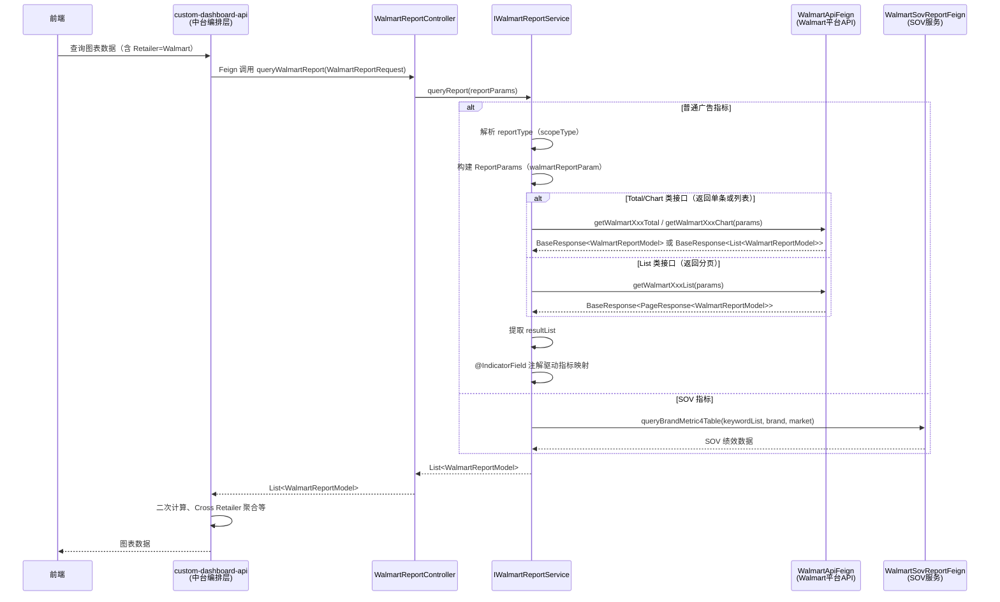
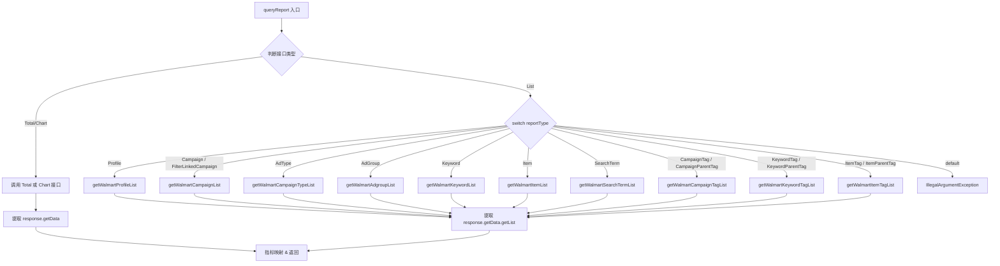
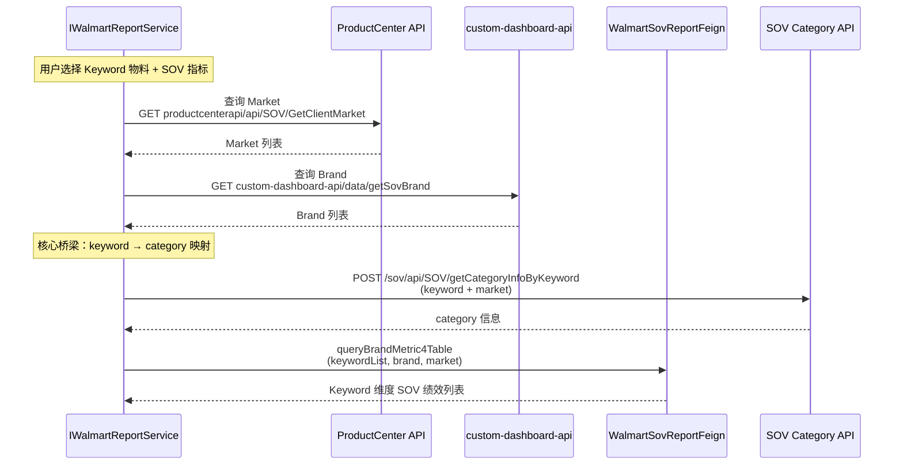

# Walmart 平台模块 功能逻辑文档

> 本文档由 document-automation 工具自动生成，基于源代码、PRD 文档和技术评审文档。
> 生成时间: 2026-04-07 16:19:50
> 准确性评分: 未验证/100

---


# Walmart 平台模块 功能逻辑文档

## 1. 模块概述

### 1.1 职责与定位

Walmart 平台模块是 Pacvue Custom Dashboard 系统中负责 **Walmart 广告数据查询与指标映射** 的平台适配层。其核心职责包括：

1. **数据查询代理**：通过 Feign 远程调用 Walmart 平台底层 API（`/api/Report/*` 系列接口），获取各层级（Profile、Campaign、Keyword、Item、SearchTerm、CampaignTag、AdGroup 等）的广告绩效数据。
2. **指标字段映射**：通过 `@IndicatorField` 注解 + `MetricType` 枚举，将 Walmart 平台返回的原始字段名映射为 Custom Dashboard 统一的指标体系，使上层图表渲染逻辑无需感知平台差异。
3. **SOV 数据查询**：通过 `WalmartSovReportFeign` 提供 Walmart 平台的 Share of Voice（SOV）指标查询能力，支持 Keyword Level 的 Brand SOV 指标。
4. **对外暴露 Feign 接口**：通过 `WalmartReportFeign` 向中台（custom-dashboard-api）暴露统一的报表查询入口，供中台编排调用。

### 1.2 系统架构位置

```
┌─────────────────────────────────────────────────────────────────┐
│                        前端 / HQ 页面                            │
└──────────────────────────┬──────────────────────────────────────┘
                           │ HTTP
                           ▼
┌─────────────────────────────────────────────────────────────────┐
│              custom-dashboard-api（中台编排层）                    │
│   - 图表配置解析、物料策略路由、Cross Retailer 聚合               │
│   - 调用各平台模块的 Feign 接口                                   │
└──────────┬──────────────────────────────────────────────────────┘
           │ Feign (WalmartReportFeign)
           ▼
┌─────────────────────────────────────────────────────────────────┐
│           custom-dashboard-walmart（本模块）                      │
│   - WalmartReportController                                      │
│   - IWalmartReportService（接口 + 实现）                          │
│   - @IndicatorField 指标映射                                     │
│   - AdGroupStrategy 等物料策略                                    │
└──────────┬────────────────────────┬─────────────────────────────┘
           │ Feign (WalmartApiFeign) │ Feign (WalmartSovReportFeign)
           ▼                        ▼
┌──────────────────────┐  ┌──────────────────────────────────────┐
│  Walmart 平台 API     │  │  SOV Service                         │
│  /api/Report/*        │  │  /sov/api/SOV/*                      │
└──────────────────────┘  └──────────────────────────────────────┘
```

### 1.3 涉及的后端模块

| 模块 | Maven Artifact（推测） | 说明 |
|------|----------------------|------|
| `custom-dashboard-walmart` | `com.pacvue:custom-dashboard-walmart` | 本模块，Walmart 平台适配层 |
| `custom-dashboard-api` | `com.pacvue:custom-dashboard-api` | 中台编排层，调用本模块 |
| `custom-dashboard-feign` | `com.pacvue:custom-dashboard-feign`（待确认） | 存放 `WalmartReportFeign`、DTO 等公共定义 |

### 1.4 涉及的前端组件

前端组件待确认。本模块为纯后端服务，前端通过中台 API 间接消费本模块数据。

### 1.5 包结构

```
com.pacvue.walmart
├── controller
│   └── WalmartReportController        // REST 控制器，实现 WalmartReportFeign
├── service
│   ├── IWalmartReportService           // 服务接口
│   └── impl
│       └── WalmartReportServiceImpl    // 服务实现（待确认类名）
└── strategy
    └── AdGroupStrategy                 // AdGroup 物料策略（Confluence 提及）

com.pacvue.feign
├── dto
│   ├── request.walmart
│   │   ├── WalmartReportRequest        // 对外请求 DTO
│   │   └── ReportParams                // 调用 Walmart API 的内部请求参数
│   └── response.walmart
│       └── WalmartReportModel          // 报表数据模型，含 @IndicatorField 注解
├── walmart
│   ├── WalmartReportFeign              // 对外暴露的 Feign 接口
│   ├── WalmartApiFeign                 // 调用 Walmart 平台 API 的 Feign 客户端
│   └── WalmartSovReportFeign           // Walmart SOV 报表 Feign 接口
└── common
    ├── BaseResponse                    // 通用响应包装
    ├── PageResponse                    // 分页响应包装
    ├── IndicatorField                  // 指标映射注解
    └── MetricType                      // 指标类型枚举
```

---

## 2. 用户视角

### 2.1 功能场景

基于 PRD 文档，Walmart 平台模块支撑以下用户场景：

#### 场景一：Walmart 广告绩效查看

用户在 Custom Dashboard 中创建图表（Trend Chart、Comparison Chart、Table、Pie Chart 等），选择 Walmart 作为 Retailer，选择不同的物料层级（Profile、Campaign、Keyword、Item、SearchTerm、CampaignTag、AdGroup）和指标（Impressions、Clicks、Spend、Sales、ROAS、ACOS 等），查看 Walmart 广告绩效数据。

#### 场景二：Ad Type 维度分析（V2.8）

用户选择 Ad Type 作为 Material Level，Walmart 支持的 Ad Type 包括：**SP（Sponsored Products）、SB（Sponsored Brands）、SV（Sponsored Video）、Display**。系统将按 Ad Type 维度聚合展示绩效数据。

#### 场景三：Cross Retailer 对比（V2.4）

用户在 Cross Retailer 模式下，将 Walmart 与 Amazon、Instacart 等平台的数据放在同一图表中对比。本模块负责提供 Walmart 侧的数据，中台负责跨平台聚合。

#### 场景四：Campaign Tag 筛选（2026Q1S1）

用户在选择 ASIN/Keyword 物料时，可以通过 Campaign Tag 进行筛选，缩小数据查询范围。Walmart 平台的 Item 和 Keyword 物料均支持此筛选。

#### 场景五：AdGroup 物料层级（2026Q1S1）

用户可以选择 AdGroup 作为物料层级，在 Trend Chart 和 Table 的 customize/ranked 模式下查看 AdGroup 维度的绩效数据。AdGroup 以 `campaignId + adGroupId` 作为唯一标识。

#### 场景六：Keyword Level Brand SOV 指标（2025Q4S6）

用户选择 Keyword 物料并选择 SOV 指标时，系统通过 `WalmartSovReportFeign` 查询 Walmart 的 SOV 绩效数据。用户需要先选择 Market 和 Brand，系统传入 keywordList、brand、market 查询 SOV 数据。

#### 场景七：Online Same SKU Sales 指标（2026Q1S5）

Walmart 新增 `Online Same SKU Sales` 和 `Online Same SKU Sale Units` 两个指标，分别映射自 Walmart API 的 `totalPurchaseSales` 和 `totalPurchaseUnits` 字段。

#### 场景八：Grid Table 二维交叉分析（25Q2 Sprint3）

用户可以创建 Grid Table，选择一个指标，横向和纵向分别选择物料层级（如 Profile × Campaign Tag），查看二者交集的数据。Walmart 平台数据作为数据源之一参与此场景。

### 2.2 用户操作流程

1. 用户进入 Custom Dashboard（或 Executive Hub / HQ）
2. 创建或编辑图表，选择 Retailer 为 **Walmart**
3. 选择物料层级（Profile / Campaign / Keyword / Item / SearchTerm / CampaignTag / AdGroup / Ad Type）
4. 选择具体物料范围（如特定的 Campaign Tag、Profile 等）
5. 选择指标（Impressions、Clicks、Spend、Sales、ROAS、ACOS、Online Same SKU Sales 等）
6. 选择时间范围和对比模式（YOY / POP / 自定义）
7. 前端向中台发起查询请求
8. 中台路由到本模块，本模块调用 Walmart 平台 API 获取数据
9. 数据经指标映射后返回，前端渲染图表

### 2.3 UI 交互要点

- **Ad Type 选择**：Walmart 支持 SP、SB、SV、Display 四种 Ad Type，前端需在 Ad Type 下拉框中展示这四种选项
- **AdGroup 物料**：由于 AdGroup 数量可能很多，物料下拉框需支持 Filter 且后台限制 300 条；聚焦 Table 和 Trend 时需显示 `campaignName`
- **SOV 指标**：选择 Keyword 物料 + SOV 指标时，需额外展示 Market 和 Brand 选择器
- **Campaign Tag 筛选**：在 Item/Keyword 物料选择时，新增 Campaign Tag 筛选条件

---

## 3. 核心 API

### 3.1 对外暴露的 Feign 接口（WalmartReportFeign）

本模块通过 `WalmartReportFeign` 接口对外暴露服务，供中台（custom-dashboard-api）通过 Feign 调用。

| 方法 | HTTP Method | 路径 | 说明 |
|------|------------|------|------|
| `queryWalmartReport` | POST | 待确认（由 WalmartReportFeign 接口定义） | 查询 Walmart 广告报表数据 |

**请求参数**：`WalmartReportRequest reportParams`

**返回值**：`List<WalmartReportModel>`

> **说明**：具体的 Feign 路径定义在 `WalmartReportFeign` 接口上，通过 `@FeignClient` 和 `@PostMapping` 注解指定，当前代码片段中未完整展示路径，标记为待确认。

### 3.2 调用 Walmart 平台 API 的 Feign 接口（WalmartApiFeign）

本模块内部通过 `WalmartApiFeign` 调用 Walmart 平台底层 API，所有接口均接收 `ReportParams` 参数。

#### 3.2.1 Profile 相关接口

| 方法 | HTTP Method | 路径 | 返回类型 | 说明 |
|------|------------|------|---------|------|
| `getWalmartProfileList` | POST | `/api/Report/profile/list` | `BaseResponse<PageResponse<WalmartReportModel>>` | Profile 列表（分页） |
| `getWalmartProfileTotal` | POST | `/api/Report/profile/total` | `BaseResponse<WalmartReportModel>` | Profile 汇总 |

#### 3.2.2 Campaign 相关接口

| 方法 | HTTP Method | 路径 | 返回类型 | 说明 |
|------|------------|------|---------|------|
| `getWalmartCampaignList` | POST | 待确认 | `BaseResponse<PageResponse<WalmartReportModel>>` | Campaign 列表 |
| `getWalmartCampaignTypeList` | POST | 待确认 | `BaseResponse<PageResponse<WalmartReportModel>>` | Campaign Type（Ad Type）列表 |

#### 3.2.3 AdGroup 相关接口

| 方法 | HTTP Method | 路径 | 返回类型 | 说明 |
|------|------------|------|---------|------|
| `getWalmartAdgroupList` | POST | 待确认 | `BaseResponse<PageResponse<WalmartReportModel>>` | AdGroup 列表 |
| `getWalmartAdgroupTotal` | POST | `/api/Report/adGroup/total` | `BaseResponse<WalmartReportModel>` | AdGroup 汇总 |

#### 3.2.4 Keyword 相关接口

| 方法 | HTTP Method | 路径 | 返回类型 | 说明 |
|------|------------|------|---------|------|
| `getWalmartKeywordList` | POST | `/api/Report/keyword/list` | `BaseResponse<PageResponse<WalmartReportModel>>` | Keyword 列表（分页） |
| `getWalmartKeywordChart` | POST | `/api/Report/keywordChart` | `BaseResponse<List<WalmartReportModel>>` | Keyword 图表数据 |
| `getWalmartKeywordTotal` | POST | `/api/Report/keyword/total` | `BaseResponse<WalmartReportModel>` | Keyword 汇总 |
| `getWalmartKeywordTopMovers` | POST | `/api/report/default/keyword/getKeywordTopMovers` | `BaseResponse<List<WalmartReportModel>>` | Keyword Top Movers |

#### 3.2.5 Item 相关接口

| 方法 | HTTP Method | 路径 | 返回类型 | 说明 |
|------|------------|------|---------|------|
| `getWalmartItemList` | POST | `/api/Report/adItem/list` | `BaseResponse<PageResponse<WalmartReportModel>>` | Item 列表（分页） |
| `getWalmartAdItemChart` | POST | `/api/Report/adItemChart` | `BaseResponse<List<WalmartReportModel>>` | Item 图表数据 |
| `getWalmartItemTotal` | POST | `/api/Report/adItem/total` | `BaseResponse<WalmartReportModel>` | Item 汇总 |

#### 3.2.6 SearchTerm 相关接口

| 方法 | HTTP Method | 路径 | 返回类型 | 说明 |
|------|------------|------|---------|------|
| `getWalmartSearchTermList` | POST | `/api/Report/searchTerm/list` | `BaseResponse<PageResponse<WalmartReportModel>>` | SearchTerm 列表（分页） |
| `getWalmartSearchTermTotal` | POST | `/api/Report/searchTerm/total` | `BaseResponse<WalmartReportModel>` | SearchTerm 汇总 |

#### 3.2.7 CampaignTag 相关接口

| 方法 | HTTP Method | 路径 | 返回类型 | 说明 |
|------|------------|------|---------|------|
| `getWalmartCampaignTagList` | POST | `/api/Report/tag/list` | `BaseResponse<PageResponse<WalmartReportModel>>` | CampaignTag 列表（分页） |
| `getWalmartCampaignTagTotal` | POST | `/api/Report/tag/total` | `BaseResponse<WalmartReportModel>` | CampaignTag 汇总 |
| `getWalmartAnalysisChart` | POST | `/api/Report/analysisChart` | `BaseResponse<List<WalmartReportModel>>` | 分析图表 |

#### 3.2.8 Tag 相关扩展接口

| 方法 | HTTP Method | 路径 | 返回类型 | 说明 |
|------|------------|------|---------|------|
| `getWalmartKeywordTagList` | POST | 待确认 | `BaseResponse<PageResponse<WalmartReportModel>>` | Keyword Tag 列表 |
| `getWalmartItemTagList` | POST | 待确认 | `BaseResponse<PageResponse<WalmartReportModel>>` | Item Tag 列表 |

> **注**：Confluence 还提及 `/api/Report/tagChart`（CampaignTag 图表）、`/api/Report/subTag`（CampaignTag 子标签）、`/api/Report/chart`（通用图表）等接口，代码片段中未完整展示。

### 3.3 SOV 报表 Feign 接口（WalmartSovReportFeign）

| 方法 | HTTP Method | 路径 | 说明 |
|------|------------|------|------|
| `queryBrandMetric4Table` | POST | 待确认 | 查询 Walmart Keyword Level 的 Brand SOV 指标 |

**入参**：keywordList、brand、market（具体 DTO 结构待确认）

**返回值**：keyword 维度的 SOV 绩效列表（具体结构待确认）

### 3.4 前端调用方式

前端不直接调用本模块。前端通过中台（custom-dashboard-api）的统一图表查询接口发起请求，中台根据 Retailer 类型路由到本模块的 `WalmartReportFeign`。

---

## 4. 核心业务流程

### 4.1 主流程：Walmart 报表数据查询



### 4.2 报表类型路由逻辑

`IWalmartReportService` 的实现类中，根据 `reportType`（scopeType）使用 **switch 表达式** 路由到不同的 Feign 接口。从代码片段可以看到，路由逻辑分为两大类：

#### 4.2.1 返回列表/单条的接口（Total/Chart 类）

这类接口返回 `BaseResponse<WalmartReportModel>` 或 `BaseResponse<List<WalmartReportModel>>`，用于汇总数据和图表数据查询。具体路由关系待确认（代码片段中仅展示了 List 类的 switch 分支）。

#### 4.2.2 返回分页的接口（List 类）

这类接口返回 `BaseResponse<PageResponse<WalmartReportModel>>`，用于列表数据查询。路由关系如下：

| reportType 枚举值 | 调用的 Feign 方法 |
|-------------------|------------------|
| `Profile` | `walmartApiFeign.getWalmartProfileList(params)` |
| `Campaign` / `FilterLinkedCampaign` | `walmartApiFeign.getWalmartCampaignList(params)` |
| `AdType` | `walmartApiFeign.getWalmartCampaignTypeList(params)` |
| `AdGroup` | `walmartApiFeign.getWalmartAdgroupList(params)` |
| `Keyword` | `walmartApiFeign.getWalmartKeywordList(params)` |
| `Item` | `walmartApiFeign.getWalmartItemList(params)` |
| `SearchTerm` | `walmartApiFeign.getWalmartSearchTermList(params)` |
| `CampaignTag` / `CampaignParentTag` | `walmartApiFeign.getWalmartCampaignTagList(params)` |
| `KeywordTag` / `KeywordParentTag` | `walmartApiFeign.getWalmartKeywordTagList(params)` |
| `ItemTag` / `ItemParentTag` | `walmartApiFeign.getWalmartItemTagList(params)` |
| 其他 | 抛出 `IllegalArgumentException("Invalid scopeType type: " + reportType)` |



### 4.3 指标映射机制

本模块采用 **注解驱动的指标映射** 模式，核心组件包括：

1. **`@IndicatorField` 注解**：标注在 `WalmartReportModel` 的字段上，声明该字段对应的统一指标类型
2. **`MetricType` 枚举**：定义系统统一的指标类型标识

映射过程：
- Walmart 平台 API 返回的原始数据填充到 `WalmartReportModel` 的各字段中
- 上层（中台）通过反射读取 `@IndicatorField` 注解，将平台字段值映射到统一的 `MetricType` 指标体系中
- 这使得不同平台（Amazon、Walmart、Instacart 等）的数据可以在 Cross Retailer 场景下统一处理

### 4.4 AdGroup 物料策略

根据技术评审文档（2026Q1S1），AdGroup 物料引入了 `AdGroupStrategy` 策略类：

- **唯一主键**：`campaignId + adGroupId`
- **入参要求**：需要增加 `"WALMART_CAMPAIGN"` 参数
- **展示要求**：聚焦 Table 和 Trend 时显示 `campaignName`
- **联动规则**：与 Profile、CampaignTag 相关联，同 Campaign 的联动逻辑
- **物料下拉框**：URL 为 `/data/getAdgroup`，需支持 Filter 且后台限制 300 条

### 4.5 SOV 数据查询流程



### 4.6 关键设计模式

| 设计模式 | 应用场景 | 说明 |
|---------|---------|------|
| **Feign 远程调用代理模式** | WalmartApiFeign、WalmartSovReportFeign | 通过声明式 Feign 接口封装 HTTP 调用，解耦服务间通信 |
| **接口-实现分离** | IWalmartReportService + 实现类 | 面向接口编程，便于测试和替换实现 |
| **注解驱动的指标映射** | @IndicatorField + MetricType | 通过注解声明字段与统一指标的映射关系，避免硬编码 |
| **策略模式** | AdGroupStrategy 等物料策略类 | 不同物料层级的查询逻辑封装为独立策略，由中台根据物料类型路由 |
| **Switch 表达式路由** | reportType 分发 | 使用 Java switch 表达式根据报表类型路由到不同的 Feign 接口 |

---

## 5. 数据模型

### 5.1 数据库表

本模块不直接操作数据库。数据来源于 Walmart 平台 API 的实时查询结果。数据库表待确认。

### 5.2 核心 DTO/VO

#### 5.2.1 WalmartReportRequest（请求 DTO）

对外暴露的请求参数，由中台传入。

```java
// 包路径：com.pacvue.feign.dto.request.walmart
public class WalmartReportRequest {
    // 具体字段待确认，推测包含：
    // - reportType / scopeType：报表类型枚举
    // - 时间范围（startDate, endDate）
    // - 物料筛选条件（profileIds, campaignIds, keywordIds 等）
    // - 分页参数
    // - SOV 相关参数（keywordList, brand, market）
}
```

#### 5.2.2 ReportParams（内部请求参数）

调用 Walmart 平台 API 的内部参数 DTO。

```java
// 包路径：待确认
public class ReportParams {
    // 具体字段待确认，推测包含：
    // - 时间

---

*本文档由 AI 自动生成，如有不准确之处请以源代码为准。标注"待确认"的内容需要人工核实。*