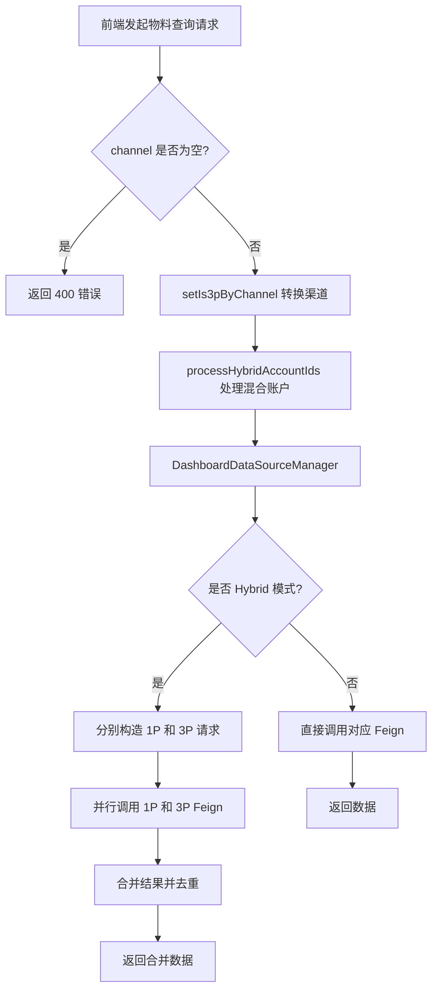
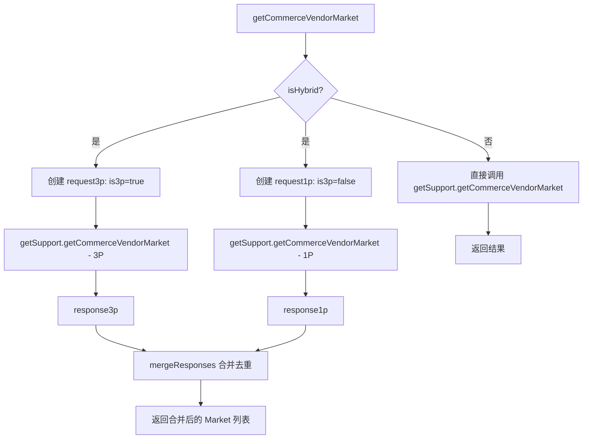
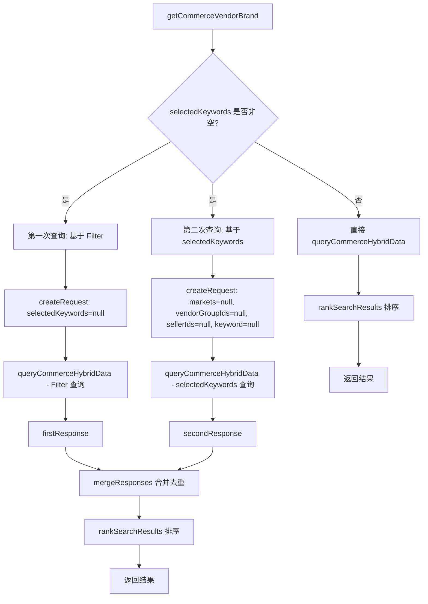
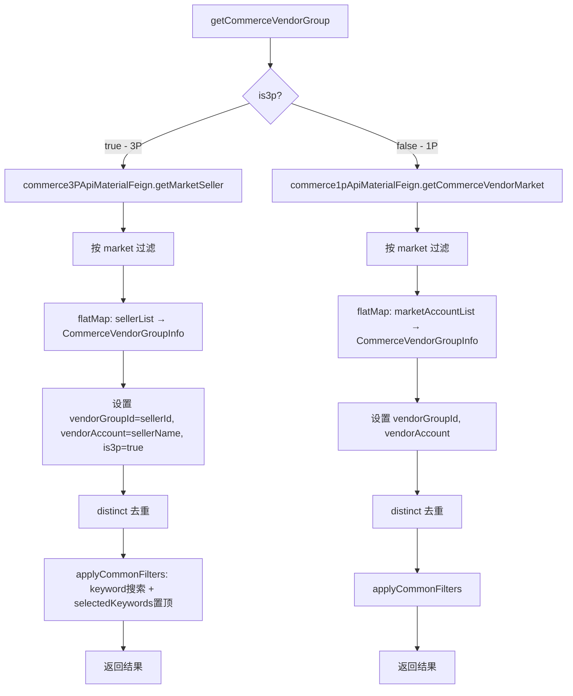
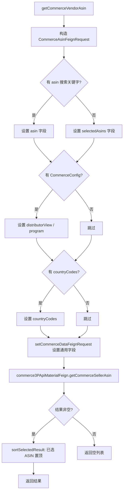
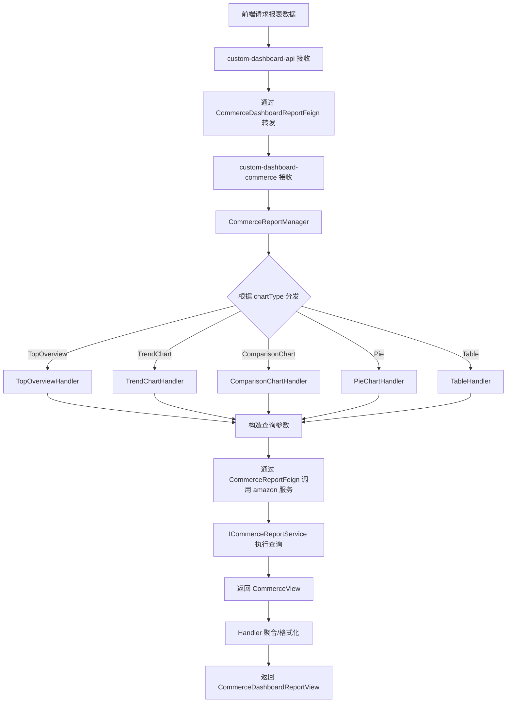
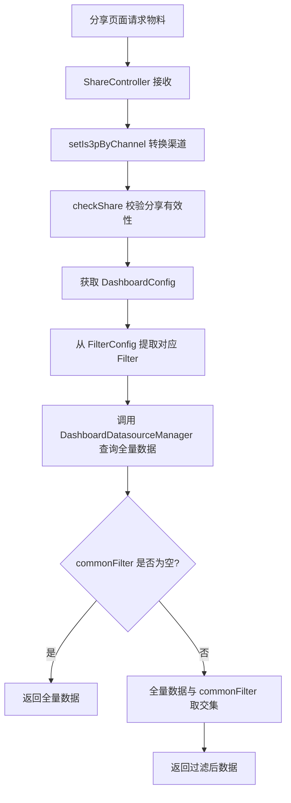

# Commerce 平台模块 功能逻辑文档

> 本文档由 document-automation 工具自动生成，基于源代码、PRD 文档和技术评审文档。
> 生成时间: 2026-04-07 16:24:07
> 准确性评分: 未验证/100

---


# Commerce 平台模块 功能逻辑文档

## 1. 模块概述

### 1.1 职责与定位

Commerce 平台模块是 Custom Dashboard 系统中专门处理 Amazon Commerce 数据的核心模块，负责：

1. **数据源物料查询**：为前端 Dashboard 配置页面提供 Market、Account（VendorGroup/Seller）、Brand、Category、ASIN、Product Tag 等物料的查询能力
2. **Filter 联动**：物料之间存在层级联动关系（如 Market → Account → Brand/Category），用户选择上级物料后自动过滤下级可选项
3. **报表数据聚合**：根据 Chart 配置（TopOverview、TrendChart、ComparisonChart、Pie、Table）聚合 Commerce 绩效数据并输出
4. **多渠道支持**：统一处理 1P Vendor、3P Seller、Hybrid（混合）三种渠道模式

### 1.2 系统架构位置

```
┌─────────────────────────────────────────────────────────┐
│                     前端 (Vue)                           │
│   Dashboard Config UI / Chart Render / Filter Panel     │
└──────────────────────┬──────────────────────────────────┘
                       │ HTTP REST
┌──────────────────────▼──────────────────────────────────┐
│          custom-dashboard-api (网关层)                    │
│   DashboardDatasourceController  /  ShareController      │
│   DashboardDataSourceManager                             │
└──────────┬───────────────────────────────┬──────────────┘
           │ Feign                         │ Feign
┌──────────▼──────────┐     ┌──────────────▼──────────────┐
│ custom-dashboard-    │     │ custom-dashboard-            │
│ commerce (报表服务)   │     │ amazon (指标查询服务)         │
│ CommerceReportCtrl   │     │ CommerceReportCtrl           │
│ AbstractChartData    │     │ ICommerceReportService       │
│ Handler              │     │                              │
└──────────┬──────────┘     └──────────────┬──────────────┘
           │ Feign                         │ Feign
┌──────────▼──────────────────────────────▼──────────────┐
│              Commerce 底层数据服务                        │
│  commerce1pApiMaterialFeign (1P Vendor 物料/数据)        │
│  commerce3pApiMaterialFeign (3P Seller 物料/数据)        │
│  tagServiceFeign (Product Tag)                          │
└─────────────────────────────────────────────────────────┘
```

### 1.3 涉及的后端模块

| 模块 | 职责 | 关键类 |
|------|------|--------|
| `custom-dashboard-api` | API 网关层，接收前端请求，物料查询入口 | `DashboardDatasourceController`, `DashboardDataSourceManager`, `CommerceDatasourceSupport` |
| `custom-dashboard-commerce` | Commerce 报表数据聚合，按 ChartType 分发处理 | `CommerceReportController`, `CommerceReportManager`, `AbstractChartDataHandler` 及其子类 |
| `custom-dashboard-amazon` | Commerce 指标数据查询，日期校验 | `CommerceReportController`, `ICommerceReportService` |
| `custom-dashboard-share` | 分享链路的物料查询（带 Filter 约束） | `ShareController`（含 `setIs3pByChannel`、`checkShare` 逻辑） |

### 1.4 Maven 坐标与部署方式

> **待确认**：具体 Maven groupId/artifactId 未在代码片段中体现。根据命名推断：
> - `com.pacvue.custom-dashboard-api`
> - `com.pacvue.custom-dashboard-commerce`
> - `com.pacvue.custom-dashboard-amazon`
>
> 各模块独立部署为微服务，通过 Spring Cloud Feign 进行服务间调用。

---

## 2. 用户视角

### 2.1 功能场景总览

Commerce 平台模块服务于以下用户场景：

1. **Dashboard 配置**：用户创建/编辑 Dashboard 时，选择 Commerce 平台作为数据源，逐级配置 Filter（Market → Account → Brand/Category → ASIN/Tag）
2. **Chart 创建**：在 Dashboard 中创建各类图表（Overview、Trend、Comparison、Pie、Table），选择 Commerce 指标和物料维度
3. **数据查看**：Dashboard 展示页面根据配置聚合 Commerce 绩效数据，支持 Filter 联动筛选
4. **分享查看**：通过 ShareLink 查看 Dashboard，物料数据受分享时锁定的 Filter 约束
5. **Hybrid 模式**：同时拥有 1P Vendor 和 3P Seller 账户的客户，可在一个 Dashboard 中查看合并数据

### 2.2 用户操作流程

#### 2.2.1 Dashboard Setting 中配置 Commerce Filter

```
用户进入 Dashboard Setting
  → 选择平台: Commerce
  → 选择渠道: Vendor (1P) / Seller (3P) / Hybrid
  → 选择 Market（多选）
  → 选择 Account（VendorGroup 或 Seller，受 Market 联动过滤）
  → 选择 Brand / Amazon Brand（受 Market + Account 联动过滤）
  → 选择 Category / Amazon Category（受 Market + Account 联动过滤）
  → 选择 Product Tag
  → 保存 Filter 配置
```

#### 2.2.2 Chart 创建与数据查看

```
用户在 Dashboard 中添加 Chart
  → 选择 Chart 类型（TopOverview / TrendChart / ComparisonChart / Pie / Table）
  → 选择指标（Commerce 专属指标集）
  → 选择物料层级（ASIN-Market / Account / Market / Brand / Category / Tag 等）
  → 选择具体物料值
  → 配置高级选项（Top N / Sort By / 时间范围等）
  → 保存并查看数据
```

#### 2.2.3 ASIN 物料选择（V2.5 新增 Market 选项）

根据 PRD V2.5：
- 选择 ASIN 为物料时，可以先选择市场（支持多选）
- 选择市场后，加载对应市场的 ASIN 列表（多市场取并集）
- 保存后获取数据时，只取该 ASIN 在对应市场的数据，而非全部市场

### 2.3 UI 交互要点

1. **渠道切换**：前端通过 `channel` 字段（`Vendor` / `Seller` / `Hybrid`）控制，后端通过 `setIs3pByChannel` 方法转换为 `is3p` 布尔值
2. **Filter 联动**：Market 变更后需重新加载 Account 列表；Account 变更后需重新加载 Brand/Category 列表
3. **搜索与已选**：物料列表支持 `keyword` 搜索和 `selectedKeywords` 已选项置顶（通过 `SearchRankingUtils.applyCommonFilters` 和 `rankSearchResults` 实现）
4. **货币转换**（V2.6 Sprint4）：Commerce 支持多市场货币转换，在 Basic Setting 中配置统一货币
5. **Chart Tips**（V2.6）：各图表类型有标准化的 Tips 文案模板，展示字段名称、物料层级和物料枚举

---

## 3. 核心 API

### 3.1 物料查询 API（custom-dashboard-api）

所有物料查询接口均位于 `DashboardDatasourceController`，基础路径为 `/data`。

#### 3.1.1 Market 查询

| 项目 | 说明 |
|------|------|
| **路径** | `POST /data/getCommerceVendorMarket` |
| **请求体** | `CommerceDataRequest { channel: String, productLine: String }` |
| **返回值** | `BaseResponse<List<String>>` — Market 名称列表 |
| **校验** | `channel` 不能为空，否则返回 400 |
| **逻辑** | 调用 `DashboardDataSourceManager.getCommerceVendorMarket()`，Hybrid 模式下分别查 1P 和 3P 后合并去重 |
| **联动** | 无上游依赖，作为最顶层 Filter |

#### 3.1.2 Account（VendorGroup / Seller）查询

| 项目 | 说明 |
|------|------|
| **路径** | `POST /data/getCommerceVendorGroup` |
| **请求体** | `CommerceDataRequest { channel, markets[], keyword, selectedKeywords[] }` |
| **返回值** | `BaseResponse<List<CommerceVendorGroupInfo>>` |
| **校验** | `channel` 不能为空 |
| **逻辑** | 1P 调用 `commerce1pApiMaterialFeign.getCommerceVendorMarket()` 获取全量数据后按 market 过滤并提取 vendorGroup；3P 调用 `commerce3PApiMaterialFeign.getMarketSeller()` 获取全量数据后按 market 过滤并提取 seller。支持 keyword 搜索和 selectedKeywords 置顶 |
| **联动** | 受 `markets` 过滤 |

#### 3.1.3 自定义 Brand 查询

| 项目 | 说明 |
|------|------|
| **路径** | `POST /data/getCommerceVendorBrand` |
| **请求体** | `CommerceDataRequest { channel, markets[], vendorGroupIds[]/sellerIds[], keyword, selectedKeywords[] }` |
| **返回值** | `BaseResponse<List<CommerceBrandCategoryInfo>>` |
| **校验** | `channel` 不能为空 |
| **逻辑** | Hybrid 模式下调用 `processHybridAccountIds` 处理混合账户 ID，然后通过 `queryCommerceHybridData` 分别查 1P/3P 后合并。支持 `selectedKeywords` 时执行两次查询（一次基于 Filter，一次基于 selectedKeywords）后合并去重并排序 |
| **联动** | 受 `markets` + `vendorGroupIds/sellerIds` 过滤 |

#### 3.1.4 自定义 Category 查询

| 项目 | 说明 |
|------|------|
| **路径** | `POST /data/getCommerceVendorCategory` |
| **请求体** | `CommerceDataRequest { channel, markets[], vendorGroupIds[]/sellerIds[] }` |
| **返回值** | `BaseResponse<List<CommerceBrandCategoryInfo>>` |
| **逻辑** | 与 Brand 查询逻辑类似，调用 `processHybridAccountIds` 后委托 `getCommerceVendorCategory` |
| **联动** | 受 `markets` + `vendorGroupIds/sellerIds` 过滤 |

#### 3.1.5 Amazon Brand 查询

| 项目 | 说明 |
|------|------|
| **路径** | `POST /data/getCommerceVendorBrandForAdvertising` |
| **请求体** | `CommerceDataRequest { channel, markets[], vendorGroupIds[]/sellerIds[] }` |
| **返回值** | `BaseResponse<List<CommerceBrandCategoryInfo>>` |
| **逻辑** | 1P 调用 `productCatalog/getAmazonBrandList`，3P 调用 `brandSales/getAmazonBrands` |
| **联动** | 受 `markets` + `vendorGroupIds/sellerIds` 过滤 |

#### 3.1.6 Amazon Category 查询

| 项目 | 说明 |
|------|------|
| **路径** | `POST /data/getCommerceVendorCategoryForAdvertising` |
| **请求体** | `CommerceDataRequest { channel, markets[], vendorGroupIds[]/sellerIds[] }` |
| **返回值** | `BaseResponse<List<CommerceBrandCategoryInfo>>` |
| **逻辑** | 1P 调用 `productCatalog/getAmazonCategoryList`，3P 调用 `brandSales/getAmazonCategories` |
| **联动** | 受 `markets` + `vendorGroupIds/sellerIds` 过滤 |

#### 3.1.7 Product Tag 查询

| 项目 | 说明 |
|------|------|
| **路径** | `POST /data/getCommerceVendorProductTag` |
| **请求体** | `CommerceDataRequest { channel }` |
| **返回值** | `BaseResponse<List<?>>` — 待确认具体返回类型 |
| **逻辑** | 1P/3P 共用，调用 `tag-service/api/PIM/ProductTags` |
| **联动** | 无上游联动 |

#### 3.1.8 ASIN 查询

| 项目 | 说明 |
|------|------|
| **路径** | `POST /data/getCommerceVendorAsin` |
| **请求体** | `CommerceDataRequest { markets[], asin(搜索关键字), selectedAsins[], config.commerceConfig }` |
| **返回值** | `BaseResponse<List<CommerceAsinInfo>>` |
| **逻辑** | 3P 调用 `commerce3PApiMaterialFeign.getCommerceSellerAsin()`，支持按 `distributionView`/`program` 过滤，支持 `countryCodes` 过滤，已选 ASIN 置顶排序 |

#### 3.1.9 批量 ID 查询接口（ByIds 系列）

以下接口用于根据已保存的 ID 列表反查物料详情，主要用于 Dashboard 加载时回显已选物料：

| 路径 | 请求体 | 返回值 |
|------|--------|--------|
| `POST /data/getCommerceVendorAsinByIds` | `CommerceByIdsRequest { ids[], channel }` | `BaseResponse<List<CommerceAsinInfo>>` |
| `POST /data/getCommerceVendorGroupByIds` | `CommerceByIdsRequest { ids[], channel }` | `BaseResponse<List<CommerceVendorGroupInfo>>` |
| `POST /data/getCommerceVendorBrandByIds` | `CommerceByIdsRequest { ids[], channel }` | `BaseResponse<List<CommerceBrandCategoryInfo>>` |
| `POST /data/getCommerceVendorCategoryByIds` | `CommerceByIdsRequest { ids[], channel }` | `BaseResponse<List<CommerceBrandCategoryInfo>>` |
| `POST /data/getCommerceVendorBrandForAdvertisingByIds` | `CommerceByIdsRequest { ids[], channel }` | `BaseResponse<List<CommerceBrandCategoryInfo>>` |
| `POST /data/getCommerceVendorCategoryForAdvertisingByIds` | `CommerceByIdsRequest { ids[], channel }` | `BaseResponse<List<CommerceBrandCategoryInfo>>` |

#### 3.1.10 Commerce Profile 查询（Retail 接口）

| 项目 | 说明 |
|------|------|
| **路径** | `POST /data/getCommerceProfile` |
| **请求体** | `CommerceDataRequest` |
| **返回值** | `BaseResponse<List<CommerceProfileInfo>>` |
| **逻辑** | 调用 `DashboardDataSourceManager.getCommerceProfile()` |

### 3.2 报表数据 API（custom-dashboard-commerce）

| 项目 | 说明 |
|------|------|
| **路径** | 待确认（由 `CommerceDashboardReportFeign` 定义） |
| **方法** | POST |
| **请求体** | `CommerceReportRequest { chartType, startDate, endDate, ... }` |
| **返回值** | `CommerceDashboardReportView` |
| **逻辑** | 根据 `chartType` 分发到不同的 `AbstractChartDataHandler` 子类处理 |

已确认支持的报表端点（来自技术评审）：

| 端点路径 | Chart 类型 | 1P 状态 | 3P 状态 |
|----------|-----------|---------|---------|
| `/report/customDashboard/getTopOverview` | TopOverview | ✅ 完成 | ✅ 完成 |
| `/report/customDashboard/getTrendChart` | TrendChart | ✅ 完成（除 single 模式） | ✅ 完成（除 single 模式） |
| `/report/customDashboard/getComparisonChart` | ComparisonChart | ✅ 完成 | ✅ 完成 |
| `/report/customDashboard/getPie` | Pie | ✅ 完成 | ✅ 完成 |
| `/report/customDashboard/getTable` | Table | ✅ 完成 | ✅ 完成 |
| `/report/customDashboard/getCommerceAsins` | ASIN 查询 | ✅ 完成 | ✅ 完成 |

### 3.3 指标查询 API（custom-dashboard-amazon）

| 项目 | 说明 |
|------|------|
| **路径** | 待确认（由 `CommerceReportFeign` 定义） |
| **方法** | POST |
| **请求体** | `CommerceReportRequest { startDate, endDate, ... }` |
| **返回值** | `CommerceView` |
| **逻辑** | 校验日期参数后委托 `ICommerceReportService` 执行查询 |

### 3.4 分享链路 API（custom-dashboard-share）

分享链路下的物料查询接口与主链路路径相同，但增加了 Filter 约束逻辑：

| 路径 | 额外逻辑 |
|------|----------|
| `POST /data/getCommerceVendorMarket` | 从 `DashboardConfig.FilterConfig.marketsFilter` 获取允许的 Market 列表，与查询结果取交集 |
| `POST /data/getCommerceVendorGroup` | 根据 `is3p` 决定使用 `sellerIdsFilter` 还是 `vendorGroupIdsFilter`，与查询结果取交集 |

---

## 4. 核心业务流程

### 4.1 渠道识别与转换流程

前端传入 `channel` 字段（`Vendor` / `Seller` / `Hybrid`），后端通过 `setIs3pByChannel` 方法转换：

```java
// 伪代码逻辑
setIs3pByChannel(request):
    if channel == "Seller":
        request.is3p = true
    else if channel == "Vendor":
        request.is3p = false
    // Hybrid 模式下 is3p 不设置，由后续逻辑分别处理
```

### 4.2 物料查询主流程



### 4.3 Hybrid 模式数据合并流程

Hybrid 模式是 Commerce 模块的核心复杂度所在。以 Market 查询为例：



### 4.4 Brand 查询的双重查询逻辑

Brand 查询（`getCommerceVendorBrand`）存在特殊的双重查询逻辑，用于处理搜索 + 已选项的场景：



**设计意图**：
- 第一次查询：根据当前 Filter 条件（Market、Account 等）查询匹配的 Brand 列表
- 第二次查询：确保用户已选择的 Brand（`selectedKeywords`）即使不在当前 Filter 范围内也能被返回
- 合并后通过 `rankSearchResults` 将已选项置顶，搜索匹配项优先

### 4.5 VendorGroup/Seller 查询流程



**关键设计**：1P 和 3P 的底层数据结构不同（1P 是 MarketAccount，3P 是 Seller），但统一映射为 `CommerceVendorGroupInfo`，其中 `vendorGroupId` 字段在 3P 场景下实际存储的是 `sellerId`。

### 4.6 ASIN 查询流程（3P）



### 4.7 报表数据查询流程



### 4.8 分享链路 Filter 约束流程



### 4.9 关键设计模式

1. **策略模式（Strategy Pattern）**：`AbstractChartDataHandler` 定义报表处理的抽象接口，各 Chart 类型（TopOverview、TrendChart、ComparisonChart、Pie、Table）实现各自的 Handler
2. **模板方法模式（Template Method）**：`AbstractDatasourceSupport` 定义物料查询的通用骨架，`CommerceDatasourceSupport` 实现 Commerce 平台特有逻辑
3. **适配器模式（Adapter）**：1P 和 3P 底层数据结构不同，通过统一映射为 `CommerceVendorGroupInfo`、`CommerceBrandCategoryInfo` 等 DTO 屏蔽差异
4. **Hybrid 合并策略**：`DashboardDataSourceManager` 中通过 `queryCommerceHybridData` 方法封装了 

---

*本文档由 AI 自动生成，如有不准确之处请以源代码为准。标注"待确认"的内容需要人工核实。*