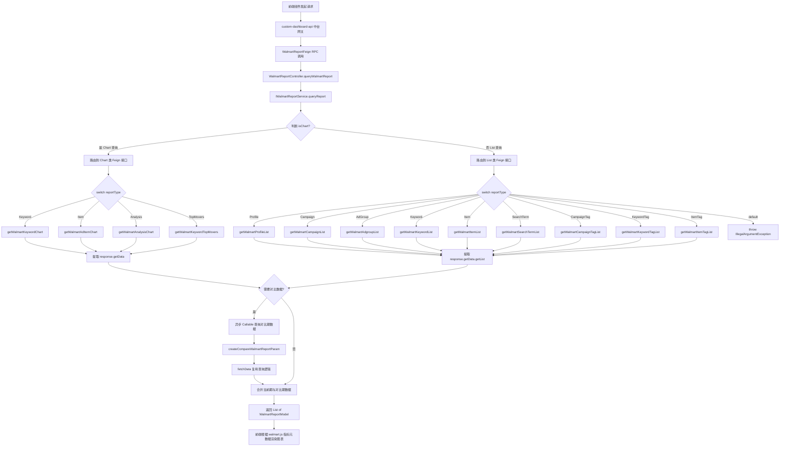
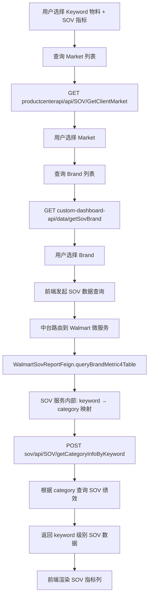
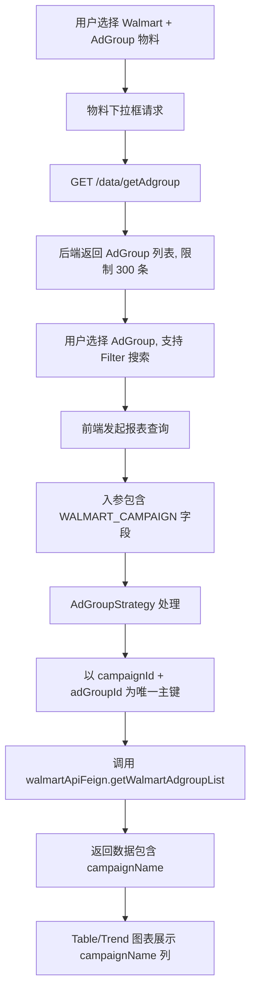
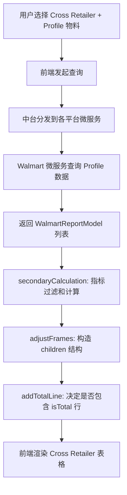

# Walmart 平台模块 功能逻辑文档

> 本文档由 document-automation 工具自动生成，基于源代码、PRD 文档和技术评审文档。
> 生成时间: 2026-04-09 10:27:40
> 准确性评分: 未验证/100

---


# Walmart 平台模块 功能逻辑文档

## 1. 模块概述

### 1.1 模块职责与定位

Walmart 平台模块是 Custom Dashboard（以下简称 CDB）系统中负责 **Walmart 广告数据查询、报表聚合与指标映射** 的核心平台模块。该模块承担以下职责：

1. **报表数据查询**：通过 Feign 远程调用 Walmart 平台广告报表 API，获取各物料级别（Profile / Campaign / AdGroup / Keyword / Item / SearchTerm / CampaignTag / KeywordTag / ItemTag）的报表数据。
2. **数据聚合与转换**：将 Walmart 平台返回的原始报表数据转换为 CDB 统一的 `WalmartReportModel` 数据结构，支持 list（分页列表）、total（汇总）、chart（图表趋势）三种查询模式。
3. **指标元数据定义**：在前端通过 `metricsList/walmart.js` 定义完整的 Walmart 指标注册表，涵盖 SearchAd 广告类型下的所有指标元数据（formType / compareType / supportChart / ScopeSettingObj 等）。
4. **SOV 指标支持**：通过 `WalmartSovReportFeign` 调用 SOV 服务，支持 Keyword Level 的 Brand SOV 指标查询。

### 1.2 系统架构位置

```
┌─────────────────────────────────────────────────────────────────┐
│                        前端 (Vue)                                │
│  metricsList/walmart.js  ←→  api/index.js                       │
└──────────────────────────────┬──────────────────────────────────┘
                               │ HTTP Request
                               ▼
┌─────────────────────────────────────────────────────────────────┐
│              custom-dashboard-api（中台网关）                      │
│         通过 WalmartReportFeign 调用下游微服务                      │
└──────────────────────────────┬──────────────────────────────────┘
                               │ Feign RPC
                               ▼
┌─────────────────────────────────────────────────────────────────┐
│           custom-dashboard-walmart（Walmart 微服务）               │
│  WalmartReportController → IWalmartReportService                 │
│         ↓ Feign RPC                                              │
│  WalmartApiFeign → Walmart 平台各报表 API                         │
│  WalmartSovReportFeign → SOV 服务                                │
└─────────────────────────────────────────────────────────────────┘
```

### 1.3 涉及的后端模块与前端组件

**后端模块：**

| 模块 | 说明 |
|---|---|
| `custom-dashboard-walmart` | Walmart 微服务，包含 Controller / Service / Feign 定义 |
| `custom-dashboard-api` | 中台网关，通过 `WalmartReportFeign` 调用 walmart 微服务 |
| `custom-dashboard-common`（**待确认**） | 公共模块，包含 `BaseResponse`、`PageResponse`、`ReportParams` 等通用类 |

**前端组件：**

| 文件 | 说明 |
|---|---|
| `metricsList/walmart.js` | Walmart 指标注册表，导出 `walmartMetrics` 函数 |
| `api/index.js` | 前端 API 层，包含各类请求函数 |

### 1.4 关键类清单

| 类名 | 角色 | 说明 |
|---|---|---|
| `WalmartReportController` | Controller | 实现 `WalmartReportFeign` 接口，接收报表查询请求 |
| `IWalmartReportService` | Service 接口 | 定义 `queryReport` 方法 |
| `WalmartReportFeign` | Feign 接口 | CDB 内部微服务间调用接口 |
| `WalmartApiFeign` | Feign 接口 | 调用 Walmart 平台广告报表 API |
| `WalmartSovReportFeign` | Feign 接口 | 调用 SOV 服务查询 Brand SOV 指标 |
| `WalmartReportModel` | DTO | 报表数据模型 |
| `WalmartReportRequest` | DTO | 报表查询请求参数 |
| `ReportParams` | DTO | Walmart 平台 API 的请求参数 |
| `BaseResponse<T>` | 通用响应 | 统一响应包装 |
| `PageResponse<T>` | 分页响应 | 分页数据包装 |

### 1.5 设计模式

1. **Feign 远程调用代理模式**：通过 `@FeignClient` 注解声明远程服务接口，Spring Cloud 自动生成代理实现。
2. **接口-实现分离**：`IWalmartReportService` 接口与实现类分离，便于单元测试和扩展。
3. **统一响应包装**：所有 Walmart 平台 API 返回 `BaseResponse<T>` 或 `BaseResponse<PageResponse<T>>`。
4. **策略模式路由**：Service 实现中通过 `switch (reportType)` 根据物料类型路由到不同的 Feign 接口调用。
5. **前端指标注册表模式**：`walmartMetrics` 函数返回结构化指标配置，驱动前端图表渲染。

---

## 2. 用户视角

### 2.1 功能场景总览

基于 PRD 文档和技术评审文档，Walmart 平台模块支持以下核心功能场景：

| 场景编号 | 场景名称 | 来源 |
|---|---|---|
| S1 | Walmart 广告报表查看（多物料级别） | 基础功能 |
| S2 | Walmart Keyword Level Brand SOV 指标 | PRD 25Q4-S6 |
| S3 | Walmart 新增 Ad Group 物料层级 | PRD 26Q1-S2 |
| S4 | Walmart Item/Keyword 增加 Campaign Tag 筛选 | PRD 26Q1-S2 |
| S5 | Walmart 添加 Online Same SKU Sales 等指标 | 技术评审 26Q1-S5 |
| S6 | Walmart Search Ads 分类名称调整 | PRD 26Q2-S1 |
| S7 | Walmart Keyword Top Mover | 技术评审 25Q3-S3 |
| S8 | Cross Retailer 中 Walmart 数据展示 | 技术评审 26Q1-S1 |

### 2.2 场景 S1：Walmart 广告报表查看

**用户操作流程：**

1. 用户进入 Custom Dashboard 页面，选择或创建一个 Dashboard。
2. 在 Dashboard 中添加图表组件（支持 Line / Bar / Table / Top Overview / Pie 等类型）。
3. 在图表的 Scope Setting 中选择平台为 **Walmart**。
4. 选择广告类型为 **SearchAd**。
5. 选择物料级别（Material Level），可选项包括：
   - **Profile**：广告账户级别
   - **Campaign**：广告活动级别
   - **AdGroup**：广告组级别（26Q1-S2 新增）
   - **Keyword**：关键词级别
   - **Item**：广告商品级别
   - **SearchTerm**：搜索词级别
   - **CampaignTag / CampaignParentTag**：活动标签级别
   - **KeywordTag / KeywordParentTag**：关键词标签级别
   - **ItemTag / ItemParentTag**：商品标签级别
6. 选择需要展示的指标（Metrics），如 Impressions、Clicks、Spend、Sales、ROAS 等。
7. 设置时间范围、对比模式（POP / YOY）等。
8. 系统根据配置查询 Walmart 报表数据并渲染图表。

**UI 交互要点：**
- 物料下拉框支持搜索和多选。
- 指标选择面板按分组展示（基础指标、Online 指标、SOV 指标等）。
- 图表支持 Customize / Top Rank / Top Mover 三种模式。
- 支持全屏展示（25Q3-S3 需求）。

### 2.3 场景 S2：Walmart Keyword Level Brand SOV 指标

**来源**：PRD 25Q4-S6，技术评审 2025Q4S6

**用户操作流程：**

1. 在 Table 图表中，选择 Walmart 平台，物料层级为 **Keyword**。
2. 在指标选择面板中，出现 **SOV 分组**，包含以下指标：
   - Brand Total SOV
   - Brand Paid SOV
   - Brand SP SOV
   - Brand SB SOV
   - Brand SV SOV
   - Brand Organic SOV
3. 用户选中 SOV 指标后，系统需要额外查询：
   - 调用 `productcenterapi/api/SOV/GetClientMarket` 获取 Market 列表。
   - 调用 `custom-dashboard-api/data/getSovBrand` 获取 Brand 列表。
4. 用户选择 Market 和 Brand 后，系统通过 `WalmartSovReportFeign.queryBrandMetric4Table` 查询 SOV 数据。

**业务规则：**
- SOV 指标仅在 **Customize** 模式下支持 Sort By，Top Rank 和 Top Mover 模式不支持 Sort By。
- Scope Setting 中的筛选项保持现状不变。
- 核心桥梁：通过 `POST /sov/api/SOV/getCategoryInfoByKeyword` 从 keyword + market 映射到 category。

### 2.4 场景 S3：Walmart 新增 Ad Group 物料层级

**来源**：PRD 26Q1-S2，技术评审 2026Q1S1

**用户操作流程：**

1. 在 Scope Setting 中选择 Walmart 平台。
2. 物料级别下拉框中新增 **AdGroup** 选项。
3. 选择 AdGroup 后，物料下拉框调用 `/data/getAdgroup` 接口获取 AdGroup 列表。
4. 由于 AdGroup 数量可能很多，下拉框支持 **Filter 搜索**，后台限制最多返回 **300 条**。
5. 在 Table 和 Trend 图表中，聚焦 AdGroup 时会额外显示 `campaignName` 列。

**技术要点：**
- AdGroup 以 `campaignId + adGroupId` 作为唯一主键。
- 入参需要增加 `WALMART_CAMPAIGN` 字段。
- 后端新增 `AdGroupStrategy` 策略类处理 AdGroup 物料的数据查询。
- 联动规则：AdGroup 与 Profile、CampaignTag 相关联，逻辑同 Campaign。

### 2.5 场景 S4：Walmart Item/Keyword 增加 Campaign Tag 筛选

**来源**：PRD 26Q1-S2，技术评审 2026Q1S1

**用户操作流程：**

1. 在 Scope Setting 中选择 Walmart 平台，物料级别为 Item 或 Keyword。
2. Filter 区域新增 **Campaign Tag** 筛选条件。
3. 用户选择 Campaign Tag 后，系统在查询报表数据时将 Tag 条件传入。

**影响接口：**

| 物料 | 接口 |
|---|---|
| Item | `/getItemList` |
| Keyword | `/getKeywordList` |

### 2.6 场景 S5：Walmart 添加 Online Same SKU Sales 等指标

**来源**：技术评审 2026Q1S5

新增指标映射：

| 前端指标名称 | 后端指标枚举 | API 字段名 |
|---|---|---|
| Online Same SKU Sales | `ONLINE_SAME_SKU_SALES` | `totalPurchaseSales` |
| Online Same SKU Sale Units | `ONLINE_SAME_SKU_SALE_UNITS` | `totalPurchaseUnits` |

不区分 Delivery 和 Pickup。

### 2.7 场景 S6：Walmart Search Ads 分类名称调整

**来源**：PRD 26Q2-S1

将 Walmart 侧 Search Ads 归类为 **Display**，与渠道/展示类定义对齐。此为前端展示层面的分类调整。

### 2.8 Figma 设计稿参考

根据 Figma 设计稿信息：
- **Line Chart** 中 Walmart 作为图例项之一，与 Instacart 等平台并列展示，每个平台对应一条趋势线。
- **Bar Chart** 中包含 Performance 区域，展示 Chart Name 标题。
- 图例区域使用椭圆形色块 + 指标名称（如 "Sales"）的组合形式。
- Walmart 在说明区域中包含多个子 Frame（Frame 427319136 / 427319134 / 427319178 / 427319176），**待确认**具体内容为指标卡片或配置面板。

---

## 3. 核心 API

### 3.1 WalmartReportController 端点

`WalmartReportController` 实现 `WalmartReportFeign` 接口，供 CDB 中台网关通过 Feign 调用。

| 方法 | 路径 | 说明 |
|---|---|---|
| `POST` | **待确认**（由 `WalmartReportFeign` 定义） | 查询 Walmart 报表数据 |

**请求参数**：`WalmartReportRequest reportParams`

```java
@RestController
public class WalmartReportController implements WalmartReportFeign {
    @Autowired
    private IWalmartReportService IWalmartReportService;

    @Override
    public List<WalmartReportModel> queryWalmartReport(WalmartReportRequest reportParams) {
        return IWalmartReportService.queryReport(reportParams);
    }
}
```

**返回值**：`List<WalmartReportModel>` — Walmart 报表数据模型列表。

### 3.2 WalmartApiFeign 端点（Walmart 平台 API）

`WalmartApiFeign` 是调用 Walmart 平台广告报表 API 的 Feign 客户端，定义了以下端点：

#### 3.2.1 Profile 相关接口

| 方法 | 路径 | 返回类型 | 说明 |
|---|---|---|---|
| `POST` | `/api/Report/profile/list` | `BaseResponse<PageResponse<WalmartReportModel>>` | 获取 Profile 级别报表列表（分页） |
| `POST` | `/api/Report/profile/total` | `BaseResponse<WalmartReportModel>` | 获取 Profile 级别报表汇总 |

#### 3.2.2 Campaign 相关接口

| 方法 | 路径 | 返回类型 | 说明 |
|---|---|---|---|
| `POST` | `/api/Report/chart` | `BaseResponse<List<WalmartReportModel>>` | 获取 Campaign 图表数据 |

**注意**：代码片段中 `switch` 语句显示 Campaign 和 FilterLinkedCampaign 均调用 `walmartApiFeign.getWalmartCampaignList()`，具体路径**待确认**。

#### 3.2.3 AdGroup 相关接口

| 方法 | 路径 | 返回类型 | 说明 |
|---|---|---|---|
| `POST` | `/api/Report/adGroup/total` | `BaseResponse<WalmartReportModel>` | 获取 AdGroup 级别报表汇总 |

AdGroup list 接口路径**待确认**（代码中调用 `walmartApiFeign.getWalmartAdgroupList()`）。

#### 3.2.4 Keyword 相关接口

| 方法 | 路径 | 返回类型 | 说明 |
|---|---|---|---|
| `POST` | `/api/Report/keyword/list` | `BaseResponse<PageResponse<WalmartReportModel>>` | 获取 Keyword 级别报表列表（分页） |
| `POST` | `/api/Report/keywordChart` | `BaseResponse<List<WalmartReportModel>>` | 获取 Keyword 图表数据 |
| `POST` | `/api/Report/keyword/total` | `BaseResponse<WalmartReportModel>` | 获取 Keyword 级别报表汇总 |
| `POST` | `/api/report/default/keyword/getKeywordTopMovers` | `BaseResponse<List<WalmartReportModel>>` | 获取 Keyword Top Movers 数据 |

#### 3.2.5 Item 相关接口

| 方法 | 路径 | 返回类型 | 说明 |
|---|---|---|---|
| `POST` | `/api/Report/adItem/list` | `BaseResponse<PageResponse<WalmartReportModel>>` | 获取 Item 级别报表列表（分页） |
| `POST` | `/api/Report/adItemChart` | `BaseResponse<List<WalmartReportModel>>` | 获取 Item 图表数据 |
| `POST` | `/api/Report/adItem/total` | `BaseResponse<WalmartReportModel>` | 获取 Item 级别报表汇总 |

#### 3.2.6 SearchTerm 相关接口

| 方法 | 路径 | 返回类型 | 说明 |
|---|---|---|---|
| `POST` | `/api/Report/searchTerm/list` | `BaseResponse<PageResponse<WalmartReportModel>>` | 获取 SearchTerm 级别报表列表（分页） |
| `POST` | `/api/Report/searchTerm/total` | `BaseResponse<WalmartReportModel>` | 获取 SearchTerm 级别报表汇总 |

#### 3.2.7 CampaignTag 相关接口

| 方法 | 路径 | 返回类型 | 说明 |
|---|---|---|---|
| `POST` | `/api/Report/tag/list` | `BaseResponse<PageResponse<WalmartReportModel>>` | 获取 CampaignTag 级别报表列表（分页） |
| `POST` | `/api/Report/tag/total` | `BaseResponse<WalmartReportModel>` | 获取 CampaignTag 级别报表汇总 |

#### 3.2.8 分析图表接口

| 方法 | 路径 | 返回类型 | 说明 |
|---|---|---|---|
| `POST` | `/api/Report/analysisChart` | `BaseResponse<List<WalmartReportModel>>` | 获取分析图表数据 |

#### 3.2.9 其他接口

代码 `switch` 语句中还引用了以下 Feign 方法，具体路径**待确认**：

| Feign 方法 | 对应物料类型 |
|---|---|
| `getWalmartCampaignList()` | Campaign / FilterLinkedCampaign |
| `getWalmartCampaignTypeList()` | AdType |
| `getWalmartAdgroupList()` | AdGroup |
| `getWalmartKeywordTagList()` | KeywordTag / KeywordParentTag |
| `getWalmartItemTagList()` | ItemTag / ItemParentTag |

### 3.3 WalmartSovReportFeign 端点

| 方法 | 说明 |
|---|---|
| `queryBrandMetric4Table` | 查询 Keyword Level Brand SOV 指标数据 |

具体路径**待确认**，技术评审文档提及该方法用于 Walmart Keyword Level SOV 查询。

### 3.4 前端 API 调用

前端通过 `api/index.js` 中的请求函数发起调用，已知函数包括：

| 函数名 | 说明 |
|---|---|
| `getUserGuidanceStep` | 获取用户引导步骤 |
| `getShareLinkUserGuidanceStep` | 获取分享链接用户引导步骤 |
| `getCommerceProductTag` | 获取 Commerce 产品标签 |
| `getChartDisplayValues` | 获取图表展示值 |
| `getChartLibraryProductLine` | 获取图表库产品线 |

Walmart 报表数据的具体前端请求函数名**待确认**，推测通过统一的图表查询接口（如 `queryChart`）传入平台参数来区分。

---

## 4. 核心业务流程

### 4.1 报表数据查询主流程

#### 4.1.1 流程描述

**步骤 1：前端发起请求**

前端组件根据用户在 Scope Setting 中的配置（平台=Walmart、物料级别、指标列表、时间范围等），通过 `api/index.js` 向 `custom-dashboard-api` 中台网关发起 POST 请求。请求体包含 `WalmartReportRequest` 结构的参数。

**步骤 2：中台网关路由**

`custom-dashboard-api` 中台网关接收请求后，识别平台为 Walmart，通过 `WalmartReportFeign` 发起 Feign RPC 调用，将请求转发至 `custom-dashboard-walmart` 微服务。

**步骤 3：Controller 接收请求**

`WalmartReportController.queryWalmartReport(WalmartReportRequest reportParams)` 接收请求，直接委托给 `IWalmartReportService.queryReport(reportParams)`。

**步骤 4：Service 解析请求参数**

`IWalmartReportService` 的实现类解析 `WalmartReportRequest`，提取以下关键信息：
- `reportType`：物料类型枚举（Profile / Campaign / AdGroup / Keyword / Item / SearchTerm / CampaignTag 等）
- 是否为 Chart 查询（`isChart` 判断）
- 是否需要对比数据（Compare 模式）

**步骤 5：构造 Walmart 平台请求参数**

将 `WalmartReportRequest` 转换为 `ReportParams`（即 `walmartReportParam`），适配 Walmart 平台 API 的入参格式。

**步骤 6：根据查询类型路由到不同 Feign 接口**

Service 内部根据 `isChart` 和 `reportType` 进行两级路由：

**6a. Chart 类型查询**（返回 `BaseResponse<List<WalmartReportModel>>`）：

根据代码片段推断，Chart 查询调用返回列表数据的接口，如：
- `getWalmartKeywordChart()` — Keyword 图表
- `getWalmartAdItemChart()` — Item 图表
- `getWalmartAnalysisChart()` — 分析图表
- `getWalmartKeywordTopMovers()` — Keyword Top Movers

**6b. List 类型查询**（返回 `BaseResponse<PageResponse<WalmartReportModel>>`）：

```java
BaseResponse<PageResponse<WalmartReportModel>> response = switch (reportType) {
    case Profile -> walmartApiFeign.getWalmartProfileList(walmartReportParam);
    case Campaign, FilterLinkedCampaign -> walmartApiFeign.getWalmartCampaignList(walmartReportParam);
    case AdType -> walmartApiFeign.getWalmartCampaignTypeList(walmartReportParam);
    case AdGroup -> walmartApiFeign.getWalmartAdgroupList(walmartReportParam);
    case Keyword -> walmartApiFeign.getWalmartKeywordList(walmartReportParam);
    case Item -> walmartApiFeign.getWalmartItemList(walmartReportParam);
    case SearchTerm -> walmartApiFeign.getWalmartSearchTermList(walmartReportParam);
    case CampaignTag, CampaignParentTag -> walmartApiFeign.getWalmartCampaignTagList(walmartReportParam);
    case KeywordTag, KeywordParentTag -> walmartApiFeign.getWalmartKeywordTagList(walmartReportParam);
    case ItemTag, ItemParentTag -> walmartApiFeign.getWalmartItemTagList(walmartReportParam);
    default -> throw new IllegalArgumentException("Invalid scopeType type: " + reportType);
};
```

**步骤 7：提取结果数据**

- Chart 类型：`resultList = response != null ? response.getData() : Collections.emptyList()`
- List 类型：`resultList = (response != null && response.getData() != null) ? response.getData().getList() : Collections.emptyList()`

**步骤 8：对比数据查询（可选）**

如果请求包含对比模式（POP / YOY），Service 通过异步 `Callable` 并行查询对比期数据：

```java
@Override
public List<WalmartReportModel> call() {
    setRequestContext(attributes, context);
    ReportParams walmartReportParamChange = createCompareWalmartReportParam(walmartReportRequest);
    return fetchData(walmartReportParamChange, walmartReportRequest, isChart(walmartReportRequest));
}
```

`createCompareWalmartReportParam` 方法根据对比模式调整时间范围参数，然后复用 `fetchData` 方法查询对比期数据。

**步骤 9：数据合并与返回**

将当前期数据和对比期数据合并，返回 `List<WalmartReportModel>` 给上层调用方。

#### 4.1.2 主流程 Mermaid 图



### 4.2 SOV 指标查询流程



### 4.3 AdGroup 物料查询流程



### 4.4 Cross Retailer 中 Walmart 数据流程

根据技术评审 2026Q1S1，Cross Retailer 场景下 Walmart 数据的处理逻辑：



**关键设计点：**
- `secondaryCalculation` 负责 Cross Retailer 的 list 和 total 行的指标过滤和计算。
- `adjustFrames` 负责构造 children 结构。
- 二者职责单一，不混合处理。
- 数据是一次性加载，非二次展开。

---

## 5. 数据模型

### 5.1 数据库表结构

代码片段中未直接出现 SQL 或表名，数据库表结构**待确认**。Walmart 报表数据主要通过 Feign 调用 Walmart 平台 API 获取，CDB 本身可能不直接存储 Walmart 报表数据。

Dashboard 配置相关表（根据技术评审 2026Q1S5 中 Sharelink 功能推断）：

| 表/字段 | 说明 |
|---|---|
| dashboard setting 表 | 存储 Dashboard 配置，包含 `fixed_date_range` 等字段 |
| share 表 | 存储分享链接配置，包含 `lockDate`、`startDate`、`endDate` 等字段 |

具体表名和完整字段**待确认**。

### 5.2 核心 DTO/VO

#### 5.2.1 WalmartReportRequest

报表查询请求参数，由 CDB 中台传入。

| 字段 | 类型 | 说明 |
|---|---|---|
| `reportType` | 枚举 | 物料类型（Profile / Campaign / AdGroup / Keyword / Item / SearchTerm / CampaignTag 等） |
| 其他字段 | **待确认** | 时间范围、Profile 列表、指标列表、排序、分页等 |

#### 5.2.2 ReportParams

Walmart 平台 API 的请求参数，由 Service 层将 `WalmartReportRequest` 转换而来。

具体字段**待确认**，推测包含：
- 时间范围（startDate / endDate）
- Profile ID 列表
- Campaign ID 列表
- 分页参数（page / pageSize）
- 排序参数
- Campaign Tag 筛选条件（26Q1-S2 新增）

#### 5.2.3 WalmartReportModel

报表数据模型，承载 Walmart 平台返回的报表数据。

具体字段**待确认**，根据指标枚举推断包含：

| 字段（推测） | 类型 | 说明 |
|---|---|---|
| `impressions` | Long | 展示量 |
| `clicks` | Long | 点击量 |
| `ctr` | Double | 点击率 |
| `spend` | Double | 花费 |
| `cpc` | Double | 单次点击成本 |
| `cpa` | Double | 单次转化成本 |
| `cvr` | Double | 转化率 |
| `acos` | Double | 广告花费占比 |
| `roas` | Double | 广告回报率 |
| `sales` | Double | 销售额 |
| `orders` | Long | 订单数 |
| `saleUnits` | Long | 销售件数 |
| `adSkuSales` | Double | 广告 SKU 销售额 |
| `adSkuOrders` | Long | 广告 SKU 订单数 |
| `otherSales` | Double | 其他销售额 |
| `otherOrders` | Long | 其他订单数 |
| `aov` | Double | 平均订单价值 |
| `asp` | Double | 平均售价 |
| `campaignName` | String | 活动名称 |
| `adGroupId` | String | 广告组 ID |
| `adGroupName` | String | 广告组名称 |
| `totalPurchaseSales` | Double | Online Same SKU Sales（API 字段名） |
| `totalPurchaseUnits` | Long | Online Same SKU Sale Units（API 字段名） |

#### 5.2.4 BaseResponse\<T\>

统一响应包装：

```java
public class BaseResponse<T> {
    private int code;       // 响应码
    private String message; // 响应消息
    private T data;         // 响应数据
}
```

#### 5.2.5 PageResponse\<T\>

分页响应包装：

```java
public class PageResponse<T> {
    private List<T> list;   // 数据列表
    private int total;      // 总记录数（待确认）
    private int page;       // 当前页（待确认）
    private int pageSize;   // 每页大小（待确认）
}
```

### 5.3 核心枚举

#### 5.3.1 物料类型枚举（reportType）

根据代码中 `switch` 语句，支持以下物料类型：

| 枚举值 | 说明 |
|---|---|
| `Profile` | 广告账户 |
| `Campaign` | 广告活动 |
| `FilterLinkedCampaign` | 筛选关联活动 |
| `AdType` | 广告类型 |
| `AdGroup` | 广告组（26Q1-S2 新增） |
| `Keyword` | 关键词 |
| `Item` | 广告商品 |
| `SearchTerm` | 搜索词 |
| `CampaignTag` | 活动标签 |
| `CampaignParentTag` | 活动父标签 |
| `KeywordTag` | 关键词标签 |
| `KeywordParentTag` | 关键词父标签 |
| `ItemTag` | 商品标签 |
| `ItemParentTag` | 商品父标签 |

#### 5.3.2 指标类型枚举（MetricType）

根据代码片段中的枚举定义，Walmart 平台指标枚举如下：

**信息类指标（INFORMATION）：**

| 枚举值 | 说明 |
|---|---|
| `WALMART_PROFILE` | Profile 名称 |
| `WALMART_CAMPAIGN` | Campaign 名称 |
| `WALMART_ITEM` | Item 名称 |
| `WALMART_ADGROUP` | AdGroup 名称 |
| `WALMART_KEYWORD` | Keyword 名称 |
| `WALMART_TAG_NAME` | Tag 名称 |
| `WALMART_SEARCH_TERM` | SearchTerm 名称 |
| `WALMART_ITEM_TAG` | Item Tag 名称 |
| `WALMART_CAMPAIGN_Tag` | Campaign Tag 名称 |

**数值类指标（默认类型）：**

| 枚举值 | 平台 | 格式 | 说明 |
|---|---|---|---|
| `WALMART_IMPRESSIONS` | WALMART | Number | 展示量 |
| `WALMART_CLICKS` | WALMART | Number | 点击量 |
| `WALMART_CTR` | WALMART | Percent | 点击率 |
| `WALMART_SPEND` | WALMART | Money | 花费 |
| `WALMART_CPC` | WALMART | Money | 单次点击成本 |
| `WALMART_CPA` | WALMART | Money | 单次转化成本 |
| `WALMART_CVR` | WALMART | Percent | 转化率 |
| `WALMART_ACOS` | WALMART | Percent | 广告花费占比 |
| `WALMART_ROAS` | WALMART | Money | 广告回报率 |
| `ONLINE_CPA` | WALMART | Money | 线上 CPA |
| `ONLINE_CVR` | WALMART | Percent | 线上 CVR |
| `ONLINE_ACOS` | WALMART | Percent | 线上 ACOS |
| `ONLINE_ROAS` | WALMART | Money | 线上 ROAS |
| `ONLINE_AD_SKU_ACOS` | WALMART | Percent | 线上广告 SKU ACOS |
| `ONLINE_AD_SKU_ROAS` | WALMART | Money | 线上广告 SKU ROAS |
| `WALMART_SALES` | WALMART | Money | 销售额 |
| `WALMART_ORDERS` | WALMART | Number | 订单数 |
| `WALMART_SALE_UNITS` | WALMART | Number | 销售件数 |
| `AD_SKU_SALES` | WALMART | Money | 广告 SKU 销售额 |
| `ONLINE_SALES` | WALMART | Money | 线上销售额 |
| `ONLINE_ORDERS` | WALMART | Number | 线上订单数 |
| `ONLINE_SALE_UNITS` | WALMART | Number | 线上销售件数 |
| `ONLINE_AD_SKU_SALES` | WALMART | Money | 线上广告 SKU 销售额 |
| `ONLINE_AD_SKU_ORDERS` | WALMART | Number | 线上广告 SKU 订单数 |
| `ONLINE_AD_SKU_SALE_UNITS` | WALMART | Number | 线上广告 SKU 销售件数 |
| `OTHER_SALES` | WALMART | Money | 其他销售额 |
| `OTHER_SALES_PERCENT` | WALMART | Percent | 其他销售额占比 |
| `OTHER_ORDERS` | WALMART | Number | 其他订单数 |
| `OTHER_ORDERS_PERCENT` | WALMART | Percent | 其他订单数占比（枚举值被截断） |
| `WALMART_AOV` | WALMART | Money | 平均订单价值 |
| `WALMART_ASP` | WALMART | Money | 平均售价 |
| `ONLINE_OTHER_SALES` | WALMART | Money | 线上其他销售额 |
| `ONLINE_OTHER_SALES_PERCENT` | WALMART | Percent | 线上其他销售额占比 |
| `ONLINE_OTHER_ORDERS` | WALMART | Number | 线上其他订单数 |
| `ONLINE_OTHER_ORDERS_PERCENT` | WALMART | Percent | 线上其他订单数占比（枚举值被截断） |
| `ONLINE_SAME_SKU_SALES` | WALMART | Money | 线上同 SKU 销售额（26Q1-S5 新增） |
| `ONLINE_SAME_SKU_SALE_UNITS` | WALMART | Number | 线上同 SKU 销售件数（26Q1-S5 新增） |

### 5.4 前端指标元数据结构

`metricsList/walmart.js` 导出 `walmartMetrics` 函数，返回结构化指标配置。每个指标对象包含以下属性：

| 属性 | 类型 | 说明 |
|---|---|---|
| `label` | String | 指标显示名称 |
| `value` | String | 指标枚举值（对应后端 MetricType） |
| `formType` | String | 数据格式类型：`Number` / `Money` / `Percent` |
| `compareType` | String | 对比类型（**待确认**具体值） |
| `supportChart` | Array | 支持的图表类型列表（line / bar / table / topOverview / pie） |
| `ScopeSettingObj` | Object | Scope Setting 配置对象（**待确认**具体结构） |

**广告类型分组**：当前仅支持 `SearchAd` 一种广告类型。

**指标分组**：
- 基础广告指标（Impressions / Clicks / CTR / Spend / CPC 等）
- 转化指标（Sales / Orders / Sale Units / ACOS / ROAS 等）
- 广告 SKU 指标（Ad SKU Sales / Ad SKU Orders）
- 其他指标（Other Sales / Other Orders 及其百分比）
- Online 指标（Online Sales / Online Orders / Online CVR / Online ACOS 等）
- SOV 指标（Brand Total SOV / Brand Paid SOV / Brand SP SOV / Brand SB SOV / Brand SV SOV / Brand Organic SOV）

---

## 6. 平台差异

### 6.1 Walmart SP/SB/SV 与 Display 指标差异

根据技术评审文档《Walmart 指标对比》，SP/SB/SV Campaign 与 Display Campaign 在指标支持上存在差异：

| 序号 | 指标 | SP/SB/SV | Display | 备注 |
|---|---|---|---|---|
| 1-13 | Impressions ~ Ad SKU Sales | ✅ | ✅ | 双方均支持 |
| 14 | Ad SKU Orders | ❌ | ✅ | 仅 Display 支持 |
| 15-16 | Other Sales / Other Sales% | ✅ | ✅ | |
| 17-18 | Other Orders / Other Orders% | ❌ | ✅ | 仅 Display 支持 |
| 19-20 | AOV / ASP | ✅ | ✅ | Display 已支持 ASP |
| 21 | CPM | ✅ | ✅ | SP 实际支持 CPM |
| 22-23 | Valid Bids / Win Rate | ❌ | ✅ | 仅 Display 支持 |
| 24-28 | Online CVR ~ Online Ad SKU ROAS | ✅ | ✅ | |
| 29 | Online Sales | ✅ | ✅ | |
| 30-31 | Online Sales(Delivery/Pickup) | ❌ | ✅ | 仅 Display 支持（截断） |

### 6.2 Walmart 与其他平台的 Cross Retailer 指标映射

在 Cross Retailer 场景下，Walmart 指标需要与 Amazon、Instacart、Criteo 等平台的指标进行统一映射。技术评审 2026Q1S1 提到：

> 先参考 Custom Dashboard 功能点梳理 HQ-平台指标对比 Cross Retailer 各平台指标支持情况对比。遇到缺失的字段跟产品确认，修改 `MetricMapping.java` 以及 `MetricType.java` 中的公式。

具体映射关系存储在 `MetricMapping.java` 中，**待确认**完整映射表。

### 6.3 Walmart 特有的物料层级

与 Amazon 等平台相比，Walmart 平台具有以下特有物料层级：

| 物料 | 说明 | 特殊处理 |
|---|---|---|
| `AdType` | 广告类型级别 | 调用 `getWalmartCampaignTypeList` |
| `FilterLinkedCampaign` | 筛选关联活动 | 与 Campaign 共用 `getWalmartCampaignList` |
| `ItemTag / ItemParentTag` | 商品标签 | 调用 `getWalmartItemTagList` |

### 6.4 Walmart Search Ads 分类调整

根据 PRD 26Q2-S1，Walmart Search Ads 将被归类为 **Display** 类型，与渠道/展示类定义对齐。这是一个前端展示层面的分类调整，不影响后端数据查询逻辑。

---

## 7. 配置与依赖

### 7.1 Feign 下游服务依赖

| Feign 客户端 | 目标服务 | 说明 |
|---|---|---|
| `WalmartApiFeign` | Walmart 平台广告报表 API | 提供 15+ 个报表查询端点 |
| `WalmartReportFeign` | CDB 内部 Walmart 微服务 | 中台网关调用 Walmart 微服务的接口 |
| `WalmartSovReportFeign` | SOV 服务 | 查询 Keyword Level Brand SOV 指标 |

### 7.2 WalmartApiFeign 完整端点清单

| 端点 | 返回类型 | 用途 |
|---|---|---|
| `POST /api/Report/profile/list` | `PageResponse<WalmartReportModel>` | Profile 列表 |
| `POST /api/Report/profile/total` | `WalmartReportModel` | Profile 汇总 |
| `POST /api/Report/keyword/list` | `PageResponse<WalmartReportModel>` | Keyword 列表 |
| `POST /api/Report/keywordChart` | `List<WalmartReportModel>` | Keyword 图表 |
| `POST /api/Report/keyword/total` | `WalmartReportModel` | Keyword 汇总 |
| `POST /api/report/default/keyword/getKeywordTopMovers` | `List<WalmartReportModel>` | Keyword Top Movers |
| `POST /api/Report/adItem/list` | `PageResponse<WalmartReportModel>` | Item 列表 |
| `POST /api/Report/adItemChart` | `List<WalmartReportModel>` | Item 图表 |
| `POST /api/Report/adItem/total` | `WalmartReportModel` | Item 汇总 |
| `POST /api/Report/searchTerm/list` | `PageResponse<WalmartReportModel>` | SearchTerm 列表 |
| `POST /api/Report/searchTerm/total` | `WalmartReportModel` | SearchTerm 汇总 |
| `POST /api/Report/analysisChart` | `List<WalmartReportModel>` | 分析图表 |
| `POST /api/Report/tag/list` | `PageResponse<WalmartReportModel>` | CampaignTag 列表 |
| `POST /api/Report/tag/total` | `WalmartReportModel` | CampaignTag 汇总 |
| `POST /api/Report/chart` | `List<WalmartReportModel>` | 通用图表 |
| `POST /api/Report/adGroup/total` | `WalmartReportModel` | AdGroup 汇总 |

### 7.3 外部服务依赖

| 服务 | 接口 | 用途 |
|---|---|---|
| Product Center API | `GET /api/SOV/GetClientMarket` | 获取 SOV Market 列表 |
| SOV Service | `POST /sov/api/SOV/getCategoryInfoByKeyword` | Keyword → Category 映射 |
| Tag Service | `GET /api/PIM/ProductTags` | 获取产品标签（Commerce 场景） |

### 7.4 关键配置项

代码片段中未直接出现 Apollo 或 application.yml 配置，以下为推测配置项（**待确认**）：

| 配置项 | 说明 |
|---|---|
| Walmart API Feign 服务地址 | WalmartApiFeign 的 `@FeignClient(url=...)` 或服务发现名称 |
| SOV Feign 服务地址 | WalmartSovReportFeign 的服务地址 |
| AdGroup 列表最大返回条数 | 300（技术评审明确提及） |

### 7.5 缓存策略

代码片段中未出现 `@Cacheable` 或 Redis 相关代码，缓存策略**待确认**。

### 7.6 消息队列

代码片段中未出现 Kafka 相关代码，消息队列使用**待确认**。

---

## 8. 版本演进

基于技术评审文档，按时间线整理 Walmart 平台模块的主要版本变更：

### 8.1 25Q3 Sprint3

| 变更 | 说明 |
|---|---|
| Add keyword top mover for Walmart | 新增 Walmart Keyword Top Mover 功能，调用 `getWalmartKeywordTopMovers` 接口 |

### 8.2 25Q4 Sprint6

| 变更 | 说明 |
|---|---|
| Walmart Keyword Level 支持 Brand SOV 指标 | 新增 SOV 分组指标（Brand Total SOV / Paid SOV / SP SOV / SB SOV / SV SOV / Organic SOV），通过 `WalmartSovReportFeign.queryBrandMetric4Table` 查询 |

### 8.3 26Q1 Sprint1

| 变更 | 说明 |
|---|---|
| Cross Retailer 中 Retailer 支持继续细分 | 支持 Citrus / Criteo SubRetailer 展示，影响 Walmart 在 Cross Retailer 中的数据展示 |
| 为 Item/Keyword 增加 Campaign Tag 筛选 | Walmart 的 Item 和 Keyword 物料支持 Campaign Tag 作为 Filter 条件 |
| 新增 Ad Group 物料层级 | Walmart 新增 AdGroup 物料，支持 Trend / Table 图表，Customize / Ranked 模式 |
| 小平台支持 keyword 作为 SOV 指标筛选条件 | 扩展 SOV keyword 筛选到更多平台 |
| Cross Retailer 加 keyword 物料层级 | 在 Cross Retailer 中新增 keyword 作为物料层级 |

### 8.4 26Q1 Sprint5

| 变更 | 说明 |
|---|---|
| Walmart 添加 Online Same SKU Sales 等指标 | 新增 `ONLINE_SAME_SKU_SALES`（totalPurchaseSales）和 `ONLINE_SAME_SKU_SALE_UNITS`（totalPurchaseUnits）指标 |

### 8.5 26Q2 Sprint1

| 变更 | 说明 |
|---|---|
| Walmart Search Ads 分类名称调整 | 将 Walmart Search Ads 归类为 Display |
| Comparison 图支持 YOY/POP 与趋势线展示 | 全平台支持，影响 Walmart 的对比图表功能 |

### 8.6 待优化项与技术债务

1. **指标映射完整性**：Cross Retailer 场景下，Walmart 与其他平台的指标映射可能存在缺失字段，需持续与产品确认并更新 `MetricMapping.java`。
2. **AdGroup 物料性能**：AdGroup 数量可能很大，当前限制 300 条，后续可能需要优化分页或搜索策略。
3. **Display 指标差异处理**：SP/SB/SV 与 Display 的指标差异需要在前端指标注册表中精确控制可见性。

---

## 9. 已知问题与边界情况

### 9.1 异常处理

**IllegalArgumentException 抛出**：

当 `reportType` 不在已知枚举范围内时，Service 层会抛出 `IllegalArgumentException`：

```java
default -> throw new IllegalArgumentException("Invalid scopeType type: " + reportType);
```

此异常在 Chart 查询和 List 查询的 `switch` 语句中均存在。上层调用方需要捕获此异常并返回友好的错误响应。

### 9.2 空数据处理

代码中对 Feign 调用返回的空数据进行了防御性处理：

- Chart 类型：`resultList = response != null ? response.getData() : Collections.emptyList()`
- List 类型：`resultList = (response != null && response.getData() != null) ? response.getData().getList() : Collections.emptyList()`

当 Walmart 平台 API 返回 `null` 或空数据时，系统返回空列表而非抛出 NPE。

### 9.3 并发处理

对比数据查询使用 `Callable` 异步执行：

```java
@Override
public List<WalmartReportModel> call() {
    setRequestContext(attributes, context);
    ReportParams walmartReportParamChange = createCompareWalmartReportParam(walmartReportRequest);
    return fetchData(walmartReportParamChange, walmartReportRequest, isChart(walmartReportRequest));
}
```

注意 `setRequestContext(attributes, context)` 调用，说明异步线程需要手动传递请求上下文（如 RequestAttributes、SecurityContext），避免在子线程中丢失用户认证信息。

### 9.4 超时与降级

代码片段中未出现显式的超时配置或降级策略（如 Hystrix / Sentinel）。Feign 调用的超时时间依赖于全局 Feign 配置或 Ribbon 配置（**待确认**）。

当 Walmart 平台 API 不可用时，Feign 调用可能抛出连接超时或读取超时异常，当前未见降级逻辑。

### 9.5 数据精度

根据 PRD 26Q1-S2 中的需求：

> 花费金额过万时不能展现具体金额，客户需要看精确到小数点后两位的数据

---

*本文档由 AI 自动生成，如有不准确之处请以源代码为准。标注"待确认"的内容需要人工核实。*