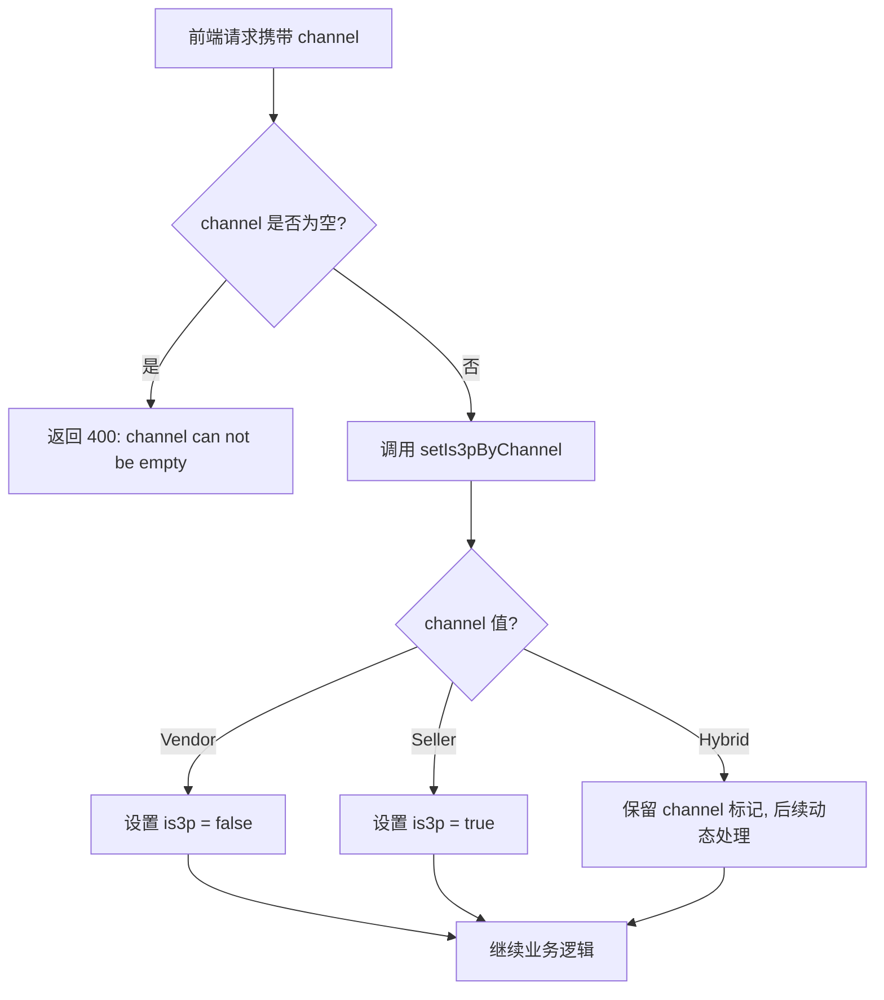
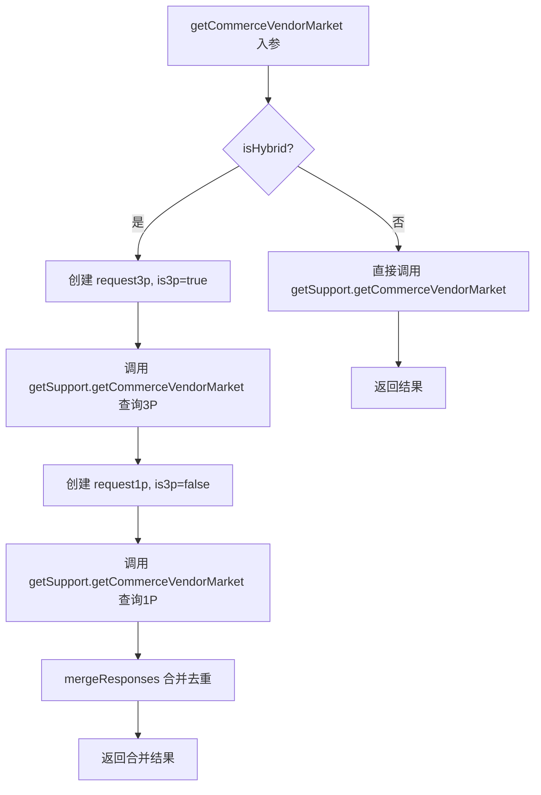
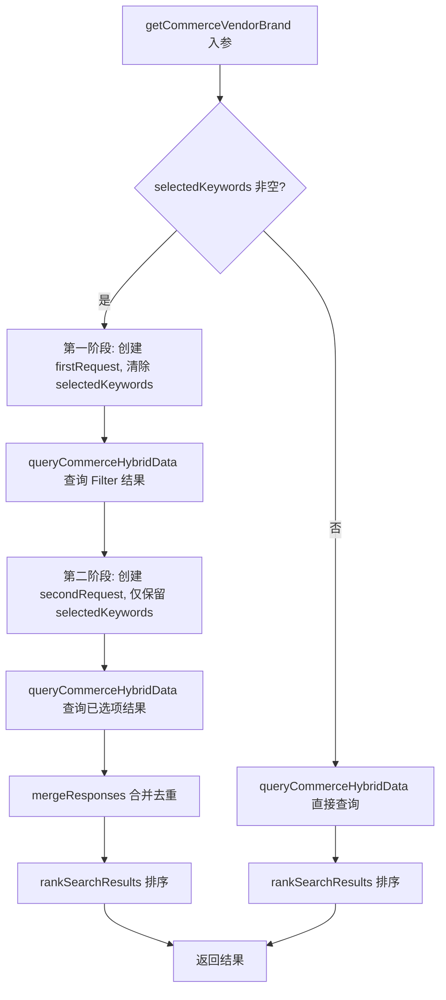
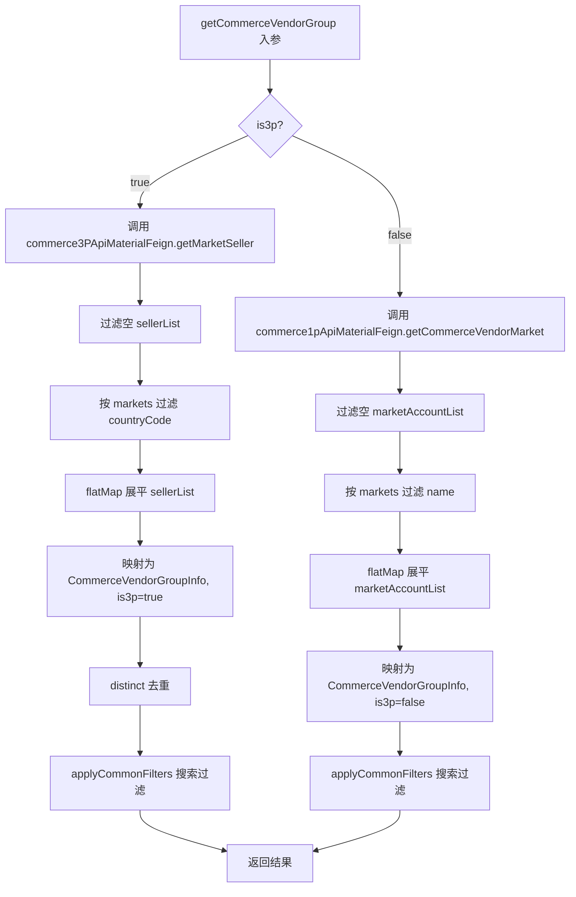
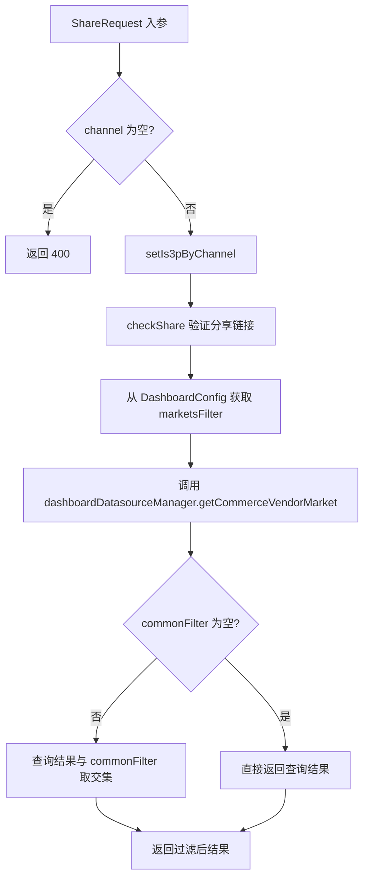
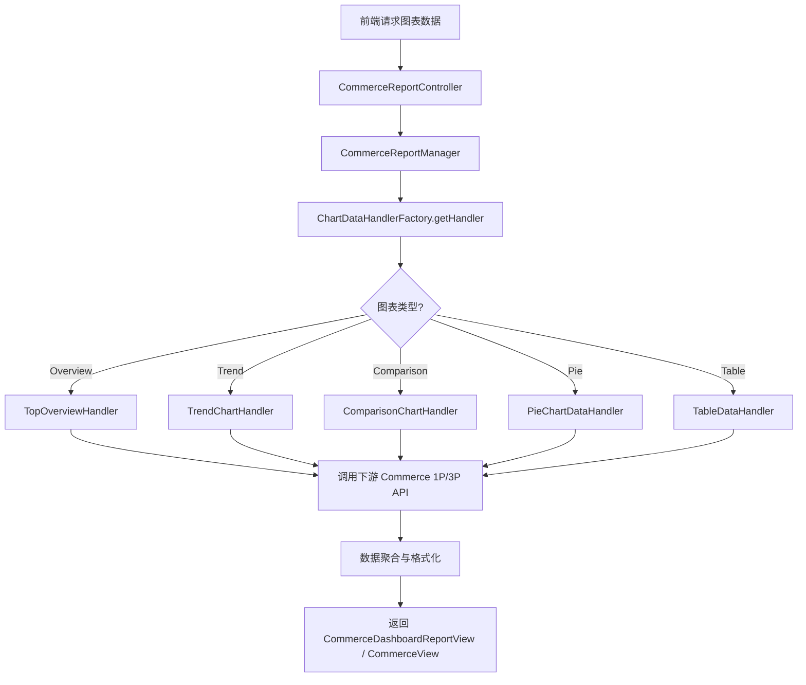

# Commerce 平台模块 功能逻辑文档

> 本文档由 document-automation 工具自动生成，基于源代码、PRD 文档和技术评审文档。
> 生成时间: 2026-04-09 10:33:33
> 准确性评分: 未验证/100

---


# Commerce 平台模块 功能逻辑文档

## 1. 模块概述

### 1.1 职责与定位

Commerce 平台模块是 Pacvue Custom Dashboard 系统中负责 **Amazon Commerce 数据接入** 的核心模块。它支持三种渠道模式：

| 渠道（Channel） | 说明 | 对应账户类型 |
|---|---|---|
| **Vendor（1P）** | 一方卖家，通过 Amazon Vendor Central 供货 | VendorGroup |
| **Seller（3P）** | 三方卖家，通过 Amazon Seller Central 自营 | Seller |
| **Hybrid** | 混合模式，同时拥有 1P 和 3P 账户 | VendorGroup + Seller |

模块的核心职责包括：

1. **物料数据查询**：提供 Market、Account（VendorGroup/Seller）、Brand（自定义/Amazon）、Category（自定义/Amazon）、Product Tag、ASIN 六大维度的物料元数据查询能力，供前端 Filter 联动和图表配置使用。
2. **Dashboard 绩效报表**：支持 TopOverview、TrendChart、ComparisonChart、PieChart、Table 五种图表类型的 Commerce 数据查询与渲染。
3. **Filter 联动**：物料之间存在层级联动关系（如 Market → Account → Brand/Category），Dashboard Setting 中的 Filter 配置会与图表数据取交集。
4. **HQ 迁移支持**：Commerce 数据正在从独立入口迁移至 HQ（Headquarters）统一入口，模块需要兼容两套权限体系和数据源选择逻辑。

### 1.2 系统架构位置

```
┌─────────────────────────────────────────────────────────┐
│                    前端 Vue 应用                          │
│  ┌──────────┐  ┌──────────┐  ┌──────────────────────┐   │
│  │ Store.js │  │ index.js │  │ topOverView.vue 等   │   │
│  │(Pinia)   │  │(API层)   │  │ (图表组件)            │   │
│  └────┬─────┘  └────┬─────┘  └──────────┬───────────┘   │
└───────┼─────────────┼───────────────────┼───────────────┘
        │             │                   │
        ▼             ▼                   ▼
┌─────────────────────────────────────────────────────────┐
│              Custom Dashboard 后端服务                     │
│  ┌──────────────────────┐  ┌──────────────────────────┐ │
│  │DashboardDatasource   │  │CommerceReportController  │ │
│  │Controller            │  │(实现CommerceReportFeign) │ │
│  └──────────┬───────────┘  └──────────┬───────────────┘ │
│             │                         │                  │
│  ┌──────────▼───────────┐  ┌──────────▼───────────────┐ │
│  │DashboardDataSource   │  │CommerceReportManager     │ │
│  │Manager               │  │                          │ │
│  └──────────┬───────────┘  └──────────┬───────────────┘ │
│             │                         │                  │
│  ┌──────────▼───────────┐  ┌──────────▼───────────────┐ │
│  │CommerceDatasource    │  │ChartDataHandlerFactory   │ │
│  │Support               │  │→ AbstractChartDataHandler│ │
│  └──────────┬───────────┘  │→ PieChartDataHandler     │ │
│             │              └──────────────────────────┘  │
└─────────────┼───────────────────────────────────────────┘
              │
    ┌─────────┼──────────┐
    ▼                    ▼
┌────────────┐   ┌────────────────┐   ┌──────────────┐
│Commerce 1P │   │Commerce 3P     │   │Tag Service   │
│API Material│   │API Material    │   │Feign         │
│Feign       │   │Feign           │   │              │
└────────────┘   └────────────────┘   └──────────────┘
```

### 1.3 涉及的后端模块与前端组件

**后端关键类：**

| 类名 | 职责 |
|---|---|
| `DashboardDatasourceController` | 物料数据查询的 REST 入口，路径 `/data` 和 `/share/data` |
| `CommerceReportController` | 绩效报表查询入口，实现 `CommerceReportFeign` 接口 |
| `DashboardDataSourceManager` | 物料查询的业务编排层，处理 Hybrid 合并逻辑 |
| `CommerceDatasourceSupport` | 物料查询的平台实现层，继承 `AbstractDatasourceSupport`，调用下游 Feign |
| `CommerceReportManager` | 绩效报表的业务编排层 |
| `ICommerceReportService` | 绩效报表的服务接口 |
| `ChartDataHandlerFactory` | 图表数据处理器工厂，根据图表类型分发 |
| `AbstractChartDataHandler` | 图表数据处理器抽象基类 |
| `PieChartDataHandler` | 饼图数据处理器 |
| `Commerce1pApiMaterialFeign` | 1P 下游物料 API Feign 客户端 |
| `Commerce3pApiMaterialFeign` | 3P 下游物料 API Feign 客户端 |
| `TagServiceFeign` | Tag 服务 Feign 客户端 |

**前端关键文件：**

| 文件 | 职责 |
|---|---|
| `store.js`（Pinia Store） | Commerce 物料数据的状态管理，包含 `getCommerceVendorCommerceMarketData`、`getCommerceVendorCommerceStoreData` 等方法 |
| `index.js`（API 层） | 封装 HTTP 请求，如 `getCommerceMarket`、`getCommerceAccount` |
| `topOverView.vue` | Overview 图表组件，调用 `getCommerceMarket` 等方法 |

### 1.4 Maven 坐标与部署方式

**待确认**：具体的 Maven 模块名和坐标未在代码片段中明确体现。根据类名推断，后端服务属于 Custom Dashboard 微服务的一部分，通过 Spring Cloud Feign 调用下游 Commerce 1P/3P API 服务。

---

## 2. 用户视角

### 2.1 功能场景总览

基于 PRD 文档，Commerce 平台模块支持以下核心功能场景：

1. **Dashboard 创建与配置**：用户在创建/编辑 Dashboard 时，选择 Commerce 平台的物料和指标
2. **Data Source 选择**：用户选择 Vendor（1P）、Seller（3P）或 Hybrid 渠道
3. **物料筛选（Filter 联动）**：用户逐级选择 Market → Account → Brand/Category 等物料
4. **图表数据展示**：五种图表类型展示 Commerce 绩效数据
5. **Dashboard Setting Filter**：全局筛选器与图表数据取交集
6. **Share Link**：分享链接场景下的物料查询与数据权限控制
7. **Template 管理**：Commerce 指标纳入模板体系

### 2.2 Data Source 选择流程

**用户操作流程：**

1. 用户进入 Dashboard 编辑页面，选择添加/编辑图表
2. 在 Material Level 下选择 "Amazon Commerce" 分类
3. 选择具体物料类型（Account Summary / Account / Market / Category / Brand / Amazon Category / Amazon Brand / Product Tag / ASIN）
4. 根据所选物料，系统展示可选的 Data Source 选项：
   - **Vendor（1P）**：层级包括 Manufacturing（Retail/RetailSNS/Core/Business/Fresh）、Sourcing（Retail/Core/Fresh/Business）
   - **Seller（3P）**：层级包括 All、SnS
   - **Hybrid**：物料仅支持 Account Summary / Account / Market / Category / Brand
5. 选择 Data Source 后，右侧指标区域展示该数据源 + 物料下所有可选的 Commerce 指标，按 Sales/Traffic 等分组

**PRD 关键约束：**
- 不同 Channel 支持的物料不同：
  - Hybrid：Account Summary / Account / Market / Category / Brand
  - Vendor：Account / Market / Category / Amazon Category / Brand / Amazon Brand / Product Tag / ASIN
  - Seller：Account / Market / Category / Amazon Category / Brand / Amazon Brand / ASIN / Product Tag
- 用户选择某个 Channel 的指标后，其他 Channel 的指标置灰不可选
- 编辑页面和查看页面修改 Overview 物料时，仅展示 Data Source，不支持修改

### 2.3 物料筛选（Filter 联动）

**用户操作流程：**

1. 用户在 Dashboard Setting 或图表配置中选择 Channel（Vendor/Seller/Hybrid）
2. 系统加载该 Channel 下的 Market 列表
3. 用户选择 Market 后，系统根据所选 Market 过滤 Account 列表
4. 用户选择 Account 后，系统根据所选 Market + Account 过滤 Brand/Category 列表
5. 各物料之间的联动关系如下表：

| 物料（纵向） | Market | Account | Brand | Amazon Brand | Category | Amazon Category | Tag |
|---|---|---|---|---|---|---|---|
| ASIN-Market | ✔️(交集) | ✔️ | ✔️ | ✔️ | ✔️ | ✔️ | ✔️ |
| Account | ✔️ | 交集 | ✔️ | ✔️ | ✔️ | ✔️ | ✔️ |
| Market | 交集 | ✔️ | ✔️ | ✔️ | ✔️ | ✔️ | ✔️ |
| Category | ✔️ | ✔️ | ✔️ | ✔️ | 交集 | ✔️ | ✔️ |
| Brand | ✔️ | ✔️ | 交集 | ✔️ | ✔️ | ✔️ | ✔️ |
| Product Tag | ✔️ | ✔️ | ✔️ | ✔️ | ✔️ | ✔️ | 交集 |

**特殊交互**：当物料为 ASIN 时，有筛选项 Market，选择后取 ASIN 物料与 Market 的交集。

### 2.4 图表类型与模式

| 图表类型 | 支持的模式 | Commerce 特殊说明 |
|---|---|---|
| **Overview** | Standard / Target Progress / Target Compare | Standard 模式支持 Commerce；Target 模式新增 target setting |
| **Trend** | Single / Multiple / Customized Combination | Customize 模式不支持混选 Ads 和 Commerce 数据 |
| **Comparison** | By Sum / YOY / POP | X 轴类型支持 Adtype/Metrics/Periods |
| **Pie** | Customize / Movers / Ranked | 支持 Commerce 指标 |
| **Table** | Customize / Movers / Ranked | 支持 Data Segment（Brand/Account/Category/Amazon Brand/Amazon Category） |

### 2.5 Dashboard Setting Filter

Dashboard Setting 中的 Filter 按平台分区，Commerce 和 Ads 的 Filter 独立：

- **Vendor Filter**：Account / Market / Category / Amazon Category / Brand / Amazon Brand / Product Tag
- **Seller Filter**：Account / Market / Category / Amazon Category / Brand / Amazon Brand / Product Tag
- **Hybrid Filter**：Account / Market / Category / Brand

Filter 与图表数据的关系：Dashboard Setting 中设置的 Filter 会与图表查询结果取交集，确保数据范围一致。

### 2.6 Share Link 场景

在 Share Link 场景下：
- 物料查询走 `/share/data` 路径
- 需要通过 `checkShare` 验证分享链接的有效性
- 从 `DashboardConfig` 中获取 Filter 配置，与查询结果取交集
- 根据 `is3p` 字段确定使用 `sellerIdsFilter` 还是 `vendorGroupIdsFilter`
- 安全性方面，`SecurityHandler.verifySign` 会将 `startDate` 和 `endDate` 加入验签逻辑，防止篡改

---

## 3. 核心 API

### 3.1 物料数据查询 API（DashboardDatasourceController）

#### 3.1.1 获取 Market 列表

- **路径**: `POST /data/getCommerceVendorMarket`
- **参数**:
  ```json
  {
    "productLine": "string (由前端 productlineFun() 自动填充)",
    "channel": "string (必填, 枚举: Vendor/Seller/Hybrid)"
  }
  ```
- **返回值**:
  ```json
  {
    "code": 200,
    "data": ["US", "UK", "DE", "JP", ...],
    "message": "success"
  }
  ```
- **说明**: 根据 Channel 查询可用的 Market（国家/地区）列表。Hybrid 模式下会分别查询 1P 和 3P 的 Market 并合并去重。
- **前端调用**: `index.js` 中的 `getCommerceMarket` 方法，URL 为 `${VITE_APP_CustomDashbord}data/getCommerceVendorMarket`

#### 3.1.2 获取 Account 列表

- **路径**: `POST /data/getCommerceVendorGroup`
- **参数**:
  ```json
  {
    "productLine": "string",
    "channel": "string (必填)",
    "markets": ["US", "UK"],
    "keyword": "string (搜索关键词)",
    "selectedKeywords": ["id1", "id2"]
  }
  ```
- **返回值**:
  ```json
  {
    "code": 200,
    "data": [
      {
        "vendorGroupId": "string",
        "vendorAccount": "string",
        "is3p": true/false
      }
    ]
  }
  ```
- **说明**: 根据 Channel 和 Market 过滤查询 VendorGroup（1P）或 Seller（3P）账户列表。支持关键词搜索和已选项回显。
- **前端调用**: `store.js` 中的 `getCommerceVendorCommerceStoreData` 方法

#### 3.1.3 获取自定义 Brand 列表

- **路径**: `POST /data/getCommerceVendorBrand`
- **参数**:
  ```json
  {
    "productLine": "string",
    "channel": "string (必填)",
    "markets": ["US"],
    "vendorGroupIds": ["vg1", "vg2"],
    "sellerIds": ["s1", "s2"],
    "keyword": "string",
    "selectedKeywords": ["brandId1"]
  }
  ```
- **返回值**:
  ```json
  {
    "code": 200,
    "data": [
      {
        "id": "string",
        "name": "string"
      }
    ]
  }
  ```
- **说明**: 查询自定义 Brand 列表，支持按 Market 和 Account 过滤。Hybrid 模式下会处理混合账户 ID。支持 `selectedKeywords` 的两阶段查询合并逻辑。

#### 3.1.4 获取自定义 Category 列表

- **路径**: `POST /data/getCommerceVendorCategory`
- **参数**: 同 Brand 接口
- **返回值**: 同 Brand 接口（`CommerceBrandCategoryInfo` 列表）
- **说明**: 查询自定义 Category 列表，逻辑与 Brand 类似。

#### 3.1.5 获取 Amazon Brand 列表

- **路径**: `POST /data/getCommerceVendorBrandForAdvertising`
- **参数**: 同自定义 Brand 接口
- **返回值**: `CommerceBrandCategoryInfo` 列表
- **说明**: 查询 Amazon 官方 Brand 列表（区别于用户自定义 Brand）。1P 调用 `productCatalog/getAmazonBrandList`，3P 调用 `brandSales/getAmazonBrands`。

#### 3.1.6 获取 Amazon Category 列表

- **路径**: `POST /data/getCommerceVendorCategoryForAdvertising`
- **参数**: 同自定义 Category 接口
- **返回值**: `CommerceBrandCategoryInfo` 列表
- **说明**: 查询 Amazon 官方 Category 列表。1P 调用 `productCatalog/getAmazonCategoryList`，3P 调用 `brandSales/getAmazonCategories`。

#### 3.1.7 获取 Product Tag 列表

- **路径**: `POST /data/getCommerceVendorProductTag`
- **参数**:
  ```json
  {
    "productLine": "string",
    "channel": "string (必填, 用于区分 Vendor/Seller/Hybrid)"
  }
  ```
- **返回值**: Tag 列表
- **说明**: 1P 和 3P 共用，底层调用 `tag-service/api/PIM/ProductTags`。根据技术评审文档，通过 `channel` 枚举区分而非 `is3p` 字段，目的是统一兼容混合模式查询。

#### 3.1.8 获取 ASIN 列表

- **路径**: `POST /data/getCommerceVendorAsin`
- **参数**:
  ```json
  {
    "productLine": "string",
    "markets": ["US", "UK"],
    "asin": "string (搜索关键词)",
    "selectedAsins": ["B00XXX", "B00YYY"],
    "config": {
      "commerceConfig": {
        "distributionView": "枚举值",
        "program": "枚举值"
      }
    },
    "countryCodes": ["US"]
  }
  ```
- **返回值**: `CommerceAsinInfo` 列表
- **说明**: 查询 ASIN 列表，支持按 Market 过滤。前端物料查询每个 item 下新增一行展示不同市场国旗。3P 调用 `commerce3PApiMaterialFeign.getCommerceSellerAsin`。

#### 3.1.9 获取 Commerce Profile

- **路径**: `POST /data/getCommerceProfile`
- **参数**: `CommerceDataRequest`（**待确认**具体字段）
- **返回值**: `CommerceProfileInfo` 列表
- **说明**: 获取 Commerce Profile 信息，用于 Retail 相关接口。

#### 3.1.10 批量查询 ByIds 系列接口

以下接口均接收 `CommerceByIdsRequest`（包含 `ids` 和 `channel` 字段），用于根据已保存的 ID 批量回查物料详情：

| 路径 | 说明 |
|---|---|
| `POST /data/getCommerceVendorAsinByIds` | 按 ID 批量查询 ASIN 详情 |
| `POST /data/getCommerceVendorGroupByIds` | 按 ID 批量查询 VendorGroup/Seller 详情 |
| `POST /data/getCommerceVendorBrandByIds` | 按 ID 批量查询自定义 Brand 详情 |
| `POST /data/getCommerceVendorCategoryByIds` | 按 ID 批量查询自定义 Category 详情 |
| `POST /data/getCommerceVendorBrandForAdvertisingByIds` | 按 ID 批量查询 Amazon Brand 详情 |
| `POST /data/getCommerceVendorCategoryForAdvertisingByIds` | 按 ID 批量查询 Amazon Category 详情 |

### 3.2 Share Link 物料查询 API

Share Link 场景下的物料查询走 `/share/data` 路径，逻辑与 `/data` 路径类似，但增加了以下处理：

- **路径**: `POST /share/data/getCommerceVendorMarket`
- **额外参数**: `ShareRequest` 中包含 `shareLinkUrl`
- **额外逻辑**:
  1. 调用 `setIs3pByChannel(shareRequest)` 设置 `is3p` 标志
  2. 调用 `checkShare(shareRequest)` 验证分享链接有效性，获取 `DashboardConfig`
  3. 从 `DashboardConfig.FilterConfig` 中提取 `marketsFilter`（Commerce 平台）
  4. 查询物料数据后，与 Filter 配置取交集
  5. 返回过滤后的结果

**Share Link Account 查询的特殊逻辑**：
- 根据 `is3p` 字段决定使用 `sellerIdsFilter` 还是 `vendorGroupIdsFilter`
- 前端通过 `getCommerceVendorShareCommerceStoreData` 方法调用，传入 `shareLinkUrl`

### 3.3 绩效报表 API（CommerceReportController）

- **路径**: **待确认**（由 `CommerceReportFeign` 接口定义）
- **参数**: `CommerceReportRequest`（继承 `BaseRequest`，`startDate` 和 `endDate` 必填）
- **返回值**: Commerce 报表指标数据
- **说明**: 查询 Commerce 绩效数据，支持五种图表类型。根据技术评审文档，以下接口已完成：

| 接口路径 | 图表类型 | 1P 状态 | 3P 状态 |
|---|---|---|---|
| `/report/customDashboard/getTopOverview` | Overview | ✅ | ✅ |
| `/report/customDashboard/getTrendChart` | Trend | ✅（除 single 模式） | ✅（除 single 模式） |
| `/report/customDashboard/getComparisonChart` | Comparison | ✅ | ✅ |
| `/report/customDashboard/getPie` | Pie | ✅ | ✅ |
| `/report/customDashboard/getTable` | Table | ✅ | ✅ |
| `/report/customDashboard/getCommerceAsins` | ASIN 查询 | ✅ | ✅ |

---

## 4. 核心业务流程

### 4.1 Channel 判定与 is3p 设置流程

`setIs3pByChannel` 是所有物料查询的前置处理方法，负责将前端传入的 `channel` 字符串转换为后端使用的 `is3p` 布尔标志。

**详细逻辑：**

1. 前端请求中携带 `channel` 字段，值为 `Vendor`、`Seller` 或 `Hybrid`
2. Controller 层调用 `setIs3pByChannel(request)` 方法
3. 如果 `channel` 为 `Seller`，设置 `is3p = true`
4. 如果 `channel` 为 `Vendor`，设置 `is3p = false`
5. 如果 `channel` 为 `Hybrid`，`is3p` 的值在后续 `DashboardDataSourceManager` 中动态处理（分别以 `true` 和 `false` 各查一次再合并）
6. 校验 `channel` 不能为空，否则返回 400 错误



### 4.2 Hybrid 模式合并查询流程

Hybrid 模式是 Commerce 模块最复杂的查询逻辑。以 Market 查询为例：

**详细逻辑（`DashboardDataSourceManager.getCommerceVendorMarket`）：**

1. 判断 `DashboardConfig.Channel.isHybrid(request.getChannel())` 是否为 Hybrid 模式
2. **如果是 Hybrid**：
   a. 创建第一个请求副本 `request3p`，设置 `is3p = true`
   b. 调用 `getSupport(productLine).getCommerceVendorMarket(request3p)` 查询 3P Market
   c. 创建第二个请求副本 `request1p`，设置 `is3p = false`
   d. 调用 `getSupport(productLine).getCommerceVendorMarket(request1p)` 查询 1P Market
   e. 调用 `mergeResponses(response3p, response1p, Function.identity())` 合并两个响应并去重
   f. 返回合并后的 Market 列表
3. **如果不是 Hybrid**：直接调用 `getSupport(productLine).getCommerceVendorMarket(request)` 返回结果



### 4.3 Hybrid 模式下 Account ID 处理流程

`processHybridAccountIds` 方法用于处理 Hybrid 模式下 Brand/Category 查询时的账户 ID 分离：

**详细逻辑：**

1. 在 Hybrid 模式下，前端传入的账户 ID 可能同时包含 VendorGroupId 和 SellerId
2. `processHybridAccountIds` 方法将这些 ID 按类型分离到 `vendorGroupIds` 和 `sellerIds` 字段
3. 后续查询时，1P 请求使用 `vendorGroupIds`，3P 请求使用 `sellerIds`

### 4.4 Brand 查询的两阶段合并流程

Brand 查询（`DashboardDataSourceManager.getCommerceVendorBrand`）是最复杂的物料查询逻辑，支持 `selectedKeywords` 的两阶段查询：

**详细逻辑：**

1. 判断 `request.getSelectedKeywords()` 是否非空
2. **如果有 selectedKeywords（两阶段查询）**：
   a. **第一阶段（Filter 查询）**：
      - 创建请求副本 `firstRequest`，清除 `selectedKeywords`
      - 调用 `queryCommerceHybridData` 执行查询（内部处理 Hybrid 合并）
      - 底层调用 `getSupport(productLine).getCommerceVendorBrand(buildBrandCategoryRequest(req))`
   b. **第二阶段（selectedKeywords 查询）**：
      - 创建请求副本 `secondRequest`，清除 `markets`、`vendorGroupIds`、`sellerIds`、`keyword`
      - 仅保留 `selectedKeywords` 进行查询
      - 调用 `queryCommerceHybridData` 执行查询
   c. **合并**：调用 `mergeResponses(firstResponse, secondResponse, CommerceBrandCategoryInfo::getId)` 按 ID 去重合并
   d. **排序**：调用 `rankSearchResults` 将已选项排在前面
3. **如果没有 selectedKeywords（单阶段查询）**：
   a. 直接调用 `queryCommerceHybridData` 执行查询
   b. 调用 `rankSearchResults` 排序



### 4.5 VendorGroup/Seller 查询流程

`CommerceDatasourceSupport.getCommerceVendorGroup` 是底层物料查询的核心实现：

**详细逻辑（3P 路径）：**

1. 判断 `request.getIs3p()` 是否为 true
2. **3P 路径**：
   a. 调用 `commerce3PApiMaterialFeign.getMarketSeller()` 获取所有 Market-Seller 数据
   b. 过滤掉 `sellerList` 为空的记录
   c. 根据 `request.getMarkets()` 过滤 Market（如果 markets 非空，则只保留匹配的 countryCode）
   d. 将嵌套的 `sellerList` 展平为 `CommerceVendorGroupInfo` 列表
   e. 设置 `vendorGroupId = sellerId`，`vendorAccount = sellerName`，`is3p = true`
   f. 调用 `.distinct()` 去重
   g. 调用 `SearchRankingUtils.applyCommonFilters` 应用关键词搜索和已选项过滤

**详细逻辑（1P 路径）：**

1. **1P 路径**：
   a. 调用 `commerce1pApiMaterialFeign.getCommerceVendorMarket(new CommerceDataFeignRequest())` 获取所有 Market-Account 数据
   b. 过滤掉 `marketAccountList` 为空的记录
   c. 根据 `request.getMarkets()` 过滤 Market（如果 markets 非空，则只保留匹配的 name）
   d. 将嵌套的 `marketAccountList` 展平为 `CommerceVendorGroupInfo` 列表
   e. 设置 `vendorGroupId = marketAccount.getVendorGroupId()`，`vendorAccount = marketAccount.getName()`，`is3p = false`
   f. 调用 `SearchRankingUtils.applyCommonFilters` 应用关键词搜索和已选项过滤



### 4.6 ASIN 查询流程

`CommerceDatasourceSupport.getCommerceVendorAsin` 的详细逻辑：

1. 创建 `CommerceAsinFeignRequest` 对象
2. 如果 `request.getAsin()` 有值（搜索模式），设置 `commerceAsinRequest.setAsin()`
3. 否则设置 `commerceAsinRequest.setSelectedAsins()`（已选项回显模式）
4. 从 `request.getConfig().getCommerceConfig()` 中提取 `distributionView` 和 `program` 配置
5. 如果 `request.getCountryCodes()` 非空，设置 `commerceAsinRequest.setCountryCodes()`
6. 调用 `setCommerceDataFeignRequest(request, commerceAsinRequest)` 设置通用 Feign 请求字段
7. 调用 `commerce3PApiMaterialFeign.getCommerceSellerAsin(commerceAsinRequest)` 查询
8. 如果结果非空，调用 `sortSelectedResult` 将已选项排在前面
9. 返回结果

### 4.7 Share Link 物料查询流程

以 Market 查询为例（`/share/data/getCommerceVendorMarket`）：



**Share Link Account 查询的特殊逻辑：**

1. 调用 `setIs3pByChannel(shareRequest)` 设置 `is3p`
2. 调用 `checkShare(shareRequest)` 获取 `DashboardConfig`
3. 根据 `is3p` 值决定使用哪个 Filter：
   - `is3p = true` → 使用 `DashboardConfig.FilterConfig::getSellerIdsFilter`
   - `is3p = false` → 使用 `DashboardConfig.FilterConfig::getVendorGroupIdsFilter`
4. 查询 Account 列表后，按 `vendorGroupId` 与 Filter 取交集

### 4.8 前端物料数据加载流程

**Market 加载（`store.js.getCommerceVendorCommerceMarketData`）：**

1. 检查缓存 `this.commerceMarkets[this.commerceSetting.channel]` 是否已有数据
2. 如果有缓存，直接返回（避免重复请求）
3. 如果无缓存，调用 `getCommerceMarket({ channel: this.commerceSetting.channel })`
4. 将返回的字符串数组映射为统一格式：`{ tagId: v, tagName: v, tagIdLabel: v, tagIdName: JSON.stringify({...}) }`
5. 存入 `this.commerceMarkets[channel]` 缓存

**Account 加载（`store.js.getCommerceVendorCommerceStoreData`）：**

1. 构建请求参数：`channel`、`markets`、`keyword`（如果是数组则传空字符串）、`selectedKeywords`
2. 调用 `getCommerceAccount(data)` 发起请求
3. 将返回的 `CommerceVendorGroupInfo` 映射为统一格式：`{ tagId: vendorGroupId, tagName: vendorAccount, ... }`
4. 存入 `this.commerceAccounts[channel]`
5. 如果有 `val.selectData`（已选数据），与查询结果合并并按 `tagId` 去重（使用 `uniqBy`）

### 4.9 图表数据处理流程

图表数据处理采用**工厂模式 + 策略模式**：

1. `ChartDataHandlerFactory` 根据图表类型（Overview/Trend/Comparison/Pie/Table）创建对应的 Handler
2. 各 Handler 继承 `AbstractChartDataHandler`，实现具体的数据处理逻辑
3. `PieChartDataHandler` 是饼图的具体实现



---

## 5. 数据模型

### 5.1 核心 DTO/VO

#### CommerceDataRequest

物料查询的通用请求对象：

| 字段 | 类型 | 必填 | 说明 |
|---|---|---|---|
| `productLine` | String | 否 | 产品线标识，前端自动填充 |
| `channel` | String | 是 | 渠道类型：Vendor / Seller / Hybrid |
| `is3p` | Boolean | 否 | 是否为 3P，由 `setIs3pByChannel` 自动设置 |
| `markets` | List\<String\> | 否 | Market 过滤条件 |
| `vendorGroupIds` | List\<String\> | 否 | 1P Account ID 过滤条件 |
| `sellerIds` | List\<String\> | 否 | 3P Account ID 过滤条件 |
| `keyword` | String | 否 | 搜索关键词 |
| `selectedKeywords` | List\<String\> | 否 | 已选项 ID 列表（用于回显） |

#### CommerceDataFeignRequest

与下游 Commerce API 交互的 Feign 请求对象：

| 字段 | 类型 | 说明 |
|---|---|---|
| `advertiserIds` | List | 广告主 ID |
| `profileIds` | List | Profile ID |
| `markets` | List | Market 列表 |
| `vendorGroupIds` | List | 1P VendorGroup ID |
| `sellerIds` | List | 3P Seller ID |
| `amazonBrand` | List | Amazon Brand 过滤 |
| `amazonCategory` | List | Amazon Category 过滤 |
| `customBrand` | List | 自定义 Brand 过滤 |
| `customCategory` | List | 自定义 Category 过滤 |
| `tagIds` | List | Tag ID 过滤 |

内部嵌套类 `BrandOrCategoryFilterQuery`：

| 字段 | 类型 | 说明 |
|---|---|---|
| `id` | Long | Brand/Category ID |
| `level` | Integer | 层级 |
| `isCheck` | Boolean | 是否选中，默认 true |
| `isIndeterminate` | Boolean | 是否半选状态 |
| `hasChildren` | Boolean | 是否有子节点 |
| `parentId` | String | 父节点 ID |

#### CommerceByIdsRequest

批量查询请求对象：

| 字段 | 类型 | 说明 |
|---|---|---|
| `ids` | List | 物料 ID 列表 |
| `channel` | String | 渠道类型 |

#### CommerceVendorGroupInfo

Account 物料信息：

| 字段 | 类型 | 说明 |
|---|---|---|
| `vendorGroupId` | String | 账户 ID（1P 为 VendorGroupId，3P 为 SellerId） |
| `vendorAccount` | String | 账户名称（1P 为 VendorGroup 名称，3P 为 Seller 名称） |
| `is3p` | Boolean | 是否为 3P 账户 |

#### CommerceBrandCategoryInfo

Brand/Category 物料信息：

| 字段 | 类型 | 说明 |
|---|---|---|
| `id` | String | Brand/Category ID |
| `name` | String | Brand/Category 名称 |

#### CommerceAsinInfo

ASIN 物料信息：

| 字段 | 类型 | 说明 |
|---|---|---|
| `asin` | String | ASIN 编码 |
| 其他字段 | **待确认** | 可能包含标题、图片、Market 等 |

#### CommerceMarketAccountInfo

下游 Feign 返回的 Market-Account 嵌套结构：

| 字段 | 类型 | 说明 |
|---|---|---|
| `name` | String | Market 名称（1P）/ Country Code（3P） |
| `countryCode` | String | 国家代码（3P） |
| `marketAccountList` | List | 1P 下的 VendorGroup 列表 |
| `sellerList` | List | 3P 下的 Seller 列表 |

#### CommerceReportRequest

绩效报表请求对象（继承 `BaseRequest`）：

| 字段 | 类型 | 必填 | 说明 |
|---|---|---|---|
| `startDate` | Date/String | 是 | 查询开始日期 |
| `endDate` | Date/String | 是 | 查询结束日期 |
| 继承字段 | - | - | 来自 BaseRequest 的通用字段 |

#### CommerceProfileInfo

Commerce Profile 信息（**待确认**具体字段）。

#### CommerceDashboardReportView / CommerceView

绩效报表返回的视图对象（**待确认**具体字段结构）。

### 5.2 ChartSetting JSON 结构（Commerce 相关）

根据技术评审文档，ChartSetting 的 metric 下新增字段：

```json
{
  "metric": {
    "metricName": "Sales",
    "includeSubAsin": true,  // 默认 true，Commerce ASIN 物料新增
    "commerceConfig": {
      "distributionView": "枚举值",
      "program": "枚举值"
    }
  }
}
```

### 5.3 DashboardConfig.FilterConfig 结构

Dashboard Setting 中 Commerce 相关的 Filter 配置：

```json
{
  "filterConfig": {
    "marketsFilter": {
      "Commerce": ["US", "UK"]
    },
    "vendorGroupIdsFilter": {
      "Commerce": ["vg1", "vg2"]
    },
    "sellerIdsFilter": {
      "Commerce": ["s1", "s2"]
    },
    "customBrand": [...],
    "amazonBrand": [...],
    "customCategory": [...],
    "amazonCategory": [...],
    "tagIds": [...]
  }
}
```

### 5.4 Channel 枚举

`DashboardConfig.Channel` 枚举：

| 值 | 说明 | is3p |
|---|---|---|
| `Vendor` | 1P 卖家 | false |
| `Seller` | 3P 卖家 | true |
| `Hybrid` | 混合模式 | 动态处理 |

提供 `isHybrid(String channel)` 静态方法判断是否为 Hybrid 模式。

### 5.5 数据库表结构

**待确认**：代码片段中未直接展示数据库表结构。根据技术评审文档提到的 Share Link 功能，存在以下表字段：

- Share Link 表新增字段：`fixed_date_range`（来源于枚举 `FixedDateRange`）、`date_range_type`（默认 `Custom`）

---

## 6. 平台差异

### 6.1 1P（Vendor）vs 3P（Seller）差异

| 维度 | 1P（Vendor） | 3P（Seller） |
|---|---|---|
| **Feign 客户端** | `Commerce1pApiMaterialFeign` | `Commerce3pApiMaterialFeign` |
| **Market 查询** | `commerce1pApiMaterialFeign.getCommerceVendorMarket` | `commerce3PApiMaterialFeign.getMarketSeller` |
| **Account 字段映射** | `marketAccount.getVendorGroupId()` / `marketAccount.getName()` | `marketSeller.getSellerId()` / `marketSeller.getSellerName()` |
| **Market 过滤字段** | `info.getName()` | `info.getCountryCode()` |
| **Brand 查询（底层）** | 同 3P（`productCatalog/pimBrandCategoryForAdd`） | `productCatalog/pimBrandCategoryForAdd` |
| **Amazon Brand 查询** | `productCatalog/getAmazonBrandList` | `brandSales/getAmazonBrands` |
| **Amazon Category 查询** | `productCatalog/getAmazonCategoryList` | `brandSales/getAmazonCategories` |
| **Tag 查询** | `tag-service/api/PIM/ProductTags`（共用） | `tag-service/api/PIM/ProductTags`（共用） |
| **ASIN 查询** | **待确认** | `commerce3PApiMaterialFeign.getCommerceSellerAsin` |
| **Data Source 层级** | Manufacturing（Retail/RetailSNS/Core/Business/Fresh）、Sourcing（Retail/Core/Fresh/Business） | All、SnS |
| **支持的物料** | Account/Market/Category/Amazon Category/Brand/Amazon Brand/Product Tag/ASIN | Account/Market/Category/Amazon Category/Brand/Amazon Brand/ASIN/Product Tag |

### 6.2 Hybrid 模式特殊处理

Hybrid 模式的核心逻辑是**双路查询 + 合并去重**：

1. **Market 查询**：分别以 `is3p=true` 和 `is3p=false` 查询，合并去重
2. **Account 查询**：分别查询 1P VendorGroup 和 3P Seller，合并返回（每条记录带 `is3p` 标记）
3. **Brand/Category 查询**：通过 `processHybridAccountIds` 分离账户 ID，再分别查询合并
4. **支持的物料范围较小**：仅 Account Summary / Account / Market / Category / Brand

### 6.3 Commerce 指标分组

根据 PRD 文档，Commerce 指标按以下分组：

| 分组 | 指标 | Pie 支持 | Table 支持 |
|---|---|---|---|
| **Sales** | Sales, Sale Units, Sales-B2B, Sale Units-B2B, Orders, Item Tax, Shipping Price, Shipping Tax, Gift Wrap Price, Gift Wrap Tax, Promotion Discount, Shipping Promotion Discount | ✅ | ✅ |
| **Sales** | Avg Sale Price | ❌ | ✅ |
| **Traffic** | Browser Session, Mobile Session, Total Session, Browser Page View, Mobile Page View, Total Page View | ✅ | ✅ |
| **Traffic** | S-Conversion, P-Conversion | ❌ | ✅ |
| **Profitability** | Gross Profit, Retailer GPM%, ROI | ❌ | ✅ |
| **Buybox Tracker** | Buybox Ownership, Loss | ❌ | ✅ |

### 6.4 日期处理差异

根据 PRD 文档，Commerce 与 HQ 在日期处理上存在以下差异：

| 维度 | Commerce | HQ | 迁移方案 |
|---|---|---|---|
| **Compare 计算** | 有四套规则（整周逻辑、周逻辑、排除最近三天、1P 后端计算） | 标准 POP/YOY | 按客户自选时间查数据，以 HQ 为主 |
| **SNS Weekly/Monthly** | 选周和月如果不完整会补齐 | - | 和 Commerce 对齐，只能选完整周/月，给用户提示 |
| **排除最近几天** | 排除最近三天 | 有自己的规则 | 按 HQ 规则 |
| **每年起始周** | 按周四，周四在哪一年就是哪一年的最后一周/第一周 | 与 Pacvue Ads 对齐 | 导致 HQ 和 Commerce 周号不一致 |
| **Custom Date Range** | 不支持 chart 级别自定义时间 | 支持 | Commerce 需要一起做掉 |
| **Seller-SNS** | 不支持 daily 级别数据 | - | daily 不支持选到 SNS |

---

## 7. 配置与依赖

### 7.1 Feign 下游服务依赖

| Feign 客户端 | 服务名 | 主要接口 | 说明 |
|---|---|---|---|
| `Commerce1pApiMaterialFeign` | **待确认** | `getCommerceVendorMarket(CommerceDataFeignRequest)` | 1P 物料查询 |
| `Commerce3pApiMaterialFeign` | **待确认** | `getMarketSeller()`, `getCommerceSellerAsin(CommerceAsinFeignRequest)` | 3P 物料查询 |
| `TagServiceFeign` | tag-service | `api/PIM/ProductTags`, `api/PIM/GetProductTags` | Product Tag 查询 |
| `CommerceReportFeign` | **待确认** | 绩效报表查询接口 | Commerce 报表数据 |

### 7.2 前端 API 配置

前端 API 基础路径通过环境变量 `VITE_APP_CustomDashbord` 配置：

```javascript
// index.js
url: `${VITE_APP_CustomDashbord}data/getCommerceVendorMarket`
```

### 7.3 前端状态缓存策略

前端 Pinia Store 中对 Commerce 物料数据实现了**按 Channel 缓存**：

```javascript
// Market 缓存
this.commerceMarkets[this.commerceSetting.channel]

// Account 缓存
this.commerceAccounts[this.commerceSetting.channel]
```

- Market 数据在首次加载后缓存，后续请求直接返回缓存数据
- Account 数据每次请求都会更新（因为依赖 Market 选择等动态条件）

### 7.4 关键配置项

- `DashboardConfig.Channel`：Channel 枚举配置，包含 `isHybrid` 判断方法
- `DashboardConfig.CommerceConfig`：Commerce 特有配置，包含 `distributionView` 和 `program`
- `Platform.Commerce`：平台枚举值，用于 Filter 配置的 key

---

## 8. 版本演进

### 8.1 版本时间线

基于技术评审文档，Commerce 模块的演进历程如下：

| 版本 | 时间 | 主要内容 | 状态 |
|---|---|---|---|
| **2025Q3S2** | 2025 Q3 | Commerce 新增 Filter（物料联动规则）；Commerce 1P 数据源接入；Commerce 3P 数据源接入 | 已完成 |
| **2026Q1S3** | 2026 Q1 | Commerce 支持 Hybrid 数据源；新增 `chartId` 字段；物料接口统一移除 `is3p` 改为 `channel` 枚举 | 已完成 |
| **2026Q1S5** | 2026 Q1 | Share Link 锁定时间范围；Commerce 新增 ASIN 物料；Commerce 3P 新增 Product Tag 物料；Walmart 新增指标 | 进行中 |
| **25Q4-S1** | **待确认** | Commerce 支持使用 Template | 规划中 |
| **HQ 迁移** | **待确认** | Commerce 数据迁移至 HQ 统一入口 | 规划中 |

### 8.2 2025Q3S2：Commerce Filter 与数据源接入

**关键变更：**

1. 新增 Commerce 物料查询接口（Market/Account/Brand/Category/Amazon Brand/Amazon Category/Tag）
2. 定义了物料与 Filter 的联动规则矩阵
3. 与下游 Commerce 1P/3P API 约定了 `CommerceDataFeignRequest` 统一字段
4. 所有五种图表类型（TopOverview/Trend/Comparison/Pie/Table）均已完成 1P 和 3P 数据源对接
5. Trend Chart 的 single 模式尚未完成

### 8.3 2026Q1S3：Hybrid 数据源支持

**关键变更：**

1. 全部物料接口统一移除 `is3p` 字段，改为 `channel: Vendor/Seller/Hybrid`
2. 新增 `chartId` 字段作为接口入参
3. Hybrid 模式下的双路查询 + 合并逻辑
4. Dashboard Setting Filter 支持 Hybrid 场景

### 8.4 2026Q1S5：ASIN 物料与 Product Tag

**关键变更：**

1. Commerce 新增 ASIN 物料，`/data/getCommerceVendorAsin` 接口新增 `markets` 字段
2. 前端物料查询每个 ASIN item 下新增一行展示不同市场国旗
3. ChartSetting metric 下新增 `includeSubAsin` 字段（默认 true）
4. Commerce 3P 新增 Product Tag 物料，通过 `channel` 枚举区分而非 `is3p`
5. Share Link 支持锁定时间范围，新增 `fixed_date_range` 和 `date_range_type` 字段
6. 安全性增强：`SecurityHandler.verifySign` 将 `startDate` 和 `endDate` 加入验签逻辑

### 8.5 HQ 迁移计划

**迁移策略：**

1. **权限**：product line 维持 Commerce 和 HQ 两套；Commerce 入口加上 HQ 权限，迁移完成后修改 Commerce 权限
2. **Data Source**：从 Dashboard 级别下沉到 Chart 级别
3. **数据迁移顺序**：
   - Data Source：Seller-All → Seller-SnS → Vendor → Hybrid
   - Material Level：Brand →

---

*本文档由 AI 自动生成，如有不准确之处请以源代码为准。标注"待确认"的内容需要人工核实。*