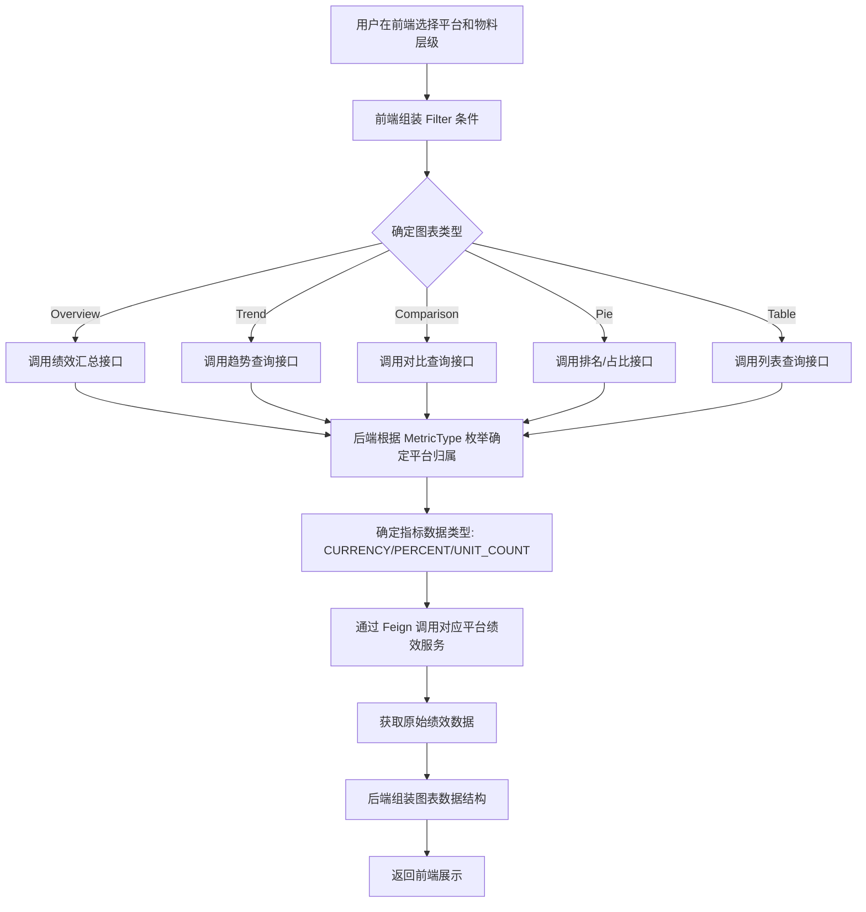
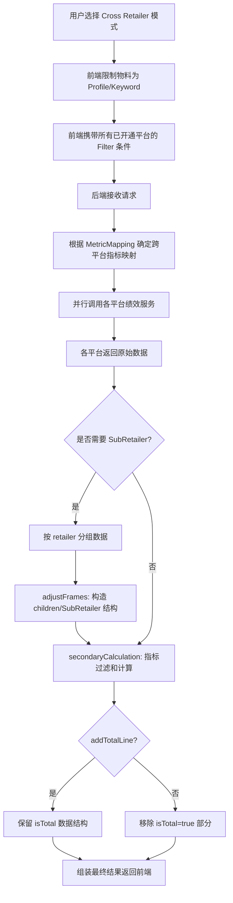
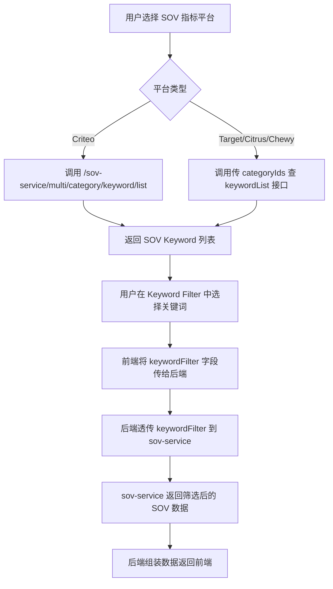
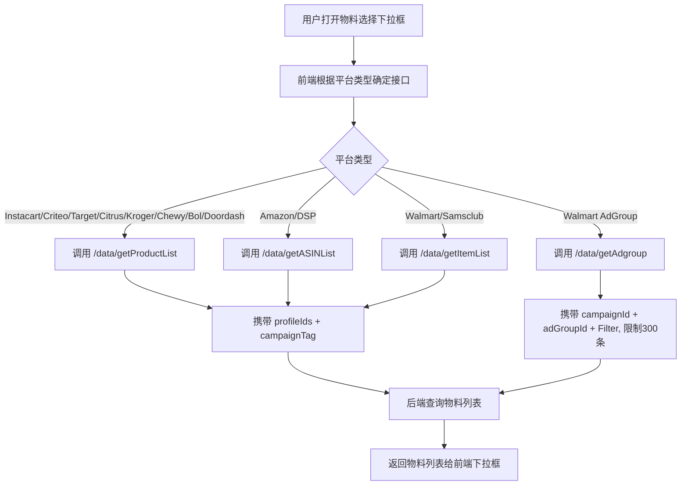

# 其他平台模块 功能逻辑文档

> 本文档由 document-automation 工具自动生成，基于源代码、PRD 文档和技术评审文档。
> 生成时间: 2026-04-07 16:28:40
> 准确性评分: 未验证/100

---


# 其他平台模块 功能逻辑文档

## 1. 模块概述

### 1.1 职责与定位

其他平台模块是 Custom Dashboard 系统中负责对接多个零售媒体广告平台的核心模块集合，覆盖 **Instacart、Criteo、Target、Kroger、DSP、Chewy、Bol、Doordash、Samsclub** 以及 **Citrus** 等平台。该模块的核心职责包括：

1. **广告绩效指标定义**：通过 `MetricType` 枚举为每个平台定义完整的广告绩效指标体系（含广告指标和 SOV 指标），并标注指标的数据类型（CURRENCY / PERCENT / UNIT_COUNT）
2. **物料层级管理**：支持各平台不同层级的广告物料（Profile、Campaign、Product、Keyword、LineItem、AdGroup、SearchTerm 等）的查询与筛选
3. **数据查询与展示**：为 Overview、Trend、Comparison、Pie、Table 五种图表类型提供数据查询能力
4. **跨平台对比（Cross Retailer）**：支持将多个平台的指标进行统一映射和对比分析，包含 SubRetailer 细分展示
5. **SOV 分析**：支持 Instacart、Criteo、Target、Citrus、Chewy 等平台的 Share of Voice 分析，包括品牌 SOV、产品排名等

### 1.2 系统架构位置

该模块位于 Custom Dashboard 后端微服务架构中，作为平台适配层存在。它向上对接前端 Dashboard 组件，向下通过 Feign 调用各平台的绩效数据服务和 SOV 服务。

```
┌─────────────────────────────────────────────────┐
│              Custom Dashboard 前端               │
│  (Cross Retailer Table / Filter / SOV 组件)      │
└──────────────────────┬──────────────────────────┘
                       │ REST API
┌──────────────────────▼──────────────────────────┐
│          Custom Dashboard 后端网关层              │
│  (路由分发、参数校验、图表数据组装)                 │
└──────────────────────┬──────────────────────────┘
                       │
    ┌──────────────────┼──────────────────┐
    ▼                  ▼                  ▼
┌─────────┐    ┌─────────────┐    ┌───────────┐
│Instacart│    │   Criteo    │    │  Target   │
│ Module  │    │   Module    │    │  Module   │
└────┬────┘    └──────┬──────┘    └─────┬─────┘
     │                │                 │
     ▼                ▼                 ▼
┌─────────────────────────────────────────────────┐
│     各平台绩效服务 / sov-service (Feign)          │
└─────────────────────────────────────────────────┘
```

### 1.3 涉及的后端模块

| 后端模块名 | 对应平台 | 说明 |
|---|---|---|
| `custom-dashboard-instacart` | Instacart | Instacart 广告绩效 + SOV |
| `custom-dashboard-criteo` | Criteo | Criteo 广告绩效 + SOV（含多零售商子平台） |
| `custom-dashboard-target` | Target | Target 广告绩效 + SOV |
| `custom-dashboard-kroger` | Kroger | Kroger 广告绩效 |
| `custom-dashboard-dsp` | Amazon DSP | DSP 展示广告绩效 |
| `custom-dashboard-chewy` | Chewy | Chewy 广告绩效 + SOV |
| `custom-dashboard-bol` | Bol | Bol 广告绩效 |
| `custom-dashboard-doordash` | Doordash | Doordash 广告绩效 |
| `custom-dashboard-samsclub` | Sam's Club | Sam's Club 广告绩效 |

### 1.4 涉及的前端组件

- **Cross Retailer Table 组件**：支持 SubRetailer 展开（Show Citrus/Criteo SubRetailer 按钮）
- **CampaignTag Filter 组件**：ASIN/Keyword/Product/Item 物料新增 CampaignTag 筛选条件
- **SOV Keyword Filter 组件**：Criteo/Target/Citrus/Chewy 平台 SOV 关键词筛选
- **AdGroup 物料选择组件**：Walmart 平台，用于 Trend/Table 图表
- **物料下拉框组件**：各平台 Product/Keyword/Item 等物料的搜索选择

### 1.5 Maven 坐标与部署方式

> **待确认**：各子模块的具体 Maven groupId/artifactId 和版本号未在代码片段中体现。根据命名规范推测为 `com.pacvue:custom-dashboard-{platform}` 形式，各模块作为独立 Spring Boot 微服务或作为主服务的子模块部署。

---

## 2. 用户视角

### 2.1 功能场景概述

Custom Dashboard 允许用户在一个统一的仪表盘中查看和分析来自多个零售媒体平台的广告绩效数据。用户可以：

1. **单平台分析**：选择某一平台（如 Instacart），查看该平台下各层级物料的广告绩效和 SOV 数据
2. **跨平台对比（Cross Retailer）**：将 Amazon、Walmart、Instacart、Criteo 等多个平台的同类指标放在同一图表中对比
3. **SOV 分析**：查看品牌在特定关键词/品类下的搜索结果占有率，包括有机排名和付费排名
4. **灵活筛选**：通过 Profile、CampaignTag、Ad Type、Keyword Filter 等多维度筛选条件精确定位数据范围

### 2.2 用户操作流程

#### 场景一：单平台绩效查看

1. 用户进入 Custom Dashboard，创建或编辑一个 Chart
2. 在 Scope Setting 中选择平台（如 Criteo）
3. 选择物料层级（如 Product）
4. 在 Filter 中设置 Profile、CampaignTag 等筛选条件
5. 选择要查看的指标（如 CRITEO_SPEND、CRITEO_ROAS）
6. 选择图表类型（Overview / Trend / Comparison / Pie / Table）
7. 系统查询并展示数据

#### 场景二：Cross Retailer 跨平台对比

1. 用户选择 Cross Retailer 模式
2. 选择 Table 图表类型
3. 选择 Profile 物料层级（Cross Retailer 下仅支持 Profile 物料，以及新增的 Keyword 物料）
4. 系统按 **retailer 分组**（非 profile 分组）展示各平台汇总数据
5. 用户可点击 "Show Citrus SubRetailer" 或 "Show Criteo SubRetailer" 按钮展开子平台数据
6. SubRetailer 数据**一次性加载**，非二次展开请求

#### 场景三：SOV 关键词筛选分析

1. 用户选择支持 SOV 的平台（Criteo/Target/Citrus/Chewy）
2. 选择 SOV 相关指标（如 CRITEO_SOV_BRAND_TOTAL_SOV）
3. 在 SOV Keyword Filter 中选择关键词进行筛选
4. 系统通过 sov-service 查询对应的 SOV 数据并展示

### 2.3 UI 交互要点

#### Filter 联动规则

各平台的物料与 Filter 联动支持情况不同，以下是关键规则：

**Instacart 物料联动**：

| 物料层级 | Profile | Campaign Tag | Ad Type |
|---|:---:|:---:|:---:|
| Filter-linked Campaign | ✓ | ✓ | ✓ |
| Profile | ✓ | ✓ | ✓ |
| Campaign | ✓ | ✓ | |
| Campaign (Parent) Tag | ✓ | | ✓ |
| Campaign Type | ✓ | ✓ | |
| Keyword | ✓ | ✓ | |
| Keyword (Parent) Tag | ✓ | | |
| Product | ✓ | ✓ | |
| Product (Parent) Tag | ✓ | | |
| Search Term | ✓ | ✓ | |

**Criteo 和 Target 物料联动**：

| 物料层级 | Profile | Campaign Tag |
|---|:---:|:---:|
| Filter-linked Campaign | ✓ | ✓ |
| Profile | ✓ | ✓ |
| Campaign | ✓ | ✓ |
| Campaign (Parent) Tag | ✓ | |
| Keyword | ✓ | ✓ |
| Lineitem | ✓ | ✓ |
| Lineitem (Parent) Tag | ✓ | |
| Product | ✓ | ✓ |
| Product (Parent) Tag | ✓ | |
| Search Term | ✓ | ✓ |

**Citrus 物料联动**：

| 物料层级 | Team | Campaign Tag |
|---|:---:|:---:|
| Filter-linked Campaign | ✓ | ✓ |
| Team | ✓ | ✓ |
| Campaign | ✓ | ✓ |
| Campaign (Parent) Tag | ✓ | |
| Keyword | ✓ | ✓ |
| Keyword (Parent) Tag | ✓ | |
| Product | ✓ | ✓ |
| Product (Parent) Tag | ✓ | |
| Category | ✓ | ✓ |

**Kroger 物料联动**：

| 物料层级 | Profile | Campaign Tag |
|---|:---:|:---:|
| Filter-linked Campaign | ✓ | ✓ |
| Profile | ✓ | ✓ |
| Campaign | ✓ | ✓ |
| Campaign (Parent) Tag | ✓ | |
| Keyword | ✓ | ✓ |
| Keyword (Parent) Tag | ✓ | |
| Product | ✓ | ✓ |
| Product (Parent) Tag | ✓ | |

#### Cross Retailer SubRetailer 按钮显示规则

- 如果客户没有 Citrus 权限，不显示 "Show Citrus SubRetailer" 按钮
- 如果客户没有 Criteo 权限，不显示 "Show Criteo SubRetailer" 按钮
- 客户仅有 Citrus 则显示 "Show Citrus SubRetailer"
- 客户仅有 Criteo 则显示 "Show Criteo SubRetailer"
- `showSubRetailer=true` 的触发条件：Table + Cross Retailer 模式，且限制只能选 Profile 物料

#### Ad Type 作为物料

- 仅针对 Amazon、Walmart 和 Instacart 平台
- 除 Stacked Bar Chart 以外，其余 Chart 的所有细分类型下都支持选择 Ad Type
- 选择 Ad Type 后，默认数据查询范围跟随 Filter

---

## 3. 核心 API

### 3.1 物料列表查询接口

#### 3.1.1 获取 Product 物料列表

| 属性 | 说明 |
|---|---|
| **路径** | `/data/getProductList` |
| **方法** | 待确认（推测 POST） |
| **适用平台** | Instacart、Criteo、Target、Citrus、Kroger、Chewy、Bol、Doordash |
| **请求参数** | `profileIds`（Profile ID 列表）、`campaignTag`（Campaign 标签筛选，V2026Q1S1 新增）、`keywordFilter`（关键词过滤）、搜索关键字等 |
| **返回值** | Product 物料列表（包含 productId、productName、缩略图等） |
| **说明** | 各平台物料名称不同：Instacart 为 InstacartProduct，Criteo/Target/Kroger/Chewy/Bol/Doordash 为 Product，Citrus 为 CitrusProduct |

#### 3.1.2 获取 Keyword 物料列表

| 属性 | 说明 |
|---|---|
| **路径** | `/data/getKeywordList` |
| **方法** | 待确认（推测 POST） |
| **适用平台** | 所有支持 Keyword 物料的平台（Amazon、Walmart、Instacart、Criteo、Target、Citrus 等） |
| **请求参数** | `profileIds`、`campaignTag`（V2026Q1S1 新增）、搜索关键字等 |
| **返回值** | Keyword 物料列表 |

#### 3.1.3 获取 ASIN 物料列表

| 属性 | 说明 |
|---|---|
| **路径** | `/data/getASINList` |
| **方法** | 待确认（推测 POST） |
| **适用平台** | Amazon、DSP |
| **请求参数** | `profileIds`、`campaignTag`（V2026Q1S1 新增） |
| **返回值** | ASIN 物料列表 |

#### 3.1.4 获取 Item 物料列表

| 属性 | 说明 |
|---|---|
| **路径** | `/data/getItemList` |
| **方法** | 待确认（推测 POST） |
| **适用平台** | Walmart、Sam's Club |
| **请求参数** | `profileIds`、`campaignTag`（V2026Q1S1 新增） |
| **返回值** | Item 物料列表 |

#### 3.1.5 获取 Walmart AdGroup 物料列表

| 属性 | 说明 |
|---|---|
| **路径** | `/data/getAdgroup` |
| **方法** | 待确认（推测 POST） |
| **适用平台** | Walmart |
| **请求参数** | `campaignId`、`adGroupId`、Filter 条件 |
| **返回值** | AdGroup 物料列表（**限制最多 300 条**） |
| **说明** | 由于 AdGroup 数量可能很多，需要 Filter 且后台限制 300 条。按 `campaignId + adGroupId` 作为唯一一行 |

### 3.2 SOV 数据查询接口

#### 3.2.1 SOV 关键词列表查询（Criteo 新增）

| 属性 | 说明 |
|---|---|
| **路径** | `/sov-service/multi/category/keyword/list` |
| **方法** | 待确认（推测 POST） |
| **适用平台** | Criteo |
| **请求参数** | `categoryIds`（品类 ID 列表） |
| **返回值** | SOV 关键词列表 |
| **说明** | V2026Q1S1 新增，用于 Criteo SOV 关键词筛选下拉框 |

#### 3.2.2 SOV 产品列表查询

| 属性 | 说明 |
|---|---|
| **路径** | `/sov-service/sov/product/list` |
| **方法** | 待确认（推测 POST） |
| **适用平台** | Criteo、Target、Citrus、Chewy（共用） |
| **请求参数** | `categoryIds`、`keywordFilter`（V2026Q1S1 新增） |
| **返回值** | SOV 产品列表 |
| **说明** | 新增 `keywordFilter` 字段支持按关键词筛选 SOV 产品数据 |

#### 3.2.3 SOV 品牌列表查询

| 属性 | 说明 |
|---|---|
| **路径** | `/sov-service/sov/brand/list` |
| **方法** | 待确认（推测 POST） |
| **适用平台** | Criteo、Target、Citrus（共用） |
| **请求参数** | `categoryIds`、`keywordFilter`（V2026Q1S1 新增） |
| **返回值** | SOV 品牌列表 |

### 3.3 绩效查询接口

> **待确认**：各平台的绩效查询接口路径未在代码片段中明确给出。根据技术评审文档，各平台需提供以下类型的绩效查询能力：

| 查询类型 | 说明 | 适用图表 |
|---|---|---|
| 绩效汇总查询 | 查询物料级别的绩效汇总数据，含 POP/YOY 对比值 | Overview |
| 趋势查询 | 按时间颗粒度（Daily/Weekly/Monthly）查询绩效趋势 | Trend |
| 对比查询 | 按物料或指标分组的对比数据，含 POP/YOY | Comparison |
| 排名/占比查询 | Top N 排名或自选范围的占比数据 | Pie |
| 列表查询 | 分页列表数据，支持多字段排序，含 POP/YOY | Table |

### 3.4 Cross Retailer 绩效查询约定

根据技术评审文档，Cross Retailer 场景下的绩效查询有以下关键约定：

- **分组方式**：直接根据 **retailer 分组**，而不是先 profile 分组再 retailer 分组
- **SubRetailer 数据**：一次性加载，非二次展开请求
- **物料限制**：showSubRetailer=true 时，限制只能选 Profile 物料
- **Total 行**：`addTotalLine` 决定 frames 中是否存在 `isTotal` 的数据结构；即使 list/total 接口二合一，也会移除 `isTotal=true` 部分

---

## 4. 核心业务流程

### 4.1 单平台绩效查询流程



### 4.2 Cross Retailer 跨平台对比流程



### 4.3 SOV 关键词筛选流程



### 4.4 物料列表查询流程（含 CampaignTag 筛选）



### 4.5 Trend 图表查询模式详解

Trend 图表支持三种查询模式：

1. **单指标模式（Single Metric）**：选择一个指标，按物料分组，每个物料一条趋势线
2. **多指标模式（Multi Metric）**：选择多个指标，按指标分组，每个指标一条趋势线，查询条件相同
3. **自定义模式（Customize）**：每个指标可单独选物料层级和数据范围。Custom Dashboard 根据所选物料层级和数据范围分组，调用多次平台接口查询绩效，全部调用结束后组装结果返回前端

时间颗粒度支持：**Daily**、**Weekly**、**Monthly**

### 4.6 关键设计模式

#### 4.6.1 策略模式（Strategy Pattern）

各平台和物料层级使用独立的 Strategy 类处理特定的业务逻辑。例如：

- **AdGroupStrategy**（Walmart）：将 `campaignId + adGroupId` 作为唯一主键，处理 AdGroup 层级的绩效查询和数据组装
- 各平台的绩效查询 Service 也遵循策略模式，根据平台类型分发到对应的实现

#### 4.6.2 枚举分组模式

`MetricType` 枚举通过平台分类标签进行分组管理：

- `INSTACART` — Instacart 广告指标
- `INSTACART_SOV` — Instacart SOV 指标
- `CRITEO` — Criteo 广告指标
- `CRITEO_SOV` — Criteo SOV 指标
- `TARGET` — Target 广告指标
- `CHEWY` — Chewy 广告指标
- 其他平台类似

每个枚举值同时携带数据类型标签（CURRENCY / PERCENT / UNIT_COUNT），用于前端展示格式化和后端计算逻辑。

#### 4.6.3 职责分离模式（Cross Retailer 数据处理）

Cross Retailer 场景下，数据处理分为两个职责单一的步骤：

- **`secondaryCalculation`**：负责 Cross Retailer 的 list 和 total 行的**指标过滤和计算**（如 ACOS 需要根据 Spend/Sales 重新计算，而非简单求和）
- **`adjustFrames`**：负责构造 **children 结构**（SubRetailer 展开数据）

两者职责单一，互不耦合。

---

## 5. 数据模型

### 5.1 数据库表结构

> **待确认**：具体的数据库表结构未在代码片段中体现。各平台的绩效数据通常存储在各自平台服务的数据库中，Custom Dashboard 通过 Feign 接口获取数据，本模块可能不直接操作数据库。

### 5.2 核心枚举：MetricType

`MetricType` 是整个模块的核心枚举类，定义了所有平台的所有指标。每个枚举值包含两个属性：

- **平台分类标签**：标识指标所属平台（如 `INSTACART`、`CRITEO`、`INSTACART_SOV`）
- **数据类型**：标识指标的展示和计算类型（`CURRENCY`、`PERCENT`、`UNIT_COUNT`，部分指标未指定类型则为默认）

#### Instacart 广告指标（INSTACART 分组）

| 枚举值 | 数据类型 | 说明 |
|---|---|---|
| `INSTACART_IMPRESSION` | 待确认（推测 UNIT_COUNT） | 展示量 |
| `INSTACART_CLICKS` | 待确认（推测 UNIT_COUNT） | 点击量 |
| `INSTACART_CTR` | PERCENT | 点击率 |
| `INSTACART_SPEND` | CURRENCY | 花费 |
| `INSTACART_CPC` | CURRENCY | 单次点击成本 |
| `INSTACART_CPM` | CURRENCY | 千次展示成本 |
| `INSTACART_CPA` | CURRENCY | 单次转化成本 |
| `INSTACART_CVR` | PERCENT | 转化率 |
| `INSTACART_ACOS` | PERCENT | 广告花费占销售额比 |
| `INSTACART_ROAS` | CURRENCY | 广告投资回报率 |
| `INSTACART_SALES` | CURRENCY | 销售额 |
| `INSTACART_SALE_UNITS` | UNIT_COUNT | 销售数量 |
| `INSTACART_ASP` | CURRENCY | 平均售价 |
| `INSTACART_NTB_SALES` | CURRENCY | 新客销售额 |
| `INSTACART_NTB_SALES_PERCENT` | PERCENT | 新客销售额占比 |
| `INSTACART_NTB_HALO_SALES` | CURRENCY | 新客光环销售额 |
| `INSTACART_NTB_HALO_SALES_PERCENT` | PERCENT | 新客光环销售额占比 |

#### Instacart SOV 指标（

---

*本文档由 AI 自动生成，如有不准确之处请以源代码为准。标注"待确认"的内容需要人工核实。*