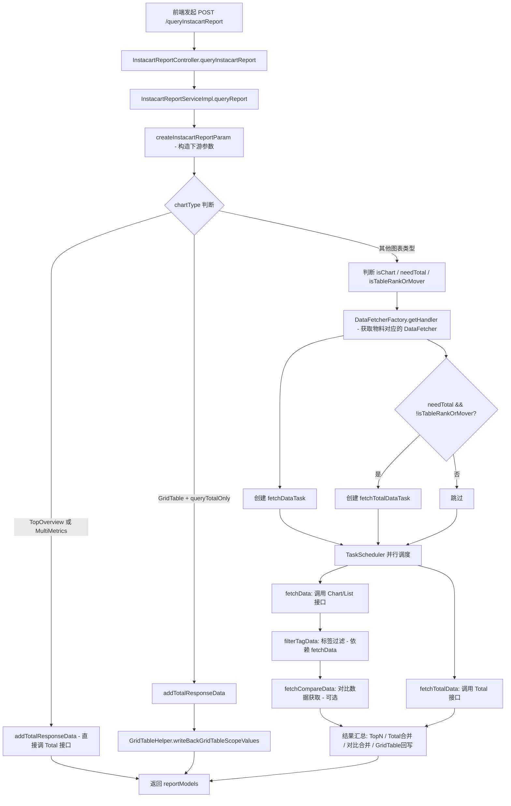
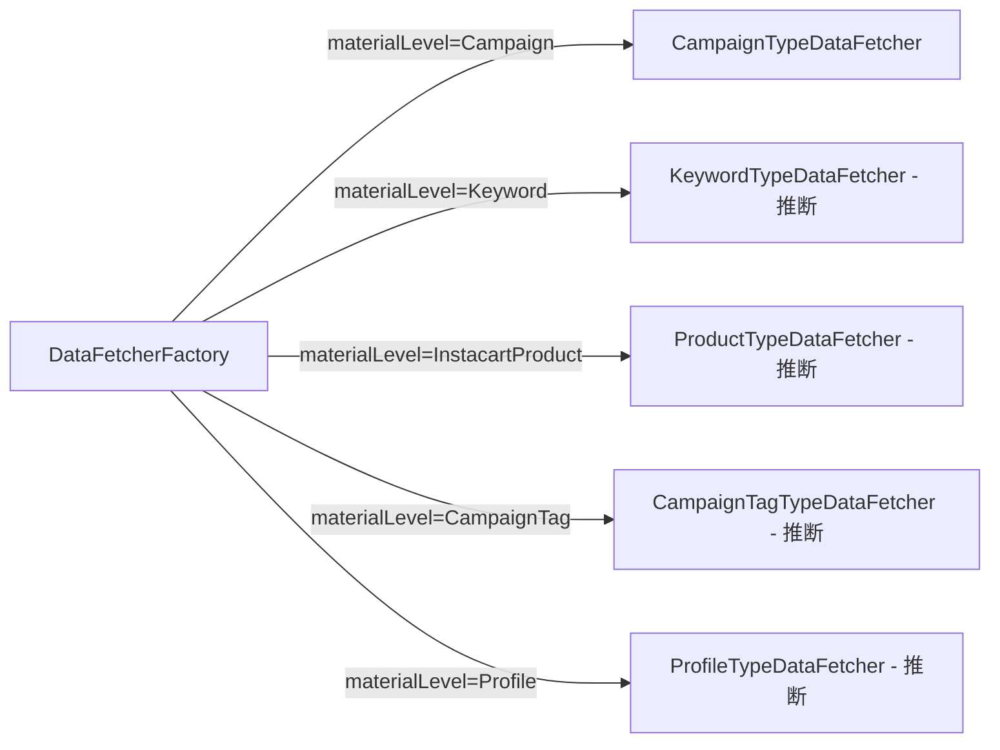
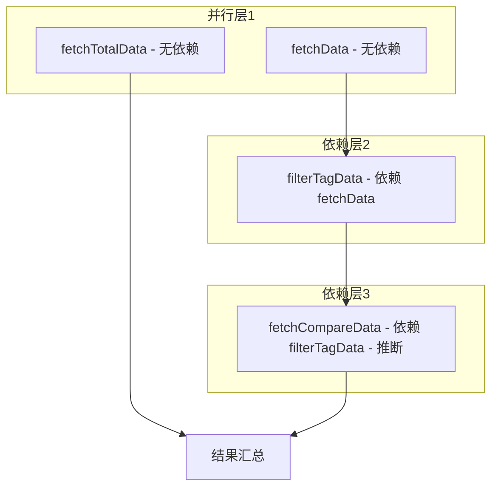

# Instacart 平台模块 功能逻辑文档

> 本文档由 document-automation 工具自动生成，基于源代码、PRD 文档和技术评审文档。
> 生成时间: 2026-04-09 10:39:00
> 准确性评分: 未验证/100

---


# Instacart 平台模块 功能逻辑文档

## 1. 模块概述

### 1.1 模块职责与定位

Instacart 平台模块是 Pacvue Custom Dashboard 系统中负责 **Instacart 广告平台报表数据查询与展示** 的垂直业务模块。该模块的核心职责是：

1. **接收前端报表查询请求**：解析包含图表类型（ChartType）、物料层级（MaterialLevel）、指标配置等参数的请求体。
2. **编排并行数据获取任务**：通过工厂模式和任务调度器，根据不同物料层级（Campaign/Keyword/Product/CampaignTag/Profile）分发到对应的数据获取器（DataFetcher），并行调用下游 Instacart 报表数据服务。
3. **汇总处理与返回**：对获取的原始数据进行 TopN 筛选、Total 行计算、对比数据合并、GridTable 回写等后处理，最终返回统一的 `List<InstacartReportModel>` 结构。
4. **前端指标映射与渲染**：前端通过 `instacart.js` 指标定义文件，将后端返回的数据映射为 Trend Chart（折线图）、Bar Chart（柱状图）、Table（表格）、TopOverview（概览卡片）、Pie Chart（饼图）等多种可视化形式。

### 1.2 系统架构位置与上下游关系

```
┌─────────────────────────────────────────────────────────────────┐
│                        前端 (Vue.js)                             │
│  instacart.js 指标定义 / ASINItem.vue / topOverView.vue          │
│  defaultCustomDashboard.js 过滤配置                               │
└──────────────────────────┬──────────────────────────────────────┘
                           │ HTTP POST /queryInstacartReport
                           ▼
┌─────────────────────────────────────────────────────────────────┐
│              custom-dashboard-gateway (网关/聚合层)               │
│  通过 InstacartReportFeign 声明式调用                              │
└──────────────────────────┬──────────────────────────────────────┘
                           │ Feign RPC
                           ▼
┌─────────────────────────────────────────────────────────────────┐
│           custom-dashboard-instacart (本模块)                     │
│  InstacartReportController → InstacartReportServiceImpl          │
│  DataFetcherFactory → AbstractDataFetcher 子类                   │
│  TaskScheduler + AbstractTask 并行编排                            │
└──────────────────────────┬──────────────────────────────────────┘
                           │ Feign RPC (InstacartApiFeign)
                           ▼
┌─────────────────────────────────────────────────────────────────┐
│           下游 Instacart 报表数据服务                              │
│  /api/Report/v2/chart                                            │
│  /api/Report/v2/campaign/list | TotalData                        │
│  /api/Report/v2/keyword/List | keywordChart | TotalData          │
│  /api/Report/v2/product/List | productChart | TotalData          │
│  /api/Report/v2/campaignTag/List | TotalData                     │
│  /api/Report/v2/profile/TotalData                                │
└─────────────────────────────────────────────────────────────────┘
```

### 1.3 涉及的后端模块与前端组件

**后端 Maven 模块：**
- `custom-dashboard-instacart`：核心业务模块，包含 Controller、Service、DataFetcher 等
- 依赖的公共模块（推断）：`pacvue-base`（基础 DTO、枚举、注解）、`pacvue-feign`（Feign 客户端定义与 DTO）

**关键后端类清单：**

| 类名 | 包路径 | 职责 |
|---|---|---|
| `InstacartReportController` | `com.pacvue.instacart.controller`（推断） | 实现 `InstacartReportFeign` 接口，接收请求 |
| `InstacartReportServiceImpl` | `com.pacvue.instacart.service.Impl` | 核心业务编排，任务调度 |
| `InstacartReportService` | `com.pacvue.instacart.service` | 服务接口定义 |
| `InstacartReportRequest` | `com.pacvue.feign.dto.request.instacart` | 前端请求 DTO |
| `InstacartReportParams` | `com.pacvue.instacart.entity.request` | 下游接口请求参数 |
| `InstacartReportModel` | `com.pacvue.feign.dto.response.instacart` | 报表数据模型，继承 `InstacartReportDataBase` |
| `InstacartReportDataBase` | `com.pacvue.feign.dto.response.instacart` | 报表数据基类 |
| `DataFetcherFactory` | **待确认** | 工厂类，根据 materialLevel 获取对应 DataFetcher |
| `AbstractDataFetcher` | **待确认** | 抽象数据获取器，定义模板方法 |
| `CampaignTypeDataFetcher` | **待确认** | Campaign 物料的 DataFetcher 实现 |
| `TaskScheduler` | **待确认** | 任务调度器，支持并行执行与依赖编排 |
| `AbstractTask` | **待确认** | 抽象任务基类 |
| `GridTableHelper` | **待确认** | GridTable 数据回写辅助工具 |
| `InstacartApiFeign` | **待确认** | 下游 Instacart 报表服务的 Feign 客户端 |
| `InstacartReportFeign` | `com.pacvue.feign`（推断） | 本模块对外暴露的 Feign 接口 |

**前端组件：**

| 文件 | 职责 |
|---|---|
| `metricsList/instacart.js` | Instacart 指标定义，包含 SearchAd 和 SOV 两大类指标的映射配置 |
| `components/ASINItem.vue` | 物料展示组件，支持 `InstacartProduct` 类型，使用 `upc` 作为标识 |
| `dialog/topOverView.vue` | TopOverview 图表组件，包含 `INSTACART` 前缀处理逻辑 |
| `public/defaultCustomDashboard.js` | 过滤搜索物料配置，包含 `InstacartProduct` |

### 1.4 部署方式

本模块作为独立微服务部署，服务名为 `custom-dashboard-instacart`（由 `@FeignClient(name = "${feign.client.custom-dashboard-instacart:custom-dashboard-instacart}")` 确认）。上游网关/聚合层通过 Feign 进行服务发现与调用。

---

## 2. 用户视角

### 2.1 功能场景总览

基于 PRD 文档和代码分析，Instacart 平台模块支持以下核心功能场景：

1. **Instacart 广告数据看板查看**：用户在 Custom Dashboard 中创建或查看包含 Instacart 平台数据的图表
2. **多维度物料切换**：用户可选择 Campaign、Keyword、Product、CampaignTag、Profile 等不同物料层级查看数据
3. **多图表类型展示**：支持 Trend Chart、TopOverview、Comparison Chart、Pie Chart、Table、GridTable 等图表类型
4. **指标选择与配置**：用户可从 SearchAd 和 SOV 两大类指标中选择展示指标
5. **数据对比**：支持 YOY（同比）、POP（环比）、自定义时间范围对比
6. **物料筛选**：支持通过 CampaignTag 筛选 Product 和 Keyword 物料
7. **Cross Retailer 对比**：在跨平台对比场景中，Instacart 作为可选平台之一参与数据聚合

### 2.2 用户操作流程

#### 场景一：创建 Instacart Trend Chart

**步骤 1**：用户进入 Custom Dashboard 页面，点击 "Add Chart" 按钮（参考 Figma 设计稿 `Custom Dashboard-Stacked Bar Chart1/Frame 288/Frame 67` 中的 "Add Chart" 按钮）。

**步骤 2**：在图表配置面板中，选择平台为 "Instacart"（参考 Figma 设计稿 `Filter/Frame 427319178` 中的 Instacart 多选项）。

**步骤 3**：选择图表类型为 "Trend Chart"。

**步骤 4**：选择物料层级（Material Level），可选项包括：
- **Profile**：按账户维度聚合
- **Campaign**：按广告活动维度
- **Keyword**：按关键词维度
- **Product（InstacartProduct）**：按商品维度，使用 `upc` 作为唯一标识
- **CampaignTag**：按广告活动标签维度

**步骤 5**：选择指标（Metrics），从 SearchAd 类指标中选择，如 Impression、Click、CTR、Spend、CPC、CPM、CPA、CVR、ACOS、ROAS、Sales、Sale Units、ASP、NTB Sales 等。

**步骤 6**：配置时间范围、对比模式（可选 POP/YOY/自定义对比时间）。

**步骤 7**：可选配置 "Add Total Line"（添加汇总线）、"Show Top N Percentage"（显示 TopN 百分比）。

**步骤 8**：点击 "Save" 保存配置（参考 Figma 设计稿 `Custom Dashboard-Pie Chart/Frame 289/FooterToolBar` 中的 Cancel/Previous/Save 按钮组）。

**步骤 9**：前端根据配置构造 `InstacartReportRequest`，发起 POST 请求到 `/queryInstacartReport`，后端返回 `List<InstacartReportModel>`，前端根据 `instacart.js` 中的指标配置渲染为折线图。

#### 场景二：查看 TopOverview 概览

**步骤 1**：用户配置图表类型为 "TopOverview"。

**步骤 2**：前端发起请求，`chartType` 设为 `TopOverview`。

**步骤 3**：后端直接走 Total 接口获取汇总数据，不经过 List 接口。

**步骤 4**：前端 `topOverView.vue` 组件接收数据，处理 `INSTACART` 前缀逻辑后渲染为概览卡片。

#### 场景三：查看 Table 数据

**步骤 1**：用户配置图表类型为 "Table"。

**步骤 2**：前端发起请求，可设置 `queryTotalOnly=true` 仅查询汇总行。

**步骤 3**：后端通过 List 接口获取分页数据 + Total 接口获取汇总数据。

**步骤 4**：`GridTableHelper.writeBackGridTableScopeValues` 将 Scope 值回写到结果中。

**步骤 5**：前端渲染为表格，支持多指标列展示。

#### 场景四：物料筛选（CampaignTag 筛选 Product/Keyword）

根据技术评审文档 `Custom Dashboard 2026Q1S1技术评审` 第二节：

**步骤 1**：用户在 Instacart 平台下选择 Product 或 Keyword 物料层级。

**步骤 2**：在 Filter 区域新增 CampaignTag 筛选条件。

**步骤 3**：前端将 CampaignTag 筛选条件传入请求参数。

**步骤 4**：后端在构造 `InstacartReportParams` 时，将 CampaignTag 筛选条件透传到下游接口（`/api/Report/v2/product/List`、`/api/Report/v2/keyword/List`）。

### 2.3 UI 交互要点

- **物料展示**：`ASINItem.vue` 组件支持 `InstacartProduct` 类型，使用 `upc`（Universal Product Code）作为商品标识，而非 Amazon 的 ASIN
- **TopOverview 前缀处理**：`topOverView.vue` 中包含 `INSTACART` 前缀处理逻辑，用于区分不同平台的指标命名
- **过滤搜索配置**：`defaultCustomDashboard.js` 中配置了 `InstacartProduct` 作为可搜索的物料类型
- **平台选择**：Figma 设计稿显示 Instacart 作为 Filter 下拉菜单中的多选项之一

---

## 3. 核心 API

### 3.1 对外暴露接口（InstacartReportFeign）

#### 3.1.1 查询 Instacart 报表数据

- **路径**: `POST /queryInstacartReport`
- **Feign 客户端**: `InstacartReportFeign`
- **服务名**: `custom-dashboard-instacart`（可通过配置 `feign.client.custom-dashboard-instacart` 覆盖）
- **contextId**: `custom-dashboard-instacart-advertising`

**请求参数** (`InstacartReportRequest extends BaseRequest`):

| 字段 | 类型 | 说明 |
|---|---|---|
| `chartType` | `ChartType` 枚举 | 图表类型：TopOverview / GridTable / Trend / Comparison / Pie / Table 等 |
| `materialLevel` | `MetricScopeType` 枚举 | 物料层级：Profile / Campaign / CampaignTag / CampaignParentTag / Keyword / KeywordTag / KeywordParentTag / InstacartProduct / ProductTag / ProductParentTag / FilterLinkedCampaign |
| `addTotalLine` | `Boolean` | 是否添加汇总行/线 |
| `showTopNPercentage` | `Boolean` | 是否显示 TopN 百分比 |
| `queryTotalOnly` | `Boolean` | 是否仅查询汇总数据（用于 GridTable 场景） |
| 其他字段 | 继承自 `BaseRequest` | 包含时间范围、Profile ID、过滤条件、分页信息、对比模式等（**待确认**具体字段） |

**返回值**: `List<InstacartReportModel>`

**指标注解配置** (`@IndicatorMethod`):

支持的指标类型（`MetricType`）：

| 指标 | 说明 |
|---|---|
| `INSTACART_IMPRESSION` | 展示量 |
| `INSTACART_CLICK` | 点击量 |
| `INSTACART_CTR` | 点击率 |
| `INSTACART_SPEND` | 花费 |
| `INSTACART_CPC` | 单次点击成本 |
| `INSTACART_CPM` | 千次展示成本 |
| `INSTACART_CPA` | 单次转化成本 |
| `INSTACART_CVR` | 转化率 |
| `INSTACART_ACOS` | 广告花费占销售额比 |
| `INSTACART_ROAS` | 广告投资回报率 |
| `INSTACART_SALES` | 销售额 |
| `INSTACART_SALE_UNITS` | 销售数量 |
| `INSTACART_ASP` | 平均售价 |
| `INSTACART_NTB_SALES` | 新客销售额 |
| `INSTACART_NTB_SALES_PERCENT` | 新客销售额占比 |
| `INSTACART_NTB_HALO_SALES` | 新客光环销售额 |
| `INSTACART_NTB_HALO_SALES_PERCENT` | 新客光环销售额占比 |
| `CampaignTargetACOS` | Campaign 目标 ACOS |
| `CampaignTargetROAS` | Campaign 目标 ROAS |
| `CampaignTargetCPA` | Campaign 目标 CPA |
| `CampaignTargetCPC` | Campaign 目标 CPC |

支持的 Scope 类型（`MetricScopeType`）：
`Profile`、`Campaign`、`CampaignTag`、`CampaignParentTag`、`Keyword`、`KeywordTag`、`KeywordParentTag`、`InstacartProduct`、`ProductTag`、`ProductParentTag`、`FilterLinkedCampaign`

支持的平台：`Platform.Instacart`

**缓存注解**: `@FeignMethodCache(forceRefresh = true)` — 强制刷新缓存，每次请求都获取最新数据。

### 3.2 下游 Feign 接口（InstacartApiFeign）

本模块通过 `InstacartApiFeign` 调用下游 Instacart 报表数据服务，接口清单如下：

#### 3.2.1 通用 Chart 接口

- **路径**: `POST /api/Report/v2/chart`
- **参数**: `InstacartReportParams`
- **返回值**: `BaseResponse<List<InstacartReportModel>>`
- **说明**: 获取时间序列图表数据，用于 Trend Chart 渲染

#### 3.2.2 Campaign 相关接口

| 路径 | 方法 | 返回值 | 说明 |
|---|---|---|---|
| `POST /api/Report/v2/campaign/list` | `getInstacartCampaignList` | `BaseResponse<PageResponse<InstacartReportModel>>` | Campaign 列表数据（分页） |
| `POST /api/Report/v2/campaign/TotalData` | `getInstacartCampaignTotal` | `BaseResponse<InstacartReportModel>` | Campaign 汇总数据 |

#### 3.2.3 Keyword 相关接口

| 路径 | 方法 | 返回值 | 说明 |
|---|---|---|---|
| `POST /api/Report/v2/keyword/List` | `getInstacartKeywordList` | `BaseResponse<PageResponse<InstacartReportModel>>` | Keyword 列表数据（分页） |
| `POST /api/Report/v2/keywordChart` | `getInstacartKeywordChart` | `BaseResponse<List<InstacartReportModel>>` | Keyword 图表数据 |
| `POST /api/Report/v2/keyword/TotalData` | `getInstacartKeywordTotal` | `BaseResponse<InstacartReportModel>` | Keyword 汇总数据 |

#### 3.2.4 Product 相关接口

| 路径 | 方法 | 返回值 | 说明 |
|---|---|---|---|
| `POST /api/Report/v2/product/List` | `getInstacartProductList` | `BaseResponse<PageResponse<InstacartReportModel>>` | Product 列表数据（分页） |
| `POST /api/Report/v2/productChart` | `getInstacartProductChart` | `BaseResponse<List<InstacartReportModel>>` | Product 图表数据 |
| `POST /api/Report/v2/product/TotalData` | `getInstacartProductTotal` | `BaseResponse<InstacartReportModel>` | Product 汇总数据 |

#### 3.2.5 CampaignTag 相关接口

| 路径 | 方法 | 返回值 | 说明 |
|---|---|---|---|
| `POST /api/Report/v2/campaignTag/List` | `getInstacartCampaignTagList` | `BaseResponse<PageResponse<InstacartReportModel>>` | CampaignTag 列表数据（分页） |
| `POST /api/Report/v2/campaignTag/TotalData` | `getInstacartCampaignTagTotal` | `BaseResponse<InstacartReportModel>` | CampaignTag 汇总数据 |

#### 3.2.6 Profile 相关接口

| 路径 | 方法 | 返回值 | 说明 |
|---|---|---|---|
| `POST /api/Report/v2/profile/TotalData` | `getInstacartProfileTotal` | `BaseResponse<InstacartReportModel>` | Profile 汇总数据 |

---

## 4. 核心业务流程

### 4.1 主流程：queryReport 报表查询编排

`InstacartReportServiceImpl.queryReport` 是本模块的核心入口方法，负责根据请求参数编排不同的数据获取任务。以下逐步详细描述其执行逻辑：

#### 步骤 1：生成请求 ID 与初始化容器

```java
String requestId = UUID.randomUUID().toString();
List<InstacartReportModel> reportModels = new CopyOnWriteArrayList<>();
List<InstacartReportModel> compare = new CopyOnWriteArrayList<>();
```

- 生成唯一 `requestId` 用于任务命名和追踪
- 使用 `CopyOnWriteArrayList` 作为线程安全的结果容器，因为后续会有多个并行任务写入

#### 步骤 2：构造下游请求参数

```java
InstacartReportParams reportParam = createInstacartReportParam(instacartReportRequest);
```

调用 `createBaseInstacartReportParam` 方法，依次执行：
1. `setDim(params, request)` — 设置时间维度（日/周/月）
2. `setTopNData(request)` — 设置 TopN 相关参数
3. `setIdentifiers(params, request)` — 设置标识符（Profile ID、Campaign ID 等）
4. `setFilters(params, request)` — 设置过滤条件（包括 CampaignTag 筛选）
5. `setPageInfo(params, request)` — 设置分页信息
6. `applyAdditionalRequirement(request, params)` — 应用额外需求配置
7. `setKindTypeAndGroupBy(params, request)` — 设置数据类型和分组方式

#### 步骤 3：特殊情况快速返回

**TopOverview 快速路径**：
```java
if (ChartType.TopOverview.equals(instacartReportRequest.getChartType())
    || isMultiModeCompare(instacartReportRequest, MultiMetrics.name())) {
    addTotalResponseData(reportModels, reportParam, instacartReportRequest, false);
    return reportModels;
}
```
- 当图表类型为 `TopOverview` 或对比模式为 `MultiMetrics` 时，直接调用 Total 接口获取汇总数据并返回
- 不需要 List 数据，因为 TopOverview 只展示汇总指标

**GridTable 仅查询 Total 快速路径**：
```java
if (ChartType.GridTable.equals(instacartReportRequest.getChartType()) 
    && BooleanUtils.isTrue(instacartReportRequest.getQueryTotalOnly())) {
    addTotalResponseData(reportModels, reportParam, instacartReportRequest, true);
    GridTableHelper.writeBackGridTableScopeValues(reportModels, instacartReportRequest, true);
    return reportModels;
}
```
- GridTable 场景下，如果 `queryTotalOnly=true`，仅获取 Total 数据
- 通过 `GridTableHelper.writeBackGridTableScopeValues` 将 Scope 配置值回写到结果模型中

#### 步骤 4：判断任务类型标志

```java
boolean isChart = isChart(instacartReportRequest);
boolean needTotal = Boolean.TRUE.equals(instacartReportRequest.getAddTotalLine()) ||
    Boolean.TRUE.equals(instacartReportRequest.getShowTopNPercentage());
boolean isTableRankOrMover = isTableRankOrMover(instacartReportRequest);
```

- `isChart`：判断是否为图表类型（Trend Chart 等），决定调用 Chart 接口还是 List 接口
- `needTotal`：是否需要额外获取 Total 数据（用于添加汇总线或计算 TopN 百分比）
- `isTableRankOrMover`：是否为 Table 的 Rank 或 Mover 模式

#### 步骤 5：获取对应物料的 DataFetcher

```java
AbstractDataFetcher handler = dataFetcherFactory.getHandler(instacartReportRequest.getMaterialLevel());
```

`DataFetcherFactory` 根据 `materialLevel`（如 `Campaign`、`Keyword`、`InstacartProduct` 等）从注册的 handler 映射中获取对应的 `AbstractDataFetcher` 实现类。

#### 步骤 6：创建并注册任务

**任务 1 — fetchData（主数据获取）**：
```java
AbstractTask<List<InstacartReportModel>> fetchDataTask =
    handler.createFetchDataTask(fetchDataTaskName, reportParam, isChart, reportModels);
taskScheduler.addTask(fetchDataTask, new ArrayList<>());
```
- 无依赖，可立即执行
- 如果 `isChart=true`，调用 Chart 接口（如 `getInstacartChart`）
- 如果 `isChart=false`，调用 List 接口（如 `getInstacartCampaignList`）

**任务 2 — fetchTotalData（汇总数据获取，可选）**：
```java
if (needTotal && !isTableRankOrMover) {
    AbstractTask<InstacartReportModel> fetchTotalDataTask =
        handler.createFetchTotalDataTask(fetchTotalDataTaskName, reportParam);
    taskScheduler.addTask(fetchTotalDataTask, new ArrayList<>());
}
```
- 无依赖，与 fetchData **并行执行**
- 调用对应物料的 Total 接口（如 `getInstacartCampaignTotal`）

**任务 3 — filterTagData（标签过滤，依赖 fetchData）**：
- 代码片段中被截断，但从任务名和上下文推断：
- 依赖 `fetchData` 任务的结果
- 对获取的列表数据进行标签过滤处理

**任务 4 — fetchCompareData（对比数据获取，可选）**：
- 用于 YOY/POP 对比场景
- 可能依赖 fetchData 或独立执行（**待确认**具体依赖关系）

#### 步骤 7：执行任务调度

`TaskScheduler` 根据注册的任务及其依赖关系，进行拓扑排序后并行执行。无依赖的任务（如 fetchData 和 fetchTotalData）可同时启动，有依赖的任务（如 filterTagData）等待前置任务完成后再执行。

#### 步骤 8：结果汇总与后处理

任务执行完成后，服务层进行以下后处理：
1. **TopN 筛选**：如果配置了 TopN，从结果中筛选前 N 条数据
2. **Total 行合并**：将 fetchTotalData 的结果作为 `isTotal=true` 的行合并到结果列表
3. **对比数据合并**：将 fetchCompareData 的结果与主数据合并
4. **GridTable 回写**：调用 `GridTableHelper.writeBackGridTableScopeValues` 处理 GridTable 特有逻辑

### 4.2 主流程 Mermaid 图



### 4.3 DataFetcher 工厂模式与模板方法模式

#### 工厂模式（DataFetcherFactory）



`DataFetcherFactory` 在初始化时自动扫描所有 `AbstractDataFetcher` 的实现类，通过 `@ScopeTypeQualifier` 注解（**待确认**注解名称）将 `MetricScopeType` 映射到对应的实现类，注册到内部的 `handlerMap` 中。

#### 模板方法模式（AbstractDataFetcher）

`AbstractDataFetcher` 定义了以下抽象方法（模板方法）：

| 方法 | 说明 | 示例实现（CampaignTypeDataFetcher） |
|---|---|---|
| `doFetchChartData(InstacartReportParams)` | 获取图表数据 | 调用 `instacartApiFeign.getInstacartChart(params)` |
| `doFetchListData(InstacartReportParams)` | 获取列表数据 | 调用 `instacartApiFeign.getInstacartCampaignList(params)`（**推断**） |
| `doFetchTotalData(InstacartReportParams)` | 获取汇总数据 | 调用 `instacartApiFeign.getInstacartCampaignTotal(params)`（**推断**） |
| `createFetchDataTask(...)` | 创建主数据获取任务 | 封装为 AbstractTask，根据 isChart 决定调用 chart 还是 list |
| `createFetchTotalDataTask(...)` | 创建汇总数据获取任务 | 封装为 AbstractTask，调用 fetchTotalData |

从代码片段可以确认 `CampaignTypeDataFetcher` 的 `doFetchChartData` 实现：
```java
@Override
protected BaseResponse<List<InstacartReportModel>> doFetchChartData(InstacartReportParams instacartReportParams) {
    return instacartApiFeign.getInstacartChart(instacartReportParams);
}
```

`fetchTotalData` 方法在 AbstractTask 的 `call()` 中被调用：
```java
@Override
public InstacartReportModel call() {
    setRequestContext(attributes, context);
    return fetchTotalData(instacartReportParams);
}
```

注意 `setRequestContext(attributes, context)` 的调用——这是因为任务在线程池中执行，需要手动传递请求上下文（如用户身份、租户信息等）。

### 4.4 任务调度模式（TaskScheduler + AbstractTask）

`TaskScheduler` 实现了一个轻量级的任务依赖编排与并行执行框架：

1. **任务注册**：通过 `addTask(task, dependencies)` 注册任务及其依赖列表
2. **拓扑排序**：根据依赖关系构建 DAG（有向无环图），确定执行顺序
3. **并行执行**：无依赖的任务可同时提交到线程池执行
4. **依赖等待**：有依赖的任务等待所有前置任务完成后再执行
5. **结果传递**：前置任务的结果可通过共享的 `CopyOnWriteArrayList` 传递给后续任务



### 4.5 各图表类型的数据获取策略

根据技术评审文档 `Custom-Dashboard-xxx` 中的描述，以 Campaign 物料为例：

| 图表类型 | 调用的下游接口 | 说明 |
|---|---|---|
| **Trend Chart** | Chart 接口 | 直接对接 `/api/Report/v2/chart`，获取时间序列数据 |
| **TopOverview** | Total 接口 | 直接调用 Total 接口获取汇总值 |
| **Comparison Chart - BySum** | List 接口 | 获取列表数据后按指标求和 |
| **Comparison Chart - YOY Multi xxx** | List 接口 | 获取列表数据，按年份分组对比 |
| **Comparison Chart - YOY Metric** | Total 接口 | 获取不同时间段的 Total 数据进行对比 |
| **Comparison Chart - YOY Multi Periods** | Chart 接口 ×2 | 调用两次 Chart 接口（当前期和对比期），自行计算对比 |
| **Pie Chart** | List + Total 接口 | 获取列表数据和汇总数据，计算各项占比 |
| **Table** | List + Total 接口 | 获取分页列表和汇总行 |
| **GridTable** | Total 接口（queryTotalOnly）或 List + Total | 根据 queryTotalOnly 标志决定 |

---

## 5. 数据模型

### 5.1 数据库表

根据代码片段分析，本模块**不直接操作数据库表**。所有报表数据通过 `InstacartApiFeign` 从下游 Instacart 报表数据服务获取。下游服务的数据库表结构**待确认**。

### 5.2 核心 DTO/VO

#### 5.2.1 InstacartReportRequest（请求 DTO）

```
包路径: com.pacvue.feign.dto.request.instacart
继承: BaseRequest
```

| 字段 | 类型 | 说明 |
|---|---|---|
| `chartType` | `ChartType` | 图表类型枚举 |
| `materialLevel` | `MetricScopeType` | 物料层级枚举 |
| `addTotalLine` | `Boolean` | 是否添加汇总线 |
| `showTopNPercentage` | `Boolean` | 是否显示 TopN 百分比 |
| `queryTotalOnly` | `Boolean` | 是否仅查询汇总数据 |
| 其他字段 | 继承自 `BaseRequest` | 时间范围、Profile ID、过滤条件、分页等（**待确认**） |

#### 5.2.2 InstacartReportParams（下游请求参数）

```
包路径: com.pacvue.instacart.entity.request
```

由 `createBaseInstacartReportParam` 方法构造，包含以下维度的参数（**待确认**具体字段名）：

| 参数组 | 设置方法 | 说明 |
|---|---|---|
| 时间维度 | `setDim(params, request)` | 日/周/月维度 |
| 标识符 | `setIdentifiers(params, request)` | Profile ID、Campaign ID 等 |
| 过滤条件 | `setFilters(params, request)` | CampaignTag、关键词过滤等 |
| 分页信息 | `setPageInfo(params, request)` | 页码、每页条数 |
| 数据类型与分组 | `setKindTypeAndGroupBy(params, request)` | 数据聚合方式 |
| 额外需求 | `applyAdditionalRequirement(request, params)` | 特殊配置 |

#### 5.2.3 InstacartReportModel（响应数据模型）

```
包路径: com.pacvue.feign.dto.response.instacart
继承: InstacartReportDataBase
注解: @Data, 使用 @IndicatorField 和 @JsonProperty
```

`InstacartReportModel` 继承自 `InstacartReportDataBase`，包含所有 Instacart 广告指标字段。根据 `@IndicatorMethod` 注解中声明的 `MetricType`，推断包含以下字段：

| 字段（推断） | 类型 | 对应 MetricType | 说明 |
|---|---|---|---|
| `impression` | `BigDecimal` | `INSTACART_IMPRESSION` | 展示量 |
| `click` | `BigDecimal` | `INSTACART_CLICK` | 点击量 |
| `ctr` | `BigDecimal` | `INSTACART_CTR` | 点击率 = Click / Impression |
| `spend` | `BigDecimal` | `INSTACART_SPEND` | 广告花费 |
| `cpc` | `BigDecimal` | `INSTACART_CPC` | 单次点击成本 = Spend / Click |
| `cpm` | `BigDecimal` | `INSTACART_CPM` | 千次展示成本 = Spend / Impression × 1000 |
| `cpa` | `BigDecimal` | `INSTACART_CPA` | 单次转化成本 |
| `cvr` | `BigDecimal` | `INSTACART_CVR` | 转化率 |
| `acos` | `BigDecimal` | `INSTACART_ACOS` | ACOS = Spend / Sales |
| `roas` | `BigDecimal` | `INSTACART_ROAS` | ROAS = Sales / Spend |
| `sales` | `BigDecimal` | `INSTACART_SALES` | 销售额 |
| `saleUnits` | `BigDecimal` | `INSTACART_SALE_UNITS` | 销售数量 |
| `asp` | `BigDecimal` | `INSTACART_ASP` | 平均售价 = Sales / SaleUnits |
| `ntbSales` | `BigDecimal` | `INSTACART_NTB_SALES` | 新客销售额 |
| `ntbSalesPercent` | `BigDecimal` | `INSTACART_NTB_SALES_PERCENT` | 新客销售额占比 |
| `ntbHaloSales` | `BigDecimal` | `INSTACART_NTB_HALO_SALES` | 新客光环销售额 |
| `ntbHaloSalesPercent` | `BigDecimal` | `INSTACART_NTB_HALO_SALES_PERCENT` | 新客光环销售额占比 |

此外，模型中还可能包含以下维度字段（**待确认**）：
- `date` / `dateStr`：日期
- `campaignId` / `campaignName`：Campaign 标识
- `keywordId` / `keywordText`：Keyword 标识
- `upc`：Product 标识（Instacart 使用 UPC 而非 ASIN）
- `tagName`：标签名称
- `isTotal`：是否为汇总行标记

`InstacartReportDataBase` 使用了 `@IndicatorField` 注解标记指标字段，配合 `@IndicatorProvider` 和 `@IndicatorMethod` 注解实现指标的自动发现与路由。

### 5.3 核心枚举

#### ChartType 枚举（推断）

| 值 | 说明 |
|---|---|
| `TopOverview` | 概览卡片 |
| `GridTable` | 网格表格 |
| `Trend` | 趋势图（**待确认**具体枚举值名称） |
| `Comparison` | 对比图 |
| `Pie` | 饼图 |
| `Table` | 表格 |

#### MetricScopeType 枚举（部分）

| 值 | 说明 |
|---|---|
| `Profile` | 账户维度 |
| `Campaign` | 广告活动维度 |
| `CampaignTag` | 广告活动标签维度 |
| `CampaignParentTag` | 广告活动父标签维度 |
| `Keyword` | 关键词维度 |
| `KeywordTag` | 关键词标签维度 |
| `KeywordParentTag` | 关键词父标签维度 |
| `InstacartProduct` | Instacart 商品维度 |
| `ProductTag` | 商品标签维度 |
| `ProductParentTag` | 商品父标签维度 |
| `FilterLinkedCampaign` | 关联 Campaign 筛选维度 |

### 5.4 前端指标配置结构

`metricsList/instacart.js` 定义了 Instacart 平台的指标配置，分为 **SearchAd** 和 **SOV** 两大类。每个指标配置项包含以下属性（**推断**）：

| 属性 | 说明 |
|---|---|
| `formType` | 指标表单类型（用于配置面板展示） |
| `compareType` | 对比类型（YOY/POP 等） |
| `supportChart` | 支持的图表类型列表 |
| `ScopeSettingObj` | Scope 配置对象，定义该指标在不同物料层级下的可用性 |

---

## 6. 平台差异

### 6.1 Instacart 与其他平台的差异

| 差异点 | Instacart | Amazon | Walmart |
|---|---|---|---|
| **商品标识** | UPC（Universal Product Code） | ASIN | Item ID |
| **物料层级名称** | `InstacartProduct` | `ASIN` | `Item` |
| **前端组件** | `ASINItem.vue` 中使用 `upc` 字段 | 使用 `asin` 字段 | 使用 `itemId` 字段 |
| **指标前缀** | `INSTACART_` | 无前缀或 `AMAZON_` | `WALMART_` |
| **TopOverview 处理** | `topOverView.vue` 中有 `INSTACART` 前缀处理逻辑 | 标准处理 | 标准处理 |
| **下游接口路径** | `/api/Report/v2/` 系列 | 各平台独立接口 | 各平台独立接口 |
| **SOV 指标** | 支持（instacart.js 中定义） | 支持 | 支持 |
| **AdGroup 物料** | 不支持（**待确认**） | 支持 | 支持（25Q3 新增） |
| **CampaignTag 筛选 Product/Keyword** | 支持（技术评审确认） | 支持 | 支持 |

### 6.2 指标映射关系

Instacart 平台的指标通过 `MetricType` 枚举进行统一映射。以下是 Instacart 特有的指标映射：

| MetricType 枚举值 | 前端显示名称（推断） | 计算公式 |
|---|---|---|
| `INSTACART_IMPRESSION` | Impressions | 原始值 |
| `INSTACART_CLICK` | Clicks | 原始值 |
| `INSTACART_CTR` | CTR | Clicks / Impressions × 100% |
| `INSTACART_SPEND` | Spend | 原始值 |
| `INSTACART_CPC` | CPC | Spend / Clicks |
| `INSTACART_CPM` | CPM | Spend / Impressions × 1000 |
| `INSTACART_CPA` | CPA | Spend / Conversions |
| `INSTACART_CVR` | CVR | Conversions / Clicks × 100% |
| `INSTACART_ACOS` | ACOS | Spend / Sales × 100% |
| `INSTACART_ROAS` | ROAS | Sales / Spend |
| `INSTACART_SALES` | Sales | 原始值 |
| `INSTACART_SALE_UNITS` | Sale Units | 原始值 |
| `INSTACART_ASP` | ASP | Sales / Sale Units |
| `INSTACART_NTB_SALES` | NTB Sales | 原始值（新客销售额） |
| `INSTACART_NTB_SALES_PERCENT` | NTB Sales % | NTB Sales / Sales × 100% |
| `INSTACART_NTB_HALO_SALES` | NTB Halo Sales | 原始值（新客光环销售额） |
| `INSTACART_NTB_HALO_SALES_PERCENT` | NTB Halo Sales % | NTB Halo Sales / Sales × 100% |
| `CampaignTargetACOS` | Target ACOS | Campaign 级别目标值 |
| `CampaignTargetROAS` | Target ROAS | Campaign 级别目标值 |
| `CampaignTargetCPA` | Target CPA | Campaign 级别目标值 |
| `CampaignTargetCPC` | Target CPC | Campaign 级别目标值 |

### 6.3 Cross Retailer 场景中的 Instacart

在 Cross Retailer 对比场景中（参考 PRD `Custom Dashboard V2.4`），Instacart 作为可选平台之一参与数据聚合：

- Instacart 出现在 Filter 下拉菜单的平台多选列表中（Figma 设计稿确认）
- 跨平台对比时，不同平台的同名指标（如 Sales、ACOS）会被聚合计算
- 由于不同平台指标名称可能不同，`secondaryCalculation` 负责跨平台指标的过滤和计算
- Instacart 的 NTB 相关指标为平台特有，在 Cross Retailer 场景中可能不参与聚合（**待确认**）

### 6.4 SOV 指标的 Keyword 筛选

根据技术评审文档第四节 "小平台支持将keyword作为SOV指标的筛选条件"：

- Instacart 的 SOV 物料支持 `keywordFilter` 字段进行关键词筛选
- 前端在 `instacart.js` 中配置 SOV 类指标时，需要添加 keyword 筛选的支持
- 后端对 `keywordFilter` 字段进行透传到 SOV 服务

---

## 7. 配置与依赖

### 7.1 Feign 下游服务依赖

#### 7.1.1 InstacartApiFeign

- **服务名**: **待确认**（代码片段中未显示 `@FeignClient` 注解的完整定义）
- **接口路径前缀**: `/api/Report/v2/`
- **职责**: 提供 Instacart 广告报表的 Chart、List、TotalData 系列接口
- **接口清单**: 见第 3.2 节

#### 7.1.2 InstacartReportFeign（本模块对外暴露）

- **服务名**: `custom-dashboard-instacart`（可通过 `feign.client.custom-dashboard-instacart` 配置覆盖）
- **contextId**: `custom-dashboard-instacart-advertising`
- **配置类**: `FeignRequestInterceptor.class`（请求拦截器，用于传递认证信息等）
- **调试 URL**: 代码中注释了 `url = "http://localhost:8985"`，表明本地调试端口为 8985

### 7.2 关键配置项

| 配置项 | 说明 | 默认值 |
|---|---|---|
| `feign.client.custom-dashboard-instacart` | 本模块的 Feign 服务名 | `custom-dashboard-instacart` |

其他配置项（如 Apollo 配置、线程池大小等）**待确认**。

### 7.3 缓存策略

- `@FeignMethodCache(forceRefresh = true)`：本模块的 Feign 接口配置了强制刷新缓存，意味着每次调用都会绕过缓存获取最新数据
- 下游 `InstacartApiFeign` 的缓存策略**待确认**

### 7.4 注解驱动的指标路由

本模块使用了一套自定义注解实现指标的自动发现与路由：

| 注解 | 位置 | 说明 |
|---|---|---|
| `@IndicatorProvider` | `InstacartReportFeign` 接口类 | 标记该 Feign 客户端为指标提供者 |
| `@IndicatorMethod` | `queryInstacartReport` 方法 | 声明该方法支持的指标类型、Scope 类型、平台、请求类型 |
| `@IndicatorField` | `InstacartReportModel` 字段 | 标记模型中的指标字段 |

这套注解机制使得上游聚合层可以根据请求中的指标类型和平台，自动路由到正确的 Feign 客户端和方法。

---

## 8. 版本演进

### 8.1 主要版本变更时间线

基于技术评审文档和 PRD 文档整理：

| 版本/Sprint | 时间（推断） | 变更内容 | 参考文档 |
|---|---|---|---|
| **Custom Dashboard V2.5** | 较早期 | 首次对接 Instacart 平台数据，建立基础的指标映射和查询能力 | PRD: Custom Dashboard V2.5 |
| **Custom Dashboard V2.4** | 中期 | 支持 Cross Retailer Chart（Instacart 作为可选平台之一）；支持 Campaign Type 作为物料；支持快速筛选物料；支持自定义对比时间范围 | PRD: Custom Dashboard V2.4 |
| **2026Q1 S1** | 近期 | 为 Instacart 的 Product/Keyword 物料增加 CampaignTag 筛选条件 | 技术评审: Custom Dashboard 2026Q1S1 |
| **2026Q1 S1** | 近期 | 小平台（含 Instacart）支持将 keyword 作为 SOV 指标的筛选条件 | 技术评审: Custom Dashboard 2026Q1S1 |
| **架构重构** | 持续 | 引入工厂模式 + 模板方法模式重构 DataFetcher，替代原有的大量 switch-case 逻辑 | 技术评审: Custom-Dashboard-xxx |
| **BM&BL 26Q1 S5** | 近期 | Instacart 的 Planned Budget 需要包含今天 | PRD: BM&BL 26Q1 S5 |
| **25Q3 Sprint 3** | 近期 | NTB 数据计算逻辑修改；Pie Chart 支持超过 10 条数据；Table 和 Overview 的 POP/YOY 可以随时间联动 | PRD: 25Q3 Sprint3 |
| **25Q3 Sprint 4** | 近期 | 新增更多 Retail Metric；支持批量粘贴 ASIN 选择；展示每一周第一天日期 | PRD: 25Q3 Sprint4 |
| **26Q1 S2** | 近期 | 支持 Market + Account 双维度查看；支持 YoY 和 PoP 变化展示 | PRD: Custom Dashboard 26Q1 S2 |

### 8.2 架构演进亮点

根据技术评审文档 `Custom-Dashboard-xxx` 的描述，Instacart 模块经历了一次重要的架构重构：

**重构前**：
- `fetchData` 方法中包含大量 `switch-case` 语句，根据 `MetricScopeType` 分支调用不同的下游接口
- 代码臃肿，添加新物料类型需要修改核心逻辑，违反开闭原则

**重构后**：
- 引入 **工厂模式**（`DataFetcherFactory`）+ **模板方法模式**（`AbstractDataFetcher`）
- 每种物料对应一个 `AbstractDataFetcher` 实现类，职责单一
- 通过 `@ScopeTypeQualifier` 注解实现动态映射，新增物料只需新增实现类
- `fetchListData`、`fetchChartData`、`fetchTotalData` 明确封装在 `AbstractDataFetcher` 内部
- 引入 **任务调度模式**（`TaskScheduler` + `AbstractTask`）实现多任务并行编排

### 8.3 待优化项与技术债务

1. **Feign 接口路径硬编码**：下游 `InstacartApiFeign` 的接口路径直接写在注解中，如果下游服务路径变更需要修改代码（**待确认**是否有配置化方案）
2. **强制刷新缓存**：`@FeignMethodCache(forceRefresh = true)` 意味着每次请求都不走缓存，在高并发场景下可能对下游服务造成压力
3. **请求上下文传递**：任务在线程池中执行时需要手动调用 `setRequestContext(attributes, context)` 传递请求上下文，这是一个容易遗漏的点
4. **代码截断**：`queryReport` 方法中 `filterTagData` 任务的创建逻辑被截断，完整的依赖编排逻辑**待确认**

---

## 9. 已知问题与边界情况

### 9.1 代码中的 TODO/FIXME

代码片段中未发现明确的 TODO 或 FIXME 注释。但以下几点值得关注：

1. `InstacartReportFeign` 中注释了本

---

*本文档由 AI 自动生成，如有不准确之处请以源代码为准。标注"待确认"的内容需要人工核实。*