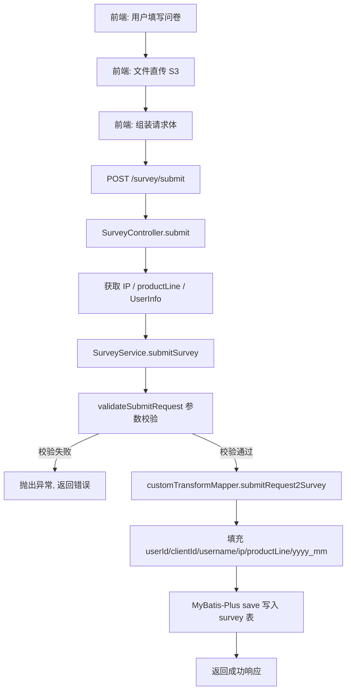
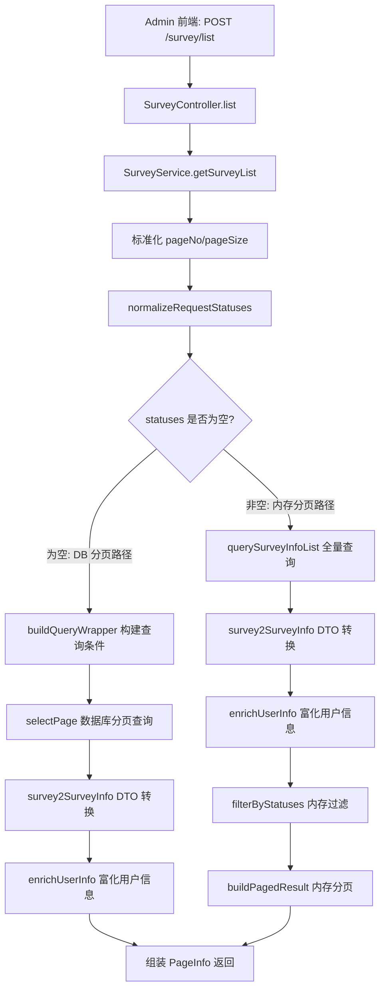
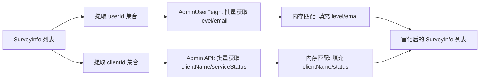
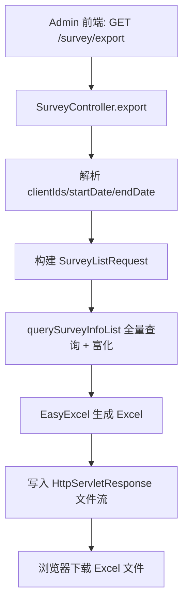

# 用户调查问卷 功能逻辑文档

> 本文档由 document-automation 工具自动生成，基于源代码、PRD 文档和技术评审文档。
> 生成时间: 2026-04-07 16:32:34
> 准确性评分: 未验证/100

---


# 用户调查问卷 功能逻辑文档

## 1. 模块概述

### 1.1 职责与定位

用户调查问卷模块是 Custom Dashboard 产品中的一个独立功能子模块，用于收集用户对新图表类型的需求反馈。该模块包含两个角色视角：

- **普通用户端**：用户可以提交一份调查问卷，选择希望支持的图表类型（多选）、填写需求描述（富文本）、上传附件（S3 直传后提交文件元信息）。
- **Admin 管理端**：管理员可以查询所有用户提交的问卷列表（支持按客户、时间范围筛选）、导出为 Excel 文件、以及获取客户下拉框数据用于筛选。

### 1.2 系统架构位置

该模块位于 Custom Dashboard 后端服务 `custom-dashboard-api` 中，遵循标准的 MVC 分层架构：

```
Controller (SurveyController)
    ↓
Service (SurveyService / SurveyServiceImpl)
    ↓
Mapper (SurveyMapper, MyBatis-Plus BaseMapper)
    ↓
Database (survey 表)
```

外部依赖通过 Feign 调用 Admin 服务获取用户和客户的富化信息。

### 1.3 涉及的后端模块与包

| 层级 | 类名 | 包路径 |
|------|------|--------|
| Controller | `SurveyController` | `com.pacvue.api.controller` |
| Service 接口 | `SurveyService` | `com.pacvue.api.service` |
| Service 实现 | `SurveyServiceImpl` | `com.pacvue.api.service.impl`（推断） |
| Mapper | `SurveyMapper` | `com.pacvue.api.mapper` |
| Model | `Survey` | `com.pacvue.api.model` |
| DTO/Request | `SurveySubmitRequest` | `com.pacvue.api.dto.request.survey` |
| DTO/Request | `SurveyListRequest` | `com.pacvue.api.dto.request.survey` |
| DTO/Response | `SurveyInfo` | `com.pacvue.api.dto.response` |
| DTO/Response | `SurveyDocumentDto` | `com.pacvue.api.dto.response` |
| DTO/Response | `ClientInfoDto` | `com.pacvue.feign.dto.response` |
| 常量 | `SurveyConstants` | `com.pacvue.api.constatns` |
| 转换器 | `CustomTransformMapper` | 待确认（MapStruct 或手动映射） |
| 权限服务 | `AdminPermissionService` | `com.pacvue.api.service` |

### 1.4 前端组件

代码片段中未提供前端 Vue 组件信息。根据接口设计推断，前端应包含以下组件（**待确认**）：

- 用户问卷提交表单组件（图表类型多选 Checkbox、富文本描述输入框、文件上传组件）
- Admin 问卷列表页组件（表格 + 分页）
- Client 下拉多选筛选器组件
- 时间范围选择器组件
- Excel 导出按钮组件

### 1.5 部署方式

该模块作为 `custom-dashboard-api` 服务的一部分部署，无独立部署单元。Maven 坐标**待确认**。

---

## 2. 用户视角

### 2.1 功能场景

#### 场景一：用户提交图表类型调查问卷

Custom Dashboard 产品希望了解用户对新图表类型的需求偏好。用户在前端页面上看到一个调查问卷入口，可以：

1. **选择图表类型**（必填，多选）：从预定义的 8 种图表类型中选择感兴趣的类型。
2. **填写需求描述**（选填）：以富文本形式描述具体需求。
3. **上传附件**（选填，最多 5 个）：上传参考文件（如截图、文档等），文件先由前端直传至 S3，再将文件元信息（url、name、size）随问卷一起提交。

#### 场景二：Admin 查看和管理问卷

管理员在 Admin 后台可以：

1. **查询问卷列表**：查看所有用户提交的问卷，支持按客户 ID（多选）和提交时间范围筛选，分页展示。
2. **导出 Excel**：将筛选后的问卷数据导出为 Excel 文件，便于离线分析。
3. **客户下拉框**：获取客户列表（含 clientId、clientName、serviceStatus），用于列表页的筛选器。

### 2.2 用户操作流程

**用户提交问卷流程：**

1. 用户进入 Custom Dashboard 的问卷页面。
2. 勾选一个或多个感兴趣的图表类型（ScatterPlot、Radar、Gauge、DecompositionTree、RisingSun、MetricRelationship、StackedArea、Funnel）。
3. （可选）在富文本编辑器中填写需求描述。
4. （可选）点击上传按钮，选择文件，前端将文件直传至 S3，获取文件 URL。
5. 点击提交按钮，前端将 chartTypes、description、uploadedDocuments 发送至后端。
6. 后端校验通过后写入数据库，返回成功。

**Admin 查询问卷流程：**

1. Admin 进入问卷管理页面。
2. 页面加载时调用 `/survey/clients` 获取客户下拉框数据。
3. Admin 可选择客户、设置时间范围进行筛选。
4. 点击查询，调用 `/survey/list` 获取分页数据。
5. 列表展示问卷详情，包含用户名、客户名、邮箱、用户级别、用户状态等富化信息。
6. 点击导出按钮，调用 `/survey/export` 下载 Excel 文件。

### 2.3 UI 交互要点

- 图表类型选择为 Checkbox 多选，前端写死 8 种常量选项，非接口获取。
- 文件上传采用 S3 直传模式，前端负责上传文件到 S3 并获取 URL，后端只接收文件元信息。
- 上传文件数量限制为最多 5 个。
- Admin 列表页的 Client 筛选器支持多选，且可按 serviceStatus（Active / Terminated）进行前端侧过滤。
- 导出 Excel 时，筛选条件与列表页一致：已筛选则导出筛选结果，未筛选则导出全部。

---

## 3. 核心 API

### 3.1 POST /survey/submit — 用户提交调查问卷

| 属性 | 说明 |
|------|------|
| **路径** | `POST /survey/submit` |
| **Header** | `productLine`（产品线标识）、`Authorization`（用户认证 Token） |
| **Content-Type** | `application/json` |

**请求参数（SurveySubmitRequest）：**

| 字段 | 类型 | 必填 | 说明 |
|------|------|------|------|
| `chartTypes` | `List<String>` | 是 | 用户选择的图表类型，可多选。合法值：`ScatterPlot` / `Radar` / `Gauge` / `DecompositionTree` / `RisingSun` / `MetricRelationship` / `StackedArea` / `Funnel` |
| `description` | `String` | 否 | 需求描述，富文本内容，限制字符长度（具体限制值**待确认**） |
| `uploadedDocuments` | `List<SurveyDocumentDto>` | 否 | 前端直传 S3 后的文件信息，最多 5 个 |

**SurveyDocumentDto 结构：**

| 字段 | 类型 | 说明 |
|------|------|------|
| `url` | `String` | S3 文件 URL |
| `name` | `String` | 文件名 |
| `size` | `Long` | 文件大小（字节） |

**自动获取的参数（非用户传入）：**

| 参数 | 来源 | 说明 |
|------|------|------|
| `userId` | SecurityContext（`getCurrentUser()`） | 当前登录用户 ID |
| `clientId` | SecurityContext（`getCurrentUser()`） | 当前用户所属客户 ID |
| `username` | SecurityContext（`getCurrentUser()`） | 当前用户名 |
| `ip` | `HttpServletRequest`（`getClientIP()`） | 客户端 IP 地址 |
| `productLine` | Request Header（`getProductLine()`） | 产品线标识 |

**响应：**

```json
{
  "code": 200,
  "message": "success",
  "data": null
}
```

**前端调用方式：**

```javascript
POST /survey/submit
Headers: {
  "Authorization": "Bearer <token>",
  "productLine": "Amazon"
}
Body: {
  "chartTypes": ["ScatterPlot", "Radar"],
  "description": "<p>We need scatter plot for...</p>",
  "uploadedDocuments": [
    { "url": "https://s3.../file1.png", "name": "mockup.png", "size": 102400 }
  ]
}
```

---

### 3.2 POST /survey/list — Admin 查询问卷列表

| 属性 | 说明 |
|------|------|
| **路径** | `POST /survey/list` |
| **Header** | `Authorization`（Admin 认证 Token） |
| **Content-Type** | `application/json` |

**请求参数（SurveyListRequest）：**

| 字段 | 类型 | 必填 | 说明 |
|------|------|------|------|
| `clientIds` | `List<Integer>` | 否 | 按客户 ID 筛选 |
| `startDate` | `String` | 否 | 提交时间范围起始，格式 `yyyy-MM-dd` |
| `endDate` | `String` | 否 | 提交时间范围结束，格式 `yyyy-MM-dd` |
| `statuses` | `List<String>` | 否 | 按用户状态筛选（`Active` / `Terminated`），从代码中推断存在此字段 |
| `pageNo` | `Integer` | 否 | 页码，默认 1 |
| `pageSize` | `Integer` | 否 | 每页条数，默认 20 |

**响应（PageInfo\<SurveyInfo\>）：**

```json
{
  "code": 200,
  "message": "success",
  "data": {
    "totalCount": 100,
    "pageNo": 1,
    "pageSize": 20,
    "data": [
      {
        "id": 1,
        "chartTypes": "ScatterPlot,Radar",
        "username": "john.doe",
        "status": "Active",
        "level": "Admin",
        "clientId": 123,
        "clientName": "Acme Corp",
        "email": "john@acme.com",
        "description": "<p>We need scatter plot...</p>",
        "uploadedDocuments": [
          { "url": "https://s3.../file1.png", "name": "mockup.png", "size": 102400 }
        ],
        "createTime": "01/15/26 14:30:00"
      }
    ]
  }
}
```

**SurveyInfo 响应字段说明：**

| 字段 | 类型 | 说明 |
|------|------|------|
| `id` | `Long` | 问卷记录 ID |
| `chartTypes` | `String` | 逗号分隔的图表类型名称 |
| `username` | `String` | 提交用户名 |
| `status` | `String` | 用户状态 `Active` / `Terminated`（通过 Admin API 富化） |
| `level` | `String` | 用户级别（通过 AdminUserFeign 富化） |
| `clientId` | `Integer` | 客户 ID |
| `clientName` | `String` | 客户名称（通过 Admin API 富化） |
| `email` | `String` | 用户邮箱（通过 AdminUserFeign 富化） |
| `description` | `String` | 需求描述 |
| `uploadedDocuments` | `List<SurveyDocumentDto>` | 上传文件列表 |
| `createTime` | `String` | 提交时间，格式 `mm/dd/yy HH:mm:ss` |

---

### 3.3 GET /survey/export — Admin 导出 Excel

| 属性 | 说明 |
|------|------|
| **路径** | `GET /survey/export` |
| **Header** | `Authorization`（Admin 认证 Token） |
| **Content-Type（响应）** | `application/octet-stream`（Excel 文件流） |

**请求参数（Query String）：**

| 字段 | 类型 | 必填 | 说明 |
|------|------|------|------|
| `clientIds` | `String` | 否 | 逗号分隔的客户 ID，如 `123,456` |
| `startDate` | `String` | 否 | 提交时间范围起始，格式 `yyyy-MM-dd` |
| `endDate` | `String` | 否 | 提交时间范围结束，格式 `yyyy-MM-dd` |

**响应：** Excel 文件流（`application/octet-stream`），浏览器直接下载。

**前端调用方式：**

```javascript
// 通过 window.open 或 axios 下载
GET /survey/export?clientIds=123,456&startDate=2026-01-01&endDate=2026-02-24
Headers: { "Authorization": "Bearer <token>" }
```

---

### 3.4 GET /survey/clients — Admin 客户下拉框查询

| 属性 | 说明 |
|------|------|
| **路径** | `GET /survey/clients` |
| **Header** | `Authorization`（Admin 认证 Token） |

**请求参数：** 无

**响应（List\<ClientInfoDto\>）：**

```json
{
  "code": 200,
  "message": "success",
  "data": [
    {
      "clientId": "123",
      "clientName": "Acme Corp",
      "serviceStatus": "Active"
    },
    {
      "clientId": "456",
      "clientName": "Beta Inc",
      "serviceStatus": "Terminated"
    }
  ]
}
```

**ClientInfoDto 字段说明：**

| 字段 | 类型 | 说明 |
|------|------|------|
| `clientId` | `String` | 客户 ID |
| `clientName` | `String` | 客户名称 |
| `serviceStatus` | `String` | 客户服务状态 `Active` / `Terminated` |

---

## 4. 核心业务流程

### 4.1 用户提交问卷流程

1. 前端将文件直传至 S3，获取文件 URL、文件名、文件大小。
2. 前端组装 `SurveySubmitRequest`（chartTypes + description + uploadedDocuments），调用 `POST /survey/submit`。
3. `SurveyController.submit()` 从 `HttpServletRequest` 获取客户端 IP，从 Header 获取 `productLine`，从 `SecurityContext` 获取当前用户信息（`UserInfo`，含 userId、clientId、username）。
4. 调用 `SurveyService.submitSurvey(userInfo, productLine, ip, request)`。
5. `SurveyServiceImpl.submitSurvey()` 执行以下步骤：
   - **参数校验**（`validateSubmitRequest`）：校验 `chartTypes` 非空且每个值在合法常量范围内（`SurveyConstants` 中定义）；校验 `description` 字符长度；校验 `uploadedDocuments` 数量不超过 5 个。
   - **对象转换**（`customTransformMapper.submitRequest2Survey`）：将请求 DTO 转换为 `Survey` 实体，自动填充 `productLine`、`userId`、`clientId`、`username`、`ip`、`yyyy_mm`（当前 UTC 年月）、`create_time`。
   - **持久化**（`this.save(survey)`）：通过 MyBatis-Plus 的 `ServiceImpl.save()` 方法将 `Survey` 实体写入 `survey` 表。
6. 返回成功响应。



### 4.2 Admin 查询问卷列表流程

1. Admin 前端调用 `POST /survey/list`，传入筛选条件和分页参数。
2. `SurveyController.list()` 调用 `SurveyService.getSurveyList(request)`。
3. `SurveyServiceImpl.getSurveyList()` 执行以下逻辑：
   - **分页参数标准化**：`pageNo` 默认 1，`pageSize` 默认 20。
   - **状态参数标准化**：调用 `normalizeRequestStatuses(request.getStatuses())` 处理状态筛选参数。
   - **分支一：无状态过滤**（`normalizedStatuses` 为空）：
     - 构建 `LambdaQueryWrapper<Survey>`（通过 `buildQueryWrapper(request)` 方法，根据 `clientIds`、`startDate`、`endDate` 构建查询条件）。
     - 使用 MyBatis-Plus 的 `selectPage` 进行数据库分页查询。
     - 将查询结果通过 `customTransformMapper.survey2SurveyInfo` 转换为 `SurveyInfo` DTO 列表。
     - 调用 `enrichUserInfo(dataList)` 批量富化用户/客户信息。
     - 组装 `PageInfo<SurveyInfo>` 返回。
   - **分支二：有状态过滤**（`normalizedStatuses` 非空）：
     - 由于 `status` 字段不在 `survey` 表中（是通过 Admin API 富化的），无法在 SQL 层面过滤。
     - 调用 `querySurveyInfoList(request)` 查询所有符合其他条件的数据（不分页），并富化用户信息。
     - 调用 `filterByStatuses(filteredList, normalizedStatuses)` 在内存中按状态过滤。
     - 调用 `buildPagedResult(filteredList, pageNo, pageSize)` 在内存中进行分页，确保 `totalCount` 和分页语义正确。
4. 返回分页结果。



### 4.3 数据富化流程（enrichUserInfo）

`enrichUserInfo` 是列表查询和导出的核心环节，负责将 `survey` 表中的基础数据与外部 Admin 服务的用户/客户信息进行关联：

1. 从 `SurveyInfo` 列表中提取所有不重复的 `userId` 和 `clientId`。
2. **批量调用 AdminUserFeign**：根据 `userId` 列表获取用户的 `level`（用户级别）和 `email`（邮箱）信息。
3. **批量调用 Admin API `/client/getClientsByIds`**：根据 `clientId` 列表获取客户的 `clientName`（客户名称）和 `serviceStatus`（服务状态，映射为 `status` 字段的 `Active` / `Terminated`）。
4. 在内存中遍历 `SurveyInfo` 列表，根据 `userId` 和 `clientId` 匹配并填充 `level`、`email`、`clientName`、`status` 字段。



### 4.4 Admin 导出 Excel 流程

1. Admin 前端调用 `GET /survey/export?clientIds=...&startDate=...&endDate=...`。
2. `SurveyController.export()` 解析 Query String 参数（`clientIds` 为逗号分隔字符串，需解析为列表）。
3. 复用与列表接口相同的查询逻辑（`querySurveyInfoList`），但**不分页**，获取所有符合条件的数据。
4. 使用 **EasyExcel** 生成 Excel 文件：
   - 包含所有列表字段（id、chartTypes、username、status、level、clientId、clientName、email、description、uploadedDocuments、createTime）。
   - `uploadedDocuments` 列输出为 URL 链接。
5. 将 Excel 文件流写入 `HttpServletResponse`，设置 `Content-Type: application/octet-stream`，浏览器直接下载。



### 4.5 Admin 客户下拉框查询流程

1. Admin 前端调用 `GET /survey/clients`。
2. `SurveyController.clients()` 调用 Admin API `/client/getClientsByIds` 获取客户基本信息（参考 `feature-health` 项目 `AdminApiClient` 实现）。
3. 返回 `List<ClientInfoDto>`，包含 `clientId`、`clientName`、`serviceStatus`。
4. 前端使用该数据渲染 Client 下拉多选筛选器，`serviceStatus` 可用于前端按 Active / Terminated 分组或过滤。

### 4.6 关键设计模式说明

| 设计模式 | 应用位置 | 说明 |
|----------|----------|------|
| **MVC 分层架构** | Controller → Service → Mapper | 标准三层分离，Controller 负责参数获取和响应封装，Service 负责业务逻辑，Mapper 负责数据访问 |
| **MyBatis-Plus ActiveRecord 模式** | `Survey extends Model<Survey>` | Survey 实体继承 `Model`，支持 `this.save()` 等 ActiveRecord 风格操作 |
| **DTO/VO 转换模式** | `customTransformMapper` | 使用 MapStruct 或手动映射实现 `submitRequest2Survey` 和 `survey2SurveyInfo` 转换，解耦请求/响应与数据库实体 |
| **查询条件构建器模式** | `buildQueryWrapper(request)` | 使用 MyBatis-Plus 的 `LambdaQueryWrapper` 动态构建查询条件，根据请求参数是否为空决定是否添加条件 |
| **数据富化模式** | `enrichUserInfo(infoList)` | 先查主表获取基础数据，再批量调用外部 API 获取关联信息，在内存中匹配填充。避免 N+1 查询问题 |
| **双路径分页策略** | `getSurveyList` 中的分支逻辑 | 无状态过滤时走 DB 分页（高性能），有状态过滤时走内存分页（保证语义正确） |

---

## 5. 数据模型

### 5.1 数据库表结构

**表名：`survey`**

| 字段 | 类型（推断） | 说明 |
|------|-------------|------|
| `id` | `BIGINT` AUTO_INCREMENT | 主键 |
| `chart_types` | `VARCHAR` / `TEXT` | 逗号分隔的图表类型字符串，如 `ScatterPlot,Radar` |
| `description` | `TEXT` | 需求描述，富文本内容 |
| `uploaded_documents` | `TEXT` / `JSON` | 上传文件信息，JSON 数组格式 `[{"url":"...","name":"...","size":...}]` |
| `user_id` | `BIGINT` / `INT` | 提交用户 ID |
| `client_id` | `INT` | 用户所属客户 ID |
| `username` | `VARCHAR` | 提交用户名 |
| `ip` | `VARCHAR` | 客户端 IP 地址 |
| `product_line` | `VARCHAR` | 产品线标识（如 Amazon、Walmart 等） |
| `yyyy_mm` | `VARCHAR` / `CHAR(7)` | 提交年月，格式 `yyyy-MM`，自动填充当前 UTC 年月 |
| `create_time` | `DATETIME` | 创建时间 |

> **注意**：`Survey` 实体使用 `@TableName` 注解（代码中未指定表名参数，推断默认映射为 `survey` 表），

---

*本文档由 AI 自动生成，如有不准确之处请以源代码为准。标注"待确认"的内容需要人工核实。*