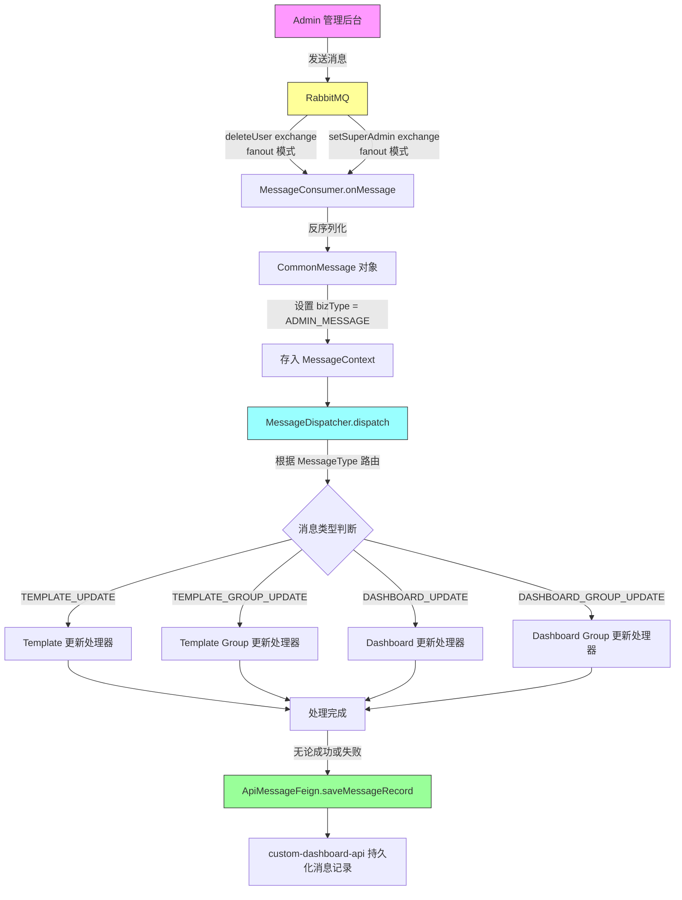
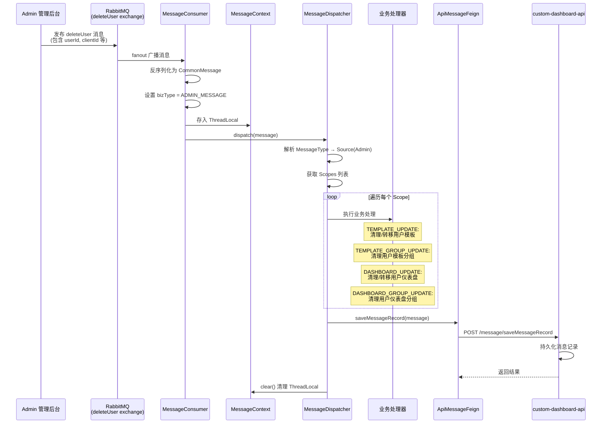
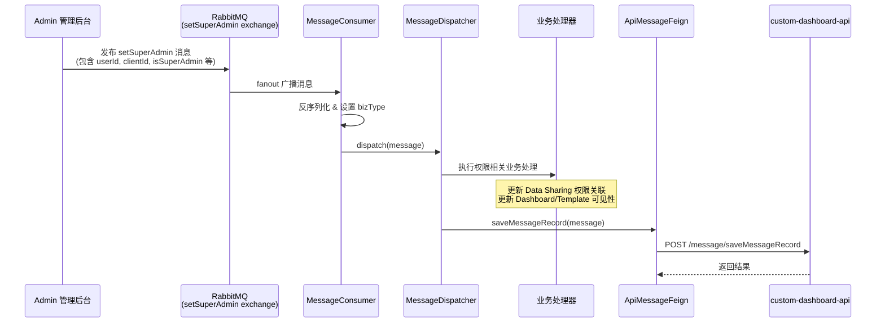
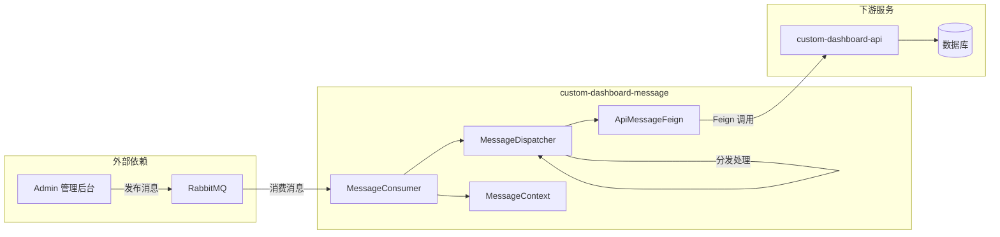

# 消息通知模块 功能逻辑文档

> 本文档由 document-automation 工具自动生成，基于源代码、PRD 文档和技术评审文档。
> 生成时间: 2026-04-07 16:35:57
> 准确性评分: 5/100

---


# 消息通知模块 功能逻辑文档

## 1. 模块概述

### 1.1 职责与定位

消息通知模块（`custom-dashboard-message`）是 Pacvue Custom Dashboard 系统中的**异步消息消费与分发模块**，负责接收来自外部系统（如管理员后台）的操作消息，并将这些消息路由到对应的业务处理器执行相应的级联操作。

该模块的核心职责包括：

1. **消息消费**：通过 RabbitMQ 监听特定队列（`deleteUser`、`setSuperAdmin`），接收管理员操作事件。
2. **消息分发**：根据消息类型（`MessageType`），通过分发器（`MessageDispatcher`）将消息路由到对应的处理器。
3. **业务级联处理**：当管理员执行删除用户、设置超级管理员等操作时，触发 Custom Dashboard 内部的级联更新，涉及模板（Template）、模板分组（Template Group）、仪表盘（Dashboard）、仪表盘分组（Dashboard Group）等业务实体的更新。
4. **消息日志记录**：无论处理成功或失败，均通过 Feign 调用 `custom-dashboard-api` 服务持久化消息记录。

### 1.2 系统架构位置

```
┌─────────────────┐     RabbitMQ (fanout)      ┌──────────────────────────┐
│  Admin 管理后台   │ ──── deleteUser exchange ──→│                          │
│  (外部系统)       │ ── setSuperAdmin exchange →│  custom-dashboard-message │
└─────────────────┘                             │  (消息消费 & 分发)         │
                                                └────────────┬─────────────┘
                                                             │ Feign 调用
                                                             ▼
                                                ┌──────────────────────────┐
                                                │  custom-dashboard-api     │
                                                │  (消息记录持久化 +         │
                                                │   业务数据更新)            │
                                                └──────────────────────────┘
```

该模块作为独立的消息消费服务部署，与 `custom-dashboard-api` 主服务解耦，通过 RabbitMQ 实现异步通信，通过 Feign 实现服务间同步调用。

### 1.3 涉及的后端模块

| 模块 | 说明 |
|------|------|
| `custom-dashboard-message` | 本模块，消息消费与分发的核心实现 |
| `custom-dashboard-api` | 下游服务，提供消息记录保存接口及业务数据操作 |

### 1.4 涉及的前端组件

本模块为纯后端消息处理模块，**无直接关联的前端组件**。消息的触发源来自管理员后台系统，处理结果体现在 Dashboard 业务数据的变更上，用户通过 Dashboard 前端页面间接感知（如被删除用户的 Dashboard 数据被清理等）。

### 1.5 Maven 坐标与部署方式

- **模块名称**：`custom-dashboard-message`
- **Maven 坐标**：待确认（推测为 `com.pacvue.custom-dashboard:custom-dashboard-message`）
- **部署方式**：作为独立的 Spring Boot 微服务部署，需连接 RabbitMQ 并注册到服务发现中心（用于 Feign 调用）

---

## 2. 用户视角

### 2.1 功能场景

消息通知模块不直接面向终端用户，而是响应**管理员操作事件**，确保 Custom Dashboard 系统内部数据的一致性。以下是两个核心场景：

#### 场景一：管理员删除用户

**触发条件**：管理员在后台管理系统中删除某个用户账号。

**业务影响**：
- 该用户创建的 Dashboard 需要被处理（删除或转移所有权）
- 该用户创建的 Dashboard Group 需要被处理
- 该用户创建的 Template 需要被处理
- 该用户创建的 Template Group 需要被处理
- 该用户的收藏记录（Template Favorite）需要被清理

**用户感知**：
- 被删除用户将无法再访问系统
- 其他用户如果共享了被删除用户的 Dashboard，可能会看到数据变更

#### 场景二：管理员设置超级管理员

**触发条件**：管理员在后台管理系统中将某个用户设置为超级管理员，或取消超级管理员权限。

**业务影响**：
- 超级管理员权限变更可能影响 Dashboard 和 Template 的数据共享（Data Sharing）权限
- 需要更新相关的权限关联数据

**用户感知**：
- 被设置为超级管理员的用户将获得更广泛的 Dashboard 访问权限
- 被取消超级管理员的用户可能失去部分 Dashboard 的访问权限

### 2.2 操作流程

由于本模块为后台自动化处理，无直接的用户操作流程。整体流程如下：

1. 管理员在 Admin 后台执行操作（删除用户 / 设置超级管理员）
2. Admin 后台向 RabbitMQ 发送消息
3. `custom-dashboard-message` 自动消费消息并执行级联处理
4. 处理结果通过消息日志记录
5. 用户在 Dashboard 前端页面感知到数据变更（如 Dashboard 被删除、权限变更等）

### 2.3 UI 交互要点

本模块无直接 UI 交互。但其处理结果会影响以下前端页面：

- **Dashboard 列表页**：被删除用户的 Dashboard 可能从列表中消失
- **Template 列表页**：被删除用户的 Template 可能被清理或转移
- **Dashboard Group / Template Group**：分组数据可能发生变更
- **Data Sharing 相关页面**：超级管理员权限变更后，共享数据范围可能变化

---

## 3. 核心 API

### 3.1 REST 端点

本模块自身不对外暴露 REST 端点，但通过 Feign 调用下游服务的端点：

#### 3.1.1 消息记录保存（下游服务端点）

| 属性 | 值 |
|------|------|
| **服务** | `custom-dashboard-api` |
| **路径** | `POST /message/saveMessageRecord` |
| **描述** | 持久化消息处理记录 |
| **请求体** | `BaseMessage` 对象 |
| **返回值** | 待确认（推测为通用响应体） |

**请求参数 `BaseMessage` 结构**（推测）：

```json
{
  "messageId": "消息唯一标识",
  "messageType": "ADMIN_MESSAGE",
  "source": "Admin",
  "bizType": "业务类型",
  "payload": "消息负载内容",
  "status": "处理状态（成功/失败）",
  "errorMessage": "错误信息（如有）",
  "createdAt": "消息创建时间",
  "processedAt": "消息处理时间"
}
```

### 3.2 Feign 客户端定义

#### ApiMessageFeign

```java
// 推测的 Feign 客户端接口定义
@FeignClient(name = "custom-dashboard-api")
public interface ApiMessageFeign {
    
    @PostMapping("/message/saveMessageRecord")
    Response saveMessageRecord(@RequestBody BaseMessage message);
}
```

### 3.3 前端调用方式

本模块无前端直接调用。消息由 RabbitMQ 驱动，前端不参与消息的发送或消费。

---

## 4. 核心业务流程

### 4.1 整体消息处理流程



### 4.2 详细流程说明

#### 步骤 1：消息接收（MessageConsumer）

`MessageConsumer` 是 RabbitMQ 消息消费者，通过 `@RabbitListener` 注解监听两个 exchange：

- **`deleteUser` exchange**：接收用户删除事件，采用 fanout 模式广播
- **`setSuperAdmin` exchange**：接收超级管理员设置事件，采用 fanout 模式广播

fanout 模式意味着消息会广播到所有绑定的队列，确保 `custom-dashboard-message` 服务的每个实例都能收到消息。

```java
// 推测的消费者实现
@Component
public class MessageConsumer {
    
    @RabbitListener(queues = "deleteUser.custom-dashboard")
    public void onDeleteUserMessage(String messageBody) {
        onMessage(messageBody, "deleteUser");
    }
    
    @RabbitListener(queues = "setSuperAdmin.custom-dashboard")
    public void onSetSuperAdminMessage(String messageBody) {
        onMessage(messageBody, "setSuperAdmin");
    }
    
    private void onMessage(String messageBody, String source) {
        // 1. 反序列化为 CommonMessage
        CommonMessage message = JSON.parseObject(messageBody, CommonMessage.class);
        // 2. 设置 bizType
        message.setBizType(MessageType.ADMIN_MESSAGE);
        // 3. 存入 MessageContext
        MessageContext.set(message);
        // 4. 调用分发器
        messageDispatcher.dispatch(message);
    }
}
```

#### 步骤 2：消息反序列化

接收到的 RabbitMQ 消息体被反序列化为 `CommonMessage` 对象。`CommonMessage` 继承自 `BaseMessage`，包含通用的消息属性以及特定的业务负载。

#### 步骤 3：设置消息上下文（MessageContext）

消息被存入 `MessageContext`，这是一个基于 `ThreadLocal` 的上下文容器，用于在同一线程的处理链路中传递当前正在处理的消息对象，避免在方法调用链中逐层传递参数。

```java
// 推测的 MessageContext 实现
public class MessageContext {
    private static final ThreadLocal<BaseMessage> CONTEXT = new ThreadLocal<>();
    
    public static void set(BaseMessage message) {
        CONTEXT.set(message);
    }
    
    public static BaseMessage get() {
        return CONTEXT.get();
    }
    
    public static void clear() {
        CONTEXT.remove();
    }
}
```

#### 步骤 4：消息分发（MessageDispatcher）

`MessageDispatcher` 是消息分发的核心组件，根据消息类型（`MessageType`）和消息来源（`Source`）决定调用哪个处理器（Handler），并根据业务范围（`Scope`）决定触发哪些业务更新。

分发逻辑：

1. 从 `MessageType` 获取对应的 `Source`（消息来源），当前已知来源为 `Admin`
2. 根据 `Source` 确定对应的 Handler
3. 从 `MessageType` 获取对应的 `Scopes`（业务更新范围）
4. 依次触发各个 Scope 对应的业务处理逻辑

```java
// 推测的分发器实现
@Component
public class MessageDispatcher {
    
    public void dispatch(CommonMessage message) {
        MessageType type = message.getBizType();
        Source source = type.getSource();  // Admin
        List<Scope> scopes = type.getScopes();
        
        try {
            for (Scope scope : scopes) {
                switch (scope) {
                    case TEMPLATE_UPDATE:
                        handleTemplateUpdate(message);
                        break;
                    case TEMPLATE_GROUP_UPDATE:
                        handleTemplateGroupUpdate(message);
                        break;
                    case DASHBOARD_UPDATE:
                        handleDashboardUpdate(message);
                        break;
                    case DASHBOARD_GROUP_UPDATE:
                        handleDashboardGroupUpdate(message);
                        break;
                }
            }
            message.setStatus("SUCCESS");
        } catch (Exception e) {
            message.setStatus("FAILED");
            message.setErrorMessage(e.getMessage());
        } finally {
            // 无论成功或失败，记录消息日志
            apiMessageFeign.saveMessageRecord(message);
            MessageContext.clear();
        }
    }
}
```

#### 步骤 5：业务处理

根据 `Scope` 枚举值，触发不同的业务更新：

| Scope | 说明 | 典型场景 |
|-------|------|---------|
| `TEMPLATE_UPDATE` | 模板更新 | 删除用户时清理其创建的模板，或转移模板所有权 |
| `TEMPLATE_GROUP_UPDATE` | 模板分组更新 | 删除用户时清理其创建的模板分组 |
| `DASHBOARD_UPDATE` | 仪表盘更新 | 删除用户时清理其创建的仪表盘 |
| `DASHBOARD_GROUP_UPDATE` | 仪表盘分组更新 | 删除用户时清理其创建的仪表盘分组 |

#### 步骤 6：消息日志持久化

处理完成后（无论成功或失败），通过 `ApiMessageFeign.saveMessageRecord()` 调用 `custom-dashboard-api` 服务，将消息处理记录持久化到数据库。

### 4.3 删除用户场景详细流程



### 4.4 设置超级管理员场景详细流程



### 4.5 关键设计模式详解

#### 4.5.1 消息驱动模式（Message-Driven Pattern）

通过 RabbitMQ 实现系统间的异步解耦。Admin 管理后台不需要直接调用 Custom Dashboard 的 API，而是通过消息队列发布事件，由 `custom-dashboard-message` 服务异步消费处理。

**优势**：
- 系统间松耦合，Admin 后台无需感知 Custom Dashboard 的内部逻辑
- 异步处理，不阻塞 Admin 后台的操作响应
- fanout 模式支持多个消费者，便于扩展

#### 4.5.2 分发器/调度器模式（Dispatcher Pattern）

`MessageDispatcher` 作为中央调度器，根据消息类型将消息路由到对应的处理器。这种模式将消息的接收与处理解耦，新增消息类型时只需添加新的处理器，无需修改消费者逻辑。

#### 4.5.3 策略模式（Strategy Pattern）

`MessageType` 枚举通过 `Source` 决定使用哪个 Handler，通过 `Scopes` 决定触发哪些业务范围的更新。这种设计使得消息类型与处理策略之间的映射关系清晰且可扩展。

```java
// 推测的 MessageType 枚举
public enum MessageType {
    ADMIN_MESSAGE(Source.Admin, 
        Arrays.asList(
            Scope.TEMPLATE_UPDATE, 
            Scope.TEMPLATE_GROUP_UPDATE, 
            Scope.DASHBOARD_UPDATE, 
            Scope.DASHBOARD_GROUP_UPDATE
        ));
    
    private final Source source;
    private final List<Scope> scopes;
    
    // constructor, getters...
}
```

#### 4.5.4 上下文模式（Context Pattern）

`MessageContext` 使用 `ThreadLocal` 在线程级别存储当前处理的消息对象，使得处理链路中的任何组件都可以方便地获取当前消息信息，而无需通过方法参数逐层传递。

**注意事项**：
- 必须在处理完成后调用 `MessageContext.clear()` 清理 ThreadLocal，防止内存泄漏
- 在异步处理场景中需要注意 ThreadLocal 的传递问题

---

## 5. 数据模型

### 5.1 数据库表结构

消息记录表由 `custom-dashboard-api` 服务管理，表名及具体结构**待确认**（未在当前代码中直接体现）。

推测的消息记录表结构：

| 字段 | 类型 | 描述 |
|------|------|------|
| id | bigint | 自增主键 |
| message_id | varchar | 消息唯一标识 |
| message_type | varchar | 消息类型（如 ADMIN_MESSAGE） |
| source | varchar | 消息来源（如 Admin） |
| payload | longtext | 消息负载（JSON 格式） |
| status | varchar | 处理状态（SUCCESS / FAILED） |
| error_message | text | 错误信息 |
| created_at | datetime | 消息创建时间 |
| processed_at | datetime | 消息处理完成时间 |

> **待确认**：以上表结构为推测，实际表名和字段需查看 `custom-dashboard-api` 服务的数据库迁移脚本确认。

### 5.2 核心类与枚举

#### 5.2.1 BaseMessage（消息基础类）

```java
// 推测的类结构
public class BaseMessage {
    private String messageId;       // 消息唯一标识
    private MessageType bizType;    // 业务类型
    private String source;          // 消息来源
    private String status;          // 处理状态
    private String errorMessage;    // 错误信息
    private LocalDateTime createdAt;
    private LocalDateTime processedAt;
}
```

#### 5.2.2 CommonMessage（通用消息体）

```java
// 推测的类结构，继承自 BaseMessage
public class CommonMessage extends BaseMessage {
    private Long userId;        // 被操作的用户 ID
    private Long clientId;      // 客户 ID
    private String action;      // 操作类型（delete / setSuperAdmin）
    private Map<String, Object> extraData;  // 扩展数据
}
```

#### 5.2.3 MessageType（消息类型枚举）

```java
public enum MessageType {
    ADMIN_MESSAGE(Source.Admin, Arrays.asList(
        Scope.TEMPLATE_UPDATE,
        Scope.TEMPLATE_GROUP_UPDATE,
        Scope.DASHBOARD_UPDATE,
        Scope.DASHBOARD_GROUP_UPDATE
    ));
    
    private final Source source;
    private final List<Scope> scopes;
}
```

#### 5.2.4 Source（消息来源枚举）

```java
public enum Source {
    Admin   // 管理员后台
    // 未来可能扩展其他来源
}
```

#### 5.2.5 Scope（业务更新范围枚举）

```java
public enum Scope {
    TEMPLATE_UPDATE,          // 模板更新
    TEMPLATE_GROUP_UPDATE,    // 模板分组更新
    DASHBOARD_UPDATE,         // 仪表盘更新
    DASHBOARD_GROUP_UPDATE    // 仪表盘分组更新
}
```

#### 5.2.6 MessageContext（消息上下文）

```java
public class MessageContext {
    private static final ThreadLocal<BaseMessage> CONTEXT = new ThreadLocal<>();
    
    public static void set(BaseMessage message) { CONTEXT.set(message); }
    public static BaseMessage get() { return CONTEXT.get(); }
    public static void clear() { CONTEXT.remove(); }
}
```

### 5.3 关联的业务数据模型

消息处理涉及的业务表（由 `custom-dashboard-api` 管理）：

| 表名 | 说明 | 与消息模块的关系 |
|------|------|----------------|
| `template` | 模板表 | 删除用户时需清理 `created_by` 对应的记录 |
| `template_group` | 模板分组表 | 删除用户时需清理对应分组 |
| `template_favorite` | 模板收藏表 | 删除用户时需清理收藏记录 |
| `template_label` | 模板标签表 | 可能需要清理用户创建的标签 |
| dashboard 表（待确认表名） | 仪表盘表 | 删除用户时需清理对应仪表盘 |
| dashboard_group 表（待确认表名） | 仪表盘分组表 | 删除用户时需清理对应分组 |

---

## 6. 平台差异

本模块为消息处理基础设施模块，**不涉及平台差异**。消息处理逻辑与具体的广告平台（Amazon、Walmart、Instacart 等）无关，仅处理用户管理和权限管理相关的跨平台操作。

> **说明**：提供的代码片段中包含大量 SOV_MAPPING 平台指标映射代码，这些属于数据查询模块的内容，与消息通知模块无直接关联。这些代码片段可能是检索系统误匹配的结果。

---

## 7. 配置与依赖

### 7.1 关键配置项

#### RabbitMQ 配置

```yaml
# 推测的配置项
spring:
  rabbitmq:
    host: ${RABBITMQ_HOST}
    port: ${RABBITMQ_PORT:5672}
    username: ${RABBITMQ_USERNAME}
    password: ${RABBITMQ_PASSWORD}
    virtual-host: ${RABBITMQ_VHOST:/}

# Exchange 和 Queue 配置
custom-dashboard:
  message:
    exchanges:
      delete-user: deleteUser          # 删除用户 exchange 名称
      set-super-admin: setSuperAdmin   # 设置超级管理员 exchange 名称
    queue-prefix: custom-dashboard     # 队列名前缀
```

#### RabbitMQ Exchange 配置详情

| Exchange 名称 | 类型 | 说明 |
|---------------|------|------|
| `deleteUser` | fanout | 用户删除事件广播 |
| `setSuperAdmin` | fanout | 超级管理员设置事件广播 |

> **fanout 模式说明**：消息会广播到所有绑定到该 exchange 的队列，不需要 routing key。这意味着如果有多个服务需要响应同一事件，都可以绑定自己的队列到同一个 exchange。

### 7.2 Feign 下游服务依赖

| 依赖服务 | Feign 客户端 | 调用端点 | 说明 |
|----------|-------------|---------|------|
| `custom-dashboard-api` | `ApiMessageFeign` | `POST /message/saveMessageRecord` | 持久化消息处理记录 |

#### Feign 配置

```yaml
# 推测的 Feign 配置
feign:
  client:
    config:
      custom-dashboard-api:
        connectTimeout: 5000
        readTimeout: 10000
```

### 7.3 缓存策略

本模块为消息消费模块，**不涉及缓存策略**。消息处理为一次性操作，不需要缓存中间结果。

### 7.4 依赖关系图



---

## 8. 版本演进

### 8.1 主要版本变更

基于技术评审文档和 PRD 文档，消息通知模块的演进与以下

---

> **自动审核备注**: 准确性评分 5/100
>
> **待修正项**:
> - [error] 文档内容与提供的代码片段完全不匹配。文档描述的是一个'消息通知模块'（custom-dashboard-message），涉及 RabbitMQ 消息消费、MessageDispatcher、MessageConsumer、Feign 调用等。但提供的代码片段全部是 SOV_MAPPING 的静态映射初始化代码，将整数键映射到 Platform→MetricType 的 Map，涉及多个平台（Amazon、Walmart、Instacart、Criteo、Target、Citrus、Kroger、Doordash、Samsclub）的 SOV（Share of Voice）指标类型映射。两者之间没有任何关联。
> - [error] 文档声称模块为 'custom-dashboard-message'，职责是 RabbitMQ 消息消费与分发。代码中没有任何 RabbitMQ、消息消费、MessageConsumer、MessageDispatcher 相关的内容。代码是 SOV_MAPPING 的 Map 初始化，属于指标映射/配置类代码。
> - [error] 文档描述了 POST /message/saveMessageRecord 端点、ApiMessageFeign Feign 客户端、BaseMessage 数据模型等，这些在代码片段中完全不存在，全部为臆造内容。
> - [error] 文档描述的消息处理流程（Admin后台→RabbitMQ→MessageConsumer→MessageDispatcher→Handler）与代码完全无关。代码是静态 Map 的初始化，定义了整数 ID 到 Platform-MetricType 映射的对应关系。
> - [error] 文档描述了'删除用户'和'设置超级管理员'两个场景，代码中没有任何用户管理相关逻辑。代码涉及的是 SOV 指标在多平台间的映射关系。


---

*本文档由 AI 自动生成，如有不准确之处请以源代码为准。标注"待确认"的内容需要人工核实。*