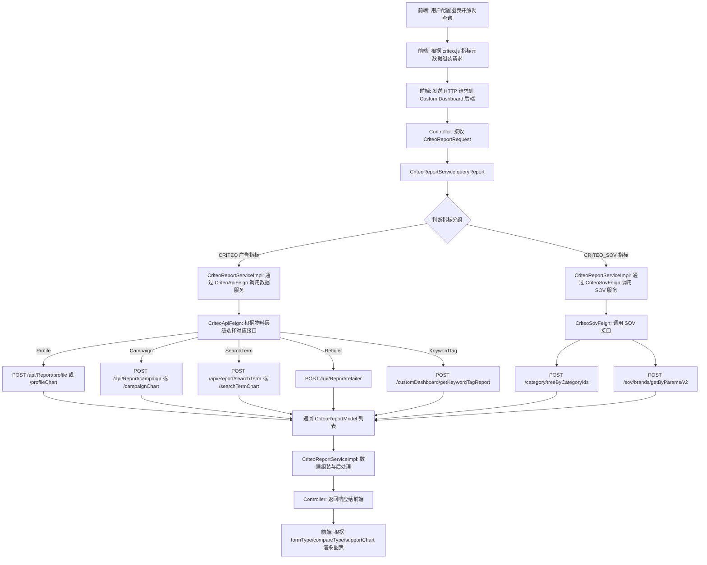
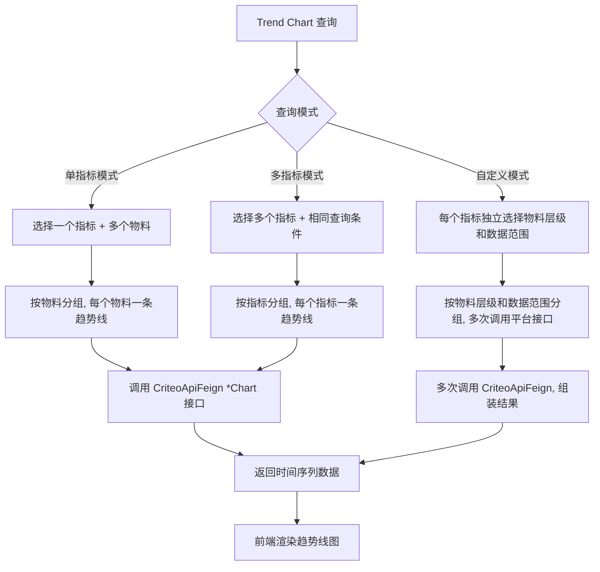
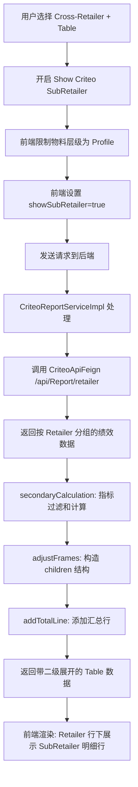
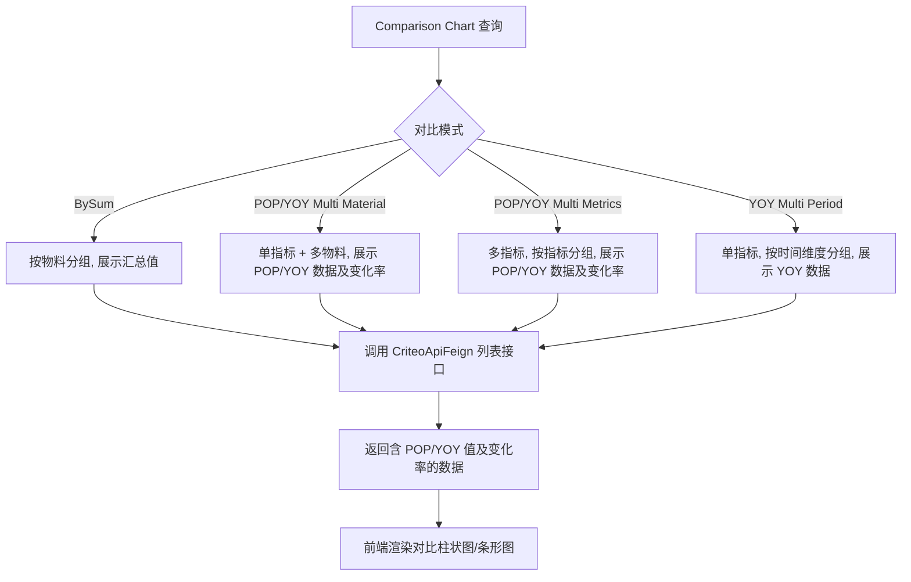
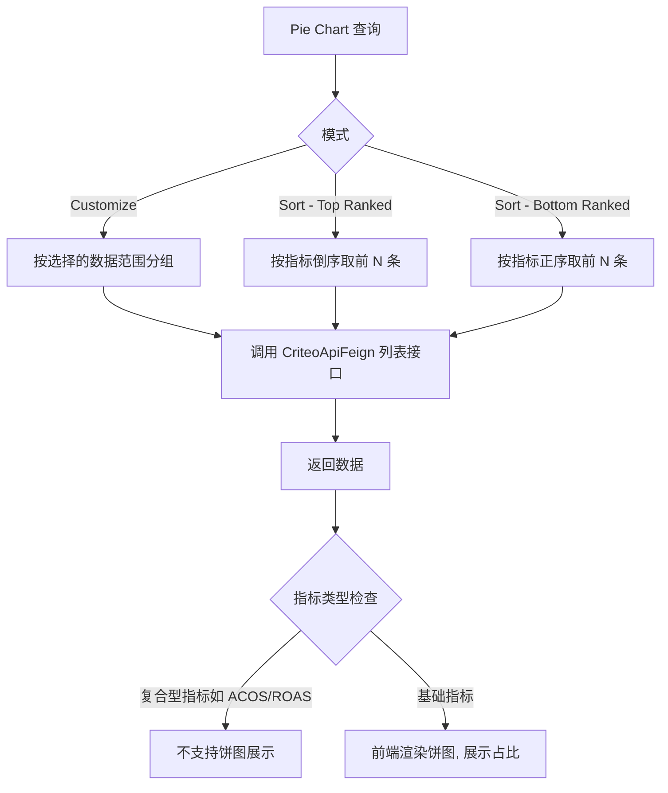

# Criteo 平台模块 功能逻辑文档

> 本文档由 document-automation 工具自动生成，基于源代码、PRD 文档和技术评审文档。
> 生成时间: 2026-04-09 10:44:35
> 准确性评分: 未验证/100

---


# Criteo 平台模块 功能逻辑文档

## 1. 模块概述

### 1.1 职责与定位

Criteo 平台模块是 Pacvue Custom Dashboard 系统中的一个**平台适配层模块**，负责对接 Criteo 广告平台的报表数据，将 Criteo 特有的广告投放数据（Search Ad 绩效指标）和 SOV（Share of Voice）数据统一接入 Custom Dashboard 的图表与报表体系。该模块使用户能够在 Custom Dashboard 中以多种图表形式（Trend Chart、Comparison Chart、Pie Chart、Table、Top Overview）查看和分析 Criteo 广告投放的绩效表现。

### 1.2 系统架构位置

```
┌─────────────────────────────────────────────────────────┐
│                    前端 (Vue)                             │
│  criteo.js (指标注册表) + 图表组件 + Dashboard Setting    │
└──────────────────────┬──────────────────────────────────┘
                       │ HTTP REST
                       ▼
┌─────────────────────────────────────────────────────────┐
│           Custom Dashboard 后端 (Gateway/BFF)            │
│  Controller (待确认) → CriteoReportService               │
│                        CriteoReportServiceImpl           │
└──────┬──────────────────────────────────┬───────────────┘
       │ Feign                            │ Feign
       ▼                                  ▼
┌──────────────────┐          ┌───────────────────────────┐
│  Criteo 数据服务  │          │  SOV Service              │
│  (CriteoApiFeign)│          │  (CriteoSovFeign)         │
│  /api/Report/*   │          │  /category/*  /sov/*      │
└──────────────────┘          └───────────────────────────┘
```

**上游**：前端 Vue 应用通过 REST API 调用 Custom Dashboard 后端。

**下游**：
- **Criteo 数据服务**：通过 `CriteoApiFeign` 调用，提供广告报表绩效数据（Impression、Clicks、Sales 等）。
- **SOV 服务**：通过 `CriteoSovFeign` 调用 `sov-service`，提供 Share of Voice 相关数据（品牌 SOV、ASIN 排名等）。

### 1.3 涉及的后端模块与前端组件

**后端 Maven 模块**：
- `custom-dashboard-criteo` — Criteo 平台适配模块

**核心后端类**：
| 类名 | 包路径 | 说明 |
|---|---|---|
| `CriteoReportModel` | `com.pacvue.feign.dto.response.criteo` | 报表数据模型，继承 `CriteoReportDataBase` |
| `CriteoReportRequest` | `com.pacvue.feign.dto.request.criteo` | 报表查询请求 DTO，继承 `BaseRequest` |
| `CriteoReportParams` | **待确认** | Criteo API 调用参数封装 |
| `CriteoReportService` | **待确认** | 报表查询服务接口 |
| `CriteoReportServiceImpl` | **待确认** | 报表查询服务实现 |
| `CriteoApiFeign` | **待确认** | Criteo 数据服务 Feign 客户端 |
| `CriteoSovFeign` | **待确认** | SOV 服务 Feign 客户端 |
| `MetricType` | `com.pacvue.base.enums.core` | 指标枚举类，包含 CRITEO 和 CRITEO_SOV 分组 |

**前端组件**：
| 文件 | 说明 |
|---|---|
| `metricsList/criteo.js` | Criteo 指标配置注册表，定义 SearchAd 和 SOV 两大类指标的展示元数据 |
| `TemplateManagements/components/BreadTitle.vue` | 面包屑导航组件，路由至 `/Report/CustomDashboard` |
| `public/defaultCustomDashboard.js` | 全局平台配置，`customDashboardGroupLevelStr` 中包含 `'Criteo'` |

### 1.4 部署方式

该模块作为 `custom-dashboard-criteo` Maven 子模块，随 Custom Dashboard 主服务一起打包部署。通过 Spring Boot 的自动配置机制加载 Criteo 平台的 Feign 客户端和 Service 实现。Feign 客户端的目标服务地址通过配置项 `feign.client.criteo-sov` 和 `feign.url.criteo-sov` 控制，支持服务发现和直连两种模式。

---

## 2. 用户视角

### 2.1 功能场景总览

基于 PRD 文档，Criteo 平台模块支持以下核心功能场景：

1. **Criteo 广告绩效数据查看**（V2.5/V2.7 引入）
2. **Criteo SOV 数据查看**（V2.7+ 引入）
3. **SubRetailer 细分查看**（26Q1-S2 引入）
4. **Cross-Retailer 对比分析**
5. **Keyword/Product 的 CampaignTag 筛选**（26Q1-S1 引入）
6. **SOV 指标的 Keyword 筛选条件**

### 2.2 场景一：Criteo 广告绩效数据查看

**用户操作流程**：

1. **进入 Custom Dashboard**：用户通过导航栏进入 Custom Dashboard 页面（路由 `/Report/CustomDashboard`）。
2. **创建/编辑 Dashboard**：用户创建新的 Dashboard 或编辑已有 Dashboard。
3. **选择平台**：在平台下拉选择器中选择 "Criteo"（Figma 设计稿中平台多选项包含 Criteo）。
4. **选择物料层级**：用户选择查询的物料层级，Criteo 支持以下层级：
   - Profile
   - Campaign
   - LineItem（即 AdGroup）
   - Product
   - Keyword
   - SearchTerm
   - KeywordTag（V2.15 新增）
5. **选择指标**：从 Criteo 指标列表中选择一个或多个指标（如 Impression、Clicks、Spend、ACOS、ROAS 等）。
6. **选择图表类型**：
   - **Top Overview**：总览卡片，展示指标汇总值及 POP/YOY 变化率
   - **Trend Chart**：趋势图，支持单指标/多指标/自定义三种模式
   - **Comparison Chart**：对比图，支持 BySum、POP/YOY Multi Material、POP/YOY Multi Metrics、YOY Multi Period 模式
   - **Pie Chart**：饼图，支持 Customize 和 Sort（Top Ranked/Bottom Ranked）模式
   - **Table**：表格，支持 Customize 和 Sort 模式，支持 POP/YOY 及变化率
7. **配置数据范围**：选择时间范围、Profile 筛选、Campaign Tag 筛选等。
8. **保存并查看**：保存图表配置后，系统自动查询 Criteo 数据并渲染图表。

**UI 交互要点**：
- 指标选择器根据 `criteo.js` 中的配置分为 **SearchAd** 和 **SOV** 两大类别。
- 每个指标具有 `formType`（图表类型支持）、`compareType`（对比类型支持）、`supportChart`（是否支持图表展示）等元数据属性。
- 时间颗粒度支持 Daily、Weekly、Monthly。

### 2.3 场景二：SubRetailer 细分查看

**背景**：Criteo 平台下有不同零售商（如 Costco、Albertsons、Target），客户希望在 Custom Dashboard 中能按子零售商维度细分数据。

**用户操作流程**：

1. **选择 Cross-Retailer 模式**：在物料层级选择 Cross-Retailer。
2. **开启 SubRetailer 筛选**：点击 "Show Citrus/Criteo SubRetailer" 按钮（按钮文字根据客户拥有的平台动态显示）。
3. **选择子零售商**：Retailers 选项出现二级菜单，支持选择到 Criteo 下的子零售商。
4. **限制物料层级**：开启 SubRetailer 后，物料层级只能选择 Profile。
5. **查看 Table 图表**：Table 图表对应做二级展开，按子零售商继续做细分，在原 Retailer 下展示 SubRetailer 的明细行数据。

**业务规则**：
- 仅支持 **HQ + Table + CrossRetailer + Profile 物料** 的组合。
- `showSubRetailer=true` 时，触发条件是 table + cross，限制只能选 Profile 物料。
- SubRetailer 的绩效数据一次性加载，非二次展开查询。
- 数据直接根据 retailer 分组，而不是先 profile 分组再 retailer 分组。

### 2.4 场景三：CampaignTag 筛选

**适用范围**：Criteo 平台的 Product 和 Keyword 物料。

**用户操作流程**：

1. 在创建/编辑图表时，选择 Criteo 平台的 Product 或 Keyword 物料。
2. 在 Filter 区域新增 CampaignTag 筛选条件。
3. 选择一个或多个 CampaignTag 进行过滤。
4. 系统根据 CampaignTag 筛选条件调用对应接口（`/getProductList` 或 `/getKeywordList`）获取物料列表。

### 2.5 场景四：SOV Keyword 筛选

**适用范围**：Criteo 平台的 SOV 指标。

**用户操作流程**：

1. 选择 SOV 类指标（如 Brand Total SOV、ASIN Page 1 Rate 等）。
2. 在 SOV Group 选择后，新增 Keyword 筛选条件。
3. 系统通过 `/sov-service/multi/category/keyword/list` 接口获取 SOV Keyword 列表。
4. 选择 Keyword 后，SOV 数据按 Keyword 维度进行过滤。

### 2.6 场景五：FilterLinked 联动

**适用范围**：Pie/Table 的非 Customize 模式。

在 Top Ranked/Bottom Ranked 等排序模式下，in 物料支持选择 "FilterLinked"，联动 Dashboard Setting 中的 ProfileFilter、CampaignTagFilter 和 AdTypeFilter。具体联动规则：

- **ProfileFilter**：in 物料 = FilterLinked 时，使用外部物料 Profile 值。
- **CampaignTagFilter**：in 物料 = FilterLinked 时，遵守联动 Excel 表规则。

---

## 3. 核心 API

### 3.1 CriteoApiFeign 接口（下游 Criteo 数据服务）

以下接口通过 `CriteoApiFeign` Feign 客户端调用 Criteo 数据服务：

#### 3.1.1 获取 Profile 图表数据

- **路径**: `POST /api/Report/profileChart`
- **参数**: `CriteoReportParams`（封装查询时间范围、Profile ID 列表、指标列表、时间颗粒度等）
- **返回值**: Profile 维度的时间序列绩效数据
- **说明**: 用于 Trend Chart 中 Profile 物料层级的图表数据查询

#### 3.1.2 获取 Profile 列表数据

- **路径**: `POST /api/Report/profile`
- **参数**: `CriteoReportParams`
- **返回值**: Profile 维度的绩效汇总列表数据
- **说明**: 用于 Table、Pie Chart、Top Overview 中 Profile 物料层级的数据查询

#### 3.1.3 获取 Retailer 列表数据

- **路径**: `POST /api/Report/retailer`
- **参数**: `CriteoReportParams`
- **返回值**: Retailer 维度的绩效列表数据
- **说明**: 用于 Cross-Retailer 场景下的 Retailer 分组数据查询，SubRetailer 细分场景的核心接口

#### 3.1.4 获取 Campaign 图表数据

- **路径**: `POST /api/Report/campaignChart`
- **参数**: `CriteoReportParams`
- **返回值**: Campaign 维度的时间序列绩效数据
- **说明**: 用于 Trend Chart 中 Campaign 物料层级的图表数据查询

#### 3.1.5 获取 Campaign 列表数据

- **路径**: `POST /api/Report/campaign`
- **参数**: `CriteoReportParams`
- **返回值**: Campaign 维度的绩效汇总列表数据
- **说明**: 用于 Table、Pie Chart 等中 Campaign 物料层级的数据查询

#### 3.1.6 获取 SearchTerm 图表数据

- **路径**: `POST /api/Report/searchTermChart`
- **参数**: `CriteoReportParams`
- **返回值**: SearchTerm 维度的时间序列绩效数据
- **说明**: 用于 Trend Chart 中 SearchTerm 物料层级的图表数据查询

#### 3.1.7 获取 SearchTerm 列表数据

- **路径**: `POST /api/Report/searchTerm`
- **参数**: `CriteoReportParams`
- **返回值**: SearchTerm 维度的绩效汇总列表数据
- **说明**: 用于 Table 等中 SearchTerm 物料层级的数据查询

#### 3.1.8 获取 KeywordTag 报表数据

- **路径**: `POST /customDashboard/getKeywordTagReport`
- **参数**: `CriteoReportParams`（**待确认**具体参数结构）
- **返回值**: KeywordTag 维度的绩效数据
- **说明**: V2.15 新增，用于 KeywordTag 物料层级的报表查询

### 3.2 CriteoSovFeign 接口（下游 SOV 服务）

以下接口通过 `CriteoSovFeign` Feign 客户端调用 SOV 服务，所有请求均携带 `productLine=criteo` Header：

#### 3.2.1 获取 SOV 分组信息

- **路径**: `POST /category/treeByCategoryIds`
- **Header**: `accept=application/json`, `productLine=criteo`
- **参数**: `SovGroupFeignRequest`（包含 categoryIds 列表）
- **返回值**: `BaseResponse<List<SovGroupInfo>>` — SOV 分组树形结构
- **说明**: 获取 SOV Category 分组信息，用于前端 SOV Group 选择器的数据源

#### 3.2.2 获取品牌 SOV 数据

- **路径**: `POST /sov/brands/getByParams/v2`
- **Header**: `accept=application/json`, `productLine=criteo`
- **参数**: **待确认**（包含品牌筛选条件、时间范围、Category 等）
- **返回值**: 品牌 SOV 数据列表
- **说明**: 获取品牌维度的 SOV 数据，包括 Total SOV、Paid SOV、Organic SOV 等

### 3.3 Custom Dashboard 对外 API（Controller 层）

> **待确认**：代码片段中未直接提供 Controller 类定义。根据系统架构推断，Custom Dashboard 后端应存在统一的 Controller 层，接收前端请求并路由到对应平台的 Service 实现。典型路径可能为：
>
> - `POST /api/customDashboard/queryReport` — 统一报表查询入口
> - 请求体中通过平台标识（如 `platform=Criteo`）路由到 `CriteoReportService`

---

## 4. 核心业务流程

### 4.1 报表数据查询主流程



**详细步骤说明**：

**步骤 1 — 前端指标元数据加载**：
前端在初始化时加载 `criteo.js` 指标配置注册表。该文件以声明式配置定义了 Criteo 平台所有可用指标的元数据，包括：
- `value`：对应后端 `MetricType` 枚举值（如 `CRITEO_IMPRESSION`、`CRITEO_CLICKS`）
- `formType`：支持的图表类型（line、bar、table、topOverview、pie）
- `compareType`：支持的对比类型（POP、YOY）
- `supportChart`：是否支持图表展示
- 指标分为 **SearchAd**（广告绩效）和 **SOV**（Share of Voice）两大类别

**步骤 2 — 请求组装**：
用户在 Dashboard 编辑界面选择平台（Criteo）、物料层级、指标、时间范围、筛选条件后，前端根据图表类型和模式组装 `CriteoReportRequest` 请求体。请求体继承自 `BaseRequest`，包含通用的查询参数（时间范围、POP/YOY 对比时间范围、物料 ID 列表、指标列表等）。

**步骤 3 — 后端路由**：
Custom Dashboard 后端 Controller（**待确认**具体类名和路径）接收请求，根据平台标识路由到 `CriteoReportService` 接口。

**步骤 4 — 指标分组判断**：
`CriteoReportServiceImpl` 根据请求中的指标列表判断指标所属分组：
- 属于 `CRITEO` 分组的指标（广告绩效类）→ 通过 `CriteoApiFeign` 查询
- 属于 `CRITEO_SOV` 分组的指标（SOV 类）→ 通过 `CriteoSovFeign` 查询

**步骤 5 — Feign 调用**：
根据物料层级选择对应的 Feign 接口：
- 图表类型（Trend Chart）调用 `*Chart` 接口（如 `/api/Report/profileChart`）
- 列表类型（Table、Pie、Overview）调用列表接口（如 `/api/Report/profile`）

**步骤 6 — 数据组装与返回**：
Feign 调用返回的数据被映射为 `CriteoReportModel` 列表。`CriteoReportServiceImpl` 进行必要的后处理（如 campaignName 映射、retailerName 填充、SubRetailer 数据组装等），然后返回给 Controller 层。

**步骤 7 — 前端渲染**：
前端根据 `criteo.js` 中的 `formType`、`compareType`、`supportChart` 等配置，将返回数据渲染为对应的图表类型（line/bar/table/topOverview/pie）。

### 4.2 Trend Chart 查询流程（三种模式）



**单指标模式**：只能选择一个指标，根据所选的物料进行分组，每个物料一条随时间变化的趋势线。横坐标为时间维度，时间颗粒度为 Daily/Weekly/Monthly。

**多指标模式**：可以选择多个指标，根据选择的指标进行分组，每个指标一条随时间变化的趋势线。每个指标的查询条件相同。

**自定义模式**：每个指标都可以单独选物料级别和数据范围。Custom Dashboard 会根据所选的物料级别和数据范围分组，调用多次平台接口查询绩效，全部调用结束之后组装结果返回前端。

### 4.3 SubRetailer 细分查询流程



**关键业务要点**：

1. **触发条件**：`showSubRetailer=true`，仅在 Table + Cross-Retailer 组合下生效。
2. **物料限制**：开启后物料层级只能选择 Profile，不新增物料类型。
3. **数据分组**：直接根据 retailer 分组，而不是先 profile 分组再 retailer 分组。
4. **一次性加载**：SubRetailer 的绩效数据一次性加载，非二次展开查询。
5. **后处理流程**：
   - `secondaryCalculation`：负责 Cross-Retailer 的 list 和 total 行的指标过滤和计算。
   - `adjustFrames`：负责构造 children 结构（二级展开）。
   - `addTotalLine`：决定 frames 中是否存在 `isTotal` 的数据结构。

### 4.4 Comparison Chart 查询流程



### 4.5 Pie Chart 查询流程



**注意**：由于饼图的特殊性，某些复合型指标（如 ACOS、ROAS 等）不支持饼图展示。

---

## 5. 数据模型

### 5.1 数据库表结构

根据技术评审文档，Criteo 平台涉及的数据存储分为 **SQL Server** 和 **ClickHouse (CK)** 两类：

| 物料层级 | 是否迁移 CK | SQL Server 表 | ClickHouse 表 |
|---|---|---|---|
| Profile | N | `Profile`、`UserProfile` | — |
| Campaign | N | `Campaign` | — |
| AdGroup (LineItem) | Y | `LineItem`、`Campaign`、`retailer` | `lineItem_ck_all` |
| Product | Y | `ProductCatalog`、`Product` | `productCatalog_all`、`product_all` |
| Keyword | Y | `dayreportKeywordV2` | `dayreportKeywordV2_all` |
| SearchTerm | N | — | `dayreportSearchTerm_all` |

**说明**：
- 已迁移 CK 的物料（AdGroup、Product、Keyword），物料列表查询从 SQL Server 改为 CK 查询；绩效查询不动，仍然继续采取原有 API。
- Profile 和 Campaign 物料列表仍从 SQL Server 查询。
- SearchTerm 物料列表从 CK 查询（`dayreportSearchTerm_all`）。

### 5.2 核心 DTO — CriteoReportModel

`CriteoReportModel` 继承自 `CriteoReportDataBase`，是 Criteo 报表数据的核心模型类。

```java
package com.pacvue.feign.dto.response.criteo;

@Data
@NoArgsConstructor
public class CriteoReportModel extends CriteoReportDataBase {
    
    // 维度字段
    private String campaignName;           // Campaign 名称
    
    @Schema(description = "回写的campaignTag")
    private String linkCampaignTagIds;     // 关联的 CampaignTag ID 列表
    
    @Schema(description = "冗余回写的标志位是否子retailer")
    private Boolean showSubRetailer;       // 是否为子零售商数据
    
    @JsonAlias({"targetRetailerId"})
    private String retailerId;             // 零售商 ID（兼容 targetRetailerId 别名）
    
    private String retailerName;           // 零售商名称
    
    public String productline;             // 产品线标识
    
    private List<CriteoReportModel> data;  // 嵌套数据列表（用于二级展开等场景）
    
    // 私有构造器，用于包装嵌套数据
    private CriteoReportModel(List<CriteoReportModel> data) {
        this.data = data;
    }
    
    // campaignName 的特殊 setter：优先映射 "campaignName" > name
    public void setCampaignName(String campaignName) {
        if (this.campaignName == null && campaignName != null) {
            this.campaignName = campaignName;
        }
    }
}
```

**关键设计点**：
- `setCampaignName` 方法实现了优先映射逻辑：只有当 `campaignName` 尚未设置时才赋值，避免被后续的 `name` 字段覆盖。这表明 Criteo 数据服务返回的数据中可能同时存在 `campaignName` 和 `name` 字段，需要优先使用 `campaignName`。
- `@JsonAlias({"targetRetailerId"})` 注解表明 `retailerId` 字段兼容 `targetRetailerId` 的 JSON 键名，说明 Criteo 和 Target 平台可能共享部分数据结构。
- `showSubRetailer` 字段用于标识该数据行是否为子零售商数据，支持 SubRetailer 细分场景。
- `data` 字段支持嵌套结构，用于 Table 二级展开等场景。

### 5.3 核心 DTO — CriteoReportRequest

```java
package com.pacvue.feign.dto.request.criteo;

@EqualsAndHashCode
@Data
public class CriteoReportRequest extends BaseRequest {
    // 继承 BaseRequest 的通用字段（待确认具体字段）
    // 推测包含：
    // - 时间范围（startDate, endDate）
    // - POP/YOY 对比时间范围
    // - 物料层级（materialLevel）
    // - 物料 ID 列表
    // - 指标列表（metrics）
    // - 时间颗粒度（timeGranularity: Daily/Weekly/Monthly）
    // - 排序条件
    // - 分页参数
    // - showSubRetailer 标志
    // - CampaignTag 筛选条件
}
```

> **待确认**：`BaseRequest` 和 `CriteoReportRequest` 的具体字段定义未在代码片段中完整展示。

### 5.4 核心枚举 — MetricType（Criteo 部分）

`MetricType` 枚举类定义了 Criteo 平台的全部指标，分为 **CRITEO**（广告绩效）和 **CRITEO_SOV**（Share of Voice）两个分组。

#### CRITEO 分组（广告绩效指标，约 70+ 个）

| 枚举值 | 分组 | 格式 | 说明 |
|---|---|---|---|
| `CRITEO_IMPRESSION` | CRITEO | — | 展示量 |
| `CRITEO_CLICKS` | CRITEO | — | 点击量 |
| `CRITEO_CTR` | CRITEO | — | 点击率 |
| `CRITEO_SPEND` | CRITEO | — | 花费 |
| `CRITEO_CPC` | CRITEO | — | 单次点击成本 |
| `CRITEO_CPA` | CRITEO | — | 单次获客成本 |
| `CRITEO_CVR` | CRITEO | — | 转化率（View-through） |
| `CRITEO_AOV` | CRITEO | — | 平均订单价值 |
| `CRITEO_ASP` | CRITEO | — | 平均销售价格 |
| `CRITEO_ACOS` | CRITEO | — | 广告花费占销售比 |
| `CRITEO_ROAS` | CRITEO | — | 广告投资回报率 |
| `CRITEO_AOV_CLICK` | CRITEO | — | 平均订单价值（Click-through） |
| `CRITEO_ASP_CLICK` | CRITEO | — | 平均销售价格（Click-through） |
| `CRITEO_CVR_CLICK` | CRITEO | — | 转化率（Click-through） |
| `CRITEO_ACOS_CLICK` | CRITEO | — | ACOS（Click-through） |
| `CRITEO_ROAS_CLICK` | CRITEO | — | ROAS（Click-through） |
| `CRITEO_SALES` | CRITEO | — | 销售额 |
| `CRITEO_SALE_UNITS` | CRITEO | — | 销售件数 |
| `CRITEO_ORDERS` | CRITEO | — | 订单数 |
| `CRITEO_ASSISTED_SALES` | CRITEO | — | 辅助销售额 |
| `CRITEO_ASSISTED_SALE_UNITS` | CRITEO | — | 辅助销售件数 |
| `CRITEO_SALES_CLICK` | CRITEO | — | 销售额（Click-through） |
| `CRITEO_SALE_UNITS_CLICK` | CRITEO | — | 销售件数（Click-through） |
| `CRITEO_ORDERS_CLICK` | CRITEO | — | 订单数（Click-through） |
| `CRITEO_ASSISTED_SALES_CLICK` | CRITEO | — | 辅助销售额（Click-through） |
| `CRITEO_ASSISTED_SALE_UNITS_CLICK` | CRITEO | — | 辅助销售件数（Click-through） |
| `CRITEO_OTHER_SALES_CLICK` | CRITEO | — | 其他销售额（Click-through） |
| `CRITEO_OTHER_SALES_PERCENT_CLICK` | CRITEO | — | 其他销售占比（Click-through） |
| `CRITEO_SAME_SKU_SALES` | CRITEO | — | 同 SKU 销售额 |
| `CRITEO_SAME_SKU_SALE_UNITS` | CRITEO | — | 同 SKU 销售件数 |
| `CRITEO_SAME_SKU_ACOS` | CRITEO | — | 同 SKU ACOS |
| `CRITEO_SAME_SKU_ROAS` | CRITEO | — | 同 SKU ROAS |
| `CRITEO_SAME_SKU_SALES_CLICK` | CRITEO | — | 同 SKU 销售额（Click-through） |
| `CRITEO_SAME_SKU_SALE_UNITS_CLICK` | CRITEO | — | 同 SKU 销售件数（Click-through） |
| `CRITEO_OTHER_SALES` | CRITEO | — | 其他销售额 |
| `CRITEO_OTHER_SALES_PERCENT` | CRITEO | — | 其他销售占比 |
| `CRITEO_ONLINE_SALES` | CRITEO | — | 线上销售额 |
| `CRITEO_ONLINE_SALES_PERCENT` | CRITEO | — | 线上销售占比 |
| `CRITEO_ONLINE_ACOS` | CRITEO | — | 线上 ACOS |
| `CRITEO_ONLINE_ROAS` | CRITEO | — | 线上 ROAS |
| `CRITEO_ONLINE_ORDERS` | CRITEO | — | 线上订单数 |
| `CRITEO_ONLINE_SALE_UNITS` | CRITEO | — | 线上销售件数 |
| `CRITEO_ONLINE_SALES_CLICK` | CRITEO | — | 线上销售额（Click-through） |
| `CRITEO_ONLINE_SALES_PERCENT_CLICK` | CRITEO | — | 线上销售占比（Click-through） |
| `CRITEO_ONLINE_ACOS_CLICK` | CRITEO | — | 线上 ACOS（Click-through） |
| `CRITEO_ONLINE_ROAS_CLICK` | CRITEO | — | 线上 ROAS（Click-through） |
| `CRITEO_ONLINE_ORDERS_CLICK` | CRITEO | — | 线上订单数（Click-through） |
| `CRITEO_ONLINE_SALE_UNITS_CLICK` | CRITEO | — | 线上销售件数（Click-through） |
| `CRITEO_OFFLINE_SALES` | CRITEO | — | 线下销售额 |
| `CRITEO_OFFLINE_ORDERS` | CRITEO | — | 线下订单数 |
| `CRITEO_OFFLINE_SALE_UNITS` | CRITEO | — | 线下销售件数 |
| `CRITEO_OFFLINE_SALES_CLICK` | CRITEO | — | 线下销售额（Click-through） |
| `CRITEO_OFFLINE_ORDERS_CLICK` | CRITEO | — | 线下订单数（Click-through） |
| `CRITEO_OFFLINE_SALE_UNITS_CLICK` | CRITEO | — | 线下销售件数（Click-through） |

**NTB（New-to-Brand）指标**：

| 枚举值 | 分组 | 格式 | 说明 |
|---|---|---|---|
| `CRITEO_NTB_SALES` | CRITEO | — | NTB 销售额 |
| `CRITEO_NTB_SALES_PERCENT` | CRITEO | PERCENT | NTB 销售占比 |
| `CRITEO_NTB_SALE_UNITS` | CRITEO | — | NTB 销售件数 |
| `CRITEO_NTB_SALE_UNITS_PERCENT` | CRITEO | PERCENT | NTB 销售件数占比 |
| `CRITEO_ONLINE_NTB_SALES` | CRITEO | — | 线上 NTB 销售额 |
| `CRITEO_ONLINE_NTB_SALES_PERCENT` | CRITEO | PERCENT | 线上 NTB 销售占比 |
| `CRITEO_ONLINE_NTB_SALE_UNITS` | CRITEO | — | 线上 NTB 销售件数 |
| `CRITEO_OFFLINE_NTB_SALES` | CRITEO | — | 线下 NTB 销售额 |
| `CRITEO_OFFLINE_NTB_SALES_PERCENT` | CRITEO | PERCENT | 线下 NTB 销售占比 |
| `CRITEO_OFFLINE_NTB_SALE_UNITS` | CRITEO | — | 线下 NTB 销售件数 |

#### CRITEO_SOV 分组（Share of Voice 指标，13 个）

| 枚举值 | 分组 | 格式 | 说明 |
|---|---|---|---|
| `CRITEO_ASIN_PAGE_1_RATE` | CRITEO_SOV | — | ASIN 首页出现率 |
| `CRITEO_ASIN_PAGE_TOP_3_RATE` | CRITEO_SOV | — | ASIN 前 3 位出现率 |
| `CRITEO_ASIN_PAGE_TOP_6_RATE` | CRITEO_SOV | — | ASIN 前 6 位出现率 |
| `CRITEO_ASIN_AVG_POSITION` | CRITEO_SOV | — | ASIN 平均排名 |
| `CRITEO_ASIN_AVG_PAID_POSITION` | CRITEO_SOV | — | ASIN 平均付费排名 |
| `CRITEO_ASIN_AVG_ORGANIC_POSITION` | CRITEO_SOV | — | ASIN 平均自然排名 |
| `CRITEO_BRAND_TOTAL_SOV` | CRITEO_SOV | — | 品牌总 SOV |
| `CRITEO_BRAND_PAID_SOV` | CRITEO_SOV | — | 品牌付费 SOV |
| `CRITEO_BRAND_ORGANIC_SOV` | CRITEO_SOV | — | 品牌自然 SOV |
| `CRITEO_BRAND_TOP_OF_SEARCH_SP_SOV` | CRITEO_SOV | PERCENT | 品牌搜索顶部 SP SOV |
| `CRITEO_BRAND_TOP_10_SOV` | CRITEO_SOV | PERCENT | 品牌 Top 10 SOV |
| `CRITEO_BRAND_TOP_10_SP_SOV` | CRITEO_SOV | PERCENT | 品牌 Top 10 SP SOV |
| `CRITEO_BRAND_TOP_10_ORGANIC_SOV` | CRITEO_SOV | PERCENT | 品牌 Top 10 自然 SOV |

**指标分类体系说明**：

Criteo 指标体系具有以下特征：
1. **View-through vs Click-through 双归因**：大部分销售类指标同时提供 View-through（默认）和 Click-through（`_CLICK` 后缀）两种归因模型的数据。
2. **Online/Offline 渠道拆分**：销售类指标支持线上（`_ONLINE_`）和线下（`_OFFLINE_`）渠道的拆分。
3. **Same SKU vs Other Sales**：区分同 SKU 销售和其他 SKU 销售。
4. **NTB（New-to-Brand）**：新客指标，区分首次购买品牌的用户贡献。
5. **SOV 指标**：独立的 Share of Voice 数据，包括 ASIN 排名和品牌 SOV 两个维度。

### 5.5 CriteoReportDataBase

> **待确认**：`CriteoReportDataBase` 的具体字段定义未在代码片段中展示。推测包含通用的绩效数据字段（各指标的数值字段），可能使用 `@IndicatorField` 注解标注指标字段与 `MetricType` 枚举的映射关系。

---

## 6. 平台差异

### 6.1 Criteo 与其他平台的对比

| 特性 | Criteo | Amazon | Walmart | Instacart |
|---|---|---|---|---|
| 物料层级 | Profile, Campaign, LineItem, Product, Keyword, SearchTerm, KeywordTag | Profile, Campaign, AdGroup, ASIN, Keyword, SearchTerm | Profile, Campaign, AdGroup, Item, Keyword | Profile, Campaign, Product, Keyword |
| SOV 支持 | ✅ (CRITEO_SOV 分组) | ✅ | ✅ | ✅ |
| SubRetailer 细分 | ✅ | ❌ | ❌ | ❌ |
| Online/Offline 拆分 | ✅ | ❌ | ❌ | ❌ |
| View/Click 双归因 | ✅ | 部分支持 | 部分支持 | ❌ |
| NTB 指标 | ✅ | ✅ | ❌ | ❌ |
| Same SKU 指标 | ✅ | ❌ | ❌ | ❌ |
| Cross-Retailer | ✅ | ✅ | ✅ | ✅ |
| CampaignTag 筛选 | ✅ (Product/Keyword) | ✅ (ASIN/Keyword) | ✅ (Item/Keyword) | ✅ (Product/Keyword) |

### 6.2 Criteo 特有的指标映射

Criteo 平台的指标映射关系维护在公共 Excel 文档中（参见技术评审文档中的 SharePoint 链接）。关键映射特点：

1. **`@IndicatorField` 注解**：`CriteoReportModel`（及其基类 `CriteoReportDataBase`）中的数值字段通过 `@IndicatorField` 注解与 `MetricType` 枚举值建立映射关系。
2. **前端 `criteo.js` 的 `value` 字段**：与后端 `MetricType` 枚举值一一对应，确保前后端指标标识一致。
3. **PERCENT 格式标记**：部分指标（如 `CRITEO_NTB_SALES_PERCENT`、`CRITEO_BRAND_TOP_OF_SEARCH_SP_SOV`）在枚举定义中标记了 `PERCENT` 格式，前端据此进行百分比格式化展示。

### 6.3 Criteo 与 Citrus 的关系

从代码和 PRD 文档可以看出，Criteo 和 Citrus 在 Custom Dashboard 中有较多相似性：
- 两者都支持 SubRetailer 细分功能。
- "Show Citrus/Criteo SubRetailer" 按钮文字根据客户拥有的平台动态显示。
- 前端 `metricsList/citrus.js` 作为同类平台参考，与 `criteo.js` 结构类似。
- `CriteoReportModel` 中的 `@JsonAlias({"targetRetailerId"})` 暗示 Criteo 和 Target 平台可能共享部分数据结构。

### 6.4 Criteo 平台的 Cross-Retailer 特殊处理

在 Cross-Retailer 场景下，Criteo 平台有以下特殊处理：

1. **SubRetailer 展开**：当 `showSubRetailer=true` 时，Table 图表支持按子零售商二级展开。
2. **Keyword 物料**：Cross-Retailer 中支持 Keyword 作为物料层级（参见技术评审 26Q1-S1 第五节）。
3. **指标过滤**：Cross-Retailer 场景下可能存在部分指标不支持的情况，需要通过 `MetricMapping.java` 和 `MetricType.java` 中的公式进行处理。

---

## 7. 配置与依赖

### 7.1 Feign 客户端配置

#### CriteoApiFeign

```java
// 待确认完整的 @FeignClient 注解配置
// 推测配置如下：
@FeignClient(
    name = "${feign.client.criteo-api:criteo-api-service}",
    contextId = "custom-dashboard-criteo-api",
    configuration = FeignRequestInterceptor.class,
    url = "${feign.url.criteo-api:}"
)
public interface CriteoApiFeign {
    // 8 个接口端点（见第 3.1 节）
}
```

> **待确认**：`CriteoApiFeign` 的 `@FeignClient` 注解配置未在代码片段中完整展示。

#### CriteoSovFeign

```java
@FeignClient(
    name = "${feign.client.criteo-sov:sov-service}",
    contextId = "custom-dashboard-criteo",
    configuration = FeignRequestInterceptor.class,
    url = "${feign.url.criteo-sov:}"
)
public interface CriteoSovFeign {
    // 2 个接口端点（见第 3.2 节）
}
```

**配置项说明**：

| 配置项 | 默认值 | 说明 |
|---|---|---|
| `feign.client.criteo-sov` | `sov-service` | SOV 服务的服务发现名称 |
| `feign.url.criteo-sov` | 空（使用服务发现） | SOV 服务的直连 URL，非空时覆盖服务发现 |
| `feign.client.criteo-api` | **待确认** | Criteo 数据服务的服务发现名称 |
| `feign.url.criteo-api` | **待确认** | Criteo 数据服务的直连 URL |

### 7.2 关键配置项

| 配置项 | 位置 | 说明 |
|---|---|---|
| `customDashboardGroupLevelStr` | `public/defaultCustomDashboard.js` | 全局平台配置，包含 `'Criteo'` |
| `FeignRequestInterceptor` | Spring Bean | Feign 请求拦截器，用于添加认证信息等公共 Header |

### 7.3 缓存策略

> **待确认**：代码片段中未直接展示 Criteo 模块的缓存配置（如 `@Cacheable`、Redis key 格式等）。根据系统架构推断，可能存在以下缓存：
> - SOV 分组信息缓存（`/category/treeByCategoryIds` 返回的数据变化频率低）
> - 物料列表缓存（Profile、Campaign 等物料列表）

### 7.4 消息队列

> **待确认**：代码片段中未直接展示 Criteo 模块的 Kafka 消息队列使用。

---

## 8. 版本演进

### 8.1 版本时间线

| 版本 | 时间（推测） | 主要变更 | 参考文档 |
|---|---|---|---|
| **V2.4** | 2024 Q3 | MaterialLevel/Metric 管理从前端迁移至后端，实现前后端解耦 | Custom Dashboard V2.4 技术评审 |
| **V2.5** | 2024 Q4 | **Criteo 平台首次接入 Custom Dashboard** | Custom Dashboard V2.5 PRD |
| **V2.7** | 2025 Q1 | **Criteo 平台正式对接**，支持全部图表类型（TopOverview、TrendChart、ComparisonChart、PieChart、Table），支持 Profile/Campaign/LineItem/Product/Keyword/SearchTerm 六个物料层级 | Custom Dashboard V2.7 PRD & 技术评审 |
| **V2.9** | 2025 Q1-Q2 | Citrus 平台接入（与 Criteo 同类平台），下载图片支持无底色，Chart 新增阴影选项，支持复制 Chart | Custom Dashboard V2.9 PRD |
| **V2.15** | 2025 Q2 | Criteo/Target 新增 KeywordTag 物料；Pie/Table 非 Customize 模式新增 FilterLinked 联动 | Custom Dashboard V2.15 技术评审 |
| **25Q3-S5** | 2025 Q3 | 小平台绩效表迁 CK（Criteo 的 AdGroup/Product/Keyword 物料列表迁移到 ClickHouse） | Custom Dashboard 2025Q3S5 技术评审 |
| **25Q4-S3** | 2025 Q4 | 单图表支持多种物料层级类型；Chewy 平台新增 SOV Metrics；SOV Group 选择接入权限 | Custom Dashboard-25Q4-S3 Introduction |
| **26Q1-S1** | 2026 Q1 | Cross-Retailer 中 Retailer 支持继续细分（SubRetailer）；ASIN/Keyword 增加 CampaignTag 筛选；小平台支持 Keyword 作为 SOV 筛选条件；Cross-Retailer 加 Keyword 物料层级 | Custom Dashboard 2026Q1S1 技术评审 |
| **26Q1-S2** | 2026 Q1 | **Criteo SubRetailer 功能正式上线**，支持在 Table 中按子零售商细分展示 | Custom Dashboard 26Q1-S2 PRD |

### 8.2 关键版本详细说明

#### V2.7 — Criteo 平台正式对接

这是 Criteo 平台接入 Custom Dashboard 的核心版本。技术评审文档详细定义了 Criteo 平台方需要提供的五类绩效接口：

1. **TopOverview（总览图）**：查询物料级别的绩效汇总数据，包含 POP 或 YOY 值及对比变化率。核心查询参数包括查询绩效的时间范围、POP/YOY 的查询时间范围、物料级别的范围查询参数、查询的指标列表。

2. **TrendChart（趋势图）**：支持单指标、多指标和自定义三种模式。横坐标始终是时间维度，时间颗粒度为 Daily/Weekly/Monthly。

3. **Comparison Chart（对比图）**：支持 BySum、POP/YOY Multi Material、POP/YOY Multi Metrics、YOY Multi Period 四种模式。

4. **PieChart（饼状图）**：支持 Customize 和 Sort 两种模式。Sort 模式支持 Top Ranked（倒序）和 Bottom Ranked（正序）。

5. **Table（表格）**：支持 Customize 和 Sort 两种模式，支持 POP/YOY 及变化率，支持多字段排序。

#### 26Q1-S1 — SubRetailer 与 CampaignTag 筛选

**SubRetailer 技术要点**：
- 边界：HQ + Table + CrossRetailer + Profile 物料
- 前端约定：`showSubRetailer=true` 时限制物料为 Profile
- 绩效查询：直接根据 retailer 分组
- 后处理：`secondaryCalculation` → `adjustFrames` → `addTotalLine`

**CampaignTag 筛选技术要点**：
- Criteo 平台的 Product 和 Keyword 物料支持 CampaignTag 筛选
- 物料列表接口：`/getProductList`、`/getKeywordList`

### 8.3 待优化项与技术债务

1. **Controller 层缺失**：代码片段中未直接提供 Criteo 平台的 Controller 类定义，可能是通过统一的平台路由 Controller 处理，**待确认**具体实现。
2. **CriteoReportDataBase 基类**：基类的具体字段定义未在代码片段中展示，需要补充文档。
3. **CriteoApiFeign 完整配置**：`@FeignClient` 注解的 `name` 和 `url` 配置未完整展示。
4. **指标映射 Excel 维护**：指标映射关系维护在外部 SharePoint Excel 文档中，存在文档与代码不同步的风险。
5. **CK 迁移进行中**：部分物料

---

*本文档由 AI 自动生成，如有不准确之处请以源代码为准。标注"待确认"的内容需要人工核实。*