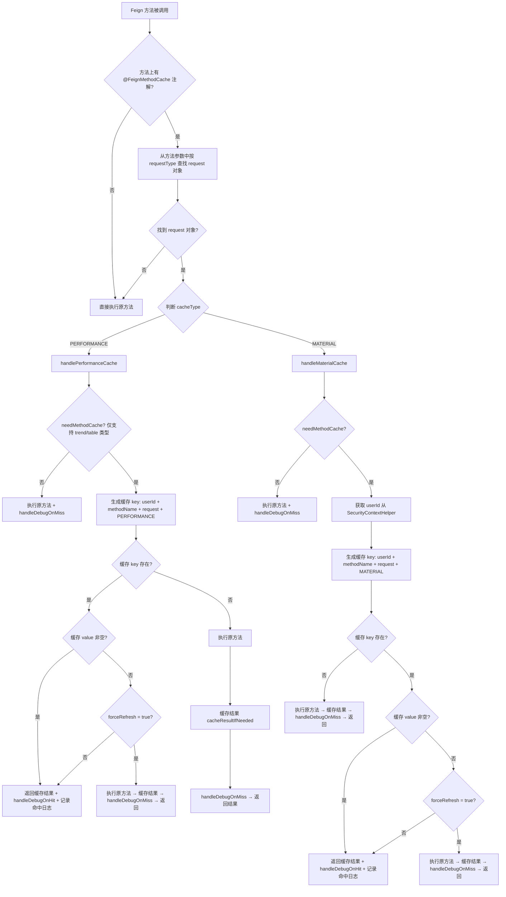
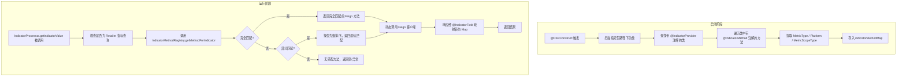
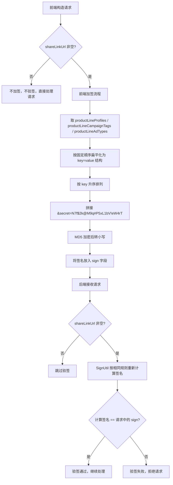

# 基础设施 功能逻辑文档

> 本文档由 document-automation 工具自动生成，基于源代码、PRD 文档和技术评审文档。
> 生成时间: 2026-04-07 16:40:22
> 准确性评分: 62/100

---


# 基础设施 功能逻辑文档

## 1. 模块概述

### 1.1 职责与定位

基础设施模块是 Pacvue Custom Dashboard 系统的底层支撑层，为上层业务模块（Dashboard 管理、Chart 渲染、指标查询等）提供通用的技术能力。该模块不直接承载业务逻辑，而是提供以下核心基础设施能力：

1. **Feign 远程调用配置**：封装与下游微服务（Walmart、Kroger、Amazon 等平台 API 服务）的通信
2. **缓存策略**：通过 `@FeignMethodCache` 注解 + AOP 切面实现 Feign 方法级别的缓存拦截，支持绩效查询缓存和物料查询缓存两种类型
3. **认证鉴权**：通过 `SignUtil` 工具类实现分享链接场景下的签名/验签机制（MD5 加密）
4. **指标方法注册与动态分发**：通过 `IndicatorMethodRegistry` 扫描注解自动注册指标方法，`IndicatorProcessor` 根据指标类型/平台/范围动态查找并调用对应的 Feign 方法
5. **多平台数据源抽象**：通过策略模式 + 模板方法模式，为 Walmart、Kroger、Sams、Target、Doordash 等平台提供统一的数据源访问接口

### 1.2 系统架构位置

```
┌─────────────────────────────────────────────────────────┐
│                     前端 (Vue/React)                      │
│         useCache 参数 / sign 参数 / 筛选条件               │
└──────────────────────────┬──────────────────────────────┘
                           │ HTTP
┌──────────────────────────▼──────────────────────────────┐
│              Controller 层                                │
│   DashboardController / ShareController /                │
│   DashboardDatasourceController                          │
└──────────────────────────┬──────────────────────────────┘
                           │
┌──────────────────────────▼──────────────────────────────┐
│            ★ 基础设施层 (本模块)                           │
│  ┌──────────────┐ ┌──────────────┐ ┌──────────────────┐ │
│  │  SignUtil     │ │ Indicator    │ │ FeignMethodCache │ │
│  │  验签/加签    │ │ Processor    │ │ Aspect (缓存切面) │ │
│  └──────────────┘ │ + Registry   │ └──────────────────┘ │
│                   └──────┬───────┘                       │
│  ┌───────────────────────▼──────────────────────────┐   │
│  │     PlatformDatasourceSupport (策略模式)           │   │
│  │  Walmart / Kroger / Sams / Target / Doordash     │   │
│  └───────────────────────┬──────────────────────────┘   │
└──────────────────────────┼──────────────────────────────┘
                           │ Feign
┌──────────────────────────▼──────────────────────────────┐
│              下游微服务 / ClickHouse                       │
│  WalmartSovFeign / WalmartAdvertisingFeign /             │
│  KrogerAdvertisingFeign / AmazonRestReportFeign 等       │
└─────────────────────────────────────────────────────────┘
```

### 1.3 涉及的后端模块

| 模块名 | 说明 |
|--------|------|
| `custom-dashboard-web-base` | Web 基础模块，包含 SecurityContextHelper、通用配置等 |
| `custom-dashboard-feign` | Feign 客户端定义模块，包含各平台 Feign 接口、注解、切面、缓存等 |

### 1.4 涉及的前端组件

前端不直接属于本模块，但与本模块交互的关键参数包括：
- **`useCache`**：前端在 `queryChart` 请求中传入，控制是否走缓存
- **`sign`**：前端在分享链接场景下传入签名字符串，用于后端验签
- **`shareLinkUrl`**：当此字段非空时，后端才进行验签

### 1.5 Maven 坐标

待确认（代码片段未直接暴露 Maven GAV 坐标，推测为 `com.pacvue:custom-dashboard-web-base` 和 `com.pacvue:custom-dashboard-feign`）

---

## 2. 用户视角

### 2.1 功能场景

基础设施模块对终端用户是透明的，用户不会直接感知到其存在。但它支撑了以下用户可感知的功能场景：

#### 场景一：Dashboard 数据加载加速（缓存）

- **用户操作**：用户打开一个 Dashboard 页面，页面中包含多个 Chart（折线图、柱状图、表格等）
- **用户感知**：首次加载可能较慢（数秒到数十秒），但短时间内再次访问同一 Dashboard 时，数据加载明显加快
- **底层机制**：`FeignMethodCacheAspect` 在首次查询时将结果缓存（5~10 分钟随机过期），后续请求命中缓存直接返回

#### 场景二：分享链接安全访问（签名验签）

- **用户操作**：用户通过分享链接访问他人的 Dashboard
- **用户感知**：如果链接被篡改（如修改了筛选条件参数），访问将被拒绝
- **底层机制**：前端对筛选条件参数（productLineProfiles、productLineCampaignTags、productLineAdTypes）进行 MD5 签名，后端通过 `SignUtil` 验签

#### 场景三：多平台数据统一展示

- **用户操作**：用户在 Dashboard 中查看来自 Walmart、Kroger、Amazon 等不同平台的指标数据
- **用户感知**：所有平台数据以统一的 Chart 格式展示，无需关心数据来源差异
- **底层机制**：`IndicatorProcessor` + `IndicatorMethodRegistry` 根据指标类型和平台动态路由到对应的 Feign 方法

#### 场景四：物料下拉框查询

- **用户操作**：用户在 Dashboard 编辑页面或筛选面板中，通过下拉框搜索 ASIN 等物料信息
- **用户感知**：下拉框数据加载，支持缓存加速
- **底层机制**：`DashboardDatasourceController#getAsinList` 接口，使用 `@FeignMethodCache(cacheType=MATERIAL)` 缓存

### 2.2 权限隔离

根据 PRD 文档，所有 Template 和分组都遵从用户数据权限隔离，与 Custom Dashboard 权限保持一致。在基础设施层面：
- 绩效缓存的 key 中包含 `userId`，确保不同用户的缓存数据隔离
- 物料缓存的 key 中同样包含 `userId`（通过 `SecurityContextHelper.getUserInfo().getUserId()` 获取）
- `UserInfo` 对象用于权限隔离，通过 `SecurityContextHelper` 从安全上下文中获取

---

## 3. 核心 API

### 3.1 REST 端点

#### 3.1.1 物料下拉框查询接口

| 属性 | 值 |
|------|-----|
| **路径** | `/data/getAsinList` |
| **HTTP 方法** | 待确认（推测为 POST） |
| **Controller** | `DashboardDatasourceController` |
| **请求参数** | `com.pacvue.api.dto.request.dat.BaseRequest` |
| **返回值** | 待确认（推测为 `BaseResponse` 包装的物料列表） |
| **缓存** | 支持，使用 `@FeignMethodCache(cacheType=MATERIAL, requestType=com.pacvue.api.dto.request.dat.BaseRequest.class)` |
| **说明** | 该接口 P95 耗时较高（1.89 min），provider 查 SQL Server 耗时过长，已建议改为 ClickHouse 查询 |

**注意事项**：
- 物料查询的 `BaseRequest` 是 `com.pacvue.api.dto.request.dat.BaseRequest`，与绩效查询的 `com.pacvue.base.dto.request.BaseRequest` 是**不同的类**
- 使用缓存时必须在注解中显式指定 `requestType` 和 `cacheType`，否则切面无法正确解析参数

#### 3.1.2 指标查询入口（非本模块直接暴露，但由本模块支撑）

| 属性 | 值 |
|------|-----|
| **路径** | 由 `DashboardController#getIndicator` 和 `ShareController#getIndicator` 暴露 |
| **说明** | 这两个入口是总入口，内部通过 `IndicatorProcessor.getIndicatorValue` 调用本模块的指标分发能力 |
| **P95 耗时** | DashboardController: 18.98s, ShareController: 19.12s（非本模块慢，而是下游各模块最耗时线程决定） |

### 3.2 前端调用方式

前端在调用 `queryChart` 类接口时，通过以下参数与基础设施层交互：

```json
{
  "useCache": true,          // 是否使用缓存，由前端控制
  "shareLinkUrl": "https://...",  // 分享链接URL，非空时后端验签
  "sign": "a1b2c3d4...",    // MD5签名字符串
  "productLineProfiles": {   // 筛选条件（参与签名）
    "Amazon": ["profileA", "profileB"],
    "Walmart": ["profileC"]
  },
  "productLineCampaignTags": {},
  "productLineAdTypes": {}
}
```

---

## 4. 核心业务流程

### 4.1 总体数据流

```
前端请求(含 useCache/sign 参数)
    → DashboardDatasourceController / DashboardController / ShareController
    → SignUtil 验签(仅 shareLinkUrl 非空时)
    → IndicatorProcessor.getIndicatorValue
    → IndicatorMethodRegistry 根据 MetricType/Platform/MetricScopeType 查找匹配的 Feign 方法
    → FeignMethodCacheAspect 拦截判断缓存(按 cacheType 分发, 按 requestType 解析参数)
    → 命中缓存则直接返回
    → 未命中则调用具体平台 DatasourceSupport(Walmart/Kroger/Sams/Target/Doordash)
    → 平台 DatasourceSupport 通过对应 Feign Client 调用下游微服务/ClickHouse
    → 响应经 @IndicatorField 映射转为 Map<String, Object>
    → 结果写入缓存
    → 返回 BaseResponse 给前端
```

### 4.2 缓存处理流程（FeignMethodCacheAspect）



### 4.3 指标方法注册与分发流程



### 4.4 签名验签流程



### 4.5 关键设计模式详解

#### 4.5.1 策略模式 — 多平台数据源

```
PlatformDatasourceSupport (接口)
    ├── AbstractDatasourceSupport (抽象基类，模板方法)
    │   ├── WalmartDatasourceSupport
    │   ├── KrogerDatasourceSupport
    │   ├── SamsDatasourceSupport
    │   ├── TargetDataSourceSupport
    │   └── DoordashDatasourceSupport
```

- **`PlatformDatasourceSupport`**：定义平台数据源的统一接口
- **`AbstractDatasourceSupport`**：抽象基类，实现模板方法模式，封装通用的数据查询流程（如参数校验、结果转换等），将平台特定的逻辑留给子类实现
- **各平台实现类**：实现平台特定的数据获取逻辑，通过对应的 Feign Client 调用下游服务

#### 4.5.2 注册表模式 — IndicatorMethodRegistry

`IndicatorMethodRegistry` 在应用启动时（`@PostConstruct`）扫描所有带 `@IndicatorProvider` 注解的类，将其中带 `@IndicatorMethod` 注解的方法注册到内部的 `indicatorMethodMap` 中。运行时根据查询条件（MetricType、Platform、MetricScopeType）从注册表中查找匹配的方法。

**匹配策略**：
1. **完全匹配**：方法声明的指标类型集合完全包含查询请求的指标类型集合
2. **部分匹配**：方法声明的指标类型集合与查询请求的指标类型集合有交集
3. 如果指定了排序字段（`orderByField`），对部分匹配结果按优先级排序

#### 4.5.3 AOP 切面 — FeignMethodCacheAspect

通过 Spring AOP 的 `@Around` 通知拦截所有带 `@FeignMethodCache` 注解的方法调用，在方法执行前后插入缓存逻辑。这种设计使得缓存逻辑与业务逻辑完全解耦，只需在 Feign 方法上添加注解即可启用缓存。

#### 4.5.4 注解驱动体系

| 注解 | 作用目标 | 说明 |
|------|---------|------|
| `@IndicatorProvider` | 类 | 标注该类是指标提供者，会被 Registry 扫描 |
| `@IndicatorMethod` | 方法 | 标注该方法提供指标查询能力，声明 MetricType/Platform/MetricScopeType |
| `@IndicatorField` | 字段 | 标注响应对象字段与指标的映射关系，用于将响应转为 Map<String, Object> |
| `@FeignMethodCache` | 方法 | 标注该 Feign 方法需要缓存，配置缓存类型、过期时间、强制刷新等 |

---

## 5. 数据模型

### 5.1 数据库表

待确认。代码片段未直接暴露表名。根据技术评审文档，涉及 ClickHouse SQL 优化，但具体表名待确认。物料查询（`getAsinList`）当前查询 SQL Server，建议改为 ClickHouse。

### 5.2 核心 DTO/VO

#### 5.2.1 BaseRequest（绩效查询）

- **全限定名**：`com.pacvue.base.dto.request.BaseRequest`
- **用途**：绩效查询的基础请求对象
- **关键字段**（根据代码推断）：
  - `userId`：用户 ID，用于缓存 key 生成和权限隔离
  - `chartId`：Chart ID，用于日志记录
  - `useCache`：是否使用缓存（待确认，可能在上层传入）
  - 其他绩效查询相关字段（日期范围、指标类型等）

#### 5.2.2 BaseRequest（物料查询）

- **全限定名**：`com.pacvue.api.dto.request.dat.BaseRequest`
- **用途**：物料下拉框查询的基础请求对象
- **重要区别**：与绩效查询的 BaseRequest 是**不同的类**，在使用 `@FeignMethodCache` 时必须通过 `requestType` 属性显式指定

#### 5.2.3 BaseResponse

- **用途**：统一响应封装
- **结构**：待确认（推测包含 code、message、data 等标准字段）

#### 5.2.4 UserInfo

- **用途**：用户信息对象，用于权限隔离
- **获取方式**：通过 `SecurityContextHelper.getUserInfo()` 从安全上下文中获取
- **关键字段**：`userId`

#### 5.2.5 AccessLog

- **全限定名**：`com.pacvue.api.dto.AccessLog`
- **用途**：缓存命中/未命中的日志记录（由 `OperationLogService` 处理）

### 5.3 核心枚举

#### 5.3.1 CacheType

```java
public enum CacheType {
    PERFORMANCE,  // 绩效查询缓存
    MATERIAL      // 物料查询缓存
}
```

- **PERFORMANCE**：用于 Chart 绩效数据的缓存，缓存 key 包含 userId、methodName、request 参数
- **MATERIAL**：用于物料下拉框数据的缓存，缓存 key 包含 userId、methodName、request 参数

#### 5.3.2 ChartType（与缓存相关）

当前允许缓存的 ChartType 列表（硬编码在 `FeignMethodCacheAspect` 中）：

```java
List<ChartType> cacheableChartTypes = List.of(
    ChartType.TopOverview,
    ChartType.LineChart,
    ChartType.BarChart,
    ChartType.StackedBarChart,
    ChartType.PieChart,
    ChartType.Table,
    ChartType.GridTable
);
```

#### 5.3.3 Platform

```java
public enum Platform {
    Amazon,
    Walmart,
    Kroger,
    Sams,
    Target,
    Doordash
    // 可能还有其他平台
}
```

#### 5.3.4 ApiType

- **全限定名**：`com.pacvue.base.constatns.ApiType`（注意：包名中 `constatns` 疑似拼写错误，应为 `constants`）
- **用途**：待确认

### 5.4 @FeignMethodCache 注解完整定义

```java
@Retention(RetentionPolicy.RUNTIME)
@Target(ElementType.METHOD)
public @interface FeignMethodCache {
    
    /** 缓存失效最小分钟数，默认 5 分钟 */
    int minExpireMinutes() default 5;
    
    /** 缓存失效最大分钟数，默认 10 分钟 */
    int maxExpireMinutes() default 10;
    
    /** 请求参数类型，默认为绩效查询的 BaseRequest */
    Class<?> requestType() default BaseRequest.class;

    /**
     * key 已缓存但 value 为空时，是否强制重新读取 API/SQL。
     * 设计原因：有的接口过慢但有数据，db 和 cache 会存在不一致问题，
     * 对此类场景设置 true 可强刷 API/SQL。
     */
    boolean forceRefresh() default false;

    /** 缓存类型，默认 PERFORMANCE（绩效缓存），物料缓存需改为 MATERIAL */
    CacheType cacheType() default CacheType.PERFORMANCE;
}
```

---

## 6. 平台差异

### 6.1 多平台数据源支持

| 平台 | 数据源实现类 | 对应 Feign Client | 说明 |
|------|-------------|-------------------|------|
| Walmart | `WalmartDatasourceSupport` | `WalmartSovFeign`, `WalmartAdvertisingFeign`, `WalmartMainApiFeign` | SOV 接口 P95 耗时 15.63s |
| Kroger | `KrogerDatasourceSupport` | `KrogerAdvertisingFeign` | |
| Sams | `SamsDatasourceSupport` | 待确认 | |
| Target | `TargetDataSourceSupport` | 待确认 | |
| Doordash | `DoordashDatasourceSupport` | 待确认 | |
| Amazon | 待确认（可能不走 DatasourceSupport 体系） | `AmazonRestReportFeign` 等 | REST API P95 耗时 27.55s |

### 6.2 指标方法注册

扩展新平台的步骤：
1. 定义一个或多个 Feign 接口方法（如 `queryXXXReport`），使用 `@IndicatorMethod` 注解声明支持的 MetricType、Platform、MetricScopeType
2. 在 Feign 接口类上添加 `@IndicatorProvider` 注解
3. 响应对象字段需要加上 `@IndicatorField` 注解，与指标进行映射
4. `IndicatorMethodRegistry` 在启动时自动扫描并注册，无需手动配置

### 6.3 签名验签的平台差异

签名仅针对以下三个筛选条件参数，按固定顺序处理：
1. `productLineProfiles`
2. `productLineCampaignTags`
3. `productLineAdTypes`

每个参数的结构为 `Map<Platform, List<String>>`，扁平化规则：
- 参数不存在 → 跳过
- 参数为空对象 `{}` → 跳过
- 参数中某平台值为空列表 `{Amazon:[]}` → 填充空字符串，转为 `productLineProfiles.Amazon=""`

---

## 7. 配置与依赖

### 7.1 关键配置项

| 配置项 | 说明 | 默认值 |
|--------|------|--------|
| 签名密钥 (secret) | 前后端约定的加签秘钥 | `N7f$2k@M9q#P5xL1bV!eW4rT` |
| 缓存最小过期时间 | `@FeignMethodCache.minExpireMinutes` | 5 分钟 |
| 缓存最大过期时间 | `@FeignMethodCache.maxExpireMinutes` | 10 分钟 |
| 缓存存储方式 | 前期使用应用内存，模块化后可迁移至 Redis | 

---

> **自动审核备注**: 准确性评分 62/100
>
> **待修正项**:
> - [error] 流程图中对于绩效缓存(PERFORMANCE)的 needMethodCache 判断描述为'仅支持 trend/table 类型'，但代码中 cacheableChartTypes 列表包含 TopOverview、LineChart、BarChart、StackedBarChart、PieChart、Table、GridTable 共7种类型，并非仅 trend/table。
> - [error] 流程图中绩效缓存分支：当缓存 key 存在、缓存 value 为空、forceRefresh=false 时，流程图显示走 G6（返回缓存结果），这意味着返回空值。但从代码注释来看，forceRefresh 的设计意图是：当 value 为空且 forceRefresh=true 时强刷，forceRefresh=false 时返回空缓存值。虽然逻辑上可能正确，但流程图中 G6 的描述是'返回缓存结果 + handleDebugOnHit + 记录命中日志'，这在 value 为空时会产生误导，应明确标注此时返回的是空值/null。
> - [warning] 文档描述'前端对筛选条件参数（productLineProfiles、productLineCampaignTags、productLineAdTypes）进行 MD5 签名'，但提供的代码片段中没有 SignUtil 的实现代码，无法验证签名参与的具体字段。这些字段名可能是臆造或推测的。
> - [warning] 文档描述缓存 key 生成格式为 'userId + methodName + request + PERFORMANCE/MATERIAL'，但代码中缓存 key 的生成是通过注入的 CacheKeyGenerator 完成的，具体格式无法从提供的代码片段中确认。key 的组成可能是臆造的。
> - [warning] 文档描述接口路径为 `/data/getAsinList`，HTTP 方法为'待确认（推测为 POST）'，Controller 为 DashboardDatasourceController，但提供的代码片段中没有该 Controller 的代码，无法验证路径和方法是否正确。


---

*本文档由 AI 自动生成，如有不准确之处请以源代码为准。标注"待确认"的内容需要人工核实。*