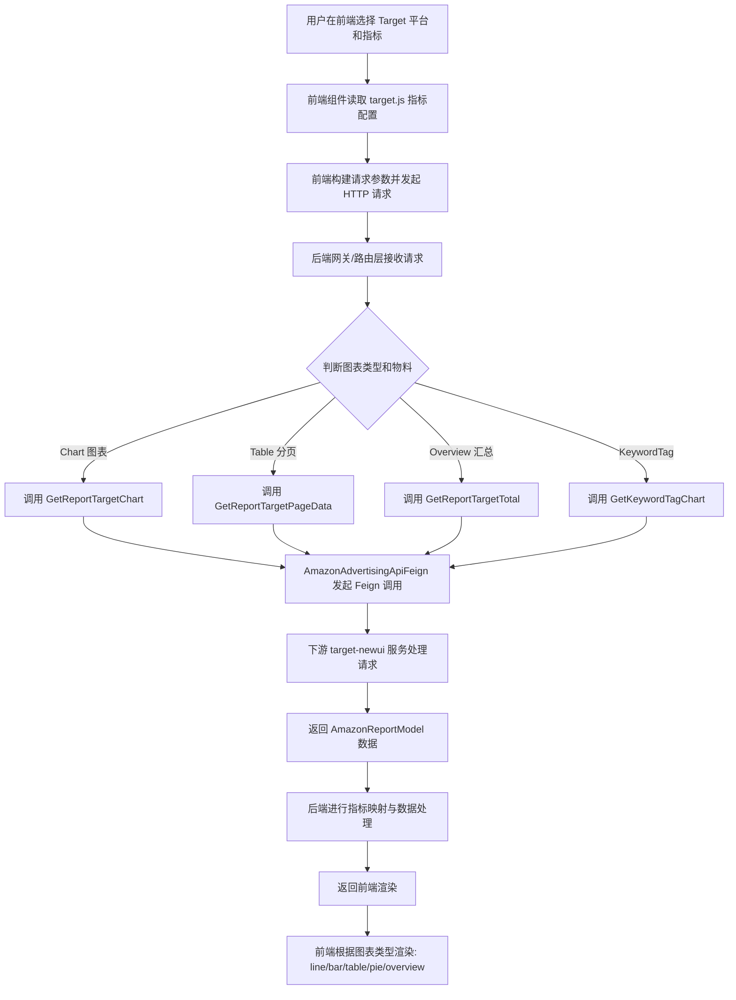
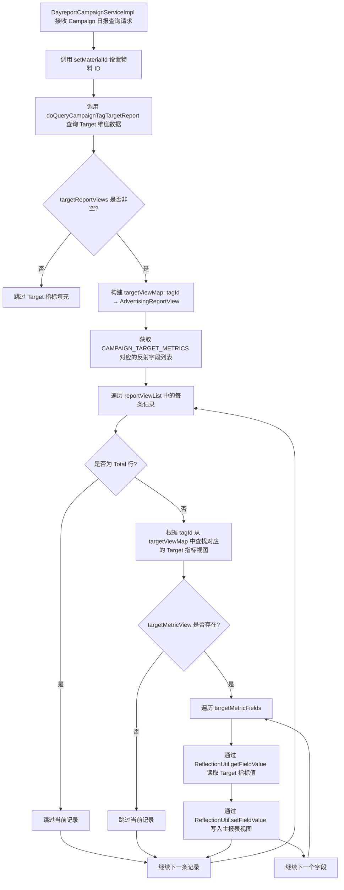
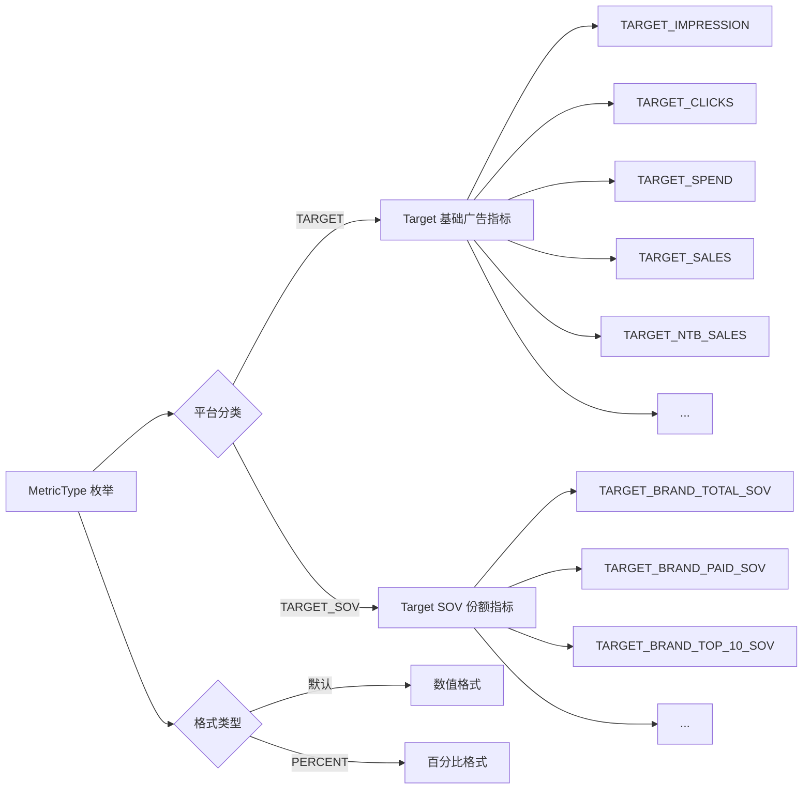

# Target 平台模块 功能逻辑文档

> 本文档由 document-automation 工具自动生成，基于源代码、PRD 文档和技术评审文档。
> 生成时间: 2026-04-09 10:50:12
> 准确性评分: 未验证/100

---


# Target 平台模块 功能逻辑文档

## 1. 模块概述

### 1.1 职责与定位

Target 平台模块（`custom-dashboard-target`）是 Pacvue Custom Dashboard 系统中负责 **Target 零售广告平台** 数据接入、查询、指标映射与报表生成的核心模块。该模块为用户提供 Target 平台搜索广告（Search Ad）、SOV（Share of Voice，搜索份额）、NTB（New-to-Brand，新客）等多维度广告效果指标的图表、表格和概览展示能力。

Target 平台是美国第八大零售商 Target Corporation 的零售媒体广告平台（Roundel），广告主可在 Target.com 及其生态内投放搜索广告。本模块将 Target 广告数据统一纳入 Custom Dashboard 的跨零售商（Cross Retailer）分析体系中，与 Amazon、Walmart、Instacart、Criteo、Citrus、Kroger 等平台并列，支持统一的指标对比和趋势分析。

### 1.2 系统架构位置与上下游关系

```
┌─────────────────────────────────────────────────────────┐
│                    前端 (Vue.js)                         │
│  metricsList/target.js │ topOverView.vue │ targetSetting.vue │ filter.js │
└──────────────────────────┬──────────────────────────────┘
                           │ HTTP Request
                           ▼
┌─────────────────────────────────────────────────────────┐
│              Custom Dashboard 后端网关/路由层             │
│         (二级路由策略: AMAZON_REPORT / AMAZON_REST_REPORT) │
└──────────────────────────┬──────────────────────────────┘
                           │
              ┌────────────┼────────────────┐
              ▼            ▼                ▼
┌──────────────────┐ ┌──────────────┐ ┌──────────────────┐
│custom-dashboard- │ │custom-dashboard│ │custom-dashboard- │
│    target        │ │   -amazon     │ │   api-rest       │
│ (Target平台模块)  │ │(Campaign日报) │ │(API模式迁移)      │
└────────┬─────────┘ └──────┬───────┘ └──────────────────┘
         │                  │
         │    Feign 调用     │ 反射填充 Target 指标
         ▼                  ▼
┌─────────────────────────────────────────────────────────┐
│            AmazonAdvertisingApiFeign (Feign Client)      │
│  /api/Target/GetReportTargetChart                        │
│  /api/Target/GetReportTargetPageData                     │
│  /api/Target/GetReportTargetTotal                        │
│  /api/KeywordTag/GetKeywordTagChart                      │
└──────────────────────────┬──────────────────────────────┘
                           │
              ┌────────────┼────────────────┐
              ▼            ▼                ▼
┌──────────────────┐ ┌──────────────┐ ┌──────────────────┐
│ target-newui-dev │ │ sov-target   │ │  tag-service     │
│ target-newui     │ │ sov-target-dev│ │ tag-service-dev  │
│(Target广告数据服务)│ │(SOV数据服务)  │ │(标签服务)         │
└──────────────────┘ └──────────────┘ └──────────────────┘
```

**上游依赖**：
- 前端 Vue 组件发起请求，携带用户选择的指标、日期范围、物料筛选条件
- Custom Dashboard 网关/路由层根据平台类型将请求分发到对应模块

**下游依赖**：
- `target-newui-dev` / `target-newui`：Target 广告数据服务，提供原始报表数据
- `sov-target-dev` / `sov-target`：SOV 数据服务，提供 TARGET_SOV 类指标数据
- `tag-service` / `tag-service-dev`：标签服务，提供 KeywordTag 相关查询
- `dsp-provider`：Amazon DSP 数据提供者（通过 `feign.client.amazon-provider` 配置）

**协作模块**：
- `custom-dashboard-amazon`：`DayreportCampaignServiceImpl` 位于此模块中，负责 Campaign 级别 Target 报表数据查询与指标填充，通过反射机制将 Target 指标合并到主报表视图

### 1.3 涉及的后端模块与前端组件

**后端 Maven 模块**：
| 模块名 | 职责 |
|---|---|
| `custom-dashboard-target` | Target 平台核心模块，封装 Target 特有的数据查询与配置 |
| `custom-dashboard-amazon` | 包含 `DayreportCampaignServiceImpl`，负责 Campaign 日报中 Target 维度数据的查询与指标填充 |
| `com.pacvue.base` | 包含 `MetricType` 核心指标枚举，定义 `TARGET_*` 系列指标 |

**前端组件**：
| 文件路径 | 职责 |
|---|---|
| `metricsList/target.js` | Target 平台指标定义列表，定义 SearchAd 分类下所有指标的配置 |
| `dialog/topOverView.vue` | Top Overview 对话框组件，负责指标选择与目标值管理 |
| `components/overviewComponents/targetSetting.vue` | 目标设置组件，支持目标值输入、验证、货币/百分比前后缀显示 |
| `public/filter.js` | 过滤器工具，`parseTargetTextToArray` 解析 Target 文本为结构化数组 |

### 1.4 部署方式

- 后端数据源配置指向 **SQL Server** 的 `target` 数据库
- 另有 **ClickHouse** 依赖，推测用于报表聚合查询（**待确认**具体表名）
- Feign 客户端通过服务发现连接下游 Target 数据服务，环境区分为 `target-newui-dev`（开发/测试）和 `target-newui`（生产）

---

## 2. 用户视角

### 2.1 功能场景总览

基于 PRD 文档和代码分析，Target 平台模块支持以下核心功能场景：

1. **Target 平台搜索广告指标查看**：用户在 Custom Dashboard 中选择 Target 平台，查看搜索广告相关的基础指标（Impression、Clicks、Spend、Sales 等）
2. **NTB（New-to-Brand）指标分析**：用户查看 Target 平台的新客相关指标，进行趋势分析并作出商业决策
3. **SOV（Share of Voice）指标分析**：用户查看 Target 平台的搜索份额指标，包括品牌总 SOV、付费 SOV、自然 SOV 等
4. **跨零售商对比（Cross Retailer）**：Target 平台指标与 Amazon、Walmart 等其他平台指标在同一 Dashboard 中进行对比分析
5. **Target Progress / Target Compare 模式**：在 Overview 图表中设置目标值，跟踪 Target 平台指标的达成进度
6. **多图表类型展示**：支持 line（折线图）、bar（柱状图）、table（表格）、topOverview（概览卡片）、pie（饼图）等多种图表形式

### 2.2 场景一：Target 平台搜索广告指标查看

**用户操作流程**：

1. **进入 Dashboard**：用户登录 Pacvue 平台，进入 Custom Dashboard 模块
2. **创建/编辑图表**：用户点击创建新图表或编辑已有图表
3. **选择平台**：在 Platform 筛选器中选择 "Target" 平台（Figma 设计稿中可见 Citrus 等平台选项，Target 同理）
4. **选择物料层级**：选择 Campaign、Campaign Tag 等物料层级
5. **选择指标**：从 `target.js` 定义的指标列表中选择所需指标（如 Impression、Clicks、CTR、Spend、CPC、ACOS、ROAS、Sales 等）
6. **设置日期范围**：选择自定义日期范围或使用默认日期
7. **查看数据**：系统调用后端 API 获取 Target 报表数据，渲染为用户选择的图表类型

**UI 交互要点**：
- 指标选择器支持 SearchAd 分类下的所有 Target 指标
- 每个指标配置了 `label`（显示名称）、`value`（枚举值）、`formType`（表单类型）、`compareType`（比较类型）、`supportChart`（支持的图表类型）、`ScopeSettingObj`（数据范围设置对象）
- Figma 设计稿中可见 "Target ROAS" 列标题出现在 Table 图表的列头中（`Custom Dashboard-Table-campaign` 页面）

### 2.3 场景二：NTB（New-to-Brand）指标分析

**背景**（来自 PRD）：
> 用户希望能够在 Custom Dashboard 中为 Target 增加 NTB 相关指标。Target 平台用户可以更方便地洞察 NTB 相关数据，进行趋势分析并作出商业决策。

**用户操作流程**：

1. **选择 Target 平台**：在 Dashboard 的 Platform 筛选器中选择 Target
2. **选择 NTB 指标**：在指标列表中选择 NTB 相关指标，包括：
   - NTB Sales（新客销售额）
   - NTB Sales %（新客销售额占比）
   - NTB Sale Units（新客销售件数）
   - NTB Sale Units %（新客销售件数占比）
   - Online NTB Sales / Online NTB Sales % / Online NTB Sale Units（线上新客指标）
   - Offline NTB Sales / Offline NTB Sales % / Offline NTB Sale Units（线下新客指标）
3. **在 Table 图表中查看**：NTB 指标主要在 Table 图表中展示（PRD 标题明确为"为 Target 在 table 图表中增加 NTB 相关指标"）
4. **趋势分析**：用户可在 Trend 图表中查看 NTB 指标的时间趋势

**交叉验证**：
- PRD 中描述的 NTB 指标在 `MetricType` 枚举中均有对应实现：`TARGET_NTB_SALES`、`TARGET_NTB_SALES_PERCENT(TARGET, PERCENT)`、`TARGET_NTB_SALE_UNITS` 等共 10 个 NTB 指标
- 技术评审文档中明确列出了 NTB 指标枚举表，与代码完全一致
- 其中带 `PERCENT` 格式类型的指标（如 `TARGET_NTB_SALES_PERCENT`）在前端以百分比形式展示

### 2.4 场景三：SOV 指标分析

**用户操作流程**：

1. **选择 Target 平台**
2. **选择 SOV 指标**：从 `TARGET_SOV` 分类的指标中选择，包括：
   - Brand Total SOV / Brand Paid SOV / Brand Organic SOV
   - Brand Top of Search SP SOV（百分比格式）
   - Brand Top 10 SOV / Top 10 SP SOV / Top 10 Organic SOV（百分比格式）
   - ASIN Page 1 Rate / Page Top 3 Rate / Page Top 6 Rate
   - ASIN Avg Position / Avg Paid Position / Avg Organic Position
3. **查看搜索份额数据**：系统从 `sov-target` 服务获取 SOV 数据并展示

### 2.5 场景四：Target Progress 目标设置

**用户操作流程**：

1. **创建 Overview 图表**：选择 Chart Format 为 "Target Progress" 或 "Target Compare"
2. **选择指标**：在 `topOverView.vue` 组件中通过 `getTargetListData` 方法获取可用指标列表
3. **设置目标值**：在 `targetSetting.vue` 组件中输入目标值
   - 支持货币前缀（如 $）和百分比后缀（如 %）的显示
   - 支持输入验证
   - 支持删除已设置的目标
4. **保存并查看进度**：通过 `updateTarget` 方法保存目标设置，Dashboard 展示指标达成进度
5. **内部相对时间支持**（来自技术评审 2026Q1S6）：Overview 下 target-progress 支持内部相对时间，后端定义枚举，前端读取枚举后将相对时间转换为绝对时间

### 2.6 场景五：Target 文本解析（Filter）

`filter.js` 中的 `parseTargetTextToArray` 函数支持将 Target 文本解析为结构化数组，提取以下关键词：
- **Category**：商品类目
- **Brand**：品牌
- **Price**：价格范围
- **Rating**：评分
- **Lookback**：回溯窗口

此功能用于 Target 平台的筛选器，帮助用户快速定位特定的广告投放目标。

---

## 3. 核心 API

### 3.1 Feign 客户端接口（AmazonAdvertisingApiFeign）

以下接口通过 `AmazonAdvertisingApiFeign` Feign 客户端声明式调用下游 Target 数据服务：

#### 3.1.1 获取 Target 报表图表数据

- **路径**: `POST /api/Target/GetReportTargetChart`
- **参数**: `AmazonReportParams`（请求体）
  - 包含日期范围、物料筛选条件、指标列表等参数（**待确认**具体字段定义）
- **返回值**: `BaseResponse<List<AmazonReportModel>>`
  - `AmazonReportModel` 继承自 `AmazonReportDataBase`，包含指标映射字段和非指标字段
- **说明**: 获取 Target 平台报表的时间序列数据，用于 Trend（折线图）、Comparison（对比图）等图表类型的渲染

#### 3.1.2 获取 Target 报表分页数据

- **路径**: `POST /api/Target/GetReportTargetPageData`
- **参数**: `AmazonReportParams`（请求体）
  - 额外包含分页参数（pageIndex、pageSize）
- **返回值**: `BaseResponse<PageResponse<AmazonReportModel>>`
  - `PageResponse` 包含分页信息（总数、当前页、每页条数）和数据列表
- **说明**: 获取 Target 平台报表的分页表格数据，用于 Table 图表类型的渲染

#### 3.1.3 获取 Target 报表汇总数据

- **路径**: `POST /api/Target/GetReportTargetTotal`
- **参数**: `AmazonReportParams`（请求体）
- **返回值**: `BaseResponse<AmazonReportModel>`
  - 返回单条汇总记录
- **说明**: 获取 Target 平台报表的汇总数据，用于 Overview（概览卡片）、Pie（饼图）等图表类型的渲染

#### 3.1.4 获取 KeywordTag 图表数据

- **路径**: `POST /api/KeywordTag/GetKeywordTagChart`
- **参数**: `AmazonReportParams`（请求体）
- **返回值**: `BaseResponse<List<AmazonReportModel>>`
- **说明**: 获取 KeywordTag 维度的图表数据，用于关键词标签相关的分析场景

### 3.2 内部服务接口

#### 3.2.1 Campaign Tag Target 报表查询

- **方法**: `DayreportCampaignServiceImpl.doQueryCampaignTagTargetReport(queryTargetRequest)`
- **参数**: `queryTargetRequest`（包含 Campaign Tag 查询条件）
- **返回值**: `List<AdvertisingReportView>`（Target 维度的报表视图列表）
- **说明**: 在 Campaign 日报服务中查询 Target 维度的报表数据，返回的数据将通过反射机制填充到主报表视图中

### 3.3 前端 API 调用

前端通过以下方式调用后端 API（**待确认**具体的前端 API 文件路径）：

- `topOverView.vue` 中的 `getTargetListData` 方法：获取 Target 指标列表数据
- `topOverView.vue` 中的 `updateTarget` 方法：更新 Target 目标值设置
- 图表组件通过统一的 Chart Query 接口发起请求，后端根据平台类型路由到 Target 模块

---

## 4. 核心业务流程

### 4.1 Target 报表数据查询与展示流程



**详细步骤说明**：

**步骤 1：前端指标配置加载**
前端加载 `metricsList/target.js` 文件，该文件定义了 Target 平台在 SearchAd 分类下的所有可用指标。每个指标包含以下配置属性：
- `label`：指标显示名称（如 "Impression"、"Clicks"、"CTR"）
- `value`：指标枚举值（对应后端 `MetricType` 枚举，如 `TARGET_IMPRESSION`）
- `formType`：表单类型，决定指标在编辑界面的展示形式
- `compareType`：比较类型，决定指标在对比场景下的计算方式
- `supportChart`：支持的图表类型列表（如 line、bar、table、topOverview、pie）
- `ScopeSettingObj`：数据范围设置对象，定义指标的筛选维度

**步骤 2：用户选择指标与配置**
用户在图表编辑界面中：
- 从 Platform 下拉框选择 "Target"
- 从指标列表中选择一个或多个指标
- 设置日期范围（支持 Custom 自定义和 YOY 年同比）
- 设置物料筛选条件（Profile、Campaign Tag、Ad Type 等）

**步骤 3：前端构建请求参数**
前端将用户选择转换为 `AmazonReportParams` 结构的请求参数，包含：
- 日期范围（startDate、endDate）
- 指标列表（metrics）
- 物料筛选条件（profileIds、campaignTagIds 等）
- 分页参数（pageIndex、pageSize，仅 Table 类型）
- 时间粒度（daily、weekly、monthly，仅 Trend 类型）

**步骤 4：后端路由分发**
后端网关/路由层接收请求后，根据平台类型（Target）和图表类型，将请求路由到 `custom-dashboard-target` 模块或 `custom-dashboard-amazon` 模块中的相应处理逻辑。

**步骤 5：Feign 调用下游服务**
`AmazonAdvertisingApiFeign` 根据图表类型调用不同的下游接口：
- Chart 图表 → `POST /api/Target/GetReportTargetChart`
- Table 分页 → `POST /api/Target/GetReportTargetPageData`
- Overview 汇总 → `POST /api/Target/GetReportTargetTotal`

**步骤 6：数据返回与处理**
下游 `target-newui` 服务返回 `AmazonReportModel` 数据，后端进行必要的指标映射和数据转换后返回前端。

**步骤 7：前端渲染**
前端根据图表类型将数据渲染为对应的可视化形式。

### 4.2 Campaign Tag Target 指标填充流程



**详细步骤说明**：

**步骤 1：设置物料 ID**
调用 `setMaterialId(queryTargetRequest, reportViewList)` 方法，将查询请求中的物料 ID 设置到请求参数中，确保后续查询能正确关联到对应的 Campaign Tag。

**步骤 2：查询 Target 维度报表数据**
调用 `doQueryCampaignTagTargetReport(queryTargetRequest)` 方法，该方法内部通过 Feign 客户端或数据库查询获取 Target 维度的报表数据，返回 `List<AdvertisingReportView>`。

**步骤 3：构建 tagId 映射 Map**
将 Target 报表视图列表转换为以 `tagId` 为 key 的 Map：
```java
Map<String, AdvertisingReportView> targetViewMap = targetReportViews.stream()
    .collect(Collectors.toMap(
        AdvertisingReportView::getTagId, 
        Function.identity(), 
        (oldVal, newVal) -> newVal  // 重复 key 取新值
    ));
```
这里使用了 **Map 聚合模式**，通过 `tagId` 将 Target 报表数据与主报表数据进行关联。当存在重复 `tagId` 时，采用"后者覆盖前者"的策略。

**步骤 4：获取反射字段列表**
从 `CAMPAIGN_TARGET_METRICS` 常量（包含所有 Campaign 级别的 Target 指标枚举列表）中，通过 `ReflectionUtil.getMatchingField` 方法获取每个指标对应的 `AdvertisingReportView` 类中的 `Field` 对象：
```java
List<Field> targetMetricFields = CAMPAIGN_TARGET_METRICS.stream()
    .map(metricType -> ReflectionUtil.getMatchingField(
        AdvertisingReportView.class, metricType, IndicatorType.Value))
    .toList();
```
这里使用了 **反射填充模式**，通过 `MetricType` 枚举和 `IndicatorType.Value` 动态定位到 `AdvertisingReportView` 类中对应的字段。

**步骤 5：遍历主报表视图并填充 Target 指标**
对 `reportViewList` 中的每条记录：
- 跳过 Total 行（`isTotal == true`）
- 根据 `tagId` 从 `targetViewMap` 中查找对应的 Target 指标视图
- 如果找到，则遍历所有 Target 指标字段，通过反射将值从 Target 视图复制到主报表视图

**关键设计模式解析**：

1. **反射填充模式**：通过 `ReflectionUtil` 动态读写字段值，避免了为每个指标编写硬编码的赋值逻辑。当新增 Target 指标时，只需在 `CAMPAIGN_TARGET_METRICS` 列表中添加对应的 `MetricType` 枚举，无需修改填充逻辑。

2. **Map 聚合模式**：通过 `tagId` 构建 Map 进行 O(1) 时间复杂度的数据关联，避免了嵌套循环的 O(n²) 复杂度。

### 4.3 MetricType 枚举策略模式



`MetricType` 枚举通过构造函数参数实现策略分类：
- **单参数构造**：`TARGET_IMPRESSION(TARGET)` — 平台分类为 TARGET，格式类型为默认（数值）
- **双参数构造**：`TARGET_NTB_SALES_PERCENT(TARGET, PERCENT)` — 平台分类为 TARGET，格式类型为 PERCENT（百分比）

这种设计使得系统可以通过枚举的平台分类属性快速筛选出某个平台的所有指标，同时通过格式类型属性决定前端的展示格式。

---

## 5. 数据模型

### 5.1 数据库表

数据源配置指向 **SQL Server** 的 `target` 数据库，另有 **ClickHouse** 依赖用于报表聚合查询。**待确认**具体表名，代码片段中未直接出现表定义。

### 5.2 核心枚举：MetricType（TARGET 系列）

`MetricType` 枚举定义在 `com.pacvue.base.enums.core` 包中，Target 平台相关的枚举值按功能分为以下几类：

#### 5.2.1 基础广告指标（平台分类：TARGET）

| 枚举值 | 含义 | 格式类型 |
|---|---|---|
| `TARGET_IMPRESSION` | 展示量 | 默认（数值） |
| `TARGET_CLICKS` | 点击量 | 默认 |
| `TARGET_CTR` | 点击率 | 默认 |
| `TARGET_SPEND` | 花费 | 默认 |
| `TARGET_CPC` | 单次点击成本 | 默认 |
| `TARGET_CPA` | 单次转化成本 | 默认 |
| `TARGET_CVR` | 转化率 | 默认 |
| `TARGET_ACOS` | 广告销售成本比 | 默认 |
| `TARGET_ROAS` | 广告投资回报率 | 默认 |
| `TARGET_CVR_CLICK` | 点击转化率 | 默认 |
| `TARGET_ACOS_CLICK` | 点击 ACOS | 默认 |
| `TARGET_ROAS_CLICK` | 点击 ROAS | 默认 |
| `TARGET_SALES` | 总销售额 | 默认 |
| `TARGET_SALE_UNITS` | 总销售件数 | 默认 |
| `TARGET_ORDERS` | 总订单数 | 默认 |

#### 5.2.2 辅助销售指标（平台分类：TARGET）

| 枚举值 | 含义 | 格式类型 |
|---|---|---|
| `TARGET_ASSISTED_SALES` | 辅助销售额 | 默认 |
| `TARGET_ASSISTED_SALE_UNITS` | 辅助销售件数 | 默认 |
| `TARGET_ASSISTED_SALES_CLICK` | 点击辅助销售额 | 默认 |
| `TARGET_ASSISTED_SALE_UNITS_CLICK` | 点击辅助销售件数 | 默认 |

#### 5.2.3 Same SKU 指标（平台分类：TARGET）

| 枚举值 | 含义 | 格式类型 |
|---|---|---|
| `TARGET_SAME_SKU_SALES` | 同 SKU 销售额 | 默认 |
| `TARGET_SAME_SKU_SALE_UNITS` | 同 SKU 销售件数 | 默认 |
| `TARGET_SAME_SKU_SALES_CLICK` | 点击同 SKU 销售额 | 默认 |
| `TARGET_SAME_SKU_SALE_UNITS_CLICK` | 点击同 SKU 销售件数 | 默认 |
| `TARGET_SAME_SKU_ROAS` | 同 SKU ROAS | 默认 |
| `TARGET_SAME_SKU_ACOS` | 同 SKU ACOS | 默认 |

#### 5.2.4 Other Sales 指标（平台分类：TARGET）

| 枚举值 | 含义 | 格式类型 |
|---|---|---|
| `TARGET_OTHER_SALES` | 其他销售额 | 默认 |
| `TARGET_OTHER_SALES_PERCENT` | 其他销售额占比 | 默认 |
| `TARGET_OTHER_SALES_CLICK` | 点击其他销售额 | 默认 |
| `TARGET_OTHER_SALES_PERCENT_CLICK` | 点击其他销售额占比 | 默认 |

#### 5.2.5 线上指标（平台分类：TARGET）

| 枚举值 | 含义 | 格式类型 |
|---|---|---|
| `TARGET_ONLINE_SALES` | 线上销售额 | 默认 |
| `TARGET_ONLINE_SALES_PERCENT` | 线上销售额占比 | 默认 |
| `TARGET_ONLINE_ACOS` | 线上 ACOS | 默认 |
| `TARGET_ONLINE_ROAS` | 线上 ROAS | 默认 |
| `TARGET_ONLINE_ORDERS` | 线上订单数 | 默认 |
| `TARGET_ONLINE_SALE_UNITS` | 线上销售件数 | 默认 |
| `TARGET_ONLINE_SALES_CLICK` | 点击线上销售额 | 默认 |
| `TARGET_ONLINE_SALES_PERCENT_CLICK` | 点击线上销售额占比 | 默认 |
| `TARGET_ONLINE_ACOS_CLICK` | 点击线上 ACOS | 默认 |
| `TARGET_ONLINE_ROAS_CLICK` | 点击线上 ROAS | 默认 |
| `TARGET_ONLINE_ORDERS_CLICK` | 点击线上订单数 | 默认 |
| `TARGET_ONLINE_SALE_UNITS_CLICK` | 点击线上销售件数 | 默认 |

#### 5.2.6 线下指标（平台分类：TARGET）

| 枚举值 | 含义 | 格式类型 |
|---|---|---|
| `TARGET_OFFLINE_SALES` | 线下销售额 | 默认 |
| `TARGET_OFFLINE_ORDERS` | 线下订单数 | 默认 |
| `TARGET_OFFLINE_SALE_UNITS` | 线下销售件数 | 默认 |
| `TARGET_OFFLINE_SALES_CLICK` | 点击线下销售额 | 默认 |
| `TARGET_OFFLINE_ORDERS_CLICK` | 点击线下订单数 | 默认 |
| `TARGET_OFFLINE_SALE_UNITS_CLICK` | 点击线下销售件数 | 默认 |

#### 5.2.7 AOV/ASP 指标（平台分类：TARGET）

| 枚举值 | 含义 | 格式类型 |
|---|---|---|
| `TARGET_AOV` | 平均订单价值 | 默认 |
| `TARGET_ASP` | 平均销售价格 | 默认 |

#### 5.2.8 点击归因指标（平台分类：TARGET）

| 枚举值 | 含义 | 格式类型 |
|---|---|---|
| `TARGET_SALES_CLICK` | 点击销售额 | 默认 |
| `TARGET_SALE_UNITS_CLICK` | 点击销售件数 | 默认 |
| `TARGET_ORDERS_CLICK` | 点击订单数 | 默认 |

#### 5.2.9 NTB（New-to-Brand）指标（平台分类：TARGET）

| 枚举值 | 含义 | 格式类型 |
|---|---|---|
| `TARGET_NTB_SALES` | NTB 销售额 | 默认 |
| `TARGET_NTB_SALES_PERCENT` | NTB 销售额占比 | PERCENT |
| `TARGET_NTB_SALE_UNITS` | NTB 销售件数 | 默认 |
| `TARGET_NTB_SALE_UNITS_PERCENT` | NTB 销售件数占比 | PERCENT |
| `TARGET_ONLINE_NTB_SALES` | 线上 NTB 销售额 | 默认 |
| `TARGET_ONLINE_NTB_SALES_PERCENT` | 线上 NTB 销售额占比 | PERCENT |
| `TARGET_ONLINE_NTB_SALE_UNITS` | 线上 NTB 销售件数 | 默认 |
| `TARGET_OFFLINE_NTB_SALES` | 线下 NTB 销售额 | 默认 |
| `TARGET_OFFLINE_NTB_SALES_PERCENT` | 线下 NTB 销售额占比 | PERCENT |
| `TARGET_OFFLINE_NTB_SALE_UNITS` | 线下 NTB 销售件数 | 默认 |

#### 5.2.10 SOV（Share of Voice）指标（平台分类：TARGET_SOV）

| 枚举值 | 含义 | 格式类型 |
|---|---|---|
| `TARGET_BRAND_TOTAL_SOV` | 品牌总 SOV | 默认 |
| `TARGET_BRAND_PAID_SOV` | 品牌付费 SOV | 默认 |
| `TARGET_BRAND_ORGANIC_SOV` | 品牌自然 SOV | 默认 |
| `TARGET_BRAND_TOP_OF_SEARCH_SP_SOV` | 品牌搜索顶部 SP SOV | PERCENT |
| `TARGET_BRAND_TOP_10_SOV` | 品牌 Top 10 SOV | PERCENT |
| `TARGET_BRAND_TOP_10_SP_SOV` | 品牌 Top 10 SP SOV | PERCENT |
| `TARGET_BRAND_TOP_10_ORGANIC_SOV` | 品牌 Top 10 自然 SOV | PERCENT |
| `TARGET_ASIN_PAGE_1_RATE` | ASIN 第 1 页占比 | 默认 |
| `TARGET_ASIN_PAGE_TOP_3_RATE` | ASIN Top 3 占比 | 默认 |
| `TARGET_ASIN_PAGE_TOP_6_RATE` | ASIN Top 6 占比 | 默认 |
| `TARGET_ASIN_AVG_POSITION` | ASIN 平均位置 | 默认 |
| `TARGET_ASIN_AVG_PAID_POSITION` | ASIN 平均付费位置 | 默认 |
| `TARGET_ASIN_AVG_ORGANIC_POSITION` | ASIN 平均自然位置 | 默认 |

### 5.3 核心 DTO/VO

#### 5.3.1 AmazonReportParams（请求参数模型）

Target 报表请求参数模型，用于向下游 Target 服务传递查询条件。**待确认**具体字段定义，推测包含：
- `startDate` / `endDate`：日期范围
- `profileIds`：Profile ID 列表
- `campaignIds`：Campaign ID 列表
- `metrics`：请求的指标列表
- `pageIndex` / `pageSize`：分页参数
- `timeSegment`：时间粒度（daily/weekly/monthly）

#### 5.3.2 AmazonReportModel（响应数据模型）

继承自 `AmazonReportDataBase`，包含：
- **指标映射字段**（定义在 `AmazonReportDataBase` 中）：与 `MetricType` 枚举对应的数值字段
- **非指标字段**（定义在 `AmazonReportModel` 中）：如日期、Campaign 名称、Profile 名称等维度信息
- `AmazonReportModelWrapper`：模型包装类，用于 TopMover 场景

#### 5.3.3 AdvertisingReportView（广告报表视图对象）

承载指标字段的视图对象，关键字段包括：
- `tagId`：标签 ID，用于 Campaign Tag 维度的数据关联
- `isTotal`：是否为汇总行（Boolean）
- 各指标对应的 Value 字段（通过 `ReflectionUtil.getMatchingField` 动态匹配）

---

## 6. 平台差异

### 6.1 Target 平台与其他平台的指标对比

Target 平台的指标体系与 Citrus、Kroger、Criteo 等平台保持一致的命名规范，但有以下特有特征：

| 特征 | Target | Amazon | Walmart | Citrus |
|---|---|---|---|---|
| 线上/线下拆分 | ✅ 支持 Online/Offline 拆分 | ❌ | **待确认** | ❌ |
| NTB 指标 | ✅ 10 个 NTB 指标 | ✅ | **待确认** | ❌ |
| SOV 指标 | ✅ 13 个 SOV 指标 | ✅ | **待确认** | ✅ 13 个 SOV 指标 |
| Same SKU 指标 | ✅ 6 个 Same SKU 指标 | **待确认** | **待确认** | ❌ |
| Assisted Sales | ✅ 4 个辅助销售指标 | **待确认** | **待确认** | ❌ |
| AOV/ASP | ✅ | ✅ | ✅ | ✅（v2.9 加入） |
| 点击归因 (_CLICK 后缀) | ✅ 大量点击归因指标 | **待确认** | **待确认** | ✅ 部分支持 |

### 6.2 Target 平台特有的线上/线下拆分

Target 平台的一个显著特征是支持 **线上（Online）和线下（Offline）** 的销售数据拆分。这反映了 Target 作为全渠道零售商的特点——广告投放可能同时驱动线上电商和线下门店的销售。

**线上指标**：`TARGET_ONLINE_SALES`、`TARGET_ONLINE_ORDERS`、`TARGET_ONLINE_SALE_UNITS`、`TARGET_ONLINE_ACOS`、`TARGET_ONLINE_ROAS` 等
**线下指标**：`TARGET_OFFLINE_SALES`、`TARGET_OFFLINE_ORDERS`、`TARGET_OFFLINE_SALE_UNITS` 等
**线上/线下 NTB**：`TARGET_ONLINE_NTB_SALES`、`TARGET_OFFLINE_NTB_SALES` 等

### 6.3 Target 平台的 SOV 指标体系

Target SOV 指标使用 `TARGET_SOV` 平台分类，与基础广告指标（`TARGET` 分类）区分。SOV 数据来自独立的 `sov-target` 服务。

SOV 指标中，以下指标使用 `PERCENT` 格式类型：
- `TARGET_BRAND_TOP_OF_SEARCH_SP_SOV`
- `TARGET_BRAND_TOP_10_SOV`
- `TARGET_BRAND_TOP_10_SP_SOV`
- `TARGET_BRAND_TOP_10_ORGANIC_SOV`

而 `TARGET_ASIN_PAGE_1_RATE`、`TARGET_ASIN_PAGE_TOP_3_RATE`、`TARGET_ASIN_PAGE_TOP_6_RATE` 虽然名称中包含 "RATE"，但在枚举定义中**未使用 PERCENT 格式类型**，这可能意味着它们在前端以数值形式展示而非百分比形式（**待确认**前端实际展示逻辑）。

### 6.4 跨零售商指标映射

技术评审文档中提到 `RETAILER_NTB_SALES` 需要配置 `TARGET_NTB_SALES` 的映射关系，且公式中要包含该映射。这表明在 Cross Retailer 场景下，Target 的 NTB 指标会被映射到统一的 Retailer 级别指标，用于跨平台对比。

### 6.5 Target 平台的 CampaignTag Target 指标

根据技术评审文档（2025Q2S6），Target 平台在 CampaignTag（CampaignPTag）层级下支持以下 Target 指标（注意：这里的 "Target" 是指目标值设置，非 Target 平台）：

| 平台 | 支持的物料 | 支持的 targetXXX |
|---|---|---|
| Amazon | campaignTag(campaignPTag) | targetACOS、targetROAS |
| Walmart | campaignTag(campaignPTag) | Target ROAS、Target CPA、Target CPC |
| Instacart | campaignTag(campaignPTag) | Target ROAS、Target CPA、Target CPC |
| SamsClub | campaignTag(campaignPTag) | Target ROAS、Target CPA、Target CPC |

**注意**：此处 Target 平台本身是否支持 CampaignTag Target 指标在代码片段中**未明确提及**，上表中列出的是其他平台的支持情况。

---

## 7. 配置与依赖

### 7.1 Feign 下游服务依赖

| 服务名 | 环境 | 路径前缀 | 用途 |
|---|---|---|---|
| `target-newui-dev` / `target-newui` | 开发/生产 | `/api/Target/*` | Target 广告数据服务，提供报表查询接口 |
| `sov-target-dev` / `sov-target` | 开发/生产 | **待确认** | SOV 数据服务，提供 TARGET_SOV 类指标数据 |
| `tag-service-dev` / `tag-service` | 开发/生产 | `/api/KeywordTag/*` | 标签服务，提供 KeywordTag 相关查询 |
| `dsp-provider` | 通过 `feign.client.amazon-provider` 配置 | **待确认** | Amazon DSP 数据提供者 |

### 7.2 Feign 接口详情

`AmazonAdvertisingApiFeign` 声明式 HTTP 客户端定义了以下 Target 相关接口：

```java
@PostMapping("/api/Target/GetReportTargetChart")
BaseResponse<List<AmazonReportModel>> getReportTargetChart(@RequestBody AmazonReportParams params);

@PostMapping("/api/Target/GetReportTargetPageData")
BaseResponse<PageResponse<AmazonReportModel>> getReportTargetPageData(@RequestBody AmazonReportParams params);

@PostMapping("/api/Target/GetReportTargetTotal")
BaseResponse<AmazonReportModel> getReportTargetTotal(@RequestBody AmazonReportParams params);

@PostMapping("/api/KeywordTag/GetKeywordTagChart")
BaseResponse<List<AmazonReportModel>> getKeywordTagChart(@RequestBody AmazonReportParams params);
```

### 7.3 数据源配置

- **SQL Server**：数据源指向 `target` 数据库，用于存储 Target 平台的广告数据
- **ClickHouse**：推测用于报表聚合查询，提供高性能的 OLAP 查询能力

### 7.4 关键配置项

- `feign.client.amazon-provider`：DSP 数据提供者的 Feign 客户端配置
- 环境区分配置：`isProd` 判定用于区分测试环境和生产环境（技术评审中提到测试环境采用新增平台 AmazonNew 进行数据比对）

### 7.5 缓存策略

**待确认**：代码片段中未直接出现 Redis 缓存或 Kafka 消息队列的使用。推测 Target 报表数据可能通过下游服务的缓存机制进行优化。

---

## 8. 版本演进

### 8.1 版本时间线

| 版本/Sprint | 时间 | 变更内容 | 来源 |
|---|---|---|---|
| **V2.4** | 早期版本 | Custom Dashboard 基础架构建立，支持 Cross Retailer 功能，PieChart 数据处理逻辑确立 | 技术评审 V2.4 |
| **V2.8** | 中期版本 | DSP 平台层设计 | 技术评审 V2.8 |
| **V2.9** | 中期版本 | 为 Citrus 加入 AOV、ASP 配置，用于 table、topoverview cross retailer 计算（Target 平台已原生支持 AOV/ASP） | MetricType 枚举注释 |
| **25Q2 Sprint 6** | 2025 Q2 | 新增 tag targetXX 指标（CampaignTargetACOS/CPA/CPC/ROAS）；亚马逊 customize 模式迁移到 API；新增 dashboard group；新增 `queryCampaignTagTargetReport` 方法 | 技术评审 2025Q2S6 |
| **25Q3 Sprint 2** | 2025 Q3 | **Target 平台正式接入**：Brand List 新增 Target 平台；Budget Plan 创建新增 Target 平台；ROI 预测算法新增 Target 平台 | PRD 25Q3 Sprint2 |
| **25Q4 Sprint 6** | 2025 Q4 | **为 Target 在 table 图表中增加 NTB 相关指标**：新增 10 个 NTB 指标枚举；平台 topmovers 接口新增 NTB 指标；配置 RETAILER_NTB_SALES 映射关系 | PRD + 技术评审 25Q4S6 |
| **26Q1 Sprint 5** | 2026 Q1 | Custom Dashboard 接入 Copilot，支持分析单个图表内容并生成即时 insight | PRD 26Q1S5 |
| **26Q1 Sprint 6** | 2026 Q1 | Overview 下 target-progress 支持内部相对时间 | 技术评审 26Q1S6 |
| **Commerce 合并** | **待确认** | Target 支持 Commerce 功能，CDB Commerce 功能数据与 HQ 合并 | PRD CDB-Commerce |

### 8.2 关键里程碑详解

#### 8.2.1 Target 平台正式接入（25Q3 Sprint 2）

这是 Target 平台模块的首次引入，主要工作包括：
- 在 Brand List 中新增 Target 平台选项
- Budget Plan 创建流程中支持选择 Target 平台
- ROI 预测算法适配 Target 平台的数据特征

#### 8.2.2 NTB 指标扩展（25Q4 Sprint 6）

基于用户需求，为 Target 平台新增 NTB（New-to-Brand）相关指标：
- 新增 10 个 `MetricType` 枚举值（`TARGET_NTB_SALES` 至 `TARGET_OFFLINE_NTB_SALE_UNITS`）
- 平台 topmovers 接口适配 NTB 指标
- 配置 `RETAILER_NTB_SALES` 与 `TARGET_NTB_SALES` 的映射关系，支持 Cross Retailer 场景

#### 8.2.3 API 模式迁移（25Q2 Sprint 6）

虽然此变更主要针对 Amazon 平台，但其架构设计对 Target 模块有间接影响：
- 新增 `custom-dashboard-api-rest` 模块
- 引入二级路由策略（`AMAZON_REPORT` / `AMAZON_REST_REPORT`）
- `AmazonAdvertisingApiFeign` 的接口定义在此阶段确立，Target 相关接口也在此 Feign 客户端中声明

### 8.3 待优化项与技术债务

1. **Controller 层待确认**：代码片段中未直接提供 Target 模块的 Controller 类定义，路由和端点映射关系需要进一步确认
2. **数据库表结构待确认**：具体的 SQL Server 表名和 ClickHouse 表结构未在代码片段中出现
3. **SOV 指标格式不一致**：`TARGET_ASIN_PAGE_1_RATE` 等 Rate 类指标未标记为 PERCENT 格式，可能需要前端额外处理
4. **Commerce 功能合并**：Target 支持 Commerce 的具体实现细节待确认

---

## 9. 已知问题与边界情况

### 9.1 代码中的注意事项

1. **Map 聚合的重复 key 处理**：
   ```java
   Collectors.toMap(AdvertisingReportView::getTagId, Function.identity(), (oldVal, newVal) -> newVal)
   ```
   当存在重复 `tagId` 时，采用"后者覆盖前者"的策略。这意味着如果同一个 `tagId` 对应多条 Target 报表记录，只有最后一条会被保留。这在数据异常（如重复数据）时可能导致数据丢失。

2. **Total 行跳过逻辑**：
   ```java
   if (BooleanUtils.isTrue(reportView.getIsTotal())) {
       return;
   }
   ```
   Target 指标填充逻辑会跳过 Total 行。这意味着 Total 行的 Target 指标值不会被填充，需要在其他地方（如前端或汇总计算逻辑中）单独处理。

3. **反射性能考量**：
   大量使用 `ReflectionUtil` 进行字段读写，虽然提供了良好的扩展性，但反射操作的性能开销高于直接字段访问。在大数据量场景下可能成为性能瓶颈。不过，`targetMetricFields` 列表在循环外预先计算，避免了重复的反射查找。

### 9.2 异常处理与降级策略

1. **Feign 调用失败**：当下游 `target-newui` 服务不可用时，Feign 调用会抛出异常。**待确认**是否配置了 Feign 的 fallback 或 fallbackFactory 进行降级处理。

2. **空数据处理**：
   ```java
   if (CollectionUtils.isNotEmpty(targetReportViews)) { ... }
   ```
   当 Target 报表查询返回空结果时，整个指标填充逻辑被跳过，主报表视图中的 Target 指标字段保持默认值（通常为 null 或 0）。

3. **targetMetricView 为 null**：
   ```java
   AdvertisingReportView targetMetricView = targetViewMap.get(reportView.getTagId());
   if (targetMetricView == null) {
       return;
   }
   ```
   当某条主报表记录的 `tagId` 在 Target 报表中没有对应数据时，该记录的 Target 指标不会被填充。

### 9.3 并发与超时边界

1. **Feign 超时**：Target 报表查询可能涉及大量数据聚合，特别是在长时间范围和多物料筛选条件下。需要合理配置 Feign 的连接超时和读取超时参数。

2. **大数据量分页**：`GetReportTargetPageData` 接口支持分页查询，但在极端情况下（如用户选择了非常长的日期范围），单页数据量可能很大，需要关注内存使用。

3. **反射字段缓存**：`CAMPAIGN_TARGET_METRICS` 对应的反射字段列表在每次调用时重新计算（`toList()` 创建新列表），但 `ReflectionUtil.getMatchingField` 内部是否有缓存机制**待确认**。如果没有缓存，在高并发场景下可能产生不必要的反射开销。

### 9.4 数据一致性

1. **线上/线下数据拆分一致性**：`TARGET_ONLINE_

---

*本文档由 AI 自动生成，如有不准确之处请以源代码为准。标注"待确认"的内容需要人工核实。*