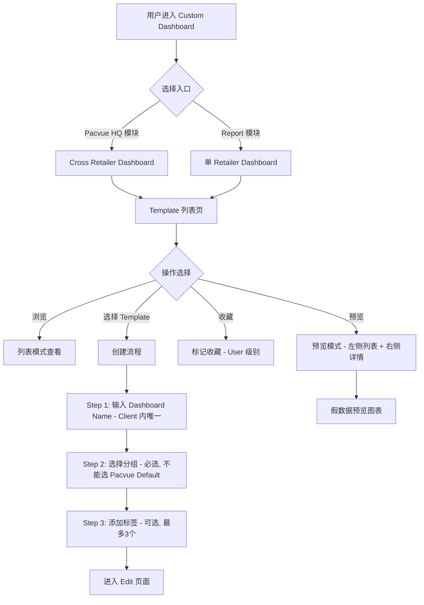
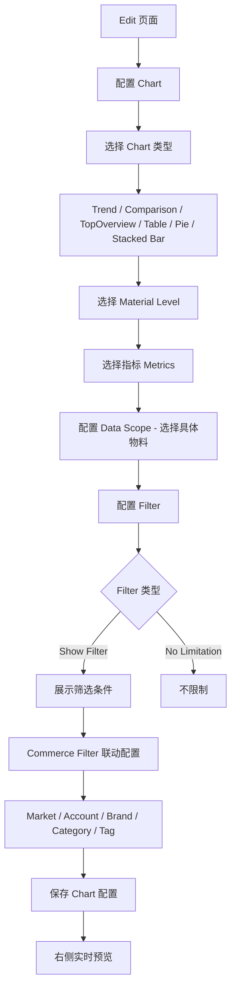
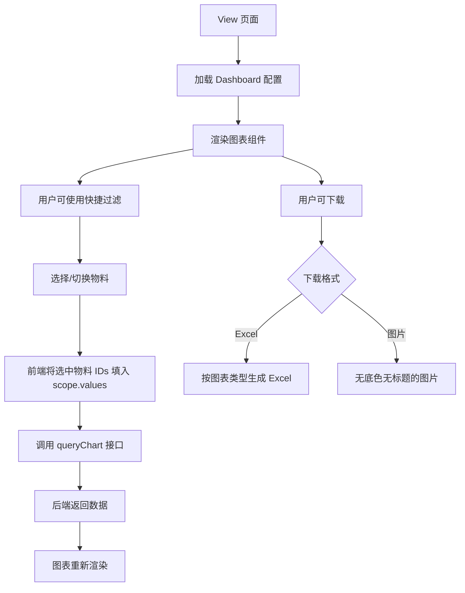
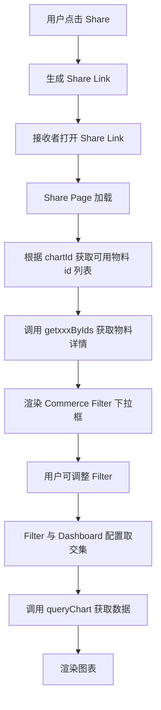
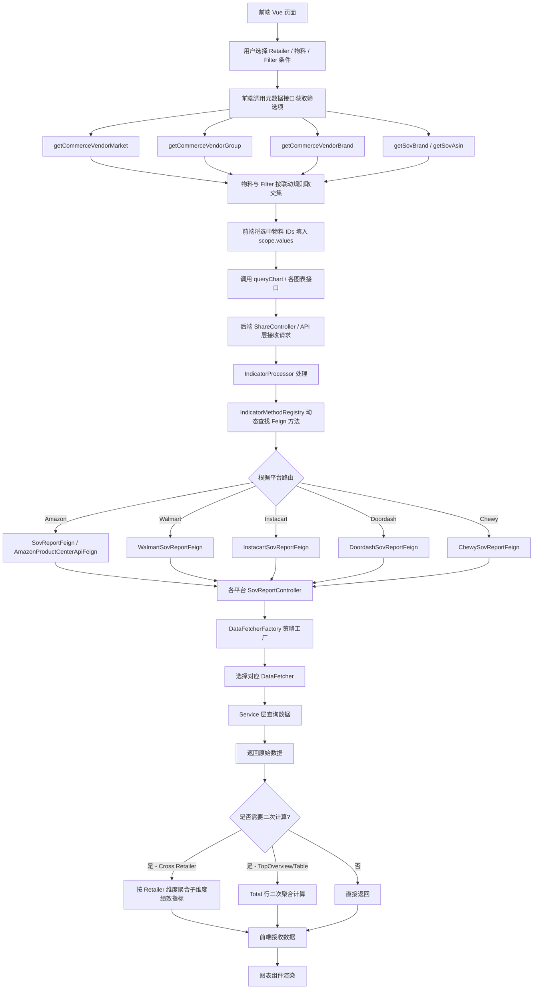
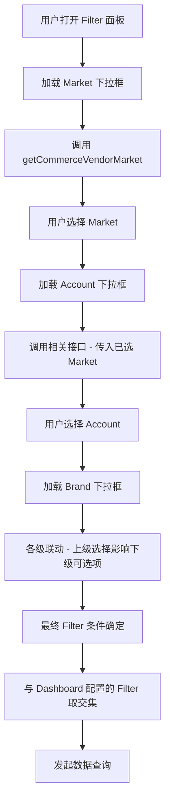
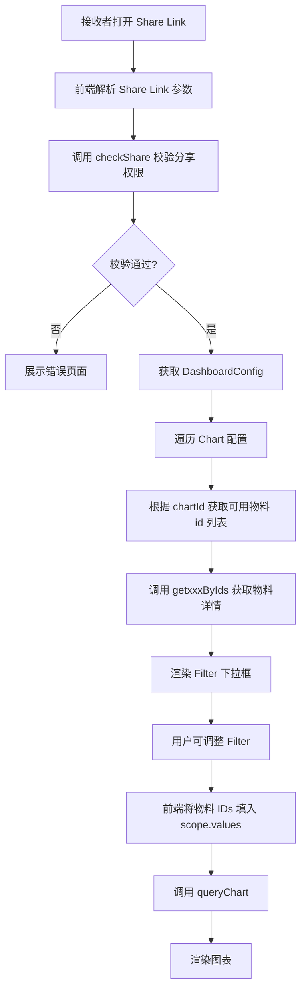

# 前端架构 功能逻辑文档

> 本文档由 document-automation 工具自动生成，基于源代码、PRD 文档和技术评审文档。
> 生成时间: 2026-04-07 16:44:19
> 准确性评分: 未验证/100

---


# 前端架构 功能逻辑文档

## 1. 模块概述

### 1.1 职责与定位

Custom Dashboard 前端架构基于 Vue 构建，是 Pacvue 平台中支持多 Retailer（Amazon、Walmart、Instacart、Doordash、Chewy）的跨平台自定义仪表盘系统的展示层与交互层。前端负责：

- **仪表盘的创建、编辑、预览与查看**：提供 Edit / View / Share Link 三种页面模式
- **图表组件渲染**：包含 Trend Chart、Comparison Chart、Top Overview、Table、Pie Chart、Stacked Bar Chart 六类图表
- **物料筛选与联动**：支持 Customize 自定义物料选择、Commerce Filter 联动（Market/Account/Brand/Category/Tag 等维度）、Chart 级别快捷过滤
- **Template 管理**：Template 的创建、收藏、预览、分组、标签管理
- **Cross Retailer 支持**：在 Pacvue HQ 模块和 Report 模块提供双入口，支持跨平台数据聚合展示
- **Share Link 机制**：支持仪表盘分享，分享页面根据 chartId 获取可用物料并渲染
- **下载功能**：支持将 Chart 下载为 Excel 或图片格式

### 1.2 在系统架构中的位置

```
┌─────────────────────────────────────────────────────────┐
│                    前端 Vue 应用                          │
│  ┌──────────┐ ┌──────────┐ ┌──────────┐ ┌────────────┐  │
│  │ Edit Page│ │View Page │ │Share Page│ │Template Mgr│  │
│  └────┬─────┘ └────┬─────┘ └────┬─────┘ └─────┬──────┘  │
│       │             │            │              │         │
│  ┌────▼─────────────▼────────────▼──────────────▼──────┐ │
│  │              API 层 (Axios/Fetch)                    │ │
│  └────────────────────────┬────────────────────────────┘ │
│                           │                              │
│  ┌────────────────────────▼────────────────────────────┐ │
│  │           Store 状态管理 (Vuex/Pinia)                │ │
│  └─────────────────────────────────────────────────────┘ │
└───────────────────────────┬─────────────────────────────┘
                            │ HTTP
┌───────────────────────────▼─────────────────────────────┐
│              后端 API Gateway                            │
│  ShareController / DataController / TemplateController   │
│              ↓                                           │
│  IndicatorProcessor → IndicatorMethodRegistry            │
│              ↓                                           │
│  DataFetcherFactory → DataFetcher (策略模式)              │
│              ↓                                           │
│  Feign Clients (Amazon/Walmart/Instacart/Doordash/Chewy)│
└─────────────────────────────────────────────────────────┘
```

### 1.3 涉及的后端模块

| 后端模块 | 说明 |
|---------|------|
| `ShareController` | Share Link 相关接口，含 Commerce 下拉框数据接口 |
| `BaseController` | 基础控制器，提供 `getCurrentUser()` 等通用方法 |
| `DataController`（待确认具体类名） | 提供 `getCommerceVendorGroup`、`getCommerceVendorMarket` 等元数据接口 |
| `TemplateShareController`（待确认） | Template 分享的分页查询、编辑等 |
| `SovReportController`（多平台） | Amazon/Walmart/Instacart 各自实现的 SOV 报表控制器 |
| `IndicatorMethodRegistry` | 指标方法注册中心，动态查找 Feign 方法 |
| `DataFetcherFactory` | 策略工厂，按 chartType/materialLevel 匹配数据获取策略 |

### 1.4 前端组件清单

| 组件类别 | 组件名称 | 说明 |
|---------|---------|------|
| 页面级 | Edit Page | 仪表盘编辑页面，支持拖拽布局、Chart 配置 |
| 页面级 | View Page | 仪表盘查看页面，支持快捷过滤物料 |
| 页面级 | Share Link Page | 分享链接页面，根据 chartId 获取物料渲染 |
| 页面级 | Template 管理页 | Template 列表、预览、创建、收藏 |
| 图表组件 | Trend Chart | 趋势图，支持 Single Metric / Multiple Metric / Customized Combination 三种模式 |
| 图表组件 | Comparison Chart | 对比图，支持 by sum / YOY / POP 多种 X-axis Type |
| 图表组件 | Top Overview | 概览图，含 Total 行二次计算 |
| 图表组件 | Table | 表格组件，含 Total 行二次计算，支持自定义排序 |
| 图表组件 | Pie Chart | 饼图，支持 Customize 和 Top xxx 两种模式 |
| 图表组件 | Stacked Bar Chart | 堆叠柱状图，支持 by trend 和 by sum |
| 筛选组件 | Customize 物料选择 | 自定义物料选择组件 |
| 筛选组件 | Filter 筛选组件 | Show Filter / No Limitation 配置项 |
| 筛选组件 | Chart 快捷过滤主物料 | View/Edit 模式下的快捷物料过滤 |
| 筛选组件 | Commerce Filter 联动 | Market/Account/Brand/Amazon Brand/Category/Amazon Category/Tag |
| 筛选组件 | Overview Section Filter 配置面板 | Section 级别的 Filter 配置 |

### 1.5 部署方式

前端为 Vue SPA 应用，通过构建打包后部署至 CDN 或静态资源服务器。具体 Maven 坐标和构建工具配置待确认（可能使用 Webpack 或 Vite）。

---

## 2. 用户视角

### 2.1 功能场景总览

Custom Dashboard 为广告主和运营人员提供高度自定义的数据可视化仪表盘，核心场景包括：

1. **从 Template 创建 Dashboard**：用户从 Template 库选择模板，快速创建个性化仪表盘
2. **自定义编辑 Dashboard**：在 Edit 模式下配置图表类型、指标、物料、Filter 等
3. **查看 Dashboard**：在 View 模式下浏览数据，支持快捷过滤
4. **分享 Dashboard**：通过 Share Link 将仪表盘分享给他人
5. **Cross Retailer 分析**：在单个仪表盘中聚合多个 Retailer 的数据进行对比分析
6. **下载图表**：将图表导出为 Excel 或图片

### 2.2 用户操作流程

#### 2.2.1 创建 Dashboard（从 Template）



#### 2.2.2 编辑 Dashboard（Edit 模式）



**创建 Template 时的特殊规则**：
- 创建 Template 时**不允许选择 White Board**
- 创建 Template 时**不选择 Data Scope**（去掉具体范围选择，保留 Material Level）
- 右侧展示假数据预览，规则如下：
  - Trend Chart-mode1：默认 5 根线，命名为 `{Material Level} + 序号`（如 Campaign Tag1, Campaign Tag2）
  - Trend Chart-mode2/mode3：按用户选择的指标数量展示线条
  - Comparison Chart (by sum/YOY-Multi/POP-Multi {campaign})：默认 5 组，每组柱子数 = 指标数量
  - Comparison Chart (YOY-Multi Metric/POP-Multi Metric)：组数 = 指标数，每组固定 2 根柱子
  - Pie Chart：默认 10 个部分
  - Stacked Bar Chart：默认 6 个柱子
  - Table：默认 5-6 行，铺满第一页

#### 2.2.3 查看 Dashboard（View 模式）



#### 2.2.4 Share Link 流程



### 2.3 UI 交互要点

1. **双入口设计**：Pacvue HQ 模块（Cross Retailer）和 Report 模块（单 Retailer）均可进入 Custom Dashboard
2. **预览模式**：页面分为两个区域——左侧缩小版 Template 列表（保留列表页所有功能），右侧展示 Template 详情（顶部介绍 + 假数据图表），顶部有退出按钮返回列表模式
3. **View/Edit 模式切换**：Chart 快捷过滤主物料组件在两种模式下行为不同
4. **Tips 自动生成**：根据 Chart 配置自动生成描述性 Label，格式因图表类型而异（详见第 2.4 节）
5. **下载交互**：点击下载时弹出选择框，可选 Excel 或图片格式；图片下载无底色、无标题
6. **Retailers 权限控制**：当用户不可访问某平台时，设置 `-101` 的 `INVALID_PROFILE_ID`，后端过滤该请求不进行查询

### 2.4 Tips 自动生成规则

各图表类型的 Tips 格式：

| 图表类型 | Tips 格式 |
|---------|----------|
| Trend Chart - Single Metric | `The {Impression} for each {campaign tag} individually` |
| Trend Chart - Multiple Metric | `The {ROAS, sales, and spend} for the combined data of 3 {profiles}, including {profile A, profile B, and profile C}` |
| Trend Chart - Customized Combination | 每根线单独描述：`Line 1: The {Impression} for the combined data of 3 {profiles}, including {profile A, profile B, and profile C}` |
| Comparison Chart - by sum | `The {ROAS, sales, and spend} for each {profile} individually` |
| Comparison Chart - YOY multi xxx | `The {Impression} for each {profile} individually` |
| Comparison Chart - YOY multi Metrics | `The {ROAS, sales, and spend} for the combined data of 3 {profiles}, including {profile A, profile B, and profile C}` |
| Comparison Chart - YOY multi periods | `The {Impression} for the combined data of 3 {profiles}, including {profile A, profile B, and profile C}` |
| Comparison Chart - POP multi xxx | `The {Impression} for each {profile} individually` |
| Comparison Chart - POP multi Metrics | `The {ROAS, sales, and spend} for the combined data of 3 {profiles}, including {profile A, profile B, and profile C}` |
| Stacked Bar Chart - by trend | `The {spend} for 3 {profiles}, including {profile A, profile B, and profile C}` |
| Stacked Bar Chart - by sum | `The {spend} for each {campaign tag} individually` |
| Pie Chart - customize | `The proportion of the selected {profiles}.` |
| Pie Chart - Top xxx | `{Top 5 ranked} {ASINs} sort by {Impression} in {Profile} {AAA}` |
| Table - customize | 无 Tips |
| Table - Top xxx | `{Top 5 ranked} {ASINs} sort by {Impression} in {Profile} {AAA}` |

**SOV Group 特殊规则**：如果涉及 SOV Group，Brand 和 ASIN 按正常物料显示，最后补充 `within SOV Group AAA->Sub AAA, BBB->Sub BBB`，多选的 SOV Group 都列出来。

---

## 3. 核心 API

### 3.1 图表数据查询接口

| 端点路径 | 方法 | 说明 | 请求参数 | 返回值 |
|---------|------|------|---------|--------|
| `/queryChart` | POST | 统一图表数据查询入口 | `ChartQueryRequest` | `BaseResponse<?>` |
| `/report/customDashboard/getTopOverview` | POST | TopOverview 数据 | Commerce 相关参数 + Filter | 待确认 |
| `/report/customDashboard/getTrendChart` | POST | Trend Chart 数据 | Commerce 相关参数 + Filter | 待确认 |
| `/report/customDashboard/getTable` | POST | Table 数据 | Commerce 相关参数 + Filter | 待确认 |
| `/report/customDashboard/getPie` | POST | Pie Chart 数据 | Commerce 相关参数 + Filter | 待确认 |
| `/report/customDashboard/getComparisonChart` | POST | Comparison Chart 数据 | Commerce 相关参数 + Filter | 待确认 |

> **注意**：以上 5 个 `/report/customDashboard/*` 接口同时存在于 `commerce-admin-newui` 和 `commerce-admin-3p-newui` 两套服务中（共 10 个接口），分别服务 1P 和 3P 场景。

### 3.2 Commerce 元数据接口（下拉框数据源）

| 端点路径 | 方法 | 说明 | 请求参数 | 返回值 |
|---------|------|------|---------|--------|
| `/data/getCommerceVendorMarket` | POST | 获取 Commerce Vendor Market 列表 | `ShareRequest`（含 channel 必填） | `BaseResponse<List<String>>` |
| `/data/getCommerceVendorGroup` | POST | 获取 Commerce Vendor Group 列表 | `CommerceDataRequest`（含 channel 必填） | `BaseResponse<List<CommerceVendorGroupInfo>>` |
| `/data/getCommerceVendorBrand` | POST | 获取 Commerce Vendor Brand 列表 | 待确认 | 待确认 |
| `/getCommerceProfile` | POST | 获取 Commerce Profile 列表 | `CommerceDataRequest` | `BaseResponse<List<CommerceProfileInfo>>` |
| `/getSovBrand` | POST | 获取 SOV Brand 信息 | `SovBrandRequest` | `BaseResponse<BrandInfo>` |
| `/getSovAsin` | POST | 获取 SOV ASIN 列表 | `SovASinRequest` | `BaseResponse<List<String>>` |

### 3.3 Share Link 相关接口

| 端点路径 | 方法 | 说明 | 请求参数 | 返回值 |
|---------|------|------|---------|--------|
| ShareController 基础路径 | 待确认 | Share Link 创建/查询 | 待确认 | 待确认 |
| `/data/getCommerceVendorMarket`（Share 版） | POST | Share 页面获取 Market 下拉框 | `ShareRequest` | `BaseResponse<List<String>>` |

**Share 页面 Commerce 下拉框接口的特殊逻辑**：
1. 校验 `channel` 不能为空
2. 根据 `channel` 设置 `is3p` 标识（`setIs3pByChannel`）
3. 调用 `checkShare` 校验分享权限，获取 `DashboardConfig`
4. 从 `DashboardConfig` 中提取 `FilterConfig` 的 `marketsFilter`，获取 `commonFilter`
5. 调用 `dashboardDatasourceManager.getCommerceVendorMarket` 获取全量数据
6. 将全量数据与 `commonFilter` 取交集，返回过滤后的结果

### 3.4 Template 管理接口

| 端点路径 | 方法 | 说明 | 请求参数 | 返回值 |
|---------|------|------|---------|--------|
| `/page` | POST | Template 分享分页查询 | `TemplateShareQueryRequest` | `BaseResponse<PageResult<TemplateShareInfo>>` |
| `/edit` | POST | 编辑 Template 分享 | `TemplateShareSaveRequest`（templateShareId > 0） | `BaseResponse<TemplateShareInfo>` |

### 3.5 SOV 报表接口（各平台 Feign）

| 平台 | Feign 接口 | 端点 | 说明 |
|------|-----------|------|------|
| Amazon | `SovReportFeign` | `queryBrandMetric` | 品牌维度 SOV 指标查询 |
| Amazon | `AmazonProductCenterApiFeign` | `/api/SOV/GetClientMarket` | 获取 SOV Client Market 列表 |
| Amazon | `AmazonProductCenterApiFeign` | `/api/SOV/GetASINSovData` | 获取 ASIN SOV 数据 |
| Amazon | `AmazonProductCenterApiFeign` | `/api/SOV/GetBrandSovData` | 获取 Brand SOV 数据 |
| Amazon | `AmazonProductCenterApiFeign` | `/api/SOV/getCategoryInfoByKeyword` | 按关键词获取类目信息 |
| Amazon | `AmazonProductCenterApiFeign` | `/api/SOV/GetSovCategoryParam` | 获取 SOV 类目参数 |
| Walmart | `WalmartSovReportFeign` | `queryBrandMetric` / `queryAsinMetric` | Walmart SOV 报表 |
| Instacart | `InstacartSovReportFeign` | `queryBrandMetric` / `queryAsinMetric` | Instacart SOV 报表 |
| Instacart | `InstacartSovFeign` | `/category/treeByCategoryIds` (getSovGroup) | 获取 SOV Group 列表 |
| Doordash | `DoordashSovReportFeign` | 待确认 | Doordash SOV 报表 |
| Chewy | `ChewySovReportFeign` | 待确认 | Chewy SOV 报表 |

### 3.6 View 页面物料查询接口

根据技术评审文档 `2026Q1S6`，新增了 View 页面物料查询接口（具体路径和参数待确认），用于在 View 模式下获取可用物料列表。

### 3.7 前端调用方式

前端通过 API 层（封装 Axios 或类似 HTTP 客户端）统一调用后端接口：

```javascript
// 示例：前端 API 层调用模式（伪代码）
// api/dashboard.js
export function queryChart(chartQueryRequest) {
  return request.post('/queryChart', chartQueryRequest);
}

export function getCommerceVendorMarket(shareRequest) {
  return request.post('/data/getCommerceVendorMarket', shareRequest);
}

export function getCommerceVendorGroup(commerceDataRequest) {
  return request.post('/data/getCommerceVendorGroup', commerceDataRequest);
}
```

**View/Share 页面物料传入机制**（基于 2026Q1S6 技术评审）：
- 前端已持有完整 `chartSetting`，知道每个 metric 的 scope 结构
- 用户在 View/Share Filter 中选择物料后，前端直接将选中的物料 IDs 填入已有的 `scope.values`
- 然后调用 `queryChart`
- 后端 `extractParam` 逻辑无需修改

---

## 4. 核心业务流程

### 4.1 图表数据查询主流程



### 4.2 Commerce Filter 联动流程



**联动维度层级**：Market → Account → Brand / Amazon Brand → Category / Amazon Category → Tag

**Share 页面的 Filter 交集逻辑**：
1. 从 `DashboardConfig` 中获取 `FilterConfig` 对应维度的预设值（如 `marketsFilter`）
2. 调用 `dashboardDatasourceManager` 获取全量可选数据
3. 若预设值非空，则取预设值与全量数据的交集作为最终可选项
4. 若预设值为空（`CollUtil.isEmpty(commonFilter)`），则返回全量数据

### 4.3 Share Link 数据加载流程



### 4.4 Cross Retailer 数据聚合流程

```mermaid
flowchart TD
    A[Cross Retailer Chart 请求] --> B[IndicatorProcessor 接收]
    B --> C[解析请求中的 Retailer 列表]
    C --> D[并行调用各 Retailer Feign]
    D --> E1[Amazon 数据]
    D --> E2[Walmart 数据]
    D --> E3[Instacart 数据]
    D --> E4[Doordash 数据]
    D --> E5

---

*本文档由 AI 自动生成，如有不准确之处请以源代码为准。标注"待确认"的内容需要人工核实。*