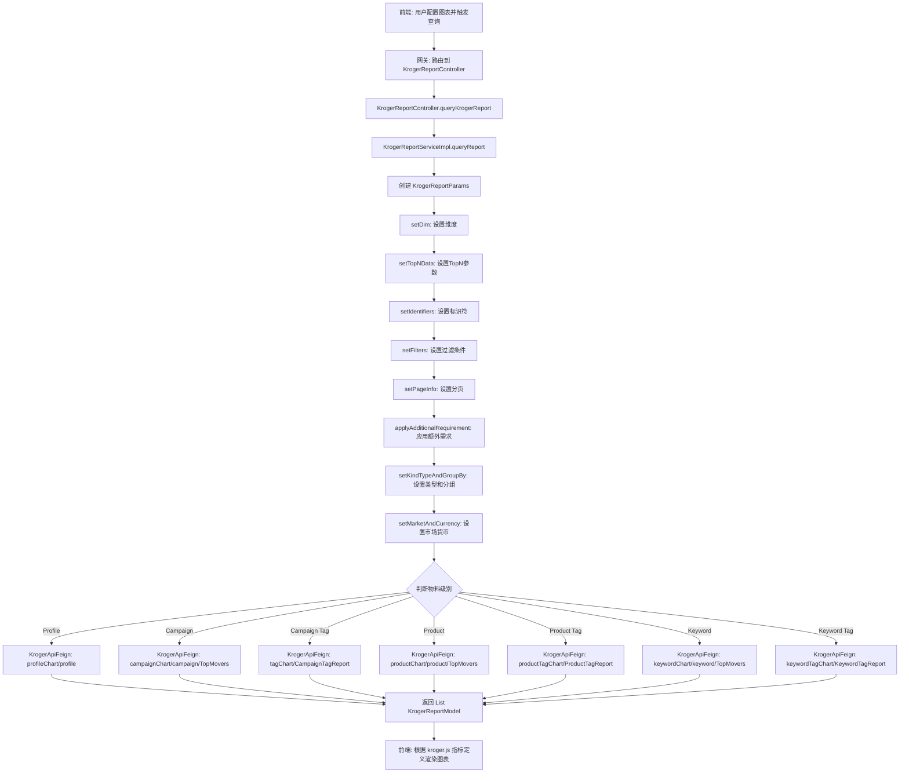
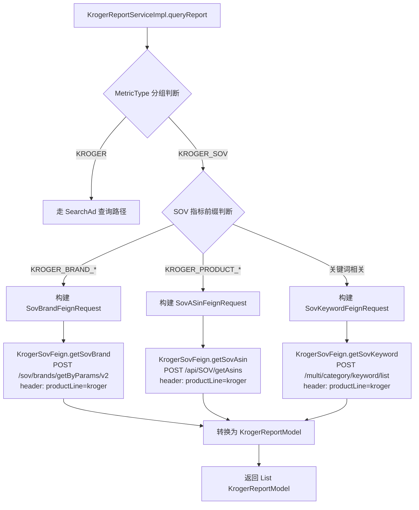
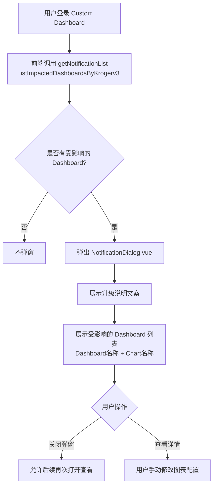

# Kroger 平台模块 功能逻辑文档

> 本文档由 document-automation 工具自动生成，基于源代码、PRD 文档和技术评审文档。
> 生成时间: 2026-04-09 10:55:40
> 准确性评分: 未验证/100

---


# Kroger 平台模块 功能逻辑文档

## 1. 模块概述

### 1.1 模块职责与定位

Kroger 平台模块是 Pacvue Custom Dashboard 系统中负责 **Kroger 广告平台数据查询与指标映射** 的专用模块。其核心职责包括：

1. **SearchAd 报表数据查询**：支持 Kroger 广告平台下 Profile、Campaign、Product、Keyword 等多个物料级别的报表数据查询，涵盖 Chart（趋势图）、List（列表）、TopMovers（变动排名）三种查询模式。
2. **SOV（Share of Voice）指标查询**：支持 Kroger 平台的品牌 SOV、产品 SOV、关键词 SOV 等搜索份额指标的查询，通过独立的 SOV 服务获取数据。
3. **指标映射与前端展示**：将后端 MetricType 枚举值映射到前端图表组件（line/bar/table/topOverview/pie），提供指标的格式化定义（小数位数、百分比、货币等）。

### 1.2 系统架构位置

```
前端 (Vue)                    Custom Dashboard 网关              Kroger 模块                    下游服务
┌──────────────┐            ┌──────────────────┐            ┌──────────────────┐          ┌──────────────────┐
│ kroger.js    │  HTTP      │  Gateway/BFF     │  Feign     │ KrogerReport     │  Feign   │ Kroger Ad API    │
│ 指标定义      │ ────────→ │  路由分发         │ ────────→ │ Controller       │ ───────→ │ (KrogerApiFeign) │
│ store.js     │            │                  │            │ ServiceImpl      │          │                  │
│ NotifyDialog │            │                  │            │                  │  Feign   │ SOV Service      │
└──────────────┘            └──────────────────┘            └──────────────────┘ ───────→ │ (KrogerSovFeign) │
                                                                                          └──────────────────┘
```

**上游**：Custom Dashboard 前端通过网关调用本模块暴露的 Feign 接口。

**下游**：
- **KrogerApiFeign**：Kroger 广告数据服务，提供各物料级别的 Chart/List/TopMovers 报表 API。
- **KrogerSovFeign**：SOV 数据服务（sov-service），提供品牌/关键词/ASIN 的搜索份额数据，通过 `productLine=kroger` header 区分平台。

### 1.3 涉及的后端模块与前端组件

**后端模块（Maven）**：
- `custom-dashboard-kroger`：Kroger 平台的核心业务模块，包含 Controller、Service、DTO 等。
- `custom-dashboard-feign`：Feign 接口定义模块，包含 `KrogerReportFeign`、`KrogerApiFeign`、`KrogerSovFeign` 等接口定义。
- `custom-dashboard-base`：基础模块，包含 `BaseRequest`、`MetricType` 枚举、`MetricMapping` 等公共类。

**前端组件**：
- `metricsList/kroger.js`：Kroger 指标定义文件，包含 SearchAd 和 SOV 两大分组的指标配置。
- `dialog/NotificationDialog.vue`：Kroger V3 API 升级通知弹窗组件。
- `store.js`：Vuex Store，其中 `getProductData` 方法对 Kroger 有特殊处理（使用 `upc` 作为 `tagId`）。
- `api/index.js`：API 调用层，包含 `getNotificationList`（`listImpactedDashboardsByKrogerv3`）、`getRetailer`、`getUserAccessiblePlatforms` 等接口调用。

### 1.4 部署方式

本模块作为独立的 Spring Boot 微服务部署，通过 Feign 接口对外暴露服务。`KrogerReportController` 实现 `KrogerReportFeign` 接口，使得其他微服务可以通过 Feign 客户端调用本模块的报表查询能力。服务实例名为 `custom-dashboard-kroger`（Kroger V3 改造后新增 `krogerv3` 实例，**待确认**具体部署拆分方式）。

---

## 2. 用户视角

### 2.1 功能场景总览

基于 PRD 文档，Kroger 平台模块涉及以下核心功能场景：

| 场景编号 | 场景名称 | 来源 |
|---------|---------|------|
| S1 | Kroger SearchAd 报表图表配置与查看 | 基础功能 |
| S2 | Kroger SOV 指标配置与查看 | CP-39054 (26Q1-S4) |
| S3 | Kroger V3 API 升级改造与通知 | CP-44257 (26Q1-S4) |
| S4 | Cross-Retailer 场景下 Kroger 数据展示 | 基础功能 + V3 改造 |

### 2.2 场景 S1：Kroger SearchAd 报表图表配置与查看

**用户操作流程**：

1. **进入 Dashboard 编辑页面**：用户在 Custom Dashboard 中创建或编辑一个 Dashboard。
2. **添加/编辑图表**：用户点击添加图表，选择图表类型（Overview / Trend / Comparison / Pie / Table）。
3. **选择平台**：在 Retailer 选择器中选择 "Kroger"。
4. **选择物料级别**：根据图表类型，选择物料级别：
   - Profile（Account 级别）
   - Campaign
   - Campaign Tag
   - Product
   - Product Tag
   - Keyword
   - Keyword Tag
5. **选择指标**：从 Kroger SearchAd 指标列表中选择一个或多个指标（如 Impression、Clicks、Spend、CPC、ACOS Click 等）。
6. **配置筛选条件**：设置日期范围、Profile 筛选、Campaign 筛选等。
7. **保存并查看**：保存图表配置后，系统自动调用后端 API 获取数据并渲染图表。

**UI 交互要点**：
- 指标选择器根据 `kroger.js` 中的定义展示可选指标，每个指标有 `formType`（格式类型：货币/百分比/数值）、`compareType`（对比类型）、`supportChart`（支持的图表类型）、`decimalPlaces`（小数位数）等属性。
- 对比类型的指标不支持添加到 Pie 图表中（PRD 明确要求）。

### 2.3 场景 S2：Kroger SOV 指标配置与查看

**背景**：26Q1-S4 迭代中，为 Kroger 新增 SOV（Share of Voice）相关指标，覆盖 Brand/Keyword 和 ASIN/Product 两个物料维度。

**用户操作流程**：

1. **选择平台与物料级别**：在图表配置中选择 Kroger 平台。
2. **选择 SOV 指标分组**：指标列表中出现 SOV 分组，包含：
   - **Brand/Keyword 级别指标**：Brand Total SOV、Brand Paid SOV、Brand SP SOV、Brand Top of Search SP SOV、Ads Frequency、Brand Organic SOV、Top 5/10/15 SOV、Top 5/10/15 SP SOV、Top 5/10/15 Organic SOV。
   - **ASIN/Product 级别指标**：Product Total SOV、Product SP SOV、Product Top of Search SP SOV、Rest of Search SP SOV、Product Organic SOV、Top 1/3/6 Frequency、Top 1/3/6 Paid Frequency、Top 1/3/6 Organic Frequency、Avg. Position、Avg. Paid Position、Avg. Organic Position、Page 1 Frequency、Position 1-5 Frequency 等。
3. **配置 Keyword 筛选**：SOV 指标需要增加 Keyword 作为筛选条件（PRD 要求）。
4. **选择排序方式**：只能在 Customize 模式下 sort by，Top Rank 和 Top Mover 模式不支持 sort by。
5. **查看图表**：支持 Overview / Table / Trend / Pie / Comparison 五种图表类型。

**业务范围**：
- 业务线：HQ
- 平台：Kroger（同时也支持 Doordash、Sam's Club，但本文档聚焦 Kroger）
- SOV 数据全部汇总到 US 市场（技术评审确认）

### 2.4 场景 S3：Kroger V3 API 升级改造与通知

**背景**：Kroger 平台进行 API V3 升级，核心变更是物料层级的重新定义：
- **旧版**：Profile 对应 Kroger 的 Advertiser。
- **新版**：原 Profile 改名为 Advertiser；新增 Profile 对应 Kroger 的 Account（Ad Account）层级。
- **关系**：Account : Advertiser = m : n（一个 Advertiser 不会在多个 Account 下）。

**用户操作流程**：

1. **登录 Custom Dashboard**：用户进入首页。
2. **弹窗通知**：系统检测用户是否有受影响的 Dashboard，如果有则弹出通知弹窗。
3. **弹窗内容**（基于 Figma 设计稿）：
   - 标题区域
   - 正文："Dear User, due to Kroger's API upgrade, the Custom Dashboard has the following changes: The former material level 'Profile' moves to Kroger's 'Advertiser'. The new 'Profile' refers to Kroger's material 'Account'. Data clears when users select 'Profile' at the material level in cross retailer."
   - 受影响的 Dashboard 列表："Impacted dashboards listed below: (Total: N)"，列出 Dashboard 名称和 Chart 名称。
4. **用户操作**：用户可以关闭弹窗，之后可以再次打开查看（常态化通知）。
5. **手动修改**：用户需要自行修改受影响的图表配置，将物料级别从旧的 Profile 调整为新的 Advertiser 或 Profile。

**前端实现**：
- `NotificationDialog.vue`：弹窗组件，展示升级通知和受影响的 Dashboard 列表。
- `api/index.js` 中的 `getNotificationList` 调用 `listImpactedDashboardsByKrogerv3` 接口获取受影响的 Dashboard 列表。

### 2.5 场景 S4：Cross-Retailer 场景

在 Cross-Retailer 模式下，用户可以同时查看多个平台的数据。Kroger V3 改造后：
- 当用户在 Cross-Retailer 中选择 Profile 物料级别时，Kroger 的数据会被清空（因为 Profile 含义已变更）。
- Custom Filter Setting 中的 Profile 筛选需要对应修改。

---

## 3. 核心 API

### 3.1 对外暴露的 Feign 接口

#### 3.1.1 查询 Kroger 报表数据

- **路径**: `POST`（具体路径由 `KrogerReportFeign` 接口定义，**待确认**完整 URL）
- **参数**: `KrogerReportRequest`（继承自 `BaseRequest`）
  - 继承自 `BaseRequest` 的通用字段：日期范围、Profile 列表、市场、货币等
  - Kroger 特有字段：**待确认**（`KrogerReportRequest` 类体中未展示具体字段）
- **返回值**: `List<KrogerReportModel>`
- **说明**: 统一入口，根据请求中的物料级别和查询模式，分派到不同的下游 API 端点。

**Controller 实现**：
```java
@RestController
public class KrogerReportController implements KrogerReportFeign {
    @Autowired
    private KrogerReportService krogerReportService;

    @Override
    public List<KrogerReportModel> queryKrogerReport(KrogerReportRequest reportParams) {
        return krogerReportService.queryReport(reportParams);
    }
}
```

### 3.2 下游 Feign 依赖：KrogerApiFeign

KrogerApiFeign 提供 Kroger 广告数据服务的全部报表端点，按物料级别分组：

#### Profile 级别

| 端点 | 方法 | 说明 |
|------|------|------|
| `/api/Report/profileChart` | POST | Profile 级别趋势图数据 |
| `/api/Report/profile` | POST | Profile 级别列表数据 |

#### Campaign 级别

| 端点 | 方法 | 说明 |
|------|------|------|
| `/api/Report/campaignChart` | POST | Campaign 趋势图数据 |
| `/api/Report/campaign` | POST | Campaign 列表数据 |
| `/customDashboard/getCampaignTopMovers` | POST | Campaign TopMovers 数据 |

#### Campaign Tag 级别

| 端点 | 方法 | 说明 |
|------|------|------|
| `/api/Report/tagChart` | POST | Campaign Tag 趋势图数据 |
| `/customDashboard/getCampaignTagReport` | POST | Campaign Tag 列表数据 |

#### Product 级别

| 端点 | 方法 | 说明 |
|------|------|------|
| `/api/Report/productChart` | POST | Product 趋势图数据 |
| `/api/Report/product` | POST | Product 列表数据 |
| `/customDashboard/getProductTopMovers` | POST | Product TopMovers 数据 |

#### Product Tag 级别

| 端点 | 方法 | 说明 |
|------|------|------|
| `/api/Report/productTagChart` | POST | Product Tag 趋势图数据 |
| `/customDashboard/getProductTagReport` | POST | Product Tag 列表数据 |

#### Keyword 级别

| 端点 | 方法 | 说明 |
|------|------|------|
| `/api/Report/keywordChart` | POST | Keyword 趋势图数据 |
| `/api/Report/keyword` | POST | Keyword 列表数据 |
| `/customDashboard/getKeywordTopMovers` | POST | Keyword TopMovers 数据 |

#### Keyword Tag 级别

| 端点 | 方法 | 说明 |
|------|------|------|
| `/api/Report/keywordTagChart` | POST | Keyword Tag 趋势图数据 |
| `/customDashboard/getKeywordTagReport` | POST | Keyword Tag 列表数据 |

**所有端点的请求参数均为 `KrogerReportParams`，返回值为 `BaseResponse<PageResponse<KrogerReportModel>>` 或 `BaseResponse<ListResponse<KrogerReportModel>>`。**

### 3.3 下游 Feign 依赖：KrogerSovFeign

| 端点 | 方法 | Header | 说明 |
|------|------|--------|------|
| `/sov/brands/getByParams/v2` | POST | `productLine=kroger` | 查询品牌 SOV 数据，返回 `BaseResponse<BrandInfo>` |
| `/api/SOV/getAsins` | POST | `productLine=kroger` | 查询 ASIN SOV 数据，返回 `BaseResponse<List<String>>` |
| `/multi/category/keyword/list` | POST | `productLine=kroger` | 查询关键词列表，返回 `BaseResponse<List<SovKeywordResp>>` |

### 3.4 前端 API 调用

在 `api/index.js` 中定义的相关接口：

| 前端方法 | 后端接口 | 说明 |
|---------|---------|------|
| `getNotificationList` | `listImpactedDashboardsByKrogerv3` | 获取受 Kroger V3 升级影响的 Dashboard 列表 |
| `getRetailer` | `data/getRetailer` | 获取零售商列表（包含 Kroger） |
| `getUserAccessiblePlatforms` | `data/getUserAccessiblePlatforms` | 获取用户可访问的平台列表 |

---

## 4. 核心业务流程

### 4.1 SearchAd 报表查询主流程

#### 4.1.1 流程详细描述

**步骤 1：前端发起请求**

前端根据用户配置的图表设置（ChartSetting），构建请求参数并通过 Custom Dashboard 网关调用 `KrogerReportController.queryKrogerReport(KrogerReportRequest)`。请求中包含：
- 日期范围（startDate、endDate）
- 物料级别（Profile/Campaign/Product/Keyword 及其 Tag 变体）
- 查询模式（Chart/List/TopMovers）
- 指标列表
- 筛选条件（Profile ID、Campaign ID 等）
- 分页信息
- 目标市场和货币

**步骤 2：Controller 接收请求**

`KrogerReportController` 实现 `KrogerReportFeign` 接口，接收 `KrogerReportRequest` 参数，直接委托给 `KrogerReportService.queryReport()` 方法。

**步骤 3：参数转换（DTO 转换模式）**

`KrogerReportServiceImpl.queryReport()` 方法将 `KrogerReportRequest` 逐步转换为 `KrogerReportParams`，转换过程包含以下子步骤：

1. **`new KrogerReportParams()`**：创建空的参数对象。
2. **`setDim(params, request)`**：设置维度信息，根据物料级别确定查询维度（如按日/周/月聚合）。
3. **`setTopNData(request)`**：设置 TopN 数据参数（用于 TopMovers 查询模式）。
4. **`setIdentifiers(params, request)`**：设置标识符，如 Profile ID、Campaign ID、Product ID、Keyword ID 等。
5. **`setFilters(params, request)`**：设置过滤条件。
6. **`setPageInfo(params, request)`**：设置分页信息（页码、每页条数）。
7. **`applyAdditionalRequirement(request, params)`**：应用额外的需求配置（基于 `Requirement` 对象）。
8. **`setKindTypeAndGroupBy(params, request)`**：设置查询类型和分组方式。
9. **`setMarketAndCurrency(params, request)`**：设置市场和货币信息。货币转换逻辑使用 `commonParamsMap` 映射，默认为 "USD"。

```java
params.setToMarket(request.getToMarket());
params.setToCurrencyCode(commonParamsMap.getOrDefault(request.getToMarket(), "USD"));
params.setCoverCurrencyCode(commonParamsMap.getOrDefault(request.getToMarket(), "USD"));
```

**步骤 4：策略分派（根据物料级别调用不同端点）**

根据请求中的物料级别和查询模式，`KrogerReportServiceImpl` 选择调用 `KrogerApiFeign` 的不同端点：

| 物料级别 | Chart 端点 | List 端点 | TopMovers 端点 |
|---------|-----------|----------|---------------|
| Profile | `/api/Report/profileChart` | `/api/Report/profile` | 不支持 |
| Campaign | `/api/Report/campaignChart` | `/api/Report/campaign` | `/customDashboard/getCampaignTopMovers` |
| Campaign Tag | `/api/Report/tagChart` | `/customDashboard/getCampaignTagReport` | 不支持 |
| Product | `/api/Report/productChart` | `/api/Report/product` | `/customDashboard/getProductTopMovers` |
| Product Tag | `/api/Report/productTagChart` | `/customDashboard/getProductTagReport` | 不支持 |
| Keyword | `/api/Report/keywordChart` | `/api/Report/keyword` | `/customDashboard/getKeywordTopMovers` |
| Keyword Tag | `/api/Report/keywordTagChart` | `/customDashboard/getKeywordTagReport` | 不支持 |

**步骤 5：调用下游服务**

通过 `KrogerApiFeign` 发起 HTTP POST 请求到 Kroger 广告数据服务，传入 `KrogerReportParams`。

**步骤 6：返回结果**

下游服务返回 `BaseResponse<PageResponse<KrogerReportModel>>` 或 `BaseResponse<ListResponse<KrogerReportModel>>`，`KrogerReportServiceImpl` 提取数据并返回 `List<KrogerReportModel>`。

**步骤 7：前端渲染**

前端根据 `kroger.js` 中的指标定义，将返回的数据渲染为对应的图表类型（line/bar/table/topOverview/pie）。

#### 4.1.2 流程图



### 4.2 SOV 指标查询流程

#### 4.2.1 流程详细描述

SOV 指标的查询路径与 SearchAd 不同，走的是 `KrogerSovFeign` 而非 `KrogerApiFeign`。

**步骤 1：指标类型判断**

`KrogerReportServiceImpl` 在处理请求时，根据 `MetricType` 枚举的分组判断当前指标属于 `KROGER` 还是 `KROGER_SOV`。如果是 `KROGER_SOV` 分组的指标，则走 SOV 查询路径。

**步骤 2：确定 SOV 查询类型**

根据指标前缀确定查询类型：
- `KROGER_BRAND_*` 前缀：调用品牌 SOV 接口 `/sov/brands/getByParams/v2`
- `KROGER_PRODUCT_*` 前缀：调用 ASIN SOV 接口 `/api/SOV/getAsins`
- 关键词相关：调用关键词列表接口 `/multi/category/keyword/list`

**步骤 3：构建 SOV 请求参数**

根据不同的 SOV 查询类型，构建对应的请求对象：
- `SovBrandFeignRequest`：品牌 SOV 查询参数
- `SovASinFeignRequest`：ASIN SOV 查询参数
- `SovKeywordFeignRequest`：关键词查询参数

**步骤 4：调用 KrogerSovFeign**

所有 SOV 请求都携带 `productLine=kroger` header，以区分不同平台的 SOV 数据。

**步骤 5：数据转换与返回**

将 SOV 服务返回的数据转换为 `KrogerReportModel` 格式，统一返回给前端。

#### 4.2.2 流程图



### 4.3 Kroger V3 升级通知流程



### 4.4 前端 Product 数据特殊处理

在 `store.js` 的 `getProductData` 方法中，Kroger 平台有特殊处理逻辑：使用 `upc` 作为 `tagId`。这是因为 Kroger 平台的产品标识体系与 Amazon 等平台不同，Kroger 使用 UPC（Universal Product Code）而非 ASIN 作为产品唯一标识。

---

## 5. 数据模型

### 5.1 数据库表结构

基于技术评审文档中的新旧表结构映射：

| 表名 | 说明 | 旧版对应 | 关键字段（推测） |
|------|------|---------|----------------|
| `campaign` | Kroger Campaign 表 | campaign | campaign_id, profile_id, name, status, budget 等 |
| `ad_group_keyword` | Kroger Keyword 表 | ad_group_keyword | keyword_id, ad_group_id, keyword_text, match_type, bid 等 |
| `ad_group_product` | Kroger Product 表 | ad_group_product | product_id, ad_group_id, upc, status 等 |
| `profile` | Kroger Profile/Account 表 | profile | profile_id, account_id, advertiser_id, name 等 |

> **注意**：V3 改造后，`profile` 表的含义发生变化。旧版 Profile 对应 Advertiser，新版 Profile 对应 Account。具体字段结构**待确认**。

### 5.2 核心 DTO/VO

#### 5.2.1 KrogerReportRequest

```java
package com.pacvue.feign.dto.request.kroger;

@EqualsAndHashCode
@Data
public class KrogerReportRequest extends BaseRequest {
    // 继承自 BaseRequest 的字段：
    // - startDate, endDate: 日期范围
    // - profileIds: Profile ID 列表
    // - toMarket: 目标市场
    // - 其他通用字段
    
    // Kroger 特有字段（待确认具体内容）
}
```

#### 5.2.2 KrogerReportParams

```java
package com.pacvue.kroger.entity.request;

@Data
public class KrogerReportParams {
    // 由 KrogerReportServiceImpl 通过多个 set 方法逐步构建：
    // - dim: 维度信息
    // - filters: 过滤条件
    // - pageInfo: 分页信息（页码、每页条数）
    // - toMarket: 目标市场
    // - toCurrencyCode: 目标货币代码（默认 "USD"）
    // - coverCurrencyCode: 覆盖货币代码（默认 "USD"）
    // - kindType: 查询类型
    // - groupBy: 分组方式
    // - identifiers: 标识符（Profile ID、Campaign ID 等）
    // 具体字段列表待确认
}
```

#### 5.2.3 KrogerReportModel

```java
package com.pacvue.feign.dto.response.kroger;

@Data
@NoArgsConstructor
public class KrogerReportModel extends KrogerReportDataBase {
    // 继承自 KrogerReportDataBase 的基础字段
    // 使用 @IndicatorField 注解标记指标字段
    // 使用 @JsonAlias/@JsonProperty 处理 JSON 序列化
    // 包含各种广告指标的 BigDecimal 字段
    // 具体字段列表待确认
}
```

### 5.3 MetricType 枚举（KROGER 相关）

MetricType 枚举按分组组织，Kroger 相关的枚举值分为两大分组：

#### KROGER 分组（SearchAd 指标）

| 枚举值 | 分组 | 数据类型 | 说明 |
|--------|------|---------|------|
| `KROGER_IMPRESSION` | KROGER | 默认 | 展示量 |
| `KROGER_CLICKS` | KROGER | 默认 | 点击量 |
| `KROGER_CTR` | KROGER | 默认 | 点击率 |
| `KROGER_SPEND` | KROGER | 默认 | 花费 |
| `KROGER_CPC` | KROGER | 默认 | 单次点击成本 |
| `KROGER_CPA_CLICK` | KROGER | 默认 | 单次获客成本（点击归因） |
| `KROGER_CPA_VIEW` | KROGER | 默认 | 单次获客成本（浏览归因） |
| `KROGER_CVR_CLICK` | KROGER | 默认 | 转化率（点击归因） |
| `KROGER_CVR_VIEW` | KROGER | 默认 | 转化率（浏览归因） |
| `KROGER_CPM` | KROGER | 默认 | 千次展示成本 |
| `KROGER_ACOS_CLICK` | KROGER | 默认 | 广告成本销售比（点击归因） |
| `KROGER_ACOS_VIEW` | KROGER | 默认 | 广告成本销售比（浏览归因） |
| `KROGER_ROAS_CLICK` | KROGER | 默认 | 广告支出回报率（点击归因） |
| `KROGER_ROAS_VIEW` | KROGER | 默认 | 广告支出回报率（浏览归因） |
| `KROGER_SALES_CLICK` | KROGER | 默认 | 销售额（点击归因） |
| `KROGER_SALE_UNITS_CLICK` | KROGER | 默认 | 销售单位数（点击归因） |
| `KROGER_ORDERS_CLICK` | KROGER | 默认 | 订单数（点击归因） |
| `KROGER_ONLINE_SALES_CLICK` | KROGER | 默认 | 线上销售额（点击归因） |
| `KROGER_ONLINE_SALES_CLICK_PERCENT` | KROGER | 默认 | 线上销售额占比（点击归因） |
| `KROGER_ONLINE_SALE_UNITS_CLICK` | KROGER | 默认 | 线上销售单位数（点击归因） |
| `KROGER_ONLINE_ORDERS_CLICK` | KROGER | 默认 | 线上订单数（点击归因） |
| `KROGER_ASP_CLICK` | KROGER | 默认 | 平均售价（点击归因） |
| `KROGER_SALES_VIEW` | KROGER | 默认 | 销售额（浏览归因） |
| `KROGER_SALE_UNITS_VIEW` | KROGER | 默认 | 销售单位数（浏览归因） |
| `KROGER_ORDERS_VIEW` | KROGER | 默认 | 订单数（浏览归因） |
| `KROGER_ONLINE_SALES_VIEW` | KROGER | 默认 | 线上销售额（浏览归因） |
| `KROGER_ONLINE_SALES_VIEW_PERCENT` | KROGER | 默认 | 线上销售额占比（浏览归因） |
| `KROGER_ONLINE_SALES_UNITS_VIEW` | KROGER | 默认 | 线上销售单位数（浏览归因） |
| `KROGER_ONLINE_ORDERS_VIEW` | KROGER | 默认 | 线上订单数（浏览归因） |
| `KROGER_ASP_VIEW` | KROGER | 默认 | 平均售价（浏览归因） |
| `KROGER_AOV` | KROGER | 默认 | 平均订单价值 |
| `KROGER_AOV_CLICK` | KROGER | 默认 | 平均订单价值（点击归因） |

#### KROGER_SOV 分组（SOV 指标）

**Brand 级别 SOV 指标**：

| 枚举值 | 分组 | 数据类型 | 说明 |
|--------|------|---------|------|
| `KROGER_BRAND_TOTAL_SOV` | KROGER_SOV | 默认 | 品牌总 SOV |
| `KROGER_BRAND_PAID_SOV` | KROGER_SOV | 默认 | 品牌付费 SOV |
| `KROGER_BRAND_SP_SOV` | KROGER_SOV | 默认 | 品牌 SP SOV |
| `KROGER_BRAND_TOP_OF_SEARCH_SP_SOV` | KROGER_SOV | PERCENT | 品牌搜索顶部 SP SOV |
| `KROGER_BRAND_ADS_FREQUENCY` | KROGER_SOV | UNIT_COUNT | 品牌广告频次 |
| `KROGER_BRAND_ORGANIC_SOV` | KROGER_SOV | 默认 | 品牌自然 SOV |
| `KROGER_BRAND_TOP_5_SOV` | KROGER_SOV | PERCENT | 品牌 Top 5 SOV |
| `KROGER_BRAND_TOP_10_SOV` | KROGER_SOV | PERCENT | 品牌 Top 10 SOV |
| `KROGER_BRAND_TOP_15_SOV` | KROGER_SOV | PERCENT | 品牌 Top 15 SOV |
| `KROGER_BRAND_TOP_5_SP_SOV` | KROGER_SOV | PERCENT | 品牌 Top 5 SP SOV |
| `KROGER_BRAND_TOP_10_SP_SOV` | KROGER_SOV | PERCENT | 品牌 Top 10 SP SOV |
| `KROGER_BRAND_TOP_15_SP_SOV` | KROGER_SOV | PERCENT | 品牌 Top 15 SP SOV |
| `KROGER_BRAND_TOP_5_ORGANIC_SOV` | KROGER_SOV | PERCENT | 品牌 Top 5 自然 SOV |
| `KROGER_BRAND_TOP_10_ORGANIC_SOV` | KROGER_SOV | PERCENT | 品牌 Top 10 自然 SOV |
| `KROGER_BRAND_TOP_15_ORGANIC_SOV` | KROGER_SOV | PERCENT | 品牌 Top 15 自然 SOV |

**Product 级别 SOV 指标**：

| 枚举值 | 分组 | 数据类型 | 说明 |
|--------|------|---------|------|
| `KROGER_PRODUCT_TOTAL_SOV` | KROGER_SOV | 默认 | 产品总 SOV |
| `KROGER_PRODUCT_SP_SOV` | KROGER_SOV | 默认 | 产品 SP SOV |
| `KROGER_PRODUCT_TOP_OF_SEARCH_SP_SOV` | KROGER_SOV | PERCENT | 产品搜索顶部 SP SOV |
| `KROGER_PRODUCT_REST_OF_SEARCH_SP_SOV` | KROGER_SOV | 默认 | 产品搜索其余位置 SP SOV |
| `KROGER_PRODUCT_ORGANIC_SOV` | KROGER_SOV | 默认 | 产品自然 SOV |
| `KROGER_PRODUCT_PAGE_1_FREQUENCY` | KROGER_SOV | PERCENT | 产品第一页频次 |
| `KROGER_PRODUCT_TOP_1_FREQUENCY` | KROGER_SOV | PERCENT | 产品 Top 1 频次 |
| `KROGER_PRODUCT_TOP_3_FREQUENCY` | KROGER_SOV | PERCENT | 产品 Top 3 频次 |
| `KROGER_PRODUCT_TOP_6_FREQUENCY` | KROGER_SOV | PERCENT | 产品 Top 6 频次 |
| `KROGER_PRODUCT_TOP_1_PAID_FREQUENCY` | KROGER_SOV | PERCENT | 产品 Top 1 付费频次 |
| `KROGER_PRODUCT_TOP_3_PAID_FREQUENCY` | KROGER_SOV | PERCENT | 产品 Top 3 付费频次 |
| `KROGER_PRODUCT_TOP_6_PAID_FREQUENCY` | KROGER_SOV | PERCENT | 产品 Top 6 付费频次 |
| `KROGER_PRODUCT_TOP_1_ORGANIC_FREQUENCY` | KROGER_SOV | PERCENT | 产品 Top 1 自然频次 |
| `KROGER_PRODUCT_TOP_3_ORGANIC_FREQUENCY` | KROGER_SOV | PERCENT | 产品 Top 3 自然频次 |
| `KROGER_PRODUCT_TOP_6_ORGANIC_FREQUENCY` | KROGER_SOV | PERCENT | 产品 Top 6 自然频次 |
| `KROGER_PRODUCT_AVG_POSITION` | KROGER_SOV | UNIT_COUNT | 产品平均位置 |
| `KROGER_PRODUCT_AVG_PAID_POSITION` | KROGER_SOV | UNIT_COUNT | 产品平均付费位置 |
| `KROGER_PRODUCT_AVG_ORGANIC_POSITION` | KROGER_SOV | UNIT_COUNT | 产品平均自然位置 |
| `KROGER_PRODUCT_POSITION_1_FREQUENCY` | KROGER_SOV | PERCENT | 产品位置 1 频次 |
| `KROGER_PRODUCT_POSITION_2_FREQUENCY` | KROGER_SOV | PERCENT | 产品位置 2 频次 |
| `KROGER_PRODUCT_POSITION_3_FREQUENCY` | KROGER_SOV | PERCENT | 产品位置 3 频次 |
| `KROGER_PRODUCT_POSITION_4_FREQUENCY` | KROGER_SOV | PERCENT | 产品位置 4 频次 |
| `KROGER_PRODUCT_POSITION_5_FREQUENCY` | KROGER_SOV | PERCENT | 产品位置 5 频次 |

> **注意**：枚举值列表在代码片段中被截断（`KROGER_PRO...`、`KROGER_PRODUCT_POS...`、`KROGER_PRODUCT_POSITION_3_FRE...`），完整列表可能还包含 Position 6 Frequency 等更多枚举值。

### 5.4 枚举数据类型说明

MetricType 枚举的第二个参数指定数据类型：
- **默认（无第二参数）**：根据指标语义自动推断（货币/数值/百分比等）
- **PERCENT**：百分比类型，前端展示时需乘以 100 并添加 % 后缀
- **UNIT_COUNT**：计数类型，展示为整数或带小数的数值

---

## 6. 平台差异

### 6.1 Kroger 与其他平台的差异

| 差异点 | Kroger | Amazon/Walmart 等 |
|--------|--------|-------------------|
| 产品标识 | UPC（Universal Product Code） | ASIN |
| SOV 服务调用 | header: `productLine=kroger` | header: `productLine=amazon` 等 |
| 归因模型 | 区分 Click 和 View 两种归因 | 各平台不同 |
| 物料层级 | Profile/Campaign/Product/Keyword + Tag 变体 | 类似但字段名不同 |
| 货币 | 默认 USD | 多市场多货币 |
| 前端 tagId | 使用 `upc` 作为 tagId | 使用 ASIN 或其他标识 |

### 6.2 Kroger 指标特色：Click vs View 归因

Kroger 平台的一大特色是几乎所有转化相关指标都区分 **Click 归因** 和 **View 归因**：

- **Click 归因**：用户点击广告后产生的转化（如 `KROGER_SALES_CLICK`、`KROGER_ACOS_CLICK`、`KROGER_ROAS_CLICK`）
- **View 归因**：用户浏览广告后产生的转化（如 `KROGER_SALES_VIEW`、`KROGER_ACOS_VIEW`、`KROGER_ROAS_VIEW`）

这种双归因模型在指标枚举中体现为成对出现的枚举值，前端 `kroger.js` 中也需要分别定义这两类指标。

### 6.3 Kroger SOV 指标与其他平台 SOV 的对比

Kroger SOV 指标的查询方式与 Criteo、Target 等平台类似，都是调用 `sov-service`，区别在于传递的 `productLine` header 不同。技术评审文档明确指出：

> "SOV Group/Brand/Keyword/ASIN 物料查询接口，以及绩效查询，参考 Criteo/Target 等，调用 sov-service，区别是传的 productLine header 不同"

### 6.4 Kroger V3 物料层级映射

| 旧版物料名 | 新版物料名 | 说明 |
|-----------|-----------|------|
| Profile | Advertiser | 旧版 Profile 在新版中改名为 Advertiser |
| （无） | Profile（Account） | 新增的 Profile 对应 Kroger 的 Account 层级 |

---

## 7. 配置与依赖

### 7.1 Feign 下游服务依赖

#### 7.1.1 KrogerApiFeign

- **服务名称**：**待确认**（可能为 `kroger-ad-service` 或类似名称）
- **功能**：Kroger 广告数据服务，提供报表查询 API
- **端点数量**：17 个（覆盖 7 个物料级别 × Chart/List/TopMovers 三种模式）
- **请求参数**：统一使用 `KrogerReportParams`
- **返回格式**：`BaseResponse<PageResponse<KrogerReportModel>>` 或 `BaseResponse<ListResponse<KrogerReportModel>>`

#### 7.1.2 KrogerSovFeign

- **服务名称**：`sov-service`（**待确认**具体服务注册名）
- **功能**：SOV 数据服务，提供品牌/关键词/ASIN 的搜索份额数据
- **特殊配置**：所有请求 header 中携带 `productLine=kroger`
- **端点**：
  - `POST /sov/brands/getByParams/v2` → `SovBrandFeignRequest` → `BaseResponse<BrandInfo>`
  - `POST /api/SOV/getAsins` → `SovASinFeignRequest` → `BaseResponse<List<String>>`
  - `POST /multi/category/keyword/list` → `SovKeywordFeignRequest` → `BaseResponse<List<SovKeywordResp>>`

#### 7.1.3 KrogerReportFeign

- **功能**：本模块对外暴露的 Feign 接口，供 Custom Dashboard 网关或其他微服务调用
- **实现类**：`KrogerReportController`
- **端点**：`queryKrogerReport(KrogerReportRequest)` → `List<KrogerReportModel>`

### 7.2 货币转换配置

`KrogerReportServiceImpl` 中使用 `commonParamsMap` 进行市场到货币代码的映射：

```java
params.setToCurrencyCode(commonParamsMap.getOrDefault(request.getToMarket(), "USD"));
params.setCoverCurrencyCode(commonParamsMap.getOrDefault(request.getToMarket(), "USD"));
```

默认货币为 USD。技术评审文档确认 SOV 数据全部汇总到 US 市场。

### 7.3 关键依赖库

从 `KrogerReportServiceImpl` 的 import 可以看出以下依赖：

| 依赖 | 用途 |
|------|------|
| `cn.hutool.core.date.LocalDateTimeUtil` | 日期时间工具 |
| `cn.hutool.core.util.ObjectUtil` | 对象工具 |
| `com.baomidou.mybatisplus.core.toolkit.CollectionUtils` | 集合工具 |
| `com.baomidou.mybatisplus.core.toolkit.ObjectUtils` | 对象工具 |
| `com.google.common.collect.Lists` | Guava 集合工具 |
| `com.pacvue.base.constatns.CustomDashboardApiConstants` | API 常量定义 |
| `com.pacvue.base.dto.chart.Requirement` | 图表需求 DTO |
| `com.pacvue.base.dto.response.BaseResponse` | 统一响应封装 |
| `com.pacvue.base.enums.core.*` | 核心枚举（MetricType 等） |
| `com.pacvue.base.enums.mapping.MetricMapping` | 指标映射工具 |

### 7.4 前端通知相关接口

| 接口 | 说明 |
|------|------|
| `listImpactedDashboardsByKrogerv3` | 获取受 Kroger V3 升级影响的 Dashboard 列表 |
| `data/getRetailer` | 获取零售商列表 |
| `data/getUserAccessiblePlatforms` | 获取用户可访问的平台列表 |

---

## 8. 版本演进

### 8.1 版本时间线

基于技术评审文档和 PRD 文档，Kroger 平台模块的主要版本演进如下：

#### 基础版本（初始）

- 支持 Kroger SearchAd 报表数据查询
- 支持 Profile/Campaign/Product/Keyword 及其 Tag 变体的 Chart/List/TopMovers 查询
- 前端 `kroger.js` 定义 SearchAd 指标
- 物料层级：Profile 对应 Kroger 的 Advertiser

#### 26Q1-S4：新增 SOV 指标（CP-39054）

- **变更内容**：
  - 为 Kroger 新增 SOV 相关指标（Brand SOV + Product SOV）
  - 新增 `KROGER_SOV` 分组的 MetricType 枚举值（约 40+ 个）
  - 集成 `KrogerSovFeign`，调用 sov-service 获取 SOV 数据
  - 前端 `kroger.js` 新增 SOV 指标分组
  - SOV 指标支持 Overview/Table/Trend/Pie/Comparison 五种图表类型
  - SOV 指标需要增加 Keyword 作为筛选条件
  - 对比类型的指标不支持添加到 Pie 图表
  - SOV 数据全部汇总到 US 市场

- **技术要点**：
  - SOV 查询参考 Criteo/Target 等平台的实现模式
  - 通过 `productLine=kroger` header 区分平台
  - 前后端枚举值定义参考指标映射文档

#### 26Q1-S4：Kroger V3 API 升级改造（CP-44257）

- **变更内容**：
  - 物料层级重新定义：旧 Profile → Advertiser，新增 Profile（Account）
  - 新旧概念映射：Account : Advertiser = m : n
  - 新增 `krogerv3` 服务实例（productLine: krogerv3）
  - Custom Dashboard 的 Custom Filter Setting 中 Profile 需要修改
  - 每个图表的物料层级中，原 Profile 变为 Advertiser，新增 Profile 对应 Account
  - Cross-Retailer 中选择 Profile 物料级别时数据清空
  - 新增升级通知弹窗（NotificationDialog.vue）
  - 通知内容包含受影响的 Dashboard 和 Chart 列表

- **技术要点**：
  - 对接人：feng.zhang
  - 新旧表结构保持一致（campaign、ad_group_keyword、ad_group_product、profile）
  - 需要在 Budget Planner 中同时支持 Kroger 和 KrogerV3（注意 V 大写）

### 8.2 待优化项与技术债务

1. **V3 迁移数据处理**：PRD 中提到"暂不自动处理数据迁移，让用户手动确认"，这意味着存在历史数据兼容性问题，后续可能需要自动迁移方案。
2. **Kroger 与 KrogerV3 并行**：技术评审提到需要同时支持 Kroger 和 KrogerV3，这可能导致代码中存在双路径逻辑，增加维护复杂度。
3. **SOV 市场汇总**：当前 SOV 数据全部汇总到 US 市场，未来如果 Kroger 扩展到其他市场，需要调整此逻辑。
4. **指标映射文档同步**：技术评审中引用了 SharePoint 上的指标映射文档，需要确保代码中的枚举值与文档保持同步。

---

## 9. 已知问题与边界情况

### 9.1 代码中的 TODO/FIXME

由于代码片段有限，未发现明确的 TODO/FIXME 注释。**待确认**完整代码中是否存在。

### 9.2 异常处理与降级策略

1. **Feign 调用失败**：当 `KrogerApiFeign` 或 `KrogerSovFeign` 调用失败时，预期会抛出 Feign 异常。具体的降级策略（如 Fallback、重试机制）**待确认**是否在 Feign 客户端配置中定义。

2. **空数据处理**：`KrogerReportServiceImpl` 中引入了 `CollectionUtils` 和 `ObjectUtils`，推测在处理下游返回数据时会进行空值检查，避免 NPE。

3. **货币转换默认值**：当 `commonParamsMap` 中找不到对应市场的货币代码时，默认使用 "USD"，这是一个安全的降级策略。

### 9.3 边界情况

1. **Profile 物料级别不支持 TopMovers**：从 API 端点列表可以看出，Profile 级别只有 Chart 和 List 两个端点，没有 TopMovers 端点。前端需要在 Profile 级别时隐藏 TopMovers 选项。

2. **Tag 物料级别不支持 TopMovers**：Campaign Tag、Product Tag、Keyword Tag 级别同样没有 TopMovers 端点，只有 Chart 和 List。

3. **SOV 指标与 Pie 图表的兼容性**：PRD 明确要求"对比类型的指标不支持加到 Pie 图表中"，前端需要在指标选择时进行校验。

4. **Cross-Retailer 场景下的 V3 兼容**：V3 改造后，Cross-Retailer 中选择 Profile 物料级别时 Kroger 数据会被清空，这是一个预期行为而非 bug，但需要在 UI 上给用户明确提示。

5. **Kroger Product 的 UPC 标识**：`store.js` 中 Kroger 使用 `upc` 作为 `tagId`，如果 UPC 数据缺失或格式不正确，可能导致产品数据无法正确关联。

6. **SOV 指标的 Sort By 限制**：SOV 指标只能在 Customize 模式下 sort by，Top Rank 和 Top Mover 模式不支持 sort by。前端需要在这些模式下禁用 sort by 选项。

7. **V3 通知弹窗的持久化**：通知弹窗允许用户关闭后再次打开查看（常态化通知），需要确保弹窗状态不会因为用户关闭而永久消失。前端可能通过 localStorage 或后端接口记录弹窗状态。

8. **并发查询**：当多个图表同时请求 Kroger 数据时，可能对下游 Kroger 广告数据服务产生较大压力。**待确认**是否有限流或并发控制机制。

---

## 附录：设计模式总结

### A.1 

---

*本文档由 AI 自动生成，如有不准确之处请以源代码为准。标注"待确认"的内容需要人工核实。*