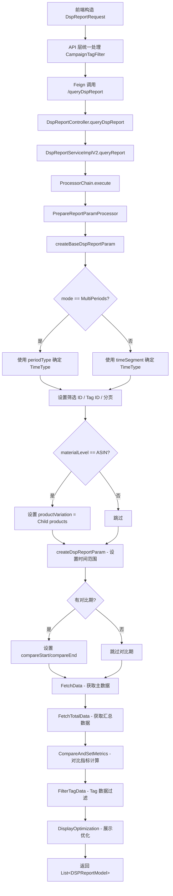
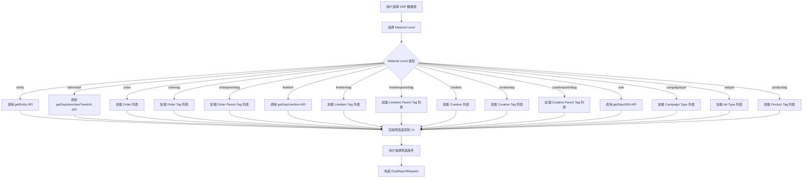
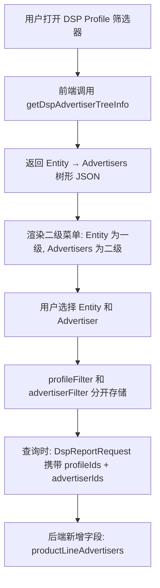

# DSP 平台模块 功能逻辑文档

> 本文档由 document-automation 工具自动生成，基于源代码、PRD 文档和技术评审文档。
> 生成时间: 2026-04-09 11:01:23
> 准确性评分: 未验证/100

---


# DSP 平台模块 功能逻辑文档

## 1. 模块概述

### 1.1 职责与定位

DSP 平台模块是 Pacvue Custom Dashboard 系统中专门负责 **Amazon DSP（Demand-Side Platform）广告数据**查询、报表生成与指标映射的核心平台层模块。该模块为 Custom Dashboard 的各类图表组件（Trend Chart、Comparison Chart、Pie Chart、Table、Top Overview）提供 DSP 维度的广告绩效数据支撑。

其核心职责包括：

1. **多维度物料筛选**：支持 Entity、Advertiser、Order、LineItem、Creative、ASIN、以及各层级 Tag（OrderTag、LineItemTag、CreativeTag、OrderParentTag、LineItemParentTag、CreativeParentTag、ProductTag）等多种物料维度的数据筛选与聚合。
2. **报表数据查询**：通过统一的 `/queryDspReport` 接口，接收前端构造的查询请求，经过处理器链编排后调用下游 DSP 数据服务获取报表数据。
3. **指标映射**：通过 `@IndicatorMethod` 注解声明式地定义 DSP 平台支持的所有指标类型（MetricType）与物料维度（MetricScopeType）的映射关系，涵盖 100+ 种指标。
4. **数据后处理**：包括对比指标计算（CompareAndSetMetrics）、Tag 数据过滤（FilterTagData）、展示优化（DisplayOptimization）等。

### 1.2 系统架构位置

```
┌─────────────────────────────────────────────────────────┐
│                    前端 (Vue)                             │
│  filter.js / store.js / api/index.js                     │
│  (物料筛选、Entity数据管理、API调用)                       │
└──────────────────────┬──────────────────────────────────┘
                       │ HTTP POST
                       ▼
┌─────────────────────────────────────────────────────────┐
│              API 层 (custom-dashboard-api)                │
│  统一处理 CampaignTagFilter、chart内置条件等              │
└──────────────────────┬──────────────────────────────────┘
                       │ Feign 调用
                       ▼
┌─────────────────────────────────────────────────────────┐
│          DSP 平台层 (custom-dashboard-dsp)               │
│  DspReportController → DspReportServiceImplV2            │
│  → ProcessorChain → PrepareReportParamProcessor          │
│  → FetchData/FetchTotalData → 后处理器                    │
└──────────────────────┬──────────────────────────────────┘
                       │ Feign / 内部调用
                       ▼
┌─────────────────────────────────────────────────────────┐
│            DSP 下游数据服务                               │
│  (Amazon DSP API 数据聚合服务)                            │
└─────────────────────────────────────────────────────────┘
```

**上游**：custom-dashboard-api（API 网关层），通过 Feign 声明式调用本模块。
**下游**：DSP 下游数据服务，提供 Entity/Advertiser/Order/LineItem/Creative/ASIN 等维度的原始报表数据。

### 1.3 涉及的后端模块与前端组件

**后端 Maven 模块**：`custom-dashboard-dsp`

**核心后端类**：

| 类名 | 包路径 | 职责 |
|---|---|---|
| `DspReportController` | `com.pacvue.dsp.controller`（**待确认**） | REST 控制器，实现 `DSPReportFeign` 接口 |
| `DspReportServiceImplV2` | `com.pacvue.dsp.service.impl`（**待确认**） | 报表查询核心实现，编排处理器链 |
| `DspReportService` | `com.pacvue.dsp.service` | 报表服务接口 |
| `DspReportHelper` | `com.pacvue.dsp.processor` | 工具类，提供时间类型判断、ClientId获取、分页构建等静态方法 |
| `PrepareReportParamProcessor` | `com.pacvue.dsp.processor`（**待确认**） | 处理器链中的参数准备处理器 |
| `DSPReportFeign` | Feign 客户端包 | 声明式 Feign 接口，定义 `/queryDspReport` 端点 |
| `DspReportRequest` | `com.pacvue.feign.dto.request.dsp` | 请求 DTO |
| `DSPReportModel` | `com.pacvue.feign.dto.response.dsp` | 响应 DTO |
| `CampaignTag` | `com.pacvue.dsp.entity` | 数据库实体，ActiveRecord 模式 |
| `PageInfo` | `com.pacvue.dsp.entity.request` | 分页信息 |

**前端组件**：

| 文件 | 职责 |
|---|---|
| `api/index.js` | 定义 DSP 相关 API 调用：`getDspASIN`、`getEntity`、`getDspLineItem`、`getOrder`、`getDspAdvertiserTreeInfo`、`getShareDspAdvertiserTreeInfo` |
| `store.js` | 管理 DSP Entity/Profile 数据及 `profileIds`，提供 `getEntityData` action |
| `public/filter.js` | `handleDSPTagOptions` 方法，负责 DSP 各物料维度筛选项的加载 |

### 1.4 部署方式

DSP 平台模块作为独立的 Spring Boot 微服务部署，服务名为 `custom-dashboard-dsp`，通过 Spring Cloud Feign 被上游 API 层调用。Feign 客户端配置中服务名通过 `${feign.client.custom-dashboard-dsp:custom-dashboard-dsp}` 属性注入，支持通过配置覆盖。

---

## 2. 用户视角

### 2.1 功能场景总览

基于 PRD 文档和技术评审文档，DSP 平台模块支持以下核心功能场景：

| 场景 | 版本 | 描述 |
|---|---|---|
| DSP 数据源接入 | V1.2 | Custom Dashboard 新增 DSP 数据源，支持除 WhiteBoard 和 Stacked Bar Chart 外的所有图表类型 |
| DSP 物料维度筛选 | V1.2+ | 支持 Entity/Advertiser/Order/LineItem/Creative/ASIN/各级Tag 的多维度筛选 |
| DSP ASIN 按 Product Tag 筛选 | 25Q4-S1 | DSP ASIN 物料支持按 Product Tag 进行筛选 |
| DSP ASIN 按 Advertiser 筛选 | 25Q4-S4 | DSP ASIN 物料支持按 Advertiser 进行筛选 |
| DSP 数据源筛选加入 Advertiser 层级 | 25Q4-S6 | DSP 下 Profile 显示按 Entity → Advertisers 二级菜单方式，存储为 profileFilter + advertiserFilter 分开存储 |
| CampaignTagFilter 支持 | V2.8 | API 层统一处理 CampaignTagFilter 字段，DSP 平台层根据物料是否与 OrderTags 产生联动决定是否传递 OrderTags 参数 |
| 接入 DSP 的 Share Parent Tag | 26Q1-S6 | DSP 平台支持 Share Parent Tag 功能，Custom Dashboard 接入 |

### 2.2 用户操作流程

#### 场景一：创建/编辑包含 DSP 数据源的图表

**前提条件**：用户账号下有 Enable 状态的 DSP 类型 Profile（参见 Figma 设计稿说明）。

**步骤 1 — 选择数据源**：
用户在创建/编辑图表时，在数据源选择区域看到 "DSP" 选项。只有当用户拥有 Enable 状态的 DSP Profile 时，DSP 选项才会出现。

**步骤 2 — 选择 Material Level（物料维度）**：
用户选择 DSP 数据源后，Material Level 下拉框展示可选的物料维度：
- Entity
- Advertiser
- Order / Order Tag / Order Parent Tag
- LineItem / LineItem Tag / LineItem Parent Tag
- Creative / Creative Tag / Creative Parent Tag
- ASIN
- Campaign Type / Ad Type
- Filter-Linked Order（查 Order 维度，支持 Advertiser 和 Order Tag 联动筛选）
- Amazon Channel

**步骤 3 — 配置筛选条件**：
根据所选 Material Level，前端通过 `filter.js` 中的 `handleDSPTagOptions` 方法动态加载对应的筛选选项。筛选项加载逻辑覆盖以下维度：
- `entity`：调用 `getEntity` API 获取 Entity 列表
- `advertiser`：调用 `getDspAdvertiserTreeInfo` 或 `getShareDspAdvertiserTreeInfo` 获取 Advertiser 树形结构
- `order` / `ordertag` / `orderparenttag`：获取 Order 及其 Tag 数据
- `lineitem` / `lineitemtag` / `lineitemparenttag`：获取 LineItem 及其 Tag 数据
- `creative` / `creativetag` / `creativeparenttag`：获取 Creative 及其 Tag 数据
- `asin`：调用 `getDspASIN` 获取 ASIN 列表
- `campaigntype` / `adtype`：获取 Campaign 类型和广告类型
- `producttag`：获取 Product Tag 数据

**步骤 4 — 选择指标（Select Metric）**：
选择不同的数据源后，Select Metric 区域跟随所选数据源变化（参见 Figma 设计稿说明）。DSP 支持的指标包括但不限于：TotalCost、Impressions、ClickThroughs、DSP_Sales、DSP_ROAS、DPV、ATC、UnitsSold、Purchase 等 100+ 种指标。

**步骤 5 — 设置时间范围与对比**：
用户设置 startDate/endDate 作为主时间范围，可选设置 previousStartDate/previousEndDate 作为对比时间范围。支持多种时间粒度（TimeSegment）：Daily、Weekly、Monthly 等。

**步骤 6 — 保存并查看**：
前端构造 `DspReportRequest` 对象，发送 POST 请求到 `/queryDspReport`，获取报表数据后渲染到对应图表组件。

#### 场景二：DSP Advertiser 层级筛选（25Q4-S6）

**步骤 1**：用户在 DSP 数据源下查看 Profile 筛选器，显示为 Entity → Advertisers 的二级菜单结构。

**步骤 2**：前端调用 `getDspAdvertiserTreeInfo` 接口获取树形结构数据（JSON 树结构）。

**步骤 3**：用户选择特定的 Entity 和 Advertiser，系统将 profileFilter 和 advertiserFilter 分开存储。

**步骤 4**：查询时，`DspReportRequest` 中同时携带 `profileIds` 和 `advertiserIds`，后端据此进行数据筛选。

#### 场景三：DSP ASIN 按 Product Tag 筛选（25Q4-S1）

**步骤 1**：用户选择 Material Level 为 ASIN。

**步骤 2**：在筛选条件中出现 Product Tag 选项。

**步骤 3**：用户选择特定的 Product Tag，前端将 `asinTagIds` 传入请求。

**步骤 4**：后端 `/getASINList` 接口支持输入 `profileIds`、`advertiserIds`、`asinTagIds`、`asin`，且支持查询结果与 `selectedAsins` 做合并。

#### 场景四：Top Overview 中的 DSP Section

**步骤 1**：用户在 Top Overview 设置页面选择 Section Type。

**步骤 2**：根据所选数量，下方出现 Section Name 设置区域。

**步骤 3**：每个 Section 可单独设置指标（Select Metric），也可点击 "Bulk Setting" 批量设置相同指标。

**步骤 4**：不同 Section 支持不同的数据源，DSP 作为可选数据源之一。

### 2.3 UI 交互要点（基于 Figma 设计稿）

- **数据源选择**：弹窗中展示 "DSP" 选项标签，仅在用户有 Enable 状态的 DSP Profile 时显示。
- **Comparison Chart**：原 Bar Chart 改名为 Comparison Chart，"Compare Between" 改为 "Material Level"，支持选择不同数据源及不同物料。选择不同数据源后，下方 Select Metric 跟随变化。
- **Select Metric 区域**：包含指标选择列表，列标题区域（column_title），支持多指标选择。

---

## 3. 核心 API

### 3.1 报表查询接口

- **路径**: `POST /queryDspReport`
- **所属控制器**: `DspReportController`
- **Feign 接口**: `DSPReportFeign`
- **说明**: 查询 DSP 报表数据的核心接口，支持多种指标类型和物料维度。该接口同时作为 Feign 声明式接口被上游 API 层调用，也作为本服务的 REST 端点对外暴露。

**请求参数 — `DspReportRequest`**：

`DspReportRequest` 继承自 `BaseRequest`，包含以下关键字段：

| 字段名 | 类型 | 说明 |
|---|---|---|
| `timeSegment` | `TimeSegment`（枚举） | 时间粒度：Daily、Weekly、Monthly 等 |
| `profileIds` | `List<Long>`（**待确认**） | DSP Profile ID 列表（对应 Entity） |
| `advertiserIds` | `List<Long>`（**待确认**） | Advertiser ID 列表 |
| `orderIds` | `List<Long>`（**待确认**） | Order ID 列表 |
| `lineItemIds` | `List<Long>`（**待确认**） | LineItem ID 列表 |
| `creativeIds` | `List<Long>`（**待确认**） | Creative ID 列表 |
| `lineItemTagIds` | `List<Long>`（**待确认**） | LineItem Tag ID 列表 |
| `creativeTagIds` | `List<Long>`（**待确认**） | Creative Tag ID 列表 |
| `asins` | `List<String>`（**待确认**） | ASIN 列表 |
| `materialLevel` | `MetricScopeType`（枚举） | 物料维度级别 |
| `startDate` | `LocalDateTime`（**待确认**） | 查询开始日期 |
| `endDate` | `LocalDateTime`（**待确认**） | 查询结束日期 |
| `previousStartDate` | `LocalDateTime`（**待确认**） | 对比期开始日期（可选） |
| `previousEndDate` | `LocalDateTime`（**待确认**） | 对比期结束日期（可选） |
| `mode` | `String` | 查询模式，如 `MultiPeriods` |
| `periodType` | `String` | 多周期模式下的周期类型 |
| `toMarket` | `String` | 目标市场（货币转换） |
| `campaignTagOperator` | `String` | Tag 筛选操作符：`or` 或 `and`（对应 `TagSelectType` 枚举） |

**返回值 — `List<DSPReportModel>`**：

`DSPReportModel` 继承自 `DSPReportBaseModel`，包含大量通过 `@IndicatorField` 注解标记的指标字段。每个指标通常有三个关联字段：

- 当前值（如 `totalNewToBrandeCPP`）
- 变化值（`totalNewToBrandeCPPChange`，`IndicatorType.Comparison`）
- 对比期值（`totalNewToBrandeCPPCompare`，`IndicatorType.PreviousValue`）

字段通过 `@JsonProperty` 注解指定 JSON 序列化名称，如 `@JsonProperty("TotalNewToBrandeCPP")`。

### 3.2 物料数据查询接口

以下接口由前端 `api/index.js` 调用，用于获取 DSP 物料筛选数据：

| 前端方法 | HTTP 方法 | 路径（**待确认**） | 说明 |
|---|---|---|---|
| `getDspASIN` | POST | `/getDspAsin` | 获取 DSP ASIN 列表，支持 profileIds、advertiserIds、asinTagIds、asin 筛选 |
| `getEntity` | POST | **待确认** | 获取 DSP Entity 列表 |
| `getDspLineItem` | POST | **待确认** | 获取 DSP LineItem 列表 |
| `getOrder` | POST | **待确认** | 获取 DSP Order 列表 |
| `getDspAdvertiserTreeInfo` | POST | **待确认** | 获取 DSP Advertiser 树形结构（Entity → Advertisers） |
| `getShareDspAdvertiserTreeInfo` | POST | **待确认** | 获取共享的 DSP Advertiser 树形结构 |

**`getDspAsin` 接口详情**（基于代码片段）：

- **路径**: `POST /getDspAsin`
- **请求参数**: `AsinRequest`，包含 `productLine`、`profileIds`、`advertiserIds`、`asinTagIds`、`asin`、`selectedAsins`（**待确认**）
- **返回值**: `BaseResponse<List<DspAsinInfo>>`
- **说明**: 支持多条件筛选，查询结果与 selectedAsins 做合并

**`getDspCreative` 接口**（基于代码片段）：

- **路径**: `POST /getDspCreative`
- **请求参数**: `DspDataRequest`，包含 `productLine`、`profileIds`
- **返回值**: `BaseResponse<List<DspCreativeInfo>>`

### 3.3 指标映射声明

`DSPReportFeign` 接口上的 `@IndicatorMethod` 注解声明了该接口支持的完整指标和物料维度映射：

**支持的 MetricType（指标类型）**：

共计 100+ 种指标，按类别分组如下：

| 类别 | 指标 |
|---|---|
| **物料维度指标** | Entity, Order, Advertiser, OrderTag, LineItem, LineItemTag, Creative, CreativeTag, ConversionType, OrderType, DSP_TagName |
| **销售指标** | DSP_Sales, DSP_NTB_Sales, ProductSales, TotalSales, DSP_OTHER_SALES, DSP_OTHER_SALES_PERCENT, DSP_AOV, DSP_ASP |
| **ROAS 指标** | DSP_ROAS, DSP_NTB_ROAS, TotalROAS, TotalNTBROAS, DSP_ACOS, DSP_TOTAL_ACOS |
| **流量指标** | Impressions, ClickThroughs, DSP_CTR, ViewabilityRate |
| **成本指标** | TotalCost, eCPM, eCPC, SeCPM, DSP_CPA |
| **转化指标** | DPV, ATC, UnitsSold, Purchase, NTB_Purchase, PercentOfPurchasesNTB, PurchaseRate |
| **效率指标** | DPVR, eCPDPV, ATCR, eCPP, eCPATC, eCPSnSS, DSP_NTB_ECPP, DSP_TOTAL_NTB_ECPP |
| **Subscribe & Save** | SnSS, SnSSR, TotalSnSS |
| **Brand Search** | BrandSearch, BrandSearchRate |
| **Total 系列** | TotalDPV, TotalDPVR, TotalATC, TotalATCR, TotalPurchases, T_NTB_Purchases, TotalPurchaseRate, T_PercentPurchasesNTB, TotalUnitsSold, Total_NTB_Sales, Total_NTB_UnitsSold |
| **NTB 系列** | NTB_UnitsSold, BH_NTB_UnitsSold, BH_NTB_Purchase, BH_NTB_Sales |
| **Brand Halo (BH) 系列** | BH_Sales, BH_DPV, BH_ATC, BH_UnitsSold, BH_Purchase, BH_PercentOfPurchasesNTB, BH_SnSS |
| **Off-Amazon 系列** | OffAmazonPurchasesCVR, OffAmazonPurchasesCPA, OffAmazonProductSales, OffAmazonUnitsSold, OffAmazonROAS, OffAmazonERPM, OffAmazonPurchases, OffAmazonPurchaseRate, OffAmazoneCPP |
| **Video 系列** | VideoComplete, VideoCompleteRate, eCPVC |
| **Combined 系列** | CombinedPurchases, CombinedPurchaseRate, CombinedeCPP, CombinedProductSales, CombinedUnitsSold, CombinedROAS, CombinedERPM |

**支持的 MetricScopeType（物料维度）**：

| MetricScopeType | 说明 |
|---|---|
| `Order` | Order 维度（出现两次，**待确认**是否有不同含义） |
| `OrderTag` | Order Tag 维度 |
| `OrderParentTag` | Order Parent Tag 维度 |
| `Creative` | Creative 维度 |
| `CreativeTag` | Creative Tag 维度 |
| `CreativeParentTag` | Creative Parent Tag 维度 |
| `LineItem` | LineItem 维度 |
| `LineItemTag` | LineItem Tag 维度 |
| `LineItemParentTag` | LineItem Parent Tag 维度 |
| `ASIN` | ASIN 维度 |
| `Entity` | Entity 维度 |
| `Advertiser` | Advertiser 维度 |
| `FilterLinkedOrder` | 关联 Order 筛选维度 |
| `AmazonChannel` | Amazon Channel 维度 |

**平台声明**: `platforms = {Platform.DSP}`

---

## 4. 核心业务流程

### 4.1 DSP 报表查询主流程

#### 4.1.1 流程概述

DSP 报表查询是本模块最核心的业务流程。整个流程采用**责任链模式**（ProcessorChain），将请求处理拆分为多个独立的处理器，依次执行。

#### 4.1.2 详细步骤

**第一步 — 前端构造请求**：

前端组件通过 `filter.js` 和 `store.js` 获取用户选择的筛选条件（Entity/Advertiser/Order/LineItem/Creative/ASIN/Tag 等），结合用户选择的指标和时间范围，构造 `DspReportRequest` 对象。

`store.js` 中的 `getEntityData` action 负责管理 DSP Entity/Profile 数据及 `profileIds`，确保前端在发起查询前已获取到正确的 Profile 信息。

`filter.js` 中的 `handleDSPTagOptions` 方法根据物料维度类型（entity、advertiser、order、ordertag、orderparenttag、lineitem、lineitemtag、lineitemparenttag、creative、creativetag、creativeparenttag、asin、campaigntype、adtype、producttag）动态加载对应的筛选选项。

**第二步 — API 层统一处理**：

上游 `custom-dashboard-api` 层在转发请求前，统一处理 `CampaignTagFilter` 字段，合并 chart 内置的 `orderTagIds` 和 filter 的 `orderTagIds`。这一逻辑在 V2.8 版本中从 DSP 平台层收口到 API 层统一处理。

**第三步 — Feign 调用到达 DspReportController**：

API 层通过 `DSPReportFeign` Feign 客户端发起 POST 请求到 `/queryDspReport`。`DspReportController` 接收请求：

```java
@Override
public List<DSPReportModel> queryDspReport(@RequestBody DspReportRequest dspReportRequest) {
    log.info("queryDspReport request={}", JsonUtil.serialize(dspReportRequest));
    return dspReportService.queryReport(dspReportRequest);
}
```

控制器通过 `@Qualifier("dspReportServiceImplV2")` 注入 `DspReportServiceImplV2` 实现。

**第四步 — 处理器链执行**：

`DspReportServiceImplV2.queryReport()` 方法将请求委托给 `ProcessorChain<DspReportRequest, List<DSPReportModel>>`：

```java
@Override
public List<DSPReportModel> queryReport(DspReportRequest dspReportRequest) {
    ProcessingResult<List<DSPReportModel>> result = 
        reportProcessorChain.execute(dspReportRequest, Collections::emptyList);
    return result.getResult();
}
```

处理器链（Bean 名称 `dspReportProcessorChain`）依次执行以下处理器：

**第五步 — PrepareReportParamProcessor（参数准备）**：

该处理器负责将 `DspReportRequest` 转换为下游服务所需的 `DSPReportParam`。具体逻辑如下：

1. **创建基础参数**（`createBaseDspReportParam`）：
   - 设置 `toFinalMarket = true`
   - **时间类型确定**：调用 `DspReportHelper.determineTimeType(dspReportRequest.getTimeSegment())` 将 `TimeSegment` 枚举转换为 `TimeType`
   - **多周期模式处理**：如果 `mode` 为 `MultiPeriods` 且 `periodType` 不为空，则使用 `periodType` 对应的 `TimeSegment` 重新确定时间类型
   - **ClientId 获取**：调用 `DspReportHelper.getClientId(dspReportRequest)` 获取客户端 ID
   - **筛选 ID 传递**：将 `profileIds`、`advertiserIds`、`orderIds`、`lineItemIds`、`creativeIds`、`lineItemTagIds`、`creativeTagIds` 直接传递到 `DSPReportParam`
   - **ASIN 设置**：将 `asins` 设置为 `amazonStandardIds`
   - **货币转换**：将 `toMarket` 设置为 `forceExchangeCode`
   - **ASIN 维度特殊处理**：当 `materialLevel` 为 `MetricScopeType.ASIN` 时，设置 `productVariation = "Child products"`
   - **Tag ID 设置**：调用 `setTagIds(dspReportRequest, dspReportParam)` 设置各类 Tag ID
   - **Order Tag 操作符**：将 `campaignTagOperator` 转换为 `TagSelectType` 枚举（默认 `or`），设置到 `orderTagIsAnd`
   - **分页设置**：非图表模式下（`!DspReportHelper.isChart(dspReportRequest)`），创建分页信息，默认排序字段为 `TotalCost`；ASIN 维度下默认排序字段为 `TotalATC`

2. **设置时间范围**（`createDspReportParam`）：
   - 将 `startDate` 和 `endDate` 格式化为 `MM/dd/yyyy` 格式
   - 如果存在对比期（`previousStartDate` 和 `previousEndDate` 不为空），同样格式化并设置到 `compareStart` 和 `compareEnd`

**第六步 — 数据获取（FetchData / FetchTotalData）**：

处理器链中的数据获取处理器根据物料类型调用不同的下游接口获取报表数据。根据技术评审文档，DSP 下游可提供的接口类型包括：
- **list** → 用于 Table、Comparison Chart、Pie Chart（需结合 total）
- **chart** → 用于 Trend Chart
- **total** → 用于 Table、Pie Chart、Top Overview

**第七步 — CompareAndSetMetrics（对比指标计算）**：

将当前期数据与对比期数据进行比较，计算变化值（Change）和对比期值（Compare）。`DSPReportModel` 中每个指标的三个字段（当前值、变化值、对比期值）在此步骤被填充。

**第八步 — FilterTagData（Tag 数据过滤）**：

根据请求中的 Tag 筛选条件和操作符（AND/OR），对数据进行过滤。

**第九步 — DisplayOptimization（展示优化）**：

对最终数据进行展示层面的优化处理。

**第十步 — 返回结果**：

处理器链执行完毕后，`ProcessingResult<List<DSPReportModel>>` 中包含最终的报表数据列表，返回给前端渲染。

#### 4.1.3 流程图



### 4.2 物料筛选数据加载流程



### 4.3 Advertiser 树形筛选流程（25Q4-S6）



### 4.4 设计模式详解

#### 4.4.1 责任链模式（ProcessorChain）

`ProcessorChain<DspReportRequest, List<DSPReportModel>>` 是本模块的核心编排机制。Bean 名称为 `dspReportProcessorChain`，通过 Spring 容器管理。

处理器链的优势（来自 V2.8 技术评审）：
- 数据拉取和数据处理的逻辑解耦
- 扩展新的数据处理任务时，不需要考虑数据拉取的任务顺序
- 添加新的请求入参处理逻辑更方便

V2.8 之前的问题：
- 数据拉取和数据处理逻辑耦合
- 任务编排根据依赖关系手动指定，串行和并行混合时容易出错
- 根据物料类型调用不同 Feign 接口有大量 switch-case，不符合开闭原则
- 使用 Future 处理异步任务不如 CompletableFuture 灵活

#### 4.4.2 策略模式（@IndicatorMethod 注解）

通过 `@IndicatorMethod` 注解在 `DSPReportFeign` 接口上声明式地定义指标类型与物料维度的映射关系。框架层根据注解信息自动路由到正确的接口方法，避免了大量的 if-else 或 switch-case 判断。

注解属性：
- `value`：支持的 `MetricType` 数组
- `scopes`：支持的 `MetricScopeType` 数组
- `platforms`：支持的平台（`Platform.DSP`）
- `requestType`：请求类型（`DspReportRequest.class`）

#### 4.4.3 接口-实现分离

`DspReportService` 接口定义了 `queryReport` 方法，`DspReportServiceImplV2` 通过 `@Service("dspReportServiceImplV2")` 注解提供实现。控制器通过 `@Qualifier("dspReportServiceImplV2")` 精确注入，暗示可能存在 V1 版本的实现（**待确认**）。

#### 4.4.4 Feign 声明式远程调用

`DSPReportFeign` 使用 `@FeignClient` 注解：
- 服务名：`${feign.client.custom-dashboard-dsp:custom-dashboard-dsp}`
- contextId：`custom-dashboard-dsp-advertising`
- 配置类：`FeignRequestInterceptor.class`
- `@FeignMethodCache(forceRefresh = true)`：强制刷新缓存

#### 4.4.5 ActiveRecord 模式

`CampaignTag extends Model<CampaignTag>` 使用 MyBatis-Plus 的 ActiveRecord 模式，实体对象本身具备 CRUD 能力，无需额外的 Mapper 接口即可进行数据库操作。

---

## 5. 数据模型

### 5.1 数据库表

#### CampaignTag 表

**实体类**: `com.pacvue.dsp.entity.CampaignTag`

```java
@Data
@EqualsAndHashCode
@Accessors
@TableName  // 表名由 @TableName 推断，具体表名待确认
public class CampaignTag extends Model<CampaignTag>
```

**注解分析**：
- `@TableName`：未指定 value，MyBatis-Plus 默认将类名转换为下划线格式作为表名，即 `campaign_tag`（**待确认**）
- `@TableId(type = IdType.xxx)`：主键策略（**待确认**，代码片段中未展示具体字段）
- `@TableField`：字段映射（**待确认**）

**推测字段**（基于业务语义，**待确认**）：

| 字段 | 类型 | 说明 |
|---|---|---|
| id | Long | 主键 |
| tagName | String | Tag 名称 |
| tagType | String | Tag 类型（Order/LineItem/Creative/Parent 等） |
| clientId | Long | 客户 ID |
| createTime | LocalDateTime | 创建时间 |
| updateTime | LocalDateTime | 更新时间 |

### 5.2 核心 DTO

#### DspReportRequest

**包路径**: `com.pacvue.feign.dto.request.dsp`（注意：代码中存在两个同名类，分别在 `com.pacvue.feign.dto.request` 和 `com.pacvue.feign.dto.request.dsp` 包下，实际使用的是后者）

继承自 `BaseRequest`，关键字段已在 3.1 节详述。

#### DSPReportModel

**包路径**: `com.pacvue.feign.dto.response.dsp`

继承自 `DSPReportBaseModel`，使用 `@IndicatorField` 注解标记每个指标字段。

**字段命名模式**（以 `TotalNewToBrandeCPP` 为例）：

```java
@JsonProperty("TotalNewToBrandeCPP")
@IndicatorField(value = MetricType.DSP_TOTAL_NTB_ECPP)
private BigDecimal totalNewToBrandeCPP;

@JsonProperty("TotalNewToBrandeCPPChange")
@IndicatorField(value = MetricType.DSP_TOTAL_NTB_ECPP, type = IndicatorType.Comparison)
private BigDecimal totalNewToBrandeCPPChange;

@JsonProperty("TotalNewToBrandeCPPCompare")
@IndicatorField(value = MetricType.DSP_TOTAL_NTB_ECPP, type = IndicatorType.PreviousValue)
private BigDecimal totalNewToBrandeCPPCompare;
```

每个指标包含三个字段：
- **当前值**：`IndicatorType` 默认值（当前期数据）
- **Change**：`IndicatorType.Comparison`（当前期与对比期的变化量/变化率）
- **Compare**：`IndicatorType.PreviousValue`（对比期的值）

**安全除法工具方法**：

```java
private BigDecimal safeDivide(BigDecimal numerator, BigDecimal denominator, int scale) {
    return denominator.compareTo(BigDecimal.ZERO) == 0
        ? BigDecimal.ZERO
        : numerator.divide(denominator, scale, RoundingMode.HALF_UP);
}
```

该方法用于计算比率类指标（如 ROAS、CTR、DPVR 等），避免除零异常。

#### DSPReportParam

下游数据服务的请求参数对象，由 `PrepareReportParamProcessor` 构建。关键字段：

| 字段 | 类型 | 说明 |
|---|---|---|
| toFinalMarket | boolean | 是否转换到最终市场货币，固定为 true |
| timeType | TimeType | 时间类型，由 TimeSegment 转换而来 |
| clientId | String/Long（**待确认**） | 客户端 ID |
| profileIds | List | Profile ID 列表 |
| advertiserIds | List | Advertiser ID 列表 |
| orderIds | List | Order ID 列表 |
| lineItemIds | List | LineItem ID 列表 |
| creativeIds | List | Creative ID 列表 |
| lineItemTagIds | List | LineItem Tag ID 列表 |
| creativeTagIds | List | Creative Tag ID 列表 |
| amazonStandardIds | List | ASIN 列表（对应 DspReportRequest.asins） |
| forceExchangeCode | String | 强制货币转换代码（对应 DspReportRequest.toMarket） |
| productVariation | String | 产品变体类型，ASIN 维度时为 "Child products" |
| start | String | 开始日期（MM/dd/yyyy 格式） |
| end | String | 结束日期（MM/dd/yyyy 格式） |
| compareStart | String | 对比期开始日期（可选） |
| compareEnd | String | 对比期结束日期（可选） |
| orderTagIsAnd | TagSelectType | Order Tag 筛选操作符（or/and） |
| pageInfo | PageInfo | 分页信息（非图表模式下设置） |

#### PageInfo

**包路径**: `com.pacvue.dsp.entity.request`

通过 `DspReportHelper.getPageInfo(0, false, orderByField)` 创建，参数含义：
- 第一个参数：页码偏移（0）
- 第二个参数：是否升序（false，即降序）
- 第三个参数：排序字段（默认 `TotalCost`，ASIN 维度为 `TotalATC`）

### 5.3 核心枚举

#### MetricScopeType

定义物料维度类型，DSP 模块使用的值包括：
`Order`, `OrderTag`, `OrderParentTag`, `Creative`, `CreativeTag`, `CreativeParentTag`, `LineItem`, `LineItemTag`, `LineItemParentTag`, `ASIN`, `Entity`, `Advertiser`, `FilterLinkedOrder`, `AmazonChannel`

#### TimeSegment

时间粒度枚举，通过 `DspReportHelper.determineTimeType()` 转换为 `TimeType`。

#### TagSelectType

Tag 筛选操作符枚举：`or`（默认）、`and`。

#### ChartType

图表类型枚举，用于 `DspReportHelper.isChart()` 判断当前请求是否为图表类型。

#### MetricType

指标类型枚举，DSP 模块支持 100+ 种指标（详见 3.3 节）。

#### IndicatorType

指标值类型：默认值（当前期）、`Comparison`（变化值）、`PreviousValue`（对比期值）。

---

## 6. 平台差异

### 6.1 DSP 平台特殊处理逻辑

DSP 平台相较于其他广告平台（Amazon SP/SB/SD、Walmart、Criteo 等）有以下特殊处理：

#### 6.1.1 物料层级结构

DSP 的物料层级为：**Entity → Advertiser → Order → LineItem → Creative**，与 Amazon SP/SB/SD 的 **Profile → Campaign → AdGroup → Keyword/Target/Product** 层级完全不同。

#### 6.1.2 ASIN 维度特殊处理

当 `materialLevel` 为 `MetricScopeType.ASIN` 时：
- `productVariation` 设置为 `"Child products"`
- 默认排序字段从 `TotalCost` 变为 `TotalATC`
- 支持按 Product Tag 筛选（25Q4-S1 新增）
- 支持按 Advertiser 筛选（25Q4-S4 新增）

#### 6.1.3 Tag 与物料联动关系

根据 V2.8 技术评审文档，不同物料维度与 Advertiser 和 Order Tag 的联动关系如下：

| 广告物料 | 支持 Advertiser 筛选 | 支持 Order Tag 筛选 |
|---|---|---|
| Filter-Linked Campaign（查 Order） | ✓ | ✓ |
| Entity | ✓ | ✗ |
| Advertiser | ✓ | ✗ |
| Order | ✓ | ✓ |
| Order (Parent) Tag | ✓ | ✗（chart 内置条件） |
| LineItem | ✓ | ✓ |
| Line Item (Parent) Tag | ✓ | ✗ |
| Creative | ✓ | ✓ |
| Creative (Parent) Tag | ✓ | ✗ |
| ASIN | ✓ | ✓ |

DSP 平台层根据物料是否与 OrderTags 产生联动来决定是否传递 OrderTags 参数。在 V2.8 版本后，这一逻辑已收口到 API 层统一处理。

#### 6.1.4 DSP 下游接口类型映射

| 下游接口类型 | 对应图表类型 | 说明 |
|---|---|---|
| list | Table、Comparison Chart、Pie Chart | Pie Chart 需结合 total 数据 |
| chart | Trend Chart | 时间序列数据 |
| total | Table、Pie Chart、Top Overview | 汇总数据 |

**注意**：DSP 缺少 topMover 排序接口（来自 V1.2 技术评审）。

#### 6.1.5 不支持的图表类型

根据 V1.2 PRD，DSP 数据源不支持 **WhiteBoard** 和 **Stacked Bar Chart**。

### 6.2 指标映射关系

DSP 平台的指标通过 `@IndicatorField(value = MetricType.XXX)` 注解映射到 `DSPReportModel` 的字段上。JSON 序列化名称通过 `@JsonProperty` 指定，采用 PascalCase 命名（如 `TotalNewToBrandeCPP`）。

DSP 特有的指标前缀：
- `DSP_` 前缀：DSP 平台专属指标（如 `DSP_Sales`、`DSP_ROAS`、`DSP_CTR`、`DSP_ACOS` 等）
- `BH_` 前缀：Brand Halo 系列指标
- `OffAmazon` 前缀：Off-Amazon 系列指标
- `Combined` 前缀：Combined 系列指标
- `Total` 前缀：Total 汇总系列指标
- `NTB_` / `T_NTB_` 前缀：New-to-Brand 系列指标

### 6.3 与其他平台的对比

根据技术评审文档中的现状调查表，DSP 平台的物料维度与数据获取方式：

| 物料维度 | 数据获取方式 | 是否自定义 | 是否支持 TopRank | 下游接口数量 |
|---|---|---|---|---|
| entity | customize | 否 | 2 | `/api/DSPV2/CustomDashboardEntityDSPList` |
| advertiser | customize | 否 | 2 | `/api/DSPV2/AdvertiserTotal`、`/api/DSPV2/AdvertiserChart`、`/api/DSPV2/CustomDashboardAdvertiserDSPList` |
| order | customize | 是 | 0 | — |
| lineItem | customize | 是 | 0 | — |
| creative | customize | 是 | 0 | — |
| asin | customize | 否 | 2 | `/api/DSPV2/CustomDashboardProductDSPList`、`/api/DSPV2/ProductChart`、`/api/DSPV2/ProductTotal`、`/api/DSPV2/CustomDashboardProductTotal`、`/api/DSPV2/GetDSPProductList` |
| order tag | customize | 否 | 3 | `/api/TaggingV2/CustomDashboardOrderTagList`、`/api/TaggingV2/OrderTagPageDataTotal`、`/api/TaggingV2/OrderTagPageDataChart` |

---

## 7. 配置与依赖

### 7.1 Feign 下游服务依赖

#### DSPReportFeign

```java
@FeignClient(
    name = "${feign.client.custom-dashboard-dsp:custom-dashboard-dsp}", 
    contextId = "custom-dashboard-dsp-advertising", 
    configuration = FeignRequestInterceptor.class
)
```

| 配置项 | 值 | 说明 |
|---|---|---|
| 服务名 | `custom-dashboard-dsp`（可通过 `feign.client.custom-dashboard-dsp` 配置覆盖） | Spring Cloud 服务发现名称 |
| contextId | `custom-dashboard-dsp-advertising` | Feign 客户端上下文 ID，用于区分同一服务的多个 Feign 客户端 |
| configuration | `FeignRequestInterceptor.class` | 请求拦截器，用于传递认证信息等 |

**注释中的调试 URL**：`http://localhost:8983`（已注释，用于本地开发调试）

#### 缓存配置

`@FeignMethodCache(forceRefresh = true)`：该注解标记在 `queryDspReport` 方法上，表示每次调用都强制刷新缓存，不使用缓存数据。这确保了报表数据的实时性。

### 7.2 关键配置项

| 配置项 | 默认值 | 说明 |
|---|---|---|
| `feign.client.custom-dashboard-dsp` | `custom-dashboard-dsp` | DSP Feign 客户端服务名 |

### 7.3 安全上下文

`DspReportHelper` 中通过 `SecurityContextHelper` 获取当前用户信息（`UserInfo`），用于确定 `clientId` 等用户相关参数。

### 7.4 日期格式常量

`CustomDashboardApiConstants.MM_DD_YYYY`：日期格式化常量，用于将 `LocalDateTime` 转换为 `MM/dd/yyyy` 格式的字符串，传递给下游 DSP 数据服务。

---

## 8. 版本演进

### 8.1 V1.2 — DSP 数据源初始接入

**时间**：初始版本

**主要变更**：
- 新增 DSP 数据源，支持除 WhiteBoard 和 Stacked Bar Chart 外的所有图表类型
- Bar Chart 改名为 Comparison Chart，"Compare Between" 改为 "Material Level"
- 新增 DSP 相关指标和物料信息
- 对接 DSP 数据接口（list/chart/total）
- 创建编辑页面查询 DSP 相关物料信息
- Profile 改造：从按 AdvertiserId 获取改为查询用户绑定的所有 Profile，并根据指标区分各平台 Profile
- 指标映射调整兼容
- Top Overview 改造：不同 Section 支持不同数据源
- Material Level 改造

**参考文档**：Custom Dashboard V1.2 技术评审

### 8.2 V2.8 — 处理器链重构与 CampaignTagFilter 支持

**时间**：V2.8 版本

**主要变更**：

1. **API 层统一处理 CampaignTagFilter**：
   - 保存 Dashboard 时支持 CampaignTagFilter 字段
   - Dashboard 详情返回 CampaignTagFilter
   - 应用模板时支持 CampaignTagFilter
   - queryChart 接口支持 CampaignTagFilter 字段，并处理 chart 内置 orderTagIds 和 filter 的 orderTagIds

2. **DSP 平台层架构重构**：
   - 将原有的 FetchData、FetchTotalData、CompareAndSetMetrics、FilterTagData、DisplayOptimization 等任务封装为处理器链（ProcessorChain）
   - 数据拉取和数据处理逻辑解耦
   - 从 Future 迁移到 CompletableFuture 处理异步任务
   - 消除物料类型路由中的 switch-case，符合开闭原则

3. **OrderTag 传递逻辑收口**：
   - 原先在 DSP 平台层根据物料类型判断是否传递 OrderTags
   - 重构后收口到 API 层统一处理

**技术评审总结**（原文）：
> "本期DSP部分其实需要改动的代码非常少，当是否传orderTag的逻辑收口到API层后，甚至原来的代码不用动都可以。但是由于之前的代码可扩展性不好，所以大量工作在流程梳理和优化上，后续功能的扩展会更方便。"

### 8.3 25Q4-S1 — DSP ASIN 按 Product Tag 筛选

**时间**：2025年9月9日

**Jira**: CP-36836

**主要变更**：
- DSP ASIN 物料支持按 Product Tag 筛选
- 前端筛选项中新增 `producttag` 维度

### 8.4 25Q4-S4 — DSP ASIN 按 Advertiser 筛选

**时间**：25Q4-S4

**Jira**: CP-37000

**主要变更**：
- DSP 平台 ASIN 维度的 `/getASINList` 接口支持输入 `profileIds`、`advertiserIds`、`asinTagIds`、`asin`
- 支持查询结果与 `selectedAsins` 做合并
- 注意：Profile（Entity）和 Advertiser 都需要作为过滤条件

### 8.5 25Q4-S6 — DSP 数据源筛选加入 Advertiser 层级

**时间**：25Q4-S6

**Jira**: CP-36699

**测试用户**: ross@bobsledmarketing.com

**主要变更**：
- DSP 下 Profile 显示按 Entity → Advertisers 二级菜单方式
- 存储为 profileFilter + advertiserFilter 分开存储
- JSON 树结构调用 `getDspAdvertiserTreeInfo` 接口
- 绩效查询新增字段：`productLineAdvertisers`

### 8.6

---

*本文档由 AI 自动生成，如有不准确之处请以源代码为准。标注"待确认"的内容需要人工核实。*