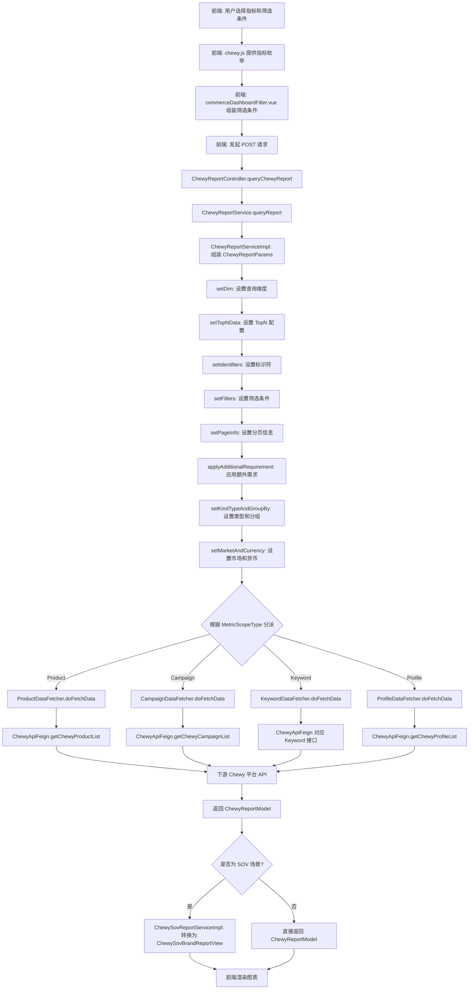
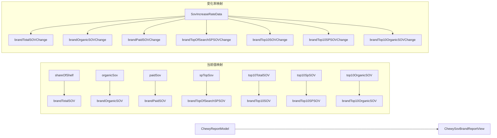
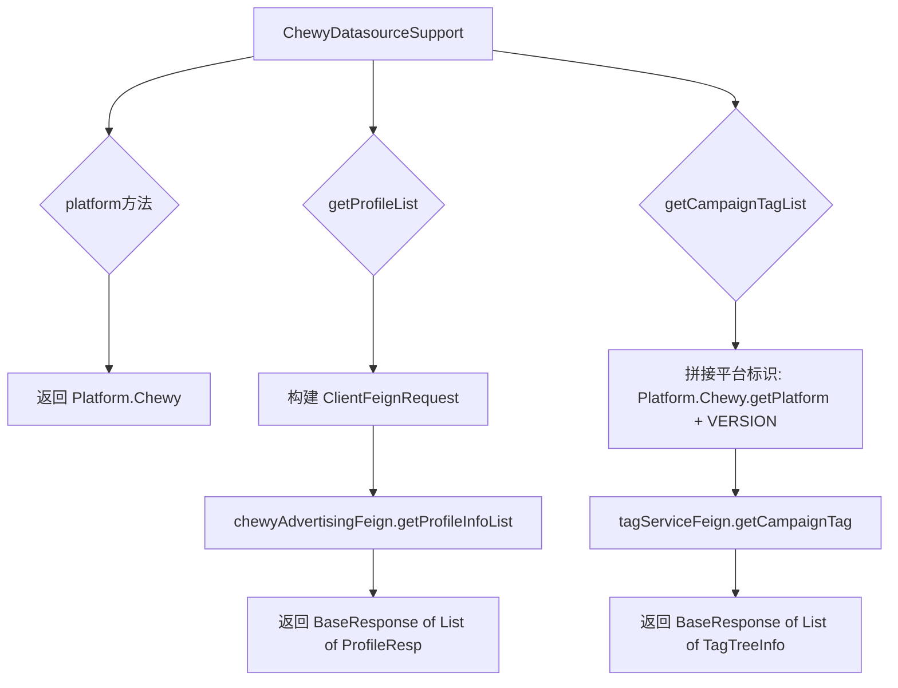
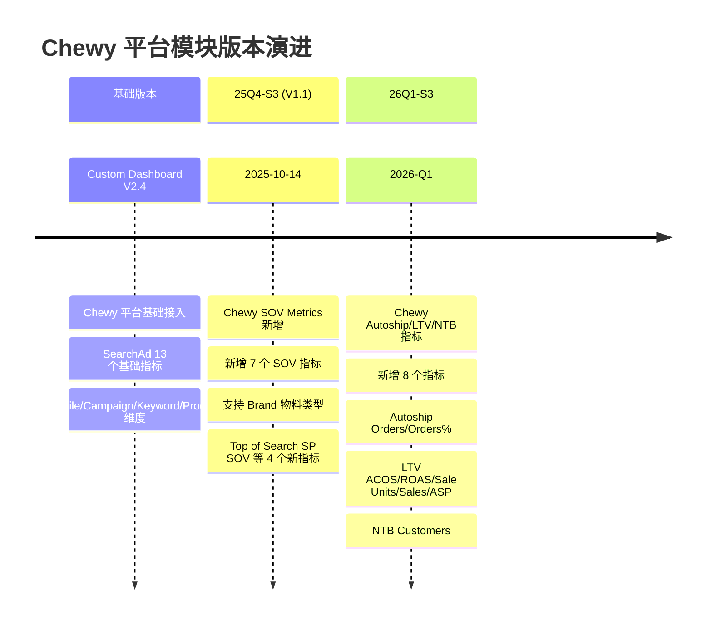

# Chewy 平台模块 功能逻辑文档

> 本文档由 document-automation 工具自动生成，基于源代码、PRD 文档和技术评审文档。
> 生成时间: 2026-04-09 11:06:57
> 准确性评分: 未验证/100

---


# Chewy 平台模块 功能逻辑文档

## 1. 模块概述

### 1.1 模块职责与定位

Chewy 平台模块是 Pacvue Custom Dashboard 系统中针对 Chewy 广告平台的数据查询与展示模块。该模块负责：

1. **广告报表数据查询**：支持 Profile、Campaign、Keyword、Product、Tag 等多维度的广告绩效数据查询
2. **指标映射与计算**：将 Chewy 平台原始数据映射为 Custom Dashboard 统一的指标体系，包括 SearchAd 类指标（Impression、Clicks、CTR、Spend 等）和 SOV 类指标（Brand Total SOV、Brand Paid SOV 等）
3. **SOV（Share of Voice）分析**：提供品牌在 Chewy 平台上的搜索份额分析，包含 Total/Organic/Paid/Top10 等多维度 SOV 指标及其变化率
4. **图表数据支撑**：为前端 Overview、Trend Chart、Comparison Chart、Pie Chart、Table 五种图表类型提供数据

### 1.2 系统架构位置

```
┌─────────────────────────────────────────────────────────┐
│                    前端 (Vue.js)                         │
│  chewy.js (指标定义) → commerceDashboardFilter.vue       │
│  → CustomDashboardIndexItem.vue → 各图表组件             │
└──────────────────────────┬──────────────────────────────┘
                           │ HTTP/REST
                           ▼
┌─────────────────────────────────────────────────────────┐
│           ChewyReportController (实现 ChewyReportFeign)  │
│                custom-dashboard-chewy 模块               │
└──────────────────────────┬──────────────────────────────┘
                           │
              ┌────────────┼────────────┐
              ▼            ▼            ▼
   ChewyReportServiceImpl  │  ChewySovReportServiceImpl
              │            │            │
              ▼            ▼            ▼
   AbstractDataFetcher → ProductDataFetcher 等
              │
              ▼
┌─────────────────────────────────────────────────────────┐
│              Feign 下游服务调用                           │
│  ChewyApiFeign    ChewyAdvertisingFeign  TagServiceFeign │
└──────────────────────────┬──────────────────────────────┘
                           │
                           ▼
┌─────────────────────────────────────────────────────────┐
│              Chewy 平台 API 服务（下游微服务）            │
└─────────────────────────────────────────────────────────┘
```

### 1.3 涉及的后端模块

| 模块名 | 说明 |
|--------|------|
| `custom-dashboard-chewy` | Chewy 平台核心业务模块，包含 Controller、Service、DTO |
| `com.pacvue.chewy` | 主包路径，包含 controller、service、entity 子包 |
| `com.pacvue.feign` | Feign 接口定义模块，包含 `ChewyReportFeign`、`ChewyApiFeign`、`ChewyAdvertisingFeign` |
| `com.pacvue.base` | 基础模块，提供 `BaseRequest`、`BaseResponse`、枚举等公共类 |

### 1.4 涉及的前端组件

| 组件/文件 | 说明 |
|-----------|------|
| `metricsList/chewy.js` | Chewy 平台指标定义文件，定义 SearchAd 和 SOV 两组指标枚举 |
| `components/commerceDashboardFilter.vue` | 筛选器组件，处理 markets/seller/vendor 级联更新 |
| `components/commerceMetricsSelectList.vue` | Commerce 指标选择列表组件 |
| `Detail/DetailRightBreadcrumb.vue` | 详情页面包屑及 Commerce 数据组装 |
| `components/CustomDashboardIndexItem.vue` | Dashboard 首页卡片项组件 |
| `TemplateManagements/components/BreadTitle.vue` | 模板管理面包屑导航 |
| `api/adminsuiteDefaultData.js` | 默认 SOV Group 数据配置 |

### 1.5 Maven 坐标与部署方式

- Maven 模块名：`custom-dashboard-chewy`（**待确认**完整 groupId 和 artifactId）
- 部署方式：作为 Spring Boot 微服务部署，通过 Feign 与其他微服务通信
- 注册中心：**待确认**（推测使用 Nacos 或 Eureka）

---

## 2. 用户视角

### 2.1 功能场景总览

基于 PRD 文档和代码分析，Chewy 平台模块支持以下核心功能场景：

| 场景编号 | 场景名称 | 涉及图表 | 版本 |
|----------|----------|----------|------|
| S1 | Chewy SearchAd 指标查看 | Overview/Trend/Comparison/Pie/Table | 基础版本 |
| S2 | Chewy SOV 指标查看 | Overview/Trend/Comparison/Pie/Table | 25Q4-S3 (V1.1) |
| S3 | Chewy Autoship/LTV/NTB 指标查看 | Overview/Trend/Comparison/Pie/Table | 26Q1-S3 |
| S4 | 多维度数据聚合（Profile/Campaign/Keyword/Product/Tag） | 全部图表 | 基础版本 |

### 2.2 场景 S1：Chewy SearchAd 指标查看

**用户角色**：广告运营人员、数据分析师

**操作流程**：

1. **进入 Custom Dashboard**：用户登录 Pacvue 平台，导航至 Custom Dashboard 模块
2. **选择/创建看板**：选择已有看板或创建新看板，在看板设置中选择 Chewy 平台
3. **配置筛选条件**：
   - 通过 `commerceDashboardFilter.vue` 组件选择 Market（市场）
   - 选择 Profile（广告账户）
   - 可选配置 Campaign Tag、Ad Type 等筛选条件
4. **选择指标**：从 SearchAd 指标组中选择需要展示的指标，可选指标包括：
   - **流量指标**：Impression（展示量）、Clicks（点击量）、CTR（点击率）
   - **花费指标**：Spend（花费）、CPC（单次点击成本）、CPM（千次展示成本）、CPA（单次转化成本）
   - **转化指标**：CVR（转化率）、Unit Sold（销售数量）、Sales（销售额）、ASP（平均售价）
   - **效率指标**：ACOS（广告花费占比）、ROAS（广告回报率）
   - **Autoship 指标**：Autoship Orders、Autoship Orders %
   - **LTV 指标**：LTV ACOS、LTV ROAS、LTV Sale Units、LTV Sales、LTV ASP
   - **NTB 指标**：NTB Customers（新客户数）
5. **选择图表类型**：根据指标支持的图表类型选择展示方式
6. **查看数据**：系统自动请求后端 API 获取数据并渲染图表

**UI 交互要点**：
- 指标选择列表通过 `commerceMetricsSelectList.vue` 组件展示
- 每个指标定义了 `supportChart` 属性，控制该指标可用于哪些图表类型
- 指标的 `formType` 决定数据格式化方式（Number/Money/Percent/toThousands）
- 指标的 `compareType` 决定同比/环比变化的颜色标识（ascGreen=上升为绿色/正向、ascRed=上升为红色/负向、ascGray=上升为灰色/中性）

### 2.3 场景 S2：Chewy SOV 指标查看

**背景**：Mars Agency_Mars_Wrigley_US (ID 2901) 和 Mars Petcare US (ID 3462) 的用户希望在 Custom Dashboard 中使用 Chewy 平台的 SOV 指标搭建图表和看板。

**操作流程**：

1. **进入看板**：同 S1
2. **选择 SOV Group**：在筛选条件中选择 SOV Group（通过 `/data/getSovGroup` 接口获取）
3. **选择 Brand**：选择需要分析的品牌（通过 `/data/getSovBrand` 接口获取）
4. **选择 Keyword**：SOV 指标需要 Keyword 作为筛选条件（通过 `/data/getSovKeyword` 接口获取）
5. **选择 SOV 指标**：从 SOV 指标组中选择，包括：
   - **Brand Total SOV**：品牌总搜索份额
   - **Brand Paid SOV**：品牌付费搜索份额
   - **Brand Organic SOV**：品牌自然搜索份额
   - **Top of Search SP SOV**：搜索顶部 SP 广告份额（25Q4-S3 新增）
   - **Top 10 SOV**：Top 10 搜索结果份额（25Q4-S3 新增）
   - **Top 10 SP SOV**：Top 10 SP 广告份额（25Q4-S3 新增）
   - **Top 10 Organic SOV**：Top 10 自然搜索份额（25Q4-S3 新增）
6. **支持的物料类型**：Brand
7. **查看数据**：系统通过 `ChewySovReportServiceImpl` 处理 SOV 数据，返回包含当前值和变化率的视图

**SOV 指标特殊说明**：
- SOV 指标的 `SocpeSettingObj` 中 `default: 5, line: 7`，与 SearchAd 指标的 `default: 27` 不同，表示 SOV 指标在 Scope Setting 中使用不同的配置
- 所有 SOV 指标的 `formType` 均为 `Percent`，`compareType` 均为 `ascGreen`
- SOV 指标支持全部五种图表类型：line、bar、table、topOverview、pie

### 2.4 场景 S3：Chewy Autoship/LTV/NTB 指标查看

**版本**：26Q1-S3

**新增指标及物料支持矩阵**：

| 指标 | Profile | Campaign/CampaignTag | Keyword/KeywordTag | Product/ProductTag |
|------|---------|---------------------|-------------------|-------------------|
| Autoship Orders | ✔ | ✔ | ✘ | ✔ |
| Autoship Orders % | ✔ | ✔ | ✘ | ✔ |
| LTV ACOS | ✔ | ✔ | ✔ | ✘ |
| LTV ROAS | ✔ | ✔ | ✔ | ✘ |
| LTV Sale Units | ✔ | ✔ | ✔ | ✘ |
| LTV Sales | ✔ | ✔ | ✔ | ✘ |
| LTV ASP | ✔ | ✔ | ✔ | ✘ |
| NTB Customers | ✔ | ✔ | ✘ | ✔ |

**指标计算公式**：
- `Autoship Orders % = Autoship Orders / Orders × 100%`
- 其他 LTV 指标的计算公式由下游 Chewy 平台 API 直接返回

**图表支持矩阵**：

| 指标 | Overview Standard | Overview Target Progress | Overview Target Compare | Trend | Pie | Bar | Table |
|------|:-:|:-:|:-:|:-:|:-:|:-:|:-:|
| Autoship Orders | ✔ | ✔ | - | ✔ | ✔ | ✔ | ✔ |
| Autoship Orders % | ✔ | - | ✔ | ✔ | - | ✔ | ✔ |
| LTV ACOS | ✔ | - | ✔ | ✔ | - | ✔ | ✔ |
| LTV ROAS | ✔ | - | ✔ | ✔ | - | ✔ | ✔ |
| LTV Sale Units | ✔ | ✔ | - | ✔ | ✔ | ✔ | ✔ |
| LTV Sales | ✔ | ✔ | - | ✔ | ✔ | ✔ | ✔ |
| LTV ASP | ✔ | - | ✔ | ✔ | - | - | ✔ |
| NTB Customers | ✔ | ✔ | - | ✔ | ✔ | ✔ | ✔ |

### 2.5 交叉验证：PRD 与代码对应关系

| PRD 需求 | 代码实现 | 状态 |
|----------|----------|------|
| Chewy SOV 7 个指标 | `chewy.js` SOV 数组定义了 7 个指标 | ✔ 已实现 |
| SOV 指标支持 Overview/Trend/Comparison/Pie/Table | `supportChart` 包含 line/bar/table/topOverview/pie | ✔ 已实现 |
| SOV 物料类型为 Brand | `ChewySovReportServiceImpl` 转换为 `ChewySovBrandReportView` | ✔ 已实现 |
| SOV 需要 Keyword 筛选条件 | `/data/getSovKeyword` 接口 | ✔ 已实现（技术评审确认） |
| Autoship/LTV/NTB 8 个新指标 | `chewy.js` SearchAd 数组包含对应指标定义 | ✔ 已实现 |
| NTB Customers 格式为 toThousands | `chewy.js` 中 `formType: "toThousands"` | ✔ 已实现 |

---

## 3. 核心 API

### 3.1 API 端点总览

`ChewyReportController` 实现 `ChewyReportFeign` 接口，所有端点均为 POST 方法。

#### 3.1.1 统一查询入口

- **路径**: `POST` （由 `ChewyReportFeign` 定义，具体路径**待确认**）
- **方法**: `queryChewyReport`
- **参数**: `ChewyReportRequest reportParams`
- **返回值**: `List<ChewyReportModel>`
- **说明**: 统一的 Chewy 报表查询入口，由 `ChewyReportService.queryReport()` 处理

#### 3.1.2 Profile 维度

| 端点 | 路径 | 参数 | 返回值 | 说明 |
|------|------|------|--------|------|
| getChewyProfileChart | `POST /api/Report/profileChart` | `ChewyReportParams` | `BaseResponse<ListResponse<ChewyReportModel>>` | Profile 维度图表数据 |
| getChewyProfileList | `POST /api/Report/profile` | `ChewyReportParams` | `BaseResponse<PageResponse<ChewyReportModel>>` | Profile 维度报表列表（分页） |

#### 3.1.3 Campaign 维度

| 端点 | 路径 | 参数 | 返回值 | 说明 |
|------|------|------|--------|------|
| getChewyCampaignChart | `POST /api/Report/campaignChart` | `ChewyReportParams` | `BaseResponse<ListResponse<ChewyReportModel>>` | Campaign 维度图表数据 |
| getChewyCampaignList | `POST /api/Report/campaign` | `ChewyReportParams` | `BaseResponse<PageResponse<ChewyReportModel>>` | Campaign 维度报表列表（分页） |

#### 3.1.4 Campaign Tag 维度

| 端点 | 路径 | 参数 | 返回值 | 说明 |
|------|------|------|--------|------|
| tagChart | `POST /api/Report/tagChart` | `ChewyReportParams` | **待确认** | Campaign Tag 图表数据 |
| getCampaignTagReport | `POST /customDashboard/getCampaignTagReport` | `ChewyReportParams` | **待确认** | Campaign Tag 报表列表 |

#### 3.1.5 Product 维度

| 端点 | 路径 | 参数 | 返回值 | 说明 |
|------|------|------|--------|------|
| getChewyProductChart | `POST /api/Report/productChart` | `ChewyReportParams` | **待确认**（推测 `BaseResponse<ListResponse<ChewyReportModel>>`） | Product 维度图表数据 |
| getChewyProductList | `POST /api/Report/product` | `ChewyReportParams` | `BaseResponse<PageResponse<ChewyReportModel>>` | Product 维度报表列表（分页） |
| getChewyProductTopMovers | `POST /customDashboard/getProductTopMovers` | `ChewyReportParams` | `BaseResponse<PageResponse<ChewyReportModel>>` | Product Top Movers 数据 |

#### 3.1.6 Product Tag 维度

| 端点 | 路径 | 参数 | 返回值 | 说明 |
|------|------|------|--------|------|
| getChewyProductTagChart | `POST /api/Report/productTagChart` | `ChewyReportParams` | `BaseResponse<ListResponse<ChewyReportModel>>` | Product Tag 图表数据 |

#### 3.1.7 Keyword 维度

| 端点 | 路径 | 参数 | 返回值 | 说明 |
|------|------|------|--------|------|
| keywordChart | `POST /api/Report/keywordChart` | `ChewyReportParams`（**待确认**） | **待确认** | Keyword 维度图表数据 |
| keywordList | `POST /api/Report/keyword` | `ChewyReportParams`（**待确认**） | **待确认** | Keyword 维度报表列表 |

### 3.2 请求参数结构

#### ChewyReportRequest

```java
package com.pacvue.feign.dto.request.chewy;

// 继承 BaseRequest，包含通用请求字段
public class ChewyReportRequest extends BaseRequest {
    // 具体字段待确认，推测包含：
    // - 日期范围（startDate, endDate）
    // - 指标列表（metrics）
    // - 维度（dimension/scopeType）
    // - 筛选条件（filters）
    // - 分页信息（page, pageSize）
    // - 市场/货币（toMarket）
    // - TopN 配置
}
```

#### ChewyReportParams

由 `ChewyReportServiceImpl` 通过多步骤组装生成：

```java
ChewyReportParams params = new ChewyReportParams();
setDim(params, request);              // 设置维度
setTopNData(request);                 // 设置 TopN 数据
setIdentifiers(params, request);      // 设置标识符（Profile ID 等）
setFilters(params, request);          // 设置筛选条件
setPageInfo(params, request);         // 设置分页信息
applyAdditionalRequirement(request, params); // 应用额外需求
setKindTypeAndGroupBy(params, request);      // 设置类型和分组
setMarketAndCurrency(params, request);       // 设置市场和货币
```

关键字段：
- `toMarket`：目标市场
- `toCurrencyCode`：目标货币代码（默认 "USD"）
- `coverCurrencyCode`：覆盖货币代码（默认 "USD"）
- 维度（dim）、筛选器（filters）、分页（page/pageSize）等

#### Filter

```java
package com.pacvue.chewy.entity.request;

@Data
@NoArgsConstructor
@AllArgsConstructor
public class Filter {
    // 具体字段待确认，推测包含：
    // - field: 筛选字段名
    // - operand: 操作符（来自 Operand 枚举）
    // - values: 筛选值列表
}
```

### 3.3 响应结构

#### ChewyReportModel

Chewy 报表数据模型，包含广告绩效指标字段。具体字段**待确认**，根据 `ChewySovBrandReportView` 的映射逻辑推测包含：

- 基础广告指标：impression、clicks、ctr、spend、cpc、cpm、cpa、cvr、unitSold、sales、asp
- SOV 指标：shareOfShelf、organicSov、paidSov、spTopSov、top10TotalSOV、top10SpSOV、top10OrganicSOV
- Autoship 指标：autoshipOrders、autoshipOrdersPercent
- LTV 指标：ltvAcos、ltvRoas、ltvSaleUnits、ltvSales、ltvAsp
- NTB 指标：ntbCustomers
- 变化率数据：`SovIncreaseRateData increase`（包含上述 SOV 指标的变化率）

### 3.4 前端 API 调用

前端通过 `chewy.js` 中定义的指标枚举值（如 `CHEWY_IMPRESSION`、`CHEWY_BRAND_TOTAL_SOV`）构建请求参数，经由 `commerceDashboardFilter.vue` 组装筛选条件后发起请求。具体的 API 调用文件路径**待确认**。

---

## 4. 核心业务流程

### 4.1 主流程：Chewy 报表数据查询



### 4.2 详细步骤说明

#### 步骤 1：前端指标定义与选择

前端 `chewy.js` 文件定义了 Chewy 平台的全部指标，分为两组：

**SearchAd 组**（21 个指标）：
每个指标对象包含以下属性：
- `label`：国际化显示名称，通过 `$t()` 函数翻译
- `value`：指标枚举值，格式为 `CHEWY_` 前缀 + 大写下划线命名
- `formType`：数据格式类型（Number/Money/Percent/toThousands）
- `compareType`：比较方向颜色（ascGreen/ascRed/ascGray）
- `decimalPlaces`：小数位数（仅部分指标指定，如 Impression 为 0）
- `supportChart`：支持的图表类型数组
- `groupLevel`：分组级别，统一为 "Chewy"
- `SocpeSettingObj`：Scope Setting 配置对象，`default` 值为 27（SearchAd）或 35/36（Autoship/LTV）

**SOV 组**（7 个指标）：
SOV 指标的 `SocpeSettingObj` 为 `{ default: 5, line: 7 }`，表示在不同图表类型下使用不同的 Scope 配置。

#### 步骤 2：筛选条件组装

`commerceDashboardFilter.vue` 组件负责：
1. 加载 Market 列表并处理级联更新
2. 加载 Profile 列表（通过 `ChewyAdvertisingFeign.getProfileInfoList`）
3. 加载 Campaign Tag 树（通过 `TagServiceFeign.getCampaignTag`，平台标识为 `Platform.Chewy.getPlatform() + VERSION`）
4. 对于 SOV 场景，额外加载 SOV Group、SOV Brand、SOV Keyword 数据

#### 步骤 3：ChewyReportServiceImpl 参数组装

`ChewyReportServiceImpl` 是核心服务实现类，负责将前端传入的 `ChewyReportRequest` 转换为下游 API 所需的 `ChewyReportParams`。组装过程分为 8 个步骤：

1. **setDim(params, request)**：根据请求中的维度信息设置查询维度（Profile/Campaign/Keyword/Product/Tag）
2. **setTopNData(request)**：设置 TopN 数据配置，用于 Top Movers 等场景
3. **setIdentifiers(params, request)**：设置标识符，如 Profile ID、Campaign ID 等
4. **setFilters(params, request)**：将前端筛选条件转换为 `Filter` 对象列表，设置到 params 中
5. **setPageInfo(params, request)**：设置分页参数（页码、每页大小）
6. **applyAdditionalRequirement(request, params)**：应用额外的业务需求配置（如 `Requirement` 对象）
7. **setKindTypeAndGroupBy(params, request)**：设置数据类型和分组方式（如按日/周/月分组）
8. **setMarketAndCurrency(params, request)**：设置目标市场和货币代码，使用 `commonParamsMap` 映射市场到货币代码，默认为 "USD"

#### 步骤 4：策略模式分派 DataFetcher

系统使用策略模式根据 `MetricScopeType` 分派到不同的 DataFetcher：

- **注解驱动**：`@ScopeTypeQualifier` 注解标识每个 Fetcher 处理的 Scope 类型
- **抽象基类**：`AbstractDataFetcher` 定义模板方法：
  - `doFetchData(ChewyReportParams)`：获取列表数据（分页）
  - `doFetchChartData(ChewyReportParams)`：获取图表数据
  - `doFetchTopMoversData(ChewyReportParams)`：获取 Top Movers 数据

**ProductDataFetcher 实现**：
```java
@Component
@ScopeTypeQualifier({MetricScopeType.Product})
public class ProductDataFetcher extends AbstractDataFetcher {
    @Override
    protected BaseResponse<PageResponse<ChewyReportModel>> doFetchData(ChewyReportParams params) {
        return chewyApiFeign.getChewyProductList(params);
    }
    
    @Override
    protected BaseResponse<ListResponse<ChewyReportModel>> doFetchChartData(ChewyReportParams params) {
        return chewyApiFeign.getChewyProductChart(params);
    }
    
    @Override
    protected BaseResponse<PageResponse<ChewyReportModel>> doFetchTopMoversData(ChewyReportParams params) {
        return chewyApiFeign.getChewyProductTopMovers(params);
    }
}
```

#### 步骤 5：Feign 调用下游服务

通过 `ChewyApiFeign` 调用下游 Chewy 平台 API 服务，所有接口均使用 `@PostMapping` 注解，请求体为 `ChewyReportParams`。

#### 步骤 6：SOV 数据转换

对于 SOV 场景，`ChewySovReportServiceImpl` 将 `ChewyReportModel` 转换为 `ChewySovBrandReportView`：



转换逻辑详细说明：
1. 创建新的 `ChewySovBrandReportView` 实例
2. 使用 `setDecimalShow()` 方法格式化所有 SOV 值（保留指定小数位）
3. 映射 7 个 SOV 当前值字段
4. 检查 `SovIncreaseRateData increase` 是否非空（使用 `ObjectUtils.isNotEmpty`）
5. 如果变化率数据存在，映射 7 个 SOV 变化率字段

### 4.3 平台数据源适配流程



`ChewyDatasourceSupport` 实现了统一的多平台数据源接口（SPI 模式），通过 `platform()` 方法返回 `Platform.Chewy` 标识，使系统能够根据平台类型自动路由到正确的数据源实现。

### 4.4 图表数据获取流程

不同图表类型对应不同的 API 调用：

| 图表类型 | 调用方法 | 数据特征 |
|----------|----------|----------|
| Overview (topOverview) | doFetchData → 列表接口 | 聚合汇总数据 |
| Trend (line) | doFetchChartData → Chart 接口 | 时间序列数据 |
| Comparison (bar) | doFetchChartData → Chart 接口 | 分组对比数据 |
| Pie | doFetchData → 列表接口 | 各项占比数据 |
| Table | doFetchData → 列表接口 | 分页明细数据 |
| Top Movers | doFetchTopMoversData → TopMovers 接口 | 变化最大的数据项 |

---

## 5. 数据模型

### 5.1 数据库表

代码片段中未直接出现表名或 MyBatis Mapper 定义。数据主要通过 Feign 调用下游 Chewy 平台 API 获取，本模块不直接操作数据库。**待确认**是否存在本地缓存表或中间表。

### 5.2 核心 DTO/VO

#### ChewyReportRequest

```
包路径: com.pacvue.feign.dto.request.chewy
继承: BaseRequest
用途: 前端请求参数，包含用户选择的指标、维度、筛选条件等
```

| 字段 | 类型 | 说明 |
|------|------|------|
| toMarket | String | 目标市场 |
| （其他字段） | **待确认** | 继承自 BaseRequest 的通用字段 |

#### ChewyReportParams

```
用途: 下游 API 请求参数，由 ChewyReportServiceImpl 组装
```

| 字段 | 类型 | 说明 |
|------|------|------|
| toMarket | String | 目标市场 |
| toCurrencyCode | String | 目标货币代码（默认 USD） |
| coverCurrencyCode | String | 覆盖货币代码（默认 USD） |
| dim | **待确认** | 查询维度 |
| filters | List\<Filter\> | 筛选条件列表 |
| page/pageSize | **待确认** | 分页参数 |
| kindType | **待确认** | 数据类型 |
| groupBy | **待确认** | 分组方式 |

#### Filter

```
包路径: com.pacvue.chewy.entity.request
用途: 筛选条件对象
```

具体字段**待确认**，推测包含 field（字段名）、operand（操作符，来自 `Operand` 枚举）、values（值列表）。

#### ChewyReportModel

```
包路径: com.pacvue.feign.dto.response.chewy
用途: Chewy 报表数据模型，下游 API 返回的原始数据
```

关键字段（根据 SOV 映射逻辑推断）：

| 字段 | 类型 | 说明 |
|------|------|------|
| shareOfShelf | BigDecimal/**待确认** | 品牌总 SOV |
| organicSov | BigDecimal/**待确认** | 自然搜索 SOV |
| paidSov | BigDecimal/**待确认** | 付费搜索 SOV |
| spTopSov | BigDecimal/**待确认** | 搜索顶部 SP SOV |
| top10TotalSOV | BigDecimal/**待确认** | Top 10 总 SOV |
| top10SpSOV | BigDecimal/**待确认** | Top 10 SP SOV |
| top10OrganicSOV | BigDecimal/**待确认** | Top 10 自然 SOV |
| increase | SovIncreaseRateData | SOV 变化率数据 |

#### ChewySovBrandReportView

```
用途: SOV 品牌报表视图，面向前端展示
```

| 字段 | 类型 | 说明 |
|------|------|------|
| brandTotalSOV | String/BigDecimal | 品牌总 SOV（格式化后） |
| brandOrganicSOV | String/BigDecimal | 品牌自然 SOV |
| brandPaidSOV | String/BigDecimal | 品牌付费 SOV |
| brandTopOfSearchSPSOV | String/BigDecimal | 搜索顶部 SP SOV |
| brandTop10SOV | String/BigDecimal | Top 10 SOV |
| brandTop10SPSOV | String/BigDecimal | Top 10 SP SOV |
| brandTop10OrganicSOV | String/BigDecimal | Top 10 自然 SOV |
| brandTotalSOVChange | String/BigDecimal | 品牌总 SOV 变化率 |
| brandOrganicSOVChange | String/BigDecimal | 品牌自然 SOV 变化率 |
| brandPaidSOVChange | String/BigDecimal | 品牌付费 SOV 变化率 |
| brandTopOfSearchSPSOVChange | String/BigDecimal | 搜索顶部 SP SOV 变化率 |
| brandTop10SOVChange | String/BigDecimal | Top 10 SOV 变化率 |
| brandTop10SPSOVChange | String/BigDecimal | Top 10 SP SOV 变化率 |
| brandTop10OrganicSOVChange | String/BigDecimal | Top 10 自然 SOV 变化率 |

#### SovIncreaseRateData

```
用途: SOV 指标变化率数据，嵌套在 ChewyReportModel 中
```

| 字段 | 类型 | 说明 |
|------|------|------|
| shareOfShelf | BigDecimal/**待确认** | 总 SOV 变化率 |
| organicSov | BigDecimal/**待确认** | 自然 SOV 变化率 |
| paidSov | BigDecimal/**待确认** | 付费 SOV 变化率 |
| spTopSov | BigDecimal/**待确认** | 搜索顶部 SP SOV 变化率 |
| top10TotalSOV | BigDecimal/**待确认** | Top 10 总 SOV 变化率 |
| top10SpSOV | BigDecimal/**待确认** | Top 10 SP SOV 变化率 |
| top10OrganicSOV | BigDecimal/**待确认** | Top 10 自然 SOV 变化率 |

### 5.3 核心枚举

#### MetricScopeType

用于策略模式分派，标识指标的作用域类型：
- `Product`：产品维度
- `Campaign`：**待确认**
- `Keyword`：**待确认**
- `Profile`：**待确认**
- `Tag`：**待确认**

#### Platform

平台枚举，`Platform.Chewy` 标识 Chewy 平台。

#### Operand

操作符枚举（`com.pacvue.base.enums.Operand`），用于 Filter 条件构建。具体值**待确认**。

### 5.4 前端指标枚举映射

前端 `chewy.js` 中的指标枚举值与后端字段的映射关系：

**SearchAd 指标**：

| 前端枚举值 | 后端字段（推测） | 格式类型 | 比较方向 |
|-----------|-----------------|----------|----------|
| CHEWY_IMPRESSION | impression | Number (0位小数) | ascGray |
| CHEWY_CLICKS | clicks | Number (0位小数) | ascGreen |
| CHEWY_CTR | ctr | Percent | ascGreen |
| CHEWY_SPEND | spend | Money | ascGray |
| CHEWY_CPC | cpc | Money | ascRed |
| CHEWY_CVR | cvr | Percent | ascGreen |
| CHEWY_CPA | cpa | Money | ascRed |
| CHEWY_CPM | cpm | Money | ascRed |
| CHEWY_ACOS | acos | Percent | ascRed |
| CHEWY_ROAS | roas | Money | ascGreen |
| CHEWY_UNIT_SOLD | unitSold | Number (0位小数) | ascGreen |
| CHEWY_SALES | sales | Money | ascGreen |
| CHEWY_ASP | asp | Money | ascGray |
| CHEWY_AUTOSHIP_ORDERS | autoshipOrders | Number (0位小数) | ascGreen |
| CHEWY_AUTOSHIP_ORDERS_PERCENT | autoshipOrdersPercent | Percent | ascGreen |
| CHEWY_LTV_ACOS | ltvAcos | Percent | ascRed |
| CHEWY_LTV_ROAS | ltvRoas | Money | ascGreen |
| CHEWY_LTV_SALE_UNITS | ltvSaleUnits | Number (0位小数) | ascGreen |
| CHEWY_LTV_SALES | ltvSales | Money | ascGreen |
| CHEWY_LTV_ASP | ltvAsp | Money | ascGray |
| CHEWY_NTB_CUSTOMERS | ntbCustomers | toThousands | ascGreen |

**SOV 指标**：

| 前端枚举值 | 后端字段 | 格式类型 | 比较方向 |
|-----------|---------|----------|----------|
| CHEWY_BRAND_TOTAL_SOV | brandTotalSOV | Percent | ascGreen |
| CHEWY_BRAND_PAID_SOV | brandPaidSOV | Percent | ascGreen |
| CHEWY_BRAND_ORGANIC_SOV | brandOrganicSOV | Percent | ascGreen |
| CHEWY_BRAND_TOP_OF_SEARCH_SP_SOV | brandTopOfSearchSPSOV | Percent | ascGreen |
| CHEWY_BRAND_TOP_10_SOV | brandTop10SOV | Percent | ascGreen |
| CHEWY_BRAND_TOP_10_SP_SOV | brandTop10SPSOV | Percent | ascGreen |
| CHEWY_BRAND_TOP_10_ORGANIC_SOV | brandTop10OrganicSOV | Percent | ascGreen |

### 5.5 ScopeSettingObj 说明

`SocpeSettingObj` 控制指标在不同图表类型下的 Scope 配置：

| 指标组 | default 值 | line 值 | 说明 |
|--------|-----------|---------|------|
| SearchAd 基础指标 | 27 | - | 标准广告指标 Scope |
| Autoship 指标 | 35 | - | Autoship 相关 Scope |
| LTV 指标 | 36 | - | LTV 相关 Scope |
| SOV 指标 | 5 | 7 | SOV 指标在 Trend 图表中使用不同 Scope |

---

## 6. 平台差异

### 6.1 Chewy 平台在 Custom Dashboard 中的定位

Chewy 是 Custom Dashboard 支持的多个广告平台之一。根据技术评审文档 `Custom Dashboard功能点梳理`，系统采用统一的多平台架构，Chewy 通过 `ChewyDatasourceSupport` 实现平台适配器接口。

### 6.2 Chewy 与其他平台的差异

| 特性 | Chewy | Amazon（参考） | Walmart（参考） |
|------|-------|---------------|----------------|
| 平台标识 | `Platform.Chewy` | `Platform.Amazon` | `Platform.Walmart` |
| 货币默认值 | USD | 多币种 | USD |
| SOV 指标 | 7 个（含 Top10 系列） | **待确认** | **待确认** |
| Autoship 指标 | ✔（Chewy 特有） | ✘ | ✘ |
| LTV 指标 | ✔（Chewy 特有） | **待确认** | **待确认** |
| NTB Customers | ✔ | **待确认** | **待确认** |
| Campaign Tag 获取 | `tagServiceFeign.getCampaignTag(platform + VERSION)` | 类似机制 | 类似机制 |

### 6.3 Chewy 特有指标

以下指标为 Chewy 平台特有，其他平台不支持：

1. **Autoship Orders**：自动订阅订单数（Chewy 的宠物食品自动补货功能）
2. **Autoship Orders %**：自动订阅订单占比
3. **NTB Customers**：新品牌客户数（New-To-Brand）

### 6.4 指标映射关系

Chewy 平台的指标映射通过以下层次实现：

```
前端枚举 (chewy.js)
    ↓ value 字段
后端枚举 (MetricType 等，待确认)
    ↓ 
ChewyReportParams 中的指标参数
    ↓
下游 Chewy API 返回的 ChewyReportModel 字段
    ↓ (SOV 场景)
ChewySovBrandReportView 视图字段
```

### 6.5 货币转换

`setMarketAndCurrency` 方法使用 `commonParamsMap` 将市场映射到货币代码：
- 默认货币为 "USD"
- `toCurrencyCode` 和 `coverCurrencyCode` 均从同一映射获取
- 具体的市场-货币映射表**待确认**

---

## 7. 配置与依赖

### 7.1 Feign 下游服务依赖

#### ChewyApiFeign

**用途**：调用下游 Chewy 平台 API 服务，获取报表数据

| 方法 | 路径 | 说明 |
|------|------|------|
| getChewyProfileChart | POST /api/Report/profileChart | Profile 图表数据 |
| getChewyProfileList | POST /api/Report/profile | Profile 列表数据 |
| getChewyCampaignChart | POST /api/Report/campaignChart | Campaign 图表数据 |
| getChewyCampaignList | POST /api/Report/campaign | Campaign 列表数据 |
| getChewyProductChart | POST /api/Report/productChart | Product 图表数据（**待确认**） |
| getChewyProductList | POST /api/Report/product | Product 列表数据 |
| getChewyProductTopMovers | POST /customDashboard/getProductTopMovers | Product Top Movers |
| getChewyProductTagChart | POST /api/Report/productTagChart | Product Tag 图表数据 |
| getChewyKeywordChart | POST /api/Report/keywordChart（**待确认**） | Keyword 图表数据 |
| getChewyKeywordList | POST /api/Report/keyword（**待确认**） | Keyword 列表数据 |

#### ChewyAdvertisingFeign

**用途**：获取 Chewy 广告账户（Profile）信息

| 方法 | 说明 |
|------|------|
| getProfileInfoList(ClientFeignRequest) | 获取用户有权限的 Profile 列表，返回 `BaseResponse<List<ProfileResp>>` |

#### TagServiceFeign

**用途**：获取 Campaign Tag 树结构

| 方法 | 说明 |
|------|------|
| getCampaignTag(String platformVersion) | 获取 Campaign Tag 树，参数为平台标识 + 版本号 |

#### ChewyReportFeign

**用途**：Feign 接口定义，由 `ChewyReportController` 实现，供其他微服务调用

| 方法 | 说明 |
|------|------|
| queryChewyReport(ChewyReportRequest) | 统一报表查询入口 |

### 7.2 SOV 相关接口依赖

根据技术评审文档，SOV 场景需要以下额外接口：

| 接口路径 | 说明 |
|----------|------|
| /data/getSovGroup | 获取 SOV Group 列表 |
| /data/getSovKeyword | 获取 SOV Keyword 列表 |
| /data/getSovBrand | 获取 SOV Brand 列表 |
| /customDashboard/briefTips | 获取简要提示信息 |

### 7.3 关键配置项

- **commonParamsMap**：市场到货币代码的映射配置，在 `ChewyReportServiceImpl` 中使用，默认值为 "USD"。具体配置来源（Apollo/application.yml）**待确认**。
- **VERSION**：平台版本常量，用于拼接 Campaign Tag 查询的平台标识。具体值**待确认**。
- **CustomDashboardApiConstants**：API 常量定义，在 `ChewyReportServiceImpl` 中引用。

### 7.4 缓存策略

代码片段中未直接出现 `@Cacheable` 或 Redis 相关配置。**待确认**是否存在缓存层。

### 7.5 消息队列

代码片段中未出现 Kafka 或其他消息队列使用。**待确认**。

### 7.6 核心依赖库

根据 `ChewyReportServiceImpl` 的 import 语句：

| 依赖 | 用途 |
|------|------|
| `cn.hutool.core.date.LocalDateTimeUtil` | 日期时间处理 |
| `cn.hutool.core.util.ObjectUtil` | 对象工具类 |
| `com.baomidou.mybatisplus.core.toolkit.CollectionUtils` | 集合工具类 |
| `com.baomidou.mybatisplus.core.toolkit.ObjectUtils` | 对象工具类（用于 SOV 变化率非空判断） |
| `com.google.common.collect.Lists` | Guava Lists 工具类 |
| Lombok (`@Data`, `@Slf4j` 等) | 代码简化 |

---

## 8. 版本演进

### 8.1 版本时间线



### 8.2 V2.4 基础版本

- **技术评审**：`Custom Dashboard V2.4技术评审`
- **核心内容**：
  - Chewy 平台基础接入 Custom Dashboard
  - 支持 SearchAd 基础指标（Impression、Clicks、CTR、Spend、CPC、CVR、CPA、CPM、ACOS、ROAS、Unit Sold、Sales、ASP）
  - 支持 Profile/Campaign/Keyword/Product 多维度查询
  - 实现策略模式（AbstractDataFetcher）和平台适配器模式（ChewyDatasourceSupport）

### 8.3 25Q4-S3 (V1.1) - SOV Metrics

- **PRD**：`Custom Dashboard-25Q4-S3` 第 4 节
- **技术评审**：`Custom Dashboard 2025Q4S3技术评审` 第三节
- **Jira**：CP-39726
- **背景**：Mars Agency 客户（ID 2901、3462）需要在 Custom Dashboard 中使用 Chewy SOV 指标
- **核心变更**：
  - 新增 SOV 指标组（7 个指标）
  - 实现 `ChewySovReportServiceImpl` 进行 SOV 数据转换
  - 新增 `ChewySovBrandReportView` 视图类
  - 新增 `SovIncreaseRateData` 变化率数据类
  - 前端 `chewy.js` 新增 SOV 指标定义
  - 需要调整的前置接口：`/data/getSovGroup`、`/data/getSovKeyword`、`/data/getSovBrand`、`/customDashboard/briefTips`

### 8.4 26Q1-S3 - Autoship/LTV/NTB Metrics

- **PRD**：`Custom DB 26Q1 - S3` 第 2 项
- **技术评审**：`Custom Dashboard 2026Q1S3技术评审` 第二节
- **Jira**：CP-42695
- **核心变更**：
  - 新增 8 个指标：Autoship Orders、Autoship Orders %、LTV ACOS、LTV ROAS、LTV Sale Units、LTV Sales、LTV ASP、NTB Customers
  - 不同指标支持不同的物料维度（详见 5.2 节物料支持矩阵）
  - 不同指标支持不同的图表类型和 Overview 模式
  - 前端 `chewy.js` 新增对应指标定义，使用不同的 `SocpeSettingObj`（35/36）
  - 需要修改下游 Chewy 平台 API 接口以支持新指标

### 8.5 待优化项与技术债务

1. **货币映射硬编码**：`commonParamsMap` 中的市场-货币映射关系可能需要配置化
2. **Filter 类字段不明确**：`Filter` 类仅有 `@Data` 注解，具体字段结构需要补充文档
3. **Keyword 维度接口待确认**：Keyword 相关的 Chart 和 List 接口参数类型标注为"待确认"
4. **数据库层缺失**：模块完全依赖 Feign 调用，缺少本地数据缓存，可能存在性能瓶颈
5. **前端枚举值命名不一致**：技术评审中 NTB Customers 的枚举为 `CHWY_NTB_CUSTOMERS`（缺少 E），但前端代码中为 `CHEWY_NTB_CUSTOMERS`，需确认后端实际使用的枚举值

---

## 9. 已知问题与边界情况

### 9.1 代码中的 TODO/FIXME

代码片段中未发现明确的 TODO 或 FIXME 注释。**待确认**完整代码中是否存在。

### 9.2 异常处理与降级策略

1. **Feign 调用失败**：当下游 Chewy 平台 API 不可用时，`ChewyApiFeign` 的调用会抛出异常。**待确认**是否配置了 Feign Fallback 或 Hystrix/Sentinel 降级策略。

2. **SOV 变化率数据为空**：`ChewySovReportServiceImpl` 中对 `SovIncreaseRateData increase` 进行了非空判断：
   ```java
   if (ObjectUtils.isNotEmpty(increase)) {
       // 设置

---

*本文档由 AI 自动生成，如有不准确之处请以源代码为准。标注"待确认"的内容需要人工核实。*