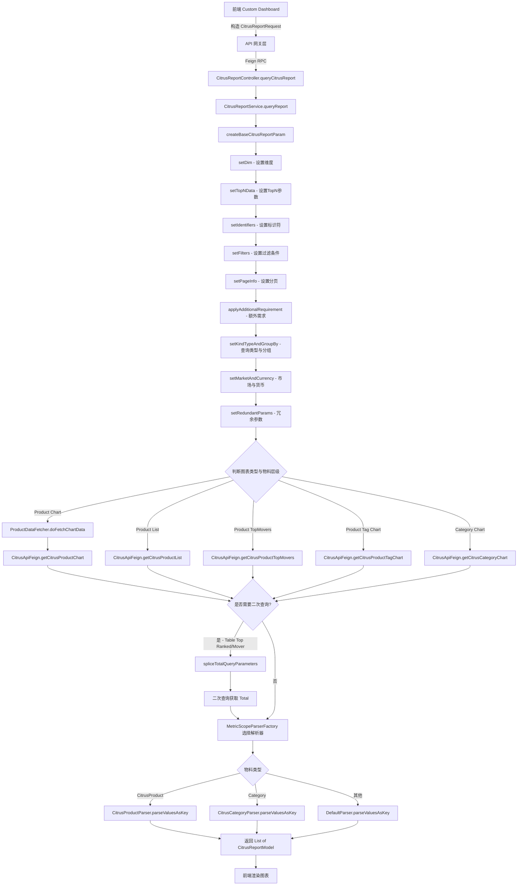
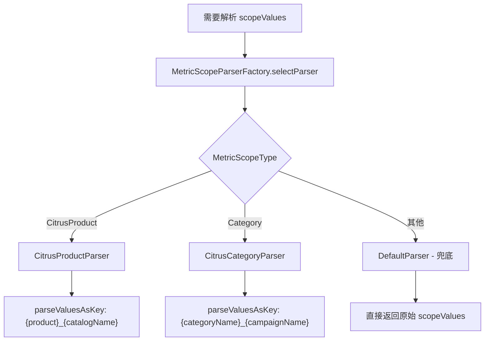
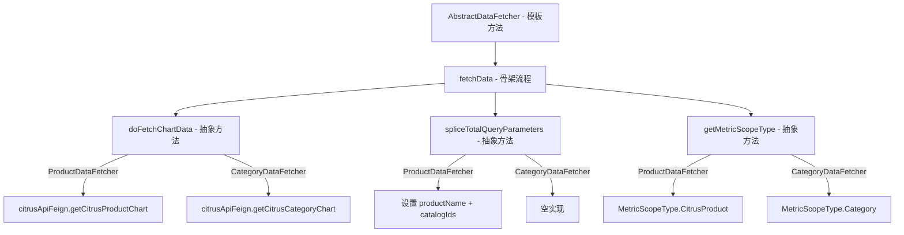

# Citrus 平台模块 功能逻辑文档

> 本文档由 document-automation 工具自动生成，基于源代码、PRD 文档和技术评审文档。
> 生成时间: 2026-04-09 11:12:46
> 准确性评分: 未验证/100

---


# Citrus 平台模块 功能逻辑文档

## 1. 模块概述

### 1.1 模块职责与定位

Citrus 平台模块是 Pacvue Custom Dashboard 系统中针对 Citrus 广告平台的数据查询、报表生成与指标映射专用模块。该模块负责将前端 Custom Dashboard 页面中用户对 Citrus 广告数据（SearchAd）和 SOV 数据的查询请求，转换为下游 Citrus API 服务可识别的参数格式，调用下游服务获取数据，并对返回结果进行解析、聚合后返回给上层调用方。

Citrus 是一个零售媒体广告平台（Retail Media），其广告物料层级与 Amazon、Walmart 等主流平台存在差异，特别是在 Product 和 Category 维度上采用**多维复合物料**设计（即一个物料由多个 ID 组合确定），这是本模块的核心技术难点之一。

### 1.2 系统架构位置与上下游关系

```
┌─────────────────────────────────────────────────────────┐
│                    前端 Custom Dashboard                  │
│  (citrus.js 指标定义 / store.js / 图表组件)               │
└──────────────────────────┬──────────────────────────────┘
                           │ HTTP 请求
                           ▼
┌─────────────────────────────────────────────────────────┐
│              Custom Dashboard API 网关层                   │
│         (通过 CitrusReportFeign 调用本模块)                │
└──────────────────────────┬──────────────────────────────┘
                           │ Feign RPC
                           ▼
┌─────────────────────────────────────────────────────────┐
│           custom-dashboard-citrus 模块 (本模块)           │
│  CitrusReportController → CitrusReportService            │
│  → CitrusReportServiceImpl                               │
│  → MetricScopeParserFactory (策略选择)                    │
│  → ProductDataFetcher / CategoryDataFetcher (模板方法)    │
└──────────┬──────────────────────────┬───────────────────┘
           │ Feign RPC                │ Feign RPC
           ▼                          ▼
┌──────────────────────┐  ┌──────────────────────────────┐
│   Citrus API 服务     │  │   SOV 服务 (CitrusSovFeign)   │
│  (CitrusApiFeign)     │  │  /category/treeByCategoryIds  │
│  /api/Report/product  │  │  /sov/brands/getByParams/v2   │
│  /api/Report/prodChart│  └──────────────────────────────┘
│  /customDashboard/... │
└──────────────────────┘
```

**上游调用方**：Custom Dashboard API 网关层通过 `CitrusReportFeign` 接口以 Feign RPC 方式调用本模块。

**下游依赖**：
- `CitrusApiFeign`：Citrus 广告数据 API 服务，提供产品报表、图表、TopMovers、Tag 报表等接口
- `CitrusSovFeign`：Citrus SOV（Share of Voice）数据服务，提供品类树和品牌数据查询

### 1.3 涉及的后端模块与前端组件

**后端 Maven 模块**：
- `custom-dashboard-citrus`：核心业务模块，包含 Controller、Service、DataFetcher、Parser 等
- `com.pacvue.feign`：Feign 接口定义模块，包含 `CitrusReportFeign`、`CitrusApiFeign`、`CitrusSovFeign`
- `com.pacvue.citrus.entity`：Citrus 实体类模块，包含 `Filter`、`CitrusReportParams` 等请求/响应实体
- `com.pacvue.feign.dto`：DTO 模块，包含 `CitrusReportRequest`、`CitrusReportModel` 等

**前端组件**：
- `metricsList/citrus.js`：Citrus 平台指标定义文件，包含 SearchAd 和 SOV 两组指标
- `components/CustomDashboardIndexChart.vue`：图表渲染组件
- `components/ASINItemIndex.vue`：ASIN 物料展示组件
- `components/commerceDashboardFilter.vue`：Commerce Dashboard 筛选器组件
- `store.js`：Vuex Store，`getTeamListData` 方法管理 Citrus profile/team 数据
- `customDashboardRouter.js`：路由配置，包含 citrus 产品线规则

### 1.4 Maven 坐标与部署方式

Maven 模块名为 `custom-dashboard-citrus`，具体 groupId 和 artifactId **待确认**。根据代码包名推断：
- 主包名：`com.pacvue.citrus`
- Controller 包：`com.pacvue.citrus.controller`
- Service 包：`com.pacvue.citrus.service`（**待确认**）
- Entity 包：`com.pacvue.citrus.entity.request`

部署方式为 Spring Boot 微服务独立部署，通过 Spring Cloud Feign 进行服务间通信。

---

## 2. 用户视角

### 2.1 功能场景总览

基于 PRD 文档和技术评审文档，Citrus 平台模块支持以下功能场景：

| 场景编号 | 场景名称 | 支持版本 | 说明 |
|---------|---------|---------|------|
| S1 | Citrus 广告数据 Trend Chart | V2.9 | 支持 Single Metric / Multiple Metric / Customized Combination 三种模式 |
| S2 | Citrus 广告数据 Comparison Chart | V2.9 | 支持 by sum / YOY / POP 等多种比较模式 |
| S3 | Citrus 广告数据 Pie Chart | V2.9 | 支持 Customize 和 Top xxx 两种模式 |
| S4 | Citrus 广告数据 Table | V2.9 | 支持 Customize 和 Top xxx（Ranked/Mover）模式 |
| S5 | Citrus SOV 数据展示 | V2.9 | SOV Group 维度的品牌/品类数据 |
| S6 | Citrus SubRetailer 支持 | 26Q1-S2 | Cross-Retailer 场景下展示 Citrus 子零售商数据 |
| S7 | Citrus 多维物料（Product/Category） | V2.9/V2.10 | Product 和 Category 的复合 ID 解析 |
| S8 | FilterLinked Campaign | V2.9 | Filters 和物料的联动筛选 |
| S9 | Grid Table（二维表格） | V2.14 | 主物料 + 横纵物料的二维数据展示 |

### 2.2 场景 S1：Citrus 广告数据 Trend Chart

**用户操作流程**：

1. **进入 Custom Dashboard 页面**：用户在 Custom Dashboard 中选择或创建一个 Dashboard。
2. **创建/编辑 Chart**：点击添加图表，选择 Chart Type 为 Trend Chart。
3. **选择产品线**：在 Retailer 下拉框中选择 Citrus。
4. **选择物料层级**：根据技术评审文档，Citrus 支持以下广告物料层级：
   - Filter-linked Campaign
   - Team（对应其他平台的 Profile）
   - Campaign
   - Campaign (Parent) Tag
   - Keyword
   - Keyword (Parent) Tag
   - Product
   - Product (Parent) Tag
   - Category
5. **选择指标**：从 `citrus.js` 中定义的 SearchAd 指标组中选择指标（如 Impression、Clicks、Spend、Sales、ROAS、ACOS 等）。
6. **设置时间范围**：选择日期区间和时间粒度（Daily/Weekly/Monthly）。
7. **设置筛选条件**：可选择 Team 筛选、Campaign Tag 筛选等。
8. **保存并查看**：保存后，前端发起请求获取数据并渲染趋势图。

**Trend Chart 三种模式**：
- **Single Metric**：展示单个指标在多个物料上的趋势。Tips 格式：`The {Impression} for each {campaign tag} individually`
- **Multiple Metric**：展示多个指标在聚合物料上的趋势。Tips 格式：`The {ROAS, sales, and spend} for the combined data of 3 {profiles}, including {profile A, profile B, and profile C}`
- **Customized Combination**：自定义每条线的指标和物料组合。

### 2.3 场景 S4：Citrus 广告数据 Table

**用户操作流程**：

1. 创建 Table 类型图表，选择 Citrus 平台。
2. 选择物料层级（如 Product、Category、Campaign 等）。
3. 选择 **Find Material Levels from** 模式：
   - **Customize**：手动选择具体物料
   - **Top Ranked**：按指标排序取 Top N
   - **Top Mover**：按指标变化幅度取 Top N
4. 选择展示指标列。
5. 对于 Top Mover 模式，可选择 Show Compare 选项，包括 YOY Change Rate 和 YOY Value and Change Rate。

**Table 特殊处理**：
- Top Ranked 和 Top Mover 模式下，需要进行**二次查询**来获取 Total 数据（参见技术评审 2.9 节）。
- 判断逻辑参考 `CitrusReportServiceImpl.isTableMoverOrRanked` 方法。

### 2.4 场景 S6：Citrus SubRetailer 支持

**基于 Figma 设计稿和 PRD 描述**：

1. 在 Cross-Retailer 模式下，Table 图表的筛选区域新增 **"Show Citrus/Criteo SubRetailer"** 复选框。
2. **勾选时**：
   - Retailer 选项展示 Citrus 和 Criteo 下的子零售商（SubRetailer），支持二级菜单选择。
   - Material Level 只能选择 **Profile**。
   - Table 图表对应做二级展开，按子零售商继续做细分，在原 Retailer 下展示 SubRetailer 的明细行数据。
3. **不勾选时**：保持现状，不展示子零售商数据。

**Figma 设计稿对应**：
- `Custom Dashboard-Table-campaign/Frame 289/.../Frame 427319176`：展示 "Retailer" 和 "Show Citrus/Criteo SubRetailer" 筛选项。
- 交互说明：勾选 "Show Citrus/Criteo SubRetailer"，Retailer 展示 Citrus 和 Criteo 下的 SubRetailer，Material Level 只能选择 Profile。

### 2.5 场景 S7：多维物料（Product/Category）

Citrus 平台的 Product 和 Category 物料与其他平台不同，采用**多维复合物料**设计：

- **Product**：由 `productId` + `catalogId`（或 `catalogName`）组合确定唯一物料。
- **Category**：由 `categoryName` + `campaignName` 组合确定唯一物料。

用户在选择 Product 或 Category 物料时，前端 scope values 存储为 `List<Map<String, String>>` 类型的 JSON 字符串，包含多个维度的 ID 信息。

### 2.6 场景 S5：Citrus SOV 数据展示

用户可在 Custom Dashboard 中创建 SOV 相关图表：
1. 选择 SOV 指标组（`citrus.js` 中定义的 SOV 指标）。
2. 选择 SOV Group（品类分组），支持搜索框搜索。
3. 选择 Brand 或 ASIN 作为物料层级。
4. 系统通过 `CitrusSovFeign` 获取品类树和品牌数据。

**Tips 格式说明**（PRD V2.6）：如果涉及 SOV Group，Brand 和 ASIN 按正常物料显示，最后补充 `within SOV Group AAA->Sub AAA, BBB->Sub BBB`，多选的 SOV Group 都列出来。

---

## 3. 核心 API

### 3.1 本模块对外暴露的 API

#### 3.1.1 查询 Citrus 报表数据

- **路径**: `POST` **待确认**（由 `CitrusReportFeign` 接口定义，具体路径在 Feign 接口注解中声明）
- **Controller**: `CitrusReportController`（包：`com.pacvue.citrus.controller`）
- **方法**: `queryCitrusReport(CitrusReportRequest reportParams)`
- **参数**:

| 参数名 | 类型 | 说明 |
|--------|------|------|
| reportParams | `CitrusReportRequest` | 报表查询请求参数，继承自 `BaseRequest` |

- **返回值**: `List<CitrusReportModel>` — Citrus 报表数据模型列表
- **说明**: 这是本模块的核心入口 API。上游 Custom Dashboard API 网关通过 `CitrusReportFeign` Feign 客户端调用此接口。Controller 实现了 `CitrusReportFeign` 接口，将请求委托给 `CitrusReportService.queryReport()` 处理。

```java
@RestController
public class CitrusReportController implements CitrusReportFeign {
    @Autowired
    private CitrusReportService citrusReportService;

    @Override
    public List<CitrusReportModel> queryCitrusReport(CitrusReportRequest reportParams) {
        return citrusReportService.queryReport(reportParams);
    }
}
```

### 3.2 本模块调用的下游 API（CitrusApiFeign）

`CitrusApiFeign` 是声明式 Feign 客户端，调用下游 Citrus API 服务。已确认的接口如下：

#### 3.2.1 产品图表数据

- **路径**: `POST /api/Report/productChart`
- **参数**: `CitrusReportParams params`
- **返回值**: `BaseResponse<ListResponse<CitrusReportModel>>`
- **说明**: 获取产品维度的图表（Trend Chart）数据。被 `ProductDataFetcher.doFetchChartData()` 调用。

#### 3.2.2 产品列表数据

- **路径**: `POST /api/Report/product`
- **参数**: `CitrusReportParams params`
- **返回值**: `BaseResponse<PageResponse<CitrusReportModel>>`
- **说明**: 获取产品维度的分页列表（Table）数据。

#### 3.2.3 产品 TopMovers 数据

- **路径**: `POST /customDashboard/getProductTopMovers`
- **参数**: `CitrusReportParams params`
- **返回值**: `BaseResponse<PageResponse<CitrusReportModel>>`
- **说明**: 获取产品维度的 TopMovers 数据，用于 Table 和 Pie Chart 的 Top Mover 模式。

#### 3.2.4 产品 Tag 图表数据

- **路径**: `POST /api/Report/productTagChart`
- **参数**: `CitrusReportParams params`
- **返回值**: `BaseResponse<ListResponse<CitrusReportModel>>`
- **说明**: 获取产品 Tag 维度的图表数据。

#### 3.2.5 Tag 图表数据

- **路径**: `POST /api/Report/tagChart`（从骨架信息推断）
- **参数**: `CitrusReportParams params`
- **返回值**: **待确认**
- **说明**: 获取 Tag 维度的图表数据。

#### 3.2.6 Campaign Tag 报表数据

- **路径**: `POST /customDashboard/getCampaignTagReport`（从骨架信息推断）
- **参数**: `CitrusReportParams params`
- **返回值**: **待确认**
- **说明**: 获取 Campaign Tag 维度的报表数据。

#### 3.2.7 Category 图表数据

- **路径**: **待确认**
- **参数**: `CitrusReportParams params`
- **返回值**: `BaseResponse<ListResponse<CitrusReportModel>>`
- **说明**: 从 `spliceTotalQueryParameters` 代码片段推断存在 `getCitrusCategoryChart` 方法。

### 3.3 本模块调用的下游 API（CitrusSovFeign）

`CitrusSovFeign` 是 SOV 服务的 Feign 客户端：

```java
@FeignClient(name = "${feign.client.citrus-sov:sov-service}", 
             contextId = "custom-dashboard-citrus", 
             configuration = FeignRequestInterceptor.class, 
             url = "${feign.url.citrus-sov:}")
```

#### 3.3.1 获取 SOV 品类树

- **路径**: `POST /category/treeByCategoryIds`
- **Headers**: `accept=application/json`, `productLine=citrus`
- **参数**: `SovGroupFeignRequest request`
- **返回值**: `BaseResponse<List<SovGroupInfo>>`
- **说明**: 根据品类 ID 列表获取 SOV 品类树结构。

#### 3.3.2 获取 SOV 品牌数据

- **路径**: `POST /sov/brands/getByParams/v2`
- **Headers**: `accept=application/json`, `productLine=citrus`
- **参数**: **待确认**
- **返回值**: **待确认**
- **说明**: 根据参数获取 SOV 品牌数据。

### 3.4 前端调用方式

前端通过 `store.js` 中的 `getTeamListData` 方法获取 Citrus 的 Team/Profile 列表数据。用户在 Custom Dashboard 页面选择指标和筛选条件后，前端组件（如 `CustomDashboardIndexChart.vue`）发起请求，经由 API 网关层转发至本模块。

指标定义在 `metricsList/citrus.js` 中，分为 **SearchAd** 和 **SOV** 两组。路由配置在 `customDashboardRouter.js` 中包含 citrus 产品线规则。

---

## 4. 核心业务流程

### 4.1 主流程：Citrus 报表数据查询

#### 4.1.1 流程概述

整个数据查询流程从前端发起请求开始，经过参数转换、下游 API 调用、结果解析三个主要阶段。

#### 4.1.2 详细步骤

**步骤 1：前端构造请求**

前端 Custom Dashboard 页面根据用户选择的图表类型、物料层级、指标、时间范围、筛选条件等，构造 `CitrusReportRequest` 对象。该对象继承自 `BaseRequest`，包含通用的查询参数。

```java
@EqualsAndHashCode
@Data
public class CitrusReportRequest extends BaseRequest
```

**步骤 2：请求到达 Controller**

请求通过 Feign RPC 到达 `CitrusReportController.queryCitrusReport()` 方法。Controller 层不包含业务逻辑，直接委托给 Service 层。

```java
@Override
public List<CitrusReportModel> queryCitrusReport(CitrusReportRequest reportParams) {
    return citrusReportService.queryReport(reportParams);
}
```

**步骤 3：Service 层参数转换**

`CitrusReportServiceImpl.queryReport()` 方法调用 `createBaseCitrusReportParam()` 将 `CitrusReportRequest` 转换为 `CitrusReportParams`。这个转换过程包含以下 9 个子步骤：

1. **`setDim(params, request)`**：设置查询维度（Dimension），如时间粒度（Daily/Weekly/Monthly）、物料维度等。
2. **`setTopNData(request)`**：设置 Top N 相关参数，用于 Top Ranked 和 Top Mover 模式。
3. **`setIdentifiers(params, request)`**：设置标识符，如 Team ID、Campaign ID、Product ID 等。
4. **`setFilters(params, request)`**：设置过滤条件，将前端的筛选条件转换为 `Filter` 对象列表。
5. **`setPageInfo(params, request)`**：设置分页信息（页码、每页条数）。
6. **`applyAdditionalRequirement(request, params)`**：应用额外的业务需求参数。
7. **`setKindTypeAndGroupBy(params, request)`**：设置查询类型（KindType）和分组方式（GroupBy）。
8. **`setMarketAndCurrency(params, request)`**：设置市场和货币信息。使用 `commonParamsMap` 映射市场到货币代码，默认为 "USD"。
9. **`setRedundantParams(params, request)`**：设置冗余参数，确保下游 API 兼容性。

```java
private void setMarketAndCurrency(CitrusReportParams params, CitrusReportRequest request) {
    params.setToMarket(request.getToMarket());
    params.setToCurrencyCode(commonParamsMap.getOrDefault(request.getToMarket(), "USD"));
    params.setCoverCurrencyCode(commonParamsMap.getOrDefault(request.getToMarket(), "USD"));
}
```

**步骤 4：调用下游 Citrus API**

根据图表类型和物料层级，选择不同的下游 API 接口：

- **Product 图表数据**：调用 `CitrusApiFeign.getCitrusProductChart()`（`/api/Report/productChart`）
- **Product 列表数据**：调用 `CitrusApiFeign.getCitrusProductList()`（`/api/Report/product`）
- **Product TopMovers**：调用 `CitrusApiFeign.getCitrusProductTopMovers()`（`/customDashboard/getProductTopMovers`）
- **Product Tag 图表**：调用 `CitrusApiFeign.getCitrusProductTagChart()`（`/api/Report/productTagChart`）
- **Category 图表数据**：调用 `CitrusApiFeign.getCitrusCategoryChart()`（路径**待确认**）

对于 Product 维度的图表数据获取，使用 `ProductDataFetcher`（继承 `AbstractDataFetcher`）的模板方法模式：

```java
@Override
protected BaseResponse<ListResponse<CitrusReportModel>> doFetchChartData(CitrusReportParams citrusReportParams) {
    return citrusApiFeign.getCitrusProductChart(citrusReportParams);
}
```

**步骤 5：结果解析与多维物料处理**

对于 Product 和 Category 这类多维物料，通过 `MetricScopeParserFactory` 选择对应的解析器：

- `CitrusProductParser`：处理 Product 维度，将 `productId` 和 `catalogName` 组合为 `{product}_{catalogName}` 格式的 key。
- `CitrusCategoryParser`：处理 Category 维度，将 `categoryName` 和 `campaignName` 组合为 `{categoryName}_{campaignName}` 格式的 key。

**步骤 6：二次查询（Table Top Ranked/Mover 模式）**

对于 Table 图表的 Top Ranked 和 Top Mover 模式，需要进行二次查询获取 Total 数据：

- **Product 维度**：`spliceTotalQueryParameters()` 方法从第一次查询结果中提取 `productId` 和 `catalogId` 列表，设置到 `CitrusReportParams` 中，然后发起第二次查询。
- **Category 维度**：`spliceTotalQueryParameters()` 方法为空实现（不需要额外参数拼接）。

```java
// Product 维度的二次查询参数拼接
@Override
protected void spliceTotalQueryParameters(CitrusReportParams citrusReportParams, 
                                           List<CitrusReportModel> citrusReportModelList) {
    citrusReportParams.setProductName(citrusReportModelList.stream()
        .map(CitrusReportModel::getProductId)
        .filter(Objects::nonNull).distinct().toList());
    citrusReportParams.setCatalogIds(citrusReportModelList.stream()
        .map(CitrusReportModel::getCatalogId)
        .distinct().toList());
}
```

**步骤 7：返回结果**

处理后的 `List<CitrusReportModel>` 返回给上层调用方，前端根据图表类型（line/bar/table/topOverview/pie）进行渲染。

#### 4.1.3 主流程 Mermaid 图



### 4.2 多维物料解析流程

#### 4.2.1 问题背景

一般平台的物料是单维度的，可以通过一个 ID 来确定。但 Citrus 的 Product 和 Category 物料是多维度的复合物料，需要特殊处理。

#### 4.2.2 MetricScopeType 设计

`MetricScopeType` 枚举中新增 `CitrusProduct` 和 `Category` 类型，三个关键字段设计如下：

| 字段 | 说明 | CitrusProduct 示例 | Category 示例 |
|------|------|-------------------|---------------|
| `idFieldName` | 对应 JSON 字符串，包含多维物料的 ID 信息 | 包含 productId + catalogId 的 JSON | 包含 categoryName + campaignName 的 JSON |
| `responseFieldName` | 多种物料的组合 ID，作为 xValue 的取值，在 bySum 或 MultiValues 模式的 chart 中作为图例展示 | `{product}_{catalogName}` | `{categoryName}_{campaignName}` |
| `mergedFieldName` | 组合 ID，用于结果集的第一步处理：`List<Object>` 转换成 `Map<String, Map<String, Object>>`，第一层 Map 的 key | 必须保证唯一性，否则数据会丢失 | 同左 |

#### 4.2.3 策略模式实现



**MetricScopeParser 接口**定义了两个核心方法：
- `parseValuesAsKey(List scopeValues)`：将 scopeValues 解析为 key 列表，用于 summary 和 brieftips 中 scopeValues 的拼接。
- `parseValuesAsObject(List scopeValues)`：将 scopeValues 解析为 `MetricScopeValue` 对象列表。默认实现会判断是否为 JSON 格式，如果不是则创建简单的 `MetricScopeValue` 对象。

**MetricScopeParserFactory** 工厂类：
```java
@Component
public class MetricScopeParserFactory {
    @Autowired
    private List parsers;
    @Autowired
    private DefaultParser defaultParser;

    public MetricScopeParser selectParser(MetricScopeType scope) {
        return parsers.stream()
                .filter(p -> p.support(scope))
                .findFirst()
                .orElse(defaultParser);
    }
}
```

**CitrusProductParser** 实现：
```java
@Component
public class CitrusProductParser implements MetricScopeParser {
    @Override
    public boolean support(MetricScopeType scopeType) {
        return scopeType == MetricScopeType.CitrusProduct;
    }

    @Override
    public List parseValuesAsKey(List scopeValues) {
        return parseValuesAsObject(scopeValues).stream()
                .map(obj -> String.format("%s_%s", obj.getProduct(), obj.getCatalogName()))
                .toList();
    }
}
```

**CitrusCategoryParser** 实现：
```java
@Component
public class CitrusCategoryParser implements MetricScopeParser {
    @Override
    public boolean support(MetricScopeType scopeType) {
        return scopeType == MetricScopeType.Category;
    }

    @Override
    public List parseValuesAsKey(List scopeValues) {
        return parseValuesAsObject(scopeValues).stream()
                .map(obj -> String.format("%s_%s", obj.getCategoryName(), obj.getCampaignName()))
                .toList();
    }
}
```

### 4.3 模板方法模式：DataFetcher

`ProductDataFetcher` 继承自 `AbstractDataFetcher`，使用模板方法模式。`AbstractDataFetcher` 定义了数据获取的骨架流程，子类只需重写特定步骤：

| 方法 | 说明 | ProductDataFetcher 实现 |
|------|------|------------------------|
| `doFetchChartData()` | 获取图表数据 | 调用 `citrusApiFeign.getCitrusProductChart()` |
| `spliceTotalQueryParameters()` | 拼接二次查询参数 | 提取 productId 和 catalogId 列表 |
| `getMetricScopeType()` | 返回物料类型 | 返回 `MetricScopeType.CitrusProduct` |



### 4.4 Grid Table（二维表格）流程

基于技术评审 V2.14 文档，Grid Table 是一种二维表格展示形式，目标是将二维数据降维为 Table 结构进行多次查询。

**核心配置枚举 `MainMetricMapping`**：

| 字段 | 说明 |
|------|------|
| `source` | 平台（如 Citrus） |
| `mainScope` | 主物料，转成 Table 后的物料 |
| `scopeX` | 横向物料 |
| `scopeY` | 纵向物料 |
| `queryType` | 行查或列查 |
| `tagLevel` | 1: parent tag, 2: tag |
| `writeBackFieldName` | 二级物料回填字段名 |

**Grid Table 请求参数示例**（来自技术评审）：
```json
{
  "frames": [
    {
      "scopeY": {
        "materialLevel": "CampaignPTag",
        "values": ["1897888968678109185"]
      },
      "scopeX": {
        "materialLevel": "Team",
        "values": ["fac3b50c-8a0c-4a11-b78c-0f3c35191825"]
      },
      "formType": "Number"
    }
  ]
}
```

---

## 5. 数据模型

### 5.1 数据库表

根据代码片段分析，本模块**不直接访问数据库表**。所有数据通过 Feign 远程调用从下游 Citrus API 服务和 SOV 服务获取。

### 5.2 核心 DTO/VO

#### 5.2.1 CitrusReportRequest

| 字段 | 类型 | 说明 |
|------|------|------|
| 继承自 BaseRequest | — | 包含通用查询参数（时间范围、图表类型、物料层级、指标列表等） |
| toMarket | String | 目标市场 |
| **其他字段** | — | **待确认**（代码片段中未完整展示） |

#### 5.2.2 CitrusReportParams

下游 Citrus API 的请求参数对象，由 `createBaseCitrusReportParam()` 方法从 `CitrusReportRequest` 转换而来。

| 字段 | 类型 | 说明 |
|------|------|------|
| toMarket | String | 目标市场 |
| toCurrencyCode | String | 目标货币代码，默认 "USD" |
| coverCurrencyCode | String | 覆盖货币代码，默认 "USD" |
| productName | List<String> | 产品名称/ID 列表（二次查询时设置） |
| catalogIds | List | 目录 ID 列表（二次查询时设置） |
| **维度参数** | — | 由 `setDim()` 设置 |
| **过滤器** | List<Filter> | 由 `setFilters()` 设置 |
| **分页参数** | — | 由 `setPageInfo()` 设置 |
| **分组参数** | — | 由 `setKindTypeAndGroupBy()` 设置 |

#### 5.2.3 CitrusReportModel

Citrus 报表数据模型，下游 API 返回的数据实体。

| 字段 | 类型 | 说明 |
|------|------|------|
| productId | String | 产品 ID |
| catalogId | String/Long | 目录 ID |
| productName | String | 产品名称 |
| retailerId | String | 零售商 ID |
| retailerName | String | 零售商名称 |
| **指标字段** | — | 各种广告指标（Impression、Clicks、Spend、Sales 等） |

特殊的 JSON 反序列化处理：
```java
@JsonSetter("retailer")
public void setRetailer(String retailer) {
    this.retailerId = retailer;
    this.retailerName = retailer;
}
```
说明：下游 API 返回的 `retailer` 字段同时映射到 `retailerId` 和 `retailerName`，表明 Citrus 平台的零售商标识是一个字符串值，同时作为 ID 和名称使用。

类似地，`setProductName(name)` 方法也存在类似的映射逻辑（从代码片段推断）。

#### 5.2.4 Filter

```java
package com.pacvue.citrus.entity.request;

@Data
@NoArgsConstructor
@AllArgsConstructor
public class Filter
```

过滤条件实体，用于构造下游 API 的筛选参数。具体字段**待确认**，推测包含：
- `field`：筛选字段名
- `operator`：操作符（等于、包含等）
- `value`：筛选值

#### 5.2.5 MetricScopeValue

多维物料的值对象，用于解析 JSON 格式的 scopeValues。

| 字段 | 类型 | 说明 |
|------|------|------|
| id | String | 通用 ID |
| product | String | 产品标识（CitrusProduct 使用） |
| catalogName | String | 目录名称（CitrusProduct 使用） |
| categoryName | String | 品类名称（Category 使用） |
| campaignName | String | 广告活动名称（Category 使用） |

#### 5.2.6 MetricScopeType 枚举

| 枚举值 | 说明 | idFieldName | responseFieldName | mergedFieldName |
|--------|------|-------------|-------------------|-----------------|
| CitrusProduct | Citrus 产品物料 | JSON（productId + catalogId） | `{product}_{catalogName}` | 组合 ID（保证唯一） |
| Category | Citrus 品类物料 | JSON（categoryName + campaignName） | `{categoryName}_{campaignName}` | 组合 ID（保证唯一） |
| **其他枚举值** | — | — | — | **待确认** |

### 5.3 SOV 相关实体

#### 5.3.1 SovGroupInfo

SOV 品类分组信息，由 `CitrusSovFeign.getSovGroup()` 返回。具体字段**待确认**。

#### 5.3.2 SovGroupFeignRequest

SOV 品类查询请求参数。具体字段**待确认**。

### 5.4 前端指标定义（citrus.js）

`metricsList/citrus.js` 定义了 Citrus 平台的两组指标：

**SearchAd 指标组**（广告绩效指标）：
- Impression、Clicks、Spend、Sales、ROAS、ACOS、CTR、CPC、CVR、AOV 等（具体列表**待确认**，参考其他平台的指标定义推断）

**SOV 指标组**（Share of Voice 指标）：
- SOV 相关指标（具体列表**待确认**）

---

## 6. 平台差异

### 6.1 Citrus 与其他平台的核心差异

| 差异点 | Citrus | Amazon/Walmart 等 |
|--------|--------|-------------------|
| 顶层物料名称 | Team | Profile |
| 物料维度 | Product 和 Category 为多维复合物料 | 单维度物料，一个 ID 确定 |
| 零售商标识 | retailer 字段同时作为 ID 和名称 | 通常 ID 和名称分开 |
| SOV 数据 | 通过 CitrusSovFeign 独立获取 | 各平台有各自的 SOV 服务 |
| SubRetailer | 支持子零售商层级 | 部分平台不支持 |
| Campaign Tag 联动 | Team 层级不支持 Campaign Tag | Profile 层级通常支持 |

### 6.2 Citrus 支持的物料层级

根据技术评审文档，Citrus 支持以下广告物料层级：

| 物料层级 | Team 筛选 | Campaign Tag 筛选 | 备注 |
|---------|----------|-------------------|------|
| Filter-linked Campaign | ✓ | ✓ | |
| Team | ✓ | ✓ | 不支持 cTag |
| Campaign | ✓ | ✓ | |
| Campaign (Parent) Tag | ✓ | — | |
| Keyword | ✓ | ✓ | |
| Keyword (Parent) Tag | ✓ | — | |
| Product | ✓ | ✓ | 多维复合物料 |
| Product (Parent) Tag | ✓ | — | |
| Category | ✓ | ✓ | 多维复合物料 |

### 6.3 指标映射关系

Citrus 平台的指标在 Cross-Retailer 场景下需要与其他平台的指标进行映射和聚合。根据技术评审文档（PieChart 数据处理部分），不同平台的指标名称可能不一样，需要特殊处理：

- **可直接求和的指标**：Impression、Clicks、Spend、Sales 等
- **需要重新计算的指标**：ACOS（= Spend / Sales）、ROAS（= Sales / Spend）、CTR（= Clicks / Impression）等

### 6.4 货币转换

`setMarketAndCurrency()` 方法使用 `commonParamsMap` 将市场映射到货币代码：
```java
params.setToCurrencyCode(commonParamsMap.getOrDefault(request.getToMarket(), "USD"));
params.setCoverCurrencyCode(commonParamsMap.getOrDefault(request.getToMarket(), "USD"));
```
默认货币为 USD。具体的市场-货币映射表**待确认**。

---

## 7. 配置与依赖

### 7.1 Feign 客户端配置

#### 7.1.1 CitrusApiFeign

- **服务名**: **待确认**（代码片段中未展示 `@FeignClient` 注解）
- **接口列表**:
  - `POST /api/Report/productChart`
  - `POST /api/Report/product`
  - `POST /customDashboard/getProductTopMovers`
  - `POST /api/Report/productTagChart`
  - `POST /api/Report/tagChart`（从骨架信息推断）
  - `POST /customDashboard/getCampaignTagReport`（从骨架信息推断）

#### 7.1.2 CitrusSovFeign

- **服务名**: `${feign.client.citrus-sov:sov-service}`
- **contextId**: `custom-dashboard-citrus`
- **配置类**: `FeignRequestInterceptor.class`
- **URL 覆盖**: `${feign.url.citrus-sov:}`（可通过配置指定固定 URL）
- **接口列表**:
  - `POST /category/treeByCategoryIds`（Headers: `productLine=citrus`）
  - `POST /sov/brands/getByParams/v2`（Headers: `productLine=citrus`）

#### 7.1.3 CitrusReportFeign

- **说明**: 本模块对外暴露的 Feign 接口，供其他微服务调用
- **实现类**: `CitrusReportController`
- **具体路径和服务名**: **待确认**

### 7.2 关键配置项

| 配置项 | 说明 | 默认值 |
|--------|------|--------|
| `feign.client.citrus-sov` | SOV 服务名 | `sov-service` |
| `feign.url.citrus-sov` | SOV 服务固定 URL | 空（使用服务发现） |
| `commonParamsMap` | 市场到货币代码的映射 | 默认 "USD" |

### 7.3 缓存策略

代码片段中未直接体现缓存策略（如 Redis、@Cacheable 等）。**待确认**是否在 `AbstractDataFetcher` 或上层模块中存在缓存逻辑。

### 7.4 消息队列

代码片段中未体现消息队列（Kafka 等）的使用。本模块为同步查询模式。

---

## 8. 版本演进

### 8.1 版本时间线

| 版本 | 时间 | 主要变更 | 参考文档 |
|------|------|---------|---------|
| V2.4 | — | PieChart 数据处理：先计算每个平台的 Total 值，再汇总计算百分比；Cross Retailer 支持 | Custom Dashboard V2.4 技术评审 |
| V2.6 | 24Q4 Sprint 4 | Table 字段支持自定义排序；坐标轴整理；Tips 整理（各图表类型的提示文案规范化）；Commerce 数据源支持 3P | Custom Dashboard V2.6 PRD |
| V2.9 | 25Q1 Sprint 3 | **Citrus 广告和 SOV 首次接入 Custom Dashboard**；支持 FilterLinked Campaign；Filters 和物料联动；Profile 联动 Campaign Tag；下载图片支持无底色；Chart 新增阴影选项；复制 Chart 功能 | Custom Dashboard V2.9 PRD + 技术评审 |
| V2.10 | 25Q1 Sprint 5 | Kroger 广告接入（与 Citrus 类似的小平台支持模式） | 技术评审摘要 |
| V2.14/V2.14.1 | — | Grid Table（二维表格）设计；MainMetricMapping 配置化编程；GridTableHelper 封装 | Custom Dashboard V2.14 技术评审 |
| 25Q4-S3 | 2025-09-15 | 单图表支持多种物料层级类型；优化 Table 中 ASIN 信息展示项；优化 Trend 图表 Y 轴分轴指标分组；Chewy 平台新增 SOV Metrics；创建 Chart 选择 SOV Group 时接入权限 | Custom Dashboard-25Q4-S3 PRD |
| 26Q1-S2 | — | Citrus/Criteo SubRetailer 支持；Cross-Retailer 场景下展示子零售商数据；Table 二级展开 | Custom Dashboard-26Q1-S2 PRD |

### 8.2 关键设计决策演进

1. **V2.9 - 多维物料设计引入**：为解决 Citrus Product/Category 的复合 ID 问题，引入了 `MetricScopeType` 扩展、`MetricScopeParser` 策略模式和 `MetricScopeParserFactory` 工厂模式。这是一个重要的架构决策，使得系统能够灵活支持不同平台的物料维度差异。

2. **V2.14 - Grid Table 配置化**：引入 `MainMetricMapping` 枚举和 `GridTableHelper` 工具类，将二维表格的查询逻辑配置化，避免硬编码。

3. **26Q1-S2 - SubRetailer 层级**：在 Cross-Retailer 场景下新增子零售商维度，需要前端筛选器和后端查询逻辑的配合。

### 8.3 待优化项与技术债务

1. **`mergedFieldName` 唯一性风险**：技术评审明确指出 `mergedFieldName` 必须保证唯一性，否则数据会丢失（后面的 Object 会覆盖前面的）。需要在代码中增加唯一性校验或告警机制。
2. **Category 维度的 `spliceTotalQueryParameters` 为空实现**：Category 维度的二次查询参数拼接为空实现，可能意味着 Category 的 Total 计算逻辑与 Product 不同，或者尚未完全实现。**待确认**。
3. **`commonParamsMap` 硬编码风险**：市场到货币代码的映射使用 `commonParamsMap`，如果新增市场需要更新此映射。建议迁移到配置中心。
4. **Feign 接口路径分散**：部分接口路径在骨架信息中标注为"待确认"，说明 Feign 接口定义可能分散在多个模块中，增加了维护成本。

---

## 9. 已知问题与边界情况

### 9.1 代码中的 TODO/FIXME

代码片段中未直接展示 TODO 或 FIXME 注释。**待确认**完整代码中是否存在。

### 9.2 异常处理与降级策略

1. **Feign 调用失败**：当 `CitrusApiFeign` 或 `CitrusSovFeign` 调用失败时，异常处理策略**待确认**。推测可能使用 Feign 的 fallback 机制或全局异常处理器。`CitrusSovFeign` 配置了 `FeignRequestInterceptor.class`，可能包含请求拦截和异常处理逻辑。

2. **空数据处理**：`MetricScopeParser.parseValuesAsObject()` 默认实现中包含空集合检查：
   ```java
   if (CollectionUtils.isEmpty(scopeValues)) {
       return Collections.emptyList();
   }
   ```

3. **JSON 格式兼容**：`parseValuesAsObject()` 方法会判断 scopeValues 的第一个元素是否为有效 JSON：
   ```java
   if (!JsonValidator.isValidJson(scopeValues.get(0))) {
       // 非 JSON 格式，创建简单的 MetricScopeValue 对象
   }
   ```
   这确保了向后兼容性——旧版本的单维度物料（非 JSON 格式的 ID）也能正确处理。

### 9.3 并发与超时

1. **Feign 超时配置**：`CitrusApiFeign` 和 `CitrusSovFeign` 的超时配置**待确认**。对于大数据量的报表查询（如全量 Product 列表），可能需要较长的超时时间。

2. **二次查询的性能影响**：Table 的 Top Ranked/Mover 模式需要进行二次查询，第一次查询获取物料列表，第二次查询获取 Total 数据。在物料数量较大时，可能存在性能瓶颈。

3. **多维物料的数据量**：Product 维度的 `spliceTotalQueryParameters()` 方法会提取所有不重复的 `productId` 和 `catalogId`，如果结果集很大，可能导致第二次查询的参数过长。

### 9.4 数据一致性

1. **`retailer` 字段的双重映射**：`CitrusReportModel.setRetailer()` 将同一个值同时设置为 `retailerId` 和 `retailerName`。如果下游 API 返回的 retailer 值发生变化（如从名称改为 ID），可能导致数据不一致。

2. **`mergedFieldName` 覆盖风险**：技术评审明确指出，如果 `mergedFieldName` 值不唯一，后面的 Object 会覆盖前面的，导致数据丢失。这在 Product 维度中尤其需要注意，因为不同 Campaign 下可能存在相同的 Product。

### 9.5 Cross-Retailer 场景的边界情况

1. **SubRetailer 与 Material Level 的互斥**：勾选 "Show Citrus/Criteo SubRetailer" 后，Material Level 只能选择 Profile。如果用户先选择了其他 Material Level 再勾选 SubRetailer，前端需要自动重置 Material Level。

2. **指标聚合差异**：Cross-Retailer 场景下，不同平台的同名指标可能有不同的计算方式。例如 ACOS 需要重新计算而非简单求和。

### 9.6 SOV 数据的权限控制

根据 PRD（25Q4-S3），创建 Chart 选择 SOV Group 时需要接入权限控制。具体的权限校验逻辑**待确认**，可能涉及用户角色、Team 归属等维度的权限判断。

---

## 附录：设计模式汇总

| 设计模式 | 应用场景 | 涉及类 |
|---------|---------|--------|
| 策略模式 | 多维物料解析 | `MetricScopeParser`（接口）、`CitrusProductParser`、`CitrusCategoryParser`、`DefaultParser`（实现）、`MetricScopeParserFactory`（工厂选择策略） |
| 模板方法模式 | 数据获取流程 | `AbstractDataFetcher`（抽象基类）、`ProductDataFetcher`（子类，重写 `doFetchChartData`、`spliceTotalQueryParameters`、`getMetricScopeType`） |
| 工厂模式 | 解析器选择 | `MetricScopeParserFactory` 根据 `MetricScopeType` 选择对应的 `MetricScopeParser` 实现 |
| Feign 声明式客户端 | 远程服务调用 | `CitrusApiFeign`、`CitrusSovFeign`、`CitrusReportFeign` |
| 配置化编程 | Grid Table 二维表格 | `MainMetricMapping` 枚举、`GridTableHelper`、`GridTableSetting` |

---

*本文档由 AI 自动生成，如有不准确之处请以源代码为准。标注"待确认"的内容需要人工核实。*