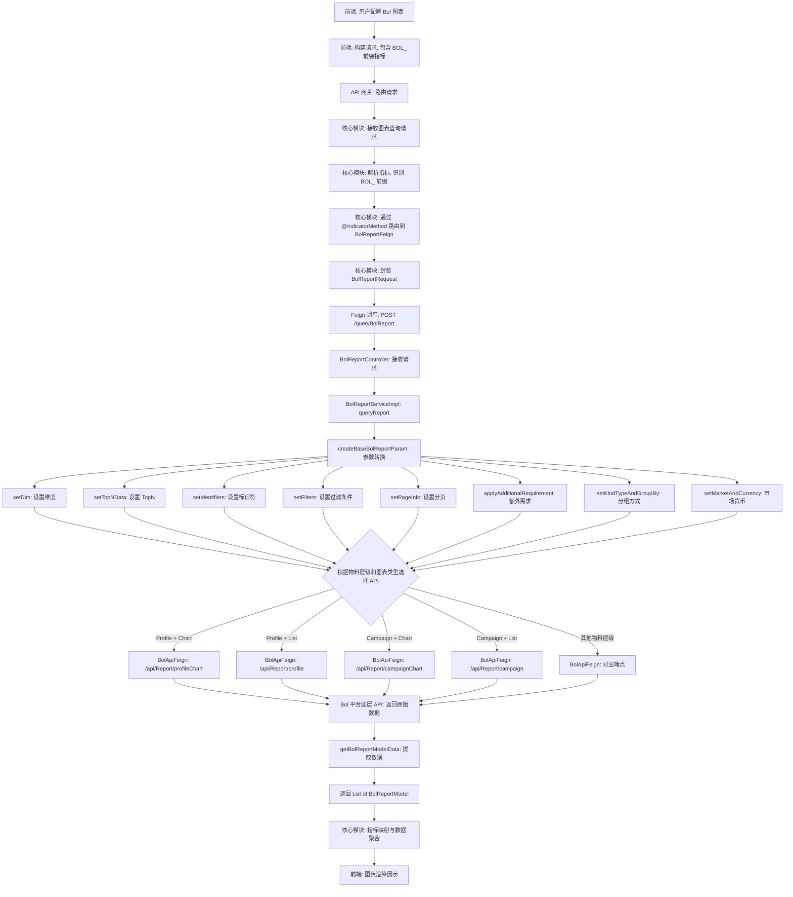
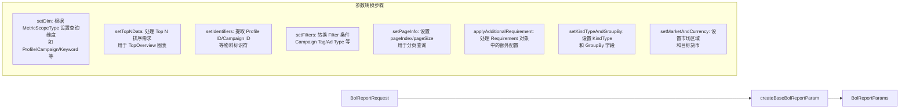

# Bol 平台模块 功能逻辑文档

> 本文档由 document-automation 工具自动生成，基于源代码、PRD 文档和技术评审文档。
> 生成时间: 2026-04-09 11:18:06
> 准确性评分: 未验证/100

---


# Bol 平台模块 功能逻辑文档

## 1. 模块概述

### 1.1 模块职责与定位

Bol 平台模块（`custom-dashboard-bol`）是 Pacvue Custom Dashboard 系统中专门负责 **Bol 广告平台数据查询与报表生成** 的平台数据提供方（Provider）模块。Bol 是荷兰及比利时最大的在线零售平台之一，该模块的核心职责是：

1. **对外暴露 Feign 接口**：通过 `BolReportFeign` 接口向 Custom Dashboard 核心模块提供标准化的报表查询能力，使核心模块能够以统一的方式获取 Bol 平台的广告绩效数据。
2. **调用下游 Bol API**：通过 `BolApiFeign` SDK 客户端调用 Bol 平台底层 API（如 `/api/Report/profile`、`/api/Report/campaign` 等），获取原始绩效数据。
3. **请求参数转换与适配**：将 Custom Dashboard 统一的请求格式（`BolReportRequest`）转换为 Bol 平台 API 所需的参数格式（`BolReportParams`），包括维度设置、过滤条件、分页信息、分组方式等。
4. **指标映射与数据标准化**：将 Bol 平台返回的原始数据映射为 Custom Dashboard 统一的指标体系（如 `BOL_IMPRESSION`、`BOL_CLICK`、`BOL_ACOS` 等 14 个核心指标）。

### 1.2 系统架构位置与上下游关系

```
┌─────────────────────────────────────────────────────────────────┐
│                        前端 (Vue)                                │
│  metricsList/bol.js → 指标定义 → 发起图表查询请求                  │
└──────────────────────────────┬──────────────────────────────────┘
                               │ HTTP 请求
                               ▼
┌─────────────────────────────────────────────────────────────────┐
│                    API 网关 (Gateway)                            │
└──────────────────────────────┬──────────────────────────────────┘
                               │ 路由
                               ▼
┌─────────────────────────────────────────────────────────────────┐
│              Custom Dashboard 核心模块                            │
│  (ChartQueryService → 指标路由 → 识别 BOL_ 前缀指标)              │
│  通过 @IndicatorProvider / @IndicatorMethod 注解自动发现           │
│  BolReportFeign 并发起 Feign 调用                                 │
└──────────────────────────────┬──────────────────────────────────┘
                               │ Feign RPC
                               ▼
┌─────────────────────────────────────────────────────────────────┐
│           custom-dashboard-bol 模块 (本模块)                      │
│  BolReportController → BolReportServiceImpl                      │
│  → AbstractDataFetcher → 参数构建                                 │
└──────────────────────────────┬──────────────────────────────────┘
                               │ Feign RPC (BolApiFeign)
                               ▼
┌─────────────────────────────────────────────────────────────────┐
│              Bol 平台底层 API 服务                                 │
│  /api/Report/profile                                             │
│  /api/Report/profileChart                                        │
│  /api/Report/campaign                                            │
│  /api/Report/campaignChart                                       │
│  (以及 keyword、product 等其他端点)                                │
└─────────────────────────────────────────────────────────────────┘
```

**上游调用方**：Custom Dashboard 核心模块通过 `BolReportFeign` Feign 接口调用本模块。核心模块基于 `@IndicatorProvider` 和 `@IndicatorMethod` 注解机制自动发现本模块能够提供的指标类型和支持的物料层级范围。

**下游依赖**：本模块通过 `BolApiFeign`（包路径 `com.pacvue.bol.sdk.BolApiFeign`）调用 Bol 平台底层 API 服务，获取实际的广告绩效数据。

### 1.3 涉及的后端模块与前端组件

**后端模块**：
- Maven 模块名：`custom-dashboard-bol`
- 核心包路径：
  - `com.pacvue.bol.controller` — 控制器层
  - `com.pacvue.bol.service` — 服务接口层
  - `com.pacvue.bol.service.Impl` — 服务实现层
  - `com.pacvue.bol.entity.request` — 请求实体
  - `com.pacvue.feign.bol` — Feign 接口定义（位于公共 feign 模块）
  - `com.pacvue.feign.dto.request.bol` — Feign 请求 DTO
  - `com.pacvue.feign.dto.response.bol` — Feign 响应 DTO
  - `com.pacvue.bol.sdk` — Bol 平台 SDK（包含 `BolApiFeign`）

**前端组件**：
- `metricsList/bol.js` — Bol 平台前端指标定义与映射配置文件

### 1.4 Maven 坐标与部署方式

- 服务名称：`custom-dashboard-bol`（对应 Feign 客户端配置 `${feign.client.custom-dashboard-bol:custom-dashboard-bol}`）
- 部署方式：作为独立微服务部署，通过 Spring Cloud 服务注册与发现机制（**待确认**具体注册中心类型，推测为 Nacos 或 Eureka）对外提供服务
- 默认端口：**待确认**（代码注释中出现 `url = "http://localhost:9001"` 作为本地调试地址）

---

## 2. 用户视角

### 2.1 功能场景概述

根据 PRD 文档（Custom Dashboard V2.10 PRD），Bol 平台作为 Custom Dashboard 的 Rollout 平台之一被引入系统。用户可以在 Custom Dashboard 中创建包含 Bol 平台广告数据的图表，查看和分析 Bol 广告投放的绩效表现。

#### 场景一：创建包含 Bol 指标的图表

**操作流程**：

1. **进入 Dashboard 编辑页面**：用户打开一个已有的 Dashboard 或创建新的 Dashboard。
2. **添加新图表**：点击添加图表按钮，选择图表类型（支持 Line、Bar、Table、Top Overview、Pie 五种图表类型）。
3. **选择平台**：在 Scope Setting 中选择 **Bol** 平台。
4. **选择物料层级**：根据需求选择物料层级，Bol 平台支持以下层级：
   - Profile
   - Campaign
   - Campaign Tag / Campaign Parent Tag
   - Keyword / Keyword Tag / Keyword Parent Tag
   - Product / Product Tag / Product Parent Tag
   - Search Term
   - Filter-linked Campaign
5. **选择指标**：从 Bol 平台的指标列表中选择需要展示的指标（共 14 个指标，详见 2.2 节）。
6. **配置筛选条件**：设置 Profile、Campaign Tag 等筛选条件（根据物料层级与 Filter 的联动关系）。
7. **设置日期范围**：选择数据查询的时间范围。
8. **保存并查看**：保存图表配置后，系统自动发起数据查询请求，展示 Bol 平台的广告绩效数据。

#### 场景二：查看 Bol 平台绩效数据

**操作流程**：

1. **打开 Dashboard**：用户打开包含 Bol 图表的 Dashboard。
2. **系统自动加载数据**：前端根据图表配置中的指标（以 `BOL_` 前缀标识）和物料层级，构建请求参数。
3. **数据展示**：根据图表类型展示数据：
   - **Overview（Top Overview）**：展示关键指标的汇总值和同比/环比变化。
   - **Trend Chart（Line）**：展示指标随时间的变化趋势，支持 Daily/Weekly/Monthly 时间粒度。
   - **Comparison Chart（Bar）**：支持按汇总、同比/环比等多种模式对比数据。
   - **Pie Chart**：展示各维度（如不同 Campaign）在某指标上的占比分布。
   - **Table**：以表格形式展示详细的物料级别绩效数据，支持分页和排序。

#### 场景三：Bol 平台 Filter 联动

根据技术评审文档中的 Bol 平台物料和 Filter 联动逻辑表：

| Material Level | Profile Filter | Campaign Tag Filter |
|---|---|---|
| Filter-linked Campaign | ✓ | ✓ |
| Profile | ✓ | ✓ |
| Campaign | ✓ | ✓ |
| Campaign (Parent) Tag | ✓ | ✗ |
| Keyword | ✓ | ✓ |
| Keyword (Parent) Tag | ✓ | ✗ |
| Product | ✓ | ✓ |
| Product (Parent) Tag | ✓ | ✗ |

用户在选择不同物料层级时，可用的 Filter 选项会根据上表进行联动控制。例如，当物料层级为 Campaign (Parent) Tag 时，Campaign Tag Filter 不可用。

### 2.2 Bol 平台支持的指标

Bol 平台共支持 14 个广告绩效指标，广告类型为 SearchAd：

| 指标标签 | 指标值（枚举） | 数据格式 | 说明 |
|---|---|---|---|
| Impression | BOL_IMPRESSION | Number | 广告展示次数 |
| Clicks | BOL_CLICK | Number | 广告点击次数 |
| CTR | BOL_CTR | Percent | 点击率（Click-Through Rate） |
| Spend | BOL_SPEND | Money | 广告花费 |
| CPC | BOL_CPC | Money | 每次点击成本（Cost Per Click） |
| CPA | BOL_CPA | Money | 每次转化成本（Cost Per Acquisition） |
| CVR | BOL_CVR | Percent | 转化率（Conversion Rate） |
| ACOS | BOL_ACOS | Percent | 广告销售成本比（Advertising Cost of Sales） |
| ROAS | BOL_ROAS | Money | 广告投资回报率（Return on Ad Spend） |
| Sales | BOL_SALES | Money | 广告带来的销售额 |
| Orders | BOL_ORDERS | Number | 广告带来的订单数 |
| Same EAN Orders | BOL_SAME_EAN_ORDERS | Number | 同 EAN（欧洲商品编号）订单数 |
| Other Orders | BOL_OTHER_ORDERS | Number | 其他订单数 |
| AOV | BOL_AOV | Money | 平均订单价值（Average Order Value） |

### 2.3 UI 交互要点

根据 Figma 设计稿和系统通用设计：

- **指标选择器**：在图表编辑的 Scope Setting 面板中，用户可以从 Bol 平台的指标分组中选择指标。指标按 SearchAd 广告类型分组展示。
- **物料层级选择器**：下拉选择框，展示 Bol 平台支持的物料层级列表。
- **Filter 面板**：根据所选物料层级动态展示可用的筛选条件（Profile、Campaign Tag 等）。
- **Table 图表**：支持 Keyword 等物料层级的表格展示，包含指标列和物料信息列（如 Figma 中展示的 Keyword + Select ASIN 结构）。

---

## 3. 核心 API

### 3.1 对外暴露的 Feign 接口

#### 3.1.1 查询 Bol 平台报表数据

- **路径**: `POST /queryBolReport`
- **接口定义**: `BolReportFeign.queryBolReport()`
- **Feign 客户端配置**:
  ```java
  @FeignClient(
      name = "${feign.client.custom-dashboard-bol:custom-dashboard-bol}",
      contextId = "custom-dashboard-bol-advertising",
      configuration = FeignRequestInterceptor.class
  )
  ```
- **注解元数据**:
  ```java
  @IndicatorMethod(
      value = {
          MetricType.BOL_IMPRESSION, MetricType.BOL_CLICK, MetricType.BOL_CTR,
          MetricType.BOL_SPEND, MetricType.BOL_CPC, MetricType.BOL_CPA,
          MetricType.BOL_CVR, MetricType.BOL_ACOS, MetricType.BOL_ROAS,
          MetricType.BOL_SALES, MetricType.BOL_ORDERS, MetricType.BOL_SAME_EAN_ORDERS,
          MetricType.BOL_OTHER_ORDERS, MetricType.BOL_AOV
      },
      scopes = {
          MetricScopeType.FilterLinkedCampaign, MetricScopeType.Profile,
          MetricScopeType.Campaign, MetricScopeType.CampaignTag,
          MetricScopeType.CampaignParentTag, MetricScopeType.Product,
          MetricScopeType.ProductTag, MetricScopeType.ProductParentTag,
          MetricScopeType.Keyword, MetricScopeType.KeywordTag,
          MetricScopeType.KeywordParentTag, MetricScopeType.SearchTerm
      },
      platforms = {Platform.Bol},
      requestType = BolReportRequest.class
  )
  ```
- **参数**: `BolReportRequest reportParams`（请求体，JSON 格式）
  - 继承自 `BaseRequest`，包含通用的查询参数（日期范围、Profile 列表、物料层级、指标列表、分页信息等）
  - Bol 特有字段：**待确认**（`BolReportRequest` 的完整字段定义未在代码片段中完全展示）
- **返回值**: `List<BolReportModel>`
  - `BolReportModel` 继承自 `BolReportDataBase`，包含 Bol 平台的绩效指标字段
- **说明**: 这是 Bol 平台模块对外暴露的唯一 Feign 接口。Custom Dashboard 核心模块通过 `@IndicatorProvider` 和 `@IndicatorMethod` 注解机制自动发现该接口，当图表查询涉及 `BOL_` 前缀的指标时，核心模块会自动路由到此接口。

### 3.2 下游 Bol API 接口（BolApiFeign）

本模块通过 `BolApiFeign`（位于 `com.pacvue.bol.sdk` 包）调用 Bol 平台底层 API 服务。以下是已确认的端点：

#### 3.2.1 获取 Profile 图表数据

- **路径**: `POST /api/Report/profileChart`
- **参数**: `BolReportParams params`
- **返回值**: `BaseResponse<ListResponse<BolReportModel>>`
- **说明**: 获取 Profile 维度的图表数据（趋势图等），返回列表形式的数据。

#### 3.2.2 获取 Profile 列表数据

- **路径**: `POST /api/Report/profile`
- **参数**: `BolReportParams params`
- **返回值**: `BaseResponse<PageResponse<BolReportModel>>`
- **说明**: 获取 Profile 维度的列表数据（表格等），返回分页形式的数据。

#### 3.2.3 获取 Campaign 图表数据

- **路径**: `POST /api/Report/campaignChart`
- **参数**: `BolReportParams params`
- **返回值**: `BaseResponse<ListResponse<BolReportModel>>`
- **说明**: 获取 Campaign 维度的图表数据，返回列表形式的数据。

#### 3.2.4 获取 Campaign 列表数据

- **路径**: `POST /api/Report/campaign`
- **参数**: `BolReportParams params`
- **返回值**: `BaseResponse<PageResponse<BolReportModel>>`
- **说明**: 获取 Campaign 维度的列表数据，返回分页形式的数据。

#### 3.2.5 其他端点（推测）

根据模块骨架信息中提到的物料维度（keyword、product、campaign tag），推测还存在以下端点（**待确认**）：

- `POST /api/Report/keyword` — 获取 Keyword 列表数据
- `POST /api/Report/keywordChart` — 获取 Keyword 图表数据
- `POST /api/Report/product` — 获取 Product 列表数据
- `POST /api/Report/productChart` — 获取 Product 图表数据
- `POST /api/Report/searchTerm` — 获取 Search Term 数据
- `POST /api/Report/campaignTag` — 获取 Campaign Tag 数据

### 3.3 前端调用方式

前端通过 `metricsList/bol.js` 文件定义 Bol 平台的指标配置。当用户在图表中选择 Bol 平台的指标时，前端将指标值（如 `BOL_IMPRESSION`）包含在请求参数中发送给 Custom Dashboard 核心模块。核心模块根据指标的 `@IndicatorMethod` 注解自动路由到 `BolReportFeign` 接口。

前端不直接调用 `custom-dashboard-bol` 模块的 API，而是通过核心模块的统一图表查询接口间接调用。

---

## 4. 核心业务流程

### 4.1 主流程：Bol 报表数据查询

以下是从前端发起请求到最终返回数据的完整流程：

**步骤 1：前端构建请求**

前端根据用户在图表编辑器中配置的参数（平台选择 Bol、物料层级、指标列表、日期范围、筛选条件等），构建统一的图表查询请求。请求中包含的指标值以 `BOL_` 为前缀（如 `BOL_IMPRESSION`、`BOL_CLICK` 等）。

**步骤 2：核心模块指标路由**

Custom Dashboard 核心模块接收到图表查询请求后，解析请求中的指标列表。通过 `@IndicatorProvider` 和 `@IndicatorMethod` 注解扫描机制，核心模块识别出 `BOL_` 前缀的指标应由 `BolReportFeign` 接口处理。核心模块将相关参数封装为 `BolReportRequest` 对象。

**步骤 3：Feign 调用 BolReportController**

核心模块通过 `BolReportFeign` Feign 客户端发起 `POST /queryBolReport` 请求，请求体为 `BolReportRequest` 对象。Feign 客户端通过服务注册中心发现 `custom-dashboard-bol` 服务实例，并将请求路由到 `BolReportController`。

**步骤 4：Controller 委托 Service 处理**

`BolReportController` 实现了 `BolReportFeign` 接口，其 `queryBolReport` 方法直接委托给 `BolReportService`（实际实现类为 `BolReportServiceImpl`）的 `queryReport` 方法：

```java
@Override
public List<BolReportModel> queryBolReport(BolReportRequest reportParams) {
    return bolReportService.queryReport(reportParams);
}
```

**步骤 5：Service 构建下游请求参数**

`BolReportServiceImpl` 的 `queryReport` 方法内部调用 `createBaseBolReportParam` 方法，将 `BolReportRequest` 转换为 `BolReportParams`。这个转换过程包含多个子步骤：

1. **`setDim(params, request)`**：设置查询维度（Dimension），根据请求中的物料层级确定数据的聚合维度。
2. **`setTopNData(request)`**：设置 Top N 数据参数，用于 Top Overview 等图表类型的数据筛选。
3. **`setIdentifiers(params, request)`**：设置标识符，包括 Profile ID、Campaign ID 等物料标识。
4. **`setFilters(params, request)`**：设置过滤条件，将前端传入的 Filter 条件（如 Campaign Tag 筛选）转换为下游 API 所需的格式。
5. **`setPageInfo(params, request)`**：设置分页信息（页码、每页大小），用于列表类型的查询。
6. **`applyAdditionalRequirement(request, params)`**：应用额外的需求参数，根据 `Requirement` 对象中的配置进行特殊处理。
7. **`setKindTypeAndGroupBy(params, request)`**：设置数据类型和分组方式，决定数据按什么维度进行分组（如按日期、按 Campaign 等）。
8. **`setMarketAndCurrency(params, request)`**：设置市场和货币信息，用于数据的货币转换。

**步骤 6：调用下游 Bol API**

根据请求中的物料层级和图表类型，`BolReportServiceImpl` 选择调用 `BolApiFeign` 的不同端点：

- 如果物料层级为 **Profile** 且需要图表数据 → 调用 `getBolProfileChart(params)`
- 如果物料层级为 **Profile** 且需要列表数据 → 调用 `getBolProfileList(params)`
- 如果物料层级为 **Campaign** 且需要图表数据 → 调用 `getBolCampaignChart(params)`
- 如果物料层级为 **Campaign** 且需要列表数据 → 调用 `getBolCampaignList(params)`
- 其他物料层级类推（Keyword、Product、Search Term、Campaign Tag 等）

**步骤 7：提取响应数据**

下游 API 返回 `BaseResponse<PageResponse<BolReportModel>>` 或 `BaseResponse<ListResponse<BolReportModel>>` 格式的响应。`BolReportServiceImpl` 通过继承自 `AbstractDataFetcher` 的 `getBolReportModelData` 方法提取实际数据：

```java
protected static List<BolReportModel> getBolReportModelData(
    BaseResponse<List<BolReportModel>> advertiserTotal) {
    if (advertiserTotal == null) {
        return null;
    }
    return advertiserTotal.getData();
}
```

**步骤 8：返回数据给核心模块**

提取后的 `List<BolReportModel>` 数据通过 Controller 返回给核心模块。核心模块根据 `BolReportModel` 中的 `@IndicatorField` 注解将数据映射到对应的指标，并进行后续的数据聚合、格式化和图表渲染。

### 4.2 主流程 Mermaid 流程图



### 4.3 参数转换流程详解

`createBaseBolReportParam` 方法是整个模块的核心参数转换逻辑，以下是每个子步骤的详细说明：



### 4.4 设计模式说明

#### 4.4.1 接口-实现分离模式

- `BolReportService`（接口）定义了 `queryReport(BolReportRequest)` 方法签名
- `BolReportServiceImpl`（实现类）提供具体的业务逻辑实现
- 这种分离便于单元测试中的 Mock 替换，也符合 Spring 的依赖注入最佳实践

#### 4.4.2 Feign 声明式客户端模式

- **对外暴露**：`BolReportFeign` 接口使用 `@FeignClient` 注解声明，核心模块通过该接口以声明式方式调用本模块
- **调用下游**：`BolApiFeign` 接口同样使用 `@FeignClient` 注解声明，本模块通过该接口调用 Bol 平台底层 API
- 两层 Feign 客户端形成了清晰的服务边界

#### 4.4.3 模板方法模式（AbstractDataFetcher）

`BolReportServiceImpl` 继承（或使用）`AbstractDataFetcher` 抽象类，该抽象类提供了通用的数据获取方法：

- `getBolReportModelData(BaseResponse<List<BolReportModel>>)` — 从 `BaseResponse` 中提取数据的通用方法
- 子类可以复用这些通用方法，同时实现特定的数据获取逻辑

#### 4.4.4 注解驱动的指标路由机制

- `@IndicatorProvider` — 标注在 `BolReportFeign` 接口上，声明该接口是一个指标数据提供者
- `@IndicatorMethod` — 标注在 `queryBolReport` 方法上，声明该方法能够提供哪些指标（`value`）、支持哪些物料层级（`scopes`）、适用于哪个平台（`platforms`）、使用什么请求类型（`requestType`）
- 核心模块在启动时扫描所有 `@IndicatorProvider` 接口，建立指标到 Feign 方法的映射关系，运行时根据请求中的指标自动路由

---

## 5. 数据模型

### 5.1 数据库表结构

根据代码片段分析，Bol 平台模块**不直接操作数据库表**。数据查询通过 `BolApiFeign` 调用 Bol 平台底层 API 服务完成，底层 API 服务负责实际的数据库查询。

根据技术评审文档中的小平台绩效表迁 CK 信息，Bol 平台的数据库表结构**待确认**（Bol 未出现在迁移列表中，可能仍使用原有的 SQL Server 数据库或其他存储方案）。

根据 Confluence 文档，Bol 平台涉及以下物料维度的数据查询：
- Profile
- Campaign
- Keyword
- Product
- Campaign Tag
- Search Term

这些维度对应的底层数据表名**待确认**。

### 5.2 Material_Level 配置表

根据技术评审文档，系统使用 `Material_Level` 表存储各平台支持的物料层级配置：

| 字段名 | 类型 | 描述 |
|---|---|---|
| id | INT | 主键，自增 |
| product_line | VARCHAR(255) | 产品线（如 "Bol"） |
| material_type | VARCHAR(255) | 物料类型，前端展示名称 |
| value | VARCHAR(255) | 前端传递给后端的 value |
| material_Info | TEXT | JSON 存储相关信息 |
| mode | INT | 模式，0 = test、1 = product |

Bol 平台在该表中的配置记录**待确认**，但根据 `@IndicatorMethod` 注解中的 `scopes` 定义，应包含 Profile、Campaign、CampaignTag、CampaignParentTag、Product、ProductTag、ProductParentTag、Keyword、KeywordTag、KeywordParentTag、SearchTerm、FilterLinkedCampaign 等物料层级。

### 5.3 核心 DTO/VO 类

#### 5.3.1 BolReportRequest（请求 DTO）

- **包路径**: `com.pacvue.feign.dto.request.bol.BolReportRequest`
- **继承关系**: 继承自 `BaseRequest`
- **说明**: 核心模块向 Bol 模块发起查询时使用的请求对象

`BaseRequest` 中的通用字段（**推测，待确认完整定义**）：
| 字段 | 类型 | 说明 |
|---|---|---|
| profileIds | List | Profile ID 列表 |
| startDate | String/LocalDate | 查询开始日期 |
| endDate | String/LocalDate | 查询结束日期 |
| metricTypes | List<MetricType> | 请求的指标类型列表 |
| scopeType | MetricScopeType | 物料层级类型 |
| requirement | Requirement | 图表需求配置（图表类型、时间粒度等） |
| filters | Object | 筛选条件 |
| pageIndex | Integer | 页码 |
| pageSize | Integer | 每页大小 |

`BolReportRequest` 特有字段（**待确认**）：
| 字段 | 类型 | 说明 |
|---|---|---|
| campaignIds | List | Campaign ID 列表 |
| campaignTagIds | List | Campaign Tag ID 列表 |
| keywordIds | List | Keyword ID 列表 |
| productIds | List | Product ID 列表 |

#### 5.3.2 BolReportParams（内部请求参数）

- **包路径**: `com.pacvue.bol.entity.request.BolReportParams`
- **说明**: 调用 Bol 平台底层 API 时使用的请求参数对象，由 `createBaseBolReportParam` 方法从 `BolReportRequest` 转换而来

字段（**推测，待确认完整定义**）：
| 字段 | 类型 | 说明 |
|---|---|---|
| dim | String | 查询维度 |
| identifiers | Object | 物料标识符 |
| filters | Object | 过滤条件 |
| pageIndex | Integer | 页码 |
| pageSize | Integer | 每页大小 |
| kindType | String | 数据类型 |
| groupBy | String | 分组方式 |
| market | String | 市场区域 |
| currency | String | 货币类型 |

#### 5.3.3 BolReportDataBase（响应基类）

- **包路径**: `com.pacvue.feign.dto.response.bol.BolReportDataBase`
- **说明**: Bol 报表数据的基类，包含时间分段和基础指标字段

关键注解：
- `@IndicatorField` — 标注字段对应的指标类型（`MetricType`）
- `@TimeSegmentField` — 标注时间分段字段

字段（根据代码片段中的导入推测）：
| 字段 | 类型 | 注解 | 说明 |
|---|---|---|---|
| date | String | @TimeSegmentField(TimeSegment.DAILY) | 日期字段 |
| week | String | @TimeSegmentField(TimeSegment.WEEKLY) | 周字段 |
| month | String | @TimeSegmentField(TimeSegment.MONTHLY) | 月字段 |

#### 5.3.4 BolReportModel（响应 DTO）

- **包路径**: `com.pacvue.feign.dto.response.bol.BolReportModel`
- **继承关系**: 继承自 `BolReportDataBase`
- **说明**: Bol 报表数据的完整模型，包含所有 14 个指标字段

字段（根据前端指标定义和 `@IndicatorField` 注解推测）：
| 字段 | 类型 | 注解 | 说明 |
|---|---|---|---|
| impression | BigDecimal | @IndicatorField(MetricType.BOL_IMPRESSION) | 展示次数 |
| click | BigDecimal | @IndicatorField(MetricType.BOL_CLICK) | 点击次数 |
| ctr | BigDecimal | @IndicatorField(MetricType.BOL_CTR) | 点击率 |
| spend | BigDecimal | @IndicatorField(MetricType.BOL_SPEND) | 花费 |
| cpc | BigDecimal | @IndicatorField(MetricType.BOL_CPC) | 每次点击成本 |
| cpa | BigDecimal | @IndicatorField(MetricType.BOL_CPA) | 每次转化成本 |
| cvr | BigDecimal | @IndicatorField(MetricType.BOL_CVR) | 转化率 |
| acos | BigDecimal | @IndicatorField(MetricType.BOL_ACOS) | 广告销售成本比 |
| roas | BigDecimal | @IndicatorField(MetricType.BOL_ROAS) | 广告投资回报率 |
| sales | BigDecimal | @IndicatorField(MetricType.BOL_SALES) | 销售额 |
| orders | BigDecimal | @IndicatorField(MetricType.BOL_ORDERS) | 订单数 |
| sameEanOrders | BigDecimal | @IndicatorField(MetricType.BOL_SAME_EAN_ORDERS) | 同 EAN 订单数 |
| otherOrders | BigDecimal | @IndicatorField(MetricType.BOL_OTHER_ORDERS) | 其他订单数 |
| aov | BigDecimal | @IndicatorField(MetricType.BOL_AOV) | 平均订单价值 |

此外，`BolReportModel` 还可能包含物料维度字段（**待确认**）：
| 字段 | 类型 | 说明 |
|---|---|---|
| profileId | Long | Profile ID |
| profileName | String | Profile 名称 |
| campaignId | Long | Campaign ID |
| campaignName | String | Campaign 名称 |
| keywordId | Long | Keyword ID |
| keywordText | String | Keyword 文本 |
| productId | String | Product ID |
| productName | String | Product 名称 |

注意：`BolReportModel` 使用了 `@JsonProperty` 注解（从导入语句可见），说明部分字段的 JSON 序列化名称可能与 Java 字段名不同，以匹配 Bol 平台 API 的响应格式。

### 5.4 核心枚举

#### 5.4.1 MetricType（指标类型枚举）

Bol 平台相关的枚举值：
```
BOL_IMPRESSION, BOL_CLICK, BOL_CTR, BOL_SPEND, BOL_CPC, BOL_CPA,
BOL_CVR, BOL_ACOS, BOL_ROAS, BOL_SALES, BOL_ORDERS,
BOL_SAME_EAN_ORDERS, BOL_OTHER_ORDERS, BOL_AOV
```

#### 5.4.2 MetricScopeType（物料层级枚举）

Bol 平台支持的物料层级：
```
FilterLinkedCampaign, Profile, Campaign, CampaignTag, CampaignParentTag,
Product, ProductTag, ProductParentTag, Keyword, KeywordTag,
KeywordParentTag, SearchTerm
```

#### 5.4.3 Platform（平台枚举）

```
Bol
```

#### 5.4.4 IndicatorType（指标类型分类）

从 `BolReportDataBase` 的导入可见，使用了 `IndicatorType` 枚举，用于区分指标的计算类型（如求和型、比率型等）。**待确认**具体枚举值。

#### 5.4.5 TimeSegment（时间分段枚举）

从 `BolReportDataBase` 的导入可见，使用了 `TimeSegment` 枚举，用于标识时间分段类型：
```
DAILY, WEEKLY, MONTHLY
```

### 5.5 前端指标配置结构（bol.js）

```javascript
{
  platform: "Bol",
  adType: "SearchAd",
  metrics: [
    { label: "Impression", value: "BOL_IMPRESSION", formType: "Number" },
    { label: "Clicks", value: "BOL_CLICK", formType: "Number" },
    { label: "CTR", value: "BOL_CTR", formType: "Percent" },
    { label: "Spend", value: "BOL_SPEND", formType: "Money" },
    { label: "CPC", value: "BOL_CPC", formType: "Money" },
    { label: "CPA", value: "BOL_CPA", formType: "Money" },
    { label: "CVR", value: "BOL_CVR", formType: "Percent" },
    { label: "ACOS", value: "BOL_ACOS", formType: "Percent" },
    { label: "ROAS", value: "BOL_ROAS", formType: "Money" },
    { label: "Sales", value: "BOL_SALES", formType: "Money" },
    { label: "Orders", value: "BOL_ORDERS", formType: "Number" },
    { label: "Same EAN Orders", value: "BOL_SAME_EAN_ORDERS", formType: "Number" },
    { label: "Other Orders", value: "BOL_OTHER_ORDERS", formType: "Number" },
    { label: "AOV", value: "BOL_AOV", formType: "Money" }
  ],
  supportedCharts: ["line", "bar", "table", "topOverview", "pie"],
  supportedMaterialLevels: ["profile", "campaign", "keyword", "product", "campaign tag"]
}
```

`formType` 决定了前端的数据格式化方式：
- **Number**：整数或小数，无特殊格式
- **Percent**：百分比格式，如 "12.5%"
- **Money**：货币格式，带货币符号和千分位分隔符，如 "€1,234.56"

---

## 6. 平台差异

### 6.1 Bol 平台的特殊性

Bol 平台相较于 Amazon、Walmart 等主流平台，具有以下特殊性：

1. **广告类型单一**：Bol 平台目前仅支持 **SearchAd** 一种广告类型，不像 Amazon 支持 SP/SB/SD/DSP 等多种广告类型。

2. **Bol 特有指标**：
   - **Same EAN Orders（BOL_SAME_EAN_ORDERS）**：Bol 平台特有的指标，表示与广告商品具有相同 EAN（European Article Number，欧洲商品编号）的订单数。这是 Bol 平台归因模型的特殊之处。
   - **Other Orders（BOL_OTHER_ORDERS）**：广告带来的非同 EAN 商品的订单数。
   - **AOV（BOL_AOV）**：平均订单价值，虽然其他平台也有类似概念，但 Bol 将其作为独立指标暴露。

3. **数据获取方式**：Bol 平台的数据通过 SDK 方式（`BolApiFeign`）调用底层 API 获取，而非像 Amazon 等平台通过 MyBatis 直接查询数据库。这意味着 Bol 平台的数据查询性能受限于底层 API 的响应速度。

4. **不涉及 CK 迁移**：根据技术评审文档中的小平台绩效表迁 CK 列表，Bol 平台未出现在迁移计划中，说明其数据存储方案与 Criteo、Target 等平台不同。

### 6.2 指标映射关系

Bol 平台的指标与通用广告指标的映射关系：

| 通用指标概念 | Bol 指标 | 计算方式 |
|---|---|---|
| 展示量 | BOL_IMPRESSION | 直接值 |
| 点击量 | BOL_CLICK | 直接值 |
| 点击率 | BOL_CTR | Click / Impression × 100% |
| 花费 | BOL_SPEND | 直接值（求和） |
| 每次点击成本 | BOL_CPC | Spend / Click |
| 每次转化成本 | BOL_CPA | Spend / Orders |
| 转化率 | BOL_CVR | Orders / Click × 100% |
| 广告成本比 | BOL_ACOS | Spend / Sales × 100% |
| 广告回报率 | BOL_ROAS | Sales / Spend |
| 销售额 | BOL_SALES | 直接值（求和） |
| 订单数 | BOL_ORDERS | 直接值（求和） |
| 同 EAN 订单 | BOL_SAME_EAN_ORDERS | 直接值（求和，Bol 特有） |
| 其他订单 | BOL_OTHER_ORDERS | 直接值（求和，Bol 特有） |
| 平均订单价值 | BOL_AOV | Sales / Orders |

**指标聚合说明**：

在跨平台（Cross Retailer）场景下，不同类型的指标需要不同的聚合方式：
- **求和型指标**（Impression、Click、Spend、Sales、Orders、Same EAN Orders、Other Orders）：直接求和
- **比率型指标**（CTR、CPC、CPA、CVR、ACOS、ROAS、AOV）：需要根据基础指标重新计算，不能直接求和或取平均

这与技术评审文档中提到的 "TOV 中，Sales 要求和，ACOS 要重新算等" 逻辑一致。

### 6.3 Bol 平台与其他平台的物料层级对比

| 物料层级 | Amazon | Walmart | Bol | 说明 |
|---|---|---|---|---|
| Profile | ✓ | ✓ | ✓ | 账户级别 |
| Campaign | ✓ | ✓ | ✓ | 广告活动 |
| Ad Group | ✓ | ✓ | ✗ | Bol 不支持 Ad Group 层级 |
| Campaign Tag | ✓ | ✓ | ✓ | 广告活动标签 |
| Campaign Parent Tag | ✓ | ✓ | ✓ | 广告活动父标签 |
| Keyword | ✓ | ✓ | ✓ | 关键词 |
| Keyword Tag | ✓ | ✓ | ✓ | 关键词标签 |
| Keyword Parent Tag | ✓ | ✓ | ✓ | 关键词父标签 |
| Product | ✓ | ✓ | ✓ | 商品 |
| Product Tag | ✓ | ✓ | ✓ | 商品标签 |
| Product Parent Tag | ✓ | ✓ | ✓ | 商品父标签 |
| Search Term | ✓ | ✓ | ✓ | 搜索词 |
| Filter-linked Campaign | ✓ | ✓ | ✓ | 筛选关联的广告活动 |

### 6.4 平台特有的配置和枚举值

- **Platform 枚举值**: `Platform.Bol`
- **Feign 服务名**: `custom-dashboard-bol`
- **Feign contextId**: `custom-dashboard-bol-advertising`
- **指标前缀**: `BOL_`
- **广告类型**: `SearchAd`（唯一）

---

## 7. 配置与依赖

### 7.1 关键配置项

#### 7.1.1 Feign 客户端配置

```yaml
feign:
  client:
    custom-dashboard-bol: custom-dashboard-bol  # 服务名，默认值
```

该配置通过 `${feign.client.custom-dashboard-bol:custom-dashboard-bol}` 引用，支持通过配置中心（如 Apollo）动态修改服务名。

#### 7.1.2 Feign 拦截器配置

`BolReportFeign` 使用了 `FeignRequestInterceptor.class` 作为配置类，该拦截器负责在 Feign 请求中注入必要的请求头信息（如认证 Token、租户 ID 等）。具体拦截逻辑**待确认**。

#### 7.1.3 其他配置

- 服务端口：**待确认**（本地调试地址为 `http://localhost:9001`）
- 服务注册中心配置：**待确认**
- Apollo 命名空间：**待确认**

### 7.2 Feign 下游服务依赖

#### 7.2.1 BolReportFeign（对外暴露）

| 属性 | 值 |
|---|---|
| 接口全路径 | `com.pacvue.feign.bol.BolReportFeign` |
| 服务名 | `${feign.client.custom-dashboard-bol:custom-dashboard-bol}` |
| contextId | `custom-dashboard-bol-advertising` |
| 配置类 | `FeignRequestInterceptor.class` |
| 方法 | `queryBolReport(BolReportRequest) → List<BolReportModel>` |
| 路径 | `POST /queryBolReport` |

#### 7.2.2 BolApiFeign（调用下游）

| 属性 | 值 |
|---|---|
| 接口全路径 | `com.pacvue.bol.sdk.BolApiFeign` |
| 服务名 | **待确认** |
| 端点列表 | 见 3.2 节 |

BolApiFeign 提供的端点汇总：

| 方法 | 路径 | 返回类型 | 说明 |
|---|---|---|---|
| POST | /api/Report/profileChart | BaseResponse<ListResponse<BolReportModel>> | Profile 图表数据 |
| POST | /api/Report/profile | BaseResponse<PageResponse<BolReportModel>> | Profile 列表数据 |
| POST | /api/Report/campaignChart | BaseResponse<ListResponse<BolReportModel>> | Campaign 图表数据 |
| POST | /api/Report/campaign | BaseResponse<PageResponse<BolReportModel>> | Campaign 列表数据 |

### 7.3 缓存策略

代码片段中未发现 `@Cacheable`、Redis 相关配置或缓存逻辑。Bol 平台模块的缓存策略**待确认**。

考虑到该模块主要是透传查询请求到下游 API，缓存可能在以下层面实现：
- 核心模块层面的查询结果缓存
- Bol 平台底层 API 服务自身的缓存
- **待确认**是否在 `BolReportServiceImpl` 中有本地缓存逻辑

### 7.4 消息队列

代码片段中未发现 Kafka、RabbitMQ 等消息队列的使用。Bol 平台模块是一个同步查询模块，不涉及异步消息处理。

### 7.5 依赖的公共模块

根据 `BolReportServiceImpl` 的导入语句，本模块依赖以下公共模块：

| 模块/包 | 说明 |
|---|---|
| `com.pacvue.base.constatns.CustomDashboardApiConstants` | API 常量定义 |
| `com.pacvue.base.dto.chart.Requirement` | 图表需求配置 DTO |
| `com.pacvue.base.dto.response.BaseResponse` | 统一响应包装类 |
| `com.pacvue.base.enums.core.*` | 核心枚举（MetricType、MetricScopeType、Platform 等） |
| `com.pacvue.base.enums.mapping.MetricMapping` | 指标映射配置 |
| `com.pacvue.base.annotations.IndicatorField` | 指标字段注解 |
| `com.pacvue.base.annotations.IndicatorMethod` | 指标方法注解 |
| `com.pacvue.base.annotations.IndicatorProvider` | 指标提供者注解 |
| `com.pacvue.base.annotations.TimeSegmentField` | 时间分段字段注解 |
| `cn.hutool.core.date.LocalDateTimeUtil` | Hutool 日期工具 |
| `cn.hutool.core.util.ObjectUtil` | Hutool 对象工具 |
| `com.baomidou.mybatisplus.core.toolkit.CollectionUtils` | MyBatis-Plus 集合工具 |
| `com.baomidou.mybatisplus.core.toolkit.ObjectUtils` | MyBatis-Plus 对象工具 |
| `com.google.common.collect.Lists` | Guava 集合工具 |

---

## 8. 版本演进

### 8.1 主要版本变更时间线

#### V2.10 — Bol 平台首次引入

- **变更内容**：Custom Dashboard Rollout to Bol（和 Doordash），首次将 Bol 平台作为数据提供方接入 Custom Dashboard 系统。
- **PRD 来源**：Custom Dashboard V2.10 PRD
- **指标定义**：引入 14 个 Bol 广告绩效指标（BOL_IMPRESSION 至 BOL_AOV）
- **物料层级**：支持 Profile、Campaign、Keyword、Product、Campaign Tag 等 12 种物料层级
- **图表支持**：支持 Line、Bar、Table、Top Overview、Pie 五种图表类型

#### V2.4 — Cross Retailer 支持（技术基础）

- **变更内容**：Custom Dashboard V2.4 引入了 Cross Retailer 功能，为多平台数据聚合奠定了技术基础。
- **技术评审**：定义了 `Material_Level` 表结构，用于存储各平台的物料层级配置。
- **与 Bol 的关系**：Bol 平台的接入复用了 Cross Retailer 的架构设计，包括指标路由机制、多平台数据聚合逻辑等。

#### V2.8 — 平台层设计优化

- **变更内容**：Custom Dashboard V2.8 对平台层设计进行了优化，包括 DSP 平台层设计等。
- **与 Bol 的关系**：Bol 平台的架构设计参考了 V2.8 中确立的平台层设计模式（Feign 接口 + 注解驱动的指标路由）。

### 8.2 待优化项与技术债务

1. **数据库表结构未明确**：Bol 平台的底层数据存储方案在代码片段中未直接体现，需要进一步确认是否需要进行 CK（ClickHouse）迁移。

2. **`getBolReportModelData` 方法的泛型不一致**：代码中 `getBolReportModelData` 方法接收 `BaseResponse<List<BolReportModel>>`，但下游 API 返回的是 `BaseResponse<PageResponse<BolReportModel>>` 或 `BaseResponse<ListResponse<BolReportModel>>`，存在类型转换的中间步骤，具体实现**待确认**。

3. **缺少缓存机制**：当前代码片段中未发现缓存逻辑，对于频繁查询的场景可能存在性能瓶颈。

4. **错误处理机制待完善**：`getBolReportModelData` 方法仅对 `null` 做了判断，对于下游 API 返回错误码的情况处理逻辑**待确认**。

5. **`CustomDashboardApiConstants` 中的常量拼写**：包名

---

*本文档由 AI 自动生成，如有不准确之处请以源代码为准。标注"待确认"的内容需要人工核实。*