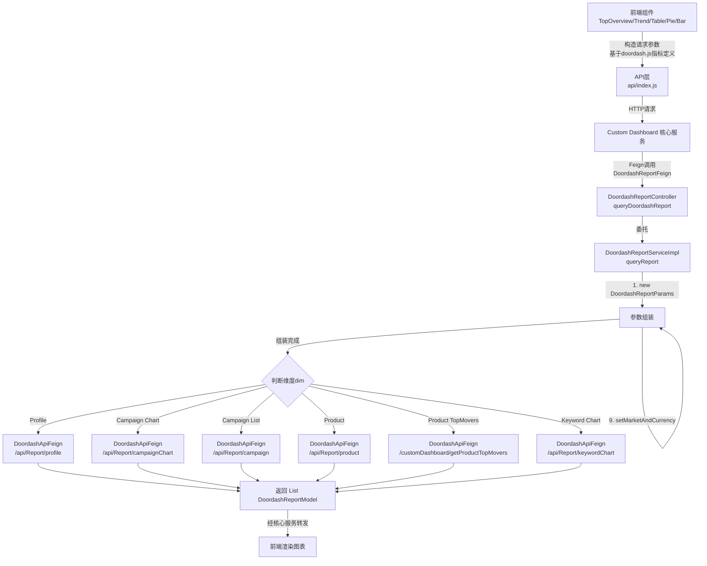
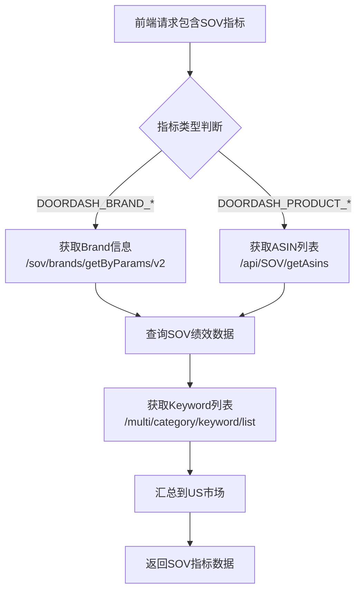
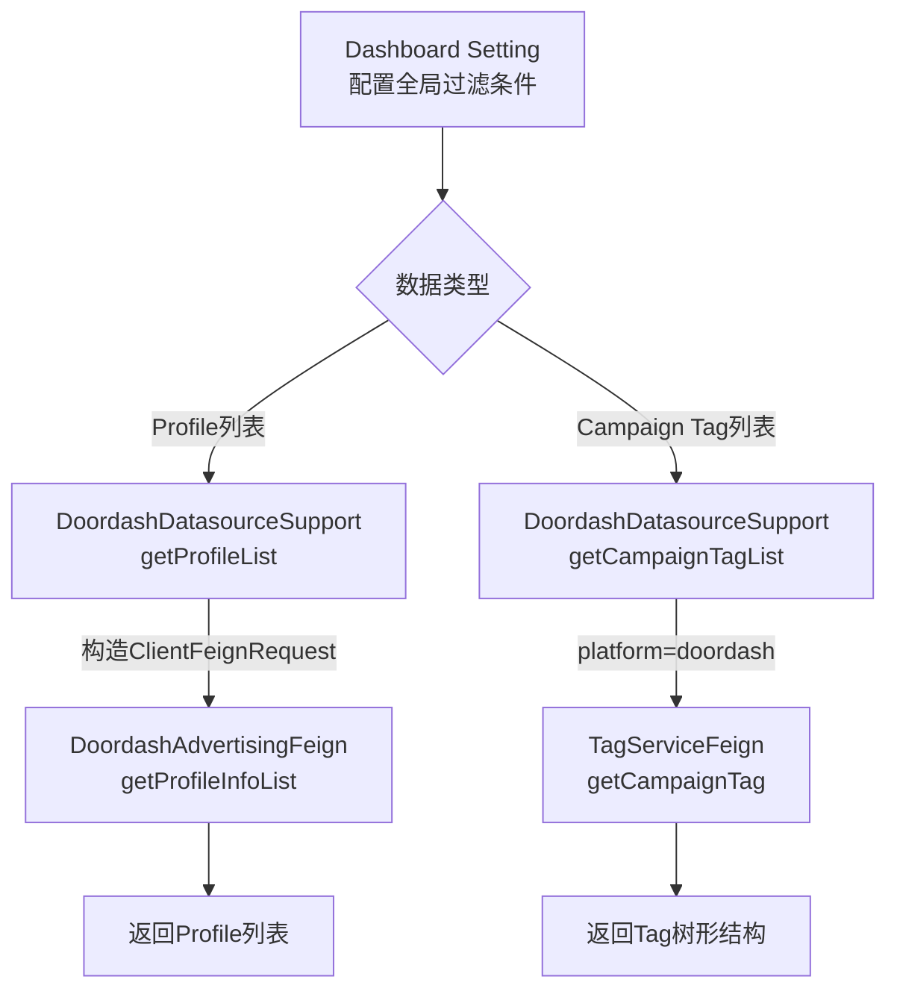

# Doordash 平台模块 功能逻辑文档

> 本文档由 document-automation 工具自动生成，基于源代码、PRD 文档和技术评审文档。
> 生成时间: 2026-04-09 13:13:49
> 准确性评分: 未验证/100

---


# Doordash 平台模块 功能逻辑文档

## 1. 模块概述

### 1.1 模块职责与定位

Doordash 平台模块是 Pacvue Custom Dashboard 系统中负责 Doordash 广告平台数据查询与指标映射的专用子模块。其核心职责是：

1. **接收来自其他微服务的报表查询请求**：通过 Feign 接口暴露统一的报表查询入口，供 Custom Dashboard 核心服务调用。
2. **将前端指标请求转换为 Doordash 内部 API 调用**：根据请求中的维度（Profile/Campaign/Product/Keyword）、过滤条件、分页信息等，组装 Doordash 平台内部 API 所需的参数。
3. **支持多维度报表查询**：包括 Profile 级别、Campaign 级别、Product 级别、Keyword 级别的广告绩效数据查询。
4. **支持 SOV（Share of Voice）指标展示**：通过调用 SOV 相关 Feign 接口，提供品牌级和产品级的 SOV 指标数据。
5. **提供平台基础数据支持**：包括 Profile 列表、Campaign Tag 列表等数据源查询，供 Dashboard 全局设置和图表配置使用。

### 1.2 系统架构位置与上下游关系

```
┌─────────────────────────────────────────────────────────────────┐
│                        前端 (Vue)                                │
│  metricsList/doordash.js → API 层 → Custom Dashboard 核心服务    │
└──────────────────────────────┬──────────────────────────────────┘
                               │ HTTP / Feign
                               ▼
┌─────────────────────────────────────────────────────────────────┐
│              Custom Dashboard 核心服务 (Gateway)                  │
│         根据平台类型路由到对应平台模块                               │
└──────────────────────────────┬──────────────────────────────────┘
                               │ Feign (DoordashReportFeign)
                               ▼
┌─────────────────────────────────────────────────────────────────┐
│           custom-dashboard-doordash 模块 (本模块)                 │
│  DoordashReportController → DoordashReportServiceImpl            │
│  DoordashDatasourceSupport                                       │
└──────────┬──────────────┬──────────────┬───────────────────────┘
           │              │              │
           ▼              ▼              ▼
   DoordashApiFeign  DoordashSovFeign  DoordashAdvertisingFeign
   (广告报表API)     (SOV数据API)      (Profile等基础数据API)
           │              │              │
           ▼              ▼              ▼
┌─────────────────────────────────────────────────────────────────┐
│              Doordash 平台内部服务 / SOV Service                   │
└─────────────────────────────────────────────────────────────────┘
```

**上游调用方**：
- Custom Dashboard 核心服务（通过 `DoordashReportFeign` 接口调用）
- 前端组件（间接调用，通过核心服务转发）

**下游依赖**：
- `DoordashApiFeign`：Doordash 平台广告报表 API（Profile/Campaign/Product/Keyword 报表）
- `DoordashSovFeign`：SOV 服务（Brand/Keyword/ASIN 的 SOV 数据）
- `DoordashAdvertisingFeign`：Doordash 广告基础数据（Profile 列表等）
- `TagServiceFeign`：标签服务（Campaign Tag 列表）

### 1.3 涉及的后端模块与前端组件

**后端 Maven 模块**：
- `custom-dashboard-doordash`：本模块，包含 Controller、Service、Entity 等
- `com.pacvue.feign.doordash`：Feign 接口定义模块，包含 `DoordashReportFeign`
- `com.pacvue.feign.dto.request.doordash`：请求 DTO 模块，包含 `DoordashReportRequest`
- `com.pacvue.feign.dto.response.doordash`：响应 DTO 模块，包含 `DoordashReportModel`、`DoordashReportDataBase`
- `com.pacvue.base`：基础模块，包含枚举（`MetricType`、`IndicatorType`、`Platform`）、注解（`@IndicatorField`、`@TimeSegmentField`）、DTO 基类（`BaseRequest`）等

**前端组件**：
- `metricsList/doordash.js`：Doordash 指标定义文件，包含 SearchAd 和 SOV 两大类指标
- `hooks.js` 中的 `showRetailer_PlatformTable`：平台过滤逻辑，Doordash 不支持 ASINTag 维度
- `viewSample.js`：Dashboard 示例数据，包含 TopOverview/LineChart/Table/PieChart/BarChart 组件配置
- `api/index.js`：API 请求封装

### 1.4 Maven 坐标与部署方式

- **Maven 模块名**：`custom-dashboard-doordash`
- **包路径**：`com.pacvue.doordash`（Controller、Service）
- **部署方式**：作为独立微服务部署，通过 Spring Cloud Feign 进行服务间通信（**待确认**具体部署拓扑，可能与其他平台模块共同部署或独立部署）

---

## 2. 用户视角

### 2.1 功能场景概述

基于 PRD 文档和代码分析，Doordash 平台模块在 Custom Dashboard 中支持以下功能场景：

#### 场景一：创建包含 Doordash 指标的 Dashboard

**操作流程**：
1. 用户在 Custom Dashboard 列表页点击创建新 Dashboard。
2. 在 Dashboard Setting 中，选择平台为 Doordash。
3. 配置全局过滤条件：选择 Profile（必选）、Campaign Tag（可选）、Ad Type（可选）。
4. 设置日期范围（支持自定义日期或预设日期范围）。
5. 设置货币转换（支持 USD 等货币）。
6. 保存 Dashboard 设置。

#### 场景二：添加图表组件并选择 Doordash 指标

**操作流程**：
1. 在 Dashboard 编辑模式下，添加图表组件（支持 TopOverview、Trend Chart、Comparison Chart、Table、Pie Chart、Bar Chart）。
2. 在图表设置中选择物料层级（Material Level）：
   - **Profile**：按广告账户维度查看数据
   - **Campaign**：按广告活动维度查看数据
   - **Product**：按产品维度查看数据
   - **Keyword**：按关键词维度查看数据
   - **注意**：Doordash **不支持 ASINTag 维度**（由前端 `hooks.js` 中 `showRetailer_PlatformTable` 逻辑控制）
3. 选择指标（Metrics），可选指标分为两大类：
   - **SearchAd 类指标**：Impression、Click、CTR、Spend、CPC、CPA、CVR、ACOS、ROAS、Sales、Orders、Sale Units、NTB Orders、NTB Sales、NTB Sales Percent、CPM、AOV 等
   - **SOV 类指标**：Brand Total SOV、Brand Paid SOV、Brand SP SOV、Brand Top of Search SP SOV、Brand Ads Frequency、Brand Organic SOV、Brand Top 5/10/15 SOV、Product Total SOV、Product SP SOV、Product Avg Position 等
4. 配置物料范围（Data Scope）：选择具体的 Profile、Campaign、Product 或 Keyword。
5. 保存图表配置。

#### 场景三：查看 Doordash 报表数据

**操作流程**：
1. 用户打开已配置的 Dashboard。
2. 系统根据图表配置自动发起数据查询请求。
3. 前端根据 `doordash.js` 中定义的指标构造请求参数。
4. 后端通过 Doordash 平台 API 获取数据并返回。
5. 前端渲染图表（折线图、柱状图、表格、饼图、概览卡片等）。

#### 场景四：SOV 指标查看

**操作流程**：
1. 用户在图表中选择 SOV 类指标。
2. 系统通过 `DoordashSovFeign` 调用 SOV 服务获取数据。
3. SOV 数据支持 Brand 级别和 Product 级别的多种维度：
   - Brand 级别：Total SOV、Paid SOV、SP SOV、Top of Search SP SOV、Ads Frequency、Organic SOV、Top 5/10/15 SOV 等
   - Product 级别：Total SOV、SP SOV、Top of Search SP SOV、Rest of Search SP SOV、Organic SOV、Page 1 Frequency、Top 1/3/6 Frequency、Avg Position 等

#### 场景五：Dashboard 分享与访问

根据 PRD V1.1 文档：
1. 用户可以创建 Share Link 分享 Dashboard。
2. 访问 Share Link 时去掉面包屑和编辑按钮。
3. 如果 Dashboard 被删除，访问链接显示缺省页面。

### 2.2 UI 交互要点

- **指标选择器**：前端 `doordash.js` 定义了所有可选指标，分为 SearchAd 和 SOV 两组，用户在图表配置面板中通过下拉列表或多选框选择。
- **物料层级选择**：Doordash 支持 Profile、Campaign、Product、Keyword 四种物料层级，不支持 ASINTag。
- **日期选择器**：支持 Custom 和 YOY 模式切换。
- **货币转换**：Dashboard 全局设置中可选择目标货币，后端通过 `setMarketAndCurrency` 方法处理。
- **图表类型**：支持 TopOverview（概览卡片）、Trend Chart（趋势图，支持 Daily/Weekly/Monthly）、Comparison Chart（对比图，支持 BySum/YOY Multi/YOY Periods 等模式）、Table（表格）、Pie Chart（饼图）、Bar Chart（柱状图）。

### 2.3 PRD 与代码交叉验证

| PRD 功能点 | 代码实现状态 | 说明 |
|---|---|---|
| Doordash 平台 Rollout（V2.10 PRD） | ✅ 已实现 | `DoordashReportController`、`DoordashReportServiceImpl` 等完整实现 |
| SOV 指标支持（2026Q1S4 技术评审） | ✅ 已实现 | 枚举中定义了完整的 DOORDASH_BRAND_* 和 DOORDASH_PRODUCT_* SOV 指标 |
| 不支持 ASINTag 维度 | ✅ 已实现 | 前端 `hooks.js` 中 `showRetailer_PlatformTable` 过滤逻辑 |
| Dashboard Group 功能（25Q2 Sprint 6） | ✅ 通用功能 | 非 Doordash 特有，属于 Dashboard 通用功能 |
| Cross Retailer 支持（V2.4） | **待确认** | Doordash 是否参与 Cross Retailer 查询需进一步确认 |

---

## 3. 核心 API

### 3.1 Doordash 报表查询入口（对外 Feign 接口）

- **路径**: `POST` **待确认**（由 `DoordashReportFeign` 接口定义，具体路径未在代码片段中完整展示）
- **参数**: `DoordashReportRequest reportParams`
  - 继承自 `BaseRequest`，包含以下字段（基于代码推断）：
    - `toMarket`：目标市场（如 "US"）
    - 维度信息（dim）：指定查询维度（Profile/Campaign/Product/Keyword）
    - 过滤条件（filters）：Profile ID、Campaign ID、日期范围等
    - 分页信息（pageInfo）：页码、每页条数
    - 指标类型（kindType/groupBy）：指定查询的指标分组
    - 其他字段：**待确认**（`DoordashReportRequest` 继承 `BaseRequest`，具体字段需查看完整代码）
- **返回值**: `List<DoordashReportModel>`
  - `DoordashReportModel` 继承自 `DoordashReportDataBase`，包含广告绩效指标字段（详见 5.2 节）
- **说明**: 统一的 Doordash 报表查询入口，由 Custom Dashboard 核心服务通过 Feign 调用

**调用示例**（伪代码）：
```java
@FeignClient(name = "custom-dashboard-doordash")
public interface DoordashReportFeign {
    @PostMapping("/xxx") // 具体路径待确认
    List<DoordashReportModel> queryDoordashReport(@RequestBody DoordashReportRequest reportParams);
}
```

### 3.2 Doordash 平台内部 API（DoordashApiFeign）

以下接口由 `DoordashApiFeign` 定义，供 `DoordashReportServiceImpl` 内部调用：

#### 3.2.1 Profile 报表查询

- **路径**: `POST /api/Report/profile`
- **参数**: `DoordashReportParams params`
- **返回值**: `BaseResponse<PageResponse<DoordashReportModel>>`
- **说明**: 查询 Profile 级别的广告绩效数据，支持分页

#### 3.2.2 Campaign Chart 查询

- **路径**: `POST /api/Report/campaignChart`
- **参数**: `DoordashReportParams params`
- **返回值**: `BaseResponse<ListResponse<DoordashReportModel>>`
- **说明**: 查询 Campaign 级别的趋势图数据（按时间维度聚合），用于 Trend Chart

#### 3.2.3 Campaign 列表查询

- **路径**: `POST /api/Report/campaign`
- **参数**: `DoordashReportParams params`
- **返回值**: `BaseResponse<PageResponse<DoordashReportModel>>`
- **说明**: 查询 Campaign 级别的列表数据，支持分页，用于 Table/Pie Chart

#### 3.2.4 Product 列表查询

- **路径**: `POST /api/Report/product`
- **参数**: `DoordashReportParams params`
- **返回值**: `BaseResponse<PageResponse<DoordashReportModel>>`
- **说明**: 查询 Product 级别的列表数据，支持分页

#### 3.2.5 Product Top Movers 查询

- **路径**: `POST /customDashboard/getProductTopMovers`
- **参数**: `DoordashReportParams params`
- **返回值**: `BaseResponse<PageResponse<DoordashReportModel>>`
- **说明**: 查询 Product 维度的 Top Movers 数据（变化最大的产品）

#### 3.2.6 Keyword Chart 查询

- **路径**: `POST /api/Report/keywordChart`
- **参数**: `DoordashReportParams params`
- **返回值**: `BaseResponse<ListResponse<DoordashReportModel>>`
- **说明**: 查询 Keyword 级别的趋势图数据

### 3.3 SOV 相关 API（DoordashSovFeign）

#### 3.3.1 获取 SOV Brand 信息

- **路径**: `POST /sov/brands/getByParams/v2`
- **请求头**: `accept=application/json`, `productLine=doordash`
- **参数**: `SovBrandFeignRequest request`
- **返回值**: `BaseResponse<BrandInfo>`
- **说明**: 获取 Doordash 平台的 SOV Brand 信息

#### 3.3.2 获取 SOV ASIN 列表

- **路径**: `POST /api/SOV/getAsins`
- **请求头**: `accept=application/json`, `productLine=doordash`
- **参数**: `SovASinFeignRequest request`
- **返回值**: `BaseResponse<List<String>>`
- **说明**: 获取 Doordash 平台的 SOV ASIN 列表

#### 3.3.3 获取 SOV Keyword 列表

- **路径**: `POST /multi/category/keyword/list`
- **请求头**: `accept=application/json`, `productLine=doordash`
- **参数**: `SovKeywordFeignRequest request`
- **返回值**: `BaseResponse<List<SovKeywordResp>>`
- **说明**: 获取 Doordash 平台的 SOV Keyword 列表

### 3.4 平台基础数据 API（DoordashDatasourceSupport）

#### 3.4.1 获取 Profile 列表

- **调用方式**: `DoordashAdvertisingFeign.getProfileInfoList(ClientFeignRequest)`
- **参数**: `ClientRequest request`（包含 userId、clientId）
- **返回值**: `BaseResponse<List<ProfileResp>>`
- **说明**: 获取当前用户/客户下的 Doordash 广告 Profile 列表

#### 3.4.2 获取 Campaign Tag 列表

- **调用方式**: `TagServiceFeign.getCampaignTag("doordash")`
- **参数**: `UserInfo userInfo`
- **返回值**: `BaseResponse<List<TagTreeInfo>>`
- **说明**: 获取 Doordash 平台的 Campaign Tag 树形结构

### 3.5 前端 API 调用

前端通过 `api/index.js` 中封装的通用接口调用后端，具体包括：
- `getLockDateInfo`：获取锁定日期信息
- `checkPassword`：校验 Dashboard 分享密码
- 其他图表数据查询接口（通过 Custom Dashboard 核心服务转发到 Doordash 模块）

---

## 4. 核心业务流程

### 4.1 报表查询主流程

#### 详细步骤描述

**步骤 1：前端构造请求**

前端组件（TopOverview/Trend Chart/Comparison Chart/Table/Pie Chart/Bar Chart）根据用户配置的图表设置，从 `doordash.js` 中获取指标定义（如 `DOORDASH_IMPRESSION`、`DOORDASH_CLICK`、`DOORDASH_SPEND` 等），结合 Dashboard 全局设置（日期范围、Profile 过滤、Campaign Tag 过滤等），构造请求参数并发送到后端。

**步骤 2：核心服务路由**

Custom Dashboard 核心服务接收前端请求后，根据平台类型（Doordash）路由到 `DoordashReportFeign` 接口，通过 Feign 调用 `custom-dashboard-doordash` 微服务。

**步骤 3：Controller 接收请求**

`DoordashReportController` 实现了 `DoordashReportFeign` 接口，接收 `DoordashReportRequest` 参数，直接委托给 `DoordashReportService.queryReport()` 方法处理。

```java
@RestController
public class DoordashReportController implements DoordashReportFeign {
    @Autowired
    private DoordashReportService doordashReportService;

    @Override
    public List<DoordashReportModel> queryDoordashReport(DoordashReportRequest reportParams) {
        return doordashReportService.queryReport(reportParams);
    }
}
```

**步骤 4：Service 组装参数**

`DoordashReportServiceImpl.queryReport()` 方法是核心业务逻辑所在。它通过一系列 `set*` 方法逐步组装 `DoordashReportParams` 对象：

1. **`new DoordashReportParams()`**：创建空的参数对象
2. **`setDim(params, request)`**：设置查询维度（Profile/Campaign/Product/Keyword），决定调用哪个下游 API
3. **`setTopNData(request)`**：设置 Top N 数据参数（用于 Top Movers 等场景）
4. **`setIdentifiers(params, request)`**：设置标识符（如 Profile ID、Campaign ID 等）
5. **`setFilters(params, request)`**：设置过滤条件（日期范围、Campaign Tag、Ad Type 等）
6. **`setPageInfo(params, request)`**：设置分页信息（页码、每页条数）
7. **`applyAdditionalRequirement(request, params)`**：应用额外的查询需求（如 `Requirement` 对象中的特殊配置）
8. **`setKindTypeAndGroupBy(params, request)`**：设置指标类型和分组方式，决定返回数据的聚合粒度
9. **`setMarketAndCurrency(params, request)`**：设置市场和货币转换参数

```java
// 货币转换逻辑
private void setMarketAndCurrency(DoordashReportParams params, DoordashReportRequest request) {
    params.setToMarket(request.getToMarket());
    params.setToCurrencyCode(commonParamsMap.getOrDefault(request.getToMarket(), "USD"));
    params.setCoverCurrencyCode(commonParamsMap.getOrDefault(request.getToMarket(), "USD"));
}
```

**步骤 5：调用下游 API**

根据步骤 4 中设置的维度（dim），`DoordashReportServiceImpl` 通过 `DoordashApiFeign` 调用对应的 Doordash 平台内部 API：

| 维度 | 图表类型 | 调用的 API |
|---|---|---|
| Profile | Table/Pie/Overview | `/api/Report/profile` |
| Campaign | Trend Chart | `/api/Report/campaignChart` |
| Campaign | Table/Pie/Overview | `/api/Report/campaign` |
| Product | Table/Pie/Overview | `/api/Report/product` |
| Product | Top Movers | `/customDashboard/getProductTopMovers` |
| Keyword | Trend Chart | `/api/Report/keywordChart` |

**步骤 6：处理响应数据**

下游 API 返回 `BaseResponse<PageResponse<DoordashReportModel>>` 或 `BaseResponse<ListResponse<DoordashReportModel>>`，`DoordashReportServiceImpl` 提取其中的数据列表，转换为 `List<DoordashReportModel>` 返回给调用方。

**步骤 7：返回前端**

数据经过核心服务转发回前端，前端根据图表类型渲染对应的可视化组件。

#### 主流程 Mermaid 图



### 4.2 SOV 数据查询流程

SOV（Share of Voice）指标的查询流程与广告绩效指标有所不同，它通过 `DoordashSovFeign` 调用独立的 SOV 服务。

**步骤 1：识别 SOV 指标**

前端请求中包含的指标如果属于 `DOORDASH_SOV` 类型（如 `DOORDASH_BRAND_TOTAL_SOV`、`DOORDASH_PRODUCT_TOTAL_SOV` 等），系统识别为 SOV 查询。

**步骤 2：获取 SOV 基础数据**

根据 SOV 指标类型，可能需要先获取：
- Brand 信息：通过 `/sov/brands/getByParams/v2` 获取
- ASIN 列表：通过 `/api/SOV/getAsins` 获取
- Keyword 列表：通过 `/multi/category/keyword/list` 获取

**步骤 3：查询 SOV 绩效数据**

使用获取到的基础数据作为参数，调用 SOV 绩效查询接口获取具体的 SOV 指标值。

**步骤 4：数据汇总**

根据技术评审文档，Doordash SOV 数据全部汇总到 US 市场。



### 4.3 平台数据源支持流程

`DoordashDatasourceSupport` 继承自 `AbstractDatasourceSupport` 并实现 `PlatformDatasourceSupport` 接口，为 Dashboard 全局设置提供 Doordash 平台的基础数据。



### 4.4 设计模式说明

#### 4.4.1 Feign 接口实现模式

`DoordashReportController` 直接实现 `DoordashReportFeign` 接口，这是 Spring Cloud 中常见的 Feign 服务提供者模式。Feign 接口定义在公共模块中，服务提供方通过实现该接口暴露 REST 端点，服务消费方通过注入 Feign 接口进行远程调用。

```
DoordashReportFeign (接口定义，com.pacvue.feign.doordash)
    ↑ implements
DoordashReportController (服务提供方，com.pacvue.doordash.controller)
    ↑ injects
其他微服务 (服务消费方，通过 @FeignClient 注入)
```

#### 4.4.2 接口-实现分离

`DoordashReportService`（接口）与 `DoordashReportServiceImpl`（实现类）分离，遵循依赖倒置原则，便于单元测试和后续扩展。

#### 4.4.3 Builder/组装模式

`DoordashReportServiceImpl` 中通过一系列 `set*` 方法逐步组装 `DoordashReportParams` 对象，类似 Builder 模式但采用过程式调用。每个 `set*` 方法负责一个特定维度的参数设置，职责清晰：

```java
DoordashReportParams params = new DoordashReportParams();
setDim(params, request);           // 维度
setTopNData(request);              // Top N
setIdentifiers(params, request);   // 标识符
setFilters(params, request);       // 过滤条件
setPageInfo(params, request);      // 分页
applyAdditionalRequirement(request, params); // 额外需求
setKindTypeAndGroupBy(params, request);      // 指标类型和分组
setMarketAndCurrency(params, request);       // 市场和货币
```

#### 4.4.4 平台策略模式

`DoordashDatasourceSupport` 通过 `platform()` 方法返回 `Platform.Doordash`，配合工厂模式实现平台级别的策略分发。核心服务根据平台类型自动选择对应的 `PlatformDatasourceSupport` 实现。

---

## 5. 数据模型

### 5.1 数据库表

代码片段中未直接出现表名。`DoordashReportServiceImpl` 引入了 MyBatis-Plus 依赖（`com.baomidou.mybatisplus.core.toolkit.CollectionUtils` 和 `ObjectUtils`），但这些可能仅用于工具方法调用，而非直接的数据库操作。Doordash 模块的数据主要通过 Feign 接口从 Doordash 平台内部服务获取，**本模块可能不直接操作数据库**。

**待确认**：是否存在本地缓存表或中间表用于存储 Doordash 报表数据。

### 5.2 核心 DTO/VO

#### 5.2.1 DoordashReportRequest（请求 DTO）

```java
package com.pacvue.feign.dto.request.doordash;

@EqualsAndHashCode
@Data
public class DoordashReportRequest extends BaseRequest {
    // 继承自 BaseRequest 的字段（待确认完整字段列表）：
    // - toMarket: 目标市场
    // - 日期范围相关字段
    // - 维度信息
    // - 过滤条件
    // - 分页信息
    // - 指标类型
    // - 其他通用字段
}
```

**说明**：`DoordashReportRequest` 继承自 `BaseRequest`，是所有平台报表请求的通用基类。具体字段需查看 `BaseRequest` 的完整定义。基于 `DoordashReportServiceImpl` 中的使用方式，可推断包含以下字段：
- `toMarket`：目标市场（用于货币转换）
- 维度信息（用于 `setDim`）
- 过滤条件（用于 `setFilters`）
- 分页信息（用于 `setPageInfo`）
- 指标类型和分组方式（用于 `setKindTypeAndGroupBy`）
- `Requirement` 对象（用于 `applyAdditionalRequirement`）

#### 5.2.2 DoordashReportParams（内部参数 DTO）

```java
package com.pacvue.doordash.entity.request;

@Data
public class DoordashReportParams {
    // 基于代码推断的字段：
    private String dim;              // 查询维度
    private List<String> filters;    // 过滤条件
    private Integer pageNo;          // 页码
    private Integer pageSize;        // 每页条数
    private String kindType;         // 指标类型
    private String groupBy;          // 分组方式
    private String toMarket;         // 目标市场
    private String toCurrencyCode;   // 目标货币代码
    private String coverCurrencyCode; // 覆盖货币代码
    // 其他字段待确认
}
```

**说明**：`DoordashReportParams` 是调用 Doordash 平台内部 API 的参数对象，由 `DoordashReportServiceImpl` 通过一系列 `set*` 方法组装。

#### 5.2.3 DoordashReportDataBase（响应基类）

```java
package com.pacvue.feign.dto.response.doordash;

@Data
public class DoordashReportDataBase {
    // 使用 @TimeSegmentField 注解标记时间维度字段
    // 使用 @IndicatorField 注解标记指标字段
    // 包含 @JsonProperty 注解用于 JSON 序列化/反序列化
    
    // 基于注解推断的字段类型：
    // - 时间维度字段（TimeSegment 枚举：Daily/Weekly/Monthly）
    // - 指标字段（IndicatorType 枚举）
    // - MetricType 枚举标记指标类型
    // - BigDecimal 类型的数值字段
}
```

#### 5.2.4 DoordashReportModel（响应 DTO）

```java
package com.pacvue.feign.dto.response.doordash;

@Data
@NoArgsConstructor
public class DoordashReportModel extends DoordashReportDataBase {
    // 继承 DoordashReportDataBase 的所有字段
    // 使用 @IndicatorField 注解标记指标字段
    // 使用 @Schema 注解提供 Swagger 文档描述
    // 使用 @JsonProperty 注解处理 JSON 字段映射
    
    // 包含 BigDecimal 类型的广告绩效指标字段（待确认完整列表）：
    // - impression: 展示次数
    // - click: 点击次数
    // - ctr: 点击率
    // - spend: 花费
    // - cpc: 单次点击成本
    // - cpa: 单次转化成本
    // - cvr: 转化率
    // - acos: 广告成本销售比
    // - roas: 广告投资回报率
    // - sales: 销售额
    // - orders: 订单数
    // - saleUnits: 销售单位数
    // - ntbOrders: 新客订单数
    // - ntbSales: 新客销售额
    // - ntbSalesPercent: 新客销售占比
    // - cpm: 千次展示成本
    // - aov: 平均订单价值
}
```

### 5.3 核心枚举

#### 5.3.1 Doordash 广告绩效指标枚举（MetricType 或类似枚举）

基于代码片段中的枚举定义，Doordash 平台的指标分为两大类：

**SearchAd 类指标（DOORDASH 分组）**：

| 枚举值 | 分组 | 说明 |
|---|---|---|
| `DOORDASH_NTB_SALES` | DOORDASH | 新客销售额 |
| `DOORDASH_NTB_SALES_PERCENT` | DOORDASH | 新客销售占比 |
| `DOORDASH_CPM` | DOORDASH | 千次展示成本 |
| `DOORDASH_AOV` | DOORDASH | 平均订单价值 |

**注意**：代码片段中仅展示了部分枚举值（从 `DOORDASH_NTB_SALES` 开始），完整的 SearchAd 指标列表（如 IMPRESSION、CLICK、CTR、SPEND、CPC、CPA、CVR、ACOS、ROAS、SALES、ORDERS、SALE_UNITS、NTB_ORDERS 等）应在枚举的前面部分定义，但未在代码片段中展示。

**SOV 类指标（DOORDASH_SOV 分组）**：

| 枚举值 | 分组 | 单位类型 | 说明 |
|---|---|---|---|
| `DOORDASH_BRAND_TOTAL_SOV` | DOORDASH_SOV | 默认 | 品牌总 SOV |
| `DOORDASH_BRAND_PAID_SOV` | DOORDASH_SOV | 默认 | 品牌付费 SOV |
| `DOORDASH_BRAND_SP_SOV` | DOORDASH_SOV | 默认 | 品牌 SP SOV |
| `DOORDASH_BRAND_TOP_OF_SEARCH_SP_SOV` | DOORDASH_SOV | PERCENT | 品牌搜索顶部 SP SOV |
| `DOORDASH_BRAND_ADS_FREQUENCY` | DOORDASH_SOV | UNIT_COUNT | 品牌广告频次 |
| `DOORDASH_BRAND_ORGANIC_SOV` | DOORDASH_SOV | 默认 | 品牌自然 SOV |
| `DOORDASH_BRAND_TOP_5_SOV` | DOORDASH_SOV | PERCENT | 品牌 Top 5 SOV |
| `DOORDASH_BRAND_TOP_10_SOV` | DOORDASH_SOV | PERCENT | 品牌 Top 10 SOV |
| `DOORDASH_BRAND_TOP_15_SOV` | DOORDASH_SOV | PERCENT | 品牌 Top 15 SOV |
| `DOORDASH_BRAND_TOP_5_SP_SOV` | DOORDASH_SOV | PERCENT | 品牌 Top 5 SP SOV |
| `DOORDASH_BRAND_TOP_10_SP_SOV` | DOORDASH_SOV | PERCENT | 品牌 Top 10 SP SOV |
| `DOORDASH_BRAND_TOP_15_SP_SOV` | DOORDASH_SOV | PERCENT | 品牌 Top 15 SP SOV |
| `DOORDASH_BRAND_TOP_5_ORGANIC_SOV` | DOORDASH_SOV | PERCENT | 品牌 Top 5 自然 SOV |
| `DOORDASH_BRAND_TOP_10_ORGANIC_SOV` | DOORDASH_SOV | PERCENT | 品牌 Top 10 自然 SOV |
| `DOORDASH_BRAND_TOP_15_ORGANIC_SOV` | DOORDASH_SOV | PERCENT | 品牌 Top 15 自然 SOV |
| `DOORDASH_PRODUCT_TOTAL_SOV` | DOORDASH_SOV | 默认 | 产品总 SOV |
| `DOORDASH_PRODUCT_SP_SOV` | DOORDASH_SOV | 默认 | 产品 SP SOV |
| `DOORDASH_PRODUCT_TOP_OF_SEARCH_SP_SOV` | DOORDASH_SOV | PERCENT | 产品搜索顶部 SP SOV |
| `DOORDASH_PRODUCT_REST_OF_SEARCH_SP_SOV` | DOORDASH_SOV | 默认 | 产品搜索其余 SP SOV |
| `DOORDASH_PRODUCT_ORGANIC_SOV` | DOORDASH_SOV | 默认 | 产品自然 SOV |
| `DOORDASH_PRODUCT_PAGE_1_FREQUENCY` | DOORDASH_SOV | PERCENT | 产品第1页频次 |
| `DOORDASH_PRODUCT_TOP_1_FREQUENCY` | DOORDASH_SOV | PERCENT | 产品 Top 1 频次 |
| `DOORDASH_PRODUCT_TOP_3_FREQUENCY` | DOORDASH_SOV | PERCENT | 产品 Top 3 频次 |
| `DOORDASH_PRODUCT_TOP_6_FREQUENCY` | DOORDASH_SOV | PERCENT | 产品 Top 6 频次 |
| `DOORDASH_PRODUCT_TOP_1_PAID_FREQUENCY` | DOORDASH_SOV | PERCENT | 产品 Top 1 付费频次 |
| `DOORDASH_PRODUCT_TOP_3_PAID_FREQUENCY` | DOORDASH_SOV | PERCENT | 产品 Top 3 付费频次 |
| `DOORDASH_PRODUCT_TOP_6_PAID_FREQUENCY` | DOORDASH_SOV | PERCENT | 产品 Top 6 付费频次 |
| `DOORDASH_PRODUCT_TOP_1_ORGANIC_FREQUENCY` | DOORDASH_SOV | PERCENT | 产品 Top 1 自然频次 |
| `DOORDASH_PRODUCT_TOP_3_ORGANIC_FREQUENCY` | DOORDASH_SOV | PERCENT | 产品 Top 3 自然频次 |
| `DOORDASH_PRODUCT_TOP_6_ORGANIC_FREQUENCY` | DOORDASH_SOV | PERCENT | 产品 Top 6 自然频次 |
| `DOORDASH_PRODUCT_AVG_POSITION` | DOORDASH_SOV | UNIT_COUNT | 产品平均位置 |
| `DOORDASH_PRODUCT_AVG_PAID_POSITION` | DOORDASH_SOV | UNIT_COUNT | 产品平均付费位置 |
| `DOORDASH_PRODUCT_AVG_ORGANIC_POSITION` | DOORDASH_SOV | UNIT_COUNT | 产品平均自然位置 |
| `DOORDASH_PRODUCT_POSITION_1_FREQUENCY` | DOORDASH_SOV | PERCENT | 产品位置1频次 |
| `DOORDASH_PRODUCT_POSITION_2_FREQUENCY` | DOORDASH_SOV | PERCENT | 产品位置2频次 |
| `DOORDASH_PRODUCT_POSITION_3_FREQUENCY` | DOORDASH_SOV | PERCENT | 产品位置3频次 |
| `DOORDASH_PRODUCT_POSITION_4_FREQUENCY` | DOORDASH_SOV | PERCENT | 产品位置4频次 |
| `DOORDASH_PRODUCT_POSITION_5_FREQUENCY` | DOORDASH_SOV | PERCENT | 产品位置5频次 |
| `DOORDASH_PRODUCT_POSITION_6_FREQUENCY` | DOORDASH_SOV | PERCENT | 产品位置6频次 |

#### 5.3.2 Platform 枚举

```java
Platform.Doordash  // 标识 Doordash 平台
```

#### 5.3.3 注解说明

- **`@IndicatorField`**：标记指标字段，关联 `MetricType` 枚举，用于自动化的指标映射和数据提取
- **`@TimeSegmentField`**：标记时间维度字段，关联 `TimeSegment` 枚举（Daily/Weekly/Monthly）
- **`@JsonProperty`**：Jackson 注解，处理 JSON 字段名映射
- **`@Schema`**：Swagger/OpenAPI 注解，提供 API 文档描述

### 5.4 前端指标定义（doordash.js）

前端 `metricsList/doordash.js` 文件定义了 Doordash 平台的所有可选指标，分为两大类：

1. **SearchAd 类**：包含 Impression、Click、CTR、Spend、CPC、CPA、CVR、ACOS、ROAS、Sales、Orders、Sale Units、NTB Orders、NTB Sales、NTB Sales Percent、CPM、AOV 等广告绩效指标
2. **SOV 类**：包含上述所有 Brand 级和 Product 级的 SOV 指标

每个指标定义包含：
- 指标 key（如 `DOORDASH_IMPRESSION`）
- 显示名称
- 指标类型（数值/百分比/货币）
- 所属分组
- 支持的图表类型

---

## 6. 平台差异

### 6.1 Doordash 与其他平台的差异

| 特性 | Doordash | Amazon | Walmart | 说明 |
|---|---|---|---|---|
| 物料层级 | Profile/Campaign/Product/Keyword | Profile/Campaign/Product/Keyword/SearchTerm/PAT | Profile/Campaign/Product/Keyword | Doordash 不支持 ASINTag、SearchTerm、PAT |
| SOV 指标 | 支持（Brand + Product 级别） | 支持 | 支持 | Doordash SOV 全部汇总到 US 市场 |
| 货币转换 | 默认 USD | 多币种 | 多币种 | Doordash 的 `commonParamsMap` 默认返回 "USD" |
| 数据查询方式 | 通过 Feign 调用平台内部 API | MyBatis SQL 查询 | **待确认** | Amazon 使用模块化 SQL，Doordash 使用 API 调用 |
| Stacked Bar Chart | **待确认** | 支持（Amazon 专属） | **待确认** | 技术评审文档提到 StackedBarChart 目前是 Amazon 专属 |
| Cross Retailer | **待确认** | 支持 | 支持 | Doordash 是否参与 Cross Retailer 需确认 |

### 6.2 Doordash 指标映射关系

Doordash 指标通过 `MetricMapping` 枚举（`com.pacvue.base.enums.mapping.MetricMapping`）进行前后端映射。前端使用的指标 key（如 `DOORDASH_IMPRESSION`）与后端枚举值一一对应，通过 `@IndicatorField` 注解将枚举值映射到 `DoordashReportModel` 的具体字段。

指标映射文档参考：[Custom Dashboard 指标映射文档](https://pacvue.sharepoint.com/...) （来源于技术评审文档中的链接）

### 6.3 Doordash 平台特有配置

1. **SOV 请求头**：Doordash SOV 相关 Feign 接口需要设置 `productLine=doordash` 请求头
   ```java
   @PostMapping(value = "/sov/brands/getByParams/v2", 
                headers = {"accept=application/json", "productLine=doordash"})
   ```

2. **货币默认值**：Doordash 默认使用 USD 货币
   ```java
   params.setToCurrencyCode(commonParamsMap.getOrDefault(request.getToMarket(), "USD"));
   ```

3. **不支持 ASINTag 维度**：前端 `hooks.js` 中通过 `showRetailer_PlatformTable` 方法过滤掉 Doordash 的 ASINTag 选项

### 6.4 SOV 指标的平台统一处理

根据技术评审文档（2026Q1S4），Kroger、Doordash、Sam's Club 三个平台的 SOV 指标采用统一的架构设计：

- SOV Group/Brand/Keyword/ASIN 物料查询接口参考 Criteo/Target 等平台的实现
- 调用 `sov-service` 服务，区别在于传递的 `productLine` header 不同
- Doordash SOV 数据全部汇总到 US 市场
- 前后端枚举值定义参考指标映射文档

---

## 7. 配置与依赖

### 7.1 Feign 下游服务依赖

| Feign 接口 | 所在包 | 说明 | 关键端点 |
|---|---|---|---|
| `DoordashReportFeign` | `com.pacvue.feign.doordash` | 对外暴露的报表查询 Feign 接口 | `queryDoordashReport` |
| `DoordashApiFeign` | **待确认** | Doordash 平台内部 API 调用 | `/api/Report/profile`、`/api/Report/campaignChart`、`/api/Report/campaign`、`/api/Report/product`、`/api/Report/keywordChart`、`/customDashboard/getProductTopMovers` |
| `DoordashSovFeign` | **待确认** | Doordash SOV 数据查询 | `/sov/brands/getByParams/v2`、`/api/SOV/getAsins`、`/multi/category/keyword/list` |
| `DoordashAdvertisingFeign` | **待确认** | Doordash 广告基础数据 | `getProfileInfoList` |
| `TagServiceFeign` | **待确认** | 标签服务 | `getCampaignTag` |

### 7.2 关键依赖库

基于代码中的 import 语句：

| 依赖 | 用途 |
|---|---|
| `cn.hutool.core.date.LocalDateTimeUtil` | 日期时间处理工具 |
| `cn.hutool.core.util.ObjectUtil` | 对象工具类 |
| `com.baomidou.mybatisplus.core.toolkit.CollectionUtils` | 集合工具类（判空等） |
| `com.baomidou.mybatisplus.core.toolkit.ObjectUtils` | 对象工具类 |
| `com.google.common.collect.Lists` | Guava 集合工具 |
| `lombok` | @Data、@Slf4j、@NoArgsConstructor 等注解 |
| `io.swagger.v3.oas.annotations.media.Schema` | Swagger/OpenAPI 文档注解 |
| `com.fasterxml.jackson.annotation.JsonProperty` | JSON 序列化注解 |

### 7.3 关键配置项

- **`commonParamsMap`**：市场到货币代码的映射表，用于 `setMarketAndCurrency` 方法中的货币转换。默认值为 "USD"。具体配置来源**待确认**（可能来自 Apollo 配置中心或 application.yml）。

### 7.4 缓存策略

代码片段中未发现明确的缓存注解（如 `@Cacheable`）或 Redis 操作。**待确认**是否存在缓存层。

### 7.5 消息队列

代码片段中未发现 Kafka 或其他消息队列的使用。**待确认**。

---

## 8. 版本演进

### 8.1 主要版本变更时间线

| 版本 | 时间 | 变更内容 | 来源 |
|---|---|---|---|
| V2.10 | **待确认** | Doordash 平台首次 Rollout 到 Custom Dashboard，支持基础广告绩效指标（SearchAd 类） | Custom Dashboard V2.10 PRD |
| V2.4 | **待确认** | Cross Retailer 支持（Doordash 是否参与待确认） | Custom Dashboard V2.4 技术评审 |
| 2026Q1S4 | **待确认** | Doordash 新增 SOV 指标支持（Brand 级 + Product 级），与 Kroger、Sam's Club 统一架构 | Custom Dashboard 2026Q1S4 技术评审 |

### 8.2 SOV 指标扩展详情（2026Q1S4）

根据技术评审文档：

**范围**：
- 平台：Kroger、Doordash、Samsclub
- 图表类型：Overview/Table/Trend/Pie/Comparison
- 产品线：HQ

**关键设计决策**：
- SOV 接口复用 sov-service，通过 `productLine` header 区分平台
- 所有 SOV 数据汇总到 US 市场
- SOV ASIN 绩效接口支持传 asinList
- 前后端枚举值定义参考统一的指标映射文档

### 8.3 待优化项与技术债务

1. **Feign 接口路径待确认**：`DoordashReportFeign` 的具体 REST 路径未在代码片段中完整展示
2. **数据库访问待确认**：`DoordashReportServiceImpl` 引入了 MyBatis-Plus 依赖，但未见直接的 Mapper 调用，可能存在未展示的数据库操作
3. **Cross Retailer 支持待确认**：Doordash 是否参与 Cross Retailer 查询需进一步确认
4. **完整字段列表待确认**：`DoordashReportRequest`、`DoordashReportParams`、`DoordashReportModel` 的完整字段列表需查看完整代码

---

## 9. 已知问题与边界情况

### 9.1 代码中的 TODO/FIXME

代码片段中未发现明确的 TODO 或 FIXME 注释。**待确认**完整代码中是否存在。

### 9.2 异常处理与降级策略

1. **Feign 调用异常**：当 `DoordashApiFeign` 或 `DoordashSovFeign` 调用失败时，异常处理策略**待确认**。通常 Feign 接口会配置 fallback 或 fallbackFactory 进行降级处理。

2. **空数据处理**：`DoordashReportServiceImpl` 中引入了 `CollectionUtils` 和 `ObjectUtils`，推测在数据处理过程中会进行空值检查：
   ```java
   import com.baomidou.mybatisplus.core.toolkit.CollectionUtils;
   import com.baomidou.mybatisplus.core.toolkit.ObjectUtils;
   ```

3. **货币转换默认值**：当 `commonParamsMap` 中不存在目标市场的货币映射时，默认使用 "USD"：
   ```java
   params.setToCurrencyCode(commonParamsMap.getOrDefault(request.getToMarket(), "USD"));
   ```

### 9.3 边界情况

1. **Doordash 不支持 ASINTag 维度**：前端通过 `showRetailer_PlatformTable` 方法过滤，如果后端接收到 ASINTag 维度的请求，处理逻辑**待确认**（可能返回空数据或抛出异常）。

2. **SOV 市场汇总**：Doordash SOV 数据全部汇总到 US 市场，如果用户选择了非 US 市场，SOV 数据的展示行为**待确认**。

3. **分页边界**：当请求的页码超出数据范围时，`DoordashApiFeign` 返回的 `PageResponse` 应包含空列表，`DoordashReportServiceImpl` 需正确处理此情况。

4. **日期范围边界**：`DoordashReportServiceImpl` 引入了 `LocalDateTimeUtil`，推测在日期处理中会进行格式转换和边界校验。

5. **并发请求**：多个图表组件可能同时发起 Doordash 数据查询请求，`DoordashReportServiceImpl` 标注了 `@Service`（默认单例），需确保线程安全。由于每次调用都创建新的 `DoordashReportParams` 对象（`new DoordashReportParams()`），参数组装过程是线程安全的。

6. **大数据量查询**：Product 和 Keyword 维度可能返回大

---

*本文档由 AI 自动生成，如有不准确之处请以源代码为准。标注"待确认"的内容需要人工核实。*