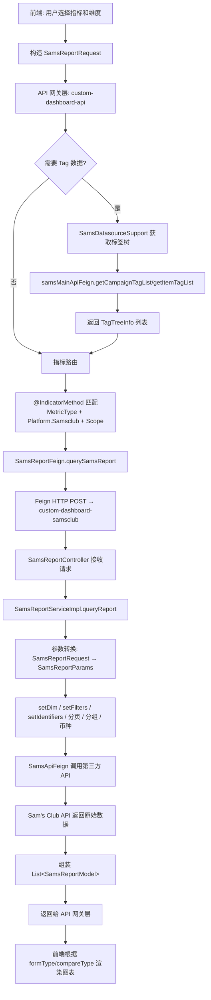
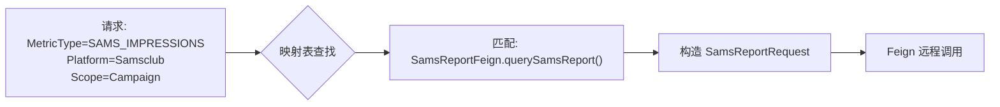
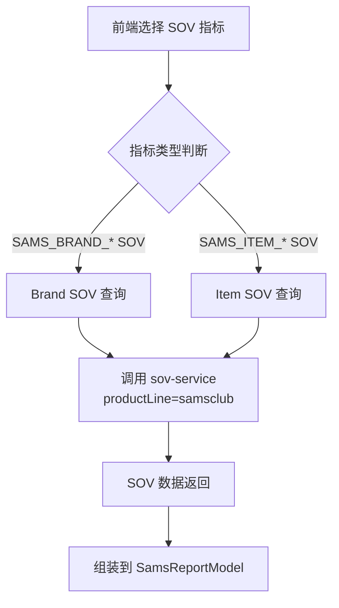
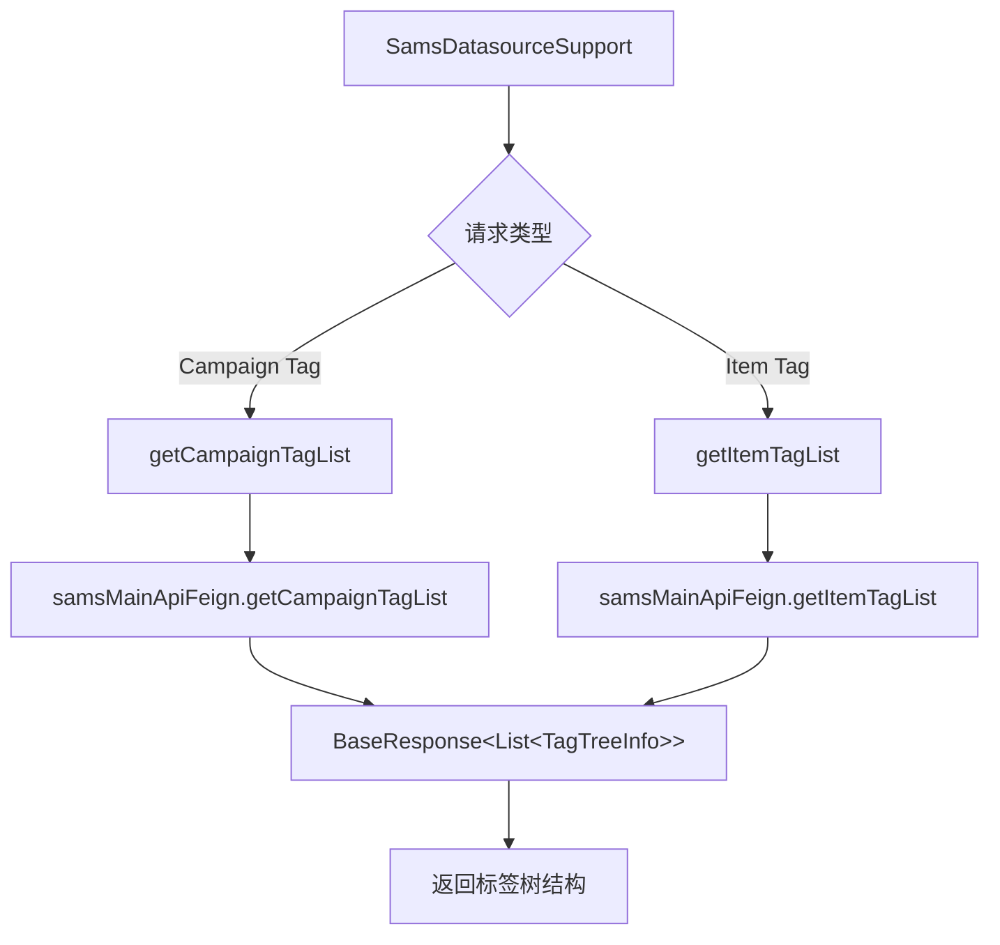

# Samsclub 平台模块 功能逻辑文档

> 本文档由 document-automation 工具自动生成，基于源代码、PRD 文档和技术评审文档。
> 生成时间: 2026-04-09 13:13:10
> 准确性评分: 未验证/100

---


# Samsclub 平台模块 功能逻辑文档

## 1. 模块概述

### 1.1 模块职责与定位

Samsclub 平台模块是 Pacvue Custom Dashboard 系统中专门负责 Sam's Club 广告数据查询与报表生成的平台级模块。该模块提供 Sam's Club 广告投放相关的多维度聚合查询能力，涵盖广告基础指标（Impressions、Clicks、Spend）、效率指标（CTR、CPC、CPA、CVR）、回报指标（ACOS、ROAS）、销售指标（Sales、Orders、Sale Units）、新客指标（NTB Orders/Units/Sales）以及 SOV（Share of Voice）指标等完整的广告数据分析体系。

模块通过注解驱动的指标路由机制（`@IndicatorProvider` + `@IndicatorMethod`），将前端请求中携带的指标类型自动分派到对应的 Feign 远程调用方法，实现了声明式的指标-方法绑定，极大降低了新增指标时的开发成本。

### 1.2 系统架构位置与上下游关系

```
┌─────────────────────────────────────────────────────────────────┐
│                        前端 (Vue)                                │
│   metricsList/samsclub.js  →  指标选择 → 构造请求                  │
└──────────────────────────┬──────────────────────────────────────┘
                           │ HTTP POST
                           ▼
┌─────────────────────────────────────────────────────────────────┐
│              API 网关层 (custom-dashboard-api)                    │
│                                                                  │
│  SamsDatasourceSupport                                           │
│    ├── getCampaignTagList() → samsMainApiFeign                   │
│    ├── getItemTagList()     → samsMainApiFeign                   │
│    └── @IndicatorMethod 路由 → SamsReportFeign.querySamsReport() │
└──────────────────────────┬──────────────────────────────────────┘
                           │ Feign RPC
                           ▼
┌─────────────────────────────────────────────────────────────────┐
│          报表微服务 (custom-dashboard-samsclub)                   │
│                                                                  │
│  SamsReportController                                            │
│    └── POST /querySamsReport                                     │
│         └── SamsReportServiceImpl.queryReport()                  │
│              ├── 参数转换: SamsReportRequest → SamsReportParams   │
│              ├── 设置维度/过滤器/分页/分组/币种                     │
│              └── SamsApiFeign → Sam's Club 第三方 API             │
└──────────────────────────┬──────────────────────────────────────┘
                           │ HTTP
                           ▼
┌─────────────────────────────────────────────────────────────────┐
│          Sam's Club 第三方 API (samsclub-newui)                   │
│          如: /api/Report/profile                                  │
└─────────────────────────────────────────────────────────────────┘
```

**上游依赖**：
- 前端 Vue 应用通过 `metricsList/samsclub.js` 定义可选指标列表，用户选择指标和维度后构造请求
- API 网关层 `custom-dashboard-api` 中的 `SamsDatasourceSupport` 提供标签等辅助数据查询

**下游依赖**：
- `custom-dashboard-samsclub` 微服务：报表查询核心服务
- `samsclub-newui`：Sam's Club 第三方 API 代理服务
- `samsMainApiFeign`（服务名待确认）：提供 Campaign/Item 标签树数据

### 1.3 涉及的后端模块

| Maven 模块 | 职责 | 关键类 |
|---|---|---|
| `custom-dashboard-api` | API 网关层，指标路由与数据源支持 | `SamsDatasourceSupport`, `SamsReportFeign` |
| `custom-dashboard-samsclub` | 报表查询微服务 | `SamsReportController`, `SamsReportServiceImpl` |
| `pacvue-feign-dto`（**待确认**） | Feign DTO 定义 | `SamsReportRequest`, `SamsReportModel` |

### 1.4 涉及的前端组件

| 文件路径 | 职责 |
|---|---|
| `metricsList/samsclub.js` | Sam's Club 指标定义列表，定义前端图表类型、格式、Scope 配置 |
| `metricsList/walmart.js` | Walmart 指标定义列表，作为同类平台参考结构 |

### 1.5 部署方式

- `custom-dashboard-samsclub` 作为独立微服务部署，通过 Spring Cloud Feign 注册到服务发现中心
- 服务名配置支持通过 `${feign.client.custom-dashboard-samsclub:custom-dashboard-samsclub}` 动态覆盖
- Sam's Club 第三方 API 地址可通过 `third-part.samsclub.url` 配置项覆盖

---

## 2. 用户视角

### 2.1 功能场景总览

基于 PRD 文档和技术评审文档，Sam's Club 平台在 Custom Dashboard 中支持以下功能场景：

| 场景 | 支持的图表类型 | 说明 |
|---|---|---|
| 广告绩效查询 | Overview / Trend / Comparison / Pie / Table | 基础广告指标查询 |
| SOV 指标查询 | Overview / Trend / Comparison / Pie / Table | 26Q1-S4 新增 |
| Cross Retailer 聚合 | Table | 跨平台数据汇总 |
| 多 Item 筛选 | 所有图表 | 支持 Item 搜索与多选 |
| Keyword 作为 SOV 筛选条件 | 所有图表 | 26Q1-S1 新增 |

### 2.2 广告绩效查询场景

**用户操作流程**：

1. **进入 Dashboard 编辑页面**：用户在 Custom Dashboard 中创建或编辑看板
2. **选择平台**：在 Dashboard Setting 的 Platform 筛选中选择 Sam's Club
3. **配置 Filter**：
   - **Profile**（必选）：选择 Sam's Club 广告账户
   - **Campaign Tag**（非必选）：按标签筛选 Campaign
   - **Ad Type**（非必选）：按广告类型筛选
4. **添加图表**：选择图表类型（Overview / Trend / Comparison / Pie / Table）
5. **选择物料层级**：
   - Profile 层级
   - Campaign 层级
   - Item 层级
   - Keyword 层级
   - SearchTerm 层级
   - 以及对应的 Tag / ParentTag 层级
6. **选择指标**：从 `samsclub.js` 定义的指标列表中选择需要展示的指标
7. **配置数据范围**：设置时间范围、对比类型（POP/YOY）等
8. **查看数据**：系统自动查询并渲染图表

**UI 交互要点**：
- Dashboard Setting 中 Profile 为必选项，Campaign Tag 和 Ad Type 为非必选项，三者之间没有联动关系（与 HQ 通用逻辑一致）
- 日期选择器支持 Custom 和 YOY 两种模式
- 货币设置支持全局配置

### 2.3 SOV 指标查询场景

根据 PRD 文档 `Custom DB - 26Q1 - S4`，Sam's Club 平台新增了 SOV 相关指标：

**Brand/Keyword 物料层级支持的 SOV 指标**：
- Brand Total SOV、Brand Paid SOV、Brand SP SOV
- Brand Top of Search SP SOV、Brand Rest of Search SP SOV
- Brand SB SOV、Brand SV SOV（Sam's Club 特有，Kroger/Doordash 不支持）
- Ads Frequency
- Brand Organic SOV
- Top 5/10/15 SOV、Top 5/10/15 SP SOV、Top 5/10/15 Organic SOV

**Item 物料层级支持的 SOV 指标**：
- Item Total SOV、Item SP SOV
- Item Top of Search SP SOV、Item Rest of Search SP SOV
- Item Organic SOV
- Top 1/3/6 Frequency、Top 1/3/6 Paid Frequency、Top 1/3/6 Organic Frequency
- Avg. Position、Avg. Paid Position、Avg. Organic Position
- Position 1-6 Frequency
- Page 1 Frequency

**业务规则**：
- SOV 指标只能在 Customize 模式下支持 Sort By，选择 Top Rank 和 Top Mover 时不支持 Sort By
- Scope Setting 中的筛选项保持现状不变
- SOV 指标需要增加 Keyword 作为筛选条件
- 对比类型的指标不支持加到 Pie 图表中
- SOV Group 市场全部汇总到 US 市场

**用户操作流程**：

1. 在图表编辑中选择 Sam's Club 平台
2. 选择 Brand/Keyword 或 Item 物料层级
3. 从指标列表中选择 SOV 相关指标
4. 可选配置 Keyword 筛选条件以缩小 SOV 数据范围
5. 查看 SOV 数据展示

### 2.4 多 Item 查询场景

根据技术评审文档 `Custom Dashboard 2025Q3S4`，Sam's Club 平台的 Item 搜索接口为 `/data/getItemList`，支持多 Item 查询。用户可以在 Filter 搜索框中输入多个 Item ID 进行批量筛选。

### 2.5 Cross Retailer 场景

Sam's Club 作为 HQ 支持的平台之一，参与 Cross Retailer 跨平台数据汇总。在 Table 图表中，Cross Retailer 模式下可以展示 Sam's Club 与其他平台的数据对比。Cross Retailer 内物料 Scope 只支持 Customize 模式。

---

## 3. 核心 API

### 3.1 报表查询接口

- **路径**: `POST /querySamsReport`
- **所属 Controller**: `SamsReportController`
- **所属微服务**: `custom-dashboard-samsclub`

**请求参数**: `SamsReportRequest`（继承 `BaseRequest`）

`SamsReportRequest` 继承自 `BaseRequest`，包含以下关键字段（基于代码推断）：

| 字段 | 类型 | 说明 |
|---|---|---|
| `startDate` / `endDate` | String | 查询时间范围（继承自 BaseRequest） |
| `profileIds` | List<Long> | Profile ID 列表 |
| `campaignIds` | List<Long> | Campaign ID 列表 |
| `itemIds` | List<String> | Item ID 列表 |
| `keywordIds` | List<Long> | Keyword ID 列表 |
| `searchTerms` | List<String> | SearchTerm 列表 |
| `campaignTagIds` | List<Long> | Campaign 标签 ID 列表 |
| `itemTagIds` | List<Long> | Item 标签 ID 列表 |
| `metricTypes` | List<MetricType> | 请求的指标类型列表 |
| `scopeType` | MetricScopeType | 物料层级/维度类型 |
| `currency` | String | 币种 |
| `pageNum` / `pageSize` | Integer | 分页参数 |
| `sortField` / `sortOrder` | String | 排序字段和方向 |

**返回值**: `List<SamsReportModel>`

`SamsReportModel` 包含以下关键字段（基于代码推断）：

| 字段 | 类型 | 说明 |
|---|---|---|
| `profileId` | Long | Profile ID |
| `campaignId` | Long | Campaign ID |
| `campaignName` | String | Campaign 名称 |
| `productTitle` / `productName` | String | 产品标题（`getProductTitle()` 优先返回 `productTitle`，为空则返回 `productName`） |
| `linkCampaignTagIds` | String | 回写的 Campaign Tag IDs |
| `productline` | String | 产品线 |
| `targetACOS` | BigDecimal | Campaign 目标 ACOS（`@IndicatorField(MetricType.CampaignTargetACOS)`） |
| `targetROAS` | BigDecimal | Campaign 目标 ROAS（`@IndicatorField(MetricType.CampaignTargetROAS)`） |
| `targetCPA` | BigDecimal | Campaign 目标 CPA（`@IndicatorField(MetricType.CampaignTargetCPA)`） |
| `targetCPC` | BigDecimal | Campaign 目标 CPC（`@IndicatorField(MetricType.CampaignTargetCPC)`） |
| 各广告指标字段 | BigDecimal | impressions, clicks, spend, sales 等 |

**说明**: 该接口是 Sam's Club 平台报表查询的核心入口，支持多种广告指标和多维度聚合。通过 `@IndicatorMethod` 注解声明了该方法可处理的所有指标类型和维度范围。

### 3.2 标签数据接口

#### 3.2.1 获取 Campaign 标签树

- **调用方式**: `SamsDatasourceSupport.getCampaignTagList(UserInfo userInfo)`
- **下游调用**: `samsMainApiFeign.getCampaignTagList()`
- **返回值**: `BaseResponse<List<TagTreeInfo>>`
- **说明**: 获取 Sam's Club 平台的 Campaign 标签树结构，用于 Dashboard Setting 中的 Campaign Tag 筛选

#### 3.2.2 获取 Item 标签树

- **调用方式**: `SamsDatasourceSupport.getItemTagList(UserInfo userInfo)`
- **下游调用**: `samsMainApiFeign.getItemTagList()`
- **返回值**: `BaseResponse<List<TagTreeInfo>>`
- **说明**: 获取 Sam's Club 平台的 Item 标签树结构，用于 Item Tag 维度的筛选

### 3.3 Item 列表查询接口

- **路径**: `/data/getItemList`（**待确认**具体 Controller 位置）
- **说明**: 用于 Filter 搜索框中的 Item 搜索，支持多 Item 查询
- **参考**: 技术评审文档中明确 Sam's Club 的 Item 搜索接口为 `/data/getItemList`

### 3.4 Feign 接口定义

#### SamsReportFeign

```java
@FeignClient(
    name = "${feign.client.custom-dashboard-samsclub:custom-dashboard-samsclub}",
    contextId = "custom-dashboard-samsclub-advertising",
    configuration = FeignRequestInterceptor.class
)
@IndicatorProvider
public interface SamsReportFeign {
    @FeignMethodCache(forceRefresh = true)
    @IndicatorMethod(
        value = { /* 40+ MetricType 枚举值 */ },
        scopes = { /* 12 种 MetricScopeType */ },
        platforms = { Platform.Samsclub },
        requestType = SamsReportRequest.class
    )
    @PostMapping("/querySamsReport")
    List<SamsReportModel> querySamsReport(@RequestBody SamsReportRequest reportParams);
}
```

#### SamsApiFeign

- **服务名**: `samsclub-newui`
- **URL 配置**: `third-part.samsclub.url`
- **职责**: Sam's Club 第三方 API 代理，提供 Profile 报表等原始数据查询
- **典型接口**: `/api/Report/profile`（**待确认**）

---

## 4. 核心业务流程

### 4.1 报表查询主流程

#### 4.1.1 流程详细描述

**步骤 1：前端构造请求**

前端 `metricsList/samsclub.js` 定义了 Sam's Club 平台所有可选指标的元数据，包括指标名称、图表类型（`formType`）、对比类型（`compareType`）、支持的图表（`supportChart`）、格式化方式等。用户在 Dashboard 编辑页面选择指标和维度后，前端根据这些元数据构造 `SamsReportRequest` 请求对象。

**步骤 2：API 网关层指标路由**

请求到达 `custom-dashboard-api` 网关层后，系统通过注解驱动的指标路由机制进行分派：

1. 框架扫描所有标注了 `@IndicatorProvider` 的 Feign 接口
2. 解析每个方法上的 `@IndicatorMethod` 注解，建立 `(MetricType, Platform, MetricScopeType)` → 方法的映射表
3. 根据请求中的指标类型（如 `SAMS_IMPRESSIONS`）、平台（`Platform.Samsclub`）和维度（如 `MetricScopeType.Campaign`）查找匹配的方法
4. 自动将请求路由到 `SamsReportFeign.querySamsReport()` 方法

**步骤 3：SamsDatasourceSupport 辅助数据准备**

在 API 网关层，`SamsDatasourceSupport` 作为数据源支持类，实现了平台级的数据源抽象接口。当请求涉及 Tag 维度（如 `CampaignTag`、`ItemTag`）时，`SamsDatasourceSupport` 会通过 `samsMainApiFeign` 预先获取标签树数据：

- `getCampaignTagList()` → 获取 Campaign 标签树
- `getItemTagList()` → 获取 Item 标签树

这些标签数据用于将 Tag ID 解析为具体的标签名称和层级结构。

**步骤 4：Feign 远程调用**

`SamsReportFeign.querySamsReport()` 通过 Spring Cloud Feign 发起 HTTP POST 请求到 `custom-dashboard-samsclub` 微服务。请求经过 `FeignRequestInterceptor` 拦截器处理（可能添加认证头、租户信息等），以及 `SamsFeignInterceptor`（**待确认**具体职责）。

`@FeignMethodCache(forceRefresh = true)` 注解表明该方法启用了方法级缓存，但 `forceRefresh = true` 意味着每次调用都会强制刷新缓存，确保数据实时性。

**步骤 5：SamsReportController 接收请求**

`custom-dashboard-samsclub` 微服务中的 `SamsReportController` 接收 POST `/querySamsReport` 请求，将请求委托给 `SamsReportService`（实现类为 `SamsReportServiceImpl`）。

**步骤 6：SamsReportServiceImpl 参数转换与查询**

`SamsReportServiceImpl.queryReport()` 方法执行以下核心逻辑：

1. **参数转换**：将 `SamsReportRequest` 转换为内部使用的 `SamsReportParams` 对象
2. **设置维度（setDim）**：根据 `MetricScopeType` 设置查询的聚合维度（Profile/Campaign/Item/Keyword/SearchTerm 及其 Tag 层级）
3. **设置过滤器（setFilters）**：将请求中的 Profile IDs、Campaign IDs、Item IDs、Keyword IDs、Tag IDs 等转换为查询过滤条件
4. **设置标识符（setIdentifiers）**：设置用于唯一标识数据行的字段组合
5. **设置分页和排序**：配置分页参数和排序规则
6. **设置分组**：根据维度设置 GROUP BY 字段
7. **设置币种**：根据全局货币设置进行币种转换

**步骤 7：调用 Sam's Club 第三方 API**

`SamsReportServiceImpl` 通过 `SamsApiFeign` 调用 Sam's Club 第三方 API（如 `/api/Report/profile`）获取原始广告数据。`SamsApiFeign` 的 URL 可通过 `third-part.samsclub.url` 配置项动态指定。

**步骤 8：数据组装与返回**

原始数据经过处理后，组装为 `List<SamsReportModel>` 返回给上层。每个 `SamsReportModel` 包含维度字段（如 campaignId、campaignName）和指标字段（如 impressions、clicks、spend）。

**步骤 9：前端渲染**

前端接收到数据后，根据 `samsclub.js` 中定义的 `formType`（数据格式）、`compareType`（对比类型）、`supportChart`（支持的图表类型）等配置，将数据渲染为对应的图表组件。

#### 4.1.2 流程图



### 4.2 指标路由机制详解

#### 4.2.1 注解驱动的声明式绑定

指标路由是 Custom Dashboard 系统的核心设计模式之一。其工作原理如下：

**注册阶段**（应用启动时）：

1. Spring 容器扫描所有标注了 `@IndicatorProvider` 的 Bean（在本模块中为 `SamsReportFeign`）
2. 对每个 `@IndicatorProvider` Bean，遍历其所有方法，查找标注了 `@IndicatorMethod` 的方法
3. 解析 `@IndicatorMethod` 注解的属性：
   - `value`：该方法支持的 `MetricType` 枚举值数组（40+ 个 SAMS_* 指标 + 4 个 CampaignTarget* 指标）
   - `scopes`：该方法支持的 `MetricScopeType` 枚举值数组（12 种维度）
   - `platforms`：该方法支持的平台（`Platform.Samsclub`）
   - `requestType`：请求参数类型（`SamsReportRequest.class`）
4. 建立三维映射表：`(MetricType, Platform, MetricScopeType)` → `Method`

**路由阶段**（请求到达时）：

1. 从请求中提取 `MetricType`、`Platform`、`MetricScopeType`
2. 在映射表中查找匹配的方法
3. 将请求参数转换为 `requestType` 指定的类型
4. 通过反射调用匹配的方法



#### 4.2.2 支持的维度（Scope）

`@IndicatorMethod` 注解中声明了 12 种支持的 `MetricScopeType`：

| MetricScopeType | 说明 | 聚合维度 |
|---|---|---|
| `FilterLinkedCampaign` | 关联 Campaign 过滤 | 按 Dashboard Filter 中选中的 Campaign 过滤 |
| `Profile` | Profile 层级 | 按广告账户聚合 |
| `Campaign` | Campaign 层级 | 按广告活动聚合 |
| `CampaignTag` | Campaign 标签层级 | 按 Campaign 标签聚合 |
| `CampaignParentTag` | Campaign 父标签层级 | 按 Campaign 父级标签聚合 |
| `Item` | Item 层级 | 按商品聚合 |
| `ItemTag` | Item 标签层级 | 按 Item 标签聚合 |
| `ItemParentTag` | Item 父标签层级 | 按 Item 父级标签聚合 |
| `Keyword` | Keyword 层级 | 按关键词聚合 |
| `KeywordTag` | Keyword 标签层级 | 按 Keyword 标签聚合 |
| `KeywordParentTag` | Keyword 父标签层级 | 按 Keyword 父级标签聚合 |
| `SearchTerm` | SearchTerm 层级 | 按搜索词聚合 |

### 4.3 SOV 指标查询流程

SOV（Share of Voice）指标的查询流程与广告绩效指标有所不同。根据技术评审文档，SOV 指标的查询调用 `sov-service` 服务，区别在于传递的 `productLine` header 不同。



**SOV 指标分类**：

从 `MetricType` 枚举可以看出，SOV 指标使用 `SAMS_SOV` 作为数据源标识（而非 `SAMS`），这意味着 SOV 指标的数据来源与普通广告指标不同：

- `SAMS` 数据源：广告绩效指标（Impressions、Clicks、Spend 等）
- `SAMS_SOV` 数据源：SOV 指标（Brand SOV、Item SOV 等）

### 4.4 标签数据获取流程



`TagTreeInfo` 是标签树的数据结构，包含标签 ID、标签名称、父标签 ID、子标签列表等信息，用于支持 `CampaignTag`/`CampaignParentTag`/`ItemTag`/`ItemParentTag` 等维度的数据聚合。

---

## 5. 数据模型

### 5.1 数据库表结构

**待确认**：具体的数据库表名和表结构在当前代码片段中未展示。SQL 查询逻辑位于 `SamsReportServiceImpl` 及其对应的 Mapper 中。根据模块架构推断，可能涉及以下表（**待确认**）：

- Sam's Club 广告绩效数据表（存储 Impressions、Clicks、Spend 等原始数据）
- Sam's Club Campaign 配置表（存储 Campaign 名称、目标 ACOS/ROAS/CPA/CPC 等）
- Sam's Club Item 数据表（存储 Item 信息）
- SOV 数据表（存储 Brand/Item SOV 数据）

### 5.2 核心 DTO/VO

#### 5.2.1 SamsReportRequest

```java
package com.pacvue.feign.dto.request.samsclub;

@Data
@EqualsAndHashCode
public class SamsReportRequest extends BaseRequest {
    // 继承 BaseRequest 的通用字段：
    // - startDate, endDate: 时间范围
    // - profileIds: Profile ID 列表
    // - currency: 币种
    // - pageNum, pageSize: 分页
    // - sortField, sortOrder: 排序
    // - metricTypes: 指标类型列表
    // - scopeType: 维度类型
    // 以及 Sam's Club 特有的筛选字段（待确认）
}
```

#### 5.2.2 SamsReportParams

**待确认**：`SamsReportParams` 是 `SamsReportServiceImpl` 内部使用的参数对象，由 `SamsReportRequest` 转换而来。包含以下逻辑字段（基于代码描述推断）：

| 字段 | 说明 |
|---|---|
| dim | 查询维度（Profile/Campaign/Item/Keyword/SearchTerm） |
| filters | 过滤条件集合 |
| identifiers | 唯一标识字段组合 |
| groupBy | 分组字段 |
| pagination | 分页参数 |
| currency | 币种 |

#### 5.2.3 SamsReportModel

`SamsReportModel` 是报表查询的返回模型，包含维度字段和指标字段：

**维度字段**：

| 字段 | 类型 | 说明 |
|---|---|---|
| `profileId` | Long | Profile ID |
| `campaignId` | Long | Campaign ID |
| `campaignName` | String | Campaign 名称 |
| `productTitle` | String | 产品标题 |
| `productName` | String | 产品名称 |
| `linkCampaignTagIds` | String | 回写的 Campaign Tag IDs |
| `productline` | String | 产品线 |

**目标指标字段**（通过 `@IndicatorField` 注解标记）：

| 字段 | 类型 | 注解 | 说明 |
|---|---|---|---|
| `targetACOS` | BigDecimal | `@IndicatorField(MetricType.CampaignTargetACOS)` | Campaign 目标 ACOS |
| `targetROAS` | BigDecimal | `@IndicatorField(MetricType.CampaignTargetROAS)` | Campaign 目标 ROAS |
| `targetCPA` | BigDecimal | `@IndicatorField(MetricType.CampaignTargetCPA)` | Campaign 目标 CPA |
| `targetCPC` | BigDecimal | `@IndicatorField(MetricType.CampaignTargetCPC)` | Campaign 目标 CPC |

**特殊逻辑**：`getProductTitle()` 方法优先返回 `productTitle`，若为 null 则回退到 `productName`。

#### 5.2.4 ProductView

**待确认**：`ProductView` 在关键类列表中出现，可能用于 Item 层级的产品视图展示，包含产品图片、标题、价格等信息。

#### 5.2.5 TagTreeInfo

标签树信息结构，用于 Campaign Tag 和 Item Tag 的层级展示：

| 字段 | 类型 | 说明 |
|---|---|---|
| `tagId` | Long | 标签 ID |
| `tagName` | String | 标签名称 |
| `parentTagId` | Long | 父标签 ID |
| `children` | List<TagTreeInfo> | 子标签列表 |

（**待确认**：具体字段名可能有差异）

### 5.3 核心枚举

#### 5.3.1 MetricType（SAMS_* 枚举值）

Sam's Club 平台的指标枚举值分为三大类：

**一、广告绩效指标（数据源：SAMS）**

| 枚举值 | 数据源 | 格式 | 说明 |
|---|---|---|---|
| `SAMS_IMPRESSIONS` | SAMS | 默认 | 展示次数 |
| `SAMS_CLICKS` | SAMS | 默认 | 点击次数 |
| `SAMS_CTR` | SAMS | 默认 | 点击率 |
| `SAMS_SPEND` | SAMS | 默认 | 花费 |
| `SAMS_CPC` | SAMS | 默认 | 单次点击成本 |
| `SAMS_CPA` | SAMS | 默认 | 单次转化成本 |
| `SAMS_CVR` | SAMS | 默认 | 转化率 |
| `SAMS_ACOS` | SAMS | 默认 | 广告销售成本比 |
| `SAMS_ROAS` | SAMS | 默认 | 广告投资回报率 |
| `SAMS_ONLINE_CPA` | SAMS | 默认 | 线上单次转化成本 |
| `SAMS_ONLINE_CVR` | SAMS | 默认 | 线上转化率 |
| `SAMS_ONLINE_ACOS` | SAMS | 默认 | 线上 ACOS |
| `SAMS_ONLINE_ROAS` | SAMS | 默认 | 线上 ROAS |
| `SAMS_ONLINE_AD_SKU_ACOS` | SAMS | 默认 | 线上广告 SKU ACOS |
| `SAMS_ONLINE_AD_SKU_ROAS` | SAMS | 默认 | 线上广告 SKU ROAS |
| `SAMS_SALES` | SAMS | 默认 | 总销售额 |
| `SAMS_ORDERS` | SAMS | 默认 | 总订单数 |
| `SAMS_SALE_UNITS` | SAMS | 默认 | 总销售件数 |
| `SAMS_ONLINE_SALES` | SAMS | 默认 | 线上销售额 |
| `SAMS_ONLINE_ORDERS` | SAMS | 默认 | 线上订单数 |
| `SAMS_ONLINE_SALE_UNITS` | SAMS | 默认 | 线上销售件数 |
| `SAMS_ONLINE_AD_SKU_SALES` | SAMS | 默认 | 线上广告 SKU 销售额 |
| `SAMS_ONLINE_AD_SKU_SALE_UNITS` | SAMS | 默认 | 线上广告 SKU 销售件数 |
| `SAMS_ONLINE_OTHER_SALES` | SAMS | 默认 | 线上其他销售额 |
| `SAMS_ONLINE_OTHER_SALE_UNITS` | SAMS | 默认 | 线上其他销售件数 |
| `SAMS_ONLINE_RELATED_CLICK_SALES` | SAMS | 默认 | 线上关联点击销售额 |
| `SAMS_ONLINE_BRAND_CLICK_SALES` | SAMS | 默认 | 线上品牌点击销售额 |
| `SAMS_STORE_SALES` | SAMS | 默认 | 门店销售额 |
| `SAMS_STORE_ORDERS` | SAMS | 默认 | 门店订单数 |
| `SAMS_STORE_SALE_UNITS` | SAMS | 默认 | 门店销售件数 |
| `SAMS_NTB_ORDERS` | SAMS | 默认 | 新客订单数 |
| `SAMS_NTB_ORDERS_PERCENT` | SAMS | 默认 | 新客订单占比 |
| `SAMS_NTB_ORDERS_RATE` | SAMS | 默认 | 新客订单率 |
| `SAMS_NTB_UNITS` | SAMS | 默认 | 新客销售件数 |
| `SAMS_NTB_UNITS_PERCENT` | SAMS | 默认 | 新客件数占比 |
| `SAMS_NTB_SALES` | SAMS | 默认 | 新客销售额 |
| `SAMS_NTB_SALES_PERCENT` | SAMS | 默认 | 新客销售额占比 |
| `SAMS_AOV` | SAMS | 默认 | 平均订单价值 |
| `SAMS_ASP` | SAMS | 默认 | 平均销售价格 |
| `SAMS_ONLINE_OTHER_SALES_PERCENT` | SAMS | PERCENT | 线上其他销售额占比 |

**二、Brand SOV 指标（数据源：SAMS_SOV）**

| 枚举值 | 数据源 | 格式 | 说明 |
|---|---|---|---|
| `SAMS_BRAND_TOTAL_SOV` | SAMS_SOV | 默认 | 品牌总 SOV |
| `SAMS_BRAND_PAID_SOV` | SAMS_SOV | 默认 | 品牌付费 SOV |
| `SAMS_BRAND_SP_SOV` | SAMS_SOV | 默认 | 品牌 SP SOV |
| `SAMS_BRAND_TOP_OF_SEARCH_SP_SOV` | SAMS_SOV | PERCENT | 品牌搜索顶部 SP SOV |
| `SAMS_BRAND_REST_OF_SEARCH_SP_SOV` | SAMS_SOV | 默认 | 品牌搜索其余 SP SOV |
| `SAMS_BRAND_SB_SOV` | SAMS_SOV | 默认 | 品牌 SB SOV |
| `SAMS_BRAND_SV_SOV` | SAMS_SOV | 默认 | 品牌 SV SOV |
| `SAMS_BRAND_ADS_FREQUENCY` | SAMS_SOV | UNIT_COUNT | 品牌广告频次 |
| `SAMS_BRAND_ORGANIC_SOV` | SAMS_SOV | 默认 | 品牌自然 SOV |
| `SAMS_BRAND_TOP_5_SOV` | SAMS_SOV | PERCENT | 品牌 Top 5 SOV |
| `SAMS_BRAND_TOP_10_SOV` | SAMS_SOV | PERCENT | 品牌 Top 10 SOV |
| `SAMS_BRAND_TOP_15_SOV` | SAMS_SOV | PERCENT | 品牌 Top 15 SOV |
| `SAMS_BRAND_TOP_5_SP_SOV` | SAMS_SOV | PERCENT | 品牌 Top 5 SP SOV |
| `SAMS_BRAND_TOP_10_SP_SOV` | SAMS_SOV | PERCENT | 品牌 Top 10 SP SOV |
| `SAMS_BRAND_TOP_15_SP_SOV` | SAMS_SOV | PERCENT | 品牌 Top 15 SP SOV |
| `SAMS_BRAND_TOP_5_ORGANIC_SOV` | SAMS_SOV | PERCENT | 品牌 Top 5 自然 SOV |
| `SAMS_BRAND_TOP_10_ORGANIC_SOV` | SAMS_SOV | PERCENT | 品牌 Top 10 自然 SOV |
| `SAMS_BRAND_TOP_15_ORGANIC_SOV` | SAMS_SOV | PERCENT | 品牌 Top 15 自然 SOV |

**三、Item SOV 指标（数据源：SAMS_SOV）**

| 枚举值 | 数据源 | 格式 | 说明 |
|---|---|---|---|
| `SAMS_ITEM_TOTAL_SOV` | SAMS_SOV | 默认 | Item 总 SOV |
| `SAMS_ITEM_SP_SOV` | SAMS_SOV | 默认 | Item SP SOV |
| `SAMS_ITEM_TOP_OF_SEARCH_SP_SOV` | SAMS_SOV | PERCENT | Item 搜索顶部 SP SOV |
| `SAMS_ITEM_REST_OF_SEARCH_SP_SOV` | SAMS_SOV | 默认 | Item 搜索其余 SP SOV |
| `SAMS_ITEM_ORGANIC_SOV` | SAMS_SOV | 默认 | Item 自然 SOV |
| `SAMS_ITEM_PAGE_1_FREQUENCY` | SAMS_SOV | PERCENT | Item 第 1 页频次 |
| `SAMS_ITEM_TOP_1_FREQUENCY` | SAMS_SOV | PERCENT | Item Top 1 频次 |
| `SAMS_ITEM_TOP_3_FREQUENCY` | SAMS_SOV | PERCENT | Item Top 3 频次 |
| `SAMS_ITEM_TOP_6_FREQUENCY` | SAMS_SOV | PERCENT | Item Top 6 频次 |
| `SAMS_ITEM_TOP_1_PAID_FREQUENCY` | SAMS_SOV | PERCENT | Item Top 1 付费频次 |
| `SAMS_ITEM_TOP_3_PAID_FREQUENCY` | SAMS_SOV | PERCENT | Item Top 3 付费频次 |
| `SAMS_ITEM_TOP_6_PAID_FREQUENCY` | SAMS_SOV | PERCENT | Item Top 6 付费频次 |
| `SAMS_ITEM_TOP_1_ORGANIC_FREQUENCY` | SAMS_SOV | PERCENT | Item Top 1 自然频次 |
| `SAMS_ITEM_TOP_3_ORGANIC_FREQUENCY` | SAMS_SOV | PERCENT | Item Top 3 自然频次 |
| `SAMS_ITEM_TOP_6_ORGANIC_FREQUENCY` | SAMS_SOV | PERCENT | Item Top 6 自然频次 |
| `SAMS_ITEM_AVG_POSITION` | SAMS_SOV | UNIT_COUNT | Item 平均位置 |
| `SAMS_ITEM_AVG_PAID_POSITION` | SAMS_SOV | UNIT_COUNT | Item 平均付费位置 |
| `SAMS_ITEM_AVG_ORGANIC_POSITION` | SAMS_SOV | UNIT_COUNT | Item 平均自然位置 |
| `SAMS_ITEM_POSITION_1_FREQUENCY` | SAMS_SOV | PERCENT | Item 位置 1 频次 |
| `SAMS_ITEM_POSITION_2_FREQUENCY` | SAMS_SOV | PERCENT | Item 位置 2 频次 |
| `SAMS_ITEM_POSITION_3_FREQUENCY` | SAMS_SOV | PERCENT | Item 位置 3 频次 |
| `SAMS_ITEM_POSITION_4_FREQUENCY` 及以下 | SAMS_SOV | PERCENT | Item 位置 4-6 频次（代码截断） |

**四、Campaign 目标指标**（在 `@IndicatorMethod` 中声明但非 SAMS_ 前缀）：

| 枚举值 | 说明 |
|---|---|
| `CampaignTargetACOS` | Campaign 目标 ACOS |
| `CampaignTargetROAS` | Campaign 目标 ROAS |
| `CampaignTargetCPA` | Campaign 目标 CPA |
| `CampaignTargetCPC` | Campaign 目标 CPC |

#### 5.3.2 MetricScopeType

见 4.2.2 节的维度表格。

#### 5.3.3 Platform

`Platform.Samsclub` — Sam's Club 平台标识。

---

## 6. 平台差异

### 6.1 Sam's Club vs Walmart

Sam's Club 和 Walmart 同属 Walmart 集团，在 Custom Dashboard 中有相似的架构但独立的实现：

| 维度 | Sam's Club | Walmart |
|---|---|---|
| 平台标识 | `Platform.Samsclub` | `Platform.Walmart` |
| 指标前缀 | `SAMS_*` | `WALMART_*` |
| 物料层级 | Profile/Campaign/Item/Keyword/SearchTerm | Profile/Campaign/Item/Keyword/SearchTerm/AdGroup |
| SOV 指标 | 支持 Brand SB SOV、Brand SV SOV | 不支持 Brand SB SOV、Brand SV SOV |
| Item 搜索接口 | `/data/getItemList` | `/data/getItemList` |
| AdGroup 物料 | 不支持 | 支持（26Q1-S1 新增） |
| Feign 服务 | `custom-dashboard-samsclub` | `custom-dashboard-walmart`（**待确认**） |
| 前端指标定义 | `metricsList/samsclub.js` | `metricsList/walmart.js` |

### 6.2 Sam's Club vs Kroger/Doordash（SOV 指标差异）

根据 PRD 文档 `Custom DB - 26Q1 - S4`，三个平台的 SOV 指标存在以下差异：

| SOV 指标 | Sam's Club | Kroger/Doordash |
|---|---|---|
| Brand Rest of Search SP SOV | ✅ | ❌ |
| Brand SB SOV | ✅ | ❌ |
| Brand SV SOV | ✅ | ❌ |
| Item Rest of Search SP SOV | ✅ | ✅（Kroger 为 Rest of Search SP SOV） |
| Position 1-6 Frequency | ✅ | ❌ |
| 物料层级名称 | Brand/Keyword + Item | Brand/Keyword + ASIN/Product |

### 6.3 指标数据源映射

Sam's Club 的指标按数据源分为两类：

| 数据源标识 | 指标类别 | 数据来源 |
|---|---|---|
| `SAMS` | 广告绩效指标 | `SamsApiFeign` → Sam's Club 第三方 API |
| `SAMS_SOV` | SOV 指标 | `sov-service`（productLine=samsclub） |

这种分离设计意味着一次查询如果同时包含广告绩效指标和 SOV 指标，系统会分别路由到不同的数据源进行查询，然后在上层进行数据合并。

### 6.4 指标格式类型

从枚举定义中可以看出，指标有三种格式类型：

| 格式 | 说明 | 示例指标 |
|---|---|---|
| 默认（无第二参数） | 标准数值/货币格式 | SAMS_IMPRESSIONS, SAMS_SPEND |
| `PERCENT` | 百分比格式 | SAMS_ONLINE_OTHER_SALES_PERCENT, SAMS_BRAND_TOP_OF_SEARCH_SP_SOV |
| `UNIT_COUNT` | 计数/位置格式 | SAMS_BRAND_ADS_FREQUENCY, SAMS_ITEM_AVG_POSITION |

---

## 7. 配置与依赖

### 7.1 关键配置项

| 配置项 | 说明 | 默认值 |
|---|---|---|
| `feign.client.custom-dashboard-samsclub` | Sams 报表微服务名称 | `custom-dashboard-samsclub` |
| `third-part.samsclub.url` | Sam's Club 第三方 API 地址 | **待确认** |

### 7.2 Feign 下游服务依赖

#### 7.2.1 SamsReportFeign

| 属性 | 值 |
|---|---|
| 服务名 | `${feign.client.custom-dashboard-samsclub:custom-dashboard-samsclub}` |
| contextId | `custom-dashboard-samsclub-advertising` |
| 配置类 | `FeignRequestInterceptor.class` |
| 接口方法 | `querySamsReport(@RequestBody SamsReportRequest)` |
| 返回类型 | `List<SamsReportModel>` |
| 缓存策略 | `@FeignMethodCache(forceRefresh = true)` — 启用缓存但强制刷新 |

**注意**：代码中注释了 `url = "http://localhost:9002"`，这是本地开发调试用的直连地址，生产环境通过服务发现路由。

#### 7.2.2 SamsApiFeign

| 属性 | 值 |
|---|---|
| 服务名 | `samsclub-newui` |
| URL 配置 | `third-part.samsclub.url` |
| 职责 | Sam's Club 第三方 API 代理（Profile 报表等） |
| 典型接口 | `/api/Report/profile`（**待确认**） |

#### 7.2.3 samsMainApiFeign

| 属性 | 值 |
|---|---|
| 服务名 | **待确认** |
| 职责 | Sam's Club 主站 API，提供 Campaign/Item 标签树数据 |
| 接口方法 | `getCampaignTagList()`, `getItemTagList()` |
| 返回类型 | `BaseResponse<List<TagTreeInfo>>` |

### 7.3 缓存策略

`@FeignMethodCache(forceRefresh = true)` 注解应用于 `SamsReportFeign.querySamsReport()` 方法：

- **缓存机制**：方法级缓存，基于请求参数的 hash 作为缓存 key（**待确认**具体实现）
- **forceRefresh = true**：每次调用都会强制刷新缓存，即先执行远程调用获取最新数据，再更新缓存
- **设计意图**：报表数据需要实时性，但缓存机制可能用于防止短时间内的重复请求（如页面刷新时的并发请求去重）

### 7.4 拦截器

#### FeignRequestInterceptor

- 配置在 `SamsReportFeign` 的 `@FeignClient` 注解中
- 职责：在 Feign 请求中添加通用的请求头（如认证 token、租户 ID、用户信息等）

#### SamsFeignInterceptor

- 列在关键类中，**待确认**具体职责
- 可能用于在 Feign 请求中添加 Sam's Club 平台特有的请求头（如 `productLine` header）

### 7.5 消息队列

当前代码片段中未发现 Sam's Club 模块使用消息队列（Kafka）的证据。**待确认**是否有异步数据处理场景。

---

## 8. 版本演进

### 8.1 版本时间线

基于技术评审文档和 PRD 文档，Sam's Club 平台模块的主要版本演进如下：

| 版本 | 时间（推断） | 主要变更 |
|---|---|---|
| V2.0 | 早期版本 | 基础广告绩效指标支持（Impressions、Clicks、Spend、ACOS、ROAS 等） |
| V2.8 | 2025 Q3-Q4 | DSP 平台层设计（参考架构），模块化 SQL 查询模式确立 |
| 2025Q3-S4 | 2025 Q3 | 支持多 Item 查询（`/data/getItemList` 接口） |
| 2025Q4-S3 | 2025 Q4 | Commerce 用户支持 Market/Account 细分查看（通用功能） |
| 2025Q4-S5 | 2025 Q4 | Cross Retailer 指标支持 Amazon Channel 物料层级（通用功能） |
| 2026Q1-S1 | 2026 Q1 | Cross Retailer 中 Retailer 支持继续细分；ASIN/Keyword 增加 Campaign Tag 筛选条件；小平台支持 Keyword 作为 SOV 筛选条件 |
| 2026Q1-S2 | 2026 Q1 | Criteo 子零售商层级细分（参考架构） |
| 2026Q1-S3 | 2026 Q1 | Table 图表 Brand/Category 支持 Breakdown by SubMaterial（通用功能） |
| **2026Q1-S4** | **2026 Q1** | **Sam's Club 新增 SOV 指标（Brand SOV + Item SOV 全系列）** |

### 8.2 2026Q1-S4 SOV 指标新增详情

这是 Sam's Club 模块最近的重大变更，根据技术评审文档 `Custom Dashboard 2026Q1S4`：

**技术方案**：
- SOV 指标的查询调用 `sov-service` 服务，通过 `productLine` header 区分平台
- 前后端枚举值定义参考指标映射文档
- SOV Group/Brand/Keyword/ASIN 物料查询接口参考 Criteo/Target 等平台的实现

**待确认问题（已在评审中确认）**：
- ✅ 是否都有 `getSOVAsin` 接口？— 支持
- ✅ SOV ASIN 绩效接口是否支持传 `asinList`？— 支持
- ✅ SOV Group 市场怎么展示？— 全部汇总到 US 市场

### 8.3 待优化项与技术债务

| 项目 | 说明 | 优先级 |
|---|---|---|
| 数据库表结构文档化 | 当前代码片段未展示具体表名和 SQL | **待确认** |
| `SamsFeignInterceptor` 职责明确化 | 关键类列表中出现但未见具体代码 | 低 |
| `samsMainApiFeign` 服务名确认 | 在 `SamsDatasourceSupport` 中引用但服务名未明确 | 中 |
| SOV 指标与广告指标的合并查询优化 | 两类指标来自不同数据源，可能存在 N+1 查询问题 | **待确认** |
| `@FeignMethodCache(forceRefresh = true)` 的实际效果评估 | 强制刷新可能导致缓存失效，需评估是否有必要 | 低 |

---

## 9. 已知问题与边界情况

### 9.1 代码中的 TODO/FIXME

当前代码片段中未发现明确的 TODO 或 FIXME 注

---

*本文档由 AI 自动生成，如有不准确之处请以源代码为准。标注"待确认"的内容需要人工核实。*