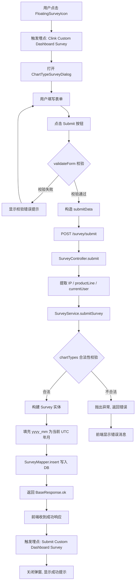
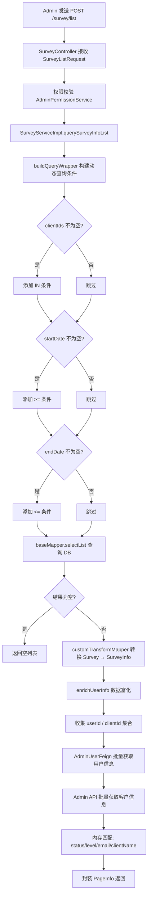
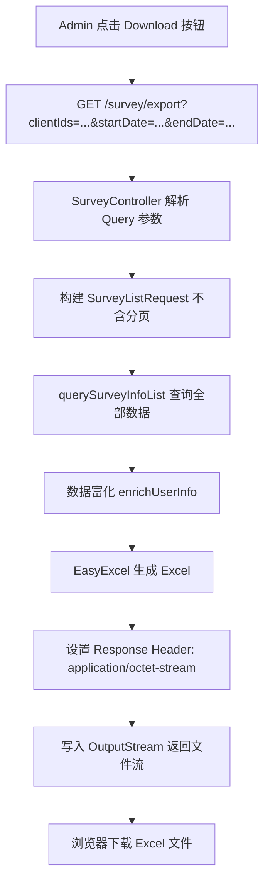

# 用户调查问卷 功能逻辑文档

> 本文档由 document-automation 工具自动生成，基于源代码、PRD 文档和技术评审文档。
> 生成时间: 2026-04-09 13:19:01
> 准确性评分: 未验证/100

---


# 用户调查问卷 功能逻辑文档

## 1. 模块概述

### 1.1 模块职责与定位

用户调查问卷模块（Survey Module）是 Custom Dashboard 产品中用于收集用户对图表类型偏好反馈的功能模块。该模块的核心目标是：通过在 Custom Dashboard 页面嵌入问卷入口，系统化地收集用户对新图表类型的需求和建议，为产品迭代提供数据支撑。

模块包含两个主要使用场景：
1. **用户端**：Custom Dashboard 页面右下角悬浮图标 → 打开问卷弹窗 → 填写图表类型偏好、需求描述、上传文档 → 提交问卷
2. **Admin 端**：Admin 后台 Customer Survey 页面 → 查询问卷列表（支持筛选、分页）→ 导出 Excel

### 1.2 系统架构位置与上下游关系

```
┌─────────────────────────────────────────────────────────┐
│                    前端 (Vue)                            │
│  FloatingSurveyIcon → ChartTypeSurveyDialog → API 调用   │
│  Admin Customer Survey 页面 → 列表/筛选/导出              │
└──────────────────────┬──────────────────────────────────┘
                       │ HTTP REST
                       ▼
┌─────────────────────────────────────────────────────────┐
│              custom-dashboard-api (后端)                  │
│  SurveyController → SurveyService → SurveyMapper        │
│                       │                                  │
│                       ├── AdminUserFeign (用户信息富化)    │
│                       └── Admin API (客户信息富化)         │
└──────────────────────┬──────────────────────────────────┘
                       │ MyBatis-Plus
                       ▼
┌─────────────────────────────────────────────────────────┐
│              MySQL (custom_dashboard)                     │
│              表: survey                                   │
└─────────────────────────────────────────────────────────┘
```

**上游依赖**：
- 前端 Custom Dashboard 页面（用户端问卷入口）
- 前端 Admin 后台页面（管理端查询/导出）
- S3 文件存储（前端直传文档）

**下游依赖**：
- `AdminUserFeign`：获取用户的 status、level、email 信息
- Admin API `/client/getClientsByIds`：获取客户的 clientName、serviceStatus 信息（参考 feature-health 项目 AdminApiClient 实现）

### 1.3 涉及的后端模块与前端组件

**后端模块**：
- Maven 模块：`custom-dashboard-api`
- 主包路径：`com.pacvue.api`

**后端核心类**：

| 类名 | 包路径 | 职责 |
|---|---|---|
| `SurveyController` | `com.pacvue.api.controller` | REST 控制器，处理问卷提交、列表查询、导出、客户下拉 |
| `SurveyService` | `com.pacvue.api.service` | 服务接口，定义问卷业务方法 |
| `SurveyServiceImpl` | `com.pacvue.api.service.impl`（**待确认**） | 服务实现，包含核心业务逻辑 |
| `Survey` | `com.pacvue.api.model` | 数据库实体类，对应 survey 表 |
| `SurveyMapper` | `com.pacvue.api.mapper` | MyBatis-Plus BaseMapper 泛型 DAO |
| `SurveySubmitRequest` | `com.pacvue.api.dto.request.survey` | 提交问卷请求 DTO |
| `SurveyListRequest` | `com.pacvue.api.dto.request.survey` | 查询列表请求 DTO |
| `SurveyInfo` | `com.pacvue.api.dto.response` | 问卷信息响应 VO（富化后） |
| `SurveyDocumentDto` | `com.pacvue.api.dto.response` | 上传文档 DTO |
| `CustomTransformMapper` | `com.pacvue.api`（**待确认**） | DTO/VO 转换映射器（Survey → SurveyInfo） |
| `SurveyConstants` | `com.pacvue.api.constatns` | 常量定义（图表类型合法值等） |
| `AdminPermissionService` | `com.pacvue.api.service` | Admin 权限校验服务 |

**前端组件**：

| 组件名 | 职责 |
|---|---|
| `FloatingSurveyIcon` | 悬浮调查图标，支持拖拽、展开/收起、首次引导提示 |
| `ChartTypeSurveyDialog` | 调查问卷弹窗，包含图表类型多选、需求描述富文本、文件上传及提交逻辑 |

### 1.4 设计模式

| 设计模式 | 应用场景 |
|---|---|
| MVC 分层架构 | Controller → Service → Mapper 三层分离 |
| MyBatis-Plus BaseMapper 泛型 DAO | `SurveyMapper extends BaseMapper<Survey>` 提供通用 CRUD |
| LambdaQueryWrapper 动态查询 | `buildQueryWrapper(request)` 根据筛选条件动态构建查询 |
| DTO/VO 转换模式 | `customTransformMapper.survey2SurveyInfo` 做实体到响应对象的映射 |
| 数据富化模式 | 查询后通过远程 API 批量补充用户/客户信息（`enrichUserInfo`） |

---

## 2. 用户视角

### 2.1 功能场景一：用户提交调查问卷

#### 2.1.1 背景与目标

根据 PRD 文档（Custom DB - 26Q1 - S4），多个客户反馈 Custom Dashboard 的图表类型不够丰富，不能满足需求，并提出了更多图表类型想法。为更好地收集客户直接意见并完善 Custom Dashboard 功能，需要增加用户问卷调研反馈收集入口。

#### 2.1.2 入口与展示规则

1. **悬浮图标位置**：Custom Dashboard 页面右下角新增悬浮图标（`FloatingSurveyIcon`）
2. **展示范围**：全平台（Amazon/Walmart/DSP 等所有产品线）
3. **默认状态**：收起状态，hover 时展开告诉用户可以参与 survey
4. **页面切换**：用户进入 Custom Dashboard 时出现，切换 Custom Dashboard 的不同功能页均展示该图标
5. **层级关系**：和页面视为同一层，当页面上打开新弹窗时，默认被遮罩无法点击
6. **可移动**：支持拖拽移动位置
7. **可关闭**：可暂时关闭（刷新或下次进入页面时重新显示）
8. **样式**（来自 26Q2 Sprint1 优化）：survey 收起的按钮底色换成蓝色，展开的按钮底色换成白色

#### 2.1.3 首次引导提示

功能上线后，用户首次进入 Custom Dashboard 时，需要有标注引导：
- **标题**：Share your feedback with us
- **文案**：Want a new chart type? Click the Survey button, share your suggestion with us!
- 用户点击确认按钮后消失

#### 2.1.4 自动打开优化（26Q2 Sprint1）

根据 CDB - 26Q2 - Sprint1 PRD 优化：用户登录的时候，直接把这个问卷打开让他填，如果关掉了以后都不打开。

#### 2.1.5 用户操作流程

**步骤 1**：用户进入 Custom Dashboard 页面，右下角出现悬浮调查图标（`FloatingSurveyIcon`）

**步骤 2**：用户点击悬浮图标，触发埋点事件 `"Clink Custom Dashboard Survey"`（参数：Feature Module: "Report", Sub Feature Module: "Custom Dashboard"），打开问卷弹窗（`ChartTypeSurveyDialog`）

**步骤 3**：用户在弹窗中填写以下内容：

| 元素名称 | 类型 | 必填 | 说明 |
|---|---|---|---|
| Chart Type Collection Survey | 文本 | - | 标题行 |
| Title | 文本框 | **待确认**（PRD 中提及但代码中 `SurveySubmitRequest` 未见 title 字段） | 支持用户自定义标题，提示文案 "Please Input Title"，纯文本，字符长度限制 |
| Preferred Chart Type | 多选项 | 是 | 图表类型多选，选项为名称+展示图表的图片，图片小图展示点击可放大，图片由 PM 配置写死 |
| Requirement Description | 富文本框 | 否 | 富文本框内字符数量限制 |
| Document Upload | 文件上传 | 否 | 支持点击/拖拽上传，格式 PDF/JPEG/PNG，数量最多 5 个，单文件大小限制 5MB |
| Submit | 按钮 | - | 点击时校验必填字段 |

**Preferred Chart Type 选项列表**（前端写死，非接口返回）：

| 名称 | 说明 |
|---|---|
| Scatter Plot | 散点图 |
| Radar | 雷达图 |
| Gauge | 仪表盘 |
| Rising Sun | 旭日图 |
| Decomposition Tree | 分解树 |
| Metric Relationship | 指标关系图 |
| Stacked Area | 堆叠面积图 |
| Funnel | 漏斗图 |

**步骤 4**：用户点击 Submit 按钮

- 前端执行表单校验（`validateForm()`），必填字段为空则不可提交
- 校验通过后，构造提交数据：
  ```javascript
  {
    chartTypes: formData.preferredChartTypes,        // 选中的图表类型数组
    description: formData.requirementDescription.trim(), // 需求描述（去除首尾空格）
    uploadedDocuments: fileList.value.map((file) => ({
      name: file.name,
      url: file.response?.data?.name ? fileOriginUrl + file.response?.data?.name : file.response?.url || file.url || "",
      size: file.size
    }))
  }
  ```
- 调用 `submitChartTypeSurvey(submitData)` 发送 POST 请求到 `/survey/submit`

**步骤 5**：提交成功后

- 触发埋点事件 `"Submit Custom Dashboard Survey"`（参数：Feature Module: "Report", Sub Feature Module: "Custom Dashboard"）
- 关闭问卷弹窗
- 展示提交成功反馈弹窗，文案：
  > Your feedback has been successfully submitted! We will carefully consider your suggestions and introduce new chart types accordingly. Every piece of feedback you provide is a tremendous source of motivation for us.
- 触发 `emit('submit-success')` 事件

**步骤 6**：提交失败时

- 显示错误消息：`err.data?.errorMsg || "Failed to submit survey."`
- 消息类型为 error

> **交叉验证说明**：PRD 中提到的 "Title" 字段在后端 `SurveySubmitRequest` 的代码片段中未明确看到（代码片段仅显示类声明，未展示完整字段列表）。但 DDL 中 survey 表也没有 title 字段，且前端提交数据中也未包含 title。**推测 Title 字段可能在后续迭代中被移除或未实现**，**待确认**。

### 2.2 功能场景二：Admin 查询问卷列表

#### 2.2.1 页面入口

根据 Figma 设计稿，Admin 后台导航栏在 feature usage 下新增一个 "Customer Survey" 菜单，与 feature usage 平级，点击 Customer Survey 查看 admin 数据。

#### 2.2.2 页面筛选器

| 名称 | 类型 | 说明 |
|---|---|---|
| Client | 下拉多选 | 通过 `GET /survey/clients` 获取客户列表 |
| Status | 下拉多选 | 选项：Active / Terminated |
| Submit Date | 日期筛选框 | 支持快捷选项，格式 yyyy-MM-dd |

#### 2.2.3 页面列表字段

| 名称 | 类型 | 说明 |
|---|---|---|
| Title | 文本 | 用户提交的反馈表中的标题（**待确认**，见上文说明） |
| Preferred Chart Type | 文本 | 反馈中选择的图表类型名称 |
| User/Login Name | 文本 | 提交反馈的用户名称 |
| Status | 文本 | 提交反馈的用户状态（Active/Terminated） |
| Level | 文本 | 提交反馈的用户级别 |
| Client | 文本 | 提交反馈的用户对应的 client 名称 |
| Email | 文本 | 提交反馈的用户邮箱 |
| Description | 文本 | 反馈的描述 |
| Document | 链接 | 上传的文件，支持预览和下载 |
| Submit Date | DateTime | 提交时间，格式 mm/dd/yy hh:mm:ss |

#### 2.2.4 操作流程

**步骤 1**：Admin 用户进入 Customer Survey 页面
**步骤 2**：页面加载时调用 `GET /survey/clients` 获取客户下拉选项
**步骤 3**：Admin 可选择筛选条件（Client、Status、Submit Date）
**步骤 4**：调用 `POST /survey/list` 获取分页问卷列表
**步骤 5**：页面展示问卷数据列表

### 2.3 功能场景三：Admin 导出 Excel

**步骤 1**：Admin 在 Customer Survey 页面设置筛选条件（可选）
**步骤 2**：点击 Download 按钮
**步骤 3**：调用 `GET /survey/export` 下载 Excel 文件
- 筛选器已筛选，则只下载已筛选的数据
- 筛选器未筛选，则下载全部数据
**步骤 4**：浏览器下载 Excel 文件（application/octet-stream）

### 2.4 埋点需求

| 埋点事件 | 触发时机 | 参数 |
|---|---|---|
| `Clink Custom Dashboard Survey` | 点击 Survey 悬浮按钮 | Feature Module: "Report", Sub Feature Module: "Custom Dashboard" |
| `Submit Custom Dashboard Survey` | 点击 Submit 按钮并成功提交 | Feature Module: "Report", Sub Feature Module: "Custom Dashboard" |

PRD 还提到需要关注两者的转换率（点击 Survey 按钮 → 成功提交的转化率）。

---

## 3. 核心 API

### 3.1 POST /survey/submit — 用户提交问卷

**路径**：`POST /survey/submit`

**请求头**：
- `Authorization`：用户认证 Token
- `productLine`：产品线标识（从 Header 中获取）

**请求参数**（`SurveySubmitRequest`）：

| 字段 | 类型 | 必填 | 说明 |
|---|---|---|---|
| `chartTypes` | `List<String>` | 是 | 用户选择的图表类型，可多选。合法值：`ScatterPlot` / `Radar` / `Gauge` / `DecompositionTree` / `RisingSun` / `MetricRelationship` / `StackedArea` / `Funnel` |
| `description` | `String` | 否 | 需求描述，富文本内容，限制字符长度 |
| `uploadedDocuments` | `List<SurveyDocumentDto>` | 否 | 前端直传 S3 后的文件信息，最多 5 个。每项包含 `url`(String)、`name`(String)、`size`(Long, 字节) |

**自动获取参数**（非请求体）：
- `productLine`：从 `getProductLine()` 获取（BaseController 方法，读取 Header）
- `ip`：从 `getClientIP(httpRequest)` 获取客户端 IP
- `currentUser`（`UserInfo`）：从 `getCurrentUser()` 获取（SecurityContext 中的用户信息，包含 userId、clientId、username）

**返回值**：
```json
{
  "code": 200,
  "message": "success",
  "data": null
}
```

**前端调用方式**：
```javascript
// 文件: index.js
export function submitChartTypeSurvey(data) {
  return request({
    url: `${VITE_APP_CustomDashbord}survey/submit`,
    method: "post",
    data
  })
}
```

### 3.2 POST /survey/list — Admin 查询问卷列表

**路径**：`POST /survey/list`

**请求头**：`Authorization`

**请求参数**（`SurveyListRequest`）：

| 字段 | 类型 | 必填 | 说明 |
|---|---|---|---|
| `clientIds` | `List<Integer>` | 否 | 按客户 ID 筛选 |
| `startDate` | `String` | 否 | 提交时间范围起始，格式 `yyyy-MM-dd` |
| `endDate` | `String` | 否 | 提交时间范围结束，格式 `yyyy-MM-dd` |
| `pageNo` | `Integer` | 否 | 页码，默认 1 |
| `pageSize` | `Integer` | 否 | 每页条数，默认 20 |

**返回值**（`BaseResponse<PageInfo<SurveyInfo>>`）：

```json
{
  "code": 200,
  "message": "success",
  "data": {
    "total": 100,
    "pageNo": 1,
    "pageSize": 20,
    "list": [
      {
        "id": 1,
        "chartTypes": "ScatterPlot,Radar",
        "username": "john.doe",
        "status": "Active",
        "level": "Admin",
        "clientId": 123,
        "clientName": "Acme Corp",
        "email": "john@acme.com",
        "description": "<p>需要散点图支持...</p>",
        "uploadedDocuments": [
          {"url": "https://s3.../doc1.pdf", "name": "doc1.pdf", "size": 1024000}
        ],
        "createTime": "01/15/26 14:30:00"
      }
    ]
  }
}
```

**响应字段说明**：

| 字段 | 类型 | 说明 |
|---|---|---|
| `id` | `Long` | 问卷记录 ID |
| `chartTypes` | `String` | 逗号分隔的图表类型名称 |
| `username` | `String` | 提交用户名 |
| `status` | `String` | 用户状态 Active / Terminated（通过 Admin API 富化） |
| `level` | `String` | 用户级别（通过 AdminUserFeign 富化） |
| `clientId` | `Integer` | 客户 ID |
| `clientName` | `String` | 客户名称（通过 Admin API 富化） |
| `email` | `String` | 用户邮箱（通过 AdminUserFeign 富化） |
| `description` | `String` | 需求描述 |
| `uploadedDocuments` | `List<Object>` | 上传文件列表，每项含 url / name / size |
| `createTime` | `String` | 提交时间，格式 mm/dd/yy HH:mm:ss |

### 3.3 GET /survey/export — Admin 导出 Excel

**路径**：`GET /survey/export`

**请求头**：`Authorization`

**请求参数**（Query String）：

| 字段 | 类型 | 必填 | 说明 |
|---|---|---|---|
| `clientIds` | `String` | 否 | 逗号分隔的客户 ID，如 `123,456` |
| `startDate` | `String` | 否 | 提交时间范围起始，格式 `yyyy-MM-dd` |
| `endDate` | `String` | 否 | 提交时间范围结束，格式 `yyyy-MM-dd` |

**返回值**：`application/octet-stream`（Excel 文件流）

**说明**：
- 查询条件与列表接口一致
- 使用 EasyExcel 生成 Excel 文件
- 生成 Excel 包含所有列表字段
- `uploadedDocuments` 列输出为 URL 链接
- 筛选器已筛选则只导出已筛选的数据，未筛选则导出全部

### 3.4 GET /survey/clients — Admin 客户下拉框查询

**路径**：`GET /survey/clients`

**请求头**：`Authorization`

**请求参数**：无

**返回值**（`BaseResponse<List<ClientInfoDto>>`）：

```json
{
  "code": 200,
  "message": "success",
  "data": [
    {
      "clientId": "123",
      "clientName": "Acme Corp",
      "serviceStatus": "Active"
    }
  ]
}
```

**响应字段说明**：

| 字段 | 类型 | 说明 |
|---|---|---|
| `clientId` | `String` | 客户 ID |
| `clientName` | `String` | 客户名称 |
| `serviceStatus` | `String` | 客户服务状态 Active / Terminated |

**说明**：
- 调用 Admin API `/client/getClientsByIds` 获取客户基本信息
- 返回 clientId + clientName + serviceStatus，供 Admin 页面 Client 下拉多选筛选器使用
- serviceStatus 可用于前端按 Active / Terminated 筛选

---

## 4. 核心业务流程

### 4.1 用户提交问卷流程

#### 4.1.1 详细步骤

**第 1 步：前端构造请求数据**

用户在 `ChartTypeSurveyDialog` 组件中填写表单后点击 Submit 按钮。前端首先执行 `validateForm()` 校验：
- `chartTypes`（Preferred Chart Type）为必填，至少选择一项
- 其他字段按规则校验（description 字符长度限制、uploadedDocuments 数量和大小限制等）

校验通过后，前端将 `formData.preferredChartTypes`（数组）、`formData.requirementDescription`（字符串，trim 处理）、`fileList`（文件列表，映射为 `{name, url, size}` 结构）组装为 `submitData` 对象。

文件 URL 的构造逻辑：
- 如果 `file.response?.data?.name` 存在，则 URL = `fileOriginUrl + file.response.data.name`（S3 直传后返回的文件名拼接基础 URL）
- 否则使用 `file.response?.url || file.url || ""`

**第 2 步：前端发送 HTTP 请求**

调用 `submitChartTypeSurvey(submitData)` 方法，发送 `POST` 请求到 `${VITE_APP_CustomDashbord}survey/submit`，请求体为 JSON 格式的 `submitData`。

**第 3 步：Controller 层接收与参数提取**

`SurveyController.submit()` 方法接收请求：
- `@RequestBody SurveySubmitRequest request`：反序列化请求体
- `HttpServletRequest httpRequest`：用于提取客户端 IP
- `getClientIP(httpRequest)`：从 HttpServletRequest 中获取客户端真实 IP（考虑代理转发等情况）
- `getProductLine()`：从请求 Header 中获取 productLine（BaseController 提供的方法）
- `getCurrentUser()`：从 SecurityContext 获取当前登录用户信息（UserInfo 对象，包含 userId、clientId、username 等）

**第 4 步：Service 层业务处理**

`SurveyService.submitSurvey(UserInfo userInfo, String productLine, String ip, SurveySubmitRequest request)` 执行以下逻辑：

1. **chartTypes 校验**：后端校验每个 chartType 值是否在合法常量范围内（`SurveyConstants` 中定义的合法值集合：`ScatterPlot`、`Radar`、`Gauge`、`DecompositionTree`、`RisingSun`、`MetricRelationship`、`StackedArea`、`Funnel`）。不合法则抛出异常。

2. **description 校验**：非必填，但如果提供则限制字符长度（具体长度限制值**待确认**）。

3. **uploadedDocuments 校验**：非必填，最多 5 个文件。

4. **构建 Survey 实体**：
   - `product_line`：从参数 productLine 获取
   - `client_id`：从 userInfo.clientId 获取
   - `user_id`：从 userInfo.userId 获取
   - `username`：从 userInfo.username 获取
   - `chart_types`：将 `List<String>` 用逗号拼接为字符串
   - `description`：直接使用请求中的 description
   - `ip`：从参数 ip 获取
   - `uploaded_documents`：将 `List<SurveyDocumentDto>` 序列化为 JSON 存储
   - `yyyy_mm`：自动填充当前年月（UTC 时间），格式如 "2026-01"
   - `create_time`：由数据库 `DEFAULT CURRENT_TIMESTAMP` 自动填充
   - `update_time`：由数据库 `DEFAULT CURRENT_TIMESTAMP ON UPDATE CURRENT_TIMESTAMP` 自动填充

5. **写入数据库**：通过 `SurveyMapper`（继承 `BaseMapper<Survey>`）的 `insert()` 方法将 Survey 实体写入 survey 表。

**第 5 步：返回响应**

Controller 返回 `BaseResponse.ok(null)`，HTTP 状态码 200。

**第 6 步：前端处理响应**

- 成功：触发埋点 `"Submit Custom Dashboard Survey"`，关闭弹窗，显示成功提示弹窗，触发 `emit('submit-success')`
- 失败：显示错误消息

#### 4.1.2 流程图



### 4.2 Admin 查询问卷列表流程

#### 4.2.1 详细步骤

**第 1 步：Admin 发送查询请求**

Admin 前端发送 `POST /survey/list`，请求体包含可选的筛选条件（clientIds、startDate、endDate）和分页参数（pageNo、pageSize）。

**第 2 步：Controller 层接收**

`SurveyController` 接收 `SurveyListRequest` 请求对象。此接口需要 Admin 权限校验（通过 `AdminPermissionService` 验证，具体校验逻辑**待确认**）。

**第 3 步：构建查询条件**

`SurveyServiceImpl` 中的 `buildQueryWrapper(request)` 方法使用 MyBatis-Plus 的 `LambdaQueryWrapper<Survey>` 动态构建查询条件：
- 如果 `clientIds` 不为空，添加 `IN` 条件：`survey.client_id IN (clientIds)`
- 如果 `startDate` 不为空，添加 `>=` 条件：`survey.create_time >= startDate 00:00:00`
- 如果 `endDate` 不为空，添加 `<=` 条件：`survey.create_time <= endDate 23:59:59`
- 按 `create_time` 降序排列（**待确认**，通常列表查询按时间倒序）

**第 4 步：查询数据库**

通过 `this.baseMapper.selectList(queryWrapper)` 查询 survey 表，获取 `List<Survey>` 结果。

> **注意**：根据代码片段 `querySurveyInfoList` 方法使用的是 `selectList` 而非分页查询方法。分页逻辑可能在外层通过 MyBatis-Plus 的 `Page` 对象实现，或者在 `querySurveyInfoList` 外部进行分页处理。具体分页实现方式**待确认**。

**第 5 步：实体转换**

如果查询结果不为空，通过 `customTransformMapper.survey2SurveyInfo` 将每个 `Survey` 实体转换为 `SurveyInfo` VO 对象：
```java
List<SurveyInfo> infoList = surveys.stream()
    .map(customTransformMapper::survey2SurveyInfo)
    .collect(Collectors.toList());
```

转换映射关系（推测）：
- `Survey.chartTypes` → `SurveyInfo.chartTypes`（字符串，逗号分隔）
- `Survey.username` → `SurveyInfo.username`
- `Survey.clientId` → `SurveyInfo.clientId`
- `Survey.description` → `SurveyInfo.description`
- `Survey.uploadedDocuments`（JSON）→ `SurveyInfo.uploadedDocuments`（`List<Object>`）
- `Survey.createTime` → `SurveyInfo.createTime`（格式化为 mm/dd/yy HH:mm:ss）

**第 6 步：数据富化**

调用 `enrichUserInfo(infoList)` 方法，批量补充用户和客户信息：

1. **收集需要富化的 ID**：从 infoList 中提取所有不重复的 userId 和 clientId
2. **调用 AdminUserFeign**：批量获取用户的 status、level、email 信息
3. **调用 Admin API `/client/getClientsByIds`**：批量获取客户的 clientName、serviceStatus 信息
4. **内存匹配**：将远程 API 返回的信息按 userId / clientId 匹配到对应的 SurveyInfo 对象中：
   - `SurveyInfo.status` ← AdminUserFeign 返回的用户状态
   - `SurveyInfo.level` ← AdminUserFeign 返回的用户级别
   - `SurveyInfo.email` ← AdminUserFeign 返回的用户邮箱
   - `SurveyInfo.clientName` ← Admin API 返回的客户名称

**第 7 步：返回分页结果**

将富化后的 `List<SurveyInfo>` 封装为 `PageInfo<SurveyInfo>` 返回给前端。

#### 4.2.2 流程图



### 4.3 Admin 导出 Excel 流程

#### 4.3.1 详细步骤

**第 1 步**：Admin 前端发送 `GET /survey/export?clientIds=123,456&startDate=2026-01-01&endDate=2026-02-24`

**第 2 步**：Controller 接收 Query String 参数，将 `clientIds` 字符串按逗号分隔解析为 `List<Integer>`

**第 3 步**：复用 `querySurveyInfoList` 方法查询并富化数据（与列表接口逻辑一致，但不分页，查询全部符合条件的数据）

**第 4 步**：使用 EasyExcel 生成 Excel 文件：
- 设置 HTTP 响应头为 `application/octet-stream`
- 设置 `Content-Disposition` 为附件下载
- 将 `List<SurveyInfo>` 写入 Excel
- `uploadedDocuments` 列输出为 URL 链接文本

**第 5 步**：将 Excel 文件流写入 HttpServletResponse 的 OutputStream

#### 4.3.2 流程图



### 4.4 Admin 客户下拉框查询流程

#### 4.4.1 详细步骤

**第 1 步**：Admin 前端页面加载时发送 `GET /survey/clients`

**第 2 步**：Controller 接收请求，调用 Service 层方法

**第 3 步**：Service 层先从 survey 表中查询所有不重复的 clientId（**待确认**，也可能直接调用 Admin API 获取全部客户），然后调用 Admin API `/client/getClientsByIds` 获取客户基本信息

**第 4 步**：返回 `List<ClientInfoDto>`，包含 clientId、clientName、serviceStatus

**第 5 步**：前端使用返回数据填充 Client 下拉多选筛选器，serviceStatus 可用于前端按 Active / Terminated 进一步筛选

---

## 5. 数据模型

### 5.1 数据库表结构

**表名**：`survey`
**数据库**：`custom_dashboard`（生产环境）/ `custom_dashboard_test`（测试环境）
**存储引擎**：InnoDB
**字符集**：utf8mb4，排序规则 utf8mb4_0900_ai_ci
**表注释**：图表类型收集调查表

| 字段名 | 类型 | 默认值 | 是否必填 | 注释 |
|---|---|---|---|---|
| `id` | `bigint` NOT NULL AUTO_INCREMENT | - | 是（自增） | 自增 ID，主键 |
| `product_line` | `varchar(30)` NOT NULL | - | 是 | 产品线标识（如 Amazon、Walmart、DSP 等） |
| `client_id` | `int` NOT NULL | - | 是 | 客户 ID |
| `user_id` | `int` NOT NULL | - | 是 | 用户 ID |
| `username` | `varchar(64)` NOT NULL | `''` | 是 | 用户名 |
| `chart_types` | `varchar(2048)` NOT NULL | `''` | 是 | 首选图表类型，多个逗号分隔 |
| `description` | `text` | NULL | 否 | 需求描述（富文本内容） |
| `ip` | `varchar(64)` NOT NULL | `''` | 是 | 来源的 IP 地址 |
| `uploaded_documents` | `json` | NULL | 否 | 上传的文档列表，格式：`[{"url":"xxx","name":"xxx","size":xxx}]` |
| `metadata` | `varchar(200)` | NULL | 否 | 冗余字段，额外信息 |
| `create_time` | `datetime` | `CURRENT_TIMESTAMP` | 否（自动） | 创建时间 |
| `update_time` | `datetime` | `CURRENT_TIMESTAMP ON UPDATE CURRENT_TIMESTAMP` | 否（自动） | 更新时间 |
| `yyyy_mm` | `varchar(16)` NOT NULL | `''` | 是 | 年月（如 "2026-01"），用于按月分区查询 |

**索引**：

| 索引名 | 字段 | 类型 | 说明 |
|---|---|---|---|
| `PRIMARY` | `id` | 主键 | 自增主键 |
| `idx_client_id_user_id` | `client_id, user_id` | 普通索引 | 按客户和用户联合查询 |
| `idx_create_time` | `create_time` | 普通索引 | 按创建时间范围查询 |
| `idx_chart_types` | `chart_types` | 普通索引 | 按图表类型查询（**注意**：仅生产环境 DDL 中存在此索引，测试环境 DDL 中无此索引） |
| `idx_yyyy_mm` | `yyyy_mm` | 普通索引 | 年月索引，用于按月查询 |

> **DDL 差异说明**：生产环境（`custom_dashboard`）的 DDL 包含 `idx_chart_types` 索引，而测试环境（`custom_dashboard_test`）的 DDL 不包含此索引。这可能是版本迭代中的差异，**待确认**是否为有意为之。

### 5.2 核心 DTO/VO

#### 5.2.1 SurveySubmitRequest（请求 DTO）

**包路径**：`com.pacvue.api.dto.request.survey`

| 字段 | 类型 | 说明 |
|---|---|---|
| `chartTypes` | `List<String>` | 用户选择的图表类型列表 |
| `description` | `String` | 需求描述（富文本） |
| `uploadedDocuments` | `List<SurveyDocumentDto>` | 上传文档列表 |

#### 5.2.2 SurveyDocumentDto（文档 DTO）

**包路径**：`com.pacvue.api.dto.response`

| 字段 | 类型 | 说明 |
|---|---|---|
| `name` | `String` | 文件名 |
| `url` | `String` | 文件 URL（S3 地址） |
| `size` | `Long` | 文件大小（字节） |

#### 5.2.3 SurveyListRequest（查询请求 DTO）

**包路径**：`com.pacvue.api.dto.request.survey`

| 字段 | 类型 | 说明 |
|---|---|---|
| `clientIds` | `List<Integer>` | 客户 ID 列表（筛选条件） |
| `startDate` | `String` | 开始日期，格式 yyyy-MM-dd |
| `endDate` | `String` | 结束日期，格式 yyyy-MM-dd |
| `pageNo` | `Integer` | 页码，默认 1 |
| `pageSize` | `Integer` | 每页条数，默认 20 |

#### 5.2.4 SurveyInfo（响应 VO）

**包路径**：`com.pacvue.api.dto.response`

| 字段 | 类型 | 说明 | 数据来源 |
|---|---|---|---|
| `id` | `Long` | 问卷记录 ID | survey 表 |
| `chartTypes` | `String` | 逗号分隔的图表类型名称 | survey 表 |
| `username` | `String` | 提交用户名 | survey 表 |
| `status` | `String` | 用户状态 Active / Terminated | AdminUserFeign 富化 |
| `level` | `String` | 用户级别 | AdminUserFeign 富化 |
| `clientId` | `Integer` | 客户 ID | survey 表 |
| `clientName` | `String` | 客户名称 | Admin API 富化 |
| `email` | `String` | 用户邮箱 | AdminUserFeign 富化 |
| `description` | `String` | 需求描述 | survey 表 |
| `uploadedDocuments` | `List<Object>` | 上传文件列表 | survey 表（JSON 反序列化） |
| `createTime` | `String` | 提交时间，格式 mm/dd/yy HH:mm:ss | survey 表（格式化） |

#### 5.2.5 Survey（数据库实体）

**包路径**：`com.pacvue.api.model`

```java
@EqualsAndHashCode
@Data
@TableName
public class Survey extends Model<Survey> {
    @TableId(type = IdType.AUTO)
    private Long id;
    private String productLine;
    private Integer clientId;
    private Integer userId;
    private String username;
    private String chartTypes;
    private String description;
    private String ip;
    private String uploadedDocuments;  // JSON 字符串
    private String metadata;
    private LocalDateTime createTime;
    private LocalDateTime updateTime;
    private String yyyyMm;
}
```

> **注意**：`Survey` 类继承了 `Model<Survey>`（MyBatis-Plus ActiveRecord 模式），同时也通过 `SurveyMapper` 使用 BaseMapper 模式。实际使用中以 BaseMapper 模式为主（从 `querySurveyInfoList` 代码中 `this.baseMapper.selectList` 可见）。

#### 5.2.6 SurveyConstants（常量接口）

**包路径**：`com.pacvue.api.constatns`

定义图表类型的合法值集合（`List<String>` 或 `Set<String>`），用于后端校验 chartTypes 参数的合法性。

合法值域：
- `ScatterPlot`
- `Radar`
- `Gauge`
- `DecompositionTree`
- `RisingSun`
- `MetricRelationship`
- `StackedArea`
- `Funnel`

#### 5.2.7 ClientInfoDto（客户信息 DTO）

**包路径**：`com.pacvue.feign.dto.response`

| 字段 | 类型 | 说明 |
|---|---|---|
| `clientId` | `String` | 客户 ID |
| `clientName` | `String` | 客户名称 |
| `serviceStatus` | `String` | 客户服务状态 Active / Terminated |

---

## 6. 平台差异

### 6.1 全平台支持

根据 PRD 文档，用户调查问卷功能的范围为**全平台**，即所有产品线（Amazon、Walmart、DSP 等）的 Custom Dashboard 页面均展示悬浮调查图标。

### 6.2 productLine 记录

提交问卷时，后端通过 `getProductLine()` 从请求 Header 中获取当前产品线标识，并存储到 survey 表的 `product_line` 字段中。这使得 Admin 端可以按产品线分析用户反馈分布。

### 6.3 无平台特殊处理逻辑

当前模块不涉及平台特有的指标映射、配置或枚举值差异。图表类型选项（Scatter Plot、Radar 等）在所有平台中保持一致，前端写死而非通过接口动态获取。

---

## 7. 配置与依赖

### 7.1 Feign 下游服务依赖

#### 7.1.1 AdminUserFeign

**用途**：获取用户的 status、level、email 信息

**调用场景**：`enrichUserInfo` 方法中，批量获取问卷提交者的用户详细信息

**接口说明**：
- 输入：用户 ID 列表
- 输出：用户信息列表（包含 status、level、email）

#### 7.1.2 Admin API — /client/getClientsByIds

**用途**：获取客户的 clientName、serviceStatus 信息

**调用场景**：
1. `enrichUserInfo` 方法中，批量获取客户名称用于列表展示
2. `GET /survey/clients` 接口中，获取客户下拉选项

**实现参考**：feature-health 项目的 `AdminApiClient` 实现

**接口说明**：
- 输入：客户 ID 列表
- 输出：客户信息列表（包含 clientId、clientName、serviceStatus）

### 7.2 前端配置

| 配置项 | 说明 |
|---|---|
| `VITE_APP_CustomDashbord` | Custom Dashboard API 基础路径，用于拼接请求 URL |
| `fileOriginUrl` | S3 文件基础 URL，用于拼接上传文件的完整访问地址 |

### 7.3 文件上传

文件上传采用**前端直传 S3** 模式：
- 前端组件直接将文件上传到 S3 存储
- S3 返回文件名/URL
- 前端将文件信息（name、url、size）作为 `uploadedDocuments` 字段提交给后端
- 后端仅存储文件元信息（JSON 格式），不处理文件二进制数据

### 7.4 Excel 导出

使用 **EasyExcel** 库生成 Excel 文件，通过 HTTP 响应流直接返回给浏览器下载。

### 7.5 缓存策略

当前代码片段中未发现 Redis 缓存或其他缓存策略的使用。**待确认**是否有缓存客户信息等优化。

### 7.6 消息队列

当前模块未使用 Kafka 或其他消息队列。

---

## 8. 版本演进

### 8.1 版本时间线

| 版本 | 时间 | 来源 | 变更内容 |
|---|---|---|---|
| V1.0 - 初始版本 | 2026 Q1 Sprint 4 | Custom DB - 26Q1 - S4 PRD + 技术评审 | 新增用户问卷调研反馈收集入口：悬浮图标、问卷弹窗、提交逻辑、Admin 查询/导出功能 |
| V1.1 - Survey 优化 | 2026 Q2 Sprint 1 | CDB - 26Q2 - Sprint1 PRD | 用户登录时直接打开问卷（关掉后不再自动打开）；收起按钮底色改为蓝色，展开按钮底色改为白色 |

### 8.2 V1.0 详细变更（26Q1 S4）

**Ticket**：CP-433552d230ccc-cd78-3da5-b425-afe8d8c06482

**新增内容**：
1. 数据库：创建 `survey` 表
2. 后端：新增 `SurveyController`（4 个接口）、`SurveyService`、`SurveyServiceImpl`、相关 DTO/VO
3. 前端：新增 `FloatingSurveyIcon` 悬浮组件、`ChartTypeSurveyDialog` 问卷弹窗组件
4. Admin 端：新增 Customer Survey 菜单和页面
5. 埋点：新增 2 个埋点事件
6. 首次引导提示功能

### 8.3 V1.1 详细变更（26Q2 Sprint1）

**变更内容**：
1. 用户登录时自动打开问卷弹窗（首次）
2. 关闭后不再自动打开（需要记录用户是否已关闭的状态，可能通过 localStorage 或后端标记实现，**待确认**）
3. UI 样式调整：收起按钮底色蓝色，展开按钮底色白色

### 8.4 待优化项与技术债务

1. **DDL 索引不一致**：生产环境有 `idx_chart_types` 索引，测试环境没有，需要统一
2. **Title 字段缺失**：PRD 中提到的 Title 字段在数据库表和前端提交数据中均未体现，需确认是否为已移除的需求
3. **分页实现**：`querySurveyInfoList` 方法使用 `selectList` 而非分页查询，分页逻辑的具体实现方式需要确认
4. **Excel 中图片处理**：PRD 中提到"考虑图片怎么塞到 excel 里"，当前技术评审文档中明确 `uploadedDocuments` 列输出为 URL 链接，但是否有图片嵌入 Excel 的需求**待确认**
5. **Status 筛选**：PRD 中 Admin 页面筛选器包含 Status（Active/Terminated）下拉多选，但后端 `SurveyListRequest` 中未见 status 字段。Status 筛选可能在前端实现（基于 `GET /survey/clients` 返回的 serviceStatus 进行前端过滤），**待确认**

---

## 9. 已知问题与边界情况

### 9.1 代码中的 TODO/FIXME

当前提供的代码片段中未发现明确的 TODO 或 FIXME 注释。完整代码中可能存在，**待确认**。

### 9.2 异常处理与降级策略

#### 9.2.1 提交问卷异常处理

- **chartTypes 校验失败**：后端校验 chartTypes 中的值不在合法常量范围内时，抛出异常返回错误响应
- **前端异常捕获**：`handleSubmit` 方法中使用 try-catch 捕获异常，显示 `err.data?.errorMsg || "Failed to submit survey."` 错误消息
- **提交状态管理**：使用 `submitting.value` 标志防止重复提交，finally 块中重置状态

#### 9.2.2 数据富化降级

- **AdminUserFeign 调用失败**：如果获取用户信息的远程调用失败，`enrichUserInfo` 方法的降级策略**待确认**。可能的处理方式：
  - 返回部分数据（status/level/email 为空）
  - 抛出异常导致整个列表查询失败
- **Admin API 调用失败**：同上，clientName 可能为空

#### 9.2.3 文件上传边界情况

- **文件大小限制**：单文件 5MB，前端校验
- **文件数量限制**：最多 5 个，前端校验
- **文件格式限制**：PDF/JPEG/PNG，前端校验
- **S3 上传失败**：前端直传 S3 失败时的处理逻辑由前端组件处理
- **URL 构造容错**：前端代码中对文件 URL 有多级 fallback：`file.response?.data?.name` → `file.response?.url` → `file.url` → `""`

### 9.3 并发与性能

#### 9.3.1 并发提交

- 同一用户可能多次提交问卷（代码中未见去重逻辑），每次提交都会创建新记录
- `submitting.value` 标志仅防止前端重复点击，不防止并发请求

#### 9.3.2 数据富化性能

- `enrichUserInfo` 方法对每次列表查询都会调用远程 API 进行数据富化
- 如果问卷数据量大，批量获取用户/客户信息的远程调用可能成为性能瓶颈
- 建议考虑缓存用户/客户信息以减少远程调用次数

#### 9.3.3 导出性能

- `GET /survey/export` 不分页，查询全部符合条件的数据
- 如果数据量非常大，可能导致内存溢出或响应超时
- EasyExcel 支持流式写入，可以一定程度缓解内存压力

### 9.4 数据一致性

- survey 表中存储的 `username` 是提交时的快照，如果用户后续修改用户名，历史记录中的 username 不会更新
- `status`、`level`、`email`、`clientName` 通过远程 API 实时获取，始终反映最新状态
- 这意味着同一用户的不同问卷记录中，username 可能与当前实际用户名不一致

### 9.5 安全性

- 提交接口通过 `getCurrentUser()` 从 SecurityContext 获取用户信息，防止用户伪造身份
- Admin 接口需要 

---

*本文档由 AI 自动生成，如有不准确之处请以源代码为准。标注"待确认"的内容需要人工核实。*