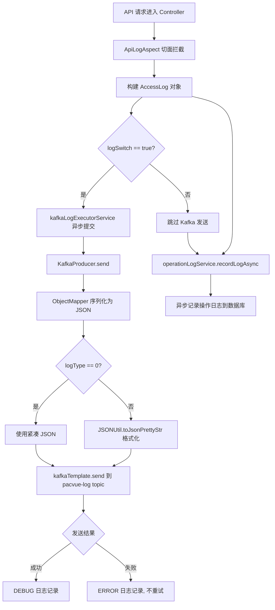
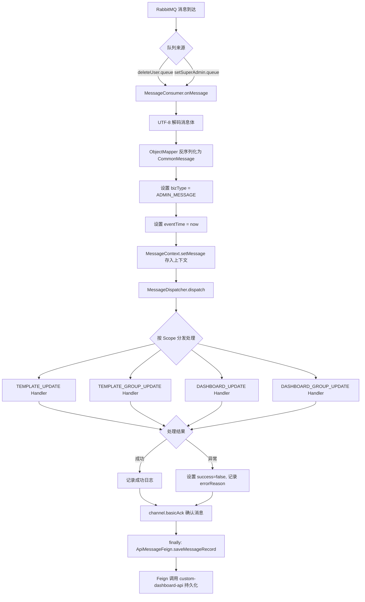
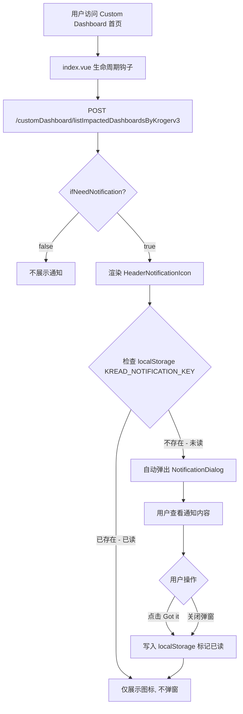

# 消息通知模块 功能逻辑文档

> 本文档由 document-automation 工具自动生成，基于源代码、PRD 文档和技术评审文档。
> 生成时间: 2026-04-09 13:19:25
> 准确性评分: 未验证/100

---


# 消息通知模块 功能逻辑文档

## 1. 模块概述

### 1.1 模块职责与定位

消息通知模块是 Pacvue Custom Dashboard 系统中负责**消息生产、消费、持久化和前端通知展示**的核心基础设施模块。该模块承担以下四大职责：

1. **日志消息生产（Kafka）**：通过 AOP 切面拦截 API 调用，异步将访问日志推送到 Kafka 集群，供下游日志分析系统消费。
2. **管理员消息消费（RabbitMQ）**：监听 RabbitMQ 中的管理员操作消息（如删除用户、设置超级管理员），反序列化后按消息类型分发到不同的业务处理器。
3. **消息记录持久化**：通过 Feign 远程调用 `custom-dashboard-api` 服务，将消息消费记录写入数据库，实现消息的可追溯性。
4. **前端通知展示**：在 Custom Dashboard 前端页面提供通知图标入口和弹窗组件，支持已读状态管理。

### 1.2 系统架构位置与上下游关系

```
┌─────────────────────────────────────────────────────────────────┐
│                        前端 (Vue)                                │
│  ┌──────────────────────┐  ┌──────────────────────────────┐     │
│  │ HeaderNotificationIcon│  │ NotificationDialog           │     │
│  └──────────┬───────────┘  └──────────────┬───────────────┘     │
│             │ API 调用                      │ localStorage       │
│             ▼                              ▼                     │
│  POST /customDashboard/listImpactedDashboardsByKrogerv3         │
└─────────────────────────────────────────────────────────────────┘
                              │
                              ▼
┌─────────────────────────────────────────────────────────────────┐
│                  custom-dashboard-api (后端主服务)                │
│  ┌──────────────┐  ┌──────────────────┐                         │
│  │ ApiLogAspect │  │ 消息记录Controller │                        │
│  │  (AOP切面)   │  │ /message/*       │                         │
│  └──────┬───────┘  └────────▲─────────┘                         │
│         │                    │ Feign 调用                        │
│         ▼                    │                                   │
│  ┌──────────────┐            │                                   │
│  │KafkaProducer │            │                                   │
│  └──────┬───────┘            │                                   │
└─────────┼────────────────────┼───────────────────────────────────┘
          │                    │
          ▼                    │
   ┌──────────────┐   ┌───────┴──────────────────────────────┐
   │ Kafka Cluster │   │  custom-dashboard-message (消息服务)  │
   │ (pacvue-log)  │   │  ┌──────────────┐                    │
   └───────────────┘   │  │MessageConsumer│◄── RabbitMQ       │
                       │  └──────┬───────┘                    │
                       │         ▼                             │
                       │  ┌──────────────────┐                │
                       │  │MessageDispatcher  │                │
                       │  └──────┬───────────┘                │
                       │         ▼                             │
                       │  ┌──────────────────┐                │
                       │  │ ApiMessageFeign   │───► Feign ────┘
                       │  └──────────────────┘
                       └──────────────────────────────────────┘
```

**上游依赖：**
- RabbitMQ：接收来自管理员平台（Admin）的用户操作消息（deleteUser、setSuperAdmin）
- 各业务 Controller：被 `ApiLogAspect` 切面拦截，产生访问日志

**下游依赖：**
- Kafka 集群（topic: `pacvue-log`）：接收日志消息
- `custom-dashboard-api` 服务：通过 Feign 接口持久化消息记录

### 1.3 涉及的后端模块

| Maven 模块名 | 职责 | 关键类 |
|---|---|---|
| `custom-dashboard-message` | 独立微服务，负责 RabbitMQ 消息消费与分发 | `MessageConsumer`, `MessageDispatcher`, `ApiMessageFeign` |
| `custom-dashboard-api`（部分） | 主服务，包含 Kafka 日志生产、消息记录持久化接口、通知列表接口 | `KafkaProducer`, `ApiLogAspect`, 消息记录 Controller |

### 1.4 涉及的前端组件

| 组件 | 路径 | 职责 |
|---|---|---|
| `NotificationDialog` | `dialog/NotificationDialog.vue` | Kroger V3 改造通知弹窗 |
| `HeaderNotificationIcon` | `components/HeaderNotificationIcon.vue` | 标题栏通知图标入口 |

### 1.5 部署方式

`custom-dashboard-message` 是一个独立的 Spring Boot 微服务，启动类为 `CustomDashboardMessageApplication`：

```java
@SpringBootApplication(scanBasePackages = {"com.pacvue"},
        exclude = {DynamicDataSourceAutoConfiguration.class, 
                   DataSourceAutoConfiguration.class, 
                   MybatisPlusAutoConfiguration.class})
@EnableFeignClients(basePackages = "com.pacvue.message.sdk")
@EnableDiscoveryClient
public class CustomDashboardMessageApplication {
    public static void main(String[] args) {
        SpringApplication.run(CustomDashboardMessageApplication.class, args);
    }
}
```

注意该服务排除了数据源自动配置（`DynamicDataSourceAutoConfiguration`、`DataSourceAutoConfiguration`、`MybatisPlusAutoConfiguration`），说明 **`custom-dashboard-message` 本身不直接连接数据库**，所有持久化操作通过 Feign 远程调用 `custom-dashboard-api` 完成。

---

## 2. 用户视角

### 2.1 Kroger V3 改造通知（已实现）

**场景描述：** 当 Kroger V3 改造影响到用户的 Dashboard 时，系统需要在页面加载时主动通知用户。

**用户操作流程：**

1. **页面加载**：用户访问 Custom Dashboard 首页（`index.vue`）。
2. **通知检查**：前端调用 `POST /customDashboard/listImpactedDashboardsByKrogerv3` 接口，传入 `data` 对象（含 `endTime` 字段），获取受 Kroger V3 改造影响的 Dashboard 列表。
3. **通知判断**：接口返回结果中包含 `ifNeedNotification` 字段：
   - 若为 `true`，在标题栏渲染 `HeaderNotificationIcon` 组件（通知图标入口）。
   - 若为 `false`，不展示通知图标。
4. **已读检查**：前端检查 `localStorage` 中的 `KREAD_NOTIFICATION_KEY` 键值：
   - 若不存在（未读），自动弹出 `NotificationDialog` 弹窗。
   - 若已存在（已读），仅展示图标，不自动弹窗。
5. **用户交互**：用户在 `NotificationDialog` 弹窗中点击 **"Got it"** 按钮或关闭弹窗。
6. **标记已读**：前端将已读标记写入 `localStorage`（key: `KREAD_NOTIFICATION_KEY`），后续页面加载不再自动弹窗。

**UI 交互要点：**
- `HeaderNotificationIcon`：位于页面标题栏，以图标形式展示，点击可手动打开通知弹窗。
- `NotificationDialog`：模态弹窗，展示受影响的 Dashboard 列表信息，底部有 "Got it" 确认按钮。

### 2.2 Budget Manager 消息通知与待办事项（PRD 规划中）

根据 PRD 文档 **"Budget Manager - 26Q1 - S4"**，Budget Manager 计划新增消息通知和待办事项模块。**注意：以下内容来源于 PRD，需与代码交叉验证其实现状态。根据当前代码片段，该功能尚未在 Custom Dashboard 消息模块中体现具体实现，属于规划中的功能。**

**背景：** 目前 BM 的自动化调整的主要变化以及用户需要采取的措施没有及时传达给用户，用户无法及时清楚感知什么设置被修改以及还有什么待办事项需要去做。

**功能区结构：**

#### 2.2.1 标题行模块

在 Budget Manager 标题行新增 **【Recent Notice & To-Do Items】** 功能区：

| 名称 | 说明 |
|---|---|
| Recent Notice & To-Do Items | Icon 区分功能，Icon 旁展示该功能下消息数量 |
| Show All | 点击按钮后展开功能区 |

**消息数量提示规则：**

- **Recent Notice**：展示所有未读的消息数量。当用户点击 Show All 后，默认用户查看了所有未读数据，清空数量。
- **To-Do Items**：展示所有未读的消息数量。点击 Clear All 后，默认用户处理了所有未读数据，清空数量。此时判断 To-Do Items 是否全部已办：若无，则显示红点状态；若已办，则不展示数量也不展示状态。
- **展示优先级**：数量 > 状态。

#### 2.2.2 Recent Notice

| 名称 | 类型 | 说明 |
|---|---|---|
| Recent Notice | 标题 | 标题旁 icon，hover 时展示说明文案：仅展示最近 7 天（不包含今天）BM 自动化对物料做出的修改 |
| Clear All | 按钮 | 点击按钮清除当前消息 |
| Notice | 文本 | 展示最近 7 天对 BM 物料做的修改和操作事件 |

**Notice 格式规则：**
- 不同类型的事件用不同颜色的圆点标记
- 事件内容左对齐，时间右对齐
- 当前功能区一次性最多展示 3 条事件内容，超出 3 条时可滚动向下查看
- 按事件发生时间倒序排列，最晚发生的事件在最上方
- 超出一行的消息缩略，hover 时 tooltip 展示全部内容

#### 2.2.3 To-Do Items

**需要展示的 Action 来源：** 最近 7 天内（包括今天）Task Center 中 Update Status 为 Succeed 的事件。

**需要展示的 Action 类型：**
- Auto Pacing
- Stop Over-spend
- Auto Re-enable
- 上个月执行过 stop 但这个月没有重启 campaign
- Delivery Rate 太高或太低

**需要展示的 Action 内容：**
- Daily Budget Changed
- Campaign Enabled
- Campaign Paused

**展示格式示例：**
```
【Auto Pacing】SD_image_20260120_A01  Daily Budget Changed from $16.63 to $24.06  01/26/2026 22:33:20(PST)
【Stop Over-spend】sp_auto_20260120_A05  Changed from enabled to paused  01/26/2026 22:32:20(PST)
【Auto Re-enable】01-20-SP-Ad-video-3  Changed from paused to enabled  01/26/2026 22:31:20(PST)
```

**需要提示的 To-Do Items（potential risk 和首页横幅提示）：**

| 事项 | 标记颜色 |
|---|---|
| 下个月的 Budget 未设置 | 红色 |
| Auto Pacing 关闭 | 黄色 |
| Stop Over-Spend 关闭 | 黄色 |
| Auto Re-enable 关闭 | 黄色 |
| 最小预算之和大于本月剩余天数的平均日预算 | 蓝色 |
| 该 tag 开启了 Auto Re-enable 但未设置下个月的预算 | 蓝色 |

**范围：** Amazon

> **交叉验证说明：** 当前代码片段中未发现 Budget Manager 消息通知相关的 Controller、Service 或前端组件实现。该功能属于 26Q1-S4 规划，**待确认**是否已进入开发阶段。

### 2.3 管理员消息通知（后端已实现）

**场景描述：** 当管理员执行删除用户（deleteUser）或设置超级管理员（setSuperAdmin）操作时，系统通过 RabbitMQ 广播消息，`custom-dashboard-message` 服务消费后进行业务处理（更新模板、Dashboard 等关联数据），并持久化消息记录。

**用户操作流程：**
1. 管理员在 Admin 平台执行删除用户或设置超级管理员操作。
2. Admin 平台发送消息到 RabbitMQ（fanout exchange）。
3. `custom-dashboard-message` 服务消费消息，按业务范围（Template/Dashboard 及其分组）分发处理。
4. 处理完成后，通过 Feign 调用 `custom-dashboard-api` 持久化消息记录。

> 该流程对终端用户透明，用户不直接感知消息消费过程，但其结果（如模板/Dashboard 权限变更）会影响用户可见的数据。

---

## 3. 核心 API

### 3.1 消息记录保存接口

- **路径**: `POST /message/saveMessageRecord`
- **所属服务**: `custom-dashboard-api`
- **调用方**: `custom-dashboard-message` 通过 `ApiMessageFeign` Feign 客户端调用
- **参数**:
  ```json
  {
    // BaseMessage 字段（CommonMessage 的父类）
    // 具体字段待确认，根据代码推断至少包含：
    "bizType": "ADMIN_MESSAGE",       // 业务类型
    "eventTime": "2025-01-01T00:00:00", // 事件时间
    "success": true,                   // 处理是否成功
    "errorReason": null,               // 失败原因（成功时为null）
    "deletedUserId": 12345             // 被删除的用户ID（deleteUser场景）
    // 其他字段待确认
  }
  ```
- **返回值**: `BaseResponse<Void>` — 标准响应包装，无业务数据返回
- **说明**: 记录消息消费的处理结果，无论成功或失败都会调用此接口（在 `finally` 块中执行）。失败时 `success` 为 `false`，`errorReason` 记录异常信息。

### 3.2 模板查询接口（消息服务内部使用）

- **路径**: `POST /message/template/listByUserIds`
- **所属服务**: `custom-dashboard-api`
- **调用方**: `custom-dashboard-message` 通过 `ApiMessageFeign` Feign 客户端调用
- **参数**: `BaseMessage`（包含用户 ID 列表等信息，**具体字段待确认**）
- **返回值**: `BaseResponse<List<TemplateInfo>>` — 返回指定用户关联的模板信息列表
- **说明**: 在消息分发处理过程中，用于查询受影响用户关联的模板数据，以便进行模板更新/转移等操作。

### 3.3 Kroger V3 影响 Dashboard 通知列表接口

- **路径**: `POST /customDashboard/listImpactedDashboardsByKrogerv3`
- **所属服务**: `custom-dashboard-api`
- **调用方**: 前端 `index.vue` 页面加载时调用
- **参数**:
  ```json
  {
    "endTime": "2025-06-30"  // 截止时间，用于筛选受影响的Dashboard
  }
  ```
- **返回值**:
  ```json
  {
    "code": 200,
    "data": {
      "ifNeedNotification": true,  // 是否需要展示通知
      "dashboards": [              // 受影响的Dashboard列表（结构待确认）
        {
          "dashboardId": 123,
          "dashboardName": "My Dashboard"
          // 其他字段待确认
        }
      ]
    }
  }
  ```
- **说明**: 查询受 Kroger V3 改造影响的 Dashboard 列表，前端根据 `ifNeedNotification` 决定是否展示通知图标和弹窗。

### 3.4 Feign 接口定义

```java
@FeignClient(
    name = "${feign.client.custom-dashboard-api:custom-dashboard-api}", 
    contextId = "custom-dashboard-api-message", 
    configuration = {FeignRequestInterceptor.class}
)
public interface ApiMessageFeign {

    @PostMapping("/message/saveMessageRecord")
    BaseResponse<Void> saveMessageRecord(@RequestBody BaseMessage baseMessage);

    @PostMapping("/message/template/listByUserIds")
    BaseResponse<List<TemplateInfo>> listTemplateByUserIds(@RequestBody BaseMessage baseMessage);
}
```

**关键配置说明：**
- `name`: 通过配置项 `feign.client.custom-dashboard-api` 指定目标服务名，默认值为 `custom-dashboard-api`
- `contextId`: `custom-dashboard-api-message`，用于区分同一目标服务的不同 Feign 客户端
- `configuration`: 使用 `FeignRequestInterceptor` 进行请求拦截（**待确认**具体拦截逻辑，可能用于传递认证信息或链路追踪上下文）

---

## 4. 核心业务流程

### 4.1 日志消息生产流程（Kafka）

#### 4.1.1 详细步骤

**步骤 1：AOP 切面拦截**
`ApiLogAspect` 作为 AOP 切面，拦截 `custom-dashboard-api` 中的 API 接口调用。切面在方法执行前后收集请求信息，构建 `AccessLog` 对象，包含请求路径、参数、响应结果、执行耗时等信息。

**步骤 2：日志开关判断**
`sendLog` 方法首先检查 `logSwitch` 配置（对应配置项 `log.switch`，默认值为 `true`）：
- 若 `logSwitch` 为 `true`，进入 Kafka 发送流程。
- 无论 `logSwitch` 值如何，都会调用 `operationLogService.recordLogAsync(accessLog)` 异步记录操作日志。

**步骤 3：异步提交到线程池**
通过 `kafkaLogExecutorService` 线程池异步执行 Kafka 发送任务：
```java
kafkaLogExecutorService.execute(() -> kafkaProducer.send(accessLog));
```

线程池配置（`ThreadPoolConfig`）：
- 核心线程数：`Runtime.getRuntime().availableProcessors() * 2`
- 最大线程数：与核心线程数相同
- 空闲线程存活时间：60 秒
- 工作队列：`LinkedBlockingDeque`，容量 2000
- 拒绝策略：`AbortPolicy`（队列满时抛出 `RejectedExecutionException`）
- 线程命名格式：`kafka-log-pool-%d`
- 使用 `TtlExecutors.getTtlExecutorService()` 包装，支持 TransmittableThreadLocal 上下文传递

**步骤 4：JSON 序列化**
`KafkaProducer.send()` 方法使用 `ObjectMapper` 将 `AccessLog` 对象序列化为 JSON 字符串：
```java
obj2String = objectMapper.writeValueAsString(obj);
```

**步骤 5：日志格式判断**
根据配置项 `log.type`（默认值为 `0`）决定 JSON 格式：
- `logType == 0`：使用紧凑 JSON 格式（直接使用 `objectMapper` 序列化结果）
- `logType != 0`：使用 `JSONUtil.toJsonPrettyStr()` 转换为格式化的 Pretty JSON

> **注意：** 这里存在一个潜在问题——当 `logType != 0` 时，`JSONUtil.toJsonPrettyStr(obj2String)` 接收的是已经序列化的 JSON 字符串，再次 Pretty 格式化可能导致双重转义。**待确认**此处的实际行为。

**步骤 6：发送到 Kafka**
调用 `kafkaTemplate.send(topic, obj2String)` 发送消息到 Kafka topic（`pacvue-log`）：
```java
CompletableFuture<SendResult<String, Object>> future = kafkaTemplate.send(topic, obj2String);
future.thenAccept(result -> log.debug(topic + " - 生产者 发送消息成功："))
      .exceptionally(e -> {
          log.error(topic + " - 生产者 发送消息失败：" + e.getMessage());
          return null;
      });
```

发送结果通过 `CompletableFuture` 异步处理：
- 成功：打印 DEBUG 级别日志
- 失败：打印 ERROR 级别日志，但**不会重试**（Kafka producer 配置 `retries: 0`）

**步骤 7：操作日志异步记录**
与 Kafka 发送并行，`operationLogService.recordLogAsync(accessLog)` 异步记录操作日志到数据库（**具体实现待确认**）。

#### 4.1.2 流程图



### 4.2 管理员消息消费与分发流程（RabbitMQ）

#### 4.2.1 详细步骤

**步骤 1：RabbitMQ 消息接收**
`MessageConsumer` 通过 `@RabbitListener` 注解监听两个 RabbitMQ 队列：
- `${mq.deleteUser.queue}`：绑定到 `${mq.deleteUser.exchange}`（fanout 类型）
- `${mq.setSuperAdmin.queue}`：绑定到 `${mq.setSuperAdmin.exchange}`（fanout 类型）

并发配置：`concurrency = "2-4"`，使用自定义容器工厂 `customContainerFactory`。

**步骤 2：消息反序列化**
从 `Message` 对象中提取消息体，使用 UTF-8 编码转换为字符串：
```java
String raw = new String(message.getBody(), StandardCharsets.UTF_8);
```
然后使用 `ObjectMapper` 反序列化为 `CommonMessage` 对象：
```java
commonMessage = objectMapper.readValue(raw, CommonMessage.class);
```

**步骤 3：设置消息元数据**
- 设置业务类型：`commonMessage.setBizType(MessageType.ADMIN_MESSAGE.name())`，即 `"ADMIN_MESSAGE"`
- 设置事件时间：`commonMessage.setEventTime(LocalDateTime.now())`
- 存入消息上下文：`MessageContext.setMessage(commonMessage)`（**待确认** `MessageContext` 是否基于 `ThreadLocal` 实现）

**步骤 4：消息分发**
调用 `dispatcher.dispatch(commonMessage)` 进行消息分发。`MessageDispatcher` 根据 `MessageType` 的 `Source` 和 `Scope` 进行分发：

`MessageType.ADMIN_MESSAGE` 的定义：
```java
ADMIN_MESSAGE(Source.Admin, Arrays.asList(
    Scope.TEMPLATE_UPDATE, 
    Scope.TEMPLATE_GROUP_UPDATE, 
    Scope.DASHBOARD_UPDATE, 
    Scope.DASHBOARD_GROUP_UPDATE
));
```

即 `ADMIN_MESSAGE` 类型的消息会触发以下四个业务范围的处理：
1. **TEMPLATE_UPDATE**：更新受影响用户的模板（如转移模板所有权、删除模板等）
2. **TEMPLATE_GROUP_UPDATE**：更新受影响用户的模板分组
3. **DASHBOARD_UPDATE**：更新受影响用户的 Dashboard
4. **DASHBOARD_GROUP_UPDATE**：更新受影响用户的 Dashboard 分组

`MessageDispatcher` 采用**分发器/策略模式**，根据 `Source` 确定消息处理器（Handler），根据 `Scope` 列表确定需要执行的业务操作范围。具体的 Handler 实现类**待确认**（代码片段中未提供）。

**步骤 5：消息确认（ACK）**
无论处理成功或失败，都手动确认消息：
```java
channel.basicAck(message.getMessageProperties().getDeliveryTag(), false);
```
第二个参数 `false` 表示不批量确认，仅确认当前消息。

**步骤 6：异常处理**
如果处理过程中抛出异常：
- 将 `commonMessage.success` 设置为 `false`
- 将异常信息记录到 `commonMessage.errorReason`
- 打印 ERROR 级别日志
- **仍然 ACK 消息**（不会重新入队），即采用"先简单丢弃"策略
- 代码注释提到"后期按需可选：死信/重试策略"

**步骤 7：消息记录持久化（finally 块）**
无论成功或失败，在 `finally` 块中通过 Feign 调用持久化消息记录：
```java
finally {
    apiMessageFeign.saveMessageRecord(commonMessage);
}
```

#### 4.2.2 流程图



### 4.3 前端通知展示流程

#### 4.3.1 详细步骤

**步骤 1：页面加载触发**
用户访问 Custom Dashboard 首页，`index.vue` 组件在生命周期钩子中调用通知列表 API。

**步骤 2：API 调用**
前端发起 `POST /customDashboard/listImpactedDashboardsByKrogerv3` 请求，传入包含 `endTime` 字段的 `data` 对象。

**步骤 3：通知判断**
根据接口返回的 `ifNeedNotification` 字段：
- `true`：在标题栏渲染 `HeaderNotificationIcon` 组件
- `false`：不展示任何通知元素

**步骤 4：已读状态检查**
前端检查 `localStorage` 中 `KREAD_NOTIFICATION_KEY` 的值：
- 不存在：用户未读，自动弹出 `NotificationDialog`
- 已存在：用户已读，仅展示图标，不自动弹窗

**步骤 5：用户交互**
用户在 `NotificationDialog` 中查看受影响的 Dashboard 信息，点击 "Got it" 按钮或关闭弹窗。

**步骤 6：标记已读**
关闭弹窗后，前端将已读标记写入 `localStorage`（key: `KREAD_NOTIFICATION_KEY`），后续页面加载不再自动弹窗。

#### 4.3.2 流程图



### 4.4 设计模式详解

#### 4.4.1 生产者-消费者模式

系统使用了**双消息队列**的生产者-消费者模式：
- **Kafka**：用于日志消息的生产（`KafkaProducer` → `pacvue-log` topic），面向日志分析场景，强调高吞吐量。
- **RabbitMQ**：用于管理员消息的消费（`deleteUser`/`setSuperAdmin` exchange → `MessageConsumer`），面向业务事件处理场景，强调消息可靠性。

#### 4.4.2 分发器/策略模式

`MessageDispatcher` 实现了分发器模式：
- 根据 `MessageType` 的 `Source` 属性确定消息处理器（如 `Source.Admin` 对应管理员消息处理器）
- 根据 `MessageType` 的 `Scope` 列表确定需要执行的业务操作范围
- 每个 `Scope` 对应一个具体的处理策略（TEMPLATE_UPDATE、DASHBOARD_UPDATE 等）

#### 4.4.3 AOP 切面模式

`ApiLogAspect` 通过 Spring AOP 机制拦截 Controller 层的 API 调用，实现了日志采集与业务逻辑的解耦。业务代码无需关心日志推送逻辑。

#### 4.4.4 Feign 远程调用模式

`ApiMessageFeign` 通过 Spring Cloud OpenFeign 实现跨服务调用，`custom-dashboard-message` 服务无需直接连接数据库，所有持久化操作委托给 `custom-dashboard-api` 服务。

#### 4.4.5 枚举策略模式

`MessageType` 枚举定义了消息来源（`Source`）和业务范围（`Scope`）的映射关系：
```java
ADMIN_MESSAGE(Source.Admin, Arrays.asList(
    Scope.TEMPLATE_UPDATE, 
    Scope.TEMPLATE_GROUP_UPDATE, 
    Scope.DASHBOARD_UPDATE, 
    Scope.DASHBOARD_GROUP_UPDATE
));
```
通过枚举值即可确定消息的完整处理策略，便于扩展新的消息类型。

---

## 5. 数据模型

### 5.1 数据库表

#### 5.1.1 消息记录表

**表名：待确认**（由 `POST /message/saveMessageRecord` 接口写入）

根据 `CommonMessage`/`BaseMessage` 的字段推断，该表可能包含以下字段：

| 字段名 | 类型 | 说明 |
|---|---|---|
| id | bigint | 自增主键 |
| biz_type | varchar | 业务类型（如 `ADMIN_MESSAGE`） |
| event_time | datetime | 事件时间 |
| success | tinyint | 处理是否成功（0/1） |
| error_reason | text | 失败原因 |
| deleted_user_id | bigint | 被删除的用户 ID（deleteUser 场景） |
| created_at | datetime | 创建时间 |

> **待确认**：具体表名和完整字段列表需查看 `custom-dashboard-api` 中对应的 Mapper/Entity 实现。

### 5.2 核心 DTO/VO

#### 5.2.1 BaseMessage

`CommonMessage` 的父类，作为消息记录保存接口的请求参数。具体字段**待确认**，推断包含：
- 基础消息标识字段
- 业务类型字段
- 处理结果字段

#### 5.2.2 CommonMessage

继承自 `BaseMessage`，是 RabbitMQ 消息反序列化的目标类。根据代码推断包含以下字段：

| 字段名 | 类型 | 说明 |
|---|---|---|
| bizType | String | 业务类型，由 `MessageType.ADMIN_MESSAGE.name()` 设置 |
| eventTime | LocalDateTime | 事件时间，消费时设置为 `LocalDateTime.now()` |
| success | Boolean | 处理是否成功，异常时设置为 `false` |
| errorReason | String | 失败原因，异常时设置为 `e.getMessage()` |
| deletedUserId | Long/Integer | 被删除的用户 ID（`getDeletedUserId()` 方法存在） |

#### 5.2.3 TemplateInfo

由 `ApiMessageFeign.listTemplateByUserIds()` 返回，表示模板信息。具体字段**待确认**。

#### 5.2.4 AccessLog

API 访问日志对象，由 `ApiLogAspect` 构建，发送到 Kafka。具体字段**待确认**，推断包含：
- 请求路径
- 请求方法
- 请求参数
- 响应状态码
- 执行耗时
- 用户信息
- 时间戳

### 5.3 核心枚举

#### 5.3.1 MessageType

```java
@Slf4j
@Getter
@AllArgsConstructor
public enum MessageType {
    ADMIN_MESSAGE(Source.Admin, Arrays.asList(
        Scope.TEMPLATE_UPDATE, 
        Scope.TEMPLATE_GROUP_UPDATE, 
        Scope.DASHBOARD_UPDATE, 
        Scope.DASHBOARD_GROUP_UPDATE
    ));

    private Source source;       // 消息来源平台
    private List<Scope> scopes;  // 业务更新范围

    public static MessageType from(String value) {
        for (MessageType type : values()) {
            if (type.name().equalsIgnoreCase(value)) {
                return type;
            }
        }
        throw new IllegalArgumentException("Unsupported messageType: " + value);
    }
}
```

**Source 枚举值：**
- `Source.Admin`：管理员平台

**Scope 枚举值：**
- `Scope.TEMPLATE_UPDATE`：模板更新
- `Scope.TEMPLATE_GROUP_UPDATE`：模板分组更新
- `Scope.DASHBOARD_UPDATE`：Dashboard 更新
- `Scope.DASHBOARD_GROUP_UPDATE`：Dashboard 分组更新

#### 5.3.2 MessageContext

消息上下文类，用于在消息处理链路中传递 `CommonMessage` 对象。**待确认**是否基于 `ThreadLocal` 实现：
```java
MessageContext.setMessage(commonMessage);
```

---

## 6. 平台差异

### 6.1 Kroger V3 改造通知

当前前端通知功能专门针对 **Kroger V3 改造**场景，通过 `listImpactedDashboardsByKrogerv3` 接口获取受影响的 Dashboard。这是一个平台特定的通知场景，仅影响使用了 Kroger 数据源的 Dashboard。

### 6.2 管理员消息处理

管理员消息（deleteUser/setSuperAdmin）的处理是**跨平台**的，不区分具体广告平台。消息分发后的四个 Scope（TEMPLATE_UPDATE、TEMPLATE_GROUP_UPDATE、DASHBOARD_UPDATE、DASHBOARD_GROUP_UPDATE）会影响所有平台的模板和 Dashboard 数据。

### 6.3 Budget Manager 通知（规划中）

根据 PRD，Budget Manager 的消息通知功能范围限定为 **Amazon** 平台。

---

## 7. 配置与依赖

### 7.1 关键配置项

#### 7.1.1 application.yml（custom-dashboard-api）

```yaml
# Kafka 配置
spring:
  kafka:
    bootstrap-servers: log-1.kafka-us.pacvue.com:9092,log-2.kafka-us.pacvue.com:9092,log-3.kafka-us.pacvue.com:9092
    producer:
      acks: 1                    # 只需 leader 确认
      batch-size: 16384          # 批量发送大小 16KB
      buffer-memory: 33554432    # 缓冲区大小 32MB
      key-serializer: org.apache.kafka.common.serialization.StringSerializer
      retries: 0                 # 不重试
      value-serializer: org.apache.kafka.common.serialization.StringSerializer

# 日志配置
log:
  indexName: custom-dashboard-api  # ES 索引名
  type: 0                          # 日志格式类型：0=紧凑JSON，非0=Pretty JSON
  switch: true                     # 日志开关

# Kafka topic
topic: pacvue-log
```

**配置项详解：**

| 配置项 | 值 | 说明 |
|---|---|---|
| `spring.kafka.bootstrap-servers` | 3 节点 Kafka 集群 | 位于 US 区域 |
| `spring.kafka.producer.acks` | `1` | 仅需 leader 副本确认，平衡性能与可靠性 |
| `spring.kafka.producer.retries` | `0` | 发送失败不重试，日志丢失可接受 |
| `log.indexName` | `custom-dashboard-api` | 用于 ES 日志索引标识 |
| `log.type` | `0` | 紧凑 JSON 格式 |
| `log.switch` | `true` | 开启 Kafka 日志推送 |
| `topic` | `pacvue-log` | Kafka topic 名称 |

#### 7.1.2 RabbitMQ 配置（custom-dashboard-message）

以下配置项通过 `${}` 占位符引用，具体值在配置文件或配置中心中定义：

| 配置项 | 说明 |
|---|---|
| `mq.deleteUser.queue` | 删除用户消息队列名 |
| `mq.deleteUser.exchange` | 删除用户消息交换机名（fanout 类型） |
| `mq.setSuperAdmin.queue` | 设置超级管理员消息队列名 |
| `mq.setSuperAdmin.exchange` | 设置超级管理员消息交换机名（fanout 类型） |
| `rabbitmq.enabled` | RabbitMQ 功能开关，默认 `true` |

#### 7.1.3 条件化加载

`MessageConsumer` 使用 `@ConditionalOnProperty` 注解：
```java
@ConditionalOnProperty(name = "rabbitmq.enabled", havingValue = "true", matchIfMissing = true)
```
当 `rabbitmq.enabled` 未配置时默认启用（`matchIfMissing = true`）。

### 7.2 Feign 下游服务依赖

| Feign 客户端 | 目标服务 | contextId | 接口 |
|---|---|---|---|
| `ApiMessageFeign` | `custom-dashboard-api` | `custom-dashboard-api-message` | `saveMessageRecord`, `listTemplateByUserIds` |

Feign 客户端配置：
```java
@FeignClient(
    name = "${feign.client.custom-dashboard-api:custom-dashboard-api}", 
    contextId = "custom-dashboard-api-message", 
    configuration = {FeignRequestInterceptor.class}
)
```

`FeignRequestInterceptor` 的具体实现**待确认**，可能用于：
- 传递认证 Token
- 传递链路追踪 ID（TraceId）
- 传递租户信息

### 7.3 线程池配置

```java
@Bean(name = "kafkaLogExecutorService")
public ExecutorService kafkaLogExecutorService() {
    int corePoolSize = Runtime.getRuntime().availableProcessors() * 2;
    int maximumPoolSize = corePoolSize;
    // ...
    return TtlExecutors.getTtlExecutorService(new ThreadPoolExecutor(
            corePoolSize,
            maximumPoolSize,
            60L,
            TimeUnit.SECONDS,
            new LinkedBlockingDeque<>(2000),
            namedThreadFactory,
            new ThreadPoolExecutor.AbortPolicy()));
}
```

| 参数 | 值 | 说明 |
|---|---|---|
| 核心线程数 | CPU 核数 × 2 | 适合 I/O 密集型任务 |
| 最大线程数 | 与核心线程数相同 | 不会动态扩展 |
| 空闲存活时间 | 60 秒 | |
| 队列容量 | 2000 | `LinkedBlockingDeque` |
| 拒绝策略 | `AbortPolicy` | 队列满时抛异常 |
| TTL 包装 | `TtlExecutors` | 支持 `TransmittableThreadLocal` 上下文传递 |
| 线程命名 | `kafka-log-pool-%d` | 便于日志排查 |

### 7.4 消息队列使用

#### 7.4.1 Kafka

| 项目 | 值 |
|---|---|
| Topic | `pacvue-log` |
| 生产者 | `KafkaProducer`（`custom-dashboard-api` 模块） |
| 消费者 | 下游日志分析系统（不在本模块范围内） |
| 消息格式 | JSON（`AccessLog` 序列化） |
| 可靠性 | `acks=1`，`retries=0`，允许少量丢失 |

#### 7.4.2 RabbitMQ

| 项目 | 值 |
|---|---|
| Exchange 1 | `${mq.deleteUser.exchange}`（fanout） |
| Queue 1 | `${mq.deleteUser.queue}`（durable） |
| Exchange 2 | `${mq.setSuperAdmin.exchange}`（fanout） |
| Queue 2 | `${mq.setSuperAdmin.queue}`（durable） |
| 消费者 | `MessageConsumer`（`custom-dashboard-message` 模块） |
| 并发度 | 2-4 个消费者线程 |
| 消息格式 | JSON（反序列化为 `CommonMessage`） |
| ACK 模式 | 手动确认（`basicAck`） |
| 失败策略 | 简单丢弃（ACK 后不重试），**待确认**是否有死信队列配置 |

### 7.5 前端存储

| 存储方式 | Key | 用途 |
|---|---|---|
| `localStorage` | `KREAD_NOTIFICATION_KEY` | Kroger V3 通知已读标记 |

---

## 8. 版本演进

### 8.1 当前版本功能

根据代码片段和技术评审文档，当前已实现的消息通知功能包括：

1. **Kafka 日志推送**：`ApiLogAspect` + `KafkaProducer` 实现 API 访问日志的异步推送
2. **RabbitMQ 管理员消息消费**：`MessageConsumer` + `MessageDispatcher` 实现管理员操作消息的消费与分发
3. **消息记录持久化**：通过 `ApiMessageFeign` 远程调用实现消息记录的持久化
4. **Kroger V3 通知弹窗**：前端 `NotificationDialog` + `HeaderNotificationIcon` 实现特定场景的通知展示

### 8.2 规划中的功能

根据 PRD 文档 **"Budget Manager - 26Q1 - S4"**：

- **Budget Manager 消息通知**：在 BM 标题行新增 Recent Notice & To-Do Items 功能区
- **Recent Notice**：展示最近 7 天 BM 自动化对物料做出的修改
- **To-Do Items**：展示待办事项（Budget 未设置、Auto Pacing 关闭等）
- **范围**：Amazon 平台

### 8.3 待优化项与技术债务

1. **RabbitMQ 失败策略**：当前消息消费失败后简单丢弃（ACK），代码注释明确提到"后期按需可选：死信/重试策略"。建议引入死信队列（DLQ）或延迟重试机制。
2. **Kafka 日志可靠性**：`retries=0` 且 `acks=1`，在 Kafka broker 故障时可能丢失日志。如果日志完整性要求提高，需调整为 `acks=all` 并增加重试次数。
3. **线程池拒绝策略**：`kafkaLogExecutorService` 使用 `AbortPolicy`，当队列满（2000）时会抛出 `RejectedExecutionException`，可能影响主线程。建议改为 `CallerRunsPolicy` 或 `DiscardPolicy`。
4. **JSON 格式化潜在问题**：`logType != 0` 时，`JSONUtil.toJsonPrettyStr(obj2String)` 对已序列化的 JSON 字符串再次格式化，可能导致双重转义。
5. **消息上下文清理**：`MessageContext.setMessage()` 存入上下文后，未在代码片段中看到 `finally` 块中的清理操作（`MessageContext.clear()`），可能导致 ThreadLocal 内存泄漏。**待确认**。
6. **前端通知机制局限性**：Kroger V3 通知使用 `localStorage` 管理已读状态，不支持跨设备同步。如果用户在不同设备/浏览器访问，会重复弹窗。

---

## 9. 已知问题与边界情况

### 9.1 代码中的 TODO/注释

1. **MessageConsumer.onMessage() 中的注释**：
   ```java
   // 后期按需可选：死信/重试策略, 先简单丢弃
   ```
   表明当前的异常处理策略是临时方案，需要后续完善。

2. **MessageConsumer 中的注释掉的代码**：
   ```java
   /*@Value("${mq.deleteUser.queue}")
   private String queue;*/
   ```
   表明队列名配置方式经历过重构，从 `@Value` 注入改为在 `@RabbitListener` 注解中直接引用。

### 9.2 异常处理与降级策略

#### 9.2.1 Kafka 发送异常

| 异常场景 | 处理方式 |
|---|---|
| JSON 序列化失败（`JsonProcessingException`） | 抛出 `RuntimeException`，**会中断当前线程**（在线程池中执行，不影响主线程） |
| Kafka 发送失败 | 通过 `CompletableFuture.exceptionally()` 记录 ERROR 日志，不重试 |
| 线程池队列满 | 抛出 `RejectedExecutionException`（`AbortPolicy`），**可能影响调用方** |

#### 9.2.2 RabbitMQ 消费异常

| 异常场景 | 处理方式 |
|---|---|
| JSON 反序列化失败 | 捕获异常，设置 `success=false`，ACK 消息（丢弃） |
| 业务处理失败（dispatch 异常） | 捕获异常，设置 `success=false`，ACK 消息（丢弃） |
| Feign 调用失败（saveMessageRecord） | **未在 try-catch 中**，如果 Feign 调用失败会抛出异常，但此时消息已 ACK |

> **重要边界情况**：`apiMessageFeign.saveMessageRecord(commonMessage)` 在 `finally` 块中执行，如果 Feign 调用本身抛出异常（如网络超时、目标服务不可用），该异常会向上传播。由于消息已在 `try`/`catch` 块中 ACK，消息不会重新入队，但 Feign 调用失败意味着**消息记录可能丢失**。

#### 9.2.3 前端通知异常

| 异常场景 | 处理方式 |
|---|---|
| API 调用失败 | **待确认**前端是否有错误处理逻辑，可能静默失败不展示通知 |
| localStorage 不可用（隐私模式） | **待确认**是否有降级处理，可能导致每次页面加载都弹窗 |

### 9.3 并发与超时边界情况

1. **RabbitMQ 并发消费**：配置 `concurrency = "2-4"`，即最少 2 个、最多 4 个消费者线程。如果消息处理耗时较长（如 Feign 调用超时），可能导致消费积压。

2. **Kafka 线程池并发**：`kafkaLogExecutorService` 的核心线程数为 `CPU核数 × 2`，队列容量 2000。在高并发 API 调用场景下，如果 Kafka 发送速度跟不上日志产生速度，队列可能满溢。

3. **Feign 调用超时**：`ApiMessageFeign` 的超时配置**待确认**。如果 `custom-dashboard-api` 响应缓慢，可能导致 `MessageConsumer` 的 `finally` 块长时间阻塞，影响消费者线程的释放。

4. **消息幂等性**：当前代码中未看到消息去重机制。如果 RabbitMQ 消息被重复投递（虽然使用了手动 ACK 降低了概率），可能导致重复处理。**待确认**业务处理器是否具备幂等性。

5. **TransmittableThreadLocal 上下文传递**：`kafkaLogExecutorService` 使用 `TtlExecutors` 包装，确保主线程的 `TransmittableThreadLocal` 变量能传递到线程池中的工作线程。这对于链路追踪（TraceId）和租户上下文传递至关重要。

---

## 附录：关键类索引

| 类名 | 包路径 | 模块 | 职责 |
|---|---|---|---|
| `KafkaProducer` | **待确认** | custom-dashboard-api | Kafka 消息生产者 |
| `MessageConsumer` | `com.pacvue.message.consumer` | custom-dashboard-message | RabbitMQ 消息消费者 |
| `MessageDispatcher` | `com.pacvue.message.dispatcher` | custom-dashboard-message | 消息分发器 |
| `MessageType` | `com.pacvue.message.enums` | custom-dashboard-message | 消息类型枚举 |
| `MessageContext` | `com.pacvue.message.context` | custom-dashboard-message | 消息上下文（ThreadLocal） |
| `CommonMessage` | `com.pacvue.base.dto.message` | 公共模块 | 消息 DTO |
| `BaseMessage` | **待确认** | 公共模块 | 消息基类 DTO |
| `ApiMessageFeign` | `com.pacvue.message.sdk` | custom-dashboard-message | Feign 远程调用客户端 |
| `AccessLog` | **待确认** | custom-dashboard-api | API 访问日志对象 |
| `ApiLogAspect` | **待确认** | custom-dashboard-api | AOP 日志切面 |
| `ThreadPoolConfig` | **待确认** | custom-dashboard-api | 线程池配置 |
| `CustomDashboardMessageApplication` | **待确认** | custom-dashboard-message | 启动类 |
| `NotificationDialog` | `dialog/NotificationDialog.vue` | 前端 | 通知弹窗组件 |
| `HeaderNotificationIcon` | `components/HeaderNotificationIcon.vue` | 前端 | 通知图标组件 |

---

*本文档由 AI 自动生成，如有不准确之处请以源代码为准。标注"待确认"的内容需要人工核实。*