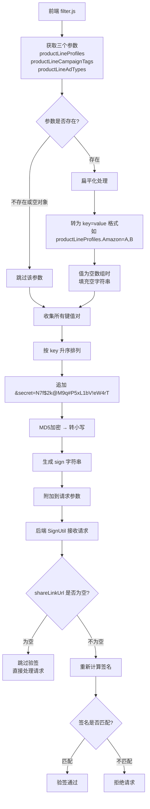
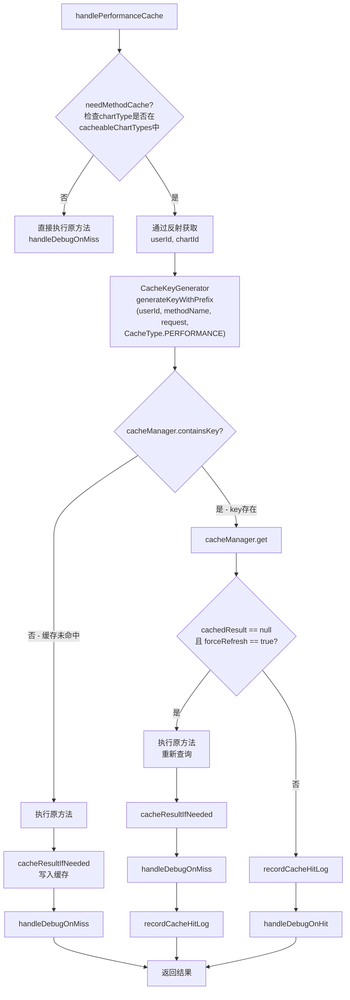
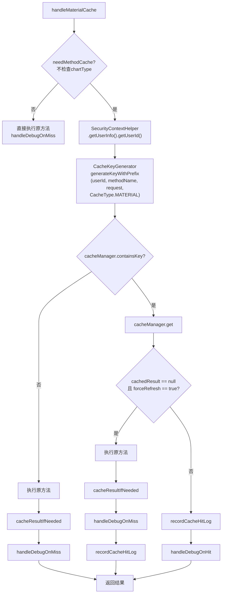
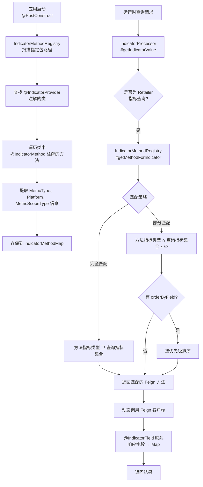
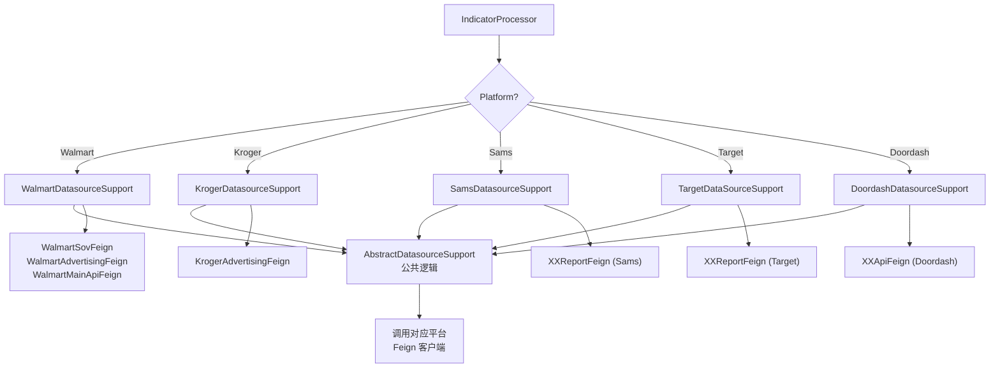

# 基础设施 功能逻辑文档

> 本文档由 document-automation 工具自动生成，基于源代码、PRD 文档和技术评审文档。
> 生成时间: 2026-04-09 13:19:51
> 准确性评分: 62/100

---


# 基础设施 功能逻辑文档

## 1. 模块概述

### 1.1 职责与定位

基础设施模块是 Pacvue Custom Dashboard 项目的底层支撑层，为上层业务模块（Dashboard 配置、图表渲染、指标查询、分享链接等）提供统一的、可复用的技术能力。该模块不直接承载业务逻辑，而是以"横切关注点"的方式为所有业务模块提供以下核心能力：

1. **认证鉴权（签名验签）**：在 ShareLink 场景下，前后端约定 secret，对关键请求参数进行 MD5 加签/验签，防止参数篡改。
2. **Feign 远程调用配置与注册**：统一的 Feign 请求拦截器（`FeignRequestInterceptor`），自动透传 Authorization 等请求头；指标方法注册中心（`IndicatorMethodRegistry`）通过注解驱动自动扫描并注册各平台 Feign 方法。
3. **缓存策略**：基于 AOP 切面（`FeignMethodCacheAspect`）对 Feign 调用和 Controller 方法做缓存拦截，按 `CacheType`（PERFORMANCE / MATERIAL）分发到不同缓存处理逻辑，支持 `forceRefresh` 强制刷新。
4. **异常处理**：统一异常拦截与响应封装（`ExceptionAdvice`，**待确认**具体实现）。
5. **MyBatis-Plus 集成**：提供数据库访问层基础配置（ClickHouse SQL 优化相关，**待确认**具体表名）。
6. **部署/CI-CD 支撑**：Apollo 配置中心、Eureka 服务注册发现等基础设施集成。

### 1.2 系统架构位置

```
┌─────────────────────────────────────────────────────────────────┐
│                        前端 (Vue)                                │
│  filter.js / scopeSetting.vue / WidgetData.vue                  │
│  ┌──────────────────────────────────────────────────────────┐   │
│  │  generateSign() → MD5签名 → HTTP Request                 │   │
│  └──────────────────────────────────────────────────────────┘   │
└──────────────────────────────┬──────────────────────────────────┘
                               │ HTTP (REST)
                               ▼
┌─────────────────────────────────────────────────────────────────┐
│                   基础设施层 (本模块)                              │
│  ┌─────────────┐  ┌──────────────────┐  ┌───────────────────┐  │
│  │ SignUtil     │  │FeignMethodCache  │  │FeignRequest       │  │
│  │ 验签工具     │  │Aspect 缓存切面   │  │Interceptor        │  │
│  └─────────────┘  └──────────────────┘  └───────────────────┘  │
│  ┌─────────────────────────┐  ┌─────────────────────────────┐  │
│  │IndicatorMethodRegistry  │  │IndicatorProcessor           │  │
│  │指标方法注册中心          │  │指标查询处理器                │  │
│  └─────────────────────────┘  └─────────────────────────────┘  │
│  ┌─────────────────────────────────────────────────────────┐   │
│  │ PlatformDatasourceSupport (策略模式)                      │   │
│  │ Walmart / Kroger / Sams / Target / Doordash              │   │
│  └─────────────────────────────────────────────────────────┘   │
└──────────────────────────────┬──────────────────────────────────┘
                               │ Feign (HTTP)
                               ▼
┌─────────────────────────────────────────────────────────────────┐
│                    下游微服务                                     │
│  KrogerAdvertisingFeign / WalmartSovFeign /                     │
│  WalmartAdvertisingFeign / WalmartMainApiFeign /                │
│  XXReportFeign / XXApiFeign                                     │
└─────────────────────────────────────────────────────────────────┘
```

### 1.3 涉及的后端模块

| Maven 模块名 | 职责 |
|---|---|
| `custom-dashboard-web-base` | 基础 Web 配置，包含安全上下文（`SecurityContextHelper`）、Feign 拦截器、异常处理、MyBatis-Plus 配置等 |
| `custom-dashboard-feign` | Feign 客户端定义，包含各平台 Feign 接口声明、缓存注解、指标注解等 |

### 1.4 涉及的前端组件

| 组件/文件 | 职责 |
|---|---|
| `filter.js` | `generateSign` 签名生成工具函数，对请求参数扁平化并 MD5 加签 |
| `scopeSetting.vue` | Scope 设置组件，触发物料查询请求 |
| `scopeSettingBaiscTopOverview.vue` | Scope 基础概览组件 |
| `WidgetData.vue` | 图表数据展示组件 |
| `mockData.js` | Mock 数据（SovGroupList / SovBrandList / SovASINList / AdgroupList / CustomMetricsList） |

### 1.5 核心包路径

| 包路径 | 内容 |
|---|---|
| `com.pacvue.base.annotations` | `@FeignMethodCache`、`@IndicatorProvider`、`@IndicatorMethod`、`@IndicatorField` |
| `com.pacvue.base.cache` | `CacheManager`、`CacheKeyGenerator` |
| `com.pacvue.base.enums` | `CacheType`、`Platform` |
| `com.pacvue.base.enums.core` | `ChartType` |
| `com.pacvue.base.dto.request` | `BaseRequest`（绩效查询） |
| `com.pacvue.base.utils` | `ReflectionUtil`、`SignUtil` |
| `com.pacvue.api.aspect` | `FeignMethodCacheAspect` |
| `com.pacvue.api.service` | `OperationLogService`、`IndicatorProcessor` |
| `com.pacvue.api.dto` | `AccessLog` |
| `com.pacvue.api.dto.request.dat` | `BaseRequest`（物料查询） |
| `com.pacvue.web.base.config` | `SecurityContextHelper`、`FeignRequestInterceptor` |

---

## 2. 用户视角

基础设施模块对终端用户是透明的——用户不会直接感知到签名验签、缓存命中或 Feign 调用路由。但该模块的行为直接影响用户体验的以下方面：

### 2.1 ShareLink 场景下的签名验签

**场景描述**：用户通过 ShareLink 分享 Dashboard 给外部人员查看。为防止 URL 参数被篡改（如修改 profileId、CampaignTag 等筛选条件以获取未授权数据），系统在 ShareLink 场景下启用签名验签机制。

**用户操作流程**：
1. 用户在 Dashboard 页面点击"分享"按钮，生成 ShareLink URL。
2. 前端 `filter.js` 中的 `generateSign()` 函数对 `productLineProfiles`、`productLineCampaignTags`、`productLineAdTypes` 三个参数进行扁平化处理，拼接约定的 secret，通过 MD5 加密生成签名字符串 `sign`。
3. 签名字符串附加到请求参数中。
4. 外部用户通过 ShareLink 访问 Dashboard 时，后端 `SignUtil` 对请求参数重新计算签名并与传入的 `sign` 比对。
5. 验签通过则正常返回数据；验签失败则拒绝请求。

**关键约束**（来自技术评审文档）：
- 仅当 `shareLinkUrl` 不为空时才进行加签/验签。
- 前后端约定加签秘钥：`secret = 'N7f$2k@M9q#P5xL1bV!eW4rT'`。
- 扁平化规则：将 `Map<Platform, List<String>>` 转为 `productLineProfiles.Amazon=A,B&productLineCampaignTags.Walmart=C` 格式。
- 当某个参数不存在或为空对象 `{}` 时跳过；当值为空数组如 `{Amazon:[]}` 时填充空字符串。
- 扁平化后按键值对的 key 升序排列。
- 最后追加 `&secret=xxx`，整体字符串 MD5 加密后转小写。

### 2.2 缓存加速体验

**场景描述**：用户在 Dashboard 中查看图表数据或操作物料下拉框时，系统通过缓存机制减少重复查询，提升响应速度。

**用户感知**：
- 首次加载图表时可能需要数秒（P95 耗时可达 15-30 秒，参见技术评审中的 Grafana 分析）。
- 再次加载相同条件的图表时，命中缓存后响应时间显著缩短。
- 前端请求参数中包含 `useCache` 字段，由前端决定是否走缓存。

### 2.3 多平台数据查询

**场景描述**：用户在 Dashboard 中配置图表时，可选择不同平台（Amazon、Walmart、Kroger、Sams、Target、Doordash）的指标数据。系统通过策略模式自动路由到对应平台的数据源实现。

**用户操作流程**：
1. 用户在 Scope 设置组件（`scopeSetting.vue`）中选择平台和物料层级。
2. 选择指标（如 SOV Brand、Advertising 等）。
3. 系统根据平台和指标类型自动调用对应的 Feign 客户端获取数据。
4. 数据返回后在 `WidgetData.vue` 中渲染图表。

**PRD 相关需求**（交叉验证）：
- PRD 提到 SOV 相关物料层级需支持 Keyword 维度筛选（已在代码中通过 `@IndicatorMethod` 注解的 `MetricScopeType` 实现）。
- PRD 提到需要支持 CampaignTag 作为 ASIN 和 Keyword 的筛选项（已在签名参数 `productLineCampaignTags` 中体现）。
- PRD 提到沃尔玛客户希望在 Keyword 层级选择 Brand SOV 指标（通过 `WalmartSovFeign` 实现）。

---

## 3. 核心 API

### 3.1 REST 端点

#### 3.1.1 物料下拉框查询

- **路径**: `POST /data/getAsinList`（HTTP 方法**待确认**，根据骨架信息推断）
- **Controller**: `DashboardDatasourceController`
- **参数**: `com.pacvue.api.dto.request.dat.BaseRequest`（物料查询基础请求）
- **返回值**: 物料列表数据（具体结构**待确认**）
- **说明**: 
  - 支持 `@FeignMethodCache` 缓存切面拦截。
  - 使用物料缓存时，注解必须指定 `requestType = com.pacvue.api.dto.request.dat.BaseRequest.class` 和 `cacheType = CacheType.MATERIAL`。
  - 根据 Grafana P95 分析，该接口在 Amazon 平台下 P95 耗时达 1.89 分钟（provider 查 sqlServer 耗时过长），技术评审建议改为 ClickHouse 查询。

#### 3.1.2 指标查询入口

- **路径**: **待确认**（根据技术评审文档，入口为 `DashboardController#getIndicator` 和 `ShareController#getIndicator`）
- **说明**: 
  - `DashboardController#getIndicator` 为主入口，P95 耗时 18.98 秒（86,076 次调用）。
  - `ShareController#getIndicator` 为分享链接入口，P95 耗时 19.12 秒（31,309 次调用）。
  - 这两个入口非真慢，而是其下各模块最耗时线程决定总耗时。

### 3.2 内部服务接口

#### 3.2.1 IndicatorProcessor#getIndicatorValue

- **类型**: 内部 Service 方法
- **功能**: 处理指标查询请求
- **流程**:
  1. 检查是否为 Retailer 指标查询
  2. 调用 `IndicatorMethodRegistry.getMethodForIndicator` 根据 `MetricType`、`Platform`、`MetricScopeType` 查找匹配的 Feign 方法
  3. 动态调用 Feign 客户端
  4. 将查询结果通过 `@IndicatorField` 注解映射转为 `Map<String, Object>` 格式
  5. 返回处理后的结果

#### 3.2.2 IndicatorMethodRegistry#getMethodForIndicator

- **类型**: 内部 Service 方法
- **功能**: 根据指标类型和平台查找匹配的 Feign 方法
- **匹配策略**:
  - **完全匹配**: 方法的指标类型完全包含查询的指标类型集合
  - **部分匹配**: 方法的指标类型与查询的指标类型集合有交集
  - 如果指定了排序字段（`orderByField`），对部分匹配结果按优先级排序

---

## 4. 核心业务流程

### 4.1 端到端数据查询流程

```mermaid
flowchart TD
    A[前端组件<br/>scopeSetting/WidgetData] -->|发起请求| B[filter.js<br/>参数扁平化 + MD5签名]
    B -->|HTTP Request| C[DashboardDatasourceController<br/>或 DashboardController]
    C -->|ShareLink场景| D{SignUtil 验签}
    D -->|验签失败| E[拒绝请求]
    D -->|验签通过/非ShareLink| F[FeignMethodCacheAspect<br/>缓存切面拦截]
    F -->|判断CacheType| G{CacheType?}
    G -->|PERFORMANCE| H[handlePerformanceCache]
    G -->|MATERIAL| I[handleMaterialCache]
    H --> J{缓存命中?}
    I --> J
    J -->|命中且value非空| K[返回缓存结果]
    J -->|命中但value为空<br/>且forceRefresh=true| L[执行原方法]
    J -->|未命中| L
    L --> M[IndicatorProcessor<br/>指标查询处理器]
    M --> N[IndicatorMethodRegistry<br/>查找匹配Feign方法]
    N --> O[PlatformDatasourceSupport<br/>策略路由]
    O --> P[对应平台Feign客户端<br/>XXReportFeign/XXApiFeign]
    P --> Q[下游微服务返回数据]
    Q --> R[@IndicatorField映射<br/>转为Map]
    R --> S[写入缓存]
    S --> T[返回前端渲染]
    K --> T
```

### 4.2 签名验签详细流程



**详细步骤说明**：

1. **参数收集**：前端从请求体中提取 `productLineProfiles`（`Map<Platform, List<String>>`）、`productLineCampaignTags`（`Map<Platform, List<String>>`）、`productLineAdTypes`（`Map<Platform, List<String>>`）三个参数，严格按此顺序处理。

2. **扁平化处理**：对每个参数，遍历其 Map 结构，将每个 entry 转为 `参数名.平台名=值1,值2` 的格式。例如 `productLineProfiles` 中有 `{Amazon: ["profile1", "profile2"]}` 则转为 `productLineProfiles.Amazon=profile1,profile2`。

3. **空值处理**：
   - 参数本身不存在（undefined/null）→ 跳过
   - 参数为空对象 `{}` → 跳过
   - 参数中某平台的值为空数组 `[]` → 填充空字符串，如 `productLineProfiles.Amazon=`

4. **排序**：将所有扁平化后的键值对按 key 的字母升序排列。

5. **拼接 secret**：在排序后的字符串末尾追加 `&secret=N7f$2k@M9q#P5xL1bV!eW4rT`。

6. **MD5 加密**：对完整字符串进行 MD5 哈希计算，结果转为小写，即为最终的 `sign` 值。

7. **后端验签**：`SignUtil` 工具类使用相同算法重新计算签名，与请求中的 `sign` 比对。仅在 `shareLinkUrl` 不为空时执行验签。

### 4.3 缓存策略详细流程

#### 4.3.1 FeignMethodCacheAspect 切面总体流程

```mermaid
flowchart TD
    A["方法调用<br/>@FeignMethodCache 注解"] --> B[FeignMethodCacheAspect#around]
    B --> C{注解是否存在?}
    C -->|否| D[直接执行原方法]
    C -->|是| E[从参数中查找<br/>匹配 requestType 的对象]
    E --> F{找到 request?}
    F -->|否| D
    F -->|是| G{annotation.cacheType()}
    G -->|PERFORMANCE| H[handlePerformanceCache]
    G -->|MATERIAL| I[handleMaterialCache]
```

#### 4.3.2 绩效缓存处理（handlePerformanceCache）



**详细步骤说明**：

1. **缓存资格检查**（`needMethodCache`）：检查请求中的 `chartType` 是否在允许缓存的列表中。当前允许缓存的 `ChartType` 包括：
   - `TopOverview`
   - `LineChart`
   - `BarChart`
   - `StackedBarChart`
   - `PieChart`
   - `Table`
   - `GridTable`

2. **缓存键生成**：通过 `CacheKeyGenerator.generateKeyWithPrefix` 方法，基于 `userId`、`methodName`、`request` 对象和 `CacheType.PERFORMANCE` 生成唯一缓存键。`userId` 和 `chartId` 通过 `ReflectionUtil.getFieldValueByName` 反射获取。

3. **缓存查询**：调用 `cacheManager.containsKey(cacheKey)` 检查缓存键是否存在。

4. **缓存命中处理**：
   - 如果 key 存在且 value 非空 → 直接返回缓存结果，记录命中日志，推送 debug 信息。
   - 如果 key 存在但 value 为空，且 `forceRefresh=true` → 执行原方法重新查询，更新缓存，记录日志。
   - 如果 key 存在但 value 为空，且 `forceRefresh=false` → 返回 null（缓存的空值）。

5. **缓存未命中处理**：执行原方法，将结果写入缓存，记录 debug 信息。

6. **缓存过期时间**：通过 `calculateRandomExpireTime(minExpireMinutes, maxExpireMinutes)` 计算随机过期时间（默认 5-10 分钟），转为秒后传入 `cacheManager.put`。使用随机过期时间是为了避免缓存雪崩。

7. **异常处理**：如果原方法执行抛出异常，会先调用 `handleDebugOnMiss` 记录 debug 信息，然后重新抛出异常，不会将异常结果写入缓存。

#### 4.3.3 物料缓存处理（handleMaterialCache）



**与绩效缓存的关键差异**：

| 维度 | 绩效缓存 (PERFORMANCE) | 物料缓存 (MATERIAL) |
|---|---|---|
| 缓存资格检查 | 检查 `chartType` 是否在 `cacheableChartTypes` 列表中 | 不检查 `chartType`（`needMethodCache` 第二个参数为 `false`） |
| userId 获取方式 | 通过 `ReflectionUtil` 反射从 request 对象获取 | 通过 `SecurityContextHelper.getUserInfo().getUserId()` 从安全上下文获取 |
| 请求参数类型 | `com.pacvue.base.dto.request.BaseRequest` | `com.pacvue.api.dto.request.dat.BaseRequest` |
| 典型使用场景 | 图表数据查询（trend/table） | 物料下拉框查询（如 `/data/getAsinList`） |
| 异常处理 | try-catch 包裹，异常时调用 `handleDebugOnMiss` 后重新抛出 | 直接抛出（代码中未见 try-catch） |

### 4.4 Feign 请求拦截器流程

```mermaid
flowchart TD
    A[Feign 调用发起] --> B[FeignRequestInterceptor#apply]
    B --> C{tokenTread.get()<br/>ThreadLocal 中有 token?}
    C -->|有| D["template.header<br/>('Authorization', token)"]
    C -->|无| E[获取 RequestContextHolder<br/>中的 ServletRequest]
    E --> F{request 中有<br/>Authorization header?}
    F -->|有| G["透传 Authorization header"]
    F -->|无| H[遍历所有 header]
    H --> I{跳过 content-length<br/>和 accept-encoding}
    I --> J{template 已有<br/>content-type?}
    J -->|是| K[跳过]
    J -->|否| L[透传 header]
    D --> M[请求发出]
    G --> M
    K --> M
    L --> M
```

**详细说明**：

1. **ThreadLocal 优先**：`FeignRequestInterceptor` 首先检查 `tokenTread`（ThreadLocal）中是否有 token。这是为了支持异步调用场景——在异步线程中 `RequestContextHolder` 可能为空，此时通过 ThreadLocal 传递 token。

2. **请求上下文透传**：如果 ThreadLocal 中没有 token，则从当前 HTTP 请求的 `RequestContextHolder` 中获取所有 header 并透传给 Feign 请求。

3. **Header 过滤**：
   - 跳过 `content-length`（因为 Feign 会重新计算）
   - 跳过 `accept-encoding`（避免编码冲突）
   - 如果 Feign 请求模板已有 `content-type`，则不覆盖

4. **异常容错**：整个逻辑包裹在 try-catch 中，异常被静默忽略（`catch (Exception ignored)`），确保 Feign 调用不会因为 header 透传失败而中断。

### 4.5 指标方法注册与动态调用流程



**详细步骤说明**：

1. **启动时扫描注册**：
   - `IndicatorMethodRegistry` 在 `@PostConstruct` 阶段执行。
   - 调用 `findClassesWithIndicatorProvider` 扫描指定包路径下所有带 `@IndicatorProvider` 注解的类。
   - 对每个类，遍历其方法，找到带 `@IndicatorMethod` 注解的方法。
   - 提取注解中的 `MetricType`（指标类型）、`Platform`（平台）、`MetricScopeType`（指标范围类型）。
   - 将方法信息存储到 `indicatorMethodMap` 中，key 为 `(MetricType, MetricScopeType, Platform)` 的组合。

2. **运行时动态查找**：
   - `IndicatorProcessor.getIndicatorValue` 接收查询请求。
   - 根据请求中的指标类型集合、平台、指标范围类型，调用 `IndicatorMethodRegistry.getMethodForIndicator`。
   - 匹配策略分两级：先尝试完全匹配，再尝试部分匹配。

3. **动态调用**：
   - 找到匹配的 Feign 方法后，通过反射动态调用。
   - 响应对象中带 `@IndicatorField` 注解的字段会被自动映射为 `Map<String, Object>` 格式，其中 key 为指标名称，value 为具体数据值。

### 4.6 平台数据源策略路由



**设计模式说明**：

- **策略模式**：`PlatformDatasourceSupport` 接口定义了统一的数据查询契约，各平台实现类（`WalmartDatasourceSupport`、`KrogerDatasourceSupport`、`SamsDatasourceSupport`、`TargetDataSourceSupport`、`DoordashDatasourceSupport`）提供各自的实现。
- **模板方法模式**：`AbstractDatasourceSupport` 抽象基类提供公共逻辑（如参数校验、结果转换等），各平台子类只需实现平台特有的查询逻辑。

---

## 5. 数据模型

### 5.1 数据库表

代码片段中未直接暴露表名。根据技术评审文档，涉及 ClickHouse SQL 优化相关表，具体表名**待确认**。

### 5.2 核心 DTO

#### 5.2.1 BaseRequest（绩效查询）

- **全限定名**: `com.pacvue.base.dto.request.BaseRequest`
- **用途**: 绩效查询的基础请求参数
- **关键字段**（根据代码推断）:

| 字段名 | 类型 | 说明 |
|---|---|---|
| `userId` | `Long` | 用户 ID，通过 `ReflectionUtil.getFieldValueByName` 反射获取 |
| `chartId` | `Long` | 图表 ID |
| `chartType` | `ChartType` | 图表类型（用于判断是否允许缓存） |
| `useCache` | `Boolean` | 是否使用缓存（**待确认**，技术评审提到前端传入） |
| `productLineProfiles` | `Map<Platform, List<String>>` | 平台 Profile 筛选条件 |
| `productLineCampaignTags` | `Map<Platform, List<String>>` | 平台 CampaignTag 筛选条件 |
| `productLineAdTypes` | `Map<Platform, List<String>>` | 平台广告类型筛选条件 |
| `sign` | `String` | 签名字符串（ShareLink 场景） |
| `shareLinkUrl` | `String` | 分享链接 URL（非空时触发验签） |

#### 5.2.2 BaseRequest（物料查询）

- **全限定名**: `com.pacvue.api.dto.request.dat.BaseRequest`
- **用途**: 物料下拉框查询的基础请求参数
- **说明**: 与绩效查询的 `BaseRequest` 是不同的类，位于不同包路径。在使用 `@FeignMethodCache` 注解时必须通过 `requestType` 显式指定。

#### 5.2.3 BaseResponse

- **用途**: 统一响应封装
- **结构**: **待确认**（代码片段中未展示具体字段）

#### 5.2.4 UserInfo

- **用途**: 用户信息，认证上下文
- **获取方式**: `SecurityContextHelper.getUserInfo()`
- **关键字段**:

| 字段名 | 类型 | 说明 |
|---|---|---|
| `userId` | `Long` | 用户 ID |
| 其他字段 | **待确认** | |

#### 5.2.5 AccessLog

- **全限定名**: `com.pacvue.api.dto.AccessLog`
- **用途**: 缓存命中/未命中的访问日志记录
- **使用场景**: `FeignMethodCacheAspect` 中的 `recordCacheHitLog` 方法

### 5.3 核心枚举

#### 5.3.1 CacheType

```java
public enum CacheType {
    PERFORMANCE,  // 绩效缓存
    MATERIAL      // 物料缓存
}
```

#### 5.3.2 ChartType

```java
public enum ChartType {
    TopOverview,
    LineChart,
    BarChart,
    StackedBarChart,
    PieChart,
    Table,
    GridTable
    // 可能还有其他值，待确认
}
```

**说明**: `FeignMethodCacheAspect` 中的 `cacheableChartTypes` 列表包含以上 7 种图表类型，仅这些类型的图表查询才会走绩效缓存。

#### 5.3.3 Platform

```java
public enum Platform {
    Amazon,
    Walmart,
    Kroger,
    Sams,
    Target,
    Doordash
    // 可能还有其他值如 Instacart，待确认
}
```

#### 5.3.4 ApiType

- **全限定名**: `com.pacvue.base.constatns.ApiType`（注意包名中 `constatns` 可能是拼写错误，实际代码中确实如此）
- **用途**: **待确认**

### 5.4 核心注解

#### 5.4.1 @FeignMethodCache

```java
@Retention(RetentionPolicy.RUNTIME)
@Target(ElementType.METHOD)
public @interface FeignMethodCache {
    int minExpireMinutes() default 5;        // 缓存失效最小分钟数
    int maxExpireMinutes() default 10;       // 缓存失效最大分钟数
    Class<?> requestType() default BaseRequest.class;  // 请求参数类型
    boolean forceRefresh() default false;    // key存在但value为空时是否强制刷新
    CacheType cacheType() default CacheType.PERFORMANCE;  // 缓存类型
}
```

#### 5.4.2 @IndicatorProvider

- **用途**: 标注指标提供类的注解
- **使用位置**: 类级别
- **说明**: `IndicatorMethodRegistry` 在启动时扫描带有此注解的类

#### 5.4.3 @IndicatorMethod

- **用途**: 标注指标方法的注解
- **使用位置**: 方法级别
- **属性**:

| 属性 | 类型 | 说明 |
|---|---|---|
| `MetricType` | `MetricType[]` | 该方法支持的指标类型集合 |
| `Platform` | `Platform` | 该方法支持的平台 |
| `MetricScopeType` | `MetricScopeType` | 该方法支持的指标范围类型 |

#### 5.4.4 @IndicatorField

- **用途**: 标注响应字段与指标映射的注解
- **使用位置**: 字段级别
- **说明**: 确保查询结果能够转化为 `Map<String, Object>` 格式

---

## 6. 平台差异

### 6.1 各平台数据源实现

| 平台 | 实现类 | Feign 客户端 | 特殊说明 |
|---|---|---|---|
| Walmart | `WalmartDatasourceSupport` | `WalmartSovFeign`、`WalmartAdvertisingFeign`、`WalmartMainApiFeign` | P95 耗时 14.49s（14,199 次调用），SOV Brand 指标 P95 15.63s |
| Kroger | `KrogerDatasourceSupport` | `KrogerAdvertisingFeign` | |
| Sams | `SamsDatasourceSupport` | `XXReportFeign`（具体类名**待确认**） | |
| Target | `TargetDataSourceSupport` | `XXReportFeign`（具体类名**待确认**） | |
| Doordash | `DoordashDatasourceSupport` | `XXApiFeign`（具体类名**待确认**） | |
| Amazon | **待确认**（可能不在 PlatformDatasourceSupport 体系中） | `AmazonRestReportController`（P95 27.55s）、`AmazonReportController`（P95 15.99s） | P95 耗时最高，getAsinList P95 达 1.89min |

### 6.2 SOV 指标平台支持情况

根据 PRD 文档：
- **Amazon/Walmart/Instacart**: 已支持 SOV 指标按 Keyword 筛选
- **其他小平台**: 之前不支持按 Keyword 筛选（因为小平台不支持），现在用户要求增加支持，SOV 团队 Sprint 1 已可支持
- **Walmart**: 客户希望在 Keyword 层级选择 Brand SOV 指标（类似 Amazon 已有功能）

### 6.3 签名参数的平台维度

签名参数 `productLineProfiles`、`productLineCampaignTags`、`productLineAdTypes` 均为 `Map<Platform, List<String>>` 结构，即按平台维度组织筛选条件。这意味着一个 Dashboard 可以同时包含多个平台的数据，每个平台有独立的筛选条件。

---

## 7. 配置与依赖

### 7.1 关键配置项

| 配置项 | 来源 | 说明 |
|---|---|---|
| 签名秘钥 `secret` | 前后端约定硬编码 | `N7f$2k@M9q#P5xL1bV!eW4rT` |
| Apollo 配置中心 | `Apollo` | 具体配置项**待确认** |
| Eureka 服务注册 | `Eureka` | 服务发现与注册 |

### 7.2 Feign 下游服务依赖

| Feign 客户端 | 下游服务 | 说明 |
|---|---|---|
| `KrogerAdvertisingFeign` | Kroger 广告服务 | |
| `WalmartSovFeign` | Walmart SOV 服务 | SOV Brand/ASIN 指标查询 |
| `WalmartAdvertisingFeign` | Walmart 广告服务 | |
| `WalmartMainApiFeign` | Walmart 主 API 服务 | |
| `XXReportFeign` | 各平台报表服务 | 泛指，具体类名**待确认** |
| `XXApiFeign` | 各平台 API 服务 | 泛指，具体类名**待确认** |

### 7.3 缓存策略

| 维度 | 说明 |
|---|---|
| 缓存实现 | `CacheManager`（前期使用应用内存，模块化后可迁 Redis） |
| 缓存键生成 | `CacheKeyGenerator.generateKeyWithPrefix(userId, methodName, request, cacheType)` |
| 过期时间 | 随机值，范围 `[minExpireMinutes, maxExpireMinutes]`，默认 5-10 分钟，转为秒存储 |
| 随机过期原因 | 避免缓存雪崩（大量缓存同时过期） |
| forceRefresh 机制 | 当 key 存在但 value 为空时，`forceRefresh=true` 会强制执行原方法并更新缓存 |
| 缓存类型分发 | `PERFORMANCE` → `handlePerformanceCache`；`MATERIAL` → `handleMaterialCache` |
| 允许缓存的图表类型 | TopOverview、LineChart、BarChart、StackedBarChart、PieChart、Table、GridTable |

### 7.4 日志与监控

- **缓存命中日志**: `recordCacheHitLog` 方法记录缓存命中信息，包含 request、methodName、cacheKey、startTime、result。
- **Debug 缓存**: `handleDebugOnHit` 和 `handleDebugOnMiss` 方法分别处理缓存命中和未命中的 debug 信息，推送到队列（具体队列实现**待确认**）。
- **操作日志**: `OperationLogService` 注入到切面中，用于记录操作日志。
- **Grafana 监控**: 技术评审文档中提到使用 Grafana 进行 P95 耗时分析。

---

## 8. 版本演进

### 8.1 缓存策略演进

| 阶段 | 版本 | 变更内容 |
|---|---|---|
| 方案 1（已废弃） | V2.9/V2.10 之前 | 采用责任链模式实现缓存，后因"缓存提升效果有限且容易引入新的问题，掩盖 SQL 和 API 耗时问题"而废弃 |
| 方案 2（当前） | 2025Q3S4 | 改为 AOP 切面方案，颗粒度放在 `XXReportFeign` 和 `DashboardDatasourceController` 上。核心注解 `@FeignMethodCache`，切面 `FeignMethodCacheAspect` |
| 初始支持范围 | 2025Q3S4 | 仅支持 trend/table + productCenter/amazonSov/amazon sql/amazon rest api |
| 物料缓存扩展 | 2025Q3S4+ | 在绩效缓存基础上扩展支持物料下拉框查询接口（如 `/data/getAsinList`），切在 `DashboardDatasourceController` 上 |

### 8.2 签名验签引入

| 版本 | 变更内容 |
|---|---|
| V2.14/V2.14.1 | 引入前后端签名验签机制，针对 ShareLink 场景防篡改。前后端约定 secret，对 `productLineProfiles`/`productLineCampaignTags`/`productLineAdTypes` 参数扁平化后 MD5 加签 |

### 8.3 指标方法注册中心

| 版本 | 变更内容 |
|---|---|
| V2.0 | 引入 `IndicatorMethodRegistry` 和 `IndicatorProcessor`，通过注解驱动自动扫描注册各平台 Feign 方法 |

### 8.4 平台扩展

根据 PRD 文档，平台支持持续扩展：
- 初始支持 Amazon、Walmart
- 后续增加 Kroger、Sams、Target、Doordash
- SOV 指标 Keyword 筛选从 Amazon/Walmart/Instacart 扩展到所有小平台（26Q1-S2）

### 8.5 待优化项与技术债务

| 项目 | 说明 | 来源 |
|---|---|---|
| getAsinList 性能 | Amazon 平台 P95 耗时 1.89 分钟，provider 查 sqlServer 耗时过长，建议改为 ClickHouse 查询 | 技术评审 - 业务总结 |
| ReportFeign 日志 | `//TODO ReportFeign 增加切面类，记录 Log 信息` | 技术评审 - 业务总结 |
| XXApiFeign 入参错误 | 调用 XXApiFeign 接口入参错误（如 groupByItem），需统一检查拼接参数，对齐接口方样例 | V2.9/V2.10 技术评审 |
| 缓存迁移 Redis | 前期使用应用内存，模块化后可迁 Redis | 2025Q3S4 技术评审 |
| 缓存范围扩展 | 暂时仅支持部分图表类型和平台，后期需拓展 | 2025Q3S4 技术评审 |
| 包名拼写错误 | `com.pacvue.base.constatns.ApiType` 中 `constatns` 应为 `constants` | 代码片段 |

---

## 9. 已知问题与边界情况

### 9.1 代码中的 TODO/FIXME

| 位置 | 内容 |
|---|---|
| 技术评审 - 业务总结 | `//TODO ReportFeign 增加切面类，记录 Log 信息` |
| `FeignMethodCacheAspect` | `cacheableChartTypes` 列表注释："允许缓存的 chart，后面放开限制" |

### 9.2 异常处理与降级策略

1. **Feign 调用异常**：`handlePerformanceCache` 中对原方法调用使用 try-catch 包裹，异常时：
   - 调用 `handleDebugOnMiss(signature, null, annotation)` 记录 debug 信息
   - 重新抛出异常（`throw t`）
   - **不会将异常结果写入缓存**，确保下次请求仍会尝试调用原方法

2. **Feign 请求拦截器异常**：`FeignRequestInterceptor.apply` 中整个逻辑包裹在 try-catch 中，异常被静默忽略（`catch (Exception ignored)`）。这意味着：
   - 如果 `RequestContextHolder` 为空（异步场景），不会导致 Feign 调用失败
   - 但也意味着 header 透传可能静默失败，下游服务可能收不到 Authorization 等关键 header

3. **缓存 key 存在但 value 为空**：
   - `forceRefresh=false`（默认）：返回 null，可能导致前端收到空数据
   - `forceRefresh=true`：重新执行查询，但如果查询本身返回 null，会再次缓存 null 值

4. **签名验签失败**：仅在 ShareLink 场景下验签，验签失败时的具体错误响应格式**待确认**。

### 9.3 并发与超时

1. **缓存并发问题**：
   - 当前缓存实现使用应用内存，`cacheManager.containsKey` 和 `cacheManager.get` 之间存在时间窗口，可能出现 key 在 `containsKey` 返回 true 后过期的情况。
   - 多个线程同时请求相同数据且缓存未命中时，会出现"缓存击穿"——所有线程都执行原方法。当前代码未使用分布式锁或本地锁来防止此问题。

2. **Feign 调用超时**：
   - 根据 Grafana P95 分析，部分接口耗时极长（如 `getAsinList` P95 达 1.89 分钟）。
   - Feign 超时配置**待确认**（未在代码片段中展示）。

3. **ThreadLocal 泄漏风险**：
   - `FeignRequestInterceptor.tokenTread` 是 static ThreadLocal，如果在异步场景中设置了值但未清理，可能导致线程池复用时 token 泄漏。
   - 代码中未见 `tokenTread.remove()` 的调用（**待确认**是否在其他位置清理）。

### 9.4 物料缓存与绩效缓存的 BaseRequest 混淆风险

技术评审文档明确指出：
> 绩效查询的 BaseRequest 是 `com.pacvue.base.dto.request.BaseRequest`，而物料查询的是 `com.pacvue.api.dto.request.dat.BaseRequest`，注解默认的是绩效查询的。

如果开发者在物料查询接口上使用 `@FeignMethodCache` 注解时忘记指定 `requestType` 和 `cacheType`，切面将无法正确解析请求参数，导致缓存失效或异常。这是一个容易出错的配置点。

### 9.5 签名秘钥硬编码

签名秘钥 `secret = 'N7f$2k@M9q#P5xL1bV!eW4rT'` 在前后端均为硬编码。如果秘钥泄露，攻击者可以伪造签名。建议后续将秘钥迁移到配置中心（如 Apollo）并支持动态轮换。

### 9.6 缓存过期时间的随机性

缓存过期时间通过 `Random` 实例在 `[minExpireMinutes, maxExpireMinutes]` 范围内随机生成。`Random` 实例是 `FeignMethodCacheAspect` 的成员变量（`private final Random random = new Random()`），在多线程环境下 `java.util.Random` 是线程安全的但可能存在竞争，不过对于过期时间计算这种低频操作影响可忽略。

---

## 附录：Mock 数据说明

前端 `mockData.js` 中包含以下 Mock 数据集，用于开发和测试阶段：

| Mock 数据集 | 说明 |
|---|---|
| `SovGroupList` | SOV 分组列表 |
| `SovBrandList` | SOV 品牌列表 |
| `SovASINList` | SOV ASIN 列表 |
| `AdgroupList` | 广告组列表 |
| `CustomMetricsList` | 自定义指标列表 |

这些 Mock 数据与物料下拉框查询接口（如 `/data/getAsinList`）的返回结构对应，用于前端在后端接口不可用时的独立开发。

---

> **自动审核备注**: 准确性评分 62/100
>
> **待修正项**:
> - [error] API路径 `POST /data/getAsinList` 在提供的代码片段中无法验证，文档自身也标注为'待确认'。Controller名 `DashboardDatasourceController` 同样无法在代码中确认存在。这属于臆造或过度推断的信息。
> - [error] 流程图中将 `SignUtil 验签` 放在 Controller 之后、缓存切面之前，暗示验签发生在业务层。但从代码片段来看，`FeignMethodCacheAspect` 的 `@Around` 切面拦截的是带 `@FeignMethodCache` 注解的方法，并不包含验签逻辑。验签与缓存切面的调用顺序和关系在代码中无法确认，流程图可能是臆造的编排。
> - [error] 流程图中描述缓存逻辑为'命中但value为空且forceRefresh=true → 执行原方法'，但根据 `@FeignMethodCache` 注解中 `forceRefresh` 的注释说明：'key已缓存，但是value是空的，是否强制重新读取API/SQL'，`forceRefresh` 是注解级别的静态配置（default false），不是运行时动态判断。文档将其描述为运行时条件判断可能不准确。
> - [warning] 文档称缓存切面同时对'Feign调用和Controller方法'做缓存拦截。但从代码来看，`@Around("@annotation(com.pacvue.base.annotations.FeignMethodCache)")` 拦截的是所有带 `@FeignMethodCache` 注解的方法，不一定限于Feign调用或Controller方法。注解名虽含'Feign'，但实际可用于任何方法。
> - [warning] 文档称'前端请求参数中包含 `useCache` 字段，由前端决定是否走缓存'。但在提供的代码片段中，`FeignMethodCacheAspect` 的缓存判断逻辑并未出现 `useCache` 字段的检查。`@FeignMethodCache` 注解中也没有 `useCache` 相关属性。此信息无法从代码中验证。


---

*本文档由 AI 自动生成，如有不准确之处请以源代码为准。标注"待确认"的内容需要人工核实。*