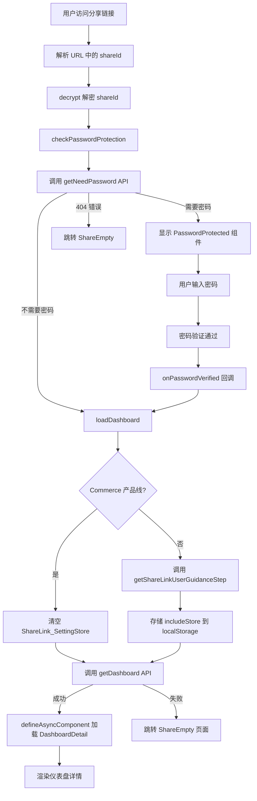
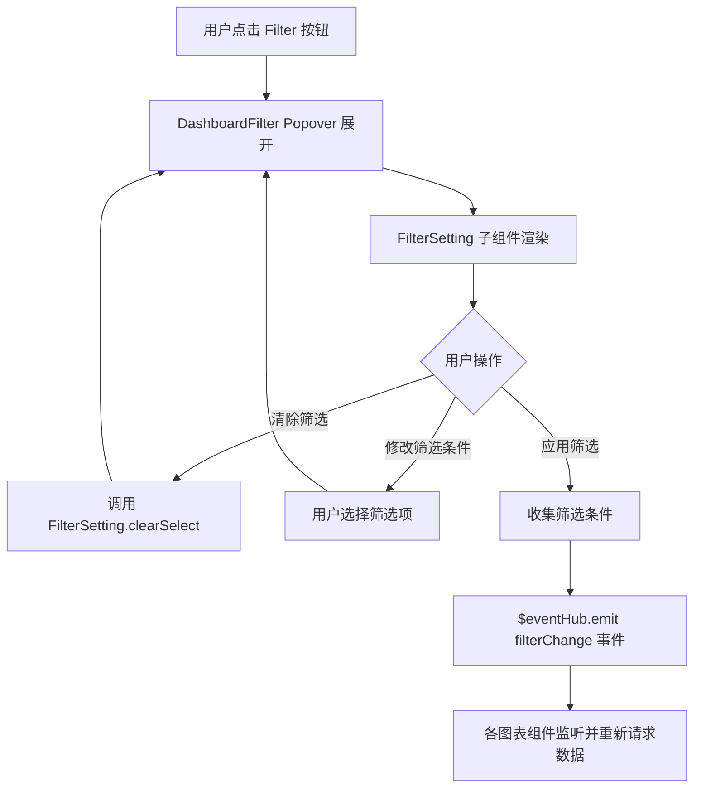
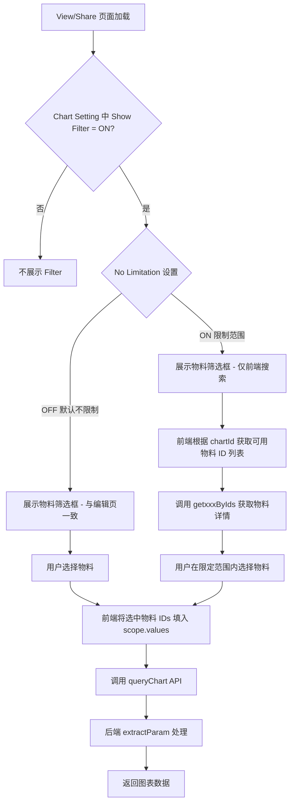

# 前端架构 功能逻辑文档

> 本文档由 document-automation 工具自动生成，基于源代码、PRD 文档和技术评审文档。
> 生成时间: 2026-04-09 13:21:06
> 准确性评分: 42/100

---


# 前端架构 功能逻辑文档

## 1. 模块概述

### 1.1 职责与定位

Custom Dashboard 前端模块是 Pacvue 平台中用于仪表盘创建、编辑、查看、分享和模板管理的核心前端应用。该模块基于 **Vue 3 Composition API（`<script setup>`）** 构建，采用 **Pinia** 进行集中式状态管理，通过 **事件总线（$eventHub）** 实现跨组件通信，并利用 **路由级懒加载** 和 **defineAsyncComponent** 实现按需加载，以优化首屏性能。

该模块支持多 Retailer 场景（Amazon、Walmart、Instacart、Commerce、Criteo、Target、Citrus、Kroger、Chewy、Bol、DoorDash、Sam's Club 等），为用户提供跨平台的数据可视化仪表盘能力，包括趋势图（Trend）、对比图（Comparison）、概览图（Top Overview）、表格（Table）、饼图（Pie）、堆叠柱状图（Stacked Bar）、白板（Whiteboard）等多种图表类型。

### 1.2 系统架构位置

```
┌─────────────────────────────────────────────────────────┐
│                    浏览器 / 用户端                         │
├─────────────────────────────────────────────────────────┤
│  Vue 3 App                                              │
│  ┌──────────────┐  ┌──────────────┐  ┌───────────────┐ │
│  │  Vue Router   │  │  Pinia Store │  │  $eventHub    │ │
│  │  (路由守卫)    │  │  (全局状态)   │  │  (事件总线)    │ │
│  └──────┬───────┘  └──────┬───────┘  └───────┬───────┘ │
│         │                 │                   │         │
│  ┌──────┴─────────────────┴───────────────────┴───────┐ │
│  │              页面组件 / 业务组件                       │ │
│  │  index.vue / CreateDashboard / DashboardDetail /    │ │
│  │  TemplateManagements / SharePage / ...              │ │
│  └──────────────────────┬──────────────────────────────┘ │
│                         │                               │
│  ┌──────────────────────┴──────────────────────────────┐ │
│  │              API 层 (@customDashboard/api/index.js)  │ │
│  └──────────────────────┬──────────────────────────────┘ │
├─────────────────────────┼───────────────────────────────┤
│                         ▼                               │
│              后端 REST API 服务                           │
│  (commerce-admin-newui / commerce-admin-3p-newui 等)     │
└─────────────────────────────────────────────────────────┘
```

**上游关系**：
- 用户通过浏览器访问，路由层（`customDashboardRouter.js`）控制页面入口
- 布局组件 `@pacvue/frame/layout/Main.vue` 提供统一的页面框架

**下游关系**：
- API 层封装对后端服务的 HTTP 请求
- 后端服务包括 `commerce-admin-newui`、`commerce-admin-3p-newui` 等，提供数据查询、图表配置保存、分享链接管理等接口

### 1.3 涉及的前端组件清单

| 组件名 | 路径 | 职责 |
|--------|------|------|
| `index` | `@customDashboard/index.vue` | 仪表盘列表主页 |
| `CreateDashboard` | `@customDashboard/Dashboard/CreateDashboard.vue` | 创建/编辑/查看示例仪表盘（三路由复用） |
| `DashboardDetail` | `@customDashboard/Detail/DashboardDetail.vue` | 仪表盘详情查看页面，同时被分享页面动态加载 |
| `TemplateManagements/index` | `@customDashboard/TemplateManagements/index.vue` | 模板管理主页 |
| `shareHistory` | `@customDashboard/TemplateManagements/shareHistory.vue` | 分享日志页面 |
| `SharePageIndex` | `@customDashboard/Share/sharePage/index.vue` | 分享页面入口，密码校验+动态加载 |
| `ShareEmpty` | `@customDashboard/Share/ShareEmpty.vue` | 分享链接失效空状态页 |
| `PasswordProtected` | `@customDashboard/Share/PasswordProtected.vue` | 密码验证页面 |
| `DetailBread` | `steps/DetailBread.vue` | 详情页面包屑 |
| `CreateLeftBreadcrumb` | `Dashboard/CreateLeftBreadcrumb.vue` | 创建/编辑页左侧面包屑及控制栏 |
| `DashboardFilter` | `components/DashboardFilter.vue` | 仪表盘过滤器 |
| `FilterSetting` | `components/FilterSetting.vue` | 过滤器设置子组件 |
| `DashboardSettingDialog` | `Dashboard/DashboardSettingDialog.vue` | 仪表盘设置弹窗（非 Commerce） |
| `DashboardSettingDialogCommerce` | `Dashboard/DashboardSettingDialogCommerce.vue` | 仪表盘设置弹窗（Commerce） |
| `shareHistoryTable` | `TemplateManagements/components/shareHistoryTable.vue` | 分享历史表格 |
| `CustomDashboardGroupIndexLeftItem` | `components/CustomDashboardGroupIndexLeftItem.vue` | 分组列表左侧项 |
| `ChartLayoutContainer` | 组件路径（代码片段中提供） | 图表布局容器，支持 Bar/Line/Stacked/Whiteboard |
| `TableSetting` | 组件路径（代码片段中提供） | 表格图表设置面板 |

### 1.4 公共工具层

| 模块 | 路径 | 提供的功能 |
|------|------|-----------|
| `common.js` | `@customDashboard/public/common.js` | `createChartAll`、`getPopData`、`getYoyData`、`recentPeriodOptions`、`chartMaxAmount`、`rangesFilter` |
| `filter.js` | `@customDashboard/public/filter.js` | `generateNewObj`、`getoptionData`、`getPulicTagOptions`、`changeMetricList`、`commerceSettingConfigSave`、`timeRangeFilterDateSave`、`timeRangeFilterDateEdit` 等 |
| `defaultCustomDashboard.js` | `@customDashboard/public/defaultCustomDashboard.js` | `gridTableMax`、`defaultAllObjMaterial`、`defaultSOVMaterial`、`defaultSOVObjMaterial`、`maxChartNameLength`、`TableBreakdownMaterial`、`CommerceTableBreakdownMaterial`、`defaultNoSOVObjMaterial`、`CommerceBSRMetric` |
| `hooks.js` | `@customDashboard/public/hooks.js` | `Dimension`、`generateExampleTableDataTableList`、`tableMeaticType`、`getCustomColumnObj`、`getDimensionByChanelType`、`getSegmentObj` |
| `public.js` | `@customDashboard/public/public.js` | `shareHistoryColumns`、`shareHistoryfilterList`、`templateGroupListData` |

---

## 2. 用户视角

### 2.1 功能场景总览

基于 PRD 文档和代码分析，Custom Dashboard 模块涵盖以下核心功能场景：

1. **仪表盘列表浏览与管理**
2. **创建仪表盘**
3. **编辑仪表盘**
4. **查看仪表盘详情**
5. **查看示例仪表盘（View Sample）**
6. **分享仪表盘（含密码保护）**
7. **模板管理**
8. **分享日志查看**
9. **Cross Retailer Brand 看板**
10. **View/Share 页面 Filter 快速筛选**

### 2.2 场景一：仪表盘列表浏览与管理

**入口路径**：`/Report/CustomDashboard`

**用户操作流程**：
1. 用户从左侧导航栏进入 "Reporting" → "Custom Dashboard"
2. 路由 `beforeEnter` 守卫自动执行：
   - 从 `sessionStorage` 获取 `useInfo` 中的 `userId`
   - 根据 `productline` 和环境变量判断是否需要清除 `localStorage` 中的 `SettingStore`
   - 对于 Commerce 产品线，直接清空 `SettingStore`
   - 对于非 Commerce 产品线且环境为 `us`/`cn`/`eu`，调用 `getUserGuidanceStep()` API 获取用户引导设置并存入 `localStorage`
3. 页面加载 `@customDashboard/index.vue` 组件
4. 用户可以看到仪表盘列表，支持分组管理
5. 左侧展示分组列表（`CustomDashboardGroupIndexLeftItem` 组件），支持：
   - 鼠标悬停高亮
   - 选择分组
   - 修改分组名称
   - 删除分组

**UI 交互要点**：
- 分组列表项支持 hover 高亮效果
- 分组操作（修改/删除）通过交互触发

### 2.3 场景二：创建仪表盘

**入口路径**：`/Report/CustomDashboard/Create`

**用户操作流程**：
1. 用户在列表页点击"Create Dashboard"按钮
2. 路由跳转至 `/Report/CustomDashboard/Create`，加载 `CreateDashboard.vue` 组件
3. 左侧面包屑区域（`CreateLeftBreadcrumb` 组件）展示：
   - 日期选择器（支持 POP/YOY 对比日期计算）
   - Dashboard Setting 弹窗入口
   - 图表类型选择
4. 用户配置仪表盘全局设置：
   - **非 Commerce 产品线**：弹出 `DashboardSettingDialog` 组件
   - **Commerce 产品线**：弹出 `DashboardSettingDialogCommerce` 组件
5. 用户添加图表 Widget：
   - 选择图表类型（Bar/Line/Stacked/Table/Pie/Overview/Whiteboard）
   - 配置图表设置（`TableSetting` 等组件）
   - 选择指标（`SelectMetric` 组件）
   - 配置物料范围（`RetailerScopeSetting`/`scopeSettingBaisc`/`ShareParentTagretailerScopeSetting`/`AmazonChannelScopeSetting`/`AmazonBMTagScopeSetting` 等组件）
   - 配置时间范围（`ChartTimeRange` 组件）
   - 配置维度和分组（`TableBreakdown`/`CommerceDataSegment` 组件）
6. 用户保存仪表盘

**图表布局**：
- `ChartLayoutContainer` 组件管理图表布局，支持两种布局模式：
  - `ONE`：一行一列，图表宽度 100%
  - `TWO`：一行两列，图表宽度 71%（普通图表）或 50%（白板）
- 图表容器高度固定为 500px（当浏览器宽度 < 1750px 时也为 500px）
- 白板容器高度为 446px，背景透明

**图表类型映射**（`ChartLayoutContainer` 中的 `chartTypeMap`）：
```javascript
{
  bar: Bar,        // 柱状图组件
  line: Line,      // 折线图组件
  stacked: Stacked, // 堆叠柱状图组件
  whiteboard: WhiteBoardContainer // 白板组件
}
```

### 2.4 场景三：编辑仪表盘

**入口路径**：`/Report/CustomDashboard/Edit`

**用户操作流程**：
1. 用户在列表页或详情页点击"Edit"操作
2. 路由跳转至 `/Report/CustomDashboard/Edit`，复用 `CreateDashboard.vue` 组件
3. 组件根据路由 name（`Edit Dashboard`）加载已有仪表盘数据
4. 用户修改图表配置、指标、物料范围等
5. 保存修改

### 2.5 场景四：查看仪表盘详情

**入口路径**：`/Report/CustomDashboard/Detail`

**用户操作流程**：
1. 用户在列表页点击某个仪表盘进入详情
2. 路由跳转至 `/Report/CustomDashboard/Detail`，加载 `DashboardDetail.vue` 组件
3. 页面顶部展示面包屑（`DetailBread` 组件）：
   - 监听 Pinia Store 中的 `detailBreadObj`
   - 显示仪表盘名称（默认 "Dashboard"）和描述
   - 支持分享链接模式（通过 `route.query.isShareLink` 判断）
4. 用户可以查看各图表数据
5. 支持过滤器操作（`DashboardFilter` 组件）：
   - Popover 展开/收起
   - 清除筛选
   - 应用筛选（通过 `$eventHub.emit('filterChange')` 广播）

**View 页面 Filter 功能**（基于 PRD 3.1.4）：
- 每个图表可配置 `Show Filter` 选项
- `Show Filter = ON` 时，View/Share 页面展示物料筛选框
- `No Limitation = OFF`（默认）：物料选择方式与编辑页面一致，支持后端搜索
- `No Limitation = ON`：View 页面基于物料范围，仅支持前端搜索
- 筛选框中用户更改后的选项不保存，刷新或重新进入时重置

**支持 Show Filter 的图表类型**：
| 图表类型 | 支持的模式 |
|---------|-----------|
| Overview | 仅 Standard 模式 |
| Trend | Single Metric、Multiple Metric |
| Comparison | 所有模式 |
| Stacked Bar | 所有模式 |
| Table | 支持 |
| Pie | 所有模式 |
| Grid Table | 支持 |
| Whiteboard | **不支持** |

**不支持 Show Filter 的特殊情况**：
- FilterLinked Campaign 作为物料选择
- Top XX in 选择 FilterLinked 的类型
- Cross Retailer 分类的 Chart
- Custom Metric 指标状态变更导致无可用指标

### 2.6 场景五：分享仪表盘（含密码保护）

**入口路径**：`/Share/CustomDashboard?shareId=xxx`

**用户操作流程**：

1. 分享者在仪表盘详情页生成分享链接
2. 接收者通过分享链接访问 `/Share/CustomDashboard?shareId=<encrypted_shareId>`
3. `SharePageIndex`（`Share/sharePage/index.vue`）组件初始化：
   - 从 URL 中解析 `shareId` 参数：`queryURLParams(location.href).shareId`
   - 使用 `decrypt()` 解密 shareId
4. 调用 `checkPasswordProtection()` 检查是否需要密码：
   - 调用 `getNeedPassword({ shareLinkUrl: shareId })` API
   - 如果需要密码：显示 `PasswordProtected` 组件
   - 如果不需要密码：直接调用 `loadDashboard()`
   - 如果返回 404 错误：跳转至 `/Share/ShareEmpty`
5. 密码验证通过后（`onPasswordVerified` 回调）：
   - 隐藏密码页面
   - 调用 `loadDashboard()`
6. `loadDashboard()` 执行流程：
   - **Commerce 产品线**：直接清空 `ShareLink_SettingStore`
   - **非 Commerce 产品线**：调用 `getShareLinkUserGuidanceStep({ shareLinkUrl: shareId })` 获取设置，存入 `localStorage`
   - 调用 `getDashboard({ shareLinkUrl: shareId })` 获取仪表盘数据
   - 成功：通过 `defineAsyncComponent(() => import("@customDashboard/Detail/DashboardDetail.vue"))` 动态加载详情组件
   - 失败：跳转至 `/Share/ShareEmpty?shareId=<encrypted_shareId>`

**路由监听与重新加载**：
- `watch` 监听 `router.currentRoute.value` 变化
- 当路径为 `/Share/CustomDashboard` 时，调用 `jumpToShareTarget()` 重新执行密码检查和加载流程
- 这确保了分享页面内的路由切换能正确重新加载组件

### 2.7 场景六：模板管理

**入口路径**：`/Report/CustomDashboard/TemplateManagement`

**用户操作流程**：
1. 用户进入模板管理页面
2. 查看模板列表
3. 可以将仪表盘保存为模板，或从模板创建仪表盘
4. 白板图表支持创建、保存为模板并应用到看板中（PRD 3.3.2）

### 2.8 场景七：分享日志

**入口路径**：`/Report/CustomDashboard/TemplateManagement/shareHistory`

**用户操作流程**：
1. 用户从模板管理页面进入分享日志
2. 页面加载 `shareHistory.vue` 组件
3. 组件初始化：
   - 通过 `inject("breadcrumb")` 获取面包屑更新方法
   - 在 `onMounted` 中设置面包屑（`BreadTitle` 组件）并调用 `getData()`
   - 在 `onUnmounted` 中清除面包屑
4. 数据加载：
   - 构建查询参数：`shareMethod`、`pageNum`、`pageSize`
   - 调用 `templateSharePage(getQueryParams())` API
   - 处理返回数据：格式化日期（根据用户设置 `DD/MM/YYYY` 或 `MM/DD/YYYY`）、拼接模板名称、拼接客户名称
5. 表格展示（`ShareHistoryTable` 组件）：
   - 支持分页（默认 pageSize=20）
   - 支持页码跳转和每页条数切换
   - 支持排序
6. 编辑日期范围：
   - 点击表格行的"Edit"操作
   - 弹出 `EditDataRange` 组件
   - 调用 `templateShareEdit(val)` API 保存修改
   - 成功/失败均有 `PacvueMessage` 提示

**分享历史数据处理逻辑**：
```javascript
res.list.forEach((item) => {
  item.pacActionlist = [{ name: "Edit" }]
  item.shareTemplate = item?.templates?.length > 0 
    ? item.templates.map((item) => item.name).join(",") 
    : "--"
  item.clientAppliedClients = item?.appliedClients?.length > 0 
    ? item.appliedClients.map((item) => item.clientName).join(",") 
    : "--"
  if (item.startDate && item.endDate) {
    item.dateRange = [
      dayjs(item.startDate, "YYYY-MM-DD").format(dateFormat.value),
      dayjs(item.endDate, "YYYY-MM-DD").format(dateFormat.value)
    ].join(" - ")
  } else {
    item.dateRange = "--"
  }
})
```

### 2.9 场景八：Cross Retailer Brand 看板

基于 PRD 4.1 User Story：
1. 用户希望在一个看板中查看品牌在不同业务平台上的实时数据
2. 系统自动将 Campaign 与 Brand 关联（支持手动关联）
3. 支持时间、Retailer、Brand 作为全局筛选
4. 看板展示广告运营数据、Commerce 数据、SOV 数据
5. 支持分享和导出 PDF

技术评审文档确认：
- 前端新增入口：Pacvue HQ 模块下新增 Cross Retailer Custom Dashboard 入口
- 支持的图表类型：Trend Chart、Comparison Chart、Top Overview、Table、Pie Chart
- 物料选择仅支持 Customize 类型

### 2.10 场景九：Table 图表 POP & YOY 同时比较

基于 PRD 3.2.4：
- Commerce 的 Table 图表在 Customize、Movers、Ranked 模式下，`Show Compare` 新增 `POP & YOY Change Rate` 选项
- Movers 模式新增 YOY 选项，以及 `POP & YOY Change(Sort by POP)` 和 `POP & YOY Change(Sort by YOY)`
- HQ 的 Table 图表所有模式下均支持 `POP & YOY Change Rate`

---

## 3. 核心 API

### 3.1 API 层文件

API 层统一封装在 `@customDashboard/api/index.js` 中。

### 3.2 API 端点列表

#### 3.2.1 仪表盘核心接口

| 方法 | 路径（推断） | 函数名 | 参数 | 说明 |
|------|-------------|--------|------|------|
| GET/POST | `/report/customDashboard/getDashboard` | `getDashboard` | `{ shareLinkUrl: string }` | 获取仪表盘数据（分享链接场景） |
| POST | `/report/customDashboard/saveTable` | `saveTable` | 表格配置对象 | 保存表格图表配置 |
| POST | `/report/customDashboard/saveTableTemplate` | `saveTableTemplate` | 模板配置对象 | 保存表格模板 |

#### 3.2.2 用户引导接口

| 方法 | 路径（推断） | 函数名 | 参数 | 说明 |
|------|-------------|--------|------|------|
| GET | **待确认** | `getUserGuidanceStep` | 无（使用当前用户上下文） | 获取用户引导步骤设置，返回 `{ includeStore: string }` |
| POST | **待确认** | `getShareLinkUserGuidanceStep` | `{ shareLinkUrl: string }` | 获取分享链接的用户引导设置 |

#### 3.2.3 分享相关接口

| 方法 | 路径（推断） | 函数名 | 参数 | 说明 |
|------|-------------|--------|------|------|
| POST | **待确认** | `getNeedPassword` | `{ shareLinkUrl: string }` | 检查分享链接是否需要密码，返回 `boolean`；404 表示链接不存在 |

#### 3.2.4 模板管理接口

| 方法 | 路径（推断） | 函数名 | 参数 | 说明 |
|------|-------------|--------|------|------|
| POST | **待确认** | `templateSharePage` | `{ shareMethod, pageNum, pageSize }` | 分页查询分享历史 |
| POST | **待确认** | `templateShareEdit` | 编辑对象 | 编辑分享记录的日期范围 |

#### 3.2.5 数据查询接口

基于技术评审文档，以下接口受 Commerce Filter 影响：

| 方法 | 路径 | 说明 |
|------|------|------|
| POST | `/report/customDashboard/getTopOverview` | 获取 Top Overview 数据 |
| POST | `/report/customDashboard/getTrendChart` | 获取趋势图数据 |
| POST | `/report/customDashboard/getTable` | 获取表格数据 |
| POST | `/report/customDashboard/getPie` | 获取饼图数据 |
| POST | `/report/customDashboard/getComparisonChart` | 获取对比图数据 |

以上 5 个接口在 `commerce-admin-newui` 和 `commerce-admin-3p-newui` 两个服务中各有一套，共 10 个接口。

#### 3.2.6 其他接口

| 函数名 | 说明 |
|--------|------|
| `GetClientMarket` | 获取客户市场数据 |
| `getCopyChangeMetrics` | 获取复制变更指标 |
| `getCustomMetrics` | 获取自定义指标 |

### 3.3 前端调用方式

所有 API 调用通过 `@customDashboard/api/index.js` 统一导出，组件中按需 import：

```javascript
import { getDashboard, getUserGuidanceStep, getShareLinkUserGuidanceStep, getNeedPassword } from "@customDashboard/api/index.js"
import { templateSharePage, templateShareEdit } from "@customDashboard/api/index.js"
import { saveTable, saveTableTemplate, GetClientMarket, getCopyChangeMetrics, getCustomMetrics } from "../api"
```

---

## 4. 核心业务流程

### 4.1 路由初始化与守卫流程

#### 4.1.1 详细逻辑

路由配置文件 `customDashboardRouter.js` 定义了完整的路由树和 `beforeEnter` 守卫逻辑。

**环境变量与产品线判断**：
```javascript
const VITE_APP_NODE_ENV = import.meta.env.VITE_APP_NODE_ENV
const VITE_APP_APIENV = import.meta.env.VITE_APP_APIENV
const customDashboard_NODE_ENV = VITE_APP_NODE_ENV + "_" + VITE_APP_APIENV
const productline = localStorage.getItem("retailer_navSrcPlt")
const isCommerceProductline = localStorage.getItem("productline")
```

**存储清理策略（PRODUCTION_RULES）**：

采用策略模式，根据 `productline` 和环境变量组合决定是否清除 `localStorage` 中的 `SettingStore`：

```javascript
const PRODUCTION_RULES = {
  instacart: ["production_eu", "production_cn"],
  criteo: ["production_cn"],
  target: ["production_eu", "production_cn"],
  citrus: ["production_cn"],
  kroger: ["production_eu", "production_cn"],
  chewy: ["production_eu", "production_cn"],
  chewyv2: ["production_eu", "production_cn"],
  bol: ["production_cn"],
  bolv2: ["production_cn"],
  doordash: ["production_cn", "production_eu"],
  samsclub: ["production_eu", "production_cn"]
}
```

**判断函数**：
```javascript
const shouldClearStorage = (productline, env) => {
  return PRODUCTION_RULES[productline]?.includes(env) ?? false
}
```

这意味着：
- Instacart 在 EU 和 CN 生产环境下清除存储
- Criteo 仅在 CN 生产环境下清除存储
- 以此类推...
- 未在 `PRODUCTION_RULES` 中列出的产品线（如 Amazon、Walmart）不会触发清除

#### 4.1.2 流程图

```mermaid
flowchart TD
    A[用户访问 /Report/CustomDashboard] --> B[beforeEnter 守卫触发]
    B --> C{获取 userId}
    C -->|userId 不存在| Z[直接进入页面]
    C -->|userId 存在| D[构建 storageKey: customDashboard_{userId}_SettingStore]
    D --> E{shouldClearStorage 或 Commerce 产品线?}
    E -->|是| F[清空 localStorage storageKey]
    F --> Z
    E -->|否| G{VITE_APP_APIENV 是 us/cn/eu?}
    G -->|是| H[调用 getUserGuidanceStep API]
    H --> I{API 返回成功?}
    I -->|是| J[存储 setting.includeStore 到 localStorage]
    I -->|否| K[存储空字符串]
    J --> Z
    K --> Z
    G -->|否| L[存储空字符串到 localStorage]
    L --> Z
    Z[页面组件加载]
```

### 4.2 分享链接加载流程

#### 4.2.1 详细逻辑

分享页面入口组件 `SharePageIndex`（`Share/sharePage/index.vue`）处理完整的分享链接加载流程。

**Step 1：URL 解析**
- 使用 `queryURLParams(location.href)` 工具函数解析 URL 参数
- 获取 `shareId` 参数并通过 `decrypt()` 解密
- 如果 URL 中没有 `shareId`，设置为空字符串

**Step 2：密码保护检查**
- 调用 `getNeedPassword({ shareLinkUrl: shareId })` API
- 返回 `true`：显示 `PasswordProtected` 组件
- 返回 `false`：直接调用 `loadDashboard()`
- 返回 404 错误：跳转至 `/Share/ShareEmpty?shareId=<encrypted>`

**Step 3：密码验证**
- `PasswordProtected` 组件验证通过后调用 `onPasswordVerified(password)` 回调
- 隐藏密码页面，调用 `loadDashboard()`

**Step 4：加载仪表盘**
- Commerce 产品线：直接清空 `ShareLink_SettingStore`
- 非 Commerce 产品线：调用 `getShareLinkUserGuidanceStep` 获取设置
- 调用 `getDashboard({ shareLinkUrl: shareId })`
- 成功：使用 `defineAsyncComponent` 动态加载 `DashboardDetail.vue`
- 失败：跳转至 `ShareEmpty` 页面

**Step 5：路由变化监听**
- 监听 `router.currentRoute.value` 变化
- 当路径匹配 `/Share/CustomDashboard` 时，重新执行 `jumpToShareTarget()`
- `jumpToShareTarget` 通过 `path.split("e/")[1]` 提取目标类型（如 "CustomDashboard"）

#### 4.2.2 流程图



### 4.3 事件总线通信流程

#### 4.3.1 核心事件列表

| 事件名 | 触发场景 | 监听方 | 说明 |
|--------|---------|--------|------|
| `filterChange` | `DashboardFilter` 应用筛选 | 各图表组件 | 广播筛选条件变更 |
| `fixedTime` | 时间选择器变更 | 各图表组件 | 固定时间范围变更 |
| `changeDateRange` | 日期范围变更 | 各图表组件 | 日期范围变更通知 |
| `changeDashboardGroupLevel` | 分组层级变更 | 列表组件 | 仪表盘分组层级切换 |

#### 4.3.2 DashboardFilter 筛选流程



### 4.4 图表布局与渲染流程

#### 4.4.1 ChartLayoutContainer 组件逻辑

`ChartLayoutContainer` 是图表的统一布局容器，通过 `chartType` prop 动态选择渲染的图表组件。

**组件选择逻辑**：
```javascript
const chartComponent = computed(() => {
  const chartTypeMap = {
    bar: Bar,
    line: Line,
    stacked: Stacked,
    whiteboard: WhiteBoardContainer
  }
  return chartTypeMap[props.chartType] || Bar  // 默认 Bar
})
```

**布局模式**：
- `sectionType` 通过 `v-model`（`modelValue` prop）双向绑定
- `ONE` 模式：单列布局，宽度 100%
- `TWO` 模式：双列布局，普通图表宽度 71%，白板宽度 50%

**Props 动态生成**：
- 白板类型：传递 `chartName`、`labelList`、`activeIndex`、`imageList`、`activeImageIndex`
- 其他图表类型：传递 `heightVal`

**事件代理**：
- 白板类型代理大量交互事件：`container-click`、`grids-mouse-move`、`choose-label`、`choose-image`、`grids-mouse-down`、`grids-mouse-up`、`delete-label`、`delete-image`、`image-resize`
- 其他图表类型不代理额外事件

**容器样式差异**：
```javascript
const containerStyle = computed(() => {
  if (props.chartType === "whiteboard") {
    return { height: "446px", minHeight: "446px", backgroundColor: "transparent" }
  } else {
    return { height: getHeightVal.value, backgroundColor: "#fff" }
  }
})
```

### 4.5 TableSetting 配置流程

`TableSetting` 组件是表格图表的核心配置面板，集成了大量子组件和业务逻辑。

**依赖的子组件**：
- `SelectMetric`：指标选择栏
- `TemplateInfo`：模板信息展示
- `RetailerScopeSetting`：Retailer 范围设置
- `scopeSettingBaisc`：基础范围设置
- `ChartTimeRange`：时间范围选择
- `TagFilterCheckbox`：标签过滤复选框
- `Title`：标题组件
- `CustomColumn`：自定义列
- `Commerce1p3p`：Commerce 1P/3P 切换
- `CellItem`/`TotalItem`：表格单元格/汇总行
- `ShareParentTagretailerScopeSetting`：分享父标签 Retailer 范围设置
- `CommerceDataSegment`：Commerce 数据分段
- `AmazonChannelScopeSetting`：Amazon 渠道范围设置
- `AmazonBMTagScopeSetting`：Amazon BM 标签范围设置
- `TableBreakdown`：表格分组维度

**依赖的 Store**：
- `useCustomDashboardStore`：Custom Dashboard 全局状态
- `useUserStore`：用户信息
- `useCommonStore`：公共状态

**依赖的工具函数**（来自 `filter.js`）：
- `getoptionData`、`getPulicTagOptions`、`getPieInOption`
- `changeMetricList`、`otherSovGoupData`
- `normalizeTagOtherIdByTagOptions`
- `CounterList_All`、`commerceSettingConfigSave`
- `getSOVGroupToId`、`getTopfindOption`、`getBreakInfoOption`
- `getCurrencySymbol`、`publicTips`
- `customMetricsData`、`getCommerceTempleteMetricData`
- `changeCommerceTempleteMetricList`、`getCommerceTempleteConfig`
- `getCommerceTempleteConfigSave`
- `getSovKeywordMaterialFilter`
- `timeRangeFilterDateSave`、`timeRangeFilterDateEdit`
- `getPulicSovBrandASINData`

**依赖的默认配置**（来自 `defaultCustomDashboard.js`）：
- `defaultAllObjMaterial`、`defaultSOVMaterial`、`defaultSOVObjMaterial`
- `maxChartNameLength`、`TableBreakdownMaterial`、`CommerceTableBreakdownMaterial`
- `defaultNoSOVObjMaterial`、`CommerceBSRMetric`

### 4.6 View/Share 页面 Filter 数据流

基于 PRD 3.1.4 和技术评审文档：



---

## 5. 数据模型

### 5.1 Pinia Store 状态模型

Store 文件：`@customDashboard/store`，使用 `useCustomDashboardStore`。

**核心状态字段**：

| 字段名 | 类型 | 说明 |
|--------|------|------|
| `detailBreadObj` | `{ name: string, description: string }` | 详情页面包屑数据 |
| `profile` | `Object` | 当前 Profile 信息 |
| `customCompareDate` | `Object` | 自定义对比日期 |
| `commerceBaseSetting` | `Object` | Commerce 基础设置 |
| `dashboardProfile` | `Object` | 仪表盘 Profile 配置 |

### 5.2 路由 Meta 数据结构

```typescript
interface RouteMeta {
  auth?: boolean           // 是否需要认证
  id?: number              // 路由 ID
  i18Key?: string          // 国际化 Key
  parent?: string | string[] // 父级面包屑
  noSideBar?: boolean      // 是否隐藏侧边栏
  i18N?: string            // 国际化文本
  isShowTime?: boolean     // 是否显示时间
  __is_share__?: boolean   // 是否为分享页面
}
```

### 5.3 分享历史数据结构

```typescript
interface ShareHistoryItem {
  shareMethod: string           // 分享方式
  templates: Array<{ name: string }>  // 关联模板列表
  appliedClients: Array<{ clientName: string }>  // 应用客户列表
  startDate: string             // 开始日期 (YYYY-MM-DD)
  endDate: string               // 结束日期 (YYYY-MM-DD)
  // 前端计算字段
  pacActionlist: Array<{ name: string }>  // 操作列表
  shareTemplate: string         // 模板名称拼接
  clientAppliedClients: string  // 客户名称拼接
  dateRange: string             // 格式化日期范围
}
```

### 5.4 分页数据结构

```typescript
interface Pagination {
  current: number           // 当前页码
  pageSize: number          // 每页条数（默认 20）
  total: number             // 总记录数
  showQuickJumper: boolean  // 显示快速跳转
  showSizeChanger: boolean  // 显示每页条数切换
  small: boolean            // 小尺寸模式
  onPageChange: (current: number, pageSize: number) => void
  onPageSizeChange: (current: number, pageSize: number) => void
}
```

### 5.5 ChartLayoutContainer Props 结构

```typescript
interface ChartLayoutContainerProps {
  modelValue: 'ONE' | 'TWO'    // 布局模式
  chartType: 'bar' | 'line' | 'stacked' | 'whiteboard'  // 图表类型
  // WhiteBoardContainer 特有 props
  chartName?: string
  labelList?: Array<any>
  activeIndex?: number
  imageList?: Array<any>
  activeImageIndex?: number
}
```

### 5.6 localStorage 存储 Key 规范

| Key 格式 | 说明 | 写入时机 |
|----------|------|---------|
| `customDashboard_{userId}_SettingStore` | 用户引导设置 | 路由 beforeEnter |
| `ShareLink_SettingStore` | 分享链接设置 | 分享页面 loadDashboard |
| `productline` | 产品线标识 | 登录时 |
| `retailer_navSrcPlt` | Retailer 导航源平台 | 登录时 |
| `{userId}_shareHistoryList_` | 分享历史筛选缓存 | sessionStorage，筛选变更时 |

---

## 6. 平台差异

### 6.1 Commerce vs 非 Commerce 产品线

| 维度 | Commerce | 非 Commerce（HQ/Amazon/Walmart 等） |
|------|----------|--------------------------------------|
| 产品线标识 | `localStorage.getItem("productline") === "commerce"` | 其他值 |
| 路由守卫 SettingStore | 直接清空 | 调用 `getUserGuidanceStep` API 获取 |
| 分享页面 SettingStore | 直接清空 `ShareLink_SettingStore` | 调用 `getShareLinkUserGuidanceStep` API |
| Dashboard Setting 弹窗 | `DashboardSettingDialogCommerce` | `DashboardSettingDialog` |
| Table 图表 POP/YOY | Movers 新增 YOY；Customize/Ranked/Movers 新增 POP & YOY Change Rate | 所有模式支持 POP & YOY Change Rate |
| 数据分段 | `CommerceDataSegment` 组件 | 不适用 |
| 1P/3P 切换 | `Commerce1p3p` 组件 | 不适用 |
| Table Breakdown | `CommerceTableBreakdownMaterial` | `TableBreakdownMaterial` |
| BSR 指标 | `CommerceBSRMetric` | 不适用 |

### 6.2 存储清理策略（按 Retailer）

基于 `PRODUCTION_RULES` 配置：

| Retailer | 清除存储的环境 | 说明 |
|----------|---------------|------|
| Instacart | production_eu, production_cn | EU 和 CN 环境清除 |
| Criteo | production_cn | 仅 CN 环境清除 |
| Target | production_eu, production_cn | EU 和 CN 环境清除 |
| Citrus | production_cn | 仅 CN 环境清除 |
| Kroger | production_eu, production_cn | EU 和 CN 环境清除 |
| Chewy/Chewyv2 | production_eu, production_cn | EU 和 CN 环境清除 |
| Bol/Bolv2 | production_cn | 仅 CN 环境清除 |
| DoorDash | production_cn, production_eu | CN 和 EU 环境清除 |
| Sam's Club | production_eu, production_cn | EU 和 CN 环境清除 |
| Amazon | 不清除 | 不在 PRODUCTION_RULES 中 |
| Walmart | 不清除 | 不在 PRODUCTION_RULES 中 |

**设计意图**：这些 Retailer 在特定区域环境下可能没有部署对应的引导设置服务，因此直接清空存储以避免使用过期或无效的配置数据。

### 6.3 Retailers 权限控制

基于技术评审文档：
- 当用户不可访问某平台时，设置 `-101` 的 `INVALID_PROFILE_ID`
- 如果是 `INVALID_PROFILE_ID`，将过滤请求，不会进行广告绩效或 SOV 查询

### 6.4 Amazon 特殊组件

- `AmazonChannelScopeSetting`：Amazon 渠道范围设置（支持 Search + DSP 场景）
- `AmazonBMTagScopeSetting`：Amazon BM 标签范围设置

基于 PRD 3.1.1（Custom Dashboard-25Q4-S5）：用户希望同时查看 Amazon Search 和 DSP 两个 Retailer 中 AdType 层级物料数据的分析。

### 6.5 Cross Retailer 支持

基于技术评审文档：
- 前端在 Pacvue HQ 模块下新增 Cross Retailer Custom Dashboard 入口
- 同时保留 Report 模块下 Custom Dashboard 入口
- 支持的图表类型：Trend Chart、Comparison Chart、Top Overview、Table、Pie Chart
- 物料选择仅支持 Customize 类型

---

## 7. 配置与依赖

### 7.1 环境变量

| 变量名 | 说明 | 使用位置 |
|--------|------|---------|
| `VITE_APP_NODE_ENV` | 构建环境（development/production） | 路由守卫 |
| `VITE_APP_APIENV` | API 环境（us/cn/eu） | 路由守卫、分享页面 |

### 7.2 框架依赖

| 依赖 | 版本 | 说明 |
|------|------|------|
| Vue 3 | **待确认** | 核心框架，使用 Composition API |
| Vue Router | **待确认** | 路由管理 |
| Pinia | **待确认** | 状态管理（替代 Vuex） |
| `@pacvue/element-plus` | **待确认** | UI 组件库（PacvueMessage、dayjs） |
| `@pacvue/utils` | **待确认** | 工具库（commonJS、encrypt/decrypt） |
| `@pacvue/frame` | **待确认** | 框架层（layout/Main.vue、useAnalyticsTrack） |
| `lodash-es` | **待确认** | 工具函数（cloneDeep） |
| `dayjs` | **待确认** | 日期处理（从 @pacvue/element-plus 导出） |

### 7.3 Store 依赖

| Store | 来源 | 说明 |
|-------|------|------|
| `useCustomDashboardStore` | `@customDashboard/store` | Custom Dashboard 专用状态 |
| `useUserStore` | `@/store` | 用户信息（userId、userSettings.dateFormat） |
| `useCommonStore` | `@/store` | 公共状态 |

### 7.4 路由布局组件

所有 Custom Dashboard 路由共享布局组件 `@pacvue/frame/layout/Main.vue`，该组件提供：
- 顶部导航栏
- 左侧菜单栏
- 面包屑区域（通过 `inject("breadcrumb")` 提供 `updateBreadcrumbLeft` 方法）
- 内容区域

### 7.5 加密/解密工具

分享链接中的 `shareId` 使用 `@pacvue/utils` 提供的 `encrypt`/`decrypt` 方法进行加密和解密，确保分享链接中的 ID 不以明文暴露。

---

## 8. 版本演进

### 8.1 Custom Dashboard V2.4

**主要变更**：
- **MaterialLevel Metric 改造**：将 MaterialLevel、Metric 的管理从前端迁移至后端，后端通过接口提供配置数据，实现前后端解耦
- **Cross Retailer 支持**：新增 Cross Retailer Custom Dashboard 入口，支持 Trend/Comparison/TopOverview/Table/Pie 五种图表类型
- **TopOverview Retailer 维度数据聚合**：获取子维度 → 计算子维度绩效指标 → 二次计算

### 8.2 Custom Dashboard V2.14/V2.14.1

**主要变更**：
- **Retailers 权限控制**：引入 `INVALID_PROFILE_ID`（-101）机制，当用户无权访问某平台时过滤请求

### 8.3 Custom Dashboard 2026Q1S4

**主要变更**：
- 新增接口定义（具体内容**待确认**，技术评审文档中标注了接口定义但未提供详细内容）

### 8.4 Custom Dashboard 2026Q1S6

**主要变更**：
- **View 页面物料查询接口**：新增接口支持 View 页面的物料查询
- **queryChart 时前端传入选中物料**：前端已持有完整 chartSetting，知道每个 metric 的 scope 结构。用户在 View/Share Filter 中选择物料后，前端直接将选中的物料 IDs 填入已有的 `scope.values`，然后调用 queryChart。后端 `extractParam` 逻辑无需修改
- **Commerce 新增 Filter（Part 2）**：影响 10 个接口（commerce-admin-newui 和 commerce-admin-3p-newui 各 5 个）

### 8.5 Custom Dashboard 25Q4-S5

**主要变更**：
- 支持 Amazon Search + DSP 双 Retailer AdType 层级物料数据分析

### 8.6 Custom Dashboard 25Q4-S6

**主要变更**：
- **Dashboard 筛选增强**：支持 Entity 维度之外的站点区分（PRD 3.8.1）
- **白板模板化**：白板图表支持创建、保存为模板并应用（PRD 3.3.2）
- **全局设置提示优化**：改善用户发现全局设置的路径（PRD 3.7.1）

### 8.7 Custom DB 26Q1-S6

**主要变更**：
- **View/Share 页面 Filter**：每个图表可配置 Show Filter，支持 No Limitation 模式
- **Table POP & YOY 同时比较**：Commerce 和 HQ 的 Table 图表新增 POP & YOY Change Rate 选项

### 8.8 待优化项与技术债务

1. **`setQuery` 函数被注释**：`index.js.setQuery` 中的实现被注释掉，可能是废弃代码或待重构
   ```javascript
   export function setQuery(query, isCompression = false) {
   //   let routeQuery = commonJS.PacvueSetPageQuery({ query: query, isCompression })
   //   return routeQuery
   // }
   ```
2. **ChartLayoutContainer 高度计算冗余**：`getHeightVal` 中两个分支返回相同值 `"500px"`，条件判断无实际意义
   ```javascript
   const getHeightVal = computed(() => {
     if (window.innerWidth < 1750) {
       return "500px"  // 与 else 分支相同
     } else {
       return "500px"
     }
   })
   ```
3. **TableSetting 代码截断**：代码片段中 `TableSetting` 组件代码被截断（`rowHeightType = ref("sta...`），完整逻辑**待确认**
4. **路由守卫中 productline 读取时机**：`productline` 在模块加载时从 `localStorage` 读取，如果用户切换产品线但未刷新页面，可能使用旧值

---

## 9. 已知问题与边界情况

### 9.1 代码中的潜在问题

1. **分享页面路由解析依赖字符串分割**：
   ```javascript
   jumpToShareTarget(router?.currentRoute.value?.path.split("e/")[1])
   ```
   这种基于 `"e/"` 的字符串分割方式较为脆弱，如果路由路径中包含其他 `"e/"` 子串可能导致解析错误。

2. **shareId 为空时的处理**：
   ```javascript
   if (queryURLParams(location.href).shareId) {
     shareId.value = decrypt(queryURLParams(location.href).shareId)
   } else {
     shareId.value = ""
   }
   ```
   当 `shareId` 为空时，`checkPasswordProtection` 函数会直接 return，不会有任何用户提示。

3. **错误处理不完整**：
   - `loadDashboard` 中 `getShareLinkUserGuidanceStep` 的错误被 catch 但仅 `console.log`，不影响后续流程
   - `beforeEnter` 守卫中的错误被 `console.error` 但不阻止导航

4. **sessionStorage 缓存 Key 冲突风险**：
   ```javascript
   const cacheKey = ref(userStore?.user?.userId + "_shareHistoryList_")
   ```
   如果 `userId` 为 `undefined`，Key 会变成 `"undefined_shareHistoryList_"`，可能导致不同用户共享缓存。

### 9.2 异常处理策略

| 场景 | 处理方式 |
|------|---------|
| 分享链接不存在（404） | 跳转 ShareEmpty 页面 |
| 分享链接密码错误 | PasswordProtected 组件内处理（**具体逻辑待确认**） |
| getDashboard 失败 | 跳转 ShareEmpty 页面 |
| getUserGuidanceStep 失败 | 存储空字符串，不阻止页面加载 |
| getShareLinkUserGuidanceStep 失败 | console.log 错误，继续加载仪表盘 |
| templateShareEdit 失败 | PacvueMessage 显示 "Edit failure" 错误提

---

> **自动审核备注**: 准确性评分 42/100
>
> **待修正项**:
> - [error] 文档声称后端服务包括 'commerce-admin-newui'、'commerce-admin-3p-newui'，但提供的代码片段中没有任何证据表明这些是后端服务名称。代码中出现的是 ShareController、SovReportController、IndicatorMethodRegistry 等类，以及 feign 接口如 InstacartSovReportFeign、WalmartSovReportFeign。'commerce-admin-newui' 更像是前端项目名而非后端服务名。
> - [error] 文档称 API 层路径为 '@customDashboard/api/index.js'，但提供的代码片段全部是后端 Java 代码（Spring Boot Controller），没有任何前端 API 层的代码片段可以验证该路径是否存在。此信息无法从提供的代码中得到验证。
> - [error] 文档详细描述了路由 beforeEnter 守卫的逻辑（从 sessionStorage 获取 useInfo、根据 productline 判断是否清除 SettingStore、调用 getUserGuidanceStep() API 等），但提供的代码片段中完全没有路由守卫相关代码（customDashboardRouter.js 未提供）。这些细节无法从给定代码中验证，存在臆造风险。
> - [error] 文档声称图表容器高度固定为 500px、白板容器高度为 446px、布局模式 ONE/TWO 的宽度比例（100%/71%/50%）等具体数值，但提供的代码片段中没有 ChartLayoutContainer 的实际代码。这些精确数值无法验证。
> - [error] 文档列出了 chartTypeMap 的映射关系 {bar: Bar, line: Line, stacked: Stacked, whiteboard: WhiteBoardContainer}，但代码片段中未提供 ChartLayoutContainer 的源码来验证此映射。这可能是准确的，但无法从提供的代码中确认。


---

*本文档由 AI 自动生成，如有不准确之处请以源代码为准。标注"待确认"的内容需要人工核实。*